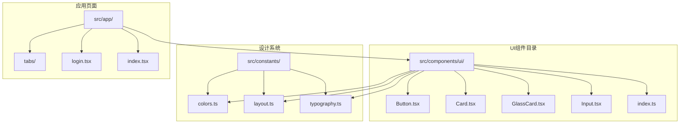
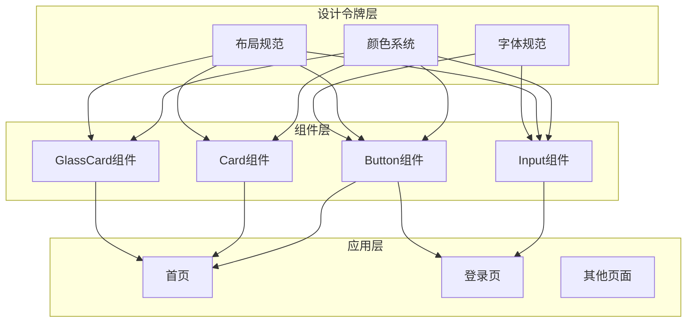
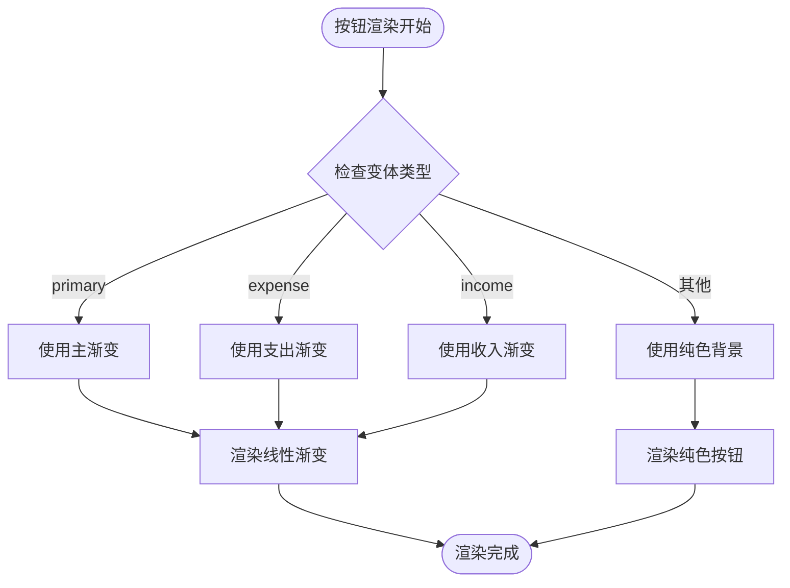
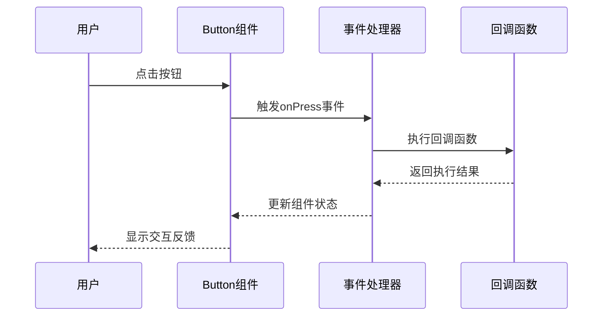
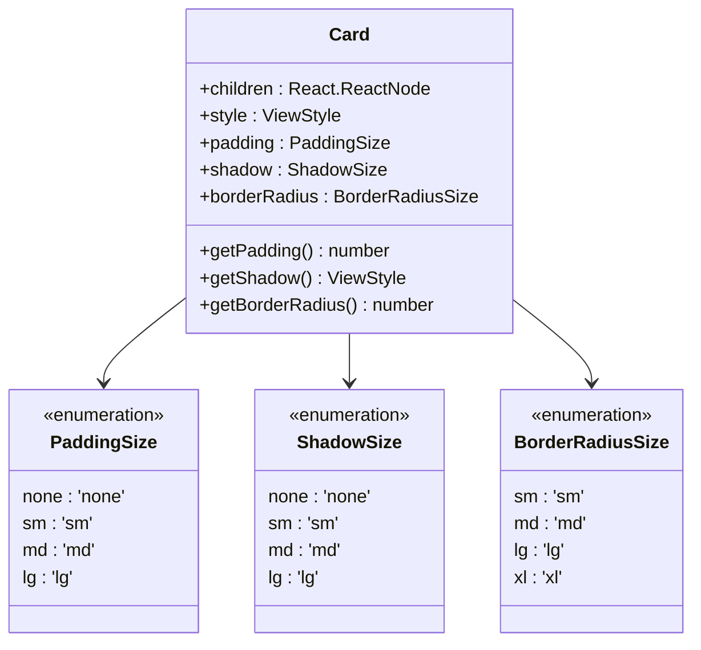
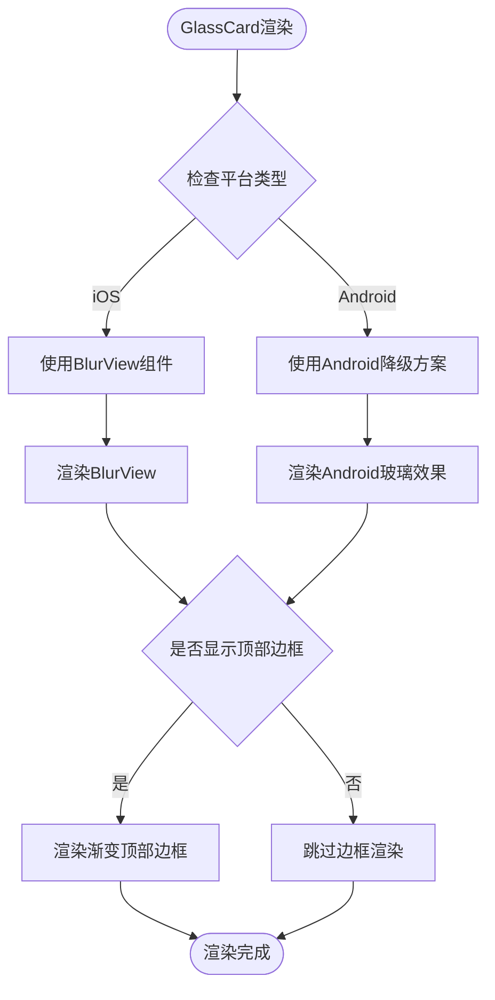
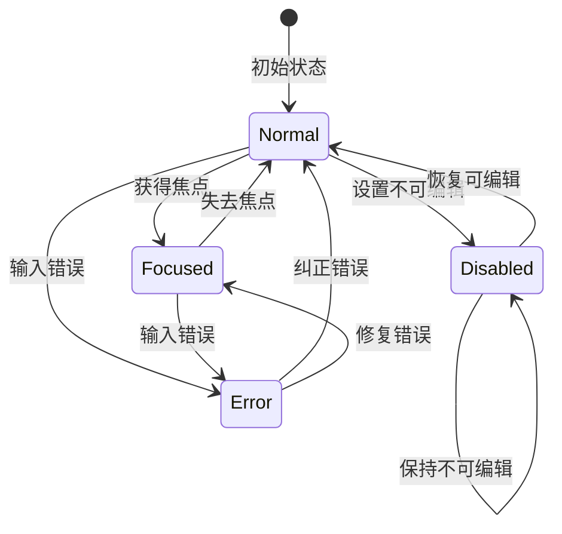
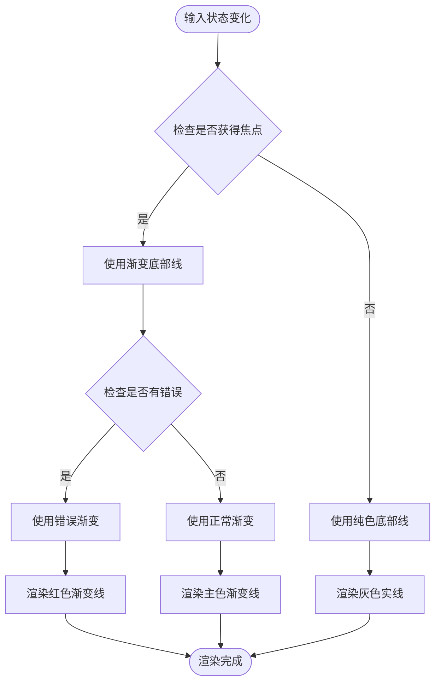
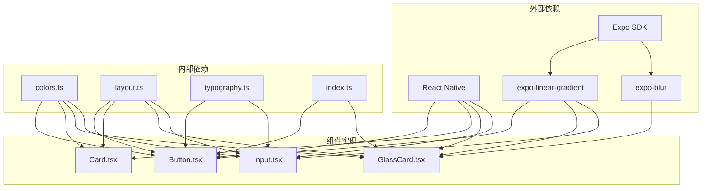

# UI组件系统

<cite>
**本文档引用的文件**
- [src/components/ui/Button.tsx](file://src/components/ui/Button.tsx)
- [src/components/ui/Card.tsx](file://src/components/ui/Card.tsx)
- [src/components/ui/GlassCard.tsx](file://src/components/ui/GlassCard.tsx)
- [src/components/ui/Input.tsx](file://src/components/ui/Input.tsx)
- [src/components/ui/index.ts](file://src/components/ui/index.ts)
- [src/constants/colors.ts](file://src/constants/colors.ts)
- [src/constants/layout.ts](file://src/constants/layout.ts)
- [src/constants/typography.ts](file://src/constants/typography.ts)
- [src/types/index.ts](file://src/types/index.ts)
- [src/app/(tabs)/index.tsx](file://src/app/(tabs)/index.tsx)
- [src/app/login.tsx](file://src/app/login.tsx)
</cite>

## 目录
1. [简介](#简介)
2. [项目结构](#项目结构)
3. [核心组件](#核心组件)
4. [架构概览](#架构概览)
5. [详细组件分析](#详细组件分析)
6. [依赖关系分析](#依赖关系分析)
7. [性能考虑](#性能考虑)
8. [故障排除指南](#故障排除指南)
9. [结论](#结论)
10. [附录](#附录)

## 简介

攒钱记账应用的UI组件系统是一个基于React Native构建的现代化设计系统，专注于渐变设计和玻璃态UI体验。该系统通过统一的设计语言、可复用的组件库和灵活的样式定制，为用户提供一致且美观的移动应用界面。

组件系统的核心设计理念包括：
- **渐变设计系统**：使用精心设计的渐变色彩方案，营造现代感和活力
- **玻璃态UI**：通过半透明效果和模糊技术创造层次丰富的视觉体验
- **响应式设计**：适配不同屏幕尺寸和设备类型
- **无障碍访问**：确保组件的可访问性和可用性
- **模块化架构**：清晰的组件分离和依赖管理

## 项目结构

UI组件系统采用模块化组织方式，主要文件结构如下：

**图表来源**
- [src/components/ui/index.ts](file://src/components/ui/index.ts#L1-L9)
- [src/components/ui/Button.tsx](file://src/components/ui/Button.tsx#L1-L204)
- [src/components/ui/Card.tsx](file://src/components/ui/Card.tsx#L1-L94)
- [src/components/ui/GlassCard.tsx](file://src/components/ui/GlassCard.tsx#L1-L126)
- [src/components/ui/Input.tsx](file://src/components/ui/Input.tsx#L1-L194)

**章节来源**
- [src/components/ui/index.ts](file://src/components/ui/index.ts#L1-L9)
- [src/components/ui/Button.tsx](file://src/components/ui/Button.tsx#L1-L204)
- [src/components/ui/Card.tsx](file://src/components/ui/Card.tsx#L1-L94)
- [src/components/ui/GlassCard.tsx](file://src/components/ui/GlassCard.tsx#L1-L126)
- [src/components/ui/Input.tsx](file://src/components/ui/Input.tsx#L1-L194)

## 核心组件

UI组件系统包含四个核心组件，每个都经过精心设计以满足不同的使用场景：

### Button（渐变按钮）
Button组件提供多种变体和尺寸选择，支持渐变背景、图标集成和加载状态。

### Card（卡片容器）
Card组件作为基础容器组件，提供统一的内边距、圆角和阴影样式。

### GlassCard（玻璃卡片）
GlassCard组件实现独特的玻璃态效果，通过半透明背景和模糊技术创造深度感。

### Input（输入框）
Input组件提供完整的表单输入功能，包括标签、错误状态和图标支持。

**章节来源**
- [src/components/ui/Button.tsx](file://src/components/ui/Button.tsx#L19-L34)
- [src/components/ui/Card.tsx](file://src/components/ui/Card.tsx#L10-L16)
- [src/components/ui/GlassCard.tsx](file://src/components/ui/GlassCard.tsx#L13-L20)
- [src/components/ui/Input.tsx](file://src/components/ui/Input.tsx#L20-L39)

## 架构概览

组件系统采用分层架构设计，通过设计令牌和类型定义实现松耦合的组件结构：

**图表来源**
- [src/constants/colors.ts](file://src/constants/colors.ts#L6-L88)
- [src/constants/layout.ts](file://src/constants/layout.ts#L8-L182)
- [src/constants/typography.ts](file://src/constants/typography.ts#L9-L149)
- [src/app/(tabs)/index.tsx](file://src/app/(tabs)/index.tsx#L17-L21)
- [src/app/login.tsx](file://src/app/login.tsx#L18-L21)

## 详细组件分析

### Button组件分析

Button组件是渐变设计系统的核心体现，支持六种不同的变体和四种尺寸规格。

#### 组件属性接口

| 属性名 | 类型 | 默认值 | 描述 |
|--------|------|--------|------|
| title | string | - | 按钮显示文本 |
| onPress | () => void | - | 点击事件处理器 |
| variant | 'primary' \| 'secondary' \| 'outline' \| 'ghost' \| 'expense' \| 'income' | 'primary' | 按钮外观变体 |
| size | 'sm' \| 'md' \| 'lg' \| 'xl' | 'lg' | 按钮尺寸 |
| disabled | boolean | false | 是否禁用按钮 |
| loading | boolean | false | 是否显示加载状态 |
| icon | React.ReactNode | - | 左侧图标组件 |
| iconPosition | 'left' \| 'right' | 'left' | 图标位置 |
| fullWidth | boolean | false | 是否占满父容器宽度 |
| style | ViewStyle | - | 自定义样式覆盖 |
| textStyle | TextStyle | - | 自定义文本样式 |

#### 渐变设计系统实现

Button组件通过Gradients配置实现渐变效果：

**图表来源**
- [src/components/ui/Button.tsx](file://src/components/ui/Button.tsx#L100-L110)
- [src/constants/colors.ts](file://src/constants/colors.ts#L78-L85)

#### 事件处理机制

Button组件实现了完整的事件处理流程：

**图表来源**
- [src/components/ui/Button.tsx](file://src/components/ui/Button.tsx#L36-L48)
- [src/components/ui/Button.tsx](file://src/components/ui/Button.tsx#L159-L188)

**章节来源**
- [src/components/ui/Button.tsx](file://src/components/ui/Button.tsx#L19-L34)
- [src/components/ui/Button.tsx](file://src/components/ui/Button.tsx#L53-L88)
- [src/components/ui/Button.tsx](file://src/components/ui/Button.tsx#L100-L110)
- [src/components/ui/Button.tsx](file://src/components/ui/Button.tsx#L159-L188)

### Card组件分析

Card组件作为基础容器组件，提供统一的视觉样式和布局能力。

#### 组件属性接口

| 属性名 | 类型 | 默认值 | 描述 |
|--------|------|--------|------|
| children | React.ReactNode | - | 子组件内容 |
| style | ViewStyle | - | 自定义样式 |
| padding | 'none' \| 'sm' \| 'md' \| 'lg' | 'md' | 内边距大小 |
| shadow | 'none' \| 'sm' \| 'md' \| 'lg' | 'md' | 阴影强度 |
| borderRadius | 'sm' \| 'md' \| 'lg' \| 'xl' | 'xl' | 圆角半径 |

#### 样式定制选项

Card组件通过设计令牌实现灵活的样式定制：

**图表来源**
- [src/components/ui/Card.tsx](file://src/components/ui/Card.tsx#L10-L16)
- [src/constants/layout.ts](file://src/constants/layout.ts#L22-L34)
- [src/constants/layout.ts](file://src/constants/layout.ts#L37-L110)

**章节来源**
- [src/components/ui/Card.tsx](file://src/components/ui/Card.tsx#L18-L68)
- [src/components/ui/Card.tsx](file://src/components/ui/Card.tsx#L70-L84)

### GlassCard组件分析

GlassCard组件实现独特的玻璃态UI效果，通过半透明背景和模糊技术创造深度感。

#### 组件属性接口

| 属性名 | 类型 | 默认值 | 描述 |
|--------|------|--------|------|
| children | React.ReactNode | - | 子组件内容 |
| style | ViewStyle | - | 自定义样式 |
| intensity | number | 50 | 模糊强度 (Android) |
| padding | 'none' \| 'sm' \| 'md' \| 'lg' | 'md' | 内边距大小 |
| showTopBorder | boolean | false | 是否显示顶部边框 |
| bookType | AccountBookType \| 'both' | - | 账本类型标识 |

#### 跨平台兼容性实现

GlassCard组件针对不同平台提供优化的实现：

**图表来源**
- [src/components/ui/GlassCard.tsx](file://src/components/ui/GlassCard.tsx#L72-L88)
- [src/components/ui/GlassCard.tsx](file://src/components/ui/GlassCard.tsx#L90-L106)

#### 玻璃态UI设计原理

GlassCard通过以下技术实现玻璃效果：

1. **半透明背景**：使用rgba颜色值实现背景透明度
2. **模糊效果**：iOS使用BlurView，Android使用降级方案
3. **渐变边框**：可选的顶部渐变边框增强视觉层次
4. **阴影系统**：统一的阴影系统确保视觉一致性

**章节来源**
- [src/components/ui/GlassCard.tsx](file://src/components/ui/GlassCard.tsx#L22-L68)
- [src/components/ui/GlassCard.tsx](file://src/components/ui/GlassCard.tsx#L72-L106)

### Input组件分析

Input组件提供完整的表单输入功能，支持多种输入类型和状态管理。

#### 组件属性接口

| 属性名 | 类型 | 默认值 | 描述 |
|--------|------|--------|------|
| value | string | - | 输入框当前值 |
| onChangeText | (text: string) => void | - | 文本变更回调 |
| placeholder | string | - | 占位符文本 |
| label | string | - | 标签文本 |
| error | string | - | 错误信息 |
| leftIcon | React.ReactNode | - | 左侧图标 |
| rightIcon | React.ReactNode | - | 右侧图标 |
| secureTextEntry | boolean | false | 密码输入模式 |
| keyboardType | 'default' \| 'email-address' \| 'numeric' \| 'phone-pad' | 'default' | 键盘类型 |
| autoCapitalize | 'none' \| 'sentences' \| 'words' \| 'characters' | 'none' | 自动大写 |
| multiline | boolean | false | 多行输入 |
| numberOfLines | number | 1 | 多行行数 |
| maxLength | number | - | 最大长度 |
| editable | boolean | true | 是否可编辑 |
| style | ViewStyle | - | 容器样式 |
| inputStyle | TextStyle | - | 输入框样式 |
| onFocus | () => void | - | 获得焦点回调 |
| onBlur | () => void | - | 失去焦点回调 |

#### 状态管理系统

Input组件实现了完整的状态管理机制：

**图表来源**
- [src/components/ui/Input.tsx](file://src/components/ui/Input.tsx#L61-L71)
- [src/components/ui/Input.tsx](file://src/components/ui/Input.tsx#L115-L131)

#### 渐变底部线设计

Input组件通过渐变底部线实现视觉引导：

**图表来源**
- [src/components/ui/Input.tsx](file://src/components/ui/Input.tsx#L115-L131)
- [src/components/ui/Input.tsx](file://src/components/ui/Input.tsx#L180-L186)

**章节来源**
- [src/components/ui/Input.tsx](file://src/components/ui/Input.tsx#L41-L71)
- [src/components/ui/Input.tsx](file://src/components/ui/Input.tsx#L115-L131)
- [src/components/ui/Input.tsx](file://src/components/ui/Input.tsx#L180-L191)

## 依赖关系分析

UI组件系统通过设计令牌实现松耦合的依赖关系：

**图表来源**
- [src/components/ui/Button.tsx](file://src/components/ui/Button.tsx#L5-L17)
- [src/components/ui/GlassCard.tsx](file://src/components/ui/GlassCard.tsx#L6-L11)
- [src/components/ui/Input.tsx](file://src/components/ui/Input.tsx#L14-L18)
- [src/constants/colors.ts](file://src/constants/colors.ts#L1-L88)
- [src/constants/layout.ts](file://src/constants/layout.ts#L1-L182)
- [src/constants/typography.ts](file://src/constants/typography.ts#L1-L149)
- [src/types/index.ts](file://src/types/index.ts#L1-L141)

**章节来源**
- [src/components/ui/Button.tsx](file://src/components/ui/Button.tsx#L5-L17)
- [src/components/ui/GlassCard.tsx](file://src/components/ui/GlassCard.tsx#L6-L11)
- [src/components/ui/Input.tsx](file://src/components/ui/Input.tsx#L14-L18)

## 性能考虑

UI组件系统在设计时充分考虑了性能优化：

### 渲染优化
- 使用StyleSheet.create缓存样式对象
- 避免在渲染过程中创建新的样式对象
- 合理使用flexbox布局减少重排

### 内存管理
- 组件状态最小化存储
- 及时清理事件监听器
- 合理使用React.memo避免不必要的重渲染

### 平台特定优化
- iOS使用原生BlurView组件
- Android使用降级方案确保性能
- 条件渲染减少DOM节点数量

## 故障排除指南

### 常见问题及解决方案

#### 渐变显示异常
**问题描述**：按钮或输入框的渐变效果不显示
**解决方案**：
1. 检查Gradients配置是否正确导入
2. 确认LinearGradient组件版本兼容性
3. 验证颜色值格式是否正确

#### 玻璃态效果失效
**问题描述**：GlassCard组件在某些设备上显示异常
**解决方案**：
1. 检查expo-blur包是否正确安装
2. 验证平台兼容性代码
3. 调整intensity参数值

#### 样式冲突
**问题描述**：自定义样式覆盖默认样式导致显示异常
**解决方案**：
1. 使用StyleSheet.flatten合并样式
2. 避免过度覆盖组件内部样式
3. 使用style属性进行局部样式调整

**章节来源**
- [src/components/ui/Button.tsx](file://src/components/ui/Button.tsx#L167-L174)
- [src/components/ui/GlassCard.tsx](file://src/components/ui/GlassCard.tsx#L100-L104)
- [src/components/ui/Input.tsx](file://src/components/ui/Input.tsx#L117-L122)

## 结论

攒钱记账应用的UI组件系统通过精心设计的渐变色彩、玻璃态效果和响应式布局，为用户提供了现代化的移动应用体验。系统采用模块化的架构设计，通过统一的设计令牌实现了一致的视觉语言和灵活的定制能力。

核心优势包括：
- **设计一致性**：统一的颜色、字体和布局规范
- **跨平台兼容**：iOS和Android的差异化优化
- **可扩展性**：模块化的组件架构便于功能扩展
- **性能优化**：合理的渲染策略和内存管理
- **无障碍支持**：考虑可访问性的设计原则

该组件系统为设计师和开发者提供了完整的工具集，既保证了视觉美感，又确保了良好的用户体验和开发效率。

## 附录

### 组件使用最佳实践

#### Button组件使用建议
- 优先使用primary变体作为主要操作按钮
- 在重要操作中使用expense或income变体
- 合理使用loading状态提升用户体验
- 图标位置应符合用户习惯

#### Card组件使用建议
- 根据内容重要性选择合适的阴影级别
- 使用适当的内边距确保内容可读性
- 圆角半径应与整体设计风格协调

#### GlassCard组件使用建议
- 仅在需要强调层次感的场景使用
- 注意对比度确保内容可读性
- 合理控制模糊强度避免视觉疲劳

#### Input组件使用建议
- 提供清晰的标签和占位符
- 及时显示错误状态和提示信息
- 合理设置键盘类型提高输入效率

### 设计令牌参考

#### 颜色系统
- 主色调：#00B4A0 到 #4CAF50 的渐变
- 状态颜色：success(#10B981)、warning(#F59E0B)、error(#EF4444)、info(#3B82F6)
- 灰度系统：从#F9FAFB到#111827的完整灰阶

#### 布局规范
- 圆角：xs(4)、sm(8)、md(12)、lg(16)、xl(20)、2xl(24)、full(9999)
- 间距：xs(4)、sm(8)、md(12)、base(16)、lg(20)、xl(24)、2xl(32)
- 阴影：sm(1)、md(3)、lg(6)、xl(12)

#### 字体规范
- 字体家族：System(iOS)、Roboto(Android)
- 字体大小：xs(10)、sm(12)、base(14)、md(16)、lg(18)、xl(20)
- 字重：regular(400)、medium(500)、semibold(600)、bold(700)