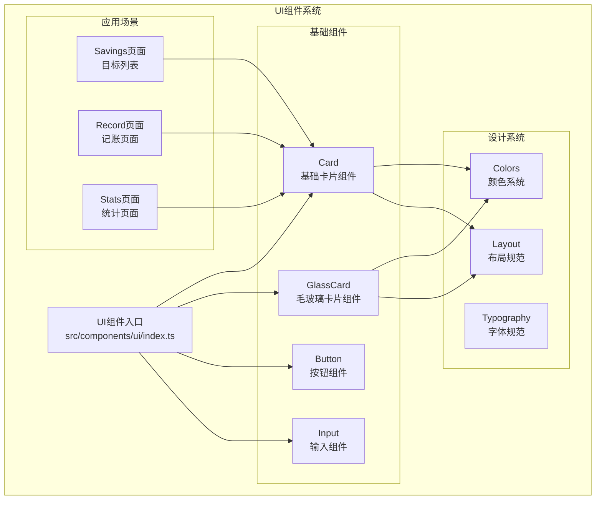
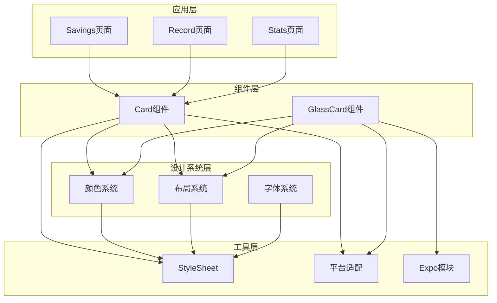
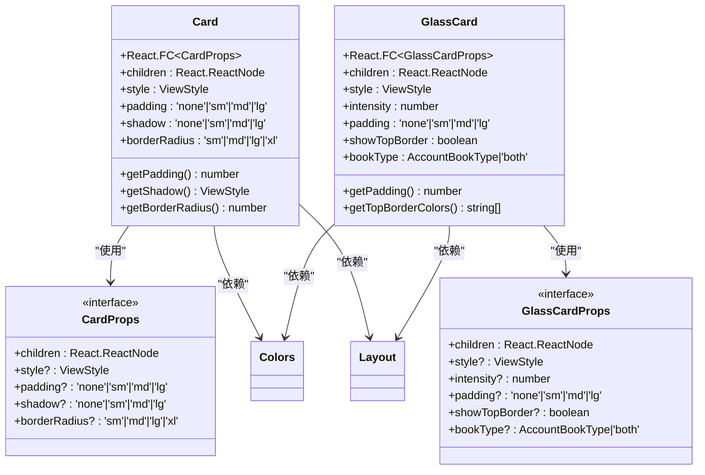
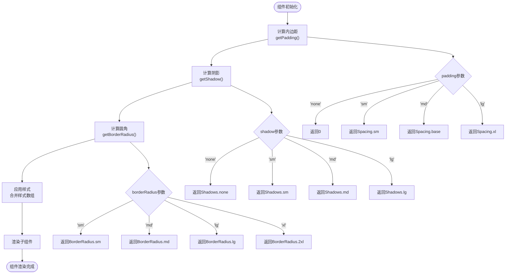
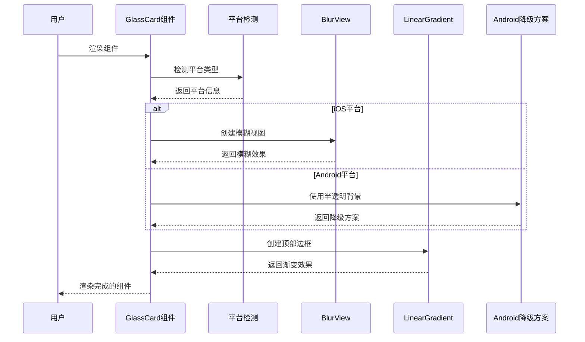
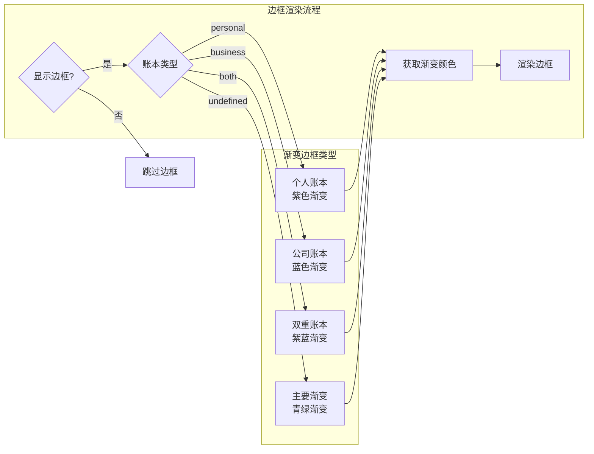
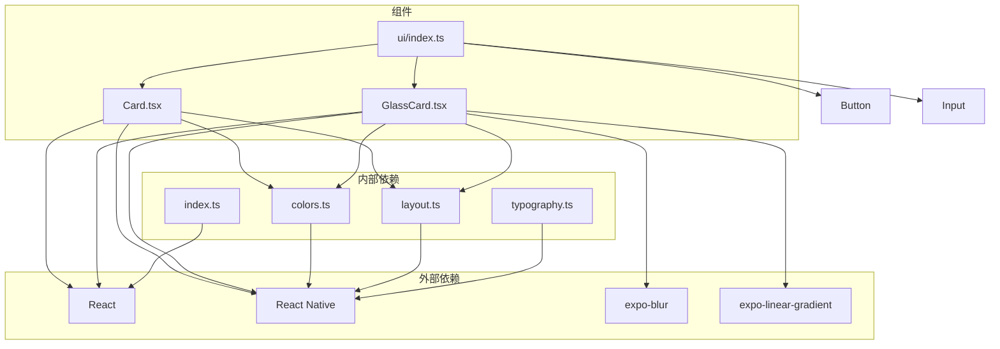
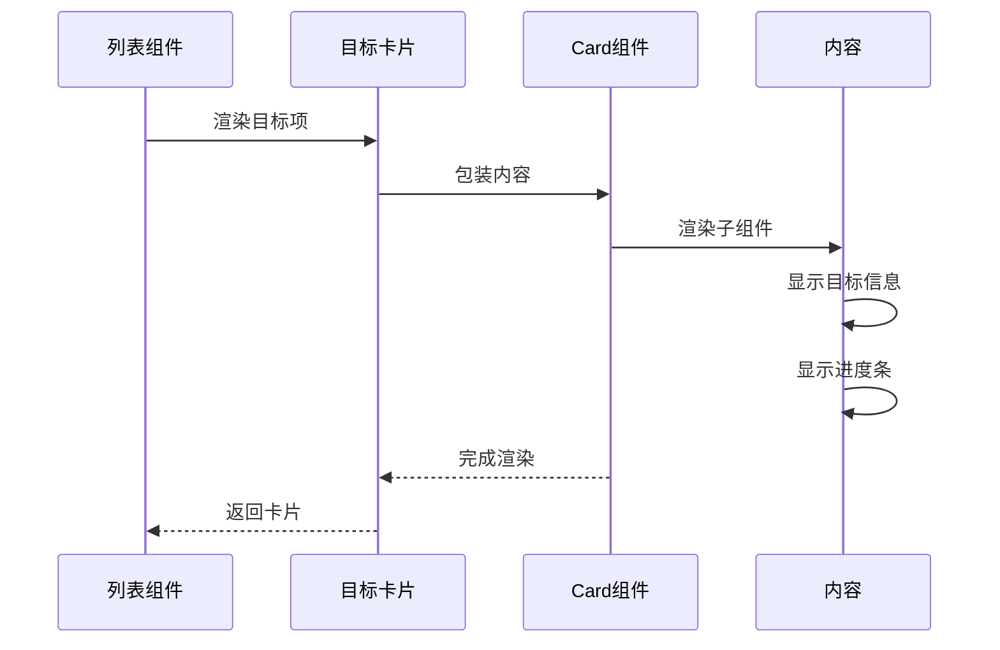
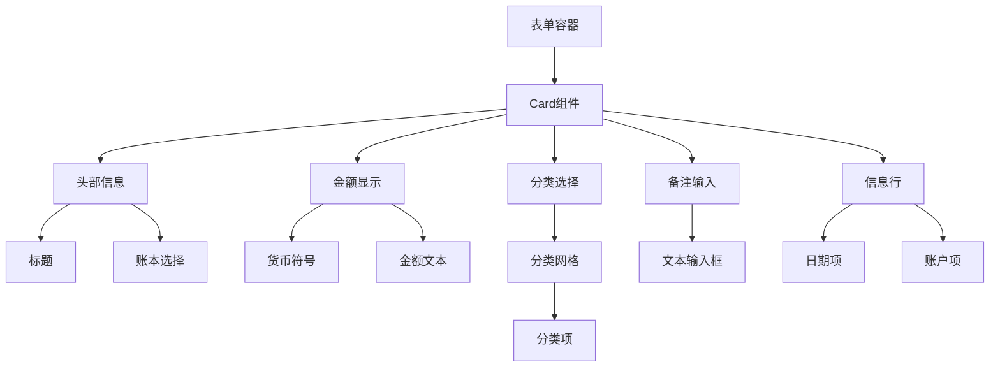

# 卡片组件

<cite>
**本文档引用的文件**
- [Card.tsx](file://src/components/ui/Card.tsx)
- [GlassCard.tsx](file://src/components/ui/GlassCard.tsx)
- [index.ts](file://src/components/ui/index.ts)
- [colors.ts](file://src/constants/colors.ts)
- [layout.ts](file://src/constants/layout.ts)
- [typography.ts](file://src/constants/typography.ts)
- [savings/index.tsx](file://src/app/savings/index.tsx)
- [record.tsx](file://src/app/(tabs)/record.tsx)
- [index.ts](file://src/types/index.ts)
</cite>

## 目录
1. [简介](#简介)
2. [项目结构](#项目结构)
3. [核心组件](#核心组件)
4. [架构概览](#架构概览)
5. [详细组件分析](#详细组件分析)
6. [依赖关系分析](#依赖关系分析)
7. [性能考虑](#性能考虑)
8. [故障排除指南](#故障排除指南)
9. [结论](#结论)
10. [附录](#附录)

## 简介

卡片组件是现代移动应用界面设计中的重要元素，用于组织和展示信息内容。本文档深入介绍了Money应用中的Card组件系统，包括基础卡片组件、毛玻璃卡片组件的设计理念、实现细节和最佳实践。

Card组件采用现代化的设计语言，结合了圆角、阴影和色彩系统，为用户提供清晰的信息层次和视觉引导。组件支持多种配置选项，能够适应不同的使用场景，从简单的信息展示到复杂的交互式内容容器。

## 项目结构

Money应用采用模块化的组件架构，UI组件集中管理在`src/components/ui/`目录下，形成了完整的组件生态系统。



**图表来源**
- [index.ts](file://src/components/ui/index.ts#L1-L9)
- [colors.ts](file://src/constants/colors.ts#L1-L88)
- [layout.ts](file://src/constants/layout.ts#L1-L182)

**章节来源**
- [index.ts](file://src/components/ui/index.ts#L1-L9)
- [colors.ts](file://src/constants/colors.ts#L1-L88)
- [layout.ts](file://src/constants/layout.ts#L1-L182)

## 核心组件

### Card组件概述

Card组件是Money应用中最基础的卡片组件，提供了灵活的内容容器功能。该组件通过组合设计系统中的颜色、间距和阴影规范，实现了统一的视觉体验。

#### 核心特性

- **响应式设计**：支持不同屏幕尺寸和设备类型的适配
- **可定制化**：提供多种配置选项满足不同场景需求
- **性能优化**：采用React Native原生组件实现，确保流畅的用户体验
- **无障碍支持**：遵循React Native的无障碍访问标准

#### 设计规范集成

Card组件深度集成了应用的设计系统，包括：

- **颜色系统**：使用统一的色彩语义，确保视觉一致性
- **间距规范**：遵循严格的间距体系，创造舒适的视觉节奏
- **圆角规范**：采用渐进式的圆角设计，符合现代UI趋势
- **阴影系统**：精心设计的阴影层级，营造立体感和层次感

**章节来源**
- [Card.tsx](file://src/components/ui/Card.tsx#L1-L94)
- [colors.ts](file://src/constants/colors.ts#L34-L37)
- [layout.ts](file://src/constants/layout.ts#L8-L19)

## 架构概览

Card组件系统采用分层架构设计，通过清晰的职责分离实现了高度的模块化和可维护性。



**图表来源**
- [Card.tsx](file://src/components/ui/Card.tsx#L5-L8)
- [GlassCard.tsx](file://src/components/ui/GlassCard.tsx#L5-L11)
- [colors.ts](file://src/constants/colors.ts#L6-L75)
- [layout.ts](file://src/constants/layout.ts#L6-L110)

### 组件关系图



**图表来源**
- [Card.tsx](file://src/components/ui/Card.tsx#L10-L16)
- [GlassCard.tsx](file://src/components/ui/GlassCard.tsx#L13-L20)
- [colors.ts](file://src/constants/colors.ts#L6-L75)
- [layout.ts](file://src/constants/layout.ts#L8-L110)

**章节来源**
- [Card.tsx](file://src/components/ui/Card.tsx#L1-L94)
- [GlassCard.tsx](file://src/components/ui/GlassCard.tsx#L1-L126)

## 详细组件分析

### Card组件详解

Card组件是应用中最基础的卡片组件，提供了灵活的内容容器功能。该组件通过组合设计系统中的颜色、间距和阴影规范，实现了统一的视觉体验。

#### 属性配置

| 属性名 | 类型 | 默认值 | 描述 |
|--------|------|--------|------|
| children | React.ReactNode | 必需 | 卡片内容 |
| style | ViewStyle | undefined | 自定义样式覆盖 |
| padding | 'none' \| 'sm' \| 'md' \| 'lg' | 'md' | 内边距大小 |
| shadow | 'none' \| 'sm' \| 'md' \| 'lg' | 'md' | 阴影效果强度 |
| borderRadius | 'sm' \| 'md' \| 'lg' \| 'xl' | 'xl' | 圆角半径大小 |

#### 实现原理

Card组件通过函数式组件实现，采用条件渲染和动态样式计算的方式，根据传入的配置参数生成相应的样式对象。



**图表来源**
- [Card.tsx](file://src/components/ui/Card.tsx#L25-L68)

#### 使用场景

Card组件在应用中有多种使用场景：

1. **内容展示**：作为信息块的容器，提供清晰的视觉边界
2. **列表项**：在列表中展示单项信息，支持点击交互
3. **信息容器**：组织相关的控件和文本内容
4. **表单区域**：将相关的表单字段组织在一个容器中

**章节来源**
- [Card.tsx](file://src/components/ui/Card.tsx#L18-L85)

### GlassCard组件详解

GlassCard组件是Card组件的增强版本，提供了毛玻璃效果和渐变边框功能，营造更加现代和优雅的视觉体验。

#### 特殊属性

| 属性名 | 类型 | 默认值 | 描述 |
|--------|------|--------|------|
| intensity | number | 50 | 毛玻璃效果强度 |
| showTopBorder | boolean | false | 是否显示顶部渐变边框 |
| bookType | AccountBookType \| 'both' | undefined | 账本类型，用于边框颜色 |

#### 平台适配

GlassCard组件针对不同平台进行了专门的优化：



**图表来源**
- [GlassCard.tsx](file://src/components/ui/GlassCard.tsx#L72-L88)
- [GlassCard.tsx](file://src/components/ui/GlassCard.tsx#L90-L106)

#### 渐变边框系统

GlassCard组件支持多种渐变边框效果，根据不同的账本类型和使用场景提供视觉反馈：



**图表来源**
- [GlassCard.tsx](file://src/components/ui/GlassCard.tsx#L45-L58)

**章节来源**
- [GlassCard.tsx](file://src/components/ui/GlassCard.tsx#L22-L107)

### 设计系统集成

Card组件深度集成了应用的设计系统，确保所有组件都遵循统一的设计规范。

#### 颜色系统集成

Card组件使用统一的颜色语义，包括：

- **卡片背景色**：使用`Colors.card`作为默认背景色
- **文字颜色**：使用`Colors.text.primary`确保良好的对比度
- **边框颜色**：使用`Colors.border`保持视觉一致性

#### 间距系统集成

Card组件支持完整的间距系统，包括：

- **xs**: 4px
- **sm**: 8px  
- **md**: 12px
- **lg**: 20px
- **xl**: 24px

#### 圆角系统集成

Card组件采用渐进式的圆角设计：

- **sm**: 8px
- **md**: 12px
- **lg**: 16px
- **xl**: 20px
- **2xl**: 24px

#### 阴影系统集成

Card组件提供多种阴影效果：

- **none**: 无阴影
- **sm**: 轻微阴影
- **md**: 默认阴影
- **lg**: 加强阴影

**章节来源**
- [colors.ts](file://src/constants/colors.ts#L34-L37)
- [layout.ts](file://src/constants/layout.ts#L21-L34)
- [layout.ts](file://src/constants/layout.ts#L8-L19)
- [layout.ts](file://src/constants/layout.ts#L36-L110)

## 依赖关系分析

Card组件系统具有清晰的依赖关系，通过模块化设计实现了高度的解耦和可维护性。



**图表来源**
- [Card.tsx](file://src/components/ui/Card.tsx#L5-L8)
- [GlassCard.tsx](file://src/components/ui/GlassCard.tsx#L5-L11)
- [index.ts](file://src/components/ui/index.ts#L5-L8)

### 组件使用模式

Card组件在应用中有多种使用模式，展示了组件的灵活性和适应性。

#### 列表项模式

在储蓄目标列表中，Card组件被用作列表项容器：



**图表来源**
- [savings/index.tsx](file://src/app/savings/index.tsx#L68-L119)

#### 表单容器模式

在记账页面中，Card组件被用作表单区域的容器：



**图表来源**
- [record.tsx](file://src/app/(tabs)/record.tsx#L221-L276)

**章节来源**
- [savings/index.tsx](file://src/app/savings/index.tsx#L68-L119)
- [record.tsx](file://src/app/(tabs)/record.tsx#L221-L276)

## 性能考虑

Card组件在设计时充分考虑了性能优化，采用了多种策略确保在各种设备上都能提供流畅的用户体验。

### 渲染优化

1. **样式缓存**：通过静态样式定义减少运行时计算
2. **条件渲染**：根据属性值进行条件渲染，避免不必要的DOM操作
3. **平台适配**：针对iOS和Android平台进行专门优化

### 内存管理

1. **组件卸载**：正确处理组件生命周期，避免内存泄漏
2. **事件处理**：使用防抖和节流技术优化事件处理
3. **资源管理**：合理管理图片和其他资源的加载和释放

### 渲染性能

1. **FlatList优化**：在列表场景中使用FlatList提高渲染效率
2. **虚拟化**：对不可见元素进行虚拟化处理
3. **批处理**：将多个状态更新批处理以减少重渲染

## 故障排除指南

### 常见问题及解决方案

#### 阴影效果不显示

**问题描述**：在某些Android设备上，卡片阴影效果可能不显示或显示异常。

**解决方案**：
1. 确保使用`Shadows`常量而不是自定义阴影值
2. 检查`elevation`属性的设置
3. 验证父容器的`overflow`属性设置

#### 圆角显示异常

**问题描述**：卡片圆角在某些情况下可能显示不完整或出现锯齿。

**解决方案**：
1. 使用`BorderRadius`常量确保圆角值的一致性
2. 检查父容器的`overflow: hidden`设置
3. 验证`borderRadius`属性的数值范围

#### 毛玻璃效果兼容性

**问题描述**：在Android设备上，毛玻璃效果可能无法正常显示。

**解决方案**：
1. 确保`expo-blur`包已正确安装和配置
2. 检查平台检测逻辑
3. 准备Android降级方案

### 调试技巧

1. **样式调试**：使用React Native DevTools检查样式应用情况
2. **性能监控**：使用Flipper监控组件渲染性能
3. **平台测试**：在不同设备和平台上测试组件表现

**章节来源**
- [Card.tsx](file://src/components/ui/Card.tsx#L40-L53)
- [GlassCard.tsx](file://src/components/ui/GlassCard.tsx#L71-L88)

## 结论

Money应用的Card组件系统展现了现代移动应用UI设计的最佳实践。通过精心设计的组件架构、严格的设计系统集成和全面的性能优化，Card组件为用户提供了统一、美观且高效的交互体验。

组件系统的核心优势包括：

1. **设计一致性**：通过统一的设计系统确保所有组件的视觉一致性
2. **灵活性**：丰富的配置选项满足不同场景的需求
3. **性能优化**：采用多种优化策略确保流畅的用户体验
4. **可维护性**：清晰的架构设计便于后续的维护和扩展

未来可以考虑的功能增强包括：
- 更多的动画效果支持
- 更丰富的交互状态
- 更完善的无障碍访问支持
- 更灵活的主题定制能力

## 附录

### 使用示例

#### 基础卡片使用

```typescript
// 简单的文本卡片
<Card>
  <Text>这是卡片内容</Text>
</Card>

// 带有内边距的卡片
<Card padding="lg">
  <Text>大内边距的卡片</Text>
</Card>

// 带有阴影的卡片
<Card shadow="lg">
  <Text>加强阴影的卡片</Text>
</Card>
```

#### 高级卡片使用

```typescript
// 毛玻璃卡片
<GlassCard showTopBorder bookType="personal">
  <Text>毛玻璃效果的卡片</Text>
</GlassCard>

// 自定义强度的毛玻璃卡片
<GlassCard intensity={70}>
  <Text>高透明度的毛玻璃效果</Text>
</GlassCard>
```

### 最佳实践

1. **样式优先级**：优先使用设计系统提供的样式，避免直接修改样式
2. **性能考虑**：在列表中使用FlatList，避免不必要的重新渲染
3. **可访问性**：确保足够的对比度和适当的触摸目标大小
4. **响应式设计**：考虑不同屏幕尺寸和方向的适配
5. **错误处理**：为异步内容提供加载状态和错误状态

### 设计规范

- **颜色使用**：遵循颜色语义，确保信息传达的准确性
- **间距规范**：使用统一的间距系统，创造舒适的视觉节奏
- **字体选择**：使用系统字体，确保跨平台一致性
- **交互反馈**：提供适当的视觉和触觉反馈