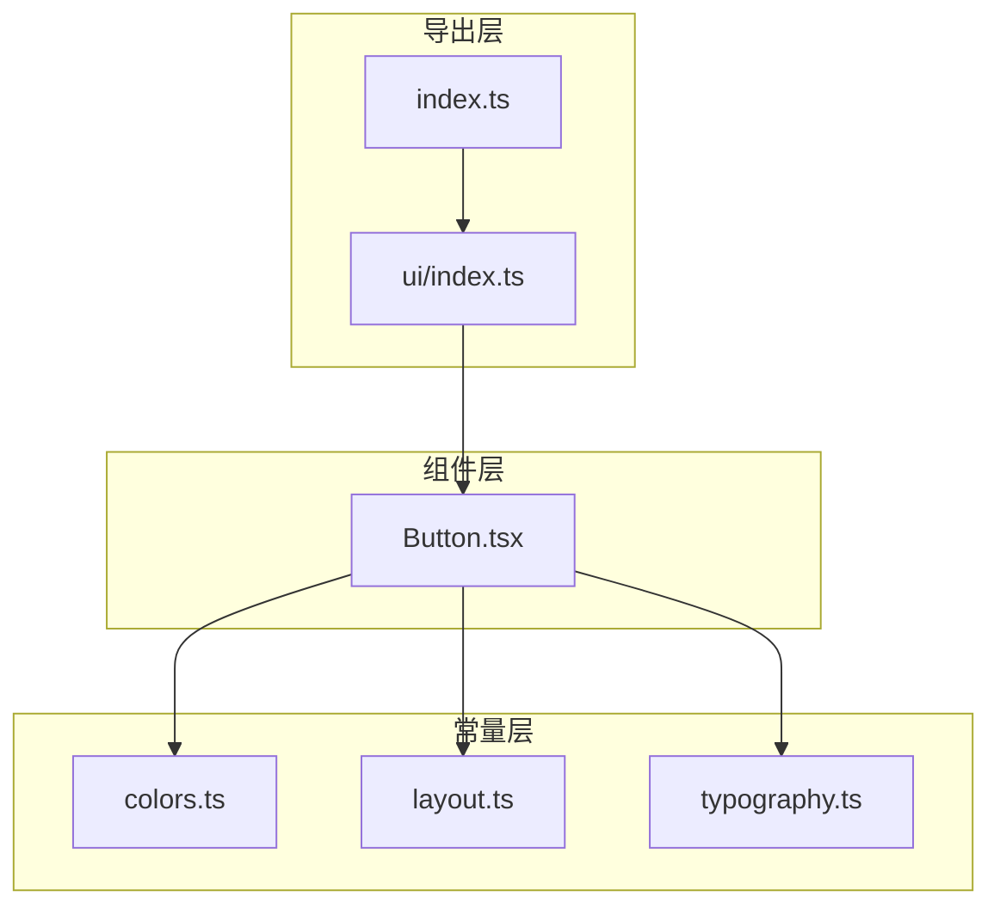
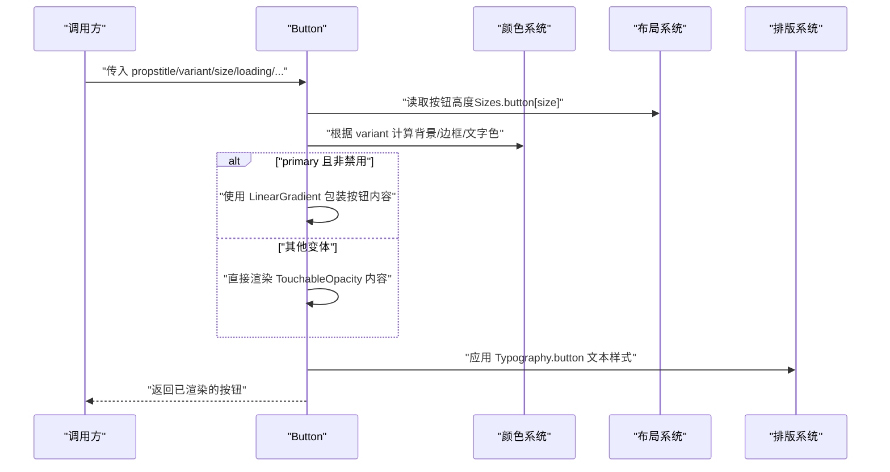
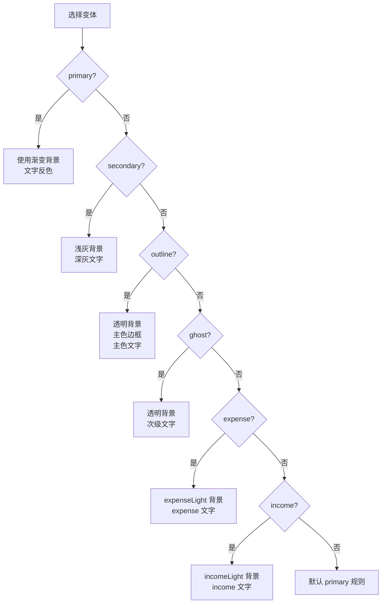
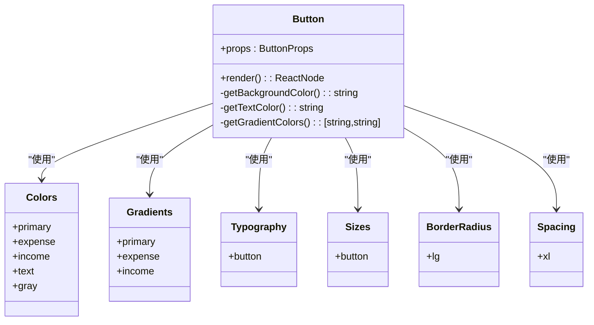
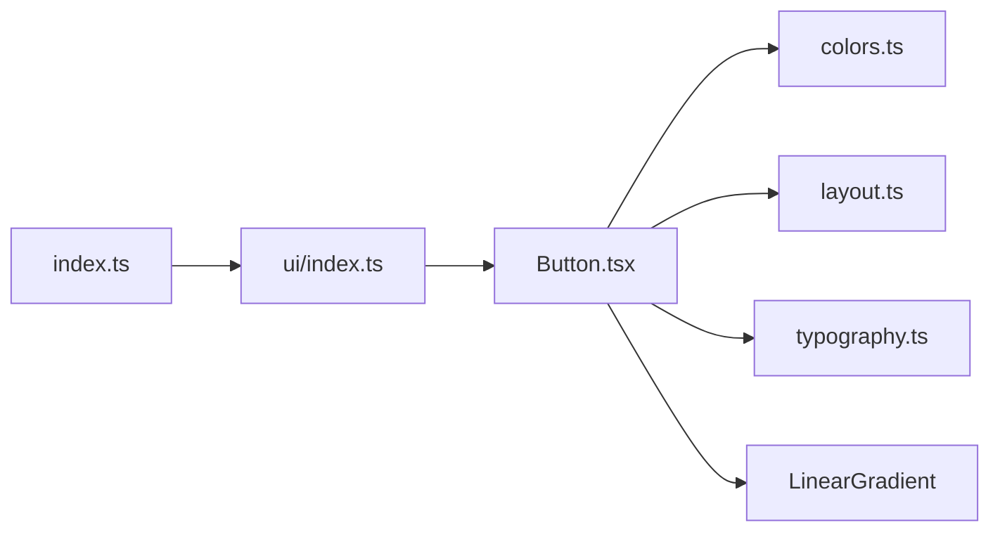

# 按钮组件

<cite>
**本文引用的文件**
- [Button.tsx](file://src/components/ui/Button.tsx)
- [colors.ts](file://src/constants/colors.ts)
- [layout.ts](file://src/constants/layout.ts)
- [typography.ts](file://src/constants/typography.ts)
- [ui/index.ts](file://src/components/ui/index.ts)
- [index.ts](file://src/components/index.ts)
</cite>

## 目录
1. [简介](#简介)
2. [项目结构](#项目结构)
3. [核心组件](#核心组件)
4. [架构总览](#架构总览)
5. [详细组件分析](#详细组件分析)
6. [依赖关系分析](#依赖关系分析)
7. [性能考量](#性能考量)
8. [故障排查指南](#故障排查指南)
9. [结论](#结论)
10. [附录](#附录)

## 简介
本文件为按钮组件的完整技术文档，面向开发者与产品设计人员，系统性阐述 Button 组件的设计理念、属性接口、视觉变体、尺寸体系、交互状态、图标支持、全宽模式与自定义样式扩展，并深入解析渐变背景实现原理与颜色系统集成方式。通过分层次的说明与可视化图表，帮助读者快速理解并正确使用该组件。

## 项目结构
按钮组件位于 UI 组件目录中，采用“按功能模块化”的组织方式：
- 组件定义：src/components/ui/Button.tsx
- 样式与主题：src/constants/colors.ts、src/constants/layout.ts、src/constants/typography.ts
- 组件导出：src/components/ui/index.ts、src/components/index.ts

**图表来源**
- [Button.tsx](file://src/components/ui/Button.tsx#L1-L204)
- [colors.ts](file://src/constants/colors.ts#L1-L88)
- [layout.ts](file://src/constants/layout.ts#L1-L182)
- [typography.ts](file://src/constants/typography.ts#L1-L149)
- [ui/index.ts](file://src/components/ui/index.ts#L1-L9)
- [index.ts](file://src/components/index.ts#L1-L6)

**章节来源**
- [Button.tsx](file://src/components/ui/Button.tsx#L1-L204)
- [ui/index.ts](file://src/components/ui/index.ts#L1-L9)
- [index.ts](file://src/components/index.ts#L1-L6)

## 核心组件
- 组件名称：Button
- 文件路径：src/components/ui/Button.tsx
- 类型定义：
  - 变体类型：primary、secondary、outline、ghost、expense、income
  - 尺寸类型：sm、md、lg、xl
- 关键能力：
  - 渐变背景（primary 变体）
  - 禁用与加载状态
  - 左右图标与文本组合
  - 全宽模式
  - 自定义容器与文本样式扩展

**章节来源**
- [Button.tsx](file://src/components/ui/Button.tsx#L19-L34)

## 架构总览
Button 的渲染流程分为“容器样式计算”、“内容渲染”和“渐变包装”三个阶段；其外观由颜色系统、布局规范与排版规范共同决定。

**图表来源**
- [Button.tsx](file://src/components/ui/Button.tsx#L36-L189)
- [colors.ts](file://src/constants/colors.ts#L7-L85)
- [layout.ts](file://src/constants/layout.ts#L134-L140)
- [typography.ts](file://src/constants/typography.ts#L119-L124)

## 详细组件分析

### 属性接口与默认值
- 必填参数
  - title: 按钮显示文本
  - onPress: 点击回调
- 可选参数
  - variant: 变体，默认 primary
  - size: 尺寸，默认 lg
  - disabled: 禁用状态，默认 false
  - loading: 加载状态，默认 false
  - icon: 图标节点，默认无
  - iconPosition: 图标位置，默认 left
  - fullWidth: 是否全宽，默认 false
  - style: 容器样式扩展
  - textStyle: 文本样式扩展

**章节来源**
- [Button.tsx](file://src/components/ui/Button.tsx#L22-L34)

### 变体与视觉效果
- primary
  - 背景：渐变（主色渐变）
  - 文字：反色（inverse）
  - 交互：半透明点击反馈
- secondary
  - 背景：浅灰（gray[100]）
  - 文字：深灰（text.primary）
  - 无边框
- outline
  - 背景：透明
  - 边框：1.5px 实线，主色
  - 文字：主色
- ghost
  - 背景：透明
  - 文字：次级文字色（text.secondary）
  - 无边框
- expense
  - 背景：柔和红色浅色背景（expenseLight）
  - 文字：支出主色（expense）
- income
  - 背景：清新绿色浅色背景（incomeLight）
  - 文字：收入主色（income）

**图表来源**
- [Button.tsx](file://src/components/ui/Button.tsx#L53-L88)
- [colors.ts](file://src/constants/colors.ts#L6-L75)

**章节来源**
- [Button.tsx](file://src/components/ui/Button.tsx#L53-L88)
- [colors.ts](file://src/constants/colors.ts#L23-L27)

### 尺寸体系与布局适配
- 按钮高度由 Sizes.button 提供：
  - sm: 32
  - md: 40
  - lg: 48
  - xl: 56
- 圆角：统一使用较大圆角（lg），提升可触达性与现代感
- 内边距：水平方向使用较大的内边距（Spacing.xl），保证在不同尺寸下文字与图标的视觉平衡
- 全宽：当 fullWidth 为 true 时，容器宽度设置为 100%

**章节来源**
- [Button.tsx](file://src/components/ui/Button.tsx#L49-L118)
- [layout.ts](file://src/constants/layout.ts#L134-L140)
- [layout.ts](file://src/constants/layout.ts#L21-L34)

### 禁用与加载状态
- 禁用与加载共享判断逻辑：disabled 或 loading 任一为真即视为不可用
- 禁用态颜色：
  - 背景：灰阶（gray[200]）
  - 文字：浅灰（gray[400]）
  - 边框：浅灰（gray[300]）
- 加载态：显示小型活动指示器，颜色跟随文字色

**章节来源**
- [Button.tsx](file://src/components/ui/Button.tsx#L51-L58)
- [Button.tsx](file://src/components/ui/Button.tsx#L133-L135)
- [colors.ts](file://src/constants/colors.ts#L58-L70)

### 图标支持与图标配位
- 支持传入任意 ReactNode 作为 icon
- 图标位置：
  - left：图标在文本左侧
  - right：图标在文本右侧
- 文本与图标间距：通过左右外边距微调，确保视觉对齐与可读性

**章节来源**
- [Button.tsx](file://src/components/ui/Button.tsx#L29-L31)
- [Button.tsx](file://src/components/ui/Button.tsx#L137-L153)
- [Button.tsx](file://src/components/ui/Button.tsx#L195-L200)

### 全宽模式与自定义样式
- 全宽：容器宽度设置为 100%，适合表单或列表底部操作
- 自定义样式：
  - style：扩展容器样式（如额外阴影、边框）
  - textStyle：扩展文本样式（如字号、字重、颜色）

**章节来源**
- [Button.tsx](file://src/components/ui/Button.tsx#L44-L47)
- [Button.tsx](file://src/components/ui/Button.tsx#L112-L118)
- [Button.tsx](file://src/components/ui/Button.tsx#L140-L147)

### 渐变背景实现原理与颜色系统集成
- 渐变触发条件：仅 primary 变体且非禁用时启用 LinearGradient
- 渐变色来源：
  - primary：Gradients.primary（主色渐变）
  - expense/income：对应 Gradients.expense/income
  - 禁用态：使用灰阶渐变（保持一致性）
- 颜色系统：
  - Colors 提供主色、收支色、文字色、灰阶等
  - Gradients 提供各主题的渐变色数组
- 排版系统：
  - Typography.button 为按钮文本预设样式（字号、字重、行高）

**图表来源**
- [Button.tsx](file://src/components/ui/Button.tsx#L36-L189)
- [colors.ts](file://src/constants/colors.ts#L6-L85)
- [typography.ts](file://src/constants/typography.ts#L119-L124)
- [layout.ts](file://src/constants/layout.ts#L134-L140)
- [layout.ts](file://src/constants/layout.ts#L9-L19)
- [layout.ts](file://src/constants/layout.ts#L21-L34)

**章节来源**
- [Button.tsx](file://src/components/ui/Button.tsx#L100-L110)
- [colors.ts](file://src/constants/colors.ts#L77-L85)
- [typography.ts](file://src/constants/typography.ts#L119-L124)

### 使用示例与最佳实践
- 基础用法
  - 选择合适变体：primary 用于主操作，secondary 用于次要操作，outline/ghost 用于弱化操作或对比环境
  - 选择合适尺寸：lg/xl 适合移动端主要入口，sm/md 适合紧凑区域
- 状态控制
  - 禁用：在异步提交或校验失败时设置 disabled
  - 加载：在请求进行中设置 loading，自动切换为活动指示器
- 图标与文案
  - 左侧图标增强可识别性（如加号、箭头）
  - 右侧图标用于状态提示（如下拉箭头）
- 全宽与自定义
  - 表单底部或列表页脚建议使用 fullWidth
  - 通过 style/textStyle 进行微调，避免破坏整体风格

[本节为使用指导，不直接分析具体文件，故无章节来源]

## 依赖关系分析
- 直接依赖
  - 颜色系统：Colors、Gradients
  - 布局系统：Sizes.button、BorderRadius、Spacing、Shadows
  - 排版系统：Typography.button
  - 渐变组件：LinearGradient（来自 expo-linear-gradient）
- 间接依赖
  - 导出层：ui/index.ts 与 components/index.ts 提供统一导出入口

**图表来源**
- [Button.tsx](file://src/components/ui/Button.tsx#L14-L17)
- [ui/index.ts](file://src/components/ui/index.ts#L5)
- [index.ts](file://src/components/index.ts#L5)

**章节来源**
- [Button.tsx](file://src/components/ui/Button.tsx#L14-L17)
- [ui/index.ts](file://src/components/ui/index.ts#L5)
- [index.ts](file://src/components/index.ts#L5)

## 性能考量
- 渲染路径
  - 非渐变路径：直接使用 TouchableOpacity，开销较低
  - 渐变路径：包裹 LinearGradient，增加一层视图层级，但对性能影响有限
- 状态切换
  - loading/disabled 切换时仅更新样式与子节点，避免不必要的重绘
- 图标渲染
  - 图标节点为外部传入，建议复用稳定的图标组件实例以减少重复创建

[本节为通用性能建议，不直接分析具体文件，故无章节来源]

## 故障排查指南
- 按钮无响应
  - 检查是否设置了 disabled 或 loading
  - 确认 onPress 回调有效
- 文字颜色异常
  - 确认变体与禁用状态下的颜色映射
  - 检查是否覆盖了 textStyle 导致颜色被覆盖
- 渐变未生效
  - 确认当前变体为 primary 或 expense/income
  - 确认未处于禁用状态
- 图标位置错误
  - 检查 iconPosition 是否为 left 或 right
  - 确认 icon 是否正确传入
- 全宽无效
  - 确认 fullWidth 为 true
  - 检查父容器布局约束

**章节来源**
- [Button.tsx](file://src/components/ui/Button.tsx#L51-L58)
- [Button.tsx](file://src/components/ui/Button.tsx#L100-L110)
- [Button.tsx](file://src/components/ui/Button.tsx#L137-L153)
- [Button.tsx](file://src/components/ui/Button.tsx#L112-L118)

## 结论
Button 组件通过清晰的变体体系、严谨的颜色与布局规范以及灵活的图标与全宽支持，实现了在多场景下的统一体验。渐变背景与状态管理进一步提升了交互反馈与品牌表达。遵循本文档的最佳实践，可在保证一致性的前提下高效扩展与定制。

## 附录
- 导出入口
  - ui/index.ts：导出 Button 等 UI 组件
  - index.ts：聚合导出组件集合
- 变体速查
  - primary：主操作，渐变背景
  - secondary：次要操作，浅灰背景
  - outline：描边，主色文字与边框
  - ghost：透明背景，次级文字
  - expense：支出场景，浅红背景+红字
  - income：收入场景，浅绿背景+绿字
- 尺寸速查
  - sm: 32
  - md: 40
  - lg: 48
  - xl: 56

**章节来源**
- [ui/index.ts](file://src/components/ui/index.ts#L5)
- [index.ts](file://src/components/index.ts#L5)
- [layout.ts](file://src/constants/layout.ts#L134-L140)
- [colors.ts](file://src/constants/colors.ts#L23-L27)