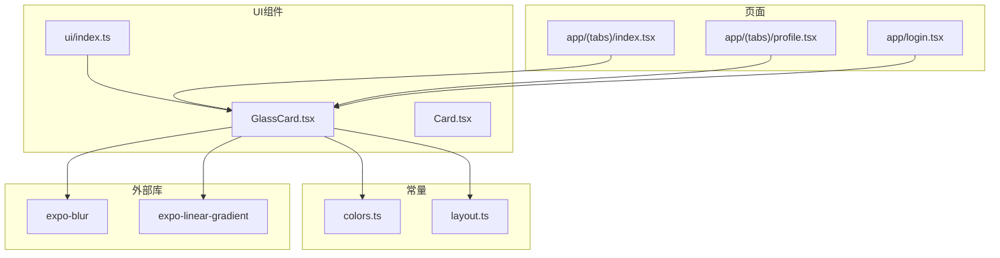
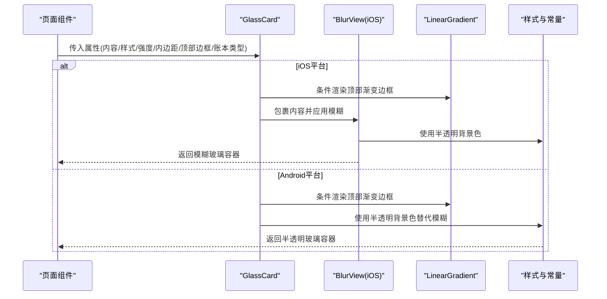
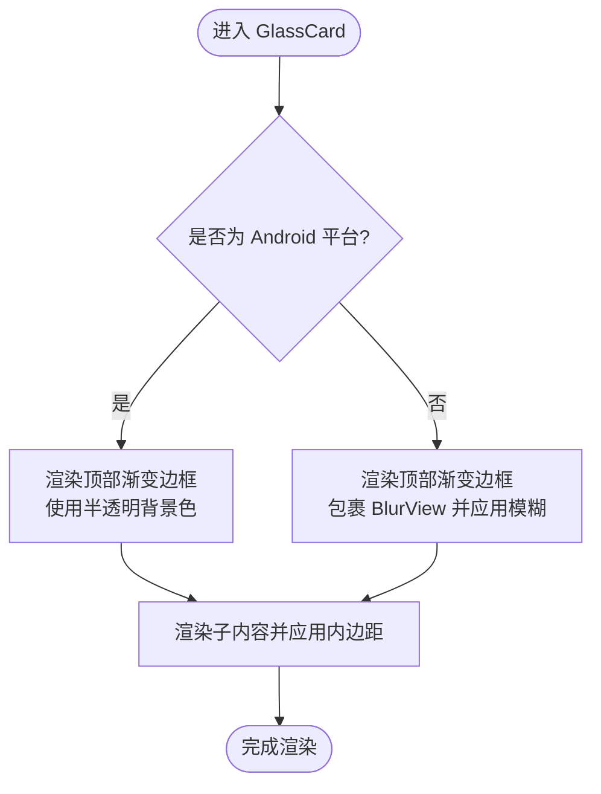
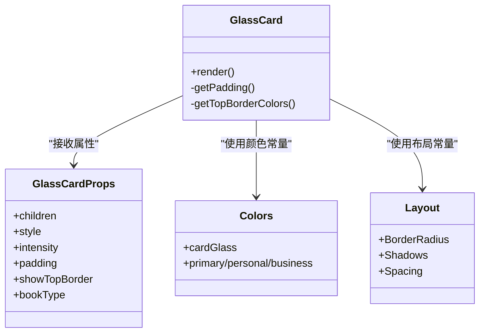
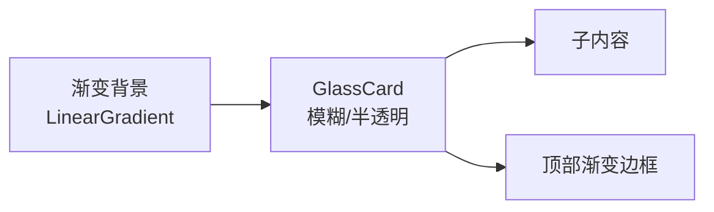
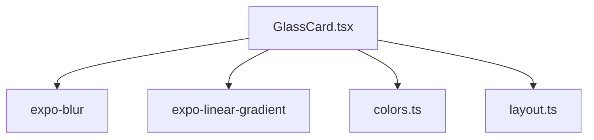

# 玻璃卡片组件

<cite>
**本文档引用的文件**
- [GlassCard.tsx](file://src/components/ui/GlassCard.tsx)
- [Card.tsx](file://src/components/ui/Card.tsx)
- [colors.ts](file://src/constants/colors.ts)
- [layout.ts](file://src/constants/layout.ts)
- [index.ts](file://src/components/ui/index.ts)
- [index.tsx](file://src/app/(tabs)/index.tsx)
- [profile.tsx](file://src/app/(tabs)/profile.tsx)
- [login.tsx](file://src/app/login.tsx)
- [package.json](file://package.json)
</cite>

## 目录
1. [简介](#简介)
2. [项目结构](#项目结构)
3. [核心组件](#核心组件)
4. [架构总览](#架构总览)
5. [详细组件分析](#详细组件分析)
6. [依赖关系分析](#依赖关系分析)
7. [性能考虑](#性能考虑)
8. [故障排除指南](#故障排除指南)
9. [结论](#结论)
10. [附录](#附录)

## 简介
本文件系统性介绍玻璃卡片组件（GlassCard）的设计理念、技术实现与最佳实践。玻璃态UI通过模糊背景与半透明材质营造通透、现代的视觉体验，广泛应用于移动端界面中。本文将从视觉原理、实现细节、平台差异、适配策略、性能优化与兼容性等方面，为设计师与开发者提供完整的使用指南。

## 项目结构
GlassCard位于UI组件目录下，作为通用基础组件被多个页面复用。其依赖统一的颜色与布局常量，并与渐变背景配合使用以构建丰富的视觉层次。

**图表来源**
- [GlassCard.tsx](file://src/components/ui/GlassCard.tsx#L1-L126)
- [Card.tsx](file://src/components/ui/Card.tsx#L1-L94)
- [colors.ts](file://src/constants/colors.ts#L1-L88)
- [layout.ts](file://src/constants/layout.ts#L1-L182)
- [index.ts](file://src/components/ui/index.ts#L1-L9)
- [index.tsx](file://src/app/(tabs)/index.tsx#L1-L564)
- [profile.tsx](file://src/app/(tabs)/profile.tsx#L1-L295)
- [login.tsx](file://src/app/login.tsx#L1-L293)

**章节来源**
- [GlassCard.tsx](file://src/components/ui/GlassCard.tsx#L1-L126)
- [colors.ts](file://src/constants/colors.ts#L1-L88)
- [layout.ts](file://src/constants/layout.ts#L1-L182)
- [index.ts](file://src/components/ui/index.ts#L1-L9)

## 核心组件
GlassCard提供以下能力：
- 平台差异化实现：iOS使用BlurView实现真实模糊；Android使用半透明背景模拟玻璃感。
- 可选顶部边框：根据账本类型或主题生成渐变色条，增强视觉识别。
- 内容内边距：提供多种内边距规格，适配不同信息密度。
- 圆角与阴影：统一圆角与阴影规范，确保与整体设计语言一致。
- 透明背景：使用半透明白色背景，保证文字可读性与层次感。

使用场景包括首页资产卡片、个人中心用户卡片、登录表单卡片等，均通过渐变背景或纯色背景进行组合使用。

**章节来源**
- [GlassCard.tsx](file://src/components/ui/GlassCard.tsx#L13-L107)
- [index.tsx](file://src/app/(tabs)/index.tsx#L120-L143)
- [profile.tsx](file://src/app/(tabs)/profile.tsx#L75-L91)
- [login.tsx](file://src/app/login.tsx#L94-L132)

## 架构总览
GlassCard的渲染流程在iOS与Android存在显著差异，但对外接口保持一致。整体架构围绕“平台感知的视觉实现”展开。

**图表来源**
- [GlassCard.tsx](file://src/components/ui/GlassCard.tsx#L70-L106)
- [colors.ts](file://src/constants/colors.ts#L34-L37)
- [layout.ts](file://src/constants/layout.ts#L97-L110)

**章节来源**
- [GlassCard.tsx](file://src/components/ui/GlassCard.tsx#L70-L106)

## 详细组件分析

### 视觉原理与技术实现
- 模糊背景（iOS）：通过BlurView对容器内容进行高斯模糊处理，再叠加半透明背景色，形成通透的玻璃质感。
- 半透明背景（Android）：由于平台限制，使用半透明白色背景模拟模糊效果，同时保留阴影与圆角提升立体感。
- 顶部边框：根据账本类型或主题生成线性渐变条，既作为装饰也承担视觉引导作用。
- 文字可读性：半透明背景与深色文字搭配，确保在复杂背景上仍具备良好对比度。

**图表来源**
- [GlassCard.tsx](file://src/components/ui/GlassCard.tsx#L70-L106)

**章节来源**
- [GlassCard.tsx](file://src/components/ui/GlassCard.tsx#L70-L106)
- [colors.ts](file://src/constants/colors.ts#L34-L37)

### 层级关系、背景纹理与边缘处理
- 层级关系：GlassCard采用统一圆角与阴影规范，确保在滚动视图、模态层等场景中具备稳定层级表现。
- 背景纹理：与LinearGradient背景组合使用，通过渐变过渡增强空间深度；在纯色背景下则依靠半透明与阴影维持层次。
- 边缘处理：圆角统一为较大半径，溢出隐藏避免边缘穿透；顶部边框通过线性渐变实现细条装饰。

**图表来源**
- [GlassCard.tsx](file://src/components/ui/GlassCard.tsx#L13-L65)
- [colors.ts](file://src/constants/colors.ts#L6-L75)
- [layout.ts](file://src/constants/layout.ts#L8-L110)

**章节来源**
- [layout.ts](file://src/constants/layout.ts#L8-L110)
- [colors.ts](file://src/constants/colors.ts#L6-L75)

### 与渐变背景的组合使用与视觉层次
- 渐变背景：首页启动页与登录页均使用LinearGradient作为背景，GlassCard在此类背景下呈现更佳的通透感。
- 视觉层次：通过模糊强度、半透明度与阴影的协调，使GlassCard在复杂背景上仍能清晰呈现内容。
- 主题一致性：顶部边框颜色随账本类型变化，强化品牌识别与信息分层。

**图表来源**
- [login.tsx](file://src/app/login.tsx#L63-L68)
- [index.tsx](file://src/app/(tabs)/index.tsx#L76-L82)

**章节来源**
- [login.tsx](file://src/app/login.tsx#L63-L68)
- [index.tsx](file://src/app/(tabs)/index.tsx#L76-L82)

### 在不同背景下的适配方案
- 复杂渐变背景：优先使用iOS平台的BlurView，若需在Android上保持一致观感，可降低强度或调整半透明度。
- 纯色背景：通过增加阴影与圆角，确保内容边界清晰；必要时在GlassCard内部添加轻微遮罩以提升对比度。
- 高对比背景：适当提高文字颜色饱和度或使用反色文字，保证可读性。

**章节来源**
- [GlassCard.tsx](file://src/components/ui/GlassCard.tsx#L70-L106)
- [colors.ts](file://src/constants/colors.ts#L34-L45)

### 与Card组件的关系与差异
- GlassCard：强调通透与层次，适合需要与背景融合的场景。
- Card：强调简洁与稳定，适合信息密集或需要明确边界的内容区域。
- 选择建议：在渐变或复杂背景上优先使用GlassCard；在纯色或信息展示为主的场景使用Card。

**章节来源**
- [Card.tsx](file://src/components/ui/Card.tsx#L10-L85)
- [GlassCard.tsx](file://src/components/ui/GlassCard.tsx#L13-L65)

## 依赖关系分析
GlassCard依赖以下外部库与内部模块：
- 平台库：expo-blur（iOS模糊）、expo-linear-gradient（渐变）
- 内部模块：colors（颜色）、layout（圆角/阴影/间距）

**图表来源**
- [GlassCard.tsx](file://src/components/ui/GlassCard.tsx#L7-L11)
- [package.json](file://package.json#L11-L34)

**章节来源**
- [GlassCard.tsx](file://src/components/ui/GlassCard.tsx#L7-L11)
- [package.json](file://package.json#L11-L34)

## 性能考虑
- iOS端BlurView：合理设置模糊强度与覆盖范围，避免对大面积区域进行高频重绘；仅在可见区域内启用模糊。
- Android端半透明背景：减少不必要的层级嵌套，避免过度合成；使用合理的半透明值平衡可读性与性能。
- 渐变渲染：尽量复用渐变配置，避免动态计算过多；在滚动场景中减少渐变更新频率。
- 内边距与阴影：统一使用常量，避免运行时重复计算；在大量列表项中保持一致的渲染路径。

[本节为通用性能建议，不直接分析具体文件]

## 故障排除指南
- Android上无模糊效果：确认平台分支逻辑正确执行；如需一致观感，可通过调整半透明度与阴影实现近似效果。
- 文字在复杂背景上不可读：检查半透明背景与文字颜色对比度；必要时调整颜色或增加遮罩。
- 顶部边框颜色异常：核对账本类型参数与颜色映射；确保LinearGradient的起止位置与颜色数组正确。
- 样式冲突：检查容器样式与子内容样式，避免内边距与圆角相互影响导致的视觉错位。

**章节来源**
- [GlassCard.tsx](file://src/components/ui/GlassCard.tsx#L45-L58)
- [colors.ts](file://src/constants/colors.ts#L14-L21)

## 结论
GlassCard通过平台差异化实现与统一设计规范，为复杂背景提供了可靠的玻璃态视觉解决方案。结合渐变背景与主题色彩，可在不同页面中构建清晰的视觉层次与良好的用户体验。遵循本文的适配策略与性能建议，可进一步提升组件在多平台与多场景下的稳定性与表现力。

[本节为总结性内容，不直接分析具体文件]

## 附录
- 组件导出：通过UI组件索引集中导出，便于全局按需引入。
- 页面集成：首页、个人中心、登录页均展示了GlassCard的典型用法，可作为参考模板。

**章节来源**
- [index.ts](file://src/components/ui/index.ts#L5-L9)
- [index.tsx](file://src/app/(tabs)/index.tsx#L120-L143)
- [profile.tsx](file://src/app/(tabs)/profile.tsx#L75-L91)
- [login.tsx](file://src/app/login.tsx#L94-L132)