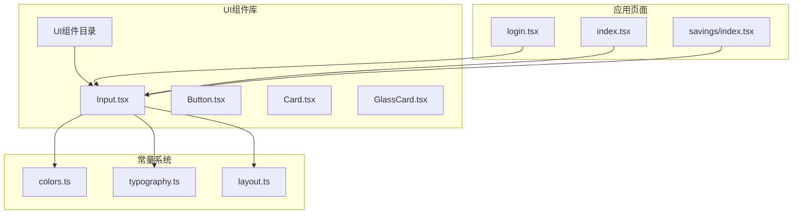
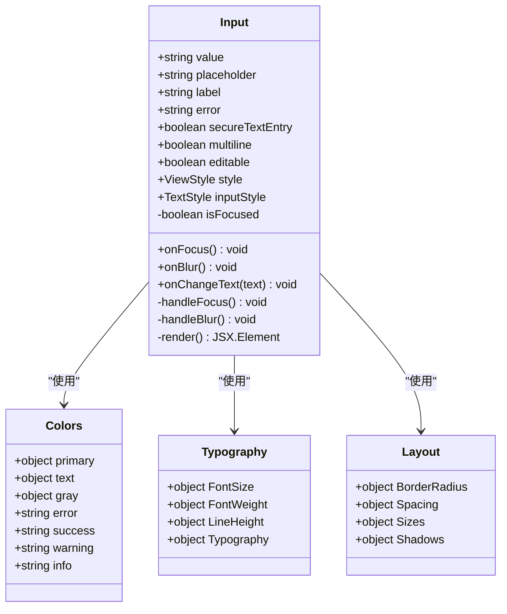
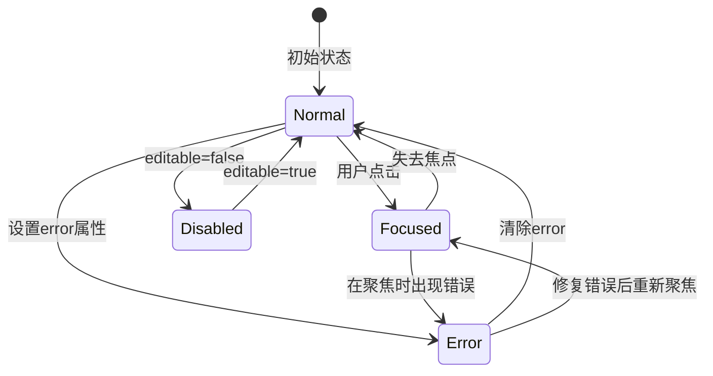
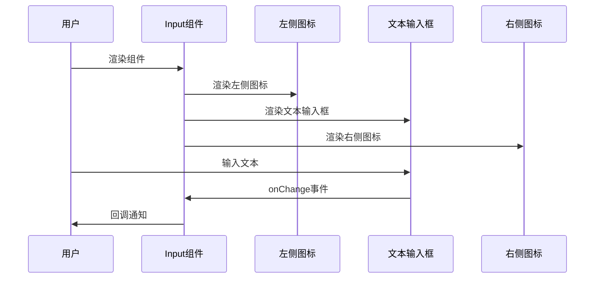
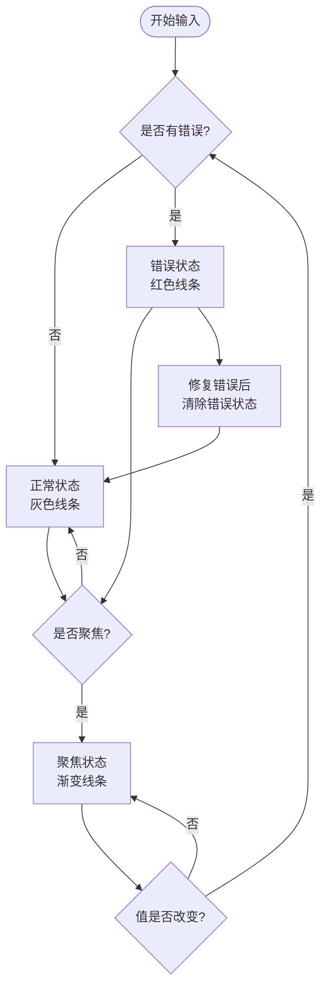
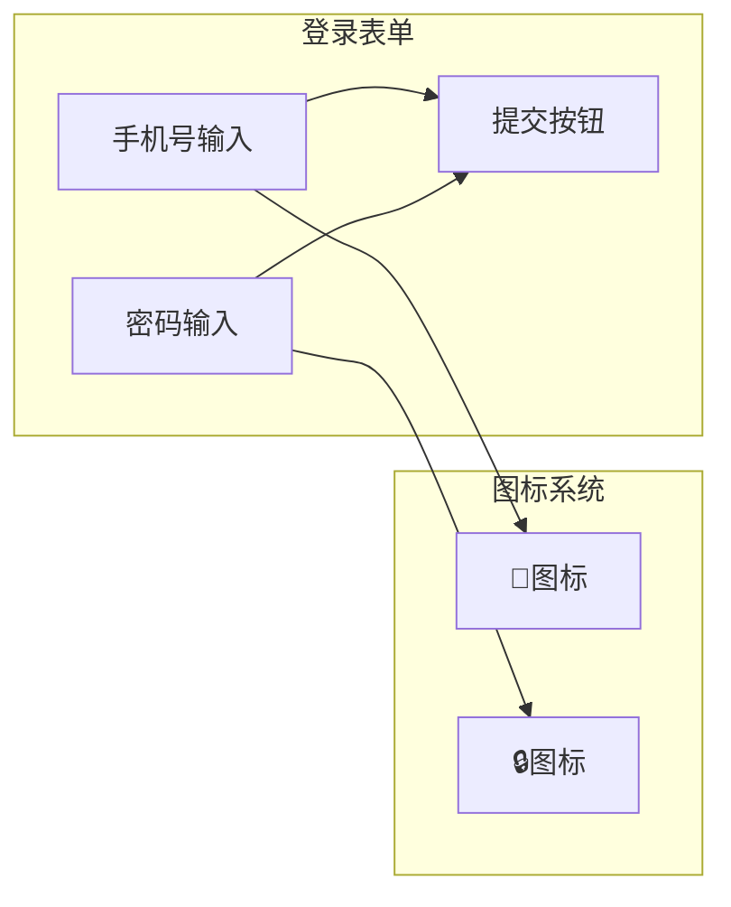
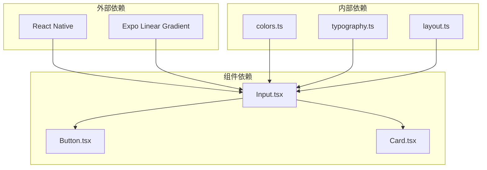

# 输入组件

<cite>
**本文档引用的文件**
- [Input.tsx](file://src/components/ui/Input.tsx)
- [index.ts](file://src/components/ui/index.ts)
- [colors.ts](file://src/constants/colors.ts)
- [typography.ts](file://src/constants/typography.ts)
- [layout.ts](file://src/constants/layout.ts)
- [login.tsx](file://src/app/login.tsx)
- [types/index.ts](file://src/types/index.ts)
</cite>

## 目录
1. [简介](#简介)
2. [项目结构](#项目结构)
3. [核心组件](#核心组件)
4. [架构概览](#架构概览)
5. [详细组件分析](#详细组件分析)
6. [依赖关系分析](#依赖关系分析)
7. [性能考虑](#性能考虑)
8. [故障排除指南](#故障排除指南)
9. [结论](#结论)

## 简介

输入组件是攒钱记账应用中的核心UI组件之一，负责处理各种类型的文本输入需求。该组件提供了丰富的功能特性，包括状态管理、样式定制、键盘交互优化以及与表单系统的深度集成。

该组件的设计遵循现代化的UI设计原则，采用渐变色彩方案和优雅的视觉效果，为用户提供直观且美观的输入体验。组件支持多种输入模式，从基础的文本输入到复杂的表单字段，满足应用的各种使用场景。

## 项目结构

输入组件位于UI组件库中，作为独立的功能模块提供给整个应用使用。其组织结构体现了清晰的模块化设计理念：

**图表来源**
- [Input.tsx](file://src/components/ui/Input.tsx#L1-L194)
- [colors.ts](file://src/constants/colors.ts#L1-L88)
- [typography.ts](file://src/constants/typography.ts#L1-L149)

**章节来源**
- [Input.tsx](file://src/components/ui/Input.tsx#L1-L194)
- [index.ts](file://src/components/ui/index.ts#L1-L9)

## 核心组件

### 组件架构概述

输入组件采用函数式组件设计，结合React Hooks实现状态管理。组件的核心特性包括：

- **状态管理**：通过useState钩子管理聚焦状态
- **样式系统**：集成颜色、字体和布局常量
- **键盘交互**：支持多种键盘类型和输入模式
- **图标集成**：支持左右图标装饰
- **错误处理**：提供错误状态显示

### 主要属性接口

组件定义了完整的属性接口，支持丰富的自定义选项：

| 属性名 | 类型 | 默认值 | 描述 |
|--------|------|--------|------|
| value | string | - | 输入框当前值 |
| onChangeText | (text: string) => void | - | 值变化回调函数 |
| placeholder | string | - | 占位符文本 |
| label | string | - | 标签文本 |
| error | string | - | 错误信息文本 |
| leftIcon | React.ReactNode | - | 左侧图标组件 |
| rightIcon | React.ReactNode | - | 右侧图标组件 |
| secureTextEntry | boolean | false | 密码输入模式 |
| keyboardType | enum | 'default' | 键盘类型 |
| autoCapitalize | enum | 'none' | 自动大写策略 |
| multiline | boolean | false | 多行文本支持 |
| numberOfLines | number | 1 | 多行显示行数 |
| maxLength | number | - | 最大字符长度 |
| editable | boolean | true | 编辑状态控制 |
| style | ViewStyle | - | 容器样式覆盖 |
| inputStyle | TextStyle | - | 输入框样式覆盖 |

**章节来源**
- [Input.tsx](file://src/components/ui/Input.tsx#L20-L39)

## 架构概览

输入组件的架构设计体现了良好的关注点分离原则，将UI展示、状态管理和业务逻辑进行了清晰的划分：

**图表来源**
- [Input.tsx](file://src/components/ui/Input.tsx#L41-L138)
- [colors.ts](file://src/constants/colors.ts#L6-L87)
- [typography.ts](file://src/constants/typography.ts#L32-L146)
- [layout.ts](file://src/constants/layout.ts#L8-L154)

## 详细组件分析

### 状态管理系统

输入组件实现了完整的状态管理机制，主要包含以下状态：

**图表来源**
- [Input.tsx](file://src/components/ui/Input.tsx#L61-L71)

组件通过本地状态管理聚焦状态，同时支持外部传入的编辑状态控制。状态切换直接影响视觉反馈，包括底部线条的颜色变化和渐变效果。

### 视觉设计系统

输入组件采用了统一的设计语言，集成了完整的色彩、字体和布局系统：

#### 色彩系统集成

组件使用了精心设计的色彩体系，包括：
- **主色调**：渐变青绿色，象征成长与清晰
- **状态色彩**：成功、警告、错误、信息等状态色
- **文字色彩**：主色、次色、三级色的层次化设计
- **灰度系统**：从50到900的完整灰度范围

#### 字体系统集成

字体系统提供了完整的排版规范：
- **字体家族**：iOS使用系统字体，Android使用Roboto系列
- **字号层级**：从xs到5xl的完整字号体系
- **字重规范**：regular、medium、semibold、bold四个级别
- **行高系统**：tight、normal、relaxed三种行高选择

#### 布局系统集成

布局系统确保了组件的一致性：
- **圆角规范**：sm圆角适用于输入框
- **间距系统**：从xs到5xl的完整间距体系
- **尺寸规范**：专门的输入框高度标准
- **阴影系统**：根据组件重要性提供不同强度的阴影

**章节来源**
- [Input.tsx](file://src/components/ui/Input.tsx#L140-L191)
- [colors.ts](file://src/constants/colors.ts#L6-L87)
- [typography.ts](file://src/constants/typography.ts#L32-L146)
- [layout.ts](file://src/constants/layout.ts#L112-L154)

### 键盘交互优化

输入组件提供了全面的键盘交互支持：

#### 键盘类型支持

组件支持多种键盘类型以适应不同的输入场景：
- **default**：通用文本输入
- **email-address**：邮箱地址输入
- **numeric**：数字输入
- **phone-pad**：电话号码输入

#### 自动大写策略

提供了灵活的自动大写控制：
- **none**：不进行自动大写
- **sentences**：句首自动大写
- **words**：词首自动大写
- **characters**：字符级自动大写

#### 多行文本支持

对于需要多行输入的场景，组件提供了完整的支持：
- **minHeight**：80像素的最小高度
- **textAlignVertical**：顶部对齐
- **numberOfLines**：可配置的显示行数
- **scroll支持**：内容超出时自动滚动

**章节来源**
- [Input.tsx](file://src/components/ui/Input.tsx#L29-L32)
- [Input.tsx](file://src/components/ui/Input.tsx#L162-L165)

### 图标集成系统

输入组件支持左右图标的装饰功能：

**图表来源**
- [Input.tsx](file://src/components/ui/Input.tsx#L84-L112)

图标系统提供了灵活的装饰能力，支持任何React Native组件作为图标使用。

### 错误处理机制

组件实现了完整的错误处理和状态反馈机制：

**图表来源**
- [Input.tsx](file://src/components/ui/Input.tsx#L115-L135)

错误状态会优先于聚焦状态显示，确保用户能够及时注意到输入问题。

### 使用示例分析

在应用中，输入组件被广泛应用于各种场景：

#### 登录表单集成

在登录页面中，输入组件展示了典型的应用场景：

**图表来源**
- [login.tsx](file://src/app/login.tsx#L96-L112)

**章节来源**
- [login.tsx](file://src/app/login.tsx#L46-L177)

## 依赖关系分析

输入组件的依赖关系体现了清晰的模块化架构：

**图表来源**
- [Input.tsx](file://src/components/ui/Input.tsx#L5-L18)
- [colors.ts](file://src/constants/colors.ts#L1-L88)
- [typography.ts](file://src/constants/typography.ts#L1-L149)
- [layout.ts](file://src/constants/layout.ts#L1-L182)

### 外部依赖分析

组件依赖于几个关键的外部库：

- **React Native**：提供基础的UI组件和状态管理
- **Expo Linear Gradient**：实现渐变效果的底部线条

### 内部依赖分析

组件深度集成了应用的设计系统：

- **颜色系统**：提供统一的色彩规范
- **字体系统**：确保排版的一致性
- **布局系统**：保证间距和尺寸的协调

**章节来源**
- [Input.tsx](file://src/components/ui/Input.tsx#L5-L18)

## 性能考虑

输入组件在设计时充分考虑了性能优化：

### 渲染优化

- **条件渲染**：仅在需要时渲染标签、图标和错误文本
- **样式缓存**：使用StyleSheet.create缓存样式对象
- **状态最小化**：只维护必要的聚焦状态

### 内存管理

- **事件处理**：使用箭头函数避免重复绑定
- **样式复用**：通过样式合并减少对象创建
- **图标优化**：图标组件按需渲染

### 用户体验优化

- **即时反馈**：聚焦状态变化提供即时视觉反馈
- **键盘适配**：根据输入类型自动调整键盘布局
- **无障碍支持**：遵循React Native的无障碍最佳实践

## 故障排除指南

### 常见问题及解决方案

#### 输入框无法获得焦点

**问题症状**：输入框点击无响应
**可能原因**：
- `editable`属性被设置为`false`
- 父容器的触摸事件被阻止
- 样式冲突导致触摸区域异常

**解决方案**：
- 检查`editable`属性设置
- 确认父容器没有阻止触摸事件
- 验证样式中是否有冲突的z-index或position属性

#### 键盘显示异常

**问题症状**：键盘类型不符合预期
**可能原因**：
- `keyboardType`属性设置错误
- 平台差异导致的行为不一致
- 输入类型与键盘类型不匹配

**解决方案**：
- 确认`keyboardType`属性的有效值
- 测试不同平台上的行为差异
- 考虑使用`autoCapitalize`配合键盘类型

#### 样式显示问题

**问题症状**：组件样式不符合设计规范
**可能原因**：
- 自定义样式覆盖了默认样式
- 颜色或字体常量未正确导入
- 响应式设计在不同设备上表现异常

**解决方案**：
- 检查自定义样式的优先级
- 确认常量导入路径正确
- 测试不同屏幕尺寸下的表现

#### 错误状态显示异常

**问题症状**：错误状态无法正确显示
**可能原因**：
- `error`属性未正确传递
- 错误状态与聚焦状态冲突
- 样式覆盖导致错误状态不可见

**解决方案**：
- 确认`error`属性的值和显示逻辑
- 检查错误状态与聚焦状态的优先级
- 验证错误文本的颜色对比度

**章节来源**
- [Input.tsx](file://src/components/ui/Input.tsx#L61-L71)
- [Input.tsx](file://src/components/ui/Input.tsx#L115-L135)

## 结论

输入组件作为攒钱记账应用的核心UI组件，展现了优秀的架构设计和实现质量。组件不仅提供了丰富的功能特性，还保持了良好的可维护性和扩展性。

### 设计优势

- **模块化设计**：清晰的职责分离和依赖管理
- **统一设计语言**：深度集成的设计系统确保视觉一致性
- **用户体验优化**：完善的交互反馈和无障碍支持
- **性能考虑**：合理的渲染优化和内存管理

### 扩展建议

虽然组件已经非常完善，但仍有一些潜在的改进方向：

- **国际化支持**：增加多语言文本支持
- **自动完成**：集成原生的自动完成功能
- **格式化增强**：支持更多输入格式化选项
- **验证规则**：内置更丰富的验证规则

输入组件为开发者提供了一个优秀的参考实现，展示了如何在React Native环境中构建高质量的UI组件。其设计原则和实现模式可以作为其他组件开发的指导模板。