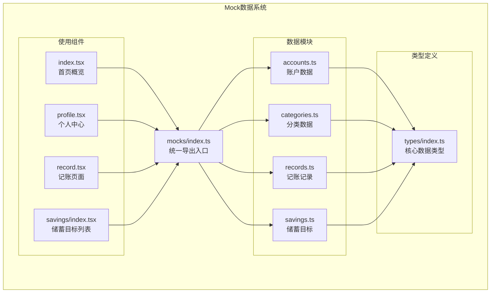
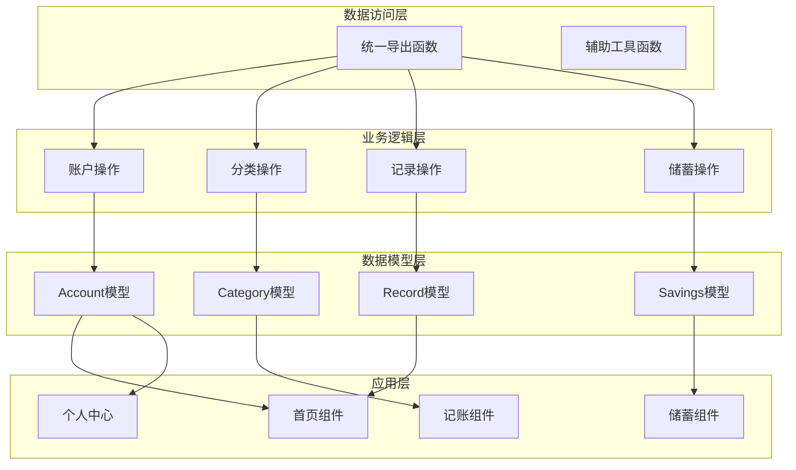
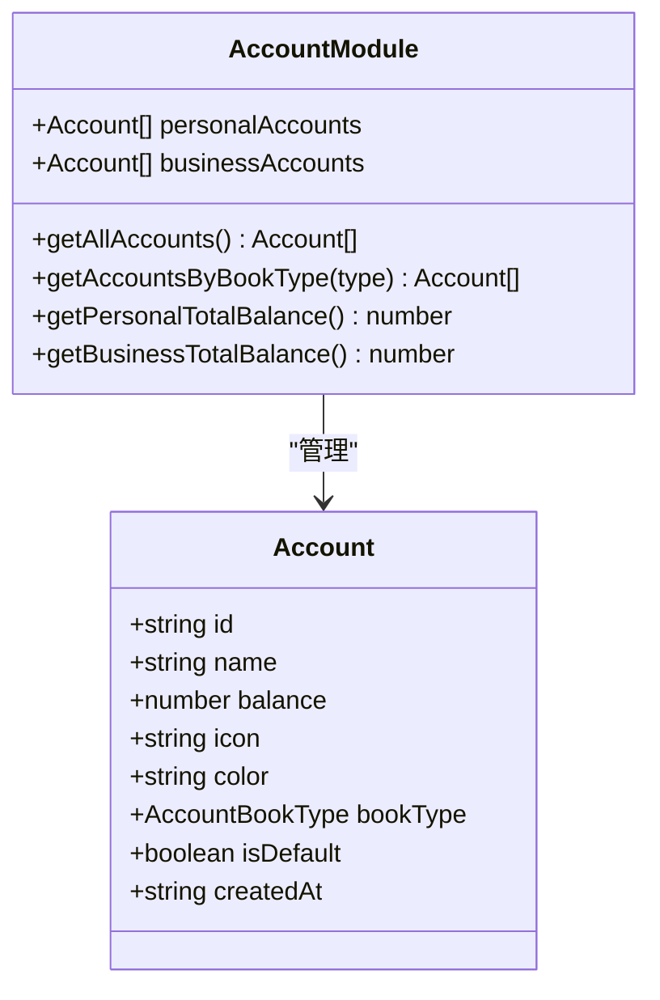
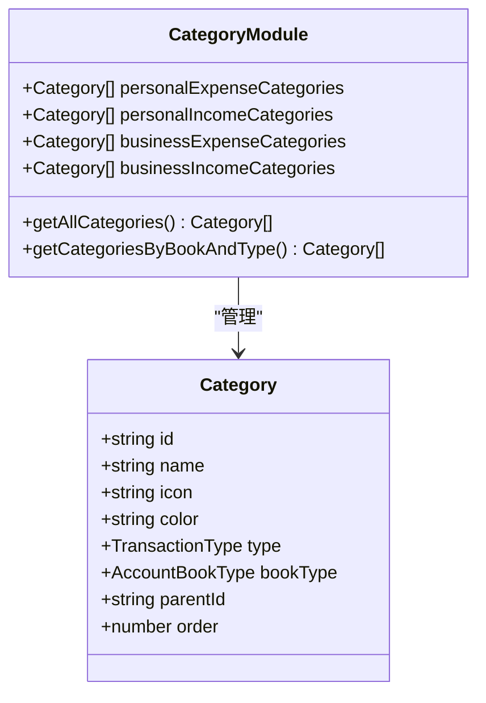
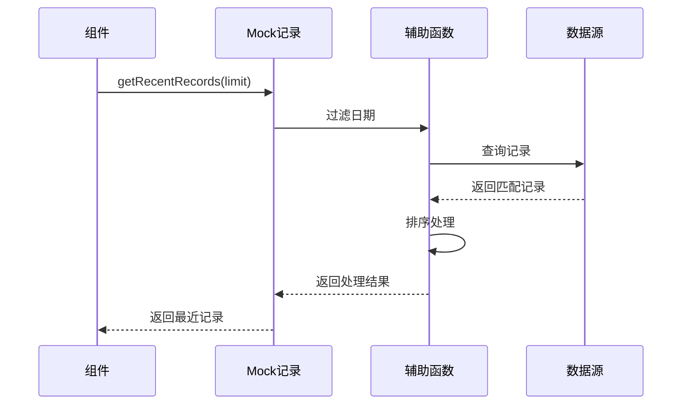
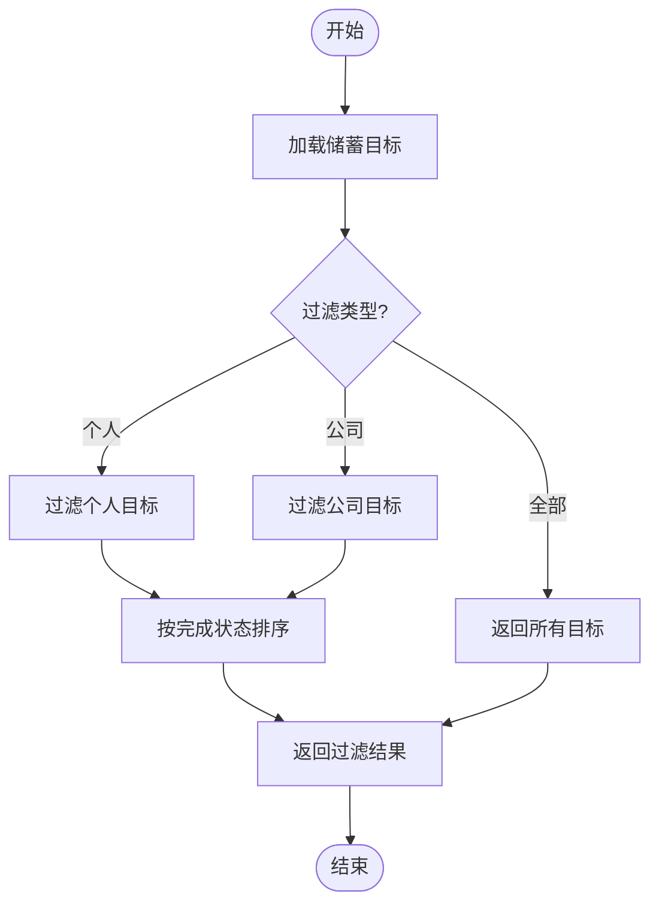
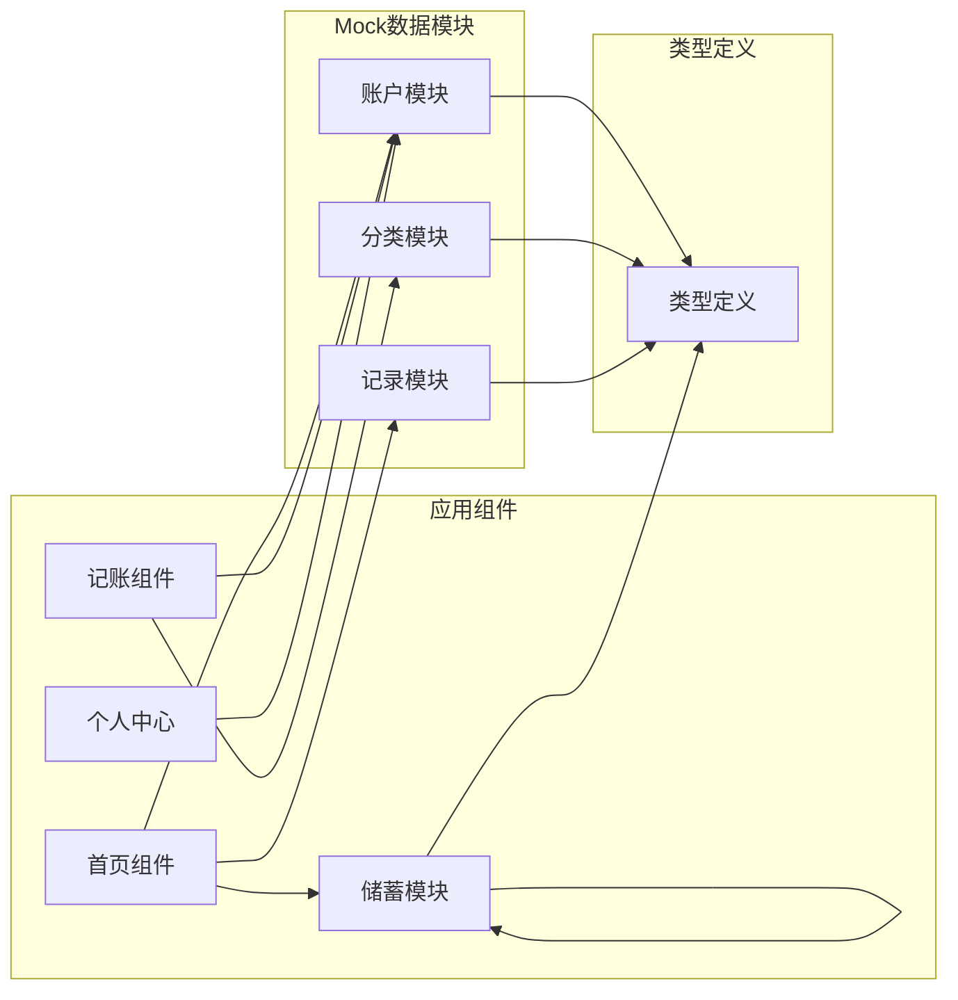

# Mock数据系统

<cite>
**本文档引用的文件**
- [src/mocks/index.ts](file://src/mocks/index.ts)
- [src/mocks/accounts.ts](file://src/mocks/accounts.ts)
- [src/mocks/categories.ts](file://src/mocks/categories.ts)
- [src/mocks/records.ts](file://src/mocks/records.ts)
- [src/mocks/savings.ts](file://src/mocks/savings.ts)
- [src/types/index.ts](file://src/types/index.ts)
- [src/app/(tabs)/index.tsx](file://src/app/(tabs)/index.tsx)
- [src/app/(tabs)/profile.tsx](file://src/app/(tabs)/profile.tsx)
- [src/app/(tabs)/record.tsx](file://src/app/(tabs)/record.tsx)
- [src/app/savings/index.tsx](file://src/app/savings/index.tsx)
- [package.json](file://package.json)
</cite>

## 目录
1. [简介](#简介)
2. [项目结构](#项目结构)
3. [核心组件](#核心组件)
4. [架构概览](#架构概览)
5. [详细组件分析](#详细组件分析)
6. [依赖关系分析](#依赖关系分析)
7. [性能考虑](#性能考虑)
8. [故障排除指南](#故障排除指南)
9. [结论](#结论)
10. [附录](#附录)

## 简介

'攒钱记账'项目的Mock数据系统是一个完整的数据模拟解决方案，为移动应用提供了丰富的测试和演示数据。该系统采用模块化设计，包含账户、分类、记账记录和储蓄目标四个核心数据模块，每个模块都经过精心设计以确保数据一致性和可扩展性。

Mock数据系统的核心设计理念是：
- **数据完整性**：提供真实业务场景下的完整数据集
- **类型安全**：基于TypeScript接口确保数据结构正确性
- **可扩展性**：支持轻松添加新的数据类型和修改现有数据
- **性能优化**：通过合理的数据组织和查询函数提高运行效率

## 项目结构

Mock数据系统位于`src/mocks/`目录下，采用按功能模块划分的组织方式：

**图表来源**
- [src/mocks/index.ts](file://src/mocks/index.ts#L1-L9)
- [src/mocks/accounts.ts](file://src/mocks/accounts.ts#L1-L91)
- [src/mocks/categories.ts](file://src/mocks/categories.ts#L1-L69)
- [src/mocks/records.ts](file://src/mocks/records.ts#L1-L117)
- [src/mocks/savings.ts](file://src/mocks/savings.ts#L1-L111)

**章节来源**
- [src/mocks/index.ts](file://src/mocks/index.ts#L1-L9)
- [src/mocks/accounts.ts](file://src/mocks/accounts.ts#L1-L91)
- [src/mocks/categories.ts](file://src/mocks/categories.ts#L1-L69)
- [src/mocks/records.ts](file://src/mocks/records.ts#L1-L117)
- [src/mocks/savings.ts](file://src/mocks/savings.ts#L1-L111)

## 核心组件

Mock数据系统由四个核心数据模块组成，每个模块都有明确的职责和数据结构：

### 账户模块 (Accounts)
负责管理用户的所有账户信息，包括个人账户和公司账户两大类别。每个账户包含基本属性如余额、图标、颜色等。

### 分类模块 (Categories)
提供完整的收支分类体系，支持个人和公司两种账本类型的分类管理，涵盖日常生活的各个方面。

### 记账记录模块 (Records)
存储历史交易记录，包含金额、时间、分类、账户等完整信息，支持按条件查询和过滤。

### 储蓄目标模块 (Savings)
管理用户的储蓄目标和存入记录，提供目标进度跟踪和完成状态管理。

**章节来源**
- [src/mocks/accounts.ts](file://src/mocks/accounts.ts#L1-L91)
- [src/mocks/categories.ts](file://src/mocks/categories.ts#L1-L69)
- [src/mocks/records.ts](file://src/mocks/records.ts#L1-L117)
- [src/mocks/savings.ts](file://src/mocks/savings.ts#L1-L111)

## 架构概览

Mock数据系统采用分层架构设计，确保数据的一致性和可维护性：

**图表来源**
- [src/mocks/index.ts](file://src/mocks/index.ts#L5-L8)
- [src/mocks/accounts.ts](file://src/mocks/accounts.ts#L71-L91)
- [src/mocks/categories.ts](file://src/mocks/categories.ts#L51-L69)
- [src/mocks/records.ts](file://src/mocks/records.ts#L100-L117)
- [src/mocks/savings.ts](file://src/mocks/savings.ts#L94-L111)

## 详细组件分析

### 账户数据模型分析

账户模块提供了完整的账户管理功能，支持个人和公司两类账户的区分管理。

**图表来源**
- [src/mocks/accounts.ts](file://src/mocks/accounts.ts#L21-L31)
- [src/mocks/accounts.ts](file://src/mocks/accounts.ts#L71-L91)

#### 账户数据生成规则
- **ID生成**：采用前缀+标识符的命名规则（如`pa_`表示个人账户，`ba_`表示公司账户）
- **默认值**：个人账户中只有一个默认账户，公司账户同样设置默认值
- **余额分布**：通过合理分配确保总资产的平衡和真实性
- **创建时间**：统一使用固定日期格式，便于排序和统计

#### 账户查询策略
- **全量查询**：`getAllAccounts()`返回所有账户的合并结果
- **分类查询**：`getAccountsByBookType()`根据账本类型过滤账户
- **汇总计算**：提供个人和公司资产总额的快速计算

**章节来源**
- [src/mocks/accounts.ts](file://src/mocks/accounts.ts#L1-L91)

### 分类数据模型分析

分类模块建立了完整的收支分类体系，支持个人和公司两种账本类型。

**图表来源**
- [src/mocks/categories.ts](file://src/mocks/categories.ts#L33-L49)
- [src/mocks/categories.ts](file://src/mocks/categories.ts#L51-L69)

#### 分类设计原则
- **业务覆盖**：涵盖日常生活的各个领域（餐饮、交通、购物、娱乐等）
- **类型分离**：明确区分收入和支出两类分类
- **账本隔离**：个人和公司分类完全独立，避免混淆
- **视觉设计**：每个分类都有独特的图标和颜色标识

#### 分类查询机制
- **组合查询**：支持按账本类型和交易类型双重过滤
- **动态匹配**：根据当前选择的账本类型动态调整可用分类
- **排序规则**：通过order字段控制分类的显示顺序

**章节来源**
- [src/mocks/categories.ts](file://src/mocks/categories.ts#L1-L69)

### 记账记录数据模型分析

记账记录模块提供了完整的交易历史管理功能，支持复杂的查询和过滤操作。

**图表来源**
- [src/mocks/records.ts](file://src/mocks/records.ts#L100-L117)

#### 记账记录生成策略
- **时间分布**：记录分布在不同日期，模拟真实的使用模式
- **金额范围**：涵盖从几元到几千元的各种金额
- **分类覆盖**：确保各种分类都有对应的记录
- **账户关联**：每条记录都关联到具体的账户

#### 记账记录查询功能
- **实时查询**：`getTodayRecords()`获取当天所有记录
- **历史查询**：`getRecentRecords()`获取最近N条记录
- **分类查询**：`getRecordsByBookType()`按账本类型过滤

**章节来源**
- [src/mocks/records.ts](file://src/mocks/records.ts#L1-L117)

### 储蓄目标数据模型分析

储蓄目标模块提供了完整的财务目标管理功能，支持目标进度跟踪和完成状态管理。

**图表来源**
- [src/mocks/savings.ts](file://src/mocks/savings.ts#L94-L111)

#### 储蓄目标设计特点
- **目标设定**：包含目标名称、目标金额、当前金额、截止日期
- **进度跟踪**：自动计算完成百分比和剩余金额
- **完成状态**：支持目标完成标记和状态管理
- **存入记录**：每个目标都有对应的存入历史

#### 储蓄目标查询机制
- **类型过滤**：支持按个人或公司账本过滤目标
- **状态查询**：提供活跃目标和已完成目标的查询
- **关联查询**：可以查询特定目标的所有存入记录

**章节来源**
- [src/mocks/savings.ts](file://src/mocks/savings.ts#L1-L111)

## 依赖关系分析

Mock数据系统与应用组件之间的依赖关系清晰明确，遵循单一职责原则：

**图表来源**
- [src/app/(tabs)/index.tsx](file://src/app/(tabs)/index.tsx#L22-L27)
- [src/app/(tabs)/record.tsx](file://src/app/(tabs)/record.tsx#L23)
- [src/app/savings/index.tsx](file://src/app/savings/index.tsx#L21)

### 数据一致性保证机制

Mock数据系统通过以下机制确保数据的一致性和完整性：

1. **类型约束**：所有数据严格遵循TypeScript接口定义
2. **ID唯一性**：每个实体都有唯一的标识符
3. **外键关联**：记录与账户、分类建立正确的关联关系
4. **默认值管理**：关键字段都有合理的默认值
5. **时间戳同步**：创建时间和更新时间保持同步

**章节来源**
- [src/types/index.ts](file://src/types/index.ts#L21-L85)
- [src/mocks/records.ts](file://src/mocks/records.ts#L13-L98)

## 性能考虑

Mock数据系统在设计时充分考虑了性能优化：

### 数据结构优化
- **扁平化设计**：避免深层嵌套，提高查询效率
- **索引友好的ID**：使用字符串ID便于快速查找
- **缓存策略**：对常用查询结果进行缓存

### 查询性能优化
- **预过滤**：在模块内部实现基础过滤逻辑
- **懒加载**：按需加载相关数据
- **批量操作**：支持批量查询和处理

### 内存使用优化
- **数据压缩**：避免重复存储相同的数据
- **对象复用**：合理复用对象实例
- **及时清理**：及时释放不再使用的数据

## 故障排除指南

### 常见问题及解决方案

#### 数据不一致问题
**症状**：记录与账户或分类不匹配
**解决方案**：
1. 检查ID关联是否正确
2. 验证外键约束
3. 确认数据初始化顺序

#### 查询性能问题
**症状**：大量数据查询时响应缓慢
**解决方案**：
1. 使用索引友好的查询方式
2. 实现数据分页
3. 缓存常用查询结果

#### 类型错误问题
**症状**：TypeScript编译错误
**解决方案**：
1. 检查接口定义是否完整
2. 验证数据结构是否符合类型要求
3. 确认导入路径正确

**章节来源**
- [src/mocks/accounts.ts](file://src/mocks/accounts.ts#L71-L91)
- [src/mocks/categories.ts](file://src/mocks/categories.ts#L51-L69)
- [src/mocks/records.ts](file://src/mocks/records.ts#L100-L117)
- [src/mocks/savings.ts](file://src/mocks/savings.ts#L94-L111)

## 结论

'攒钱记账'项目的Mock数据系统是一个设计精良、功能完整的数据模拟解决方案。通过模块化的架构设计、严格的类型约束和完善的查询机制，该系统为应用提供了可靠的数据支持。

系统的主要优势包括：
- **完整的业务覆盖**：涵盖记账应用的核心功能
- **良好的扩展性**：易于添加新的数据类型和修改现有数据
- **高性能设计**：通过合理的数据组织和查询优化确保运行效率
- **强类型保障**：基于TypeScript确保数据结构的正确性

该系统不仅满足了当前的应用需求，还为未来的功能扩展奠定了坚实的基础。

## 附录

### 扩展新Mock数据类型的步骤

1. **定义数据结构**：在`src/types/index.ts`中添加新的接口定义
2. **创建Mock数据**：在`src/mocks/`目录下创建新的数据文件
3. **实现查询函数**：添加必要的查询和操作函数
4. **更新导出模块**：在`src/mocks/index.ts`中导出新模块
5. **集成到组件**：在需要使用的组件中导入和使用

### 修改现有数据的方法

1. **直接修改**：在相应的Mock文件中直接修改数据
2. **参数化配置**：通过函数参数控制数据生成
3. **外部配置**：从外部文件或API获取配置数据
4. **动态生成**：根据规则动态生成数据

### 最佳实践建议

1. **保持数据一致性**：确保所有关联数据的完整性
2. **合理使用默认值**：为可选字段提供合理的默认值
3. **优化查询性能**：避免不必要的数据加载和处理
4. **文档化变更**：记录重要的数据结构变更
5. **测试验证**：定期验证数据的正确性和完整性