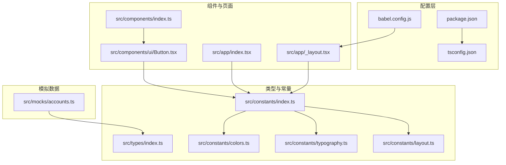
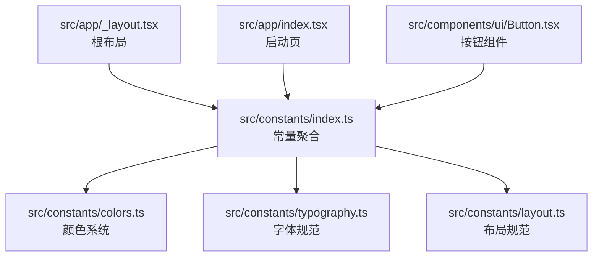
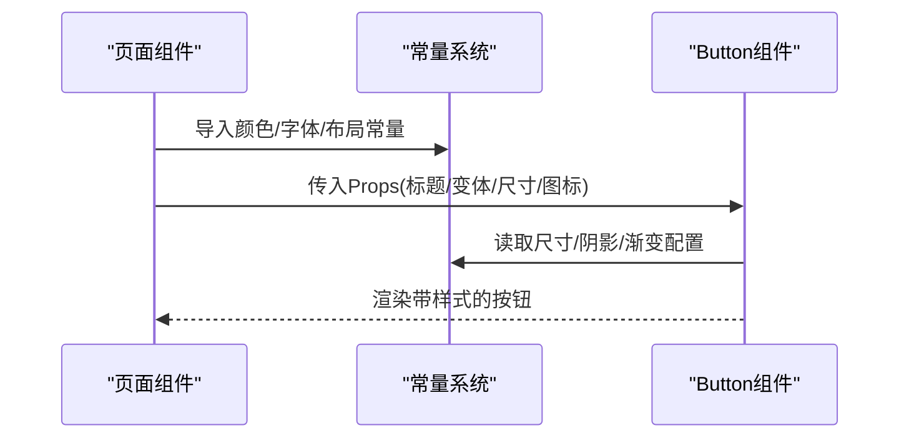
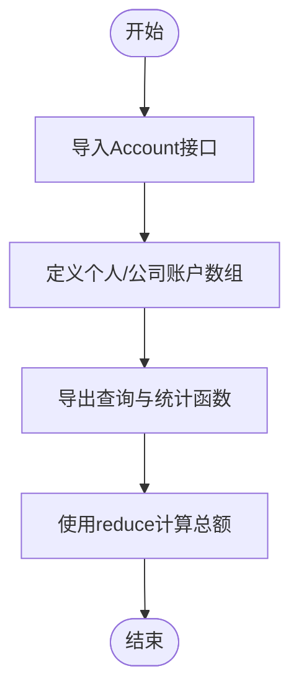
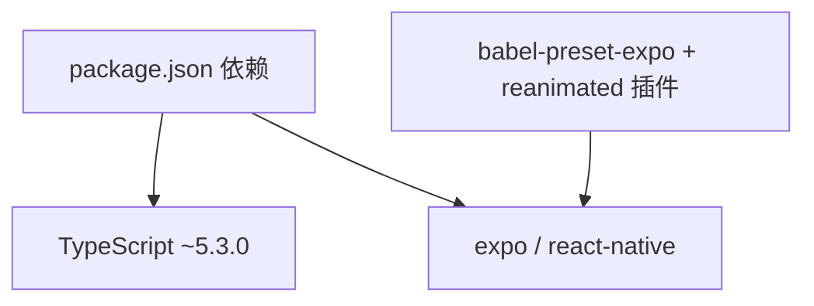

# TypeScript编码规范

<cite>
**本文档引用的文件**
- [tsconfig.json](file://tsconfig.json)
- [package.json](file://package.json)
- [babel.config.js](file://babel.config.js)
- [src/types/index.ts](file://src/types/index.ts)
- [src/constants/index.ts](file://src/constants/index.ts)
- [src/constants/colors.ts](file://src/constants/colors.ts)
- [src/constants/typography.ts](file://src/constants/typography.ts)
- [src/constants/layout.ts](file://src/constants/layout.ts)
- [src/components/index.ts](file://src/components/index.ts)
- [src/components/ui/Button.tsx](file://src/components/ui/Button.tsx)
- [src/app/_layout.tsx](file://src/app/_layout.tsx)
- [src/app/index.tsx](file://src/app/index.tsx)
- [src/mocks/accounts.ts](file://src/mocks/accounts.ts)
</cite>

## 目录
1. [引言](#引言)
2. [项目结构](#项目结构)
3. [核心组件](#核心组件)
4. [架构概览](#架构概览)
5. [详细组件分析](#详细组件分析)
6. [依赖分析](#依赖分析)
7. [性能考虑](#性能考虑)
8. [故障排除指南](#故障排除指南)
9. [结论](#结论)
10. [附录](#附录)

## 引言
本文件为"攒钱记账"项目制定统一的TypeScript编码规范与标准，覆盖配置选项、严格模式、编译器设置、类型定义最佳实践、模块导入导出规范、命名约定、函数签名规范以及类型推断优化等方面。文档同时结合项目现有实现，提供可操作的代码示例路径与可视化图表，帮助开发者在保持一致性的同时提升代码质量与可维护性。

## 项目结构
项目采用基于功能的组织方式，核心目录与职责如下：
- src/types：集中存放全局类型定义，确保跨模块共享与复用
- src/constants：统一管理颜色、字体、布局等设计常量，支持按需导出
- src/components：组件库，包含UI组件与聚合导出入口
- src/app：页面与路由相关逻辑，使用expo-router进行导航
- src/mocks：模拟数据，便于开发与测试阶段的数据使用
- 配置文件：tsconfig.json、package.json、babel.config.js

**图示来源**
- [tsconfig.json](file://tsconfig.json#L1-L14)
- [package.json](file://package.json#L1-L43)
- [babel.config.js](file://babel.config.js#L1-L8)
- [src/types/index.ts](file://src/types/index.ts#L1-L141)
- [src/constants/index.ts](file://src/constants/index.ts#L1-L12)
- [src/constants/colors.ts](file://src/constants/colors.ts#L1-L88)
- [src/constants/typography.ts](file://src/constants/typography.ts#L1-L149)
- [src/constants/layout.ts](file://src/constants/layout.ts#L1-L182)
- [src/components/index.ts](file://src/components/index.ts#L1-L6)
- [src/components/ui/Button.tsx](file://src/components/ui/Button.tsx#L1-L204)
- [src/app/_layout.tsx](file://src/app/_layout.tsx#L1-L55)
- [src/app/index.tsx](file://src/app/index.tsx#L1-L249)
- [src/mocks/accounts.ts](file://src/mocks/accounts.ts#L1-L91)

**章节来源**
- [tsconfig.json](file://tsconfig.json#L1-L14)
- [package.json](file://package.json#L1-L43)
- [babel.config.js](file://babel.config.js#L1-L8)

## 核心组件
本节聚焦于TypeScript配置与类型系统的落地实践，涵盖严格模式、路径别名、编译选项、类型定义与模块化设计。

- TypeScript配置与严格模式
  - 严格模式已启用，确保类型安全与可空值控制
  - JSX采用react-jsx，适配React Native Web生态
  - esModuleInterop开启，兼容CommonJS与ES模块
  - 路径别名@/*映射到src目录，简化导入路径
  - include范围包含ts/tsx及expo类型声明文件

- 类型定义最佳实践
  - 使用联合类型表达枚举值域，如AccountBookType、TransactionType
  - 接口字段明确可选与必选，避免隐式undefined
  - 通过Record工具类型定义字典结构，如FontWeight
  - 在组件Props中使用字面量类型与默认值，减少运行期错误

- 模块导入导出规范
  - 统一使用路径别名@/*进行绝对导入，避免相对路径带来的脆弱性
  - 常量与类型通过index.ts进行聚合导出，便于集中管理
  - 组件通过components/index.ts统一导出，降低上层依赖复杂度

**章节来源**
- [tsconfig.json](file://tsconfig.json#L3-L12)
- [src/types/index.ts](file://src/types/index.ts#L5-L141)
- [src/constants/index.ts](file://src/constants/index.ts#L5-L12)
- [src/components/index.ts](file://src/components/index.ts#L5-L6)

## 架构概览
下图展示了从页面到组件再到常量与类型的调用关系，体现TypeScript在项目中的分层与解耦：

**图示来源**
- [src/app/_layout.tsx](file://src/app/_layout.tsx#L12-L38)
- [src/app/index.tsx](file://src/app/index.tsx#L9-L11)
- [src/components/ui/Button.tsx](file://src/components/ui/Button.tsx#L15-L17)
- [src/constants/index.ts](file://src/constants/index.ts#L5-L12)
- [src/constants/colors.ts](file://src/constants/colors.ts#L6-L75)
- [src/constants/typography.ts](file://src/constants/typography.ts#L33-L59)
- [src/constants/layout.ts](file://src/constants/layout.ts#L9-L18)

## 详细组件分析

### 类型系统与接口设计
- 联合类型与字面量类型
  - 使用'personal' | 'business'限定AccountBookType，确保账本类型安全
  - 使用'expense' | 'income'限定TransactionType，避免收支类型混淆
  - 使用period: 'monthly' | 'weekly' | 'yearly'表达预算周期枚举
- 接口字段设计
  - 明确id、name等主键字段为必需
  - 对可选字段使用?标记，如avatar、phone、email、parentId等
  - 对日期时间统一使用字符串格式，便于序列化与存储
- 复杂对象关联
  - Record接口包含category与account的可选关联，体现一对多关系
  - Statistics包含分类统计与日统计数组，满足前端展示需求

```mermaid
classDiagram
class User {
+string id
+string nickname
+string? avatar
+string? phone
+string? email
+string createdAt
}
class Account {
+string id
+string name
+number balance
+string icon
+string color
+AccountBookType bookType
+boolean? isDefault
+string createdAt
}
class Category {
+string id
+string name
+string icon
+string color
+TransactionType type
+AccountBookType bookType
+string? parentId
+number? order
}
class Record {
+string id
+number amount
+TransactionType type
+string categoryId
+Category? category
+string accountId
+Account? account
+AccountBookType bookType
+string date
+string? note
+string[]? images
+string createdAt
+string updatedAt
}
class SavingsGoal {
+string id
+string name
+number targetAmount
+number currentAmount
+AccountBookType bookType
+string? deadline
+string? icon
+string? color
+string? coverImage
+boolean isCompleted
+string createdAt
+string updatedAt
}
class SavingsDeposit {
+string id
+string goalId
+number amount
+string? note
+string createdAt
}
class Budget {
+string id
+string? categoryId
+number amount
+number usedAmount
+Period period
+AccountBookType bookType
+number? alertThreshold
+boolean isAlertEnabled
}
class Statistics {
+number totalIncome
+number totalExpense
+number balance
+CategoryStat[] categoryStats
+DailyStat[] dailyStats
}
class CategoryStat {
+string categoryId
+Category? category
+number amount
+number percentage
+number count
}
class DailyStat {
+string date
+number income
+number expense
}
class BookOverview {
+AccountBookType bookType
+number totalBalance
+number todayIncome
+number todayExpense
+number monthIncome
+number monthExpense
}
class ReminderSettings {
+boolean billReminder
+string? billReminderTime
+boolean savingsReminder
+string? savingsReminderTime
+boolean budgetAlert
+number? budgetAlertThreshold
}
```

**图示来源**
- [src/types/index.ts](file://src/types/index.ts#L5-L141)

**章节来源**
- [src/types/index.ts](file://src/types/index.ts#L5-L141)

### 组件与模块化设计
- Button组件Props接口
  - 使用字面量类型ButtonVariant与ButtonSize，配合默认值减少分支判断
  - 通过Variadic Tuple类型传递渐变色数组，保证颜色配置一致性
  - 通过StyleSheet.create创建样式对象，结合常量系统实现主题化
- 页面与布局
  - 根布局通过@/*别名导入常量，确保路径稳定
  - 启动页使用Animated API与渐变背景，结合Typography与Layout常量实现视觉规范

**图示来源**
- [src/app/_layout.tsx](file://src/app/_layout.tsx#L12-L38)
- [src/app/index.tsx](file://src/app/index.tsx#L9-L11)
- [src/components/ui/Button.tsx](file://src/components/ui/Button.tsx#L19-L34)
- [src/constants/colors.ts](file://src/constants/colors.ts#L78-L85)
- [src/constants/typography.ts](file://src/constants/typography.ts#L120-L124)
- [src/constants/layout.ts](file://src/constants/layout.ts#L135-L140)

**章节来源**
- [src/components/ui/Button.tsx](file://src/components/ui/Button.tsx#L19-L189)
- [src/app/_layout.tsx](file://src/app/_layout.tsx#L12-L38)
- [src/app/index.tsx](file://src/app/index.tsx#L9-L11)

### 模拟数据与类型推断
- 模拟数据模块
  - 使用Account接口定义账户集合，确保类型安全
  - 通过函数参数使用字面量类型限定账本类型，避免运行期错误
  - 使用reduce计算总额，体现函数式编程与类型推断优势

**图示来源**
- [src/mocks/accounts.ts](file://src/mocks/accounts.ts#L5-L91)

**章节来源**
- [src/mocks/accounts.ts](file://src/mocks/accounts.ts#L5-L91)

## 依赖分析
- TypeScript版本与运行时
  - TypeScript版本：~5.3.0
  - 运行时：expo、react-native、react等
- 编译与构建
  - tsconfig继承expo官方基础配置，启用严格模式与路径别名
  - babel配置使用expo预设与reanimated插件，适配原生动画

**图示来源**
- [package.json](file://package.json#L11-L34)
- [package.json](file://package.json#L36-L40)
- [babel.config.js](file://babel.config.js#L1-L8)

**章节来源**
- [package.json](file://package.json#L11-L40)
- [babel.config.js](file://babel.config.js#L1-L8)

## 性能考虑
- 严格模式下的类型检查有助于在编译期发现潜在问题，减少运行时错误
- 使用路径别名@/*避免深层相对路径，提升IDE索引与构建性能
- 常量集中管理减少重复计算与内存占用
- 组件Props使用字面量类型与默认值，降低条件判断开销

## 故障排除指南
- 路径解析失败
  - 确认tsconfig.json中baseUrl与paths配置正确
  - 检查@/*别名是否与src目录层级一致
- 类型不匹配
  - 使用联合类型或字面量类型限定枚举值域
  - 对可选字段使用?标记，避免隐式undefined导致的运行时异常
- 编译错误
  - 检查严格模式下的可空值处理
  - 确保接口字段与实际数据结构一致

## 结论
本规范以项目现有实现为基础，明确了TypeScript配置、类型定义、模块化与命名约定等关键标准。通过严格模式、路径别名与统一常量体系，项目在可维护性与扩展性方面具备良好基础。建议在后续迭代中持续遵循本规范，并结合实际业务场景补充更多类型定义与测试用例。

## 附录
- TypeScript配置要点
  - 严格模式：开启以提升类型安全
  - JSX：使用react-jsx以适配React Native Web
  - 路径别名：@/* -> ./src/*，简化导入
  - include范围：包含ts/tsx与expo类型声明
- 类型定义最佳实践
  - 使用联合类型表达枚举值域
  - 接口字段明确可选与必选
  - 通过Record工具类型定义字典结构
- 模块导入导出规范
  - 统一使用@/*别名进行绝对导入
  - 通过index.ts进行聚合导出
  - 组件通过components/index.ts统一导出