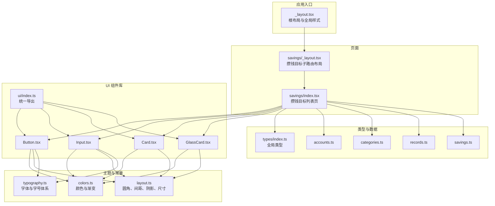
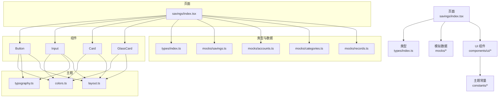
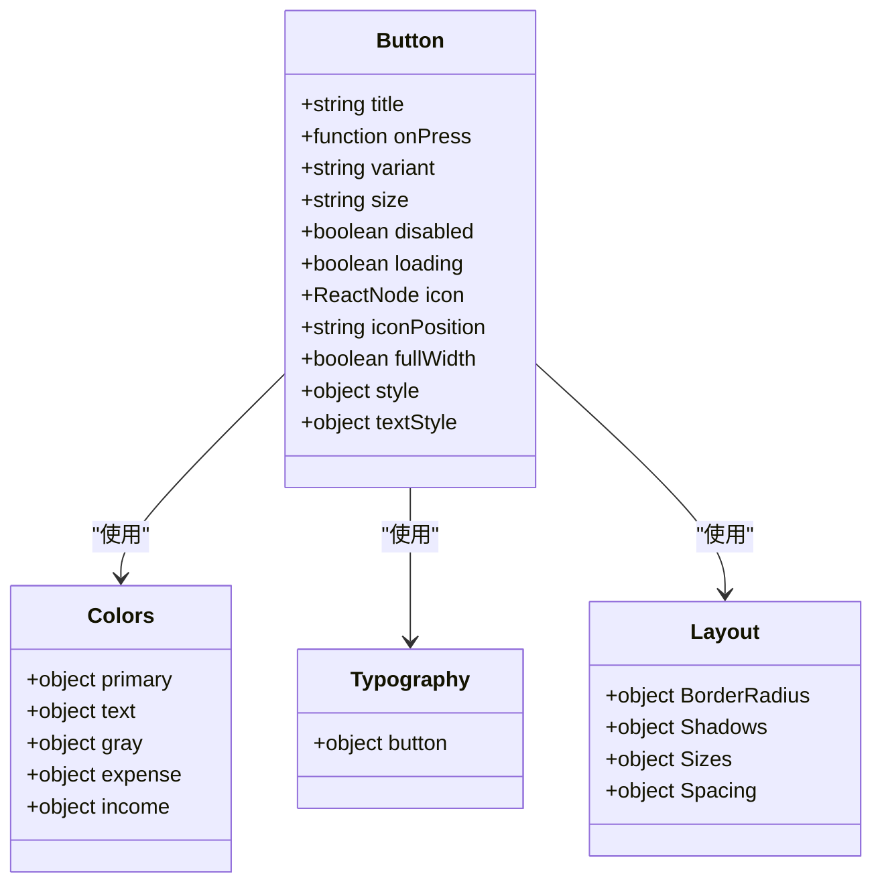
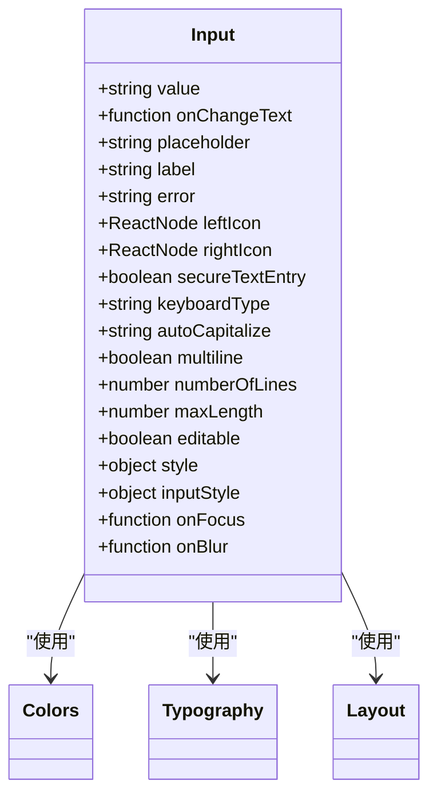
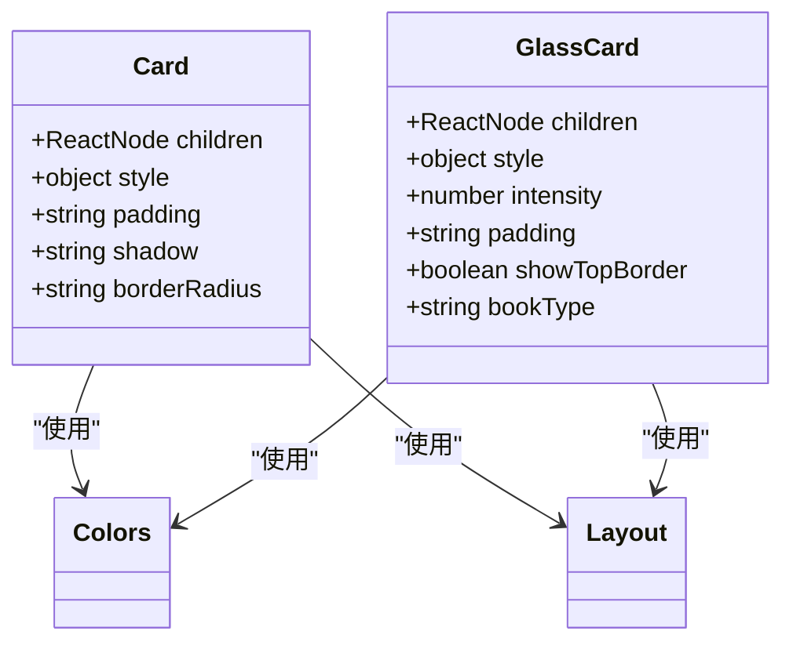
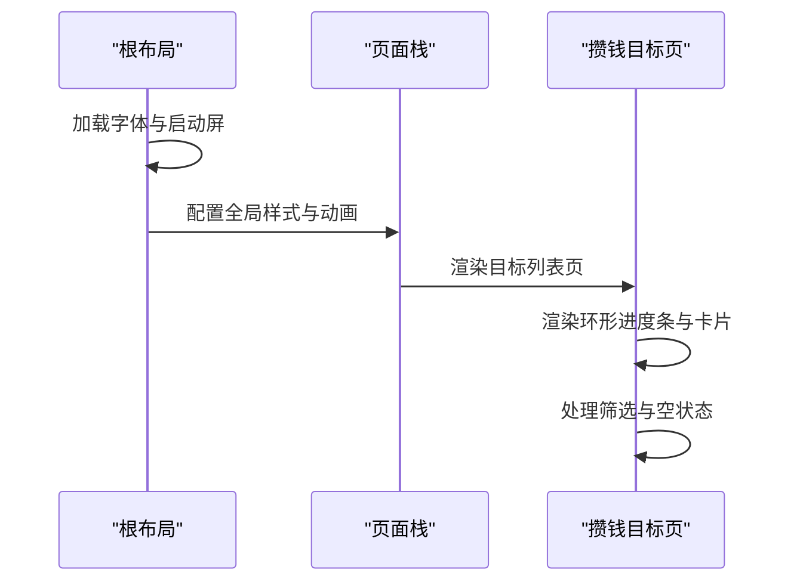
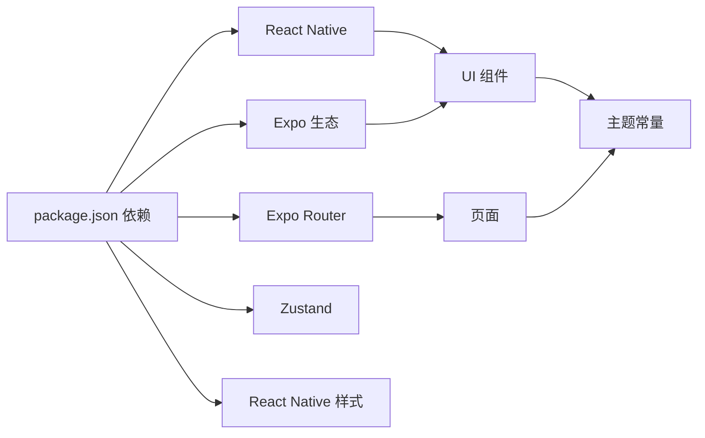

# 代码规范

<cite>
**本文引用的文件**
- [package.json](file://package.json)
- [tsconfig.json](file://tsconfig.json)
- [src/app/_layout.tsx](file://src/app/_layout.tsx)
- [src/app/savings/_layout.tsx](file://src/app/savings/_layout.tsx)
- [src/app/savings/index.tsx](file://src/app/savings/index.tsx)
- [src/components/ui/Button.tsx](file://src/components/ui/Button.tsx)
- [src/components/ui/Card.tsx](file://src/components/ui/Card.tsx)
- [src/components/ui/GlassCard.tsx](file://src/components/ui/GlassCard.tsx)
- [src/components/ui/Input.tsx](file://src/components/ui/Input.tsx)
- [src/components/ui/index.ts](file://src/components/ui/index.ts)
- [src/constants/colors.ts](file://src/constants/colors.ts)
- [src/constants/layout.ts](file://src/constants/layout.ts)
- [src/constants/typography.ts](file://src/constants/typography.ts)
- [src/types/index.ts](file://src/types/index.ts)
- [src/mocks/accounts.ts](file://src/mocks/accounts.ts)
- [src/mocks/categories.ts](file://src/mocks/categories.ts)
- [src/mocks/records.ts](file://src/mocks/records.ts)
- [src/mocks/savings.ts](file://src/mocks/savings.ts)
</cite>

## 目录
1. [简介](#简介)
2. [项目结构](#项目结构)
3. [核心组件](#核心组件)
4. [架构概览](#架构概览)
5. [详细组件分析](#详细组件分析)
6. [依赖分析](#依赖分析)
7. [性能考虑](#性能考虑)
8. [故障排查指南](#故障排查指南)
9. [结论](#结论)
10. [附录](#附录)

## 简介
本规范面向“攒钱记账”项目，旨在统一 TypeScript 编码风格、命名约定、文件组织结构与组件开发流程，明确 UI 组件设计原则与复用策略，规范样式管理与主题系统使用，并提供代码格式化、注释与文档编写要求以及代码审查清单与质量检查要点。规范以现有代码为依据，结合可扩展性与团队协作需求制定。

## 项目结构
项目采用基于功能的分层组织方式，核心目录与职责如下：
- src/app：页面路由与布局，使用 Expo Router 管理页面栈与导航
- src/components/ui：UI 组件库，提供 Button、Input、Card、GlassCard 等通用组件
- src/constants：设计常量与主题系统，包括颜色、排版、布局与尺寸
- src/mocks：模拟数据，支撑页面与组件演示
- src/types：全局类型定义，统一业务模型与接口
- 根目录配置：package.json、tsconfig.json 等

图表来源
- [src/app/_layout.tsx](file://src/app/_layout.tsx#L1-L55)
- [src/app/savings/_layout.tsx](file://src/app/savings/_layout.tsx#L1-L20)
- [src/app/savings/index.tsx](file://src/app/savings/index.tsx#L1-L341)
- [src/components/ui/Button.tsx](file://src/components/ui/Button.tsx#L1-L204)
- [src/components/ui/Input.tsx](file://src/components/ui/Input.tsx#L1-L194)
- [src/components/ui/Card.tsx](file://src/components/ui/Card.tsx#L1-L94)
- [src/components/ui/GlassCard.tsx](file://src/components/ui/GlassCard.tsx#L1-L126)
- [src/components/ui/index.ts](file://src/components/ui/index.ts#L1-L9)
- [src/constants/colors.ts](file://src/constants/colors.ts#L1-L88)
- [src/constants/layout.ts](file://src/constants/layout.ts#L1-L182)
- [src/constants/typography.ts](file://src/constants/typography.ts#L1-L149)
- [src/types/index.ts](file://src/types/index.ts#L1-L141)
- [src/mocks/accounts.ts](file://src/mocks/accounts.ts#L1-L91)
- [src/mocks/categories.ts](file://src/mocks/categories.ts#L1-L69)
- [src/mocks/records.ts](file://src/mocks/records.ts#L1-L117)
- [src/mocks/savings.ts](file://src/mocks/savings.ts#L1-L111)

章节来源
- [src/app/_layout.tsx](file://src/app/_layout.tsx#L1-L55)
- [src/app/savings/_layout.tsx](file://src/app/savings/_layout.tsx#L1-L20)
- [src/app/savings/index.tsx](file://src/app/savings/index.tsx#L1-L341)
- [src/components/ui/index.ts](file://src/components/ui/index.ts#L1-L9)
- [tsconfig.json](file://tsconfig.json#L1-L14)

## 核心组件
- UI 组件库集中于 src/components/ui，通过统一导出文件集中管理，便于按需引入与版本升级
- 主题系统通过 constants 下的颜色、排版、布局常量统一约束视觉一致性
- 页面通过 mocks 提供的数据驱动展示，便于在无后端情况下进行开发与联调

章节来源
- [src/components/ui/index.ts](file://src/components/ui/index.ts#L1-L9)
- [src/constants/colors.ts](file://src/constants/colors.ts#L1-L88)
- [src/constants/typography.ts](file://src/constants/typography.ts#L1-L149)
- [src/constants/layout.ts](file://src/constants/layout.ts#L1-L182)
- [src/mocks/savings.ts](file://src/mocks/savings.ts#L1-L111)

## 架构概览
整体采用“页面 + 组件 + 主题常量 + 类型 + 模拟数据”的分层架构，页面负责业务编排，组件负责 UI 抽象，主题常量提供一致的视觉语言，类型定义保障数据契约，模拟数据支撑前端开发。

图表来源
- [src/app/savings/index.tsx](file://src/app/savings/index.tsx#L1-L341)
- [src/components/ui/Button.tsx](file://src/components/ui/Button.tsx#L1-L204)
- [src/components/ui/Input.tsx](file://src/components/ui/Input.tsx#L1-L194)
- [src/components/ui/Card.tsx](file://src/components/ui/Card.tsx#L1-L94)
- [src/components/ui/GlassCard.tsx](file://src/components/ui/GlassCard.tsx#L1-L126)
- [src/constants/colors.ts](file://src/constants/colors.ts#L1-L88)
- [src/constants/typography.ts](file://src/constants/typography.ts#L1-L149)
- [src/constants/layout.ts](file://src/constants/layout.ts#L1-L182)
- [src/types/index.ts](file://src/types/index.ts#L1-L141)
- [src/mocks/savings.ts](file://src/mocks/savings.ts#L1-L111)
- [src/mocks/accounts.ts](file://src/mocks/accounts.ts#L1-L91)
- [src/mocks/categories.ts](file://src/mocks/categories.ts#L1-L69)
- [src/mocks/records.ts](file://src/mocks/records.ts#L1-L117)

## 详细组件分析

### Button 组件规范
- Props 类型定义：明确 title、onPress、variant、size、disabled、loading、icon、iconPosition、fullWidth、style、textStyle 等字段
- 变体与尺寸：通过 variant 与 size 控制外观与高度；根据禁用或加载状态调整样式
- 渐变与非渐变：primary 使用渐变背景，其他变体使用纯色背景；outline/ghost 透明背景配合描边
- 文本与图标：支持左右图标，文本样式继承 Typography.button 并结合禁用/加载状态色值
- 样式来源：Colors、Typography、BorderRadius、Shadows、Sizes、Spacing

图表来源
- [src/components/ui/Button.tsx](file://src/components/ui/Button.tsx#L22-L34)
- [src/constants/colors.ts](file://src/constants/colors.ts#L1-L88)
- [src/constants/typography.ts](file://src/constants/typography.ts#L1-L149)
- [src/constants/layout.ts](file://src/constants/layout.ts#L1-L182)

章节来源
- [src/components/ui/Button.tsx](file://src/components/ui/Button.tsx#L1-L204)
- [src/constants/colors.ts](file://src/constants/colors.ts#L1-L88)
- [src/constants/typography.ts](file://src/constants/typography.ts#L1-L149)
- [src/constants/layout.ts](file://src/constants/layout.ts#L1-L182)

### Input 组件规范
- Props 类型定义：覆盖输入值、变更回调、占位符、标签、错误提示、左右图标、安全输入、键盘类型、自动大写、多行、行数、最大长度、是否可编辑、样式与输入样式、焦点回调等
- 焦点状态：内部维护 isFocused，根据焦点状态切换底部渐变线与错误态
- 样式与布局：label、输入区、左右图标、底部线、错误文本均使用主题常量控制
- 多行与对齐：多行输入支持最小高度与顶部对齐

图表来源
- [src/components/ui/Input.tsx](file://src/components/ui/Input.tsx#L20-L39)
- [src/constants/colors.ts](file://src/constants/colors.ts#L1-L88)
- [src/constants/typography.ts](file://src/constants/typography.ts#L1-L149)
- [src/constants/layout.ts](file://src/constants/layout.ts#L1-L182)

章节来源
- [src/components/ui/Input.tsx](file://src/components/ui/Input.tsx#L1-L194)
- [src/constants/colors.ts](file://src/constants/colors.ts#L1-L88)
- [src/constants/typography.ts](file://src/constants/typography.ts#L1-L149)
- [src/constants/layout.ts](file://src/constants/layout.ts#L1-L182)

### Card 与 GlassCard 组件规范
- Card：支持内边距、阴影、圆角参数化；默认卡片背景来自 Colors.card
- GlassCard：支持毛玻璃效果（iOS），Android 使用半透明背景替代；支持顶部渐变边框（根据账本类型）

图表来源
- [src/components/ui/Card.tsx](file://src/components/ui/Card.tsx#L10-L16)
- [src/components/ui/GlassCard.tsx](file://src/components/ui/GlassCard.tsx#L13-L20)
- [src/constants/colors.ts](file://src/constants/colors.ts#L1-L88)
- [src/constants/layout.ts](file://src/constants/layout.ts#L1-L182)

章节来源
- [src/components/ui/Card.tsx](file://src/components/ui/Card.tsx#L1-L94)
- [src/components/ui/GlassCard.tsx](file://src/components/ui/GlassCard.tsx#L1-L126)
- [src/constants/colors.ts](file://src/constants/colors.ts#L1-L88)
- [src/constants/layout.ts](file://src/constants/layout.ts#L1-L182)

### 页面与布局规范
- 根布局：统一状态栏样式、全局背景色、手势根容器、启动屏处理与字体加载
- 子路由布局：统一内容区背景色与头部显示控制
- 目标列表页：自定义环形进度条、目标卡片、筛选器、空状态与 SafeAreaView 使用

图表来源
- [src/app/_layout.tsx](file://src/app/_layout.tsx#L17-L48)
- [src/app/savings/_layout.tsx](file://src/app/savings/_layout.tsx#L8-L19)
- [src/app/savings/index.tsx](file://src/app/savings/index.tsx#L121-L198)

章节来源
- [src/app/_layout.tsx](file://src/app/_layout.tsx#L1-L55)
- [src/app/savings/_layout.tsx](file://src/app/savings/_layout.tsx#L1-L20)
- [src/app/savings/index.tsx](file://src/app/savings/index.tsx#L1-L341)

## 依赖分析
- 运行时依赖：Expo 生态、React、React Native、路由、手势、动画、渐变、模糊、Zustand 状态管理等
- 开发依赖：TypeScript、React 类型
- 路由与页面：Expo Router 管理页面栈与导航
- 主题与样式：通过 constants 下的 colors、typography、layout 统一约束

图表来源
- [package.json](file://package.json#L11-L34)
- [src/app/_layout.tsx](file://src/app/_layout.tsx#L10-L12)
- [src/app/savings/_layout.tsx](file://src/app/savings/_layout.tsx#L5-L6)

章节来源
- [package.json](file://package.json#L1-L43)
- [tsconfig.json](file://tsconfig.json#L1-L14)

## 性能考虑
- 样式优化：优先使用 StyleSheet.create，避免在渲染中创建对象；合并样式时减少内联计算
- 组件复用：通过统一导出与主题常量降低重复计算与样式分支
- 渐变与模糊：仅在必要场景使用，注意平台差异（Android 替代方案）
- 列表渲染：使用稳定 key，避免不必要的重新渲染
- 数据访问：mock 数据仅用于开发，生产环境应替换为真实数据源

## 故障排查指南
- 启动屏与字体：确保启动屏阻止与字体加载逻辑正确执行，避免白屏或闪烁
- 导航与页面栈：确认页面栈 screenOptions 与 header 显示控制
- 样式覆盖：检查主题常量与局部样式的优先级，避免意外覆盖
- 图标与渐变：确认图标与渐变颜色在不同平台下的一致性
- 空状态与交互：验证空状态文案与交互反馈

章节来源
- [src/app/_layout.tsx](file://src/app/_layout.tsx#L14-L28)
- [src/app/savings/_layout.tsx](file://src/app/savings/_layout.tsx#L11-L14)
- [src/app/savings/index.tsx](file://src/app/savings/index.tsx#L185-L191)

## 结论
本规范以现有代码为基础，明确了 TypeScript 编码标准、命名约定、文件组织结构、组件开发规范、UI 设计原则与复用策略、样式与主题系统使用、代码格式化与注释要求以及代码审查清单与质量检查要点。建议在后续迭代中持续完善类型定义、组件抽象与主题常量，提升可维护性与一致性。

## 附录

### TypeScript 编码标准与命名约定
- 文件命名：页面与组件使用 PascalCase，工具函数与常量使用 camelCase，类型名使用 PascalCase
- 导出与导入：组件通过统一导出文件集中导出，路径别名使用 @/ 前缀
- 类型定义：优先使用接口与联合类型，避免 any；枚举使用字面量联合类型
- 命名空间：常量与配置集中于 constants 目录，组件集中于 components/ui 目录

章节来源
- [src/components/ui/index.ts](file://src/components/ui/index.ts#L1-L9)
- [tsconfig.json](file://tsconfig.json#L7-L11)

### 文件组织结构
- src/app：页面与布局，按功能模块划分
- src/components/ui：通用 UI 组件，按功能拆分文件
- src/constants：设计常量与主题系统
- src/mocks：模拟数据，按领域拆分
- src/types：全局类型定义

章节来源
- [src/app/_layout.tsx](file://src/app/_layout.tsx#L1-L55)
- [src/app/savings/index.tsx](file://src/app/savings/index.tsx#L1-L341)
- [src/components/ui/Button.tsx](file://src/components/ui/Button.tsx#L1-L204)
- [src/constants/colors.ts](file://src/constants/colors.ts#L1-L88)
- [src/mocks/savings.ts](file://src/mocks/savings.ts#L1-L111)
- [src/types/index.ts](file://src/types/index.ts#L1-L141)

### 组件开发规范
- 函数组件：使用 React.FC 接口定义 Props；默认参数与解构赋值保持简洁
- Props 类型：明确必填与可选字段；避免在组件内部推断复杂类型
- 状态管理：当前项目使用 React 内置状态；推荐后续引入 Zustand 管理跨组件共享状态
- 事件处理：回调函数作为 Props 传入，避免在组件内部直接绑定 DOM 事件
- 样式与主题：统一使用 Colors、Typography、Layout 常量，减少硬编码

章节来源
- [src/components/ui/Button.tsx](file://src/components/ui/Button.tsx#L36-L48)
- [src/components/ui/Input.tsx](file://src/components/ui/Input.tsx#L41-L60)
- [src/components/ui/Card.tsx](file://src/components/ui/Card.tsx#L18-L24)
- [src/components/ui/GlassCard.tsx](file://src/components/ui/GlassCard.tsx#L22-L29)
- [package.json](file://package.json#L34-L34)

### UI 组件设计原则与复用策略
- 设计原则：一致性（颜色、字号、间距）、层次感（阴影、圆角）、可读性（对比度）、可用性（交互反馈）
- 复用策略：将通用样式与行为抽离为独立组件；通过 Props 参数化外观与行为；使用主题常量统一视觉

章节来源
- [src/constants/colors.ts](file://src/constants/colors.ts#L1-L88)
- [src/constants/typography.ts](file://src/constants/typography.ts#L1-L149)
- [src/constants/layout.ts](file://src/constants/layout.ts#L1-L182)

### 样式管理规范与主题系统使用
- 颜色系统：主色、账本标识色、收支色、背景、卡片、文字、边框、状态色与灰度
- 字体系统：字体族、字号、行高、字重与预设样式
- 布局系统：圆角、间距、阴影、尺寸、动画时长、Z-index 层级
- 使用建议：优先从常量中取值，避免直接写死数值；在组件内部仅做必要的样式组合

章节来源
- [src/constants/colors.ts](file://src/constants/colors.ts#L6-L87)
- [src/constants/typography.ts](file://src/constants/typography.ts#L9-L148)
- [src/constants/layout.ts](file://src/constants/layout.ts#L9-L181)

### 代码格式化规则、注释标准与文档编写要求
- 格式化：遵循 TypeScript 严格模式与 JSX 规范；使用统一的缩进与换行
- 注释：文件头包含模块说明与设计规范；复杂逻辑添加注释说明；导出项添加简要说明
- 文档：README 或 Wiki 记录项目背景、安装步骤、运行方式与贡献指南

章节来源
- [tsconfig.json](file://tsconfig.json#L4-L4)
- [src/components/ui/Button.tsx](file://src/components/ui/Button.tsx#L1-L3)
- [src/constants/colors.ts](file://src/constants/colors.ts#L1-L4)

### 代码审查清单与质量检查要点
- 类型安全：确保所有 Props 与状态有明确类型定义；避免 any
- 组件职责：单一职责，避免过度耦合；可测试性良好
- 样式一致性：统一使用主题常量；避免硬编码颜色与尺寸
- 性能：避免在渲染中创建对象；合理使用 memo 与 key
- 可维护性：命名清晰、注释完整、模块边界明确
- 平台兼容：关注 iOS 与 Android 的差异实现

章节来源
- [src/components/ui/Button.tsx](file://src/components/ui/Button.tsx#L1-L204)
- [src/components/ui/Input.tsx](file://src/components/ui/Input.tsx#L1-L194)
- [src/components/ui/GlassCard.tsx](file://src/components/ui/GlassCard.tsx#L1-L126)
- [src/app/_layout.tsx](file://src/app/_layout.tsx#L1-L55)