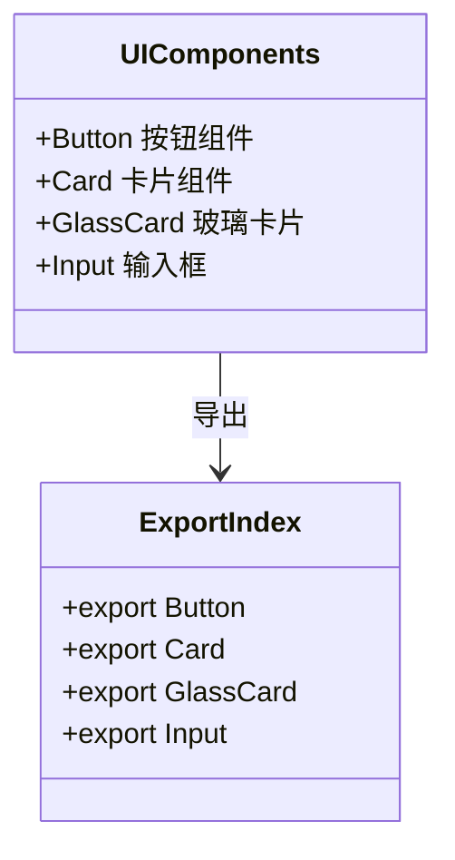
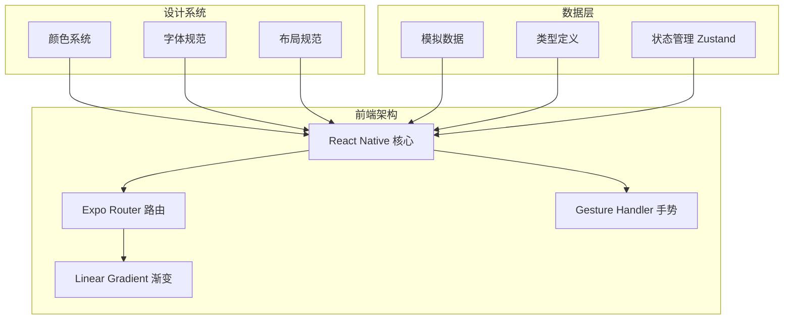
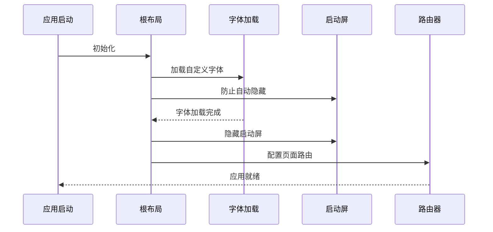
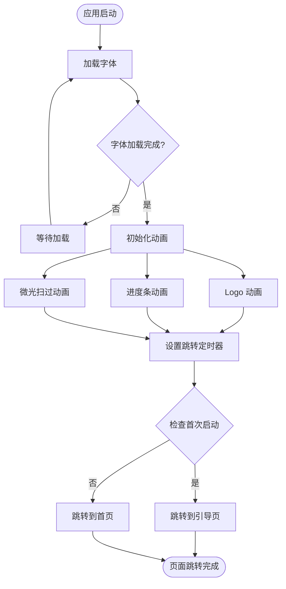
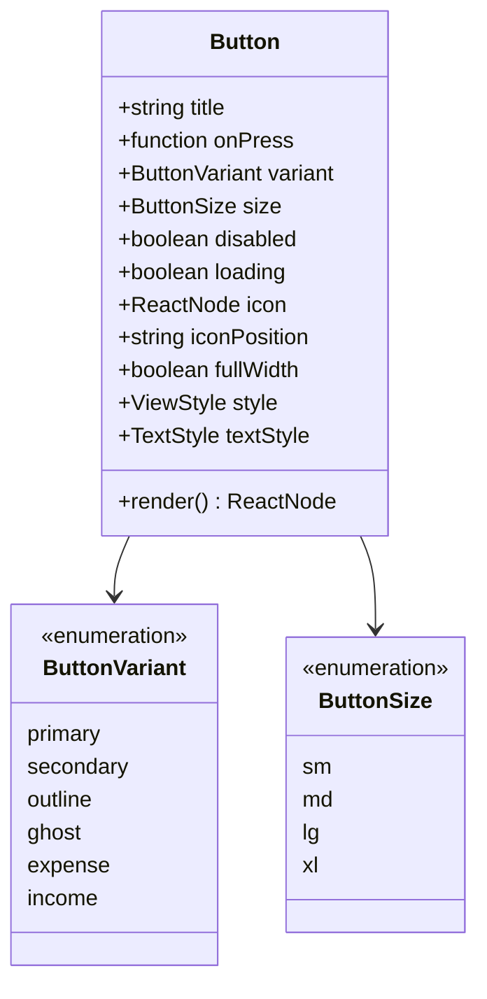

# 文件组织规范

<cite>
**本文档引用的文件**
- [src/app/_layout.tsx](file://src/app/_layout.tsx)
- [src/app/index.tsx](file://src/app/index.tsx)
- [src/components/ui/index.ts](file://src/components/ui/index.ts)
- [src/components/index.ts](file://src/components/index.ts)
- [src/constants/index.ts](file://src/constants/index.ts)
- [src/constants/colors.ts](file://src/constants/colors.ts)
- [src/constants/typography.ts](file://src/constants/typography.ts)
- [src/constants/layout.ts](file://src/constants/layout.ts)
- [src/mocks/index.ts](file://src/mocks/index.ts)
- [src/mocks/categories.ts](file://src/mocks/categories.ts)
- [src/components/ui/Button.tsx](file://src/components/ui/Button.tsx)
- [src/types/index.ts](file://src/types/index.ts)
- [tsconfig.json](file://tsconfig.json)
- [app.json](file://app.json)
- [package.json](file://package.json)
</cite>

## 目录
1. [引言](#引言)
2. [项目结构](#项目结构)
3. [核心组件](#核心组件)
4. [架构概览](#架构概览)
5. [详细组件分析](#详细组件分析)
6. [依赖分析](#依赖分析)
7. [性能考虑](#性能考虑)
8. [故障排除指南](#故障排除指南)
9. [结论](#结论)
10. [附录](#附录)

## 引言

本文档为"攒钱记账"项目制定标准化的文件和目录结构组织规范，旨在建立清晰、可维护且易于扩展的代码架构。该规范基于现有项目结构，明确了src目录下的文件分类、命名约定、导入路径策略以及静态资源配置方法。

## 项目结构

项目采用基于功能模块的目录组织方式，主要分为以下核心目录：

```mermaid
graph TB
subgraph "src 核心目录"
APP[src/app/ 应用入口]
COMP[src/components/ 组件库]
CONST[src/constants/ 常量定义]
MOCK[src/mocks/ 模拟数据]
TYPES[src/types/ 类型定义]
end
subgraph "应用入口"
LAYOUT[_layout.tsx 根布局]
HOME[index.tsx 启动页]
TABS[(tabs) 标签页]
LOGIN[login.tsx 登录页]
ONBOARD[onboarding.tsx 引导页]
SAVINGS[savings/ 攒钱模块]
end
subgraph "组件库"
UI[ui/ UI组件]
UI_BTN[Button.tsx 按钮组件]
UI_CARD[Card.tsx 卡片组件]
UI_GLASS[GlassCard.tsx 玻璃卡片]
UI_INPUT[Input.tsx 输入框组件]
end
subgraph "常量定义"
COLORS[colors.ts 颜色系统]
TYPO[typography.ts 字体规范]
LAYOUT_CONST[layout.ts 布局规范]
end
subgraph "模拟数据"
CAT[categories.ts 分类数据]
ACC[accounts.ts 账户数据]
REC[records.ts 记录数据]
SAVE[savings.ts 攒钱数据]
end
APP --> LAYOUT
APP --> HOME
APP --> TABS
APP --> LOGIN
APP --> ONBOARD
APP --> SAVINGS
COMP --> UI
UI --> UI_BTN
UI --> UI_CARD
UI --> UI_GLASS
UI --> UI_INPUT
CONST --> COLORS
CONST --> TYPO
CONST --> LAYOUT_CONST
MOCK --> CAT
MOCK --> ACC
MOCK --> REC
MOCK --> SAVE
```

**图表来源**
- [src/app/_layout.tsx](file://src/app/_layout.tsx#L1-L55)
- [src/components/ui/index.ts](file://src/components/ui/index.ts#L1-L9)
- [src/constants/index.ts](file://src/constants/index.ts#L1-L12)

**章节来源**
- [src/app/_layout.tsx](file://src/app/_layout.tsx#L1-L55)
- [src/app/index.tsx](file://src/app/index.tsx#L1-L249)

## 核心组件

### 页面组件组织规范

页面组件遵循路由驱动的目录结构，每个页面文件负责完整的页面逻辑：

- **文件命名**: 使用页面英文名称加`.tsx`扩展名
- **目录结构**: 按功能模块划分子目录
- **布局管理**: 通过`_layout.tsx`统一管理页面布局和导航

关键页面组件：
- `src/app/index.tsx` - 应用启动页，包含Logo动画和进度指示
- `src/app/login.tsx` - 用户登录页面
- `src/app/onboarding.tsx` - 应用引导页面
- `src/app/(tabs)/` - 底部标签页容器

### UI组件组织规范

UI组件采用统一的导出模式，确保良好的模块化：



**图表来源**
- [src/components/ui/index.ts](file://src/components/ui/index.ts#L1-L9)

**章节来源**
- [src/components/ui/index.ts](file://src/components/ui/index.ts#L1-L9)
- [src/components/ui/Button.tsx](file://src/components/ui/Button.tsx#L1-L204)

### 常量定义组织规范

常量系统采用模块化设计，按功能域分离：

- **colors.ts**: 颜色系统，包含主色调、状态色、灰度色板
- **typography.ts**: 字体规范，包含字体族、字号、字重、行高
- **layout.ts**: 布局规范，包含圆角、间距、阴影、尺寸

**章节来源**
- [src/constants/colors.ts](file://src/constants/colors.ts#L1-L88)
- [src/constants/typography.ts](file://src/constants/typography.ts#L1-L149)
- [src/constants/layout.ts](file://src/constants/layout.ts#L1-L182)

### 模拟数据组织规范

模拟数据采用分类管理，便于测试和开发：

- **categories.ts**: 收支分类数据，支持个人和公司账本
- **accounts.ts**: 账户数据
- **records.ts**: 账单记录数据
- **savings.ts**: 攒钱相关数据

**章节来源**
- [src/mocks/categories.ts](file://src/mocks/categories.ts#L1-L69)

## 架构概览

项目采用现代化的React Native架构，结合Expo生态系统：



**图表来源**
- [src/app/_layout.tsx](file://src/app/_layout.tsx#L1-L55)
- [src/components/ui/Button.tsx](file://src/components/ui/Button.tsx#L1-L204)

## 详细组件分析

### 根布局组件分析

根布局组件负责应用的整体配置和全局状态管理：



**图表来源**
- [src/app/_layout.tsx](file://src/app/_layout.tsx#L17-L48)

### 启动页组件分析

启动页实现复杂的动画效果和页面跳转逻辑：



**图表来源**
- [src/app/index.tsx](file://src/app/index.tsx#L21-L64)

**章节来源**
- [src/app/index.tsx](file://src/app/index.tsx#L1-L249)

### 按钮组件分析

按钮组件展示复杂的状态管理和样式组合：



**图表来源**
- [src/components/ui/Button.tsx](file://src/components/ui/Button.tsx#L19-L34)

**章节来源**
- [src/components/ui/Button.tsx](file://src/components/ui/Button.tsx#L1-L204)

## 依赖分析

项目依赖关系呈现清晰的层次结构：

```mermaid
graph TB
subgraph "运行时依赖"
EXPO[expo@~52.0.0]
RN[react-native@0.76.3]
RR[react@18.3.1]
ROUTER[expo-router@~4.0.0]
GRAD[expo-linear-gradient@~14.0.0]
BLUR[expo-blur@~14.0.0]
ZUSTAND[zustand@^4.5.0]
end
subgraph "开发依赖"
TS[typescript@~5.3.0]
TYPES[@types/react@~18.3.0]
BABEL[@babel/core@^7.25.0]
end
subgraph "应用特性"
FONTS[字体系统]
ANIM[动画效果]
NAV[导航路由]
STATE[状态管理]
end
EXPO --> FONTS
RN --> ANIM
ROUTER --> NAV
ZUSTAND --> STATE
TS --> EXPO
TYPES --> RN
```

**图表来源**
- [package.json](file://package.json#L11-L35)

**章节来源**
- [package.json](file://package.json#L1-L43)

## 性能考虑

### 导入路径优化

项目采用别名导入机制，提升代码可读性和维护性：

- **别名配置**: `@/*` 指向 `./src/*`
- **导入模式**: 统一使用相对导入 `@/module/path`
- **避免循环依赖**: 通过合理的模块拆分避免依赖环

### 资源管理策略

- **字体加载**: 使用 `expo-font` 实现异步字体加载
- **图片优化**: 建议使用矢量图标和适当的图片格式
- **内存管理**: 合理使用动画组件，及时清理定时器

## 故障排除指南

### 常见问题及解决方案

1. **字体加载失败**
   - 检查字体文件路径
   - 确认 `useFonts` 配置正确
   - 验证字体文件格式兼容性

2. **页面路由错误**
   - 检查 `_layout.tsx` 中的页面声明
   - 确认文件命名与路由配置一致
   - 验证 `expo-router` 插件配置

3. **样式导入问题**
   - 确认 `tsconfig.json` 中的路径映射
   - 检查别名导入语法
   - 验证模块导出格式

**章节来源**
- [tsconfig.json](file://tsconfig.json#L7-L10)
- [app.json](file://app.json#L21-L26)

## 结论

本文件组织规范为"攒钱记账"项目建立了标准化的代码架构基础。通过明确的目录结构、命名约定和导入策略，项目实现了良好的模块化和可维护性。建议在后续开发中严格遵守这些规范，确保代码质量的一致性和团队协作效率。

## 附录

### TypeScript配置要点

- **严格模式**: 启用 `strict: true`
- **路径映射**: 使用 `@/*` 别名简化导入
- **类型安全**: 全面的类型定义覆盖业务模型

### 版本控制建议

- **配置文件**: `app.json` 和 `tsconfig.json` 需要版本控制
- **环境变量**: 区分开发和生产环境配置
- **依赖管理**: 定期更新依赖包，保持安全性