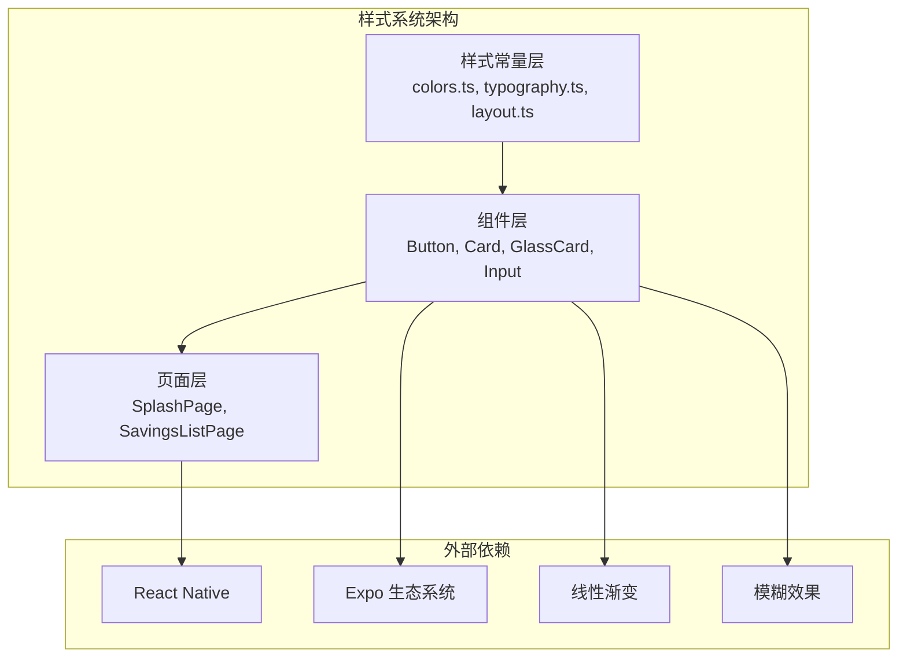
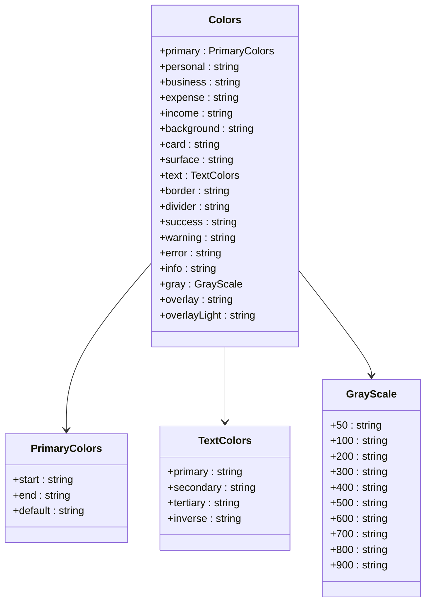
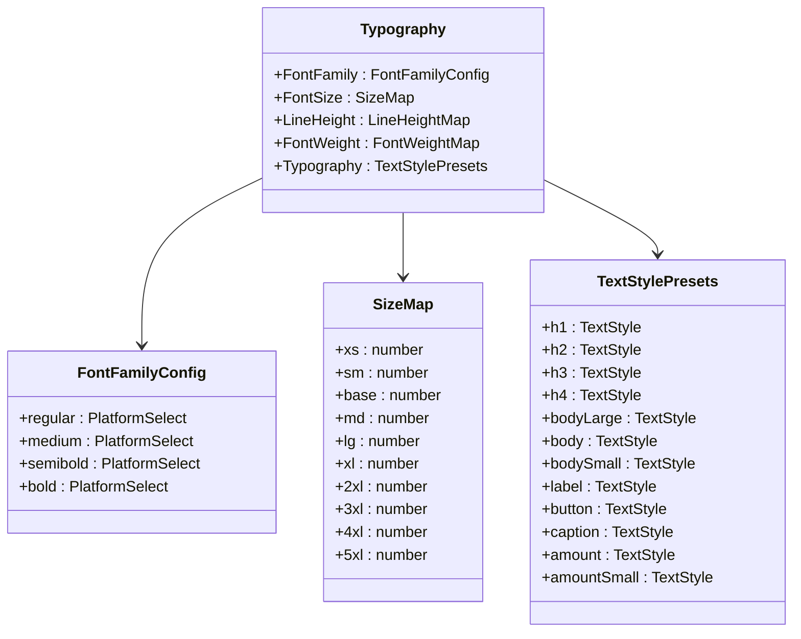
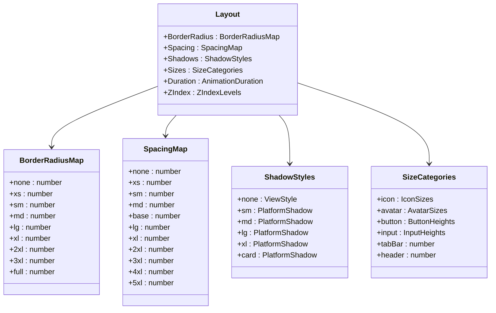
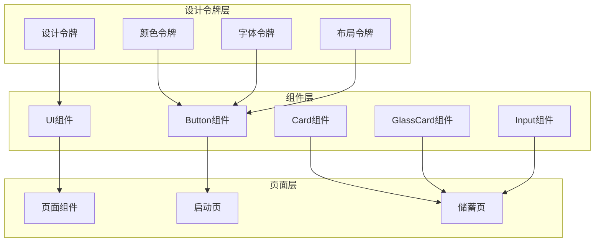
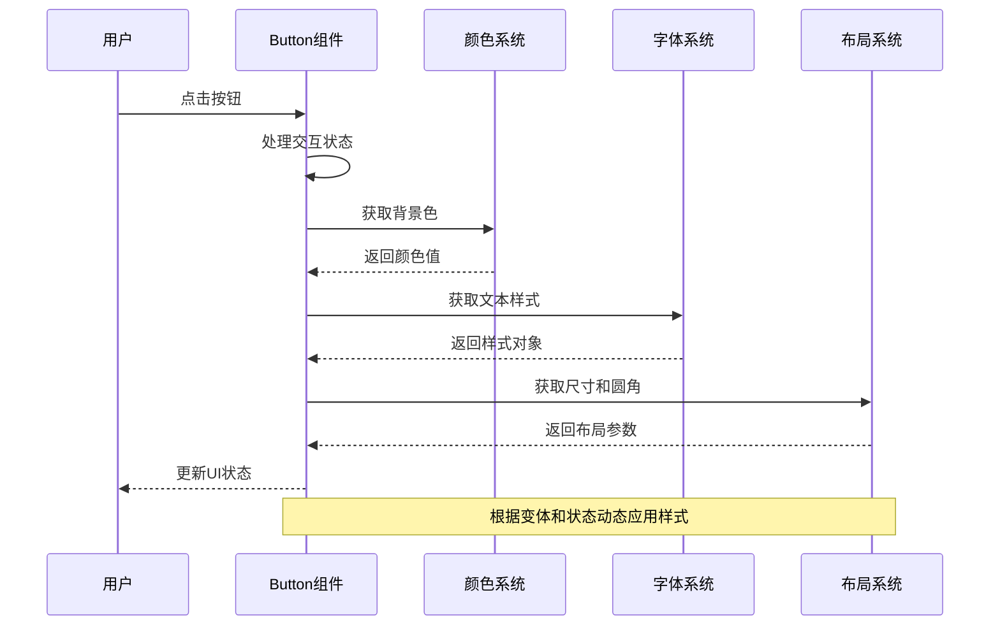
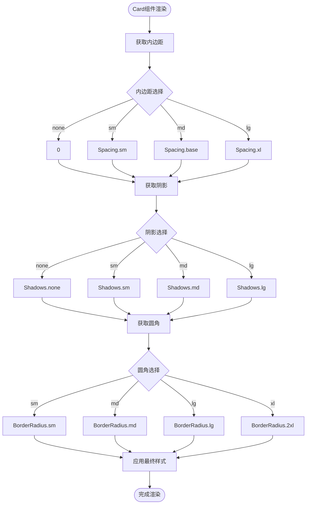
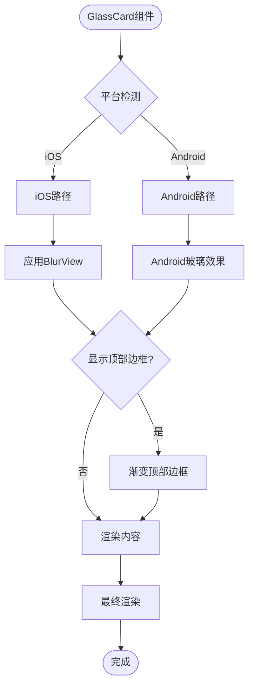
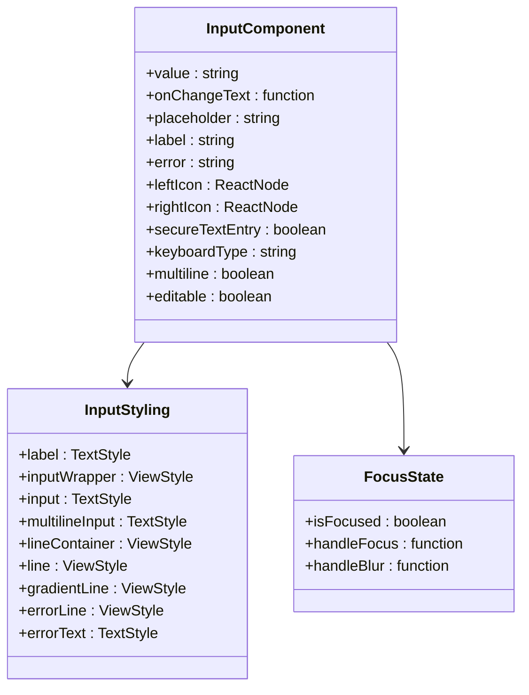
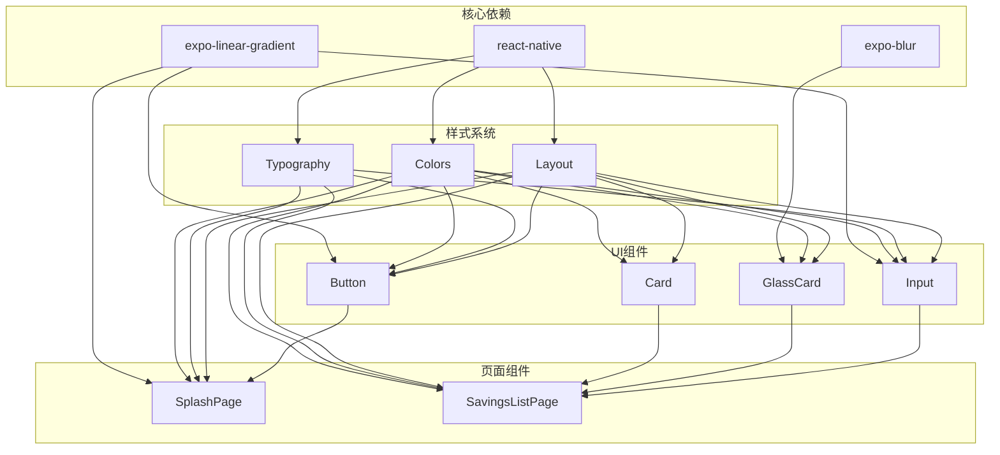

# 样式和命名规范

<cite>
**本文档引用的文件**
- [colors.ts](file://src/constants/colors.ts)
- [typography.ts](file://src/constants/typography.ts)
- [layout.ts](file://src/constants/layout.ts)
- [index.ts](file://src/constants/index.ts)
- [Button.tsx](file://src/components/ui/Button.tsx)
- [Card.tsx](file://src/components/ui/Card.tsx)
- [GlassCard.tsx](file://src/components/ui/GlassCard.tsx)
- [Input.tsx](file://src/components/ui/Input.tsx)
- [index.ts](file://src/components/ui/index.ts)
- [index.tsx](file://src/app/index.tsx)
- [index.tsx](file://src/app/savings/index.tsx)
- [index.ts](file://src/types/index.ts)
- [package.json](file://package.json)
</cite>

## 目录
1. [简介](#简介)
2. [项目结构](#项目结构)
3. [核心组件](#核心组件)
4. [架构概览](#架构概览)
5. [详细组件分析](#详细组件分析)
6. [依赖分析](#依赖分析)
7. [性能考虑](#性能考虑)
8. [故障排除指南](#故障排除指南)
9. [结论](#结论)

## 简介

本文档建立了"攒钱记账"项目中样式设计和命名的统一规范。该规范基于项目现有的设计系统，涵盖了颜色系统、字体系统、布局系统以及组件命名规范，并提供了样式复用策略和主题定制方法。

项目采用现代化的设计理念，融合了玻璃态和微质感设计，通过精心设计的颜色系统、字体规范和布局标准，为用户提供一致且美观的视觉体验。

## 项目结构

项目采用模块化的样式架构，主要分为以下几个层次：

**图表来源**
- [colors.ts](file://src/constants/colors.ts#L1-L88)
- [typography.ts](file://src/constants/typography.ts#L1-L149)
- [layout.ts](file://src/constants/layout.ts#L1-L182)

**章节来源**
- [colors.ts](file://src/constants/colors.ts#L1-L88)
- [typography.ts](file://src/constants/typography.ts#L1-L149)
- [layout.ts](file://src/constants/layout.ts#L1-L182)

## 核心组件

### 颜色系统规范

颜色系统是整个设计语言的核心，采用了层次化的设计令牌结构：

**图表来源**
- [colors.ts](file://src/constants/colors.ts#L6-L75)

颜色系统包含以下关键特性：
- **主色调**：渐变青绿，象征成长与清晰
- **账本标识色**：个人账本紫色，公司账本蓝色
- **收支颜色**：收入绿色，支出红色
- **语义化颜色**：成功、警告、错误、信息状态色
- **灰度系统**：从50到900的完整灰度谱

**章节来源**
- [colors.ts](file://src/constants/colors.ts#L6-L75)

### 字体系统规范

字体系统采用跨平台兼容的设计，确保在iOS和Android平台上的一致性：

**图表来源**
- [typography.ts](file://src/constants/typography.ts#L8-L146)

字体系统规范包括：
- **字体家族**：iOS使用系统字体，Android使用Roboto系列
- **字号体系**：从xs到5xl的完整缩放系统
- **行高规范**：tight、normal、relaxed三种行高
- **字重系统**：regular、medium、semibold、bold四个等级
- **预设样式**：标题、正文、标签、按钮、说明等常用样式

**章节来源**
- [typography.ts](file://src/constants/typography.ts#L8-L146)

### 布局系统规范

布局系统提供了完整的间距、圆角、阴影和尺寸规范：

**图表来源**
- [layout.ts](file://src/constants/layout.ts#L8-L181)

布局系统特点：
- **间距系统**：基于16px基准的完整间距体系
- **圆角规范**：从none到full的圆角等级
- **阴影系统**：针对iOS和Android的差异化阴影
- **尺寸规范**：图标、头像、按钮、输入框的标准化尺寸
- **动画时长**：fast、normal、slow三个动画速度等级

**章节来源**
- [layout.ts](file://src/constants/layout.ts#L8-L181)

## 架构概览

样式系统采用"设计令牌 + 组件封装"的架构模式：

**图表来源**
- [index.ts](file://src/constants/index.ts#L5-L11)
- [index.ts](file://src/components/ui/index.ts#L5-L8)

## 详细组件分析

### Button组件样式规范

Button组件体现了完整的样式系统应用：

**图表来源**
- [Button.tsx](file://src/components/ui/Button.tsx#L36-L189)
- [colors.ts](file://src/constants/colors.ts#L6-L75)
- [typography.ts](file://src/constants/typography.ts#L62-L125)
- [layout.ts](file://src/constants/layout.ts#L21-L34)

Button组件的样式规范：
- **变体系统**：primary、secondary、outline、ghost、expense、income六种变体
- **尺寸系统**：sm、md、lg、xl四种尺寸
- **状态管理**：正常、禁用、加载状态的样式切换
- **渐变支持**：primary变体使用线性渐变效果
- **图标集成**：左右图标位置的自适应布局

**章节来源**
- [Button.tsx](file://src/components/ui/Button.tsx#L19-L34)

### Card组件样式规范

Card组件展示了卡片式设计的最佳实践：

**图表来源**
- [Card.tsx](file://src/components/ui/Card.tsx#L25-L68)

Card组件的样式特点：
- **灵活内边距**：支持none、sm、md、lg四种内边距
- **可选阴影**：提供none、sm、md、lg四种阴影效果
- **圆角适配**：支持多种圆角半径的组合
- **背景一致性**：统一使用card背景色

**章节来源**
- [Card.tsx](file://src/components/ui/Card.tsx#L18-L68)

### GlassCard组件样式规范

GlassCard组件实现了先进的毛玻璃效果：

**图表来源**
- [GlassCard.tsx](file://src/components/ui/GlassCard.tsx#L72-L88)
- [GlassCard.tsx](file://src/components/ui/GlassCard.tsx#L90-L106)

GlassCard组件的特殊处理：
- **平台适配**：iOS使用BlurView，Android使用半透明背景
- **渐变边框**：根据账本类型显示相应的渐变边框
- **毛玻璃效果**：实现现代感的透明度和模糊效果

**章节来源**
- [GlassCard.tsx](file://src/components/ui/GlassCard.tsx#L22-L106)

### Input组件样式规范

Input组件展现了表单控件的完整样式体系：

**图表来源**
- [Input.tsx](file://src/components/ui/Input.tsx#L41-L137)

Input组件的样式特色：
- **焦点状态**：根据聚焦状态动态切换底部线条样式
- **图标集成**：支持左侧和右侧图标的自适应布局
- **错误状态**：错误时显示红色线条和错误文本
- **多行支持**：支持单行和多行输入的样式适配

**章节来源**
- [Input.tsx](file://src/components/ui/Input.tsx#L41-L137)

## 依赖分析

样式系统的依赖关系呈现清晰的层次结构：

**图表来源**
- [package.json](file://package.json#L11-L34)
- [Button.tsx](file://src/components/ui/Button.tsx#L14-L17)
- [GlassCard.tsx](file://src/components/ui/GlassCard.tsx#L7-L10)
- [Input.tsx](file://src/components/ui/Input.tsx#L15-L18)

**章节来源**
- [package.json](file://package.json#L11-L34)

## 性能考虑

样式系统的性能优化策略：

1. **样式缓存**：React Native的StyleSheet.create提供样式缓存机制
2. **渐变优化**：使用预定义的渐变数组而非动态计算
3. **条件渲染**：根据状态动态选择样式，避免不必要的重渲染
4. **平台适配**：针对不同平台优化阴影和模糊效果的实现

## 故障排除指南

### 常见样式问题及解决方案

**问题1：颜色不一致**
- 检查是否使用了Colors常量而非硬编码颜色值
- 确认颜色令牌的正确使用

**问题2：字体显示异常**
- 验证字体家族的平台选择
- 检查字体大小和行高的对应关系

**问题3：布局错位**
- 确认间距系统的正确使用
- 检查圆角和阴影的组合使用

**问题4：平台差异**
- 验证平台特定的样式属性
- 检查Android和iOS的差异化处理

**章节来源**
- [colors.ts](file://src/constants/colors.ts#L6-L75)
- [typography.ts](file://src/constants/typography.ts#L8-L30)
- [layout.ts](file://src/constants/layout.ts#L42-L95)

## 结论

"攒钱记账"项目的样式系统通过统一的设计令牌、规范化的组件实现和完善的依赖管理，建立了一套完整且可扩展的样式架构。该系统具有以下优势：

1. **一致性**：通过设计令牌确保全局样式的统一性
2. **可维护性**：模块化的组织结构便于维护和扩展
3. **跨平台性**：针对iOS和Android的差异化处理
4. **可访问性**：合理的颜色对比度和字体规范
5. **性能优化**：通过缓存和条件渲染提升性能

这套样式规范为项目的长期发展奠定了坚实的基础，也为后续的主题定制和功能扩展提供了清晰的指导方向。