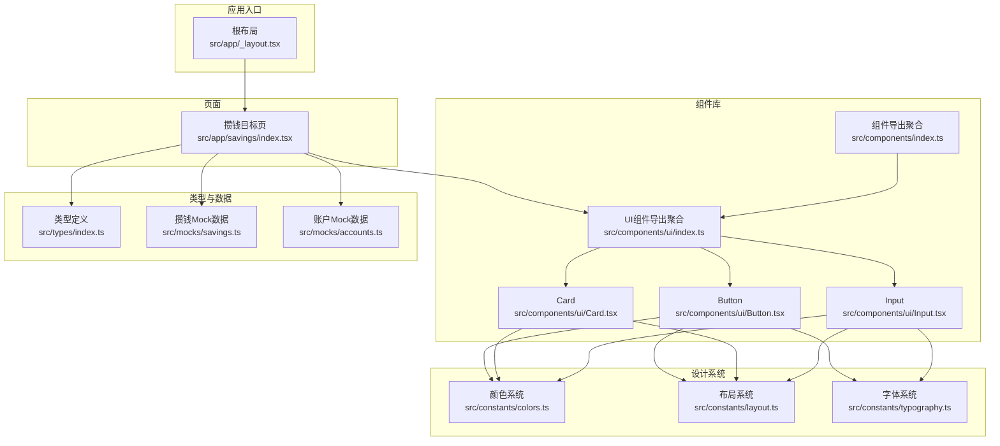
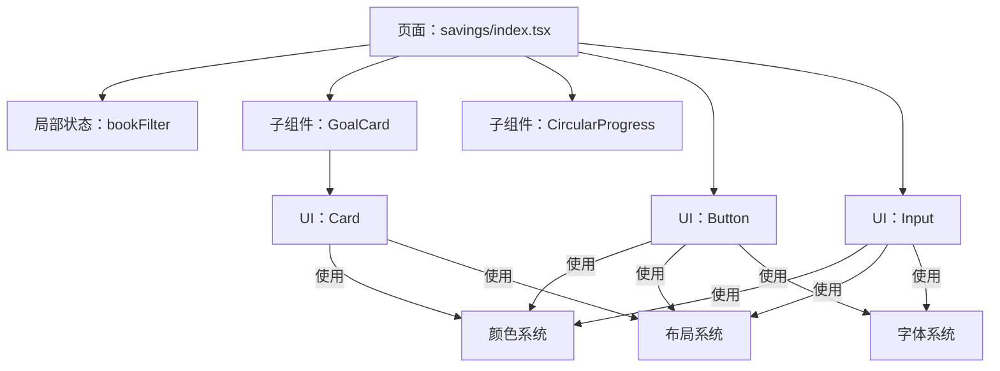
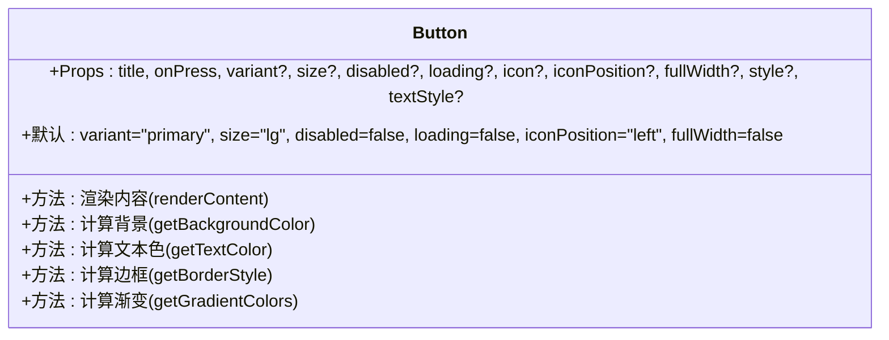
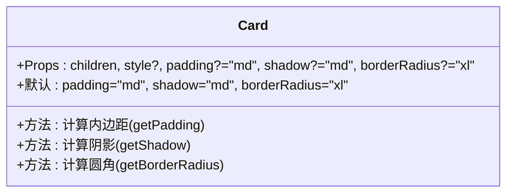
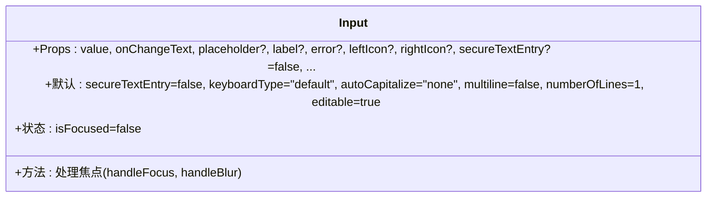
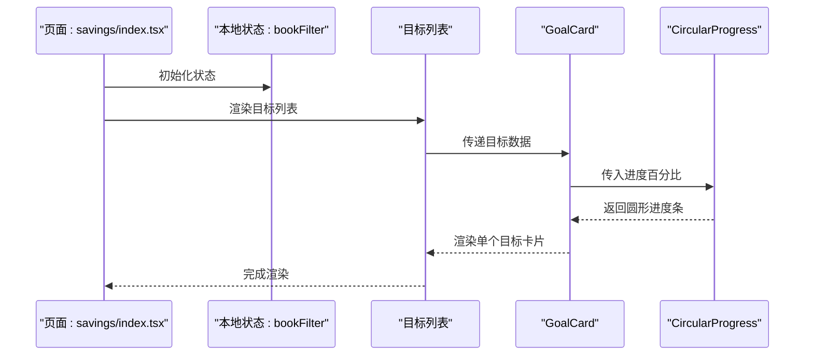
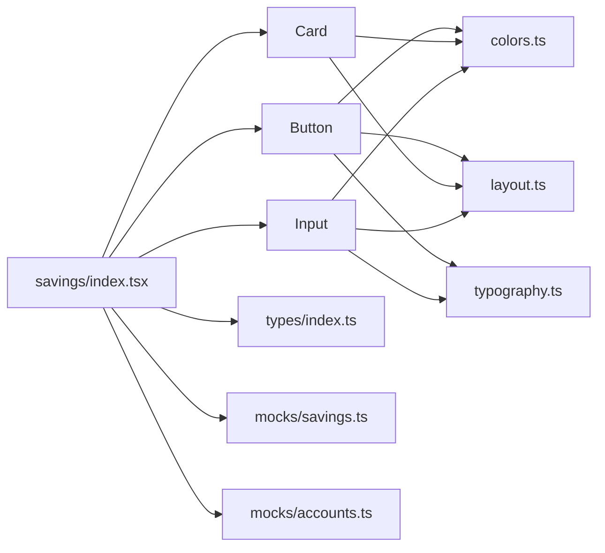

# 组件开发规范

<cite>
**本文引用的文件**
- [src/components/ui/index.ts](file://src/components/ui/index.ts)
- [src/components/index.ts](file://src/components/index.ts)
- [src/constants/index.ts](file://src/constants/index.ts)
- [src/types/index.ts](file://src/types/index.ts)
- [src/components/ui/Button.tsx](file://src/components/ui/Button.tsx)
- [src/components/ui/Card.tsx](file://src/components/ui/Card.tsx)
- [src/components/ui/Input.tsx](file://src/components/ui/Input.tsx)
- [src/app/savings/index.tsx](file://src/app/savings/index.tsx)
- [src/app/_layout.tsx](file://src/app/_layout.tsx)
- [src/constants/colors.ts](file://src/constants/colors.ts)
- [src/constants/layout.ts](file://src/constants/layout.ts)
- [src/constants/typography.ts](file://src/constants/typography.ts)
- [src/mocks/savings.ts](file://src/mocks/savings.ts)
- [src/mocks/accounts.ts](file://src/mocks/accounts.ts)
- [package.json](file://package.json)
</cite>

## 目录
1. [引言](#引言)
2. [项目结构](#项目结构)
3. [核心组件](#核心组件)
4. [架构概览](#架构概览)
5. [详细组件分析](#详细组件分析)
6. [依赖分析](#依赖分析)
7. [性能考虑](#性能考虑)
8. [故障排查指南](#故障排查指南)
9. [结论](#结论)
10. [附录](#附录)

## 引言
本规范旨在为“攒钱记账”项目中的React Native组件开发建立统一标准，覆盖函数组件的编写模式、Props类型定义、默认参数设置、Hook使用规范、组件命名与文件组织、导出策略、UI设计原则（可复用性、可维护性、性能优化）、状态管理（本地与全局）的正确使用方式，以及组件测试与调试的最佳实践。文档以现有代码库为依据，提炼可复用的工程化实践，并提供可视化图示帮助理解。

## 项目结构
项目采用按功能域分层的目录组织方式：
- src/app：页面级路由与布局，包含业务页面与顶层布局
- src/components：组件库，分为通用UI组件与业务组件
- src/constants：设计系统常量（颜色、排版、布局）
- src/types：共享类型定义
- src/mocks：模拟数据，用于演示与开发阶段的数据源
- package.json：依赖与脚本配置

**图表来源**
- [src/app/_layout.tsx](file://src/app/_layout.tsx#L17-L47)
- [src/app/savings/index.tsx](file://src/app/savings/index.tsx#L1-L341)
- [src/components/ui/index.ts](file://src/components/ui/index.ts#L1-L9)
- [src/components/index.ts](file://src/components/index.ts#L1-L6)
- [src/constants/colors.ts](file://src/constants/colors.ts#L1-L88)
- [src/constants/layout.ts](file://src/constants/layout.ts#L1-L182)
- [src/constants/typography.ts](file://src/constants/typography.ts#L1-L149)
- [src/types/index.ts](file://src/types/index.ts#L1-L141)
- [src/mocks/savings.ts](file://src/mocks/savings.ts#L1-L111)
- [src/mocks/accounts.ts](file://src/mocks/accounts.ts#L1-L91)

**章节来源**
- [src/app/_layout.tsx](file://src/app/_layout.tsx#L1-L55)
- [src/app/savings/index.tsx](file://src/app/savings/index.tsx#L1-L341)
- [src/components/ui/index.ts](file://src/components/ui/index.ts#L1-L9)
- [src/components/index.ts](file://src/components/index.ts#L1-L6)
- [src/constants/index.ts](file://src/constants/index.ts#L1-L12)
- [src/types/index.ts](file://src/types/index.ts#L1-L141)

## 核心组件
本节聚焦于UI组件库中的三个核心组件：Button、Card、Input。它们体现了统一的Props类型定义、默认参数、Hook使用与设计系统集成方式。

- Props类型定义：均采用接口声明，明确必填与可选字段，避免运行期类型错误
- 默认参数：通过解构赋值提供合理默认值，减少调用方心智负担
- Hook使用：在需要本地状态的组件中使用useState，保持最小状态范围
- 设计系统：统一从constants模块导入颜色、排版、布局常量，确保视觉一致性

**章节来源**
- [src/components/ui/Button.tsx](file://src/components/ui/Button.tsx#L22-L48)
- [src/components/ui/Card.tsx](file://src/components/ui/Card.tsx#L10-L24)
- [src/components/ui/Input.tsx](file://src/components/ui/Input.tsx#L20-L60)

## 架构概览
下图展示了页面与组件之间的关系，以及组件对设计系统的依赖：

**图表来源**
- [src/app/savings/index.tsx](file://src/app/savings/index.tsx#L121-L197)
- [src/components/ui/Button.tsx](file://src/components/ui/Button.tsx#L1-L204)
- [src/components/ui/Card.tsx](file://src/components/ui/Card.tsx#L1-L94)
- [src/components/ui/Input.tsx](file://src/components/ui/Input.tsx#L1-L194)
- [src/constants/colors.ts](file://src/constants/colors.ts#L1-L88)
- [src/constants/layout.ts](file://src/constants/layout.ts#L1-L182)
- [src/constants/typography.ts](file://src/constants/typography.ts#L1-L149)

## 详细组件分析

### Button 组件
- 设计要点
  - 通过variants与sizes实现多形态按钮，支持渐变与非渐变风格
  - loading/disabled状态统一处理，保证交互一致性
  - 支持左右图标与全宽布局，满足不同场景
- Props与默认值
  - 使用接口定义完整Props集合，默认值在解构中设定，便于扩展
- 性能与可维护性
  - 条件渲染与样式计算集中在内部，避免父组件重复逻辑
  - 通过设计系统常量统一配色与尺寸，降低耦合

**图表来源**
- [src/components/ui/Button.tsx](file://src/components/ui/Button.tsx#L19-L189)

**章节来源**
- [src/components/ui/Button.tsx](file://src/components/ui/Button.tsx#L1-L204)

### Card 组件
- 设计要点
  - 通过padding/shadow/borderRadius参数化卡片外观
  - 子元素通过children传入，具备高复用性
- Props与默认值
  - 默认参数确保在大多数场景下无需额外配置
- 性能与可维护性
  - 样式计算函数集中，减少重复代码

**图表来源**
- [src/components/ui/Card.tsx](file://src/components/ui/Card.tsx#L10-L84)

**章节来源**
- [src/components/ui/Card.tsx](file://src/components/ui/Card.tsx#L1-L94)

### Input 组件
- 设计要点
  - 支持左侧/右侧图标、多行输入、安全输入、键盘类型、最大长度等
  - 焦点状态动态渲染渐变底部线，错误状态高亮提示
  - editable控制可编辑性，opacity调整视觉反馈
- Props与默认值
  - 多个布尔与字符串默认值，提升易用性
- 性能与可维护性
  - 本地状态仅用于焦点切换，避免过度渲染

**图表来源**
- [src/components/ui/Input.tsx](file://src/components/ui/Input.tsx#L20-L138)

**章节来源**
- [src/components/ui/Input.tsx](file://src/components/ui/Input.tsx#L1-L194)

### 页面组件：savings/index.tsx
- 状态管理
  - 使用useState管理bookFilter，作用域限定在页面内，避免全局污染
- 子组件拆分
  - CircularProgress与GoalCard作为纯展示组件，职责单一
- 数据来源
  - 通过mock数据提供示例数据，便于开发与演示
- 性能优化
  - 列表项key基于id，减少重排；空状态与底部留白提升体验

**图表来源**
- [src/app/savings/index.tsx](file://src/app/savings/index.tsx#L121-L197)

**章节来源**
- [src/app/savings/index.tsx](file://src/app/savings/index.tsx#L1-L341)

## 依赖分析
- 组件对设计系统的依赖
  - Button、Card、Input均依赖colors、layout、typography常量，确保视觉一致
- 页面对组件与数据的依赖
  - savings页面依赖UI组件、类型定义与mock数据
- 项目依赖
  - 使用expo-router进行路由管理，zustand用于状态管理（可选）

**图表来源**
- [src/components/ui/Button.tsx](file://src/components/ui/Button.tsx#L14-L17)
- [src/components/ui/Card.tsx](file://src/components/ui/Card.tsx#L6-L8)
- [src/components/ui/Input.tsx](file://src/components/ui/Input.tsx#L15-L18)
- [src/app/savings/index.tsx](file://src/app/savings/index.tsx#L16-L21)
- [src/constants/colors.ts](file://src/constants/colors.ts#L6-L75)
- [src/constants/layout.ts](file://src/constants/layout.ts#L8-L154)
- [src/constants/typography.ts](file://src/constants/typography.ts#L8-L146)
- [src/types/index.ts](file://src/types/index.ts#L1-L141)
- [src/mocks/savings.ts](file://src/mocks/savings.ts#L1-L111)
- [src/mocks/accounts.ts](file://src/mocks/accounts.ts#L1-L91)

**章节来源**
- [package.json](file://package.json#L11-L34)

## 性能考虑
- 组件粒度与职责分离
  - 将复杂页面拆分为多个子组件，降低单组件复杂度
- 样式与主题
  - 通过设计系统常量统一样式，减少重复计算与不必要重绘
- 列表渲染
  - 使用稳定的key与必要的容器样式，避免不必要的重渲染
- 状态范围
  - 优先使用本地状态，避免跨层级传递过多状态
- 渐进增强
  - 在交互反馈（如loading、disabled）中使用轻量动画与渐变，提升感知性能

## 故障排查指南
- Props校验与边界条件
  - 对必填字段进行运行时检查，对可选字段提供默认值
  - 对数组/对象类型的children进行存在性判断
- 状态异常
  - 检查useState初始化是否合理，避免无效更新
  - 对异步回调（如onPress）进行防抖或去抖处理
- 样式问题
  - 确认颜色、尺寸、字体来自设计系统，避免硬编码
- 数据问题
  - 使用mock数据验证UI渲染，逐步替换为真实数据源
- 调试技巧
  - 使用console.log定位状态变化与事件触发点
  - 通过临时禁用某些交互（如禁用按钮）隔离问题

## 结论
本规范总结了“攒钱记账”项目中React Native组件开发的关键实践：以类型驱动的Props设计、合理的默认参数、严格的Hook使用边界、统一的设计系统集成、清晰的组件职责与状态管理策略。遵循这些规范可显著提升组件的可复用性、可维护性与性能表现。

## 附录

### 组件命名与文件组织
- 文件命名
  - UI组件采用PascalCase，如Button.tsx、Card.tsx、Input.tsx
- 导出策略
  - 通过index.ts聚合导出，简化导入路径
  - 组件库导出路径：@/components/ui、@/components

**章节来源**
- [src/components/ui/index.ts](file://src/components/ui/index.ts#L1-L9)
- [src/components/index.ts](file://src/components/index.ts#L1-L6)

### 类型定义与设计系统
- 类型定义
  - 所有业务实体（用户、账户、分类、账单、目标、预算、统计等）均在types中集中定义
- 设计系统
  - colors、layout、typography分别提供颜色、尺寸、排版规范，供组件与页面统一使用

**章节来源**
- [src/types/index.ts](file://src/types/index.ts#L1-L141)
- [src/constants/colors.ts](file://src/constants/colors.ts#L1-L88)
- [src/constants/layout.ts](file://src/constants/layout.ts#L1-L182)
- [src/constants/typography.ts](file://src/constants/typography.ts#L1-L149)

### 状态管理建议
- 本地状态
  - 仅在组件内部使用useState管理简单状态，避免跨组件共享
- 全局状态
  - 使用zustand等轻量方案管理跨页面共享状态（如用户信息、主题偏好）
- 规范
  - 明确状态来源与变更路径，避免竞态与重复渲染

**章节来源**
- [package.json](file://package.json#L34-L34)