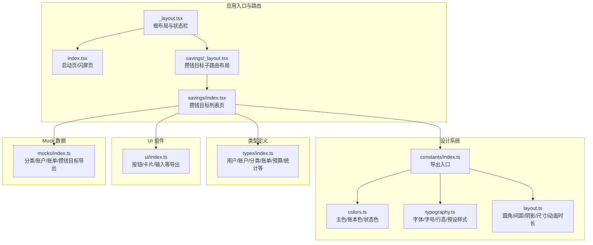
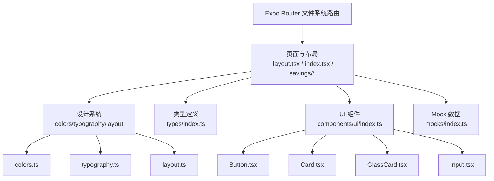
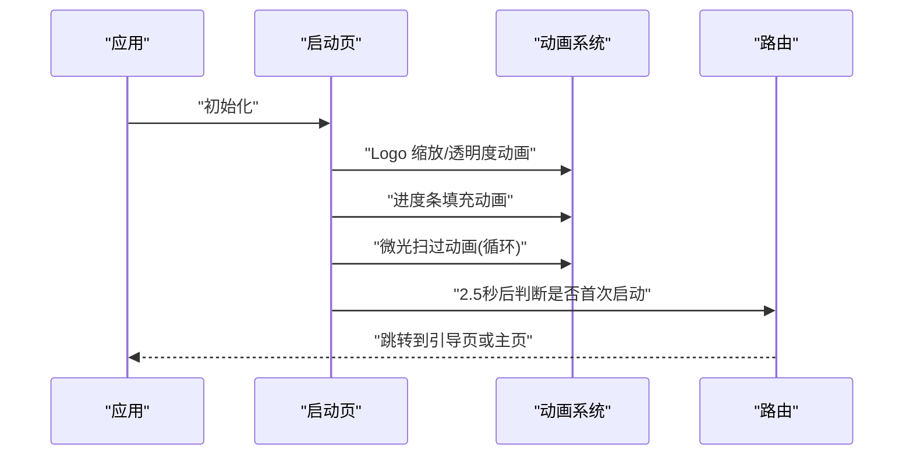
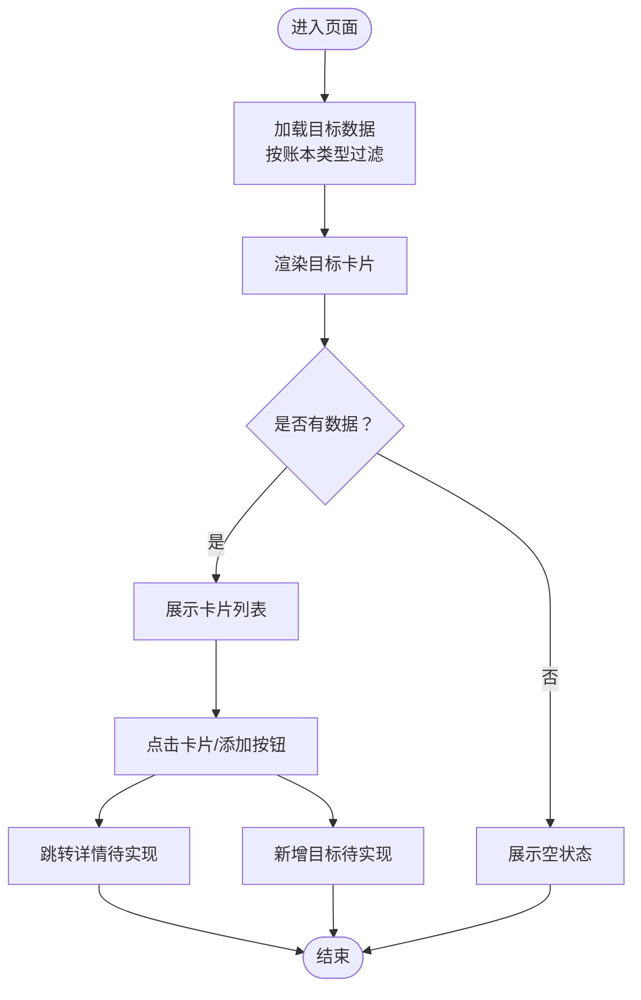
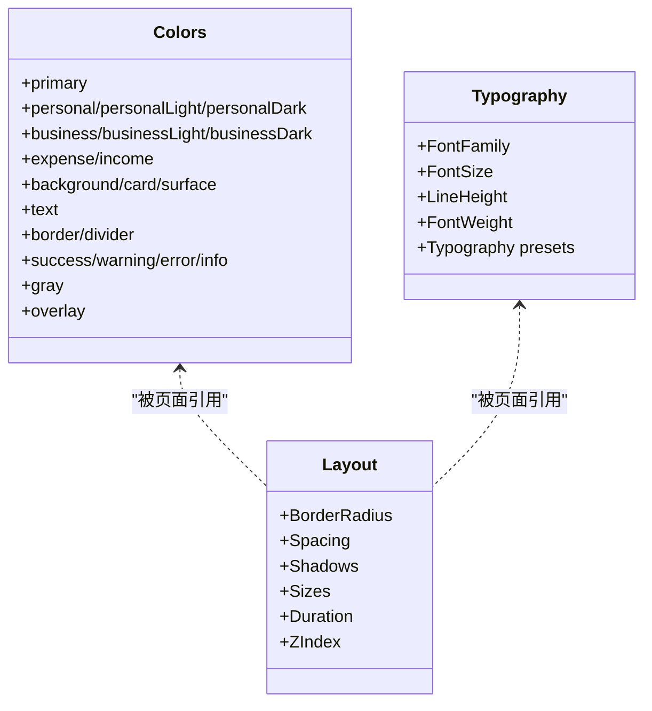
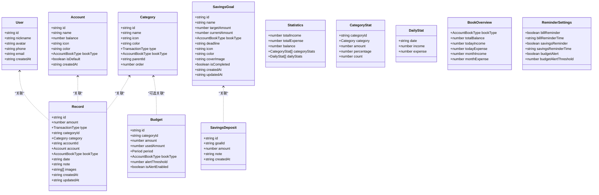
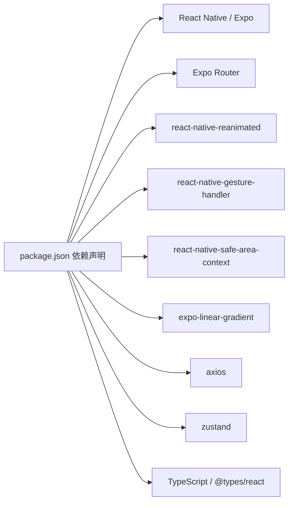

# 开发指南

<cite>
**本文引用的文件**
- [package.json](file://package.json)
- [tsconfig.json](file://tsconfig.json)
- [babel.config.js](file://babel.config.js)
- [app.json](file://app.json)
- [src/types/index.ts](file://src/types/index.ts)
- [src/constants/index.ts](file://src/constants/index.ts)
- [src/constants/colors.ts](file://src/constants/colors.ts)
- [src/constants/layout.ts](file://src/constants/layout.ts)
- [src/constants/typography.ts](file://src/constants/typography.ts)
- [src/mocks/index.ts](file://src/mocks/index.ts)
- [src/components/ui/index.ts](file://src/components/ui/index.ts)
- [src/app/_layout.tsx](file://src/app/_layout.tsx)
- [src/app/index.tsx](file://src/app/index.tsx)
- [src/app/savings/_layout.tsx](file://src/app/savings/_layout.tsx)
- [src/app/savings/index.tsx](file://src/app/savings/index.tsx)
</cite>

## 目录
1. [简介](#简介)
2. [项目结构](#项目结构)
3. [核心组件](#核心组件)
4. [架构概览](#架构概览)
5. [详细组件分析](#详细组件分析)
6. [依赖分析](#依赖分析)
7. [性能考虑](#性能考虑)
8. [故障排查指南](#故障排查指南)
9. [结论](#结论)
10. [附录](#附录)

## 简介
本开发指南面向“攒钱记账”项目团队，提供从工程配置、代码组织、组件开发规范到样式管理、Mock 数据与测试策略、代码审查标准、性能优化与安全注意事项的完整实践指引。文档以仓库现有结构为基础，结合 TypeScript、Expo Router、React Native 生态，帮助开发者快速上手并保持高质量交付。

## 项目结构
项目采用基于功能的目录组织方式，核心模块包括：
- 应用入口与路由：src/app 下的页面与布局
- 类型定义：src/types
- 设计系统：src/constants（颜色、排版、布局）
- UI 组件：src/components/ui
- Mock 数据：src/mocks
- 工程配置：package.json、tsconfig.json、babel.config.js、app.json

图表来源
- [src/app/_layout.tsx](file://src/app/_layout.tsx#L1-L55)
- [src/app/index.tsx](file://src/app/index.tsx#L1-L249)
- [src/app/savings/_layout.tsx](file://src/app/savings/_layout.tsx#L1-L20)
- [src/app/savings/index.tsx](file://src/app/savings/index.tsx#L1-L341)
- [src/constants/index.ts](file://src/constants/index.ts#L1-L12)
- [src/constants/colors.ts](file://src/constants/colors.ts#L1-L88)
- [src/constants/typography.ts](file://src/constants/typography.ts#L1-L149)
- [src/constants/layout.ts](file://src/constants/layout.ts#L1-L182)
- [src/types/index.ts](file://src/types/index.ts#L1-L141)
- [src/components/ui/index.ts](file://src/components/ui/index.ts#L1-L9)
- [src/mocks/index.ts](file://src/mocks/index.ts#L1-L9)

章节来源
- [src/app/_layout.tsx](file://src/app/_layout.tsx#L1-L55)
- [src/app/index.tsx](file://src/app/index.tsx#L1-L249)
- [src/app/savings/_layout.tsx](file://src/app/savings/_layout.tsx#L1-L20)
- [src/app/savings/index.tsx](file://src/app/savings/index.tsx#L1-L341)
- [src/constants/index.ts](file://src/constants/index.ts#L1-L12)
- [src/constants/colors.ts](file://src/constants/colors.ts#L1-L88)
- [src/constants/typography.ts](file://src/constants/typography.ts#L1-L149)
- [src/constants/layout.ts](file://src/constants/layout.ts#L1-L182)
- [src/types/index.ts](file://src/types/index.ts#L1-L141)
- [src/components/ui/index.ts](file://src/components/ui/index.ts#L1-L9)
- [src/mocks/index.ts](file://src/mocks/index.ts#L1-L9)

## 核心组件
- 根布局与启动页
  - 根布局负责全局状态栏、手势处理、启动屏控制与路由栈配置
  - 启动页实现渐变背景、Logo 动画、进度条与版本展示，并根据启动流程跳转至引导或主页
- 攒钱目标页面
  - 列表页包含账本筛选、目标卡片、环形进度条、空状态提示与添加按钮交互
  - 使用设计系统中的颜色、排版与布局常量统一视觉风格
- 设计系统
  - 颜色体系：主色、账本色、收支色、背景、文字、边框、状态色与灰度
  - 排版体系：字体族、字号、行高、字重与常用文本预设
  - 布局体系：圆角、间距、阴影、尺寸、动画时长与层级
- 类型定义
  - 覆盖用户、账户、分类、账单、预算、统计、账本总览与提醒设置等核心领域模型
- UI 组件
  - 按钮、卡片、玻璃卡片、输入框等基础组件导出入口
- Mock 数据
  - 分类、账户、账单、攒钱目标等数据导出，便于开发与演示

章节来源
- [src/app/_layout.tsx](file://src/app/_layout.tsx#L1-L55)
- [src/app/index.tsx](file://src/app/index.tsx#L1-L249)
- [src/app/savings/index.tsx](file://src/app/savings/index.tsx#L1-L341)
- [src/constants/colors.ts](file://src/constants/colors.ts#L1-L88)
- [src/constants/typography.ts](file://src/constants/typography.ts#L1-L149)
- [src/constants/layout.ts](file://src/constants/layout.ts#L1-L182)
- [src/types/index.ts](file://src/types/index.ts#L1-L141)
- [src/components/ui/index.ts](file://src/components/ui/index.ts#L1-L9)
- [src/mocks/index.ts](file://src/mocks/index.ts#L1-L9)

## 架构概览
应用采用 Expo Router 的文件系统路由，页面通过堆栈导航组织；设计系统集中于 constants；类型定义集中于 types；UI 组件集中于 components/ui；Mock 数据集中于 mocks。页面在渲染时按需引入设计常量与类型，确保一致的视觉与行为。

图表来源
- [src/app/_layout.tsx](file://src/app/_layout.tsx#L1-L55)
- [src/app/index.tsx](file://src/app/index.tsx#L1-L249)
- [src/app/savings/_layout.tsx](file://src/app/savings/_layout.tsx#L1-L20)
- [src/app/savings/index.tsx](file://src/app/savings/index.tsx#L1-L341)
- [src/constants/colors.ts](file://src/constants/colors.ts#L1-L88)
- [src/constants/typography.ts](file://src/constants/typography.ts#L1-L149)
- [src/constants/layout.ts](file://src/constants/layout.ts#L1-L182)
- [src/types/index.ts](file://src/types/index.ts#L1-L141)
- [src/components/ui/index.ts](file://src/components/ui/index.ts#L1-L9)
- [src/mocks/index.ts](file://src/mocks/index.ts#L1-L9)

## 详细组件分析

### 启动页（闪屏）组件分析
- 功能要点
  - 使用 Animated 实现 Logo 透明度与缩放动画、进度条填充动画与微光扫过动画
  - 渐变背景与布局常量组合营造品牌感
  - 2.5 秒后根据启动流程决定跳转至引导页或主页
- 性能与体验
  - 使用原生驱动与非原生驱动的合理搭配，平衡性能与效果
  - 启动屏防自动隐藏与字体加载完成后再显示，避免白屏

图表来源
- [src/app/index.tsx](file://src/app/index.tsx#L15-L64)

章节来源
- [src/app/index.tsx](file://src/app/index.tsx#L1-L249)

### 攒钱目标列表页组件分析
- 功能要点
  - 账本筛选：支持全部/个人/公司三类过滤
  - 目标卡片：包含账本标识色、图标/封面、名称/截止日期/金额、最近存入、环形进度条
  - 空状态：无目标时的提示与引导
- 视觉与交互
  - 使用设计系统常量统一圆角、间距、阴影、尺寸与颜色
  - 环形进度条通过 SVG/CSS 形状与旋转实现，百分比文本居中显示

图表来源
- [src/app/savings/index.tsx](file://src/app/savings/index.tsx#L121-L197)

章节来源
- [src/app/savings/index.tsx](file://src/app/savings/index.tsx#L1-L341)

### 设计系统（颜色/排版/布局）类图
- 颜色系统：主色、账本色、收支色、背景、文字、边框、状态色与灰度
- 排版系统：字体族、字号、行高、字重与常用文本预设
- 布局系统：圆角、间距、阴影、尺寸、动画时长与层级

图表来源
- [src/constants/colors.ts](file://src/constants/colors.ts#L6-L87)
- [src/constants/typography.ts](file://src/constants/typography.ts#L9-L146)
- [src/constants/layout.ts](file://src/constants/layout.ts#L9-L181)

章节来源
- [src/constants/colors.ts](file://src/constants/colors.ts#L1-L88)
- [src/constants/typography.ts](file://src/constants/typography.ts#L1-L149)
- [src/constants/layout.ts](file://src/constants/layout.ts#L1-L182)

### 类型定义（领域模型）类图
- 覆盖用户、账户、分类、账单、预算、统计、账本总览与提醒设置等
- 交易类型与账本类型枚举化，确保类型安全

图表来源
- [src/types/index.ts](file://src/types/index.ts#L12-L140)

章节来源
- [src/types/index.ts](file://src/types/index.ts#L1-L141)

## 依赖分析
- 运行时依赖
  - React、React Native、Expo Router、Reanimated、Gesture Handler、Safe Area、Linear Gradient、Axios、Zustand 等
- 开发依赖
  - TypeScript、@types/react
- 构建与运行
  - Metro、Babel 插件（含 reanimated 插件）、Expo Router 插件、Web 打包配置

图表来源
- [package.json](file://package.json#L11-L40)

章节来源
- [package.json](file://package.json#L1-L43)

## 性能考虑
- 动画与渲染
  - 启动页动画使用原生驱动与非原生驱动的合理搭配，减少主线程压力
  - 使用渐变背景与阴影时注意平台差异（iOS 阴影 vs Android elevation）
- 路由与页面
  - 路由栈配置关闭头部与启用滑动动画，减少不必要的重绘
- 数据与状态
  - 使用 Zustand 管理轻量状态，避免过度拆分 Store
- 网络请求
  - Axios 请求统一拦截与错误处理，避免阻塞 UI 线程
- 打包与体积
  - Web 输出静态资源，移动端按需加载字体与图片

章节来源
- [src/app/index.tsx](file://src/app/index.tsx#L21-L64)
- [src/app/_layout.tsx](file://src/app/_layout.tsx#L33-L45)
- [package.json](file://package.json#L11-L40)

## 故障排查指南
- 启动屏不消失
  - 确认字体加载完成后再隐藏启动屏，避免白屏
- 动画卡顿
  - 检查动画是否使用原生驱动；复杂动画建议拆分为多个简单动画
- 路由跳转异常
  - 确认路由文件命名与路径符合 Expo Router 约定；screenOptions 配置正确
- 颜色/排版不一致
  - 统一使用设计系统常量，避免硬编码颜色与尺寸
- Mock 数据未生效
  - 确认数据导出与调用位置一致，避免循环导入

章节来源
- [src/app/_layout.tsx](file://src/app/_layout.tsx#L14-L28)
- [src/app/index.tsx](file://src/app/index.tsx#L21-L64)
- [src/app/savings/index.tsx](file://src/app/savings/index.tsx#L121-L197)
- [src/constants/colors.ts](file://src/constants/colors.ts#L6-L87)
- [src/constants/typography.ts](file://src/constants/typography.ts#L62-L146)
- [src/mocks/index.ts](file://src/mocks/index.ts#L1-L9)

## 结论
本指南围绕“攒钱记账”项目的工程配置、代码组织与最佳实践提供了系统性指导。通过统一的设计系统、严格的类型约束、清晰的组件职责与合理的 Mock 数据策略，团队可在保证一致性的同时提升开发效率与可维护性。建议在后续迭代中逐步完善测试覆盖、接入自动化校验与持续集成流程。

## 附录

### TypeScript 配置与路径别名
- 继承 Expo 官方 tsconfig 基础配置
- 启用严格模式与 JSX 转换
- 配置路径别名 @/* 指向 src，便于模块导入

章节来源
- [tsconfig.json](file://tsconfig.json#L1-L14)

### Babel 与 Metro 插件
- Preset 使用 Expo 官方 preset
- Reanimated 插件启用原生动画能力
- Metro 缓存开启，提升构建速度

章节来源
- [babel.config.js](file://babel.config.js#L1-L8)

### Expo 配置与实验特性
- 应用元信息、平台标识、Web 打包输出
- 启用 typedRoutes 实验特性，增强路由类型安全

章节来源
- [app.json](file://app.json#L1-L29)

### 组件开发规范
- 组件命名与导出：统一在 ui/index.ts 导出，便于按需引入
- 样式复用：优先使用设计系统常量，避免硬编码
- 交互与可访问性：按钮与触摸区域尺寸符合可点触要求，文本对比度满足可读性

章节来源
- [src/components/ui/index.ts](file://src/components/ui/index.ts#L1-L9)
- [src/constants/layout.ts](file://src/constants/layout.ts#L113-L154)
- [src/constants/colors.ts](file://src/constants/colors.ts#L40-L56)

### 样式管理策略
- 颜色：主色、账本色、状态色与灰度分级，配合渐变配置
- 排版：多级字号与行高，常用文本预设统一文案风格
- 布局：圆角、间距、阴影、尺寸与层级，保证跨平台一致性

章节来源
- [src/constants/colors.ts](file://src/constants/colors.ts#L6-L87)
- [src/constants/typography.ts](file://src/constants/typography.ts#L9-L146)
- [src/constants/layout.ts](file://src/constants/layout.ts#L9-L181)

### Mock 数据系统使用方法
- 数据导出：在 mocks/index.ts 中统一导出分类、账户、账单、攒钱目标
- 页面使用：在页面中按需引入对应数据函数，进行筛选与展示
- 扩展建议：新增数据类型时同步更新导出入口与页面调用

章节来源
- [src/mocks/index.ts](file://src/mocks/index.ts#L1-L9)
- [src/app/savings/index.tsx](file://src/app/savings/index.tsx#L21-L126)

### 测试策略（建议）
- 单元测试：针对纯函数与业务逻辑（如格式化、计算）编写测试
- 组件测试：使用可访问性标签与快照测试验证 UI 结构与渲染结果
- Mock 驱动：使用现有 mocks 作为测试数据源，确保测试稳定性
- 端到端测试：对关键流程（登录/引导/目标列表）进行自动化回归

章节来源
- [src/mocks/index.ts](file://src/mocks/index.ts#L1-L9)

### 代码审查标准（建议）
- 类型安全：所有接口与函数参数使用强类型定义
- 样式一致性：禁止硬编码颜色与尺寸，必须使用设计系统常量
- 性能与可维护性：避免重复渲染，拆分大型组件，使用稳定依赖版本
- 可测试性：暴露必要函数与常量，便于单元测试与集成测试

章节来源
- [src/types/index.ts](file://src/types/index.ts#L1-L141)
- [src/constants/colors.ts](file://src/constants/colors.ts#L6-L87)
- [src/constants/typography.ts](file://src/constants/typography.ts#L62-L146)
- [src/constants/layout.ts](file://src/constants/layout.ts#L9-L181)

### 安全考虑（建议）
- 输入校验：对用户输入与网络请求数据进行严格校验
- 敏感信息：避免在前端存储敏感凭证，使用安全存储方案
- 网络请求：统一错误处理与重试机制，防止 UI 阻塞

章节来源
- [package.json](file://package.json#L13-L34)

### 开发工具与调试技巧
- 调试：使用 React DevTools 与 Flipper；在页面中保留必要的日志输出
- 性能：使用 React DevTools Profiler 与 Metro 缓存清理
- 路由：利用 typedRoutes 提升导航安全性与开发体验

章节来源
- [app.json](file://app.json#L21-L26)
- [babel.config.js](file://babel.config.js#L5-L5)