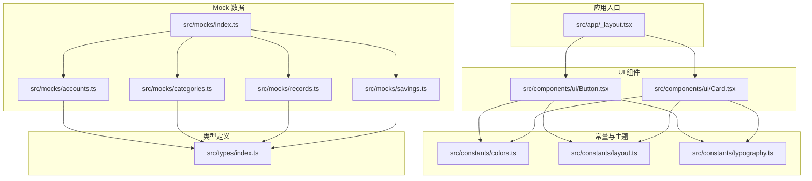
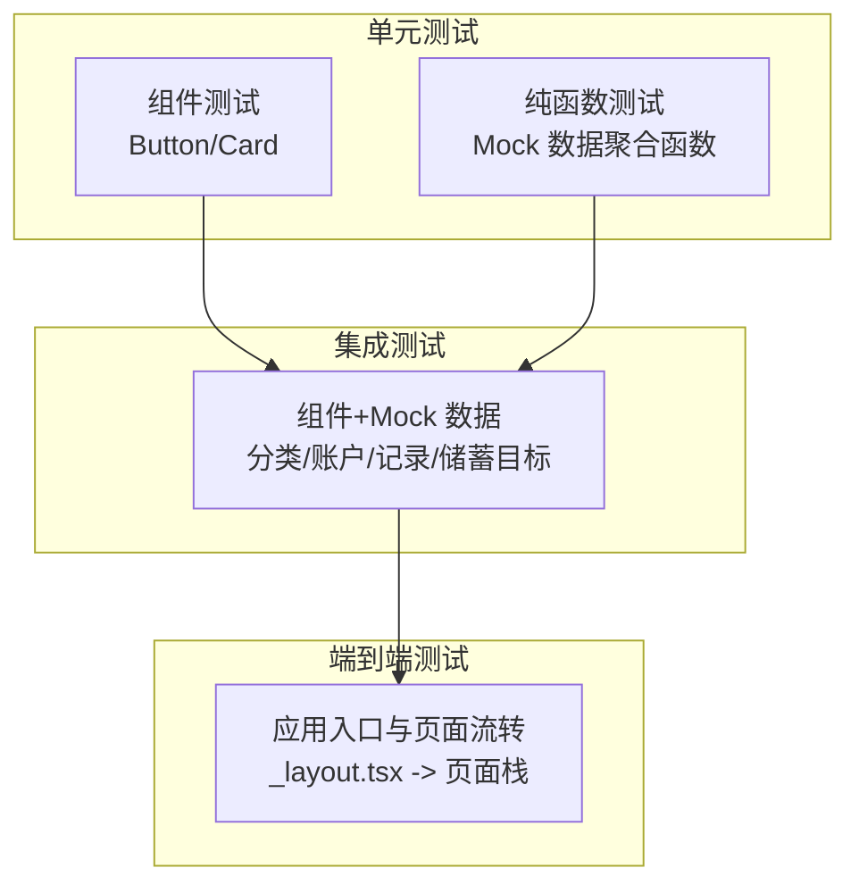
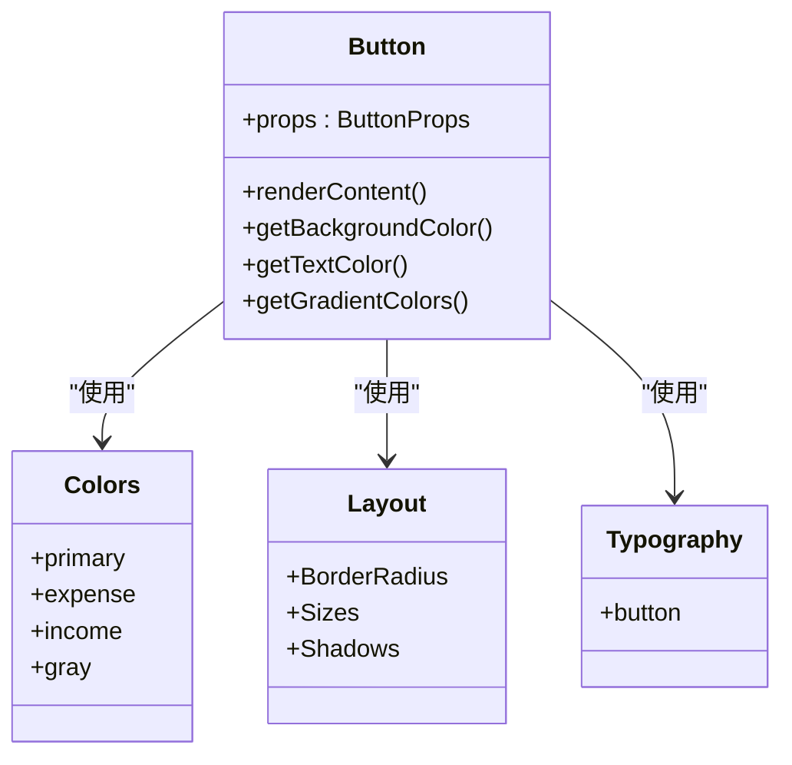
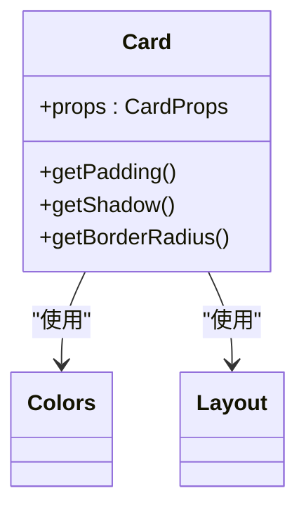
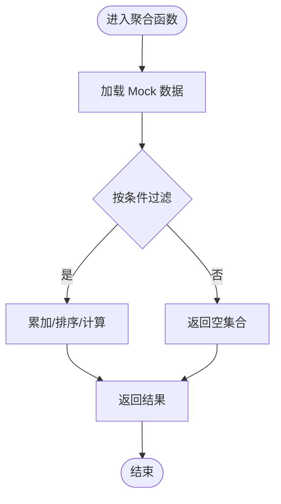
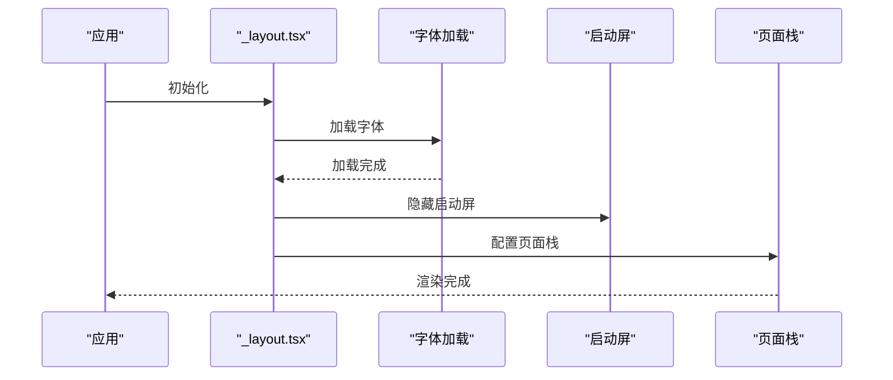
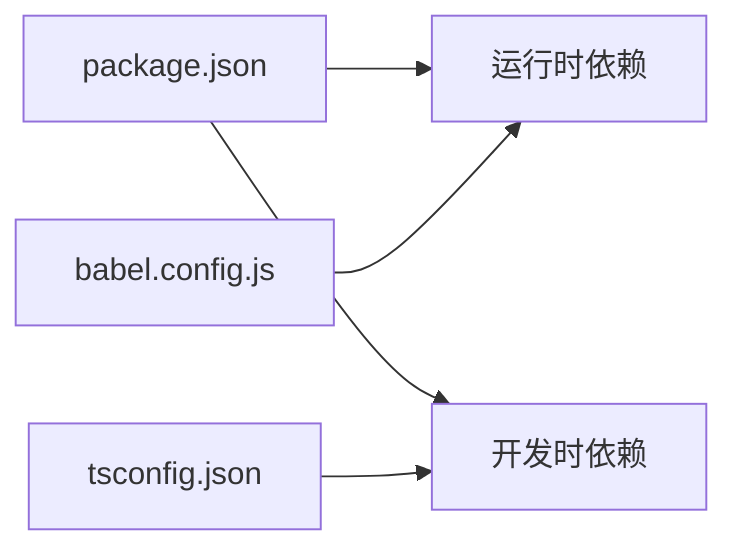

# 测试策略

<cite>
**本文引用的文件**
- [package.json](file://package.json)
- [tsconfig.json](file://tsconfig.json)
- [babel.config.js](file://babel.config.js)
- [src/app/_layout.tsx](file://src/app/_layout.tsx)
- [src/components/ui/Button.tsx](file://src/components/ui/Button.tsx)
- [src/components/ui/Card.tsx](file://src/components/ui/Card.tsx)
- [src/constants/colors.ts](file://src/constants/colors.ts)
- [src/constants/layout.ts](file://src/constants/layout.ts)
- [src/constants/typography.ts](file://src/constants/typography.ts)
- [src/types/index.ts](file://src/types/index.ts)
- [src/mocks/index.ts](file://src/mocks/index.ts)
- [src/mocks/accounts.ts](file://src/mocks/accounts.ts)
- [src/mocks/categories.ts](file://src/mocks/categories.ts)
- [src/mocks/records.ts](file://src/mocks/records.ts)
- [src/mocks/savings.ts](file://src/mocks/savings.ts)
</cite>

## 目录
1. [引言](#引言)
2. [项目结构](#项目结构)
3. [核心组件](#核心组件)
4. [架构总览](#架构总览)
5. [详细组件分析](#详细组件分析)
6. [依赖分析](#依赖分析)
7. [性能考虑](#性能考虑)
8. [故障排查指南](#故障排查指南)
9. [结论](#结论)
10. [附录](#附录)

## 引言
本测试策略面向“攒钱记账”项目，覆盖单元测试、集成测试与端到端测试的实施方法；明确 TypeScript 项目中的测试配置与工具选择；制定组件测试、状态管理测试与 API 测试的编写规范；说明 Mock 数据在测试中的使用与管理；给出测试覆盖率要求与质量门禁标准，并提供测试自动化与持续集成的配置建议。

## 项目结构
项目采用 Expo + React Native + TypeScript 架构，采用基于功能的目录组织方式，核心模块包括应用入口布局、UI 组件库、常量与类型定义、以及 Mock 数据。整体结构清晰，便于分层测试与隔离验证。

图表来源
- [src/app/_layout.tsx](file://src/app/_layout.tsx#L1-L55)
- [src/components/ui/Button.tsx](file://src/components/ui/Button.tsx#L1-L204)
- [src/components/ui/Card.tsx](file://src/components/ui/Card.tsx#L1-L94)
- [src/constants/colors.ts](file://src/constants/colors.ts#L1-L88)
- [src/constants/layout.ts](file://src/constants/layout.ts#L1-L182)
- [src/constants/typography.ts](file://src/constants/typography.ts#L1-L149)
- [src/types/index.ts](file://src/types/index.ts#L1-L141)
- [src/mocks/index.ts](file://src/mocks/index.ts#L1-L9)
- [src/mocks/accounts.ts](file://src/mocks/accounts.ts#L1-L91)
- [src/mocks/categories.ts](file://src/mocks/categories.ts#L1-L69)
- [src/mocks/records.ts](file://src/mocks/records.ts#L1-L117)
- [src/mocks/savings.ts](file://src/mocks/savings.ts#L1-L111)

章节来源
- [package.json](file://package.json#L1-L43)
- [tsconfig.json](file://tsconfig.json#L1-L14)
- [babel.config.js](file://babel.config.js#L1-L8)

## 核心组件
- 应用根布局负责路由栈与启动流程控制，是端到端测试的关键入口。
- UI 组件（Button、Card）承担交互与视觉呈现，适合进行组件测试与快照测试。
- 常量与主题（colors、layout、typography）为组件提供一致的风格与行为参数，测试中可作为稳定输入。
- 类型定义（types/index.ts）为 Mock 数据与业务逻辑提供契约保障，测试中可直接复用类型以确保一致性。
- Mock 数据（mocks/*）为测试提供稳定的离线数据集，支持单元测试与集成测试。

章节来源
- [src/app/_layout.tsx](file://src/app/_layout.tsx#L1-L55)
- [src/components/ui/Button.tsx](file://src/components/ui/Button.tsx#L1-L204)
- [src/components/ui/Card.tsx](file://src/components/ui/Card.tsx#L1-L94)
- [src/constants/colors.ts](file://src/constants/colors.ts#L1-L88)
- [src/constants/layout.ts](file://src/constants/layout.ts#L1-L182)
- [src/constants/typography.ts](file://src/constants/typography.ts#L1-L149)
- [src/types/index.ts](file://src/types/index.ts#L1-L141)
- [src/mocks/index.ts](file://src/mocks/index.ts#L1-L9)

## 架构总览
下图展示测试金字塔在本项目中的落地：底层为单元测试（组件与纯函数），中间为集成测试（组件+Mock数据），顶层为端到端测试（应用入口与页面流转）。

图表来源
- [src/components/ui/Button.tsx](file://src/components/ui/Button.tsx#L1-L204)
- [src/components/ui/Card.tsx](file://src/components/ui/Card.tsx#L1-L94)
- [src/mocks/accounts.ts](file://src/mocks/accounts.ts#L1-L91)
- [src/mocks/categories.ts](file://src/mocks/categories.ts#L1-L69)
- [src/mocks/records.ts](file://src/mocks/records.ts#L1-L117)
- [src/mocks/savings.ts](file://src/mocks/savings.ts#L1-L111)
- [src/app/_layout.tsx](file://src/app/_layout.tsx#L1-L55)

## 详细组件分析

### 组件测试：Button
- 测试要点
  - 不同变体与尺寸渲染正确性
  - 禁用态与加载态的行为
  - 图标位置与文本样式
  - 渐变背景与非渐变背景的分支
- 推荐断言
  - 样式属性（高度、圆角、阴影）
  - 文本颜色与渐变颜色映射
  - 点击事件回调触发次数
- Mock 使用
  - 使用常量（colors、layout、typography）作为稳定输入
  - 可通过 props 注入不同变体/尺寸/图标/加载态

图表来源
- [src/components/ui/Button.tsx](file://src/components/ui/Button.tsx#L1-L204)
- [src/constants/colors.ts](file://src/constants/colors.ts#L1-L88)
- [src/constants/layout.ts](file://src/constants/layout.ts#L1-L182)
- [src/constants/typography.ts](file://src/constants/typography.ts#L1-L149)

章节来源
- [src/components/ui/Button.tsx](file://src/components/ui/Button.tsx#L1-L204)
- [src/constants/colors.ts](file://src/constants/colors.ts#L1-L88)
- [src/constants/layout.ts](file://src/constants/layout.ts#L1-L182)
- [src/constants/typography.ts](file://src/constants/typography.ts#L1-L149)

### 组件测试：Card
- 测试要点
  - 内边距、圆角、阴影的动态计算
  - 子元素渲染与容器包裹
- 推荐断言
  - 容器样式属性与子节点数量
  - 不同 padding/shadow/borderRadius 的组合效果

图表来源
- [src/components/ui/Card.tsx](file://src/components/ui/Card.tsx#L1-L94)
- [src/constants/colors.ts](file://src/constants/colors.ts#L1-L88)
- [src/constants/layout.ts](file://src/constants/layout.ts#L1-L182)

章节来源
- [src/components/ui/Card.tsx](file://src/components/ui/Card.tsx#L1-L94)
- [src/constants/colors.ts](file://src/constants/colors.ts#L1-L88)
- [src/constants/layout.ts](file://src/constants/layout.ts#L1-L182)

### 状态管理测试：Zustand Store（建议）
- 适用场景
  - 当前仓库未发现 Zustand 相关实现，若后续引入，建议按以下方式测试：
    - 状态初始化与默认值
    - 动作（actions）对状态的更新
    - 异步动作的错误处理
    - Selector 的稳定性与性能
- 测试建议
  - 使用内存存储（in-memory store）避免副作用
  - 对异步动作使用定时器或微任务模拟
  - 断言状态变化与派发的动作数量

[本节为通用指导，不直接分析具体文件，故无章节来源]

### API 测试：Axios（建议）
- 适用场景
  - 当前仓库未发现网络请求封装，若后续引入，建议按以下方式测试：
    - 请求拦截器与响应拦截器
    - 错误码与异常处理
    - 超时与重试策略
- 测试建议
  - 使用拦截器替换或代理库（如 axios-mock-adaptor）模拟 HTTP 响应
  - 断言请求头、URL、查询参数与请求体
  - 覆盖 2xx/4xx/5xx 场景

[本节为通用指导，不直接分析具体文件，故无章节来源]

### Mock 数据测试：accounts/categories/records/savings
- 测试要点
  - 数据聚合函数（如按账本类型过滤、求和、排序）
  - 边界条件（空集合、单元素、重复 ID）
- 推荐断言
  - 返回数组长度与关键字段
  - 计算结果（如余额合计、目标进度）

图表来源
- [src/mocks/accounts.ts](file://src/mocks/accounts.ts#L1-L91)
- [src/mocks/categories.ts](file://src/mocks/categories.ts#L1-L69)
- [src/mocks/records.ts](file://src/mocks/records.ts#L1-L117)
- [src/mocks/savings.ts](file://src/mocks/savings.ts#L1-L111)

章节来源
- [src/mocks/accounts.ts](file://src/mocks/accounts.ts#L1-L91)
- [src/mocks/categories.ts](file://src/mocks/categories.ts#L1-L69)
- [src/mocks/records.ts](file://src/mocks/records.ts#L1-L117)
- [src/mocks/savings.ts](file://src/mocks/savings.ts#L1-L111)

### 端到端测试：应用入口与页面栈
- 测试要点
  - 启动流程（字体加载、闪屏控制）
  - 页面栈配置与路由跳转
  - 导航栏样式与动画
- 推荐断言
  - 页面可见性与样式属性
  - 导航栈项存在性与顺序

图表来源
- [src/app/_layout.tsx](file://src/app/_layout.tsx#L1-L55)

章节来源
- [src/app/_layout.tsx](file://src/app/_layout.tsx#L1-L55)

## 依赖分析
- 运行时依赖
  - React、React Native、Expo Router、Axios、Zustand 等
- 开发时依赖
  - TypeScript、@types/react
- 构建与运行
  - Babel 预设与插件、Metro 配置由 Expo 提供

图表来源
- [package.json](file://package.json#L1-L43)
- [babel.config.js](file://babel.config.js#L1-L8)
- [tsconfig.json](file://tsconfig.json#L1-L14)

章节来源
- [package.json](file://package.json#L1-L43)
- [babel.config.js](file://babel.config.js#L1-L8)
- [tsconfig.json](file://tsconfig.json#L1-L14)

## 性能考虑
- 单元测试优先：组件与纯函数测试成本低、反馈快，优先保证覆盖率。
- 集成测试聚焦关键路径：使用 Mock 数据减少外部依赖，提升执行速度。
- 端到端测试聚焦用户旅程：仅覆盖核心流程，避免冗余步骤。
- 并行化与缓存：利用测试框架的并行执行与缓存机制，缩短 CI 时间。

[本节为通用指导，不直接分析具体文件，故无章节来源]

## 故障排查指南
- 启动失败
  - 检查字体加载与闪屏控制逻辑是否正确执行
  - 确认页面栈配置与路由名称是否存在
- 组件渲染异常
  - 校验变体/尺寸/禁用态/加载态的样式映射
  - 确认渐变与非渐变分支的条件判断
- Mock 数据不一致
  - 校验类型定义与 Mock 数据字段匹配
  - 确认聚合函数的边界条件与排序逻辑

章节来源
- [src/app/_layout.tsx](file://src/app/_layout.tsx#L1-L55)
- [src/components/ui/Button.tsx](file://src/components/ui/Button.tsx#L1-L204)
- [src/mocks/accounts.ts](file://src/mocks/accounts.ts#L1-L91)
- [src/mocks/categories.ts](file://src/mocks/categories.ts#L1-L69)
- [src/mocks/records.ts](file://src/mocks/records.ts#L1-L117)
- [src/mocks/savings.ts](file://src/mocks/savings.ts#L1-L111)
- [src/types/index.ts](file://src/types/index.ts#L1-L141)

## 结论
本策略以测试金字塔为核心，结合项目实际结构，提出分层测试实施方案。通过复用 Mock 数据与类型定义，降低测试复杂度；通过组件与纯函数测试保证基础质量；通过端到端测试覆盖关键用户旅程。建议在后续迭代中补充状态管理与 API 测试，并完善 CI/CD 自动化流程。

[本节为总结性内容，不直接分析具体文件，故无章节来源]

## 附录

### 测试配置与工具选择（建议）
- 测试运行时
  - Jest（TypeScript 支持良好，与 Metro 兼容）
- 快照与可视化
  - React Native Testing Library（组件测试）
- Mock 与拦截
  - Axios Mock Adapter（API 测试）
- 覆盖率与报告
  - Istanbul（Jest 内置覆盖率）
- CI/CD
  - GitHub Actions（示例）：安装依赖、运行测试与覆盖率、缓存 node_modules

[本节为通用指导，不直接分析具体文件，故无章节来源]

### 编写规范
- 文件命名
  - 组件测试：Button.test.tsx
  - 纯函数测试：accounts.test.ts
  - 端到端测试：e2e.test.ts
- 断言风格
  - 使用 toHaveProperty、toHaveLength、toBeVisible 等语义化断言
- Mock 使用
  - 优先使用 src/mocks/* 与 src/types/index.ts
  - 避免在测试中硬编码业务细节
- 可维护性
  - 将公共测试工具抽离至 test-utils
  - 保持测试数据稳定与可预测

[本节为通用指导，不直接分析具体文件，故无章节来源]

### 测试覆盖率要求与质量门禁
- 覆盖率门槛（建议）
  - 行覆盖率：≥80%
  - 分支覆盖率：≥70%
  - 函数覆盖率：≥85%
  - 语句覆盖率：≥80%
- 质量门禁
  - PR 必须通过单元测试与覆盖率检查
  - 端到端测试通过关键用户旅程
  - 代码审查通过后方可合并

[本节为通用指导，不直接分析具体文件，故无章节来源]