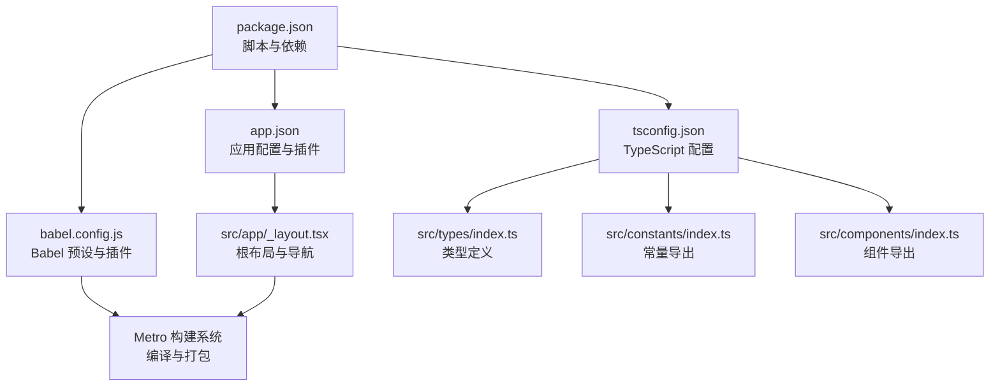
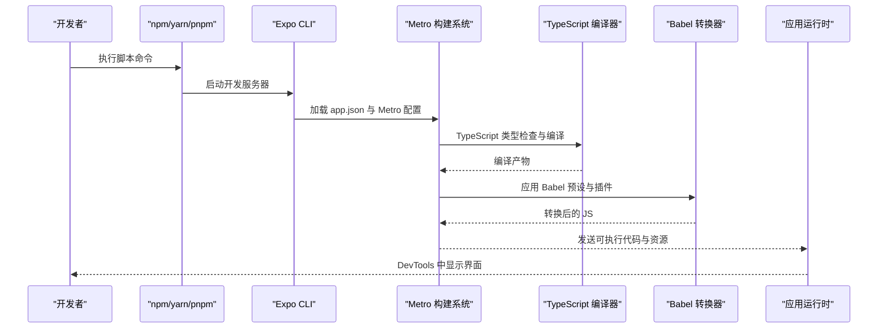
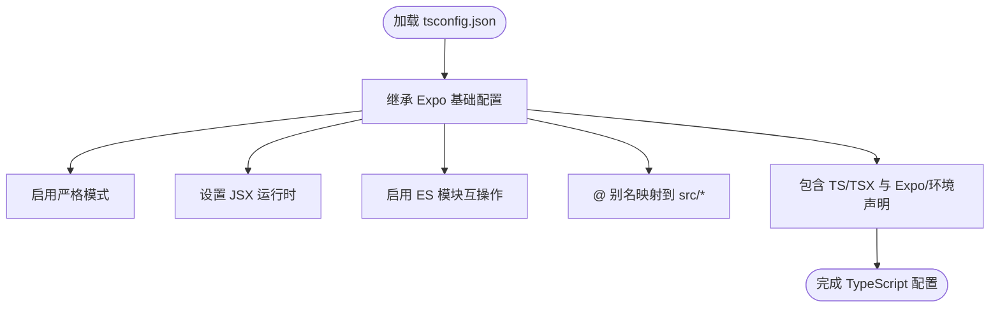
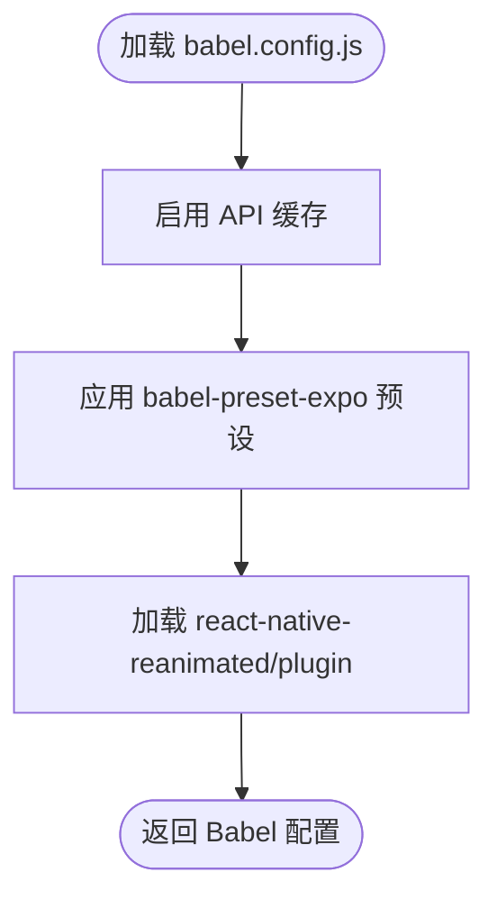
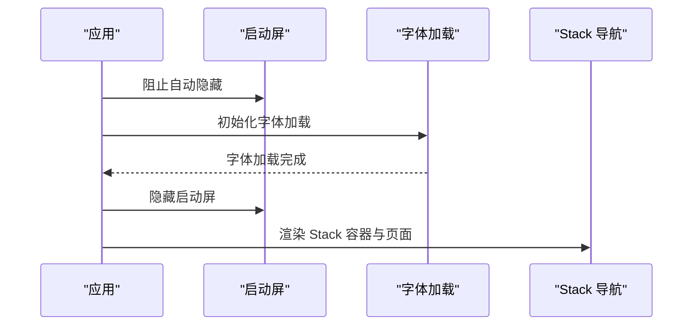
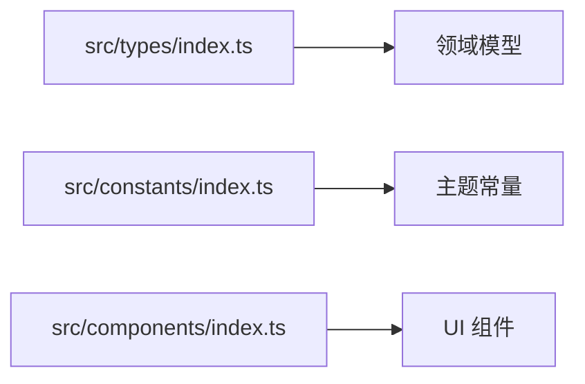
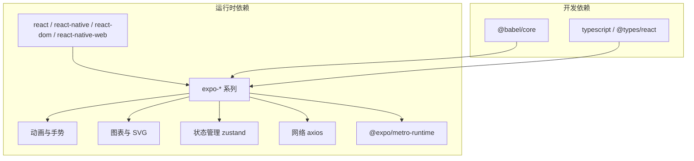

# 环境搭建

<cite>
**本文引用的文件**
- [package.json](file://package.json)
- [tsconfig.json](file://tsconfig.json)
- [babel.config.js](file://babel.config.js)
- [app.json](file://app.json)
- [expo-env.d.ts](file://expo-env.d.ts)
- [src/app/_layout.tsx](file://src/app/_layout.tsx)
- [src/constants/index.ts](file://src/constants/index.ts)
- [src/components/index.ts](file://src/components/index.ts)
- [src/types/index.ts](file://src/types/index.ts)
</cite>

## 目录
1. [简介](#简介)
2. [项目结构](#项目结构)
3. [核心组件](#核心组件)
4. [架构总览](#架构总览)
5. [详细组件分析](#详细组件分析)
6. [依赖分析](#依赖分析)
7. [性能考虑](#性能考虑)
8. [故障排除指南](#故障排除指南)
9. [结论](#结论)
10. [附录](#附录)

## 简介
本指南面向“攒钱记账”项目的开发者，帮助您完成从零到一的开发环境搭建与配置。内容覆盖以下方面：
- 开发工具链：Node.js、Expo CLI、Metro 构建系统
- 项目依赖安装与版本要求
- TypeScript 配置与路径别名、严格模式
- Babel 配置与编译流程
- IDE 推荐与调试环境设置
- 常见问题排查与解决方案

## 项目结构
该项目采用 Expo + React Navigation Router 的移动端跨平台方案，使用 TypeScript 进行强类型开发，并通过 Metro 进行打包构建。根目录关键配置文件如下：
- package.json：定义脚本命令、运行时与开发依赖
- tsconfig.json：TypeScript 编译选项与路径映射
- babel.config.js：Babel 预设与插件
- app.json：应用元数据、实验特性与插件声明
- expo-env.d.ts：Expo 类型声明补充
- src/app/_layout.tsx：根布局与导航容器
- src/constants、src/components、src/types：通用常量、UI 组件与类型定义

图表来源
- [package.json](file://package.json#L1-L43)
- [app.json](file://app.json#L1-L29)
- [tsconfig.json](file://tsconfig.json#L1-L14)
- [babel.config.js](file://babel.config.js#L1-L8)
- [src/app/_layout.tsx](file://src/app/_layout.tsx#L1-L55)
- [src/types/index.ts](file://src/types/index.ts#L1-L141)
- [src/constants/index.ts](file://src/constants/index.ts#L1-L12)
- [src/components/index.ts](file://src/components/index.ts#L1-L6)

章节来源
- [package.json](file://package.json#L1-L43)
- [tsconfig.json](file://tsconfig.json#L1-L14)
- [babel.config.js](file://babel.config.js#L1-L8)
- [app.json](file://app.json#L1-L29)
- [src/app/_layout.tsx](file://src/app/_layout.tsx#L1-L55)

## 核心组件
- 应用入口与脚本
  - 启动与多端调试：通过脚本命令启动 Expo DevTools 并在 Android/iOS/Web 上预览
  - 入口模块指向路由入口，确保运行时正确加载
- TypeScript 配置
  - 继承 Expo 官方基础配置，启用严格模式、JSX 编译、路径映射与类型检查范围
- Babel 配置
  - 使用 Expo 官方预设，配合 Reanimated 插件以支持手势与动画
- 应用元数据与实验特性
  - 声明应用名称、包标识、Web 打包器、路由插件与类型化路由实验
- 根布局与导航
  - 使用 Stack 导航容器与手势处理根视图，统一状态栏样式与背景色

章节来源
- [package.json](file://package.json#L5-L10)
- [package.json](file://package.json#L4-L4)
- [tsconfig.json](file://tsconfig.json#L2-L11)
- [babel.config.js](file://babel.config.js#L4-L6)
- [app.json](file://app.json#L2-L26)
- [src/app/_layout.tsx](file://src/app/_layout.tsx#L30-L47)

## 架构总览
下图展示从开发命令到最终运行的关键流程：开发者执行脚本 → Metro 读取配置 → Babel 转换 → TypeScript 检查 → Expo DevTools 渲染。

图表来源
- [package.json](file://package.json#L5-L10)
- [app.json](file://app.json#L21-L26)
- [babel.config.js](file://babel.config.js#L1-L8)
- [tsconfig.json](file://tsconfig.json#L12-L12)

## 详细组件分析

### TypeScript 配置分析
- 继承策略：基于 Expo 提供的基础 tsconfig，减少重复配置
- 严格模式：启用严格类型检查，提升代码质量
- JSX 与兼容性：指定 JSX 运行时与 ES 模块互操作
- 路径别名：通过 baseUrl 与 paths 将 @ 映射至 src，便于模块导入
- 类型检查范围：包含所有 TS/TSX 文件以及 Expo 与环境声明文件

图表来源
- [tsconfig.json](file://tsconfig.json#L2-L12)

章节来源
- [tsconfig.json](file://tsconfig.json#L1-L14)
- [expo-env.d.ts](file://expo-env.d.ts#L1-L2)

### Babel 配置分析
- 预设：使用 Expo 官方 babel-preset-expo，适配 React Native 与 Web
- 缓存：开启 API 缓存以提升二次构建速度
- 插件：集成 react-native-reanimated/plugin，确保动画与手势正常工作

图表来源
- [babel.config.js](file://babel.config.js#L1-L8)

章节来源
- [babel.config.js](file://babel.config.js#L1-L8)

### 应用元数据与实验特性
- 应用标识：名称、slug、版本、方向、主题、新架构开关
- 平台配置：iOS 包标识、Android 包名
- Web 输出：Metro 静态输出
- 插件：启用 expo-router
- 实验：开启 typedRoutes 类型化路由

图表来源
- [app.json](file://app.json#L2-L26)

章节来源
- [app.json](file://app.json#L1-L29)

### 根布局与导航容器
- 防止闪屏：初始化时阻止自动隐藏启动屏
- 字体加载：useFonts 控制字体资源加载时机
- 启动屏隐藏：字体加载完成后隐藏启动屏
- 手势容器：GestureHandlerRootView 包裹根视图
- 导航配置：Stack 导航容器，统一头部与背景色，设置转场动画

图表来源
- [src/app/_layout.tsx](file://src/app/_layout.tsx#L14-L24)
- [src/app/_layout.tsx](file://src/app/_layout.tsx#L30-L47)

章节来源
- [src/app/_layout.tsx](file://src/app/_layout.tsx#L1-L55)

### 类型系统与模块导出
- 类型定义：涵盖用户、账户、分类、账单、预算、统计、提醒等核心领域模型
- 常量导出：颜色、排版、布局等主题常量集中导出
- 组件导出：UI 组件与业务组件统一出口，便于按需引入

图表来源
- [src/types/index.ts](file://src/types/index.ts#L5-L141)
- [src/constants/index.ts](file://src/constants/index.ts#L5-L12)
- [src/components/index.ts](file://src/components/index.ts#L5-L6)

章节来源
- [src/types/index.ts](file://src/types/index.ts#L1-L141)
- [src/constants/index.ts](file://src/constants/index.ts#L1-L12)
- [src/components/index.ts](file://src/components/index.ts#L1-L6)

## 依赖分析
- 运行时依赖
  - React 生态：react、react-native、react-dom、react-native-web
  - Expo 生态：expo、expo-router、expo-constants、expo-font、expo-status-bar、expo-system-ui、expo-splash-screen、expo-blur、expo-linear-gradient、expo-linking
  - 动画与手势：react-native-gesture-handler、react-native-reanimated、react-native-safe-area-context、react-native-screens
  - 图表与 SVG：react-native-chart-kit、react-native-svg
  - 状态管理：zustand
  - 网络请求：axios
  - 运行时：@expo/metro-runtime
- 开发依赖
  - TypeScript 与类型：typescript、@types/react
  - Babel 核心：@babel/core
- 版本关系
  - React 与 React Native 需要匹配 Expo SDK 版本
  - expo-router 与 Expo SDK 版本需一致或兼容
  - Reanimated 与手势库需与 RN 版本兼容

图表来源
- [package.json](file://package.json#L11-L35)
- [package.json](file://package.json#L36-L40)

章节来源
- [package.json](file://package.json#L11-L40)

## 性能考虑
- 启动屏与字体加载：避免首屏闪烁，合理控制字体资源大小
- 路由与导航：使用类型化路由与懒加载页面，减少初始包体积
- 动画与手势：Reanimated 插件需正确配置，避免主线程阻塞
- 构建缓存：Babel 与 Metro 缓存可显著缩短二次构建时间
- 资源优化：SVG、图片与字体按需引入，避免冗余资源

## 故障排除指南
- 启动失败或无法连接
  - 检查设备/模拟器连接状态与端口占用
  - 清理 Metro 缓存并重启：删除 node_modules/.cache 或使用相应命令
- 字体不生效或白屏
  - 确认字体资源路径与 useFonts 配置一致
  - 确保启动屏隐藏逻辑在字体加载完成后触发
- Reanimated 报错
  - 确认已正确加载 react-native-reanimated/plugin
  - 检查 React Native 版本与 Reanimated 版本兼容性
- TypeScript 报错
  - 检查 tsconfig.json 的路径映射与包含范围
  - 确保类型声明文件存在且未被忽略
- Web 打包异常
  - 检查 app.json 中 web.bundler 与 output 设置
  - 确保 react-native-web 与 react-dom 版本匹配

章节来源
- [babel.config.js](file://babel.config.js#L5-L5)
- [src/app/_layout.tsx](file://src/app/_layout.tsx#L14-L24)
- [tsconfig.json](file://tsconfig.json#L7-L12)
- [app.json](file://app.json#L17-L20)

## 结论
本指南提供了“攒钱记账”项目从工具链到配置的完整环境搭建路径。遵循本文档的步骤，您可以快速完成本地开发环境准备，并在后续迭代中保持配置一致性与可维护性。

## 附录
- IDE 推荐与配置建议
  - VSCode：安装 React Native Tools、ESLint、Prettier、TypeScript TSServer 插件
  - ESLint：结合 TypeScript 与 React Native 规则，统一代码风格
  - Prettier：统一缩进、引号与分号等格式
  - 调试：使用 Chrome DevTools 或 Flipper；在 Web 端使用浏览器开发者工具
- 调试环境设置
  - 在 app.json 中启用实验特性与路由插件
  - 在 tsconfig.json 中启用严格模式与路径别名
  - 在 babel.config.js 中确保 Reanimated 插件已加载