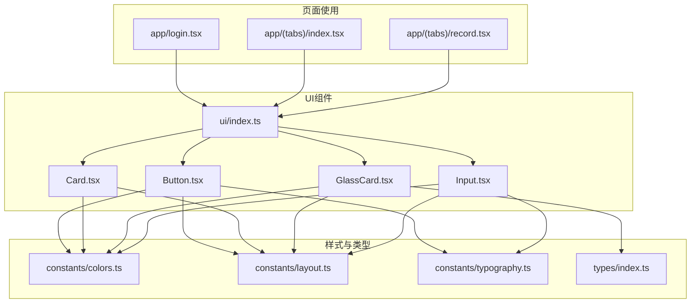
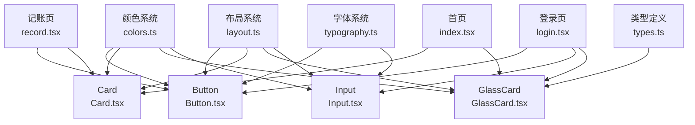
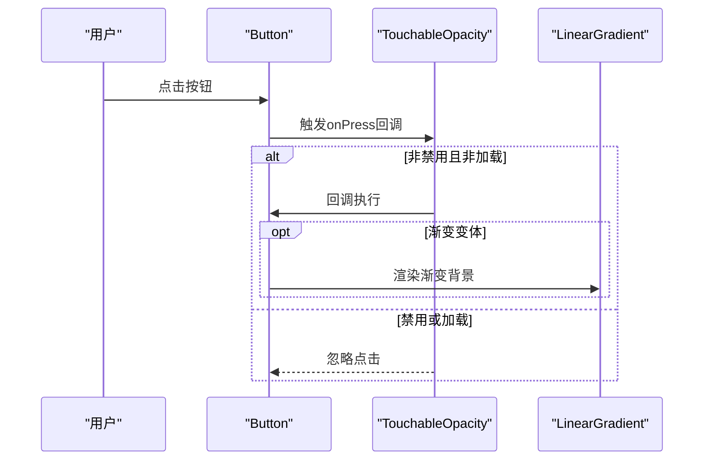
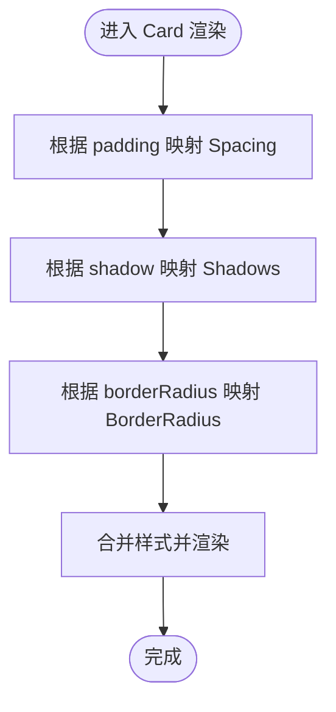
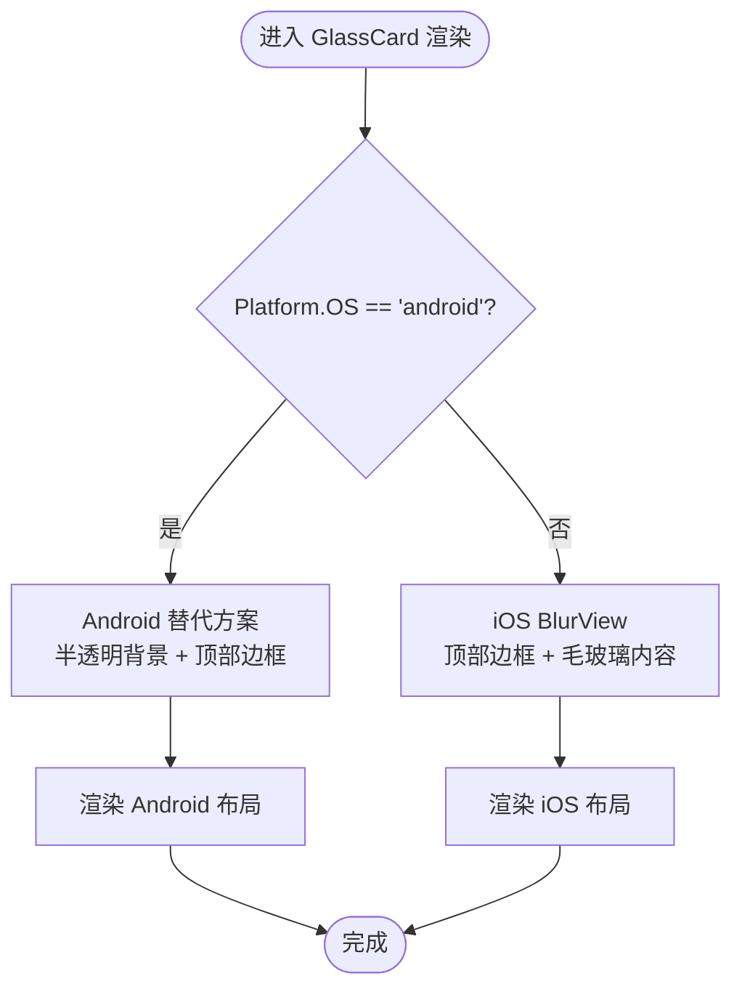
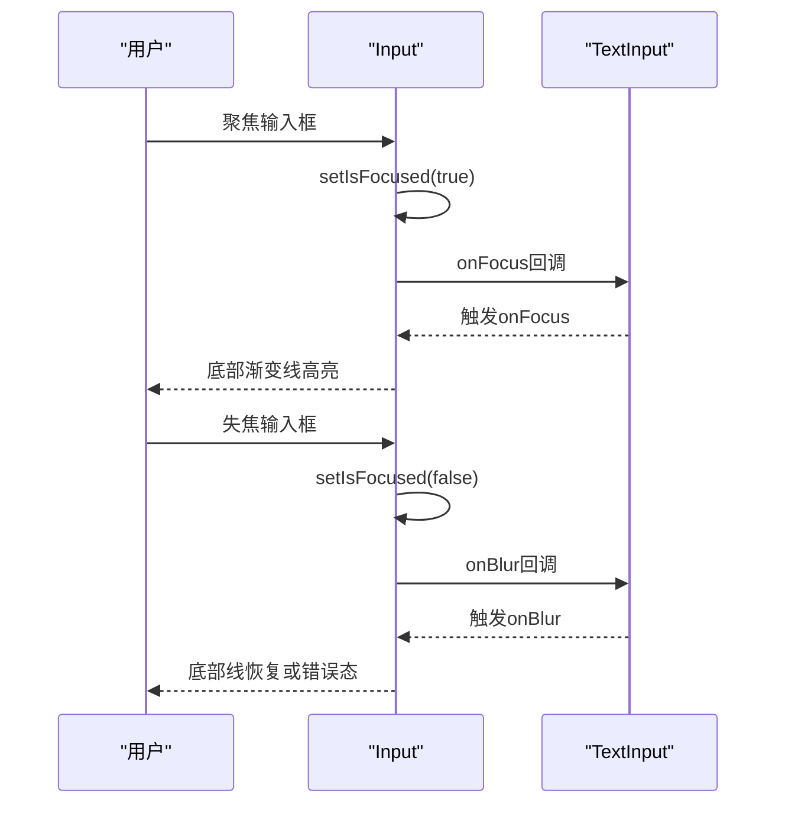
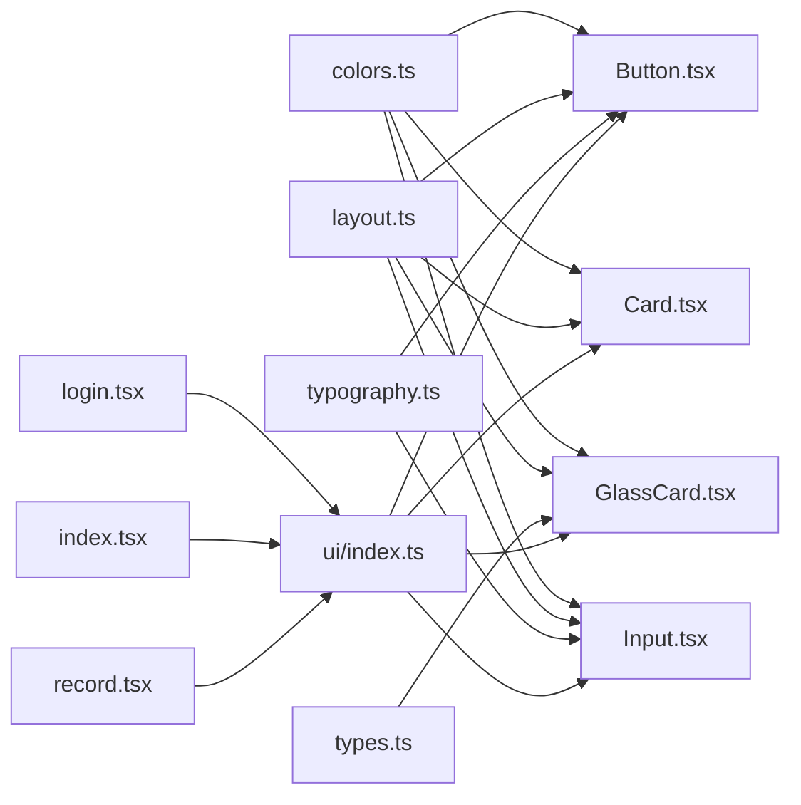

# UI组件开发

<cite>
**本文档引用的文件**
- [src/components/ui/Button.tsx](file://src/components/ui/Button.tsx)
- [src/components/ui/Card.tsx](file://src/components/ui/Card.tsx)
- [src/components/ui/GlassCard.tsx](file://src/components/ui/GlassCard.tsx)
- [src/components/ui/Input.tsx](file://src/components/ui/Input.tsx)
- [src/components/ui/index.ts](file://src/components/ui/index.ts)
- [src/constants/colors.ts](file://src/constants/colors.ts)
- [src/constants/layout.ts](file://src/constants/layout.ts)
- [src/constants/typography.ts](file://src/constants/typography.ts)
- [src/types/index.ts](file://src/types/index.ts)
- [src/app/login.tsx](file://src/app/login.tsx)
- [src/app/(tabs)/index.tsx](file://src/app/(tabs)/index.tsx)
- [src/app/(tabs)/record.tsx](file://src/app/(tabs)/record.tsx)
</cite>

## 目录
1. [简介](#简介)
2. [项目结构](#项目结构)
3. [核心组件](#核心组件)
4. [架构总览](#架构总览)
5. [详细组件分析](#详细组件分析)
6. [依赖关系分析](#依赖关系分析)
7. [性能考虑](#性能考虑)
8. [故障排除指南](#故障排除指南)
9. [结论](#结论)
10. [附录](#附录)

## 简介
本指南面向UI组件开发者，系统性解析Button、Card、GlassCard、Input四个核心组件的设计理念、实现原理与开发规范。文档从Props接口设计、默认值与类型定义出发，深入到样式系统、主题适配与响应式布局；进一步阐述事件处理机制、状态管理与用户交互模式，并提供组件扩展与自定义样式的最佳实践，以及组件间组合与复用策略。文中所有技术细节均基于仓库现有源码进行分析与总结。

## 项目结构
UI组件位于src/components/ui目录下，采用按功能模块化的组织方式，每个组件独立封装，通过统一的导出入口集中暴露。样式系统由colors、layout、typography三个常量模块提供一致的设计令牌，确保跨组件风格统一与可维护性。

**图表来源**
- [src/components/ui/index.ts](file://src/components/ui/index.ts#L1-L9)
- [src/components/ui/Button.tsx](file://src/components/ui/Button.tsx#L1-L204)
- [src/components/ui/Card.tsx](file://src/components/ui/Card.tsx#L1-L94)
- [src/components/ui/GlassCard.tsx](file://src/components/ui/GlassCard.tsx#L1-L126)
- [src/components/ui/Input.tsx](file://src/components/ui/Input.tsx#L1-L194)
- [src/constants/colors.ts](file://src/constants/colors.ts#L1-L88)
- [src/constants/layout.ts](file://src/constants/layout.ts#L1-L182)
- [src/constants/typography.ts](file://src/constants/typography.ts#L1-L149)
- [src/types/index.ts](file://src/types/index.ts#L1-L141)
- [src/app/login.tsx](file://src/app/login.tsx#L1-L293)
- [src/app/(tabs)/index.tsx](file://src/app/(tabs)/index.tsx#L1-L564)
- [src/app/(tabs)/record.tsx](file://src/app/(tabs)/record.tsx#L1-L533)

**章节来源**
- [src/components/ui/index.ts](file://src/components/ui/index.ts#L1-L9)

## 核心组件
本节概述四个核心UI组件的功能定位、典型使用场景与在项目中的集成方式。

- Button：渐变按钮组件，支持多种变体与尺寸，内置加载态与禁用态，适用于登录、确认、操作触发等场景。
- Card：基础卡片容器，支持内边距、阴影与圆角配置，适用于列表项、统计块、内容区块等展示。
- GlassCard：毛玻璃卡片，支持平台差异处理（Android使用半透明背景替代BlurView），提供顶部边框与多种账本类型标识。
- Input：带标签、错误提示与底部渐变指示线的输入框，支持左右图标、多行文本、安全输入等，适用于登录、记账等表单场景。

**章节来源**
- [src/components/ui/Button.tsx](file://src/components/ui/Button.tsx#L1-L204)
- [src/components/ui/Card.tsx](file://src/components/ui/Card.tsx#L1-L94)
- [src/components/ui/GlassCard.tsx](file://src/components/ui/GlassCard.tsx#L1-L126)
- [src/components/ui/Input.tsx](file://src/components/ui/Input.tsx#L1-L194)

## 架构总览
组件架构遵循“组件内部封装 + 样式令牌驱动 + 页面组合使用”的模式。组件通过导入colors、layout、typography等常量模块获取统一的设计令牌，避免硬编码样式；页面通过统一导出入口引入组件，减少路径依赖复杂度。

**图表来源**
- [src/constants/colors.ts](file://src/constants/colors.ts#L1-L88)
- [src/constants/layout.ts](file://src/constants/layout.ts#L1-L182)
- [src/constants/typography.ts](file://src/constants/typography.ts#L1-L149)
- [src/types/index.ts](file://src/types/index.ts#L1-L141)
- [src/components/ui/Button.tsx](file://src/components/ui/Button.tsx#L1-L204)
- [src/components/ui/Card.tsx](file://src/components/ui/Card.tsx#L1-L94)
- [src/components/ui/GlassCard.tsx](file://src/components/ui/GlassCard.tsx#L1-L126)
- [src/components/ui/Input.tsx](file://src/components/ui/Input.tsx#L1-L194)
- [src/app/login.tsx](file://src/app/login.tsx#L1-L293)
- [src/app/(tabs)/index.tsx](file://src/app/(tabs)/index.tsx#L1-L564)
- [src/app/(tabs)/record.tsx](file://src/app/(tabs)/record.tsx#L1-L533)

## 详细组件分析

### Button 组件
- 设计要点
  - 变体与尺寸：通过variant与size控制外观与高度，支持primary、secondary、outline、ghost、expense、income六种变体与sm、md、lg、xl四种尺寸。
  - 状态管理：disabled与loading双状态控制，禁用态优先于加载态；加载态以ActivityIndicator替代图标与文字。
  - 渐变与边框：仅primary变体使用LinearGradient背景；outline变体渲染边框；ghost与透明背景配合文本色。
  - 内容布局：支持icon与文字左右排列，根据位置动态调整文本内边距。
- Props接口与默认值
  - title: string（必填）
  - onPress: () => void（必填）
  - variant?: 'primary' | 'secondary' | 'outline' | 'ghost' | 'expense' | 'income'（默认：'primary'）
  - size?: 'sm' | 'md' | 'lg' | 'xl'（默认：'lg'）
  - disabled?: boolean（默认：false）
  - loading?: boolean（默认：false）
  - icon?: React.ReactNode
  - iconPosition?: 'left' | 'right'（默认：'left'）
  - fullWidth?: boolean（默认：false）
  - style?: ViewStyle
  - textStyle?: TextStyle
- 样式系统与主题适配
  - 背景色：根据变体与禁用态映射至colors体系；expense/income变体使用对应主题色。
  - 文本色：根据变体与禁用态映射至text inverse或tertiary。
  - 边框：outline变体按主色绘制边框；ghost透明。
  - 渐变：primary与expense/income使用Gradients配置生成渐变色。
  - 阴影：统一使用Shadows.sm。
- 事件处理与交互
  - TouchableOpacity封装点击区域，activeOpacity区分gradient与非gradient场景。
  - loading/disabled状态通过disabled属性透传至TouchableOpacity，统一禁用行为。
- 扩展与自定义
  - 通过style与textStyle覆盖局部样式；icon与iconPosition灵活组合。
  - 新增变体建议在getBackgroundColor/getTextColor/getGradientColors中扩展映射。
- 使用示例
  - 登录页使用fullWidth与primary变体作为提交按钮。
  - 首页快速记账按钮使用expense/income变体表达收支方向。

**图表来源**
- [src/components/ui/Button.tsx](file://src/components/ui/Button.tsx#L36-L189)
- [src/constants/colors.ts](file://src/constants/colors.ts#L1-L88)
- [src/constants/layout.ts](file://src/constants/layout.ts#L1-L182)
- [src/constants/typography.ts](file://src/constants/typography.ts#L1-L149)

**章节来源**
- [src/components/ui/Button.tsx](file://src/components/ui/Button.tsx#L22-L48)
- [src/components/ui/Button.tsx](file://src/components/ui/Button.tsx#L53-L110)
- [src/components/ui/Button.tsx](file://src/components/ui/Button.tsx#L159-L189)
- [src/app/login.tsx](file://src/app/login.tsx#L127-L131)
- [src/app/(tabs)/index.tsx](file://src/app/(tabs)/index.tsx#L147-L166)

### Card 组件
- 设计要点
  - 容器化展示：统一card背景色，支持padding、shadow、borderRadius三类可配置项。
  - 尺寸映射：padding映射为Spacing，shadow映射为Shadows，borderRadius映射为BorderRadius。
- Props接口与默认值
  - children: React.ReactNode（必填）
  - style?: ViewStyle
  - padding?: 'none' | 'sm' | 'md' | 'lg'（默认：'md'）
  - shadow?: 'none' | 'sm' | 'md' | 'lg'（默认：'md'）
  - borderRadius?: 'sm' | 'md' | 'lg' | 'xl'（默认：'xl'）
- 样式系统与主题适配
  - 背景色：Colors.card。
  - 阴影：Shadows.none/sm/md/lg按需启用。
  - 圆角：BorderRadius.sm/md/lg/2xl/full。
- 扩展与自定义
  - 通过style注入额外布局与定位；适合在Card内部嵌套更多子组件。
- 使用示例
  - 首页最近记录列表使用Card包裹列表项，展示交易明细。

**图表来源**
- [src/components/ui/Card.tsx](file://src/components/ui/Card.tsx#L18-L84)
- [src/constants/colors.ts](file://src/constants/colors.ts#L1-L88)
- [src/constants/layout.ts](file://src/constants/layout.ts#L1-L182)

**章节来源**
- [src/components/ui/Card.tsx](file://src/components/ui/Card.tsx#L10-L24)
- [src/components/ui/Card.tsx](file://src/components/ui/Card.tsx#L25-L68)
- [src/app/(tabs)/index.tsx](file://src/app/(tabs)/index.tsx#L223-L254)

### GlassCard 组件
- 设计要点
  - 毛玻璃效果：iOS使用BlurView实现，Android使用半透明背景替代；支持intensity参数调节。
  - 顶部边框：可选显示，根据bookType或both显示单色或渐变色顶部边框。
  - 平台差异：通过Platform.OS判断，分别渲染BlurView或Android替代方案。
- Props接口与默认值
  - children: React.ReactNode（必填）
  - style?: ViewStyle
  - intensity?: number（默认：50）
  - padding?: 'none' | 'sm' | 'md' | 'lg'（默认：'md'）
  - showTopBorder?: boolean（默认：false）
  - bookType?: AccountBookType | 'both'
- 样式系统与主题适配
  - 背景：iOS使用Colors.cardGlass；Android使用rgba(255,255,255,0.95)。
  - 顶部边框：Colors.personal/business或Gradients.primary。
  - 圆角：BorderRadius['2xl']。
- 类型依赖
  - bookType来自AccountBookType联合类型，支持'personal'、'business'与'both'。
- 扩展与自定义
  - 可通过style覆盖容器与内容区样式；intensity在iOS上影响模糊强度。
- 使用示例
  - 登录页表单卡片使用GlassCard包裹输入与按钮，增强视觉层次。

**图表来源**
- [src/components/ui/GlassCard.tsx](file://src/components/ui/GlassCard.tsx#L22-L107)
- [src/types/index.ts](file://src/types/index.ts#L5-L6)
- [src/constants/colors.ts](file://src/constants/colors.ts#L1-L88)
- [src/constants/layout.ts](file://src/constants/layout.ts#L1-L182)

**章节来源**
- [src/components/ui/GlassCard.tsx](file://src/components/ui/GlassCard.tsx#L13-L29)
- [src/components/ui/GlassCard.tsx](file://src/components/ui/GlassCard.tsx#L45-L58)
- [src/app/login.tsx](file://src/app/login.tsx#L95-L132)

### Input 组件
- 设计要点
  - 结构化布局：label、输入框、底部渐变线、错误文案四部分构成。
  - 焦点状态：内部维护isFocused，聚焦时底部渐变线高亮，失焦恢复普通线或错误态。
  - 图标与多行：支持leftIcon/rightIcon，multiline与numberOfLines控制多行输入。
  - 错误态：error存在时底部线与错误文案高亮。
- Props接口与默认值
  - value: string（必填）
  - onChangeText: (text: string) => void（必填）
  - placeholder?: string
  - label?: string
  - error?: string
  - leftIcon?: React.ReactNode
  - rightIcon?: React.ReactNode
  - secureTextEntry?: boolean（默认：false）
  - keyboardType?: 'default' | 'email-address' | 'numeric' | 'phone-pad'（默认：'default'）
  - autoCapitalize?: 'none' | 'sentences' | 'words' | 'characters'（默认：'none'）
  - multiline?: boolean（默认：false）
  - numberOfLines?: number（默认：1）
  - maxLength?: number
  - editable?: boolean（默认：true）
  - style?: ViewStyle
  - inputStyle?: TextStyle
  - onFocus?: () => void
  - onBlur?: () => void
- 样式系统与主题适配
  - 文本：Colors.text.primary；占位符：Colors.text.tertiary。
  - 底部线：普通线Colors.gray[300]，聚焦线使用Gradients.primary，错误线Colors.error。
  - 字体：Typography.body；字号FontSize.md。
  - 内边距：根据leftIcon/rightIcon动态调整。
- 事件处理与状态管理
  - 内部状态：useState(isFocused)。
  - 外部回调：onFocus/onBlur透传至TextInput。
  - 编辑态：editable=false时整体opacity降为0.6。
- 扩展与自定义
  - 通过inputStyle覆盖输入框样式；通过style覆盖容器样式。
  - 可结合错误态与图标实现更丰富的表单反馈。
- 使用示例
  - 登录页手机号与密码输入框均使用Input组件，左侧图标与安全输入。

**图表来源**
- [src/components/ui/Input.tsx](file://src/components/ui/Input.tsx#L41-L71)
- [src/components/ui/Input.tsx](file://src/components/ui/Input.tsx#L87-L112)
- [src/constants/colors.ts](file://src/constants/colors.ts#L1-L88)
- [src/constants/layout.ts](file://src/constants/layout.ts#L1-L182)
- [src/constants/typography.ts](file://src/constants/typography.ts#L1-L149)

**章节来源**
- [src/components/ui/Input.tsx](file://src/components/ui/Input.tsx#L20-L60)
- [src/components/ui/Input.tsx](file://src/components/ui/Input.tsx#L61-L71)
- [src/components/ui/Input.tsx](file://src/components/ui/Input.tsx#L115-L135)
- [src/app/login.tsx](file://src/app/login.tsx#L96-L112)

## 依赖关系分析
- 组件对样式系统的依赖
  - Button、Input依赖colors、layout、typography；Card依赖colors、layout；GlassCard依赖colors、layout、types。
- 页面对组件的依赖
  - 登录页：Button、Input、GlassCard
  - 首页：Card、GlassCard
  - 记账页：Button、Card
- 导出与导入
  - ui/index.ts集中导出各组件，页面通过统一入口引入，降低路径耦合。

**图表来源**
- [src/components/ui/index.ts](file://src/components/ui/index.ts#L5-L8)
- [src/app/login.tsx](file://src/app/login.tsx#L21-L21)
- [src/app/(tabs)/index.tsx](file://src/app/(tabs)/index.tsx#L20-L20)
- [src/app/(tabs)/record.tsx](file://src/app/(tabs)/record.tsx#L23-L23)

**章节来源**
- [src/components/ui/index.ts](file://src/components/ui/index.ts#L1-L9)
- [src/app/login.tsx](file://src/app/login.tsx#L21-L21)
- [src/app/(tabs)/index.tsx](file://src/app/(tabs)/index.tsx#L20-L20)
- [src/app/(tabs)/record.tsx](file://src/app/(tabs)/record.tsx#L23-L23)

## 性能考虑
- 渲染优化
  - Button与Input内部通过条件渲染与样式合并减少不必要的节点与样式计算。
  - GlassCard在Android端使用半透明背景替代BlurView，避免平台特定组件的额外开销。
- 交互体验
  - Button的activeOpacity区分gradient与非gradient场景，提升触控反馈一致性。
  - Input聚焦状态通过本地状态管理，避免全局状态抖动。
- 样式复用
  - 通过统一的colors、layout、typography模块，减少重复定义与样式冲突。

## 故障排除指南
- 按钮点击无效
  - 检查disabled与loading状态，两者都会导致TouchableOpacity忽略点击。
  - 确认onPress回调正确传递至Button。
- 输入框焦点异常
  - 确认onFocus/onBlur回调正确透传至TextInput。
  - 检查editable=false时整体opacity变化。
- 毛玻璃效果不生效（Android）
  - 确认Platform.OS为android，组件会自动使用半透明背景替代BlurView。
- 样式错乱
  - 检查style与textStyle是否覆盖了关键样式（如高度、圆角、阴影）。
  - 确认colors、layout、typography模块版本未被意外修改。

**章节来源**
- [src/components/ui/Button.tsx](file://src/components/ui/Button.tsx#L50-L51)
- [src/components/ui/Button.tsx](file://src/components/ui/Button.tsx#L180-L184)
- [src/components/ui/Input.tsx](file://src/components/ui/Input.tsx#L63-L71)
- [src/components/ui/GlassCard.tsx](file://src/components/ui/GlassCard.tsx#L72-L88)

## 结论
本指南系统梳理了Button、Card、GlassCard、Input四个核心UI组件的实现原理与开发规范，明确了Props设计、默认值与类型定义、样式系统与主题适配、事件处理与状态管理、扩展与自定义策略，以及组件间的组合与复用方式。通过统一的样式令牌与页面集成模式，组件具备良好的一致性、可维护性与可扩展性。建议在新增组件时遵循相同的设计范式，保持风格统一与开发效率。

## 附录
- 组件使用场景参考
  - 登录页：登录/注册流程中的输入与按钮交互。
  - 首页：资产概览、快速记账、攒钱目标与最近记录展示。
  - 记账页：收支选择、金额输入、分类选择与备注输入。

**章节来源**
- [src/app/login.tsx](file://src/app/login.tsx#L46-L176)
- [src/app/(tabs)/index.tsx](file://src/app/(tabs)/index.tsx#L47-L259)
- [src/app/(tabs)/record.tsx](file://src/app/(tabs)/record.tsx#L96-L298)