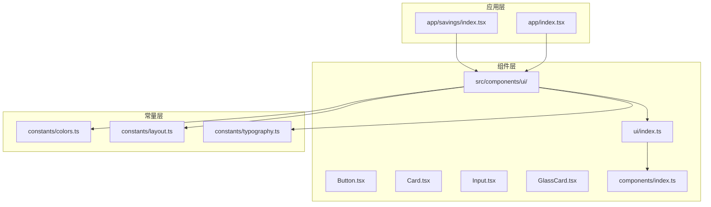
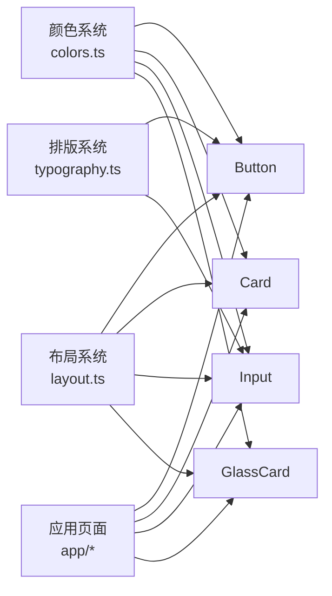
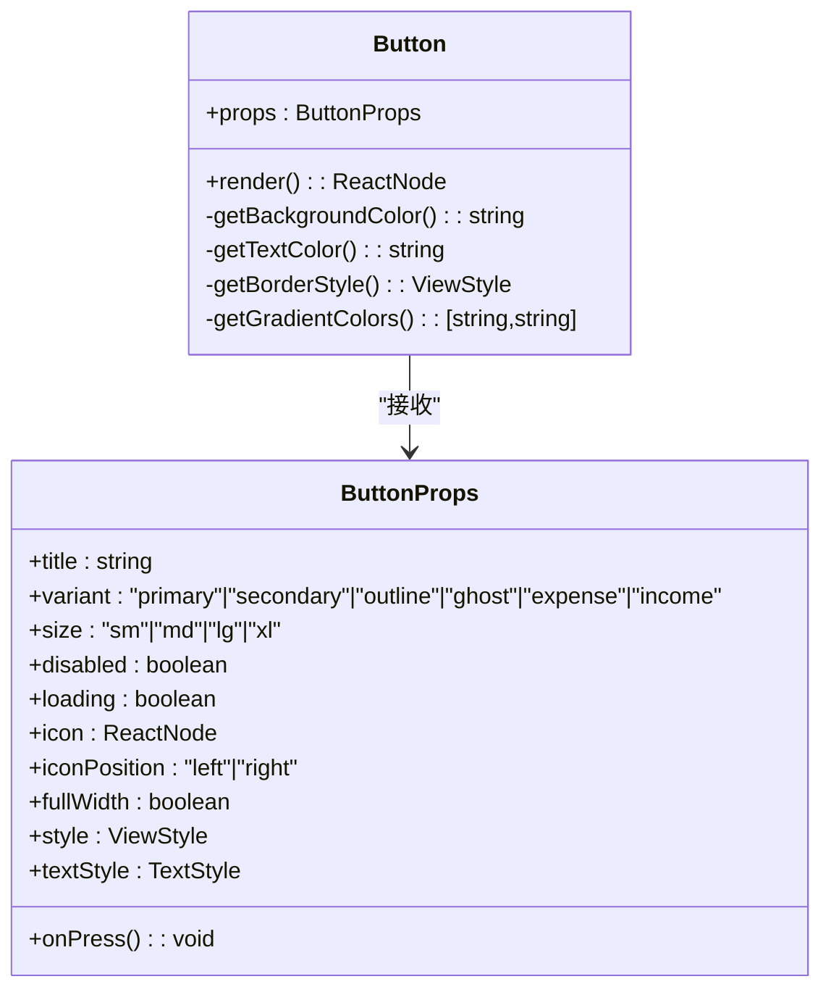
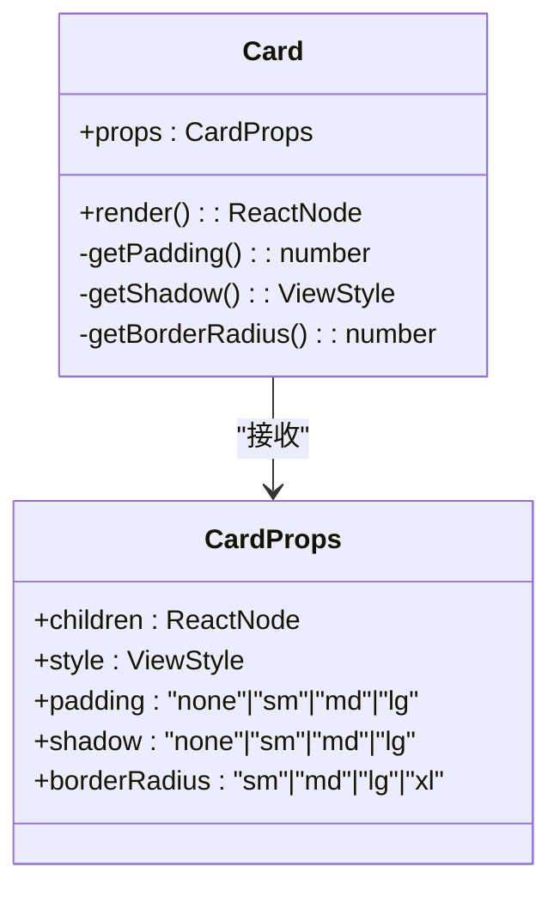
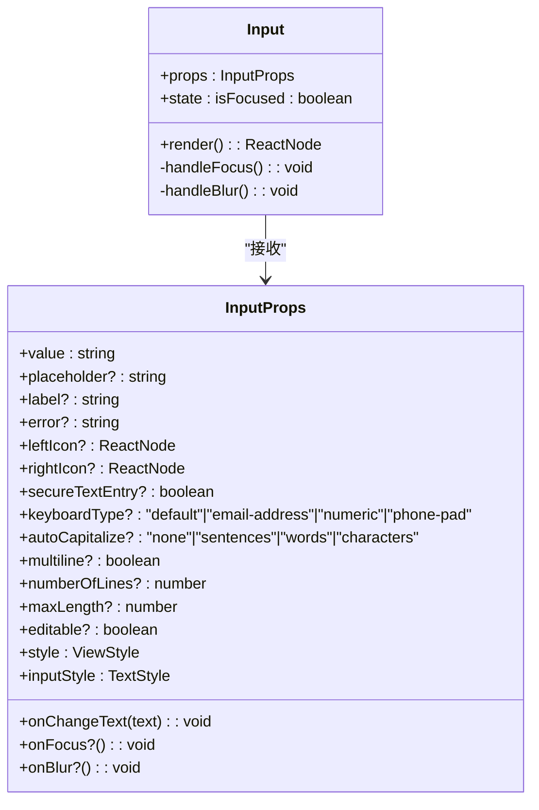
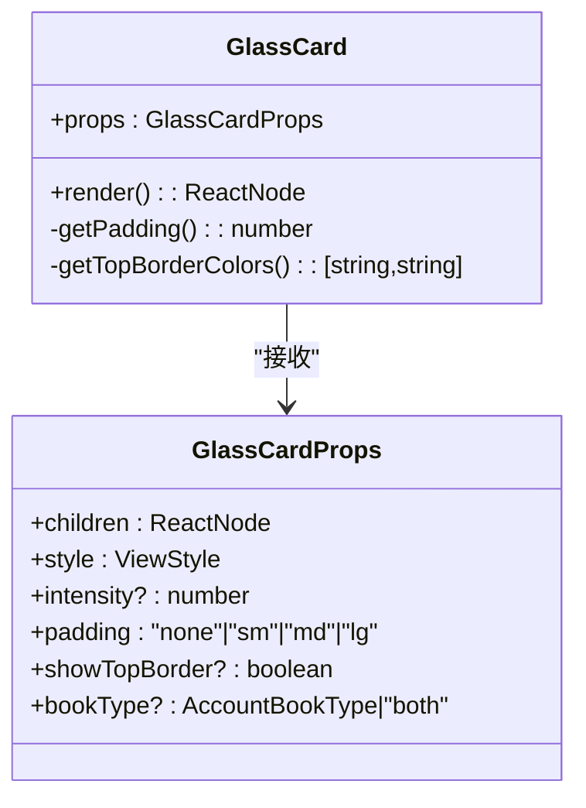
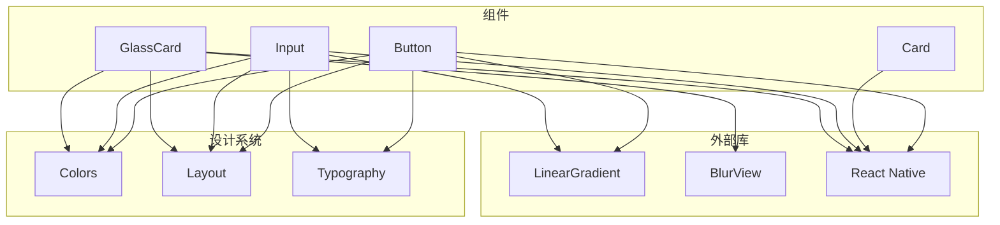

# 组件开发

<cite>
**本文引用的文件**
- [src/components/ui/index.ts](file://src/components/ui/index.ts)
- [src/components/ui/Button.tsx](file://src/components/ui/Button.tsx)
- [src/components/ui/Card.tsx](file://src/components/ui/Card.tsx)
- [src/components/ui/Input.tsx](file://src/components/ui/Input.tsx)
- [src/components/ui/GlassCard.tsx](file://src/components/ui/GlassCard.tsx)
- [src/components/index.ts](file://src/components/index.ts)
- [src/constants/colors.ts](file://src/constants/colors.ts)
- [src/constants/layout.ts](file://src/constants/layout.ts)
- [src/constants/typography.ts](file://src/constants/typography.ts)
- [src/app/savings/index.tsx](file://src/app/savings/index.tsx)
- [src/app/index.tsx](file://src/app/index.tsx)
- [package.json](file://package.json)
</cite>

## 目录
1. [简介](#简介)
2. [项目结构](#项目结构)
3. [核心组件](#核心组件)
4. [架构总览](#架构总览)
5. [组件详解](#组件详解)
6. [依赖关系分析](#依赖关系分析)
7. [性能考量](#性能考量)
8. [故障排查指南](#故障排查指南)
9. [结论](#结论)
10. [附录](#附录)

## 简介
本指南面向“攒钱记账”项目的前端组件开发者，系统讲解UI组件的设计原则、开发流程与最佳实践。重点覆盖 Button、Card、Input、GlassCard 四个核心组件的 Props 接口设计、事件处理与状态管理、样式定制与主题适配、测试策略与性能优化技巧，并提供组件复用模式与组合使用示例，以及与设计系统的集成方式。

## 项目结构
项目采用按功能域组织的结构，组件集中在 src/components/ui 下统一导出，通过 src/components/index.ts 提供聚合导出，便于在应用各处按需引入。

图表来源
- [src/components/ui/index.ts](file://src/components/ui/index.ts#L1-L9)
- [src/components/index.ts](file://src/components/index.ts#L1-L6)
- [src/constants/colors.ts](file://src/constants/colors.ts#L1-L88)
- [src/constants/layout.ts](file://src/constants/layout.ts#L1-L182)
- [src/constants/typography.ts](file://src/constants/typography.ts#L1-L149)
- [src/app/savings/index.tsx](file://src/app/savings/index.tsx#L1-L341)
- [src/app/index.tsx](file://src/app/index.tsx#L1-L249)

章节来源
- [src/components/ui/index.ts](file://src/components/ui/index.ts#L1-L9)
- [src/components/index.ts](file://src/components/index.ts#L1-L6)

## 核心组件
本节概述四个核心组件的功能定位与职责边界：
- Button：渐变按钮，支持多种变体、尺寸、图标位置、全宽与加载态。
- Card：通用卡片容器，支持内边距、阴影、圆角与自定义样式。
- Input：带标签、错误提示、左右图标与渐变底部线的输入框，内置焦点状态管理。
- GlassCard：毛玻璃卡片，支持 Android 降级方案与账本类型边框。

章节来源
- [src/components/ui/Button.tsx](file://src/components/ui/Button.tsx#L1-L204)
- [src/components/ui/Card.tsx](file://src/components/ui/Card.tsx#L1-L94)
- [src/components/ui/Input.tsx](file://src/components/ui/Input.tsx#L1-L194)
- [src/components/ui/GlassCard.tsx](file://src/components/ui/GlassCard.tsx#L1-L126)

## 架构总览
组件与设计系统的关系如下：组件通过 constants 层的颜色、布局、排版规范进行样式约束；应用页面通过组件组合实现业务视图。

图表来源
- [src/constants/colors.ts](file://src/constants/colors.ts#L1-L88)
- [src/constants/layout.ts](file://src/constants/layout.ts#L1-L182)
- [src/constants/typography.ts](file://src/constants/typography.ts#L1-L149)
- [src/components/ui/Button.tsx](file://src/components/ui/Button.tsx#L1-L204)
- [src/components/ui/Card.tsx](file://src/components/ui/Card.tsx#L1-L94)
- [src/components/ui/Input.tsx](file://src/components/ui/Input.tsx#L1-L194)
- [src/components/ui/GlassCard.tsx](file://src/components/ui/GlassCard.tsx#L1-L126)
- [src/app/savings/index.tsx](file://src/app/savings/index.tsx#L1-L341)

## 组件详解

### Button 组件
- 设计原则
  - 以变体区分语义：primary、secondary、outline、ghost、expense、income。
  - 以尺寸控制高度与内边距，统一圆角与阴影。
  - 支持图标左/右放置、全宽、禁用与加载态。
- Props 接口
  - 必填：title、onPress
  - 可选：variant、size、disabled、loading、icon、iconPosition、fullWidth、style、textStyle
- 事件与状态
  - 使用 TouchableOpacity 包裹，内部根据变体与禁用状态动态计算背景、边框、文本色与渐变。
  - loading 时显示 ActivityIndicator，颜色随文本色自动适配。
- 样式与主题
  - 颜色来自 Colors，渐变来自 Gradients；字体来自 Typography.button；圆角与阴影来自 BorderRadius、Shadows；高度来自 Sizes.button。
- 扩展建议
  - 新增变体时，同步更新 getBackgroundColor、getTextColor、getGradientColors 逻辑。
  - 支持自定义渐变色数组或禁用渐变的开关。

图表来源
- [src/components/ui/Button.tsx](file://src/components/ui/Button.tsx#L22-L34)

章节来源
- [src/components/ui/Button.tsx](file://src/components/ui/Button.tsx#L1-L204)
- [src/constants/colors.ts](file://src/constants/colors.ts#L1-L88)
- [src/constants/layout.ts](file://src/constants/layout.ts#L1-L182)
- [src/constants/typography.ts](file://src/constants/typography.ts#L1-L149)

### Card 组件
- 设计原则
  - 作为通用容器，提供统一的背景、圆角、阴影与内边距。
- Props 接口
  - 必填：children
  - 可选：style、padding、shadow、borderRadius
- 样式与主题
  - 背景色来自 Colors.card；圆角来自 BorderRadius；阴影来自 Shadows；内边距来自 Spacing。

图表来源
- [src/components/ui/Card.tsx](file://src/components/ui/Card.tsx#L10-L16)

章节来源
- [src/components/ui/Card.tsx](file://src/components/ui/Card.tsx#L1-L94)
- [src/constants/colors.ts](file://src/constants/colors.ts#L1-L88)
- [src/constants/layout.ts](file://src/constants/layout.ts#L1-L182)

### Input 组件
- 设计原则
  - 支持标签、占位符、左右图标、多行、安全输入、键盘类型、自动大写、最大长度、可编辑性。
  - 底部线条在聚焦时使用渐变，在非聚焦时使用普通线；错误状态改变线色。
- Props 接口
  - 必填：value、onChangeText
  - 可选：placeholder、label、error、leftIcon、rightIcon、secureTextEntry、keyboardType、autoCapitalize、multiline、numberOfLines、maxLength、editable、style、inputStyle、onFocus、onBlur
- 状态管理
  - 内部维护 isFocused 状态，聚焦/失焦时更新底部线样式。
- 样式与主题
  - 文本颜色来自 Colors.text；占位符颜色来自 Colors.text.tertiary；渐变来自 Gradients.primary；字体来自 Typography.body；圆角与阴影来自 BorderRadius、Shadows；高度来自 Sizes.input。

图表来源
- [src/components/ui/Input.tsx](file://src/components/ui/Input.tsx#L20-L39)

章节来源
- [src/components/ui/Input.tsx](file://src/components/ui/Input.tsx#L1-L194)
- [src/constants/colors.ts](file://src/constants/colors.ts#L1-L88)
- [src/constants/layout.ts](file://src/constants/layout.ts#L1-L182)
- [src/constants/typography.ts](file://src/constants/typography.ts#L1-L149)

### GlassCard 组件
- 设计原则
  - 在 iOS 上使用 BlurView 实现毛玻璃效果；在 Android 上使用半透明背景降级。
  - 支持顶部边框渐变，按账本类型或 both 显示不同颜色。
- Props 接口
  - 必填：children
  - 可选：style、intensity、padding、showTopBorder、bookType
- 平台差异
  - Android 不支持 BlurView，组件自动回退为半透明背景方案。
- 样式与主题
  - 背景使用 Colors.cardGlass；圆角与阴影来自 BorderRadius、Shadows。

图表来源
- [src/components/ui/GlassCard.tsx](file://src/components/ui/GlassCard.tsx#L13-L20)

章节来源
- [src/components/ui/GlassCard.tsx](file://src/components/ui/GlassCard.tsx#L1-L126)
- [src/constants/colors.ts](file://src/constants/colors.ts#L1-L88)
- [src/constants/layout.ts](file://src/constants/layout.ts#L1-L182)

### 组件使用与组合示例
- 在应用页面中，Button、Card、Input 作为基础构件被组合使用，形成业务视图。
- 示例路径参考：
  - [应用页面中对 Card 的使用](file://src/app/savings/index.tsx#L84-L117)
  - [启动页中对渐变与样式的使用](file://src/app/index.tsx#L77-L146)

章节来源
- [src/app/savings/index.tsx](file://src/app/savings/index.tsx#L1-L341)
- [src/app/index.tsx](file://src/app/index.tsx#L1-L249)

## 依赖关系分析
- 组件依赖设计系统常量
  - Button、Card、Input、GlassCard 均依赖 Colors、Layout、Typography。
- 外部依赖
  - Button、Input 使用 Linear Gradient；GlassCard 使用 Expo Blur；所有组件使用 React Native 原生组件。
- 导出与聚合
  - ui/index.ts 与 components/index.ts 提供统一导出入口，便于跨模块复用。

图表来源
- [src/components/ui/Button.tsx](file://src/components/ui/Button.tsx#L14-L17)
- [src/components/ui/Input.tsx](file://src/components/ui/Input.tsx#L15-L18)
- [src/components/ui/GlassCard.tsx](file://src/components/ui/GlassCard.tsx#L7-L11)
- [src/constants/colors.ts](file://src/constants/colors.ts#L1-L88)
- [src/constants/layout.ts](file://src/constants/layout.ts#L1-L182)
- [src/constants/typography.ts](file://src/constants/typography.ts#L1-L149)
- [package.json](file://package.json#L11-L34)

章节来源
- [package.json](file://package.json#L11-L34)

## 性能考量
- 渲染优化
  - Button、Input、GlassCard 均为函数组件，避免不必要的重渲染；Button 与 Input 内部状态粒度较小，减少 rerender 范围。
- 样式与布局
  - 使用 StyleSheet.create 缓存样式对象；统一从 Layout 常量读取尺寸与圆角，避免重复计算。
- 平台差异
  - GlassCard 对 Android 做了降级处理，避免在不支持的平台上产生额外开销。
- 渐变与模糊
  - 渐变与模糊在视觉上增强体验，但应避免过度使用导致绘制压力；可通过调整 intensity 与渐变数量控制成本。
- 事件处理
  - Button 使用 activeOpacity 控制触摸反馈，避免过度动画影响性能。

## 故障排查指南
- Button 无法响应点击
  - 检查 disabled 与 loading 状态；确认 onPress 是否传入有效函数。
  - 参考路径：[Button 渲染与禁用逻辑](file://src/components/ui/Button.tsx#L48-L51)
- Input 底部线颜色异常
  - 确认 error 状态与 isFocused 状态是否正确；错误状态下应使用 Colors.error。
  - 参考路径：[Input 底部线渲染](file://src/components/ui/Input.tsx#L115-L131)
- GlassCard 在 Android 上无模糊效果
  - 这是预期行为，组件已降级为半透明背景；如需一致体验，可在 Android 上使用自定义模糊方案。
  - 参考路径：[GlassCard 平台分支](file://src/components/ui/GlassCard.tsx#L72-L88)
- 样式不生效
  - 检查 StyleSheet.create 的缓存样式是否被覆盖；确认从 Layout、Colors、Typography 引入的值是否正确。
  - 参考路径：[Button 样式合并](file://src/components/ui/Button.tsx#L112-L129)

章节来源
- [src/components/ui/Button.tsx](file://src/components/ui/Button.tsx#L48-L51)
- [src/components/ui/Input.tsx](file://src/components/ui/Input.tsx#L115-L131)
- [src/components/ui/GlassCard.tsx](file://src/components/ui/GlassCard.tsx#L72-L88)

## 结论
本指南系统梳理了 Button、Card、Input、GlassCard 的设计与实现要点，明确了 Props 接口、事件与状态管理、样式与主题适配、平台差异与性能优化策略。通过统一的设计系统与清晰的导出机制，组件具备良好的可扩展性与复用性，适合在“攒钱记账”项目中持续演进。

## 附录
- 组件导出入口
  - [ui/index.ts](file://src/components/ui/index.ts#L1-L9)
  - [components/index.ts](file://src/components/index.ts#L1-L6)
- 设计系统常量
  - [colors.ts](file://src/constants/colors.ts#L1-L88)
  - [layout.ts](file://src/constants/layout.ts#L1-L182)
  - [typography.ts](file://src/constants/typography.ts#L1-L149)
- 外部依赖
  - [package.json](file://package.json#L11-L34)