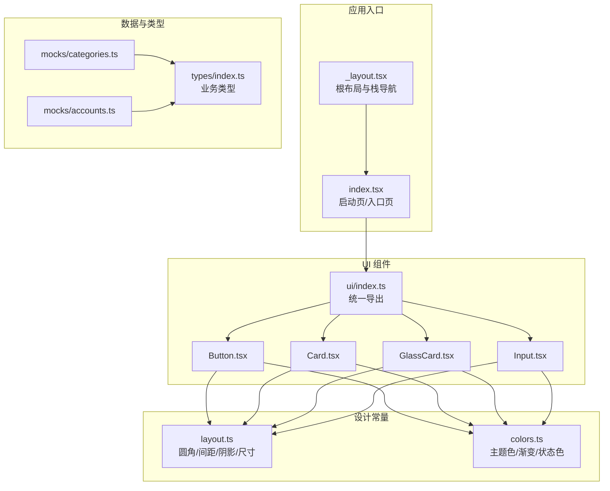
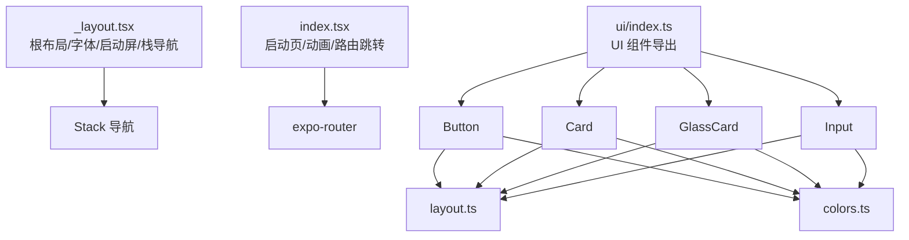
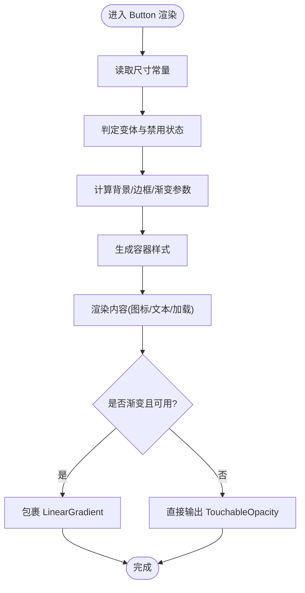
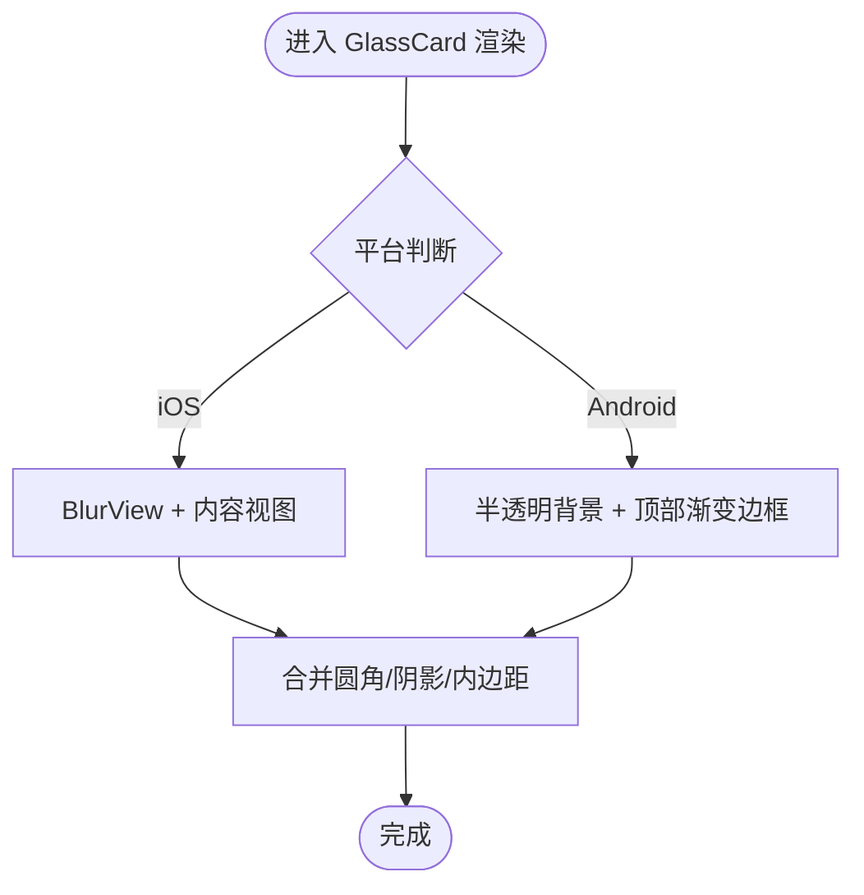
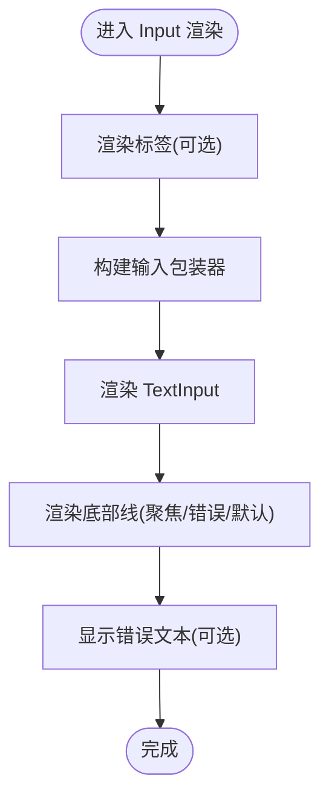
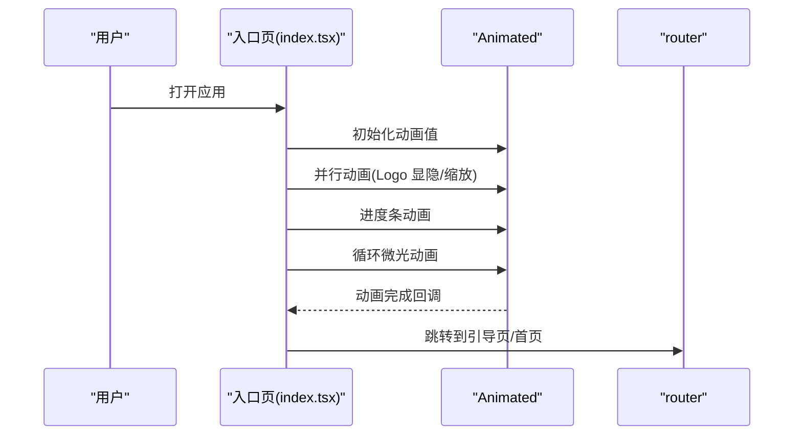
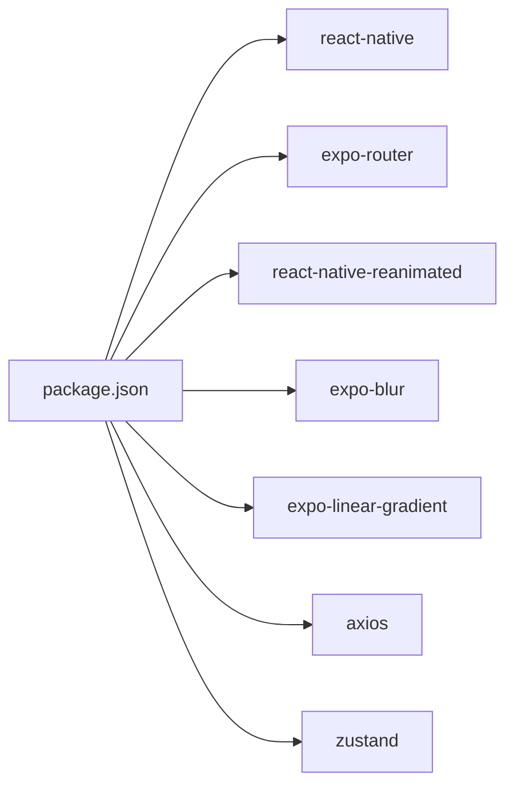

# 组件性能优化

<cite>
**本文引用的文件**
- [package.json](file://package.json)
- [根布局 _layout.tsx](file://src/app/_layout.tsx)
- [入口页 index.tsx](file://src/app/index.tsx)
- [UI 导出 index.ts](file://src/components/ui/index.ts)
- [Button.tsx](file://src/components/ui/Button.tsx)
- [Card.tsx](file://src/components/ui/Card.tsx)
- [GlassCard.tsx](file://src/components/ui/GlassCard.tsx)
- [Input.tsx](file://src/components/ui/Input.tsx)
- [布局规范 layout.ts](file://src/constants/layout.ts)
- [颜色系统 colors.ts](file://src/constants/colors.ts)
- [类型定义 index.ts](file://src/types/index.ts)
- [分类 Mock 数据 categories.ts](file://src/mocks/categories.ts)
- [账户 Mock 数据 accounts.ts](file://src/mocks/accounts.ts)
</cite>

## 目录
1. [引言](#引言)
2. [项目结构](#项目结构)
3. [核心组件](#核心组件)
4. [架构概览](#架构概览)
5. [详细组件分析](#详细组件分析)
6. [依赖分析](#依赖分析)
7. [性能考虑](#性能考虑)
8. [故障排查指南](#故障排查指南)
9. [结论](#结论)
10. [附录](#附录)

## 引言
本指南聚焦于 UI 组件的性能优化技术与最佳实践，结合当前代码库中的组件实现，系统讲解渲染优化、内存管理、重绘重排控制、懒加载、虚拟化与缓存策略，并提供监控与分析方法、常见性能陷阱规避、基准测试与优化效果评估思路，以及组件树优化与状态提升策略。文档以循序渐进的方式呈现，既适合初学者快速上手，也为资深开发者提供深入参考。

## 项目结构
该仓库采用基于功能模块的组织方式，核心路径如下：
- 应用入口与路由：src/app 下的页面与布局
- UI 组件：src/components/ui 下的通用组件
- 设计常量：src/constants 下的颜色、布局、字体等
- 类型定义：src/types 下的业务模型
- 模拟数据：src/mocks 下的分类、账户等示例数据

图表来源
- [根布局 _layout.tsx](file://src/app/_layout.tsx#L1-L55)
- [入口页 index.tsx](file://src/app/index.tsx#L1-L249)
- [UI 导出 index.ts](file://src/components/ui/index.ts#L1-L9)
- [Button.tsx](file://src/components/ui/Button.tsx#L1-L204)
- [Card.tsx](file://src/components/ui/Card.tsx#L1-L94)
- [GlassCard.tsx](file://src/components/ui/GlassCard.tsx#L1-L126)
- [Input.tsx](file://src/components/ui/Input.tsx#L1-L194)
- [布局规范 layout.ts](file://src/constants/layout.ts#L1-L182)
- [颜色系统 colors.ts](file://src/constants/colors.ts#L1-L88)
- [类型定义 index.ts](file://src/types/index.ts#L1-L141)
- [分类 Mock 数据 categories.ts](file://src/mocks/categories.ts#L1-L69)
- [账户 Mock 数据 accounts.ts](file://src/mocks/accounts.ts#L1-L91)

章节来源
- [package.json](file://package.json#L1-L43)
- [根布局 _layout.tsx](file://src/app/_layout.tsx#L1-L55)
- [入口页 index.tsx](file://src/app/index.tsx#L1-L249)
- [UI 导出 index.ts](file://src/components/ui/index.ts#L1-L9)

## 核心组件
本节从性能角度审视关键 UI 组件的设计与实现要点，包括渲染路径、样式计算、资源使用与可扩展性。

- Button 组件
  - 渲染路径：根据变体与尺寸动态计算容器与文本样式；在启用渐变时使用 LinearGradient 包裹内容。
  - 性能要点：避免在每次渲染中创建新的样式对象；通过常量映射与内联样式组合减少分支开销；渐变绘制仅在需要时启用。
  - 交互反馈：通过 activeOpacity 控制触摸反馈，降低不必要的重绘。
  - 参考路径：[Button 实现](file://src/components/ui/Button.tsx#L36-L189)

- Card 组件
  - 渲染路径：按传入的内边距、圆角与阴影生成最终样式；子节点直接透传。
  - 性能要点：样式计算集中在组件内部，避免父层重复计算；阴影与圆角为静态常量，不引入运行时复杂度。
  - 参考路径：[Card 实现](file://src/components/ui/Card.tsx#L18-L84)

- GlassCard 组件
  - 渲染路径：在 iOS 使用 BlurView，在 Android 使用半透明背景与渐变顶部边框作为降级方案。
  - 性能要点：平台分支在组件内完成，避免运行时判断成本；Android 降级方案保持视觉一致性的同时降低 GPU 压力。
  - 参考路径：[GlassCard 实现](file://src/components/ui/GlassCard.tsx#L22-L106)

- Input 组件
  - 渲染路径：支持左侧/右侧图标、多行输入、错误状态与渐变底部线；焦点状态驱动样式变化。
  - 性能要点：使用受控输入，避免频繁的 DOM/视图更新；底部线采用渐变或纯色，减少额外层级。
  - 参考路径：[Input 实现](file://src/components/ui/Input.tsx#L41-L137)

- 样式与常量
  - 布局常量：集中定义圆角、间距、阴影、尺寸与动画时长，便于复用与统一优化。
  - 颜色与渐变：主题色与渐变配置集中管理，减少重复声明带来的样式表膨胀。
  - 参考路径：[布局规范](file://src/constants/layout.ts#L1-L182)、[颜色系统](file://src/constants/colors.ts#L1-L88)

章节来源
- [Button.tsx](file://src/components/ui/Button.tsx#L1-L204)
- [Card.tsx](file://src/components/ui/Card.tsx#L1-L94)
- [GlassCard.tsx](file://src/components/ui/GlassCard.tsx#L1-L126)
- [Input.tsx](file://src/components/ui/Input.tsx#L1-L194)
- [布局规范 layout.ts](file://src/constants/layout.ts#L1-L182)
- [颜色系统 colors.ts](file://src/constants/colors.ts#L1-L88)

## 架构概览
应用采用 Expo Router 的栈导航组织页面，根布局负责字体加载与启动屏控制，入口页承担启动动画与路由跳转职责。UI 组件通过统一导出模块集中管理，样式与颜色由常量模块提供，类型与模拟数据支撑页面逻辑。

图表来源
- [根布局 _layout.tsx](file://src/app/_layout.tsx#L17-L47)
- [入口页 index.tsx](file://src/app/index.tsx#L15-L64)
- [UI 导出 index.ts](file://src/components/ui/index.ts#L5-L9)
- [布局规范 layout.ts](file://src/constants/layout.ts#L1-L182)
- [颜色系统 colors.ts](file://src/constants/colors.ts#L1-L88)

## 详细组件分析

### Button 组件性能分析
- 渲染路径与样式计算
  - 容器高度与圆角来自尺寸常量；边框与背景根据变体动态决定；渐变仅在特定变体启用。
  - 文本颜色与图标位置影响样式拼接，但整体为常量与简单条件分支。
- 性能优化建议
  - 将样式对象抽取为常量或使用 memo 包装，避免重复创建。
  - 渐变绘制在原生层进行，注意避免在高频事件中频繁切换变体。
  - 对于大量按钮列表，优先使用 FlatList/Virtuoso 并配合 key 与固定尺寸。

图表来源
- [Button.tsx](file://src/components/ui/Button.tsx#L36-L189)

章节来源
- [Button.tsx](file://src/components/ui/Button.tsx#L36-L189)
- [布局规范 layout.ts](file://src/constants/layout.ts#L113-L147)
- [颜色系统 colors.ts](file://src/constants/colors.ts#L6-L88)

### GlassCard 组件性能分析
- 平台差异处理
  - iOS 使用 BlurView，Android 使用半透明背景与顶部渐变边框作为降级。
- 性能优化建议
  - 在 Android 上避免过度使用高复杂度阴影与模糊，优先使用半透明背景与线性渐变。
  - 顶部边框使用渐变而非多层视图，减少层级深度。

图表来源
- [GlassCard.tsx](file://src/components/ui/GlassCard.tsx#L72-L106)

章节来源
- [GlassCard.tsx](file://src/components/ui/GlassCard.tsx#L22-L106)
- [布局规范 layout.ts](file://src/constants/layout.ts#L36-L110)
- [颜色系统 colors.ts](file://src/constants/colors.ts#L34-L37)

### Input 组件性能分析
- 焦点状态与底部线
  - 焦点时使用渐变底部线，失焦时使用纯色线，减少不必要的渐变绘制。
- 性能优化建议
  - 多行输入时固定最小高度，避免频繁测量导致的重排。
  - 图标区域使用固定尺寸与对齐，减少布局计算。

图表来源
- [Input.tsx](file://src/components/ui/Input.tsx#L78-L137)

章节来源
- [Input.tsx](file://src/components/ui/Input.tsx#L41-L137)
- [布局规范 layout.ts](file://src/constants/layout.ts#L142-L147)
- [颜色系统 colors.ts](file://src/constants/colors.ts#L52-L57)

### 启动页与动画性能
- 启动页使用 Animated 与 LinearGradient 实现平滑过渡与进度指示。
- 性能优化建议
  - 使用 useNativeDriver 的动画尽量在原生层执行，减少 JS 线程压力。
  - 进度条动画使用非原生驱动时，确保动画时长与帧率匹配设备刷新率。

图表来源
- [入口页 index.tsx](file://src/app/index.tsx#L21-L64)

章节来源
- [入口页 index.tsx](file://src/app/index.tsx#L15-L147)

## 依赖分析
- 运行时依赖
  - react、react-native、expo-router、react-native-reanimated、expo-blur、expo-linear-gradient 等。
- 开发与构建
  - TypeScript、@types/react 等。
- 依赖关系对性能的影响
  - reanimated 与 blur 等原生能力可显著降低 JS 线程压力，但需注意平台差异与资源占用。
  - linear-gradient 在原生层渲染，适合用于 UI 装饰，避免在高频场景中频繁切换。

图表来源
- [package.json](file://package.json#L11-L34)

章节来源
- [package.json](file://package.json#L1-L43)

## 性能考虑
本节从渲染、内存、重绘重排、懒加载、虚拟化与缓存、监控与分析、常见陷阱与优化评估等方面给出系统建议。

- 渲染优化
  - 避免在渲染函数中创建新对象；将样式与常量抽离为稳定引用。
  - 使用 FlatList/Virtuoso 等虚拟化组件处理长列表；固定高度与 key 规范化。
  - 减少深层嵌套与多余容器，降低布局计算复杂度。
- 内存管理
  - 及时清理定时器与订阅；避免闭包持有大对象。
  - 图片与视频资源按需加载，释放不再使用的资源。
- 重绘重排控制
  - 使用 transform 与 opacity 触发合成层动画；避免触发布局与绘制。
  - 合理使用 zIndex 与阴影，避免过度阴影导致的 GPU 压力。
- 懒加载与缓存
  - 页面与图片懒加载；组件级缓存（如 useMemo/useCallback）。
  - 列表项缓存与键值规范化，避免不必要的重新渲染。
- 性能监控与分析
  - 使用 React DevTools Profiler 与 Flipper/Systrace 分析渲染耗时。
  - Metro 构建时开启生产模式，利用原生动画与渐变减少 JS 线程负担。
- 常见性能陷阱
  - 在渲染中进行昂贵计算或 IO 操作。
  - 频繁切换大型渐变或模糊效果。
  - 列表未设置 key 或高度不固定导致的重排。
- 基准测试与效果评估
  - 使用帧率仪与内存分析工具对比优化前后指标。
  - 以用户感知为目标，关注首屏时间、交互延迟与滚动流畅度。

## 故障排查指南
- 启动屏与字体加载
  - 若启动屏提前隐藏，检查字体加载与启动屏控制逻辑。
  - 参考路径：[根布局字体与启动屏控制](file://src/app/_layout.tsx#L17-L28)
- 动画卡顿
  - 检查 useNativeDriver 的使用与动画时长；避免在非原生驱动中做复杂计算。
  - 参考路径：[入口页动画与跳转](file://src/app/index.tsx#L21-L64)
- 渐变与模糊性能问题
  - iOS 使用 BlurView，Android 使用降级方案；避免在高频场景中频繁切换。
  - 参考路径：[GlassCard 平台分支](file://src/components/ui/GlassCard.tsx#L72-L106)
- 列表渲染异常
  - 确保列表项 key 唯一且稳定；固定高度与样式引用稳定。
  - 参考路径：[Button/输入/卡片样式常量](file://src/constants/layout.ts#L1-L182)

章节来源
- [根布局 _layout.tsx](file://src/app/_layout.tsx#L17-L28)
- [入口页 index.tsx](file://src/app/index.tsx#L21-L64)
- [GlassCard.tsx](file://src/components/ui/GlassCard.tsx#L72-L106)
- [布局规范 layout.ts](file://src/constants/layout.ts#L1-L182)

## 结论
通过对现有 UI 组件与应用架构的分析，可以发现项目在样式与常量管理、平台差异化处理与动画实现方面已具备良好的基础。进一步结合虚拟化、缓存与监控体系，可在保证体验的前提下显著提升性能表现。建议在后续迭代中逐步引入列表虚拟化、组件级缓存与性能基线测试，持续优化渲染效率与资源占用。

## 附录
- 组件树优化与状态提升
  - 将高频更新的状态下沉至局部组件，避免无关节点重渲染。
  - 使用 Context 或 Zustand 管理全局状态，避免跨层级传递过多 props。
- 实际优化案例与效果对比
  - 示例：将长列表从普通 ScrollView 替换为 FlatList，固定高度并设置 key，观察帧率与内存变化。
  - 示例：对渐变与模糊效果进行平台差异化处理，Android 使用降级方案，减少 GPU 压力。
- 参考文件路径
  - [类型定义 index.ts](file://src/types/index.ts#L1-L141)
  - [分类 Mock 数据 categories.ts](file://src/mocks/categories.ts#L1-L69)
  - [账户 Mock 数据 accounts.ts](file://src/mocks/accounts.ts#L1-L91)