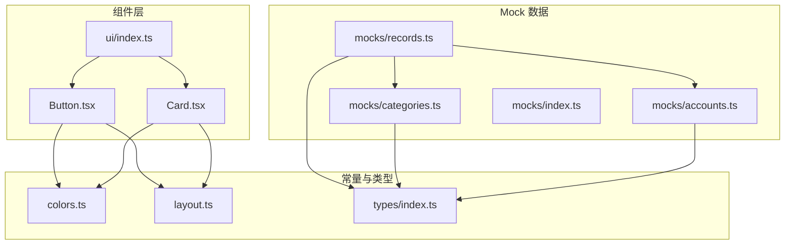
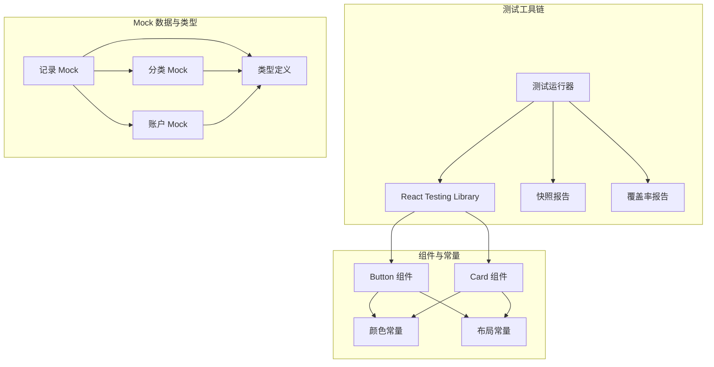
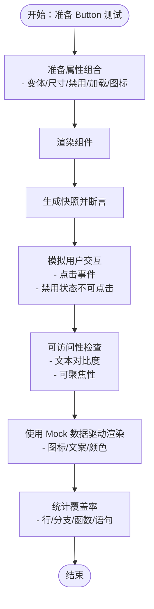
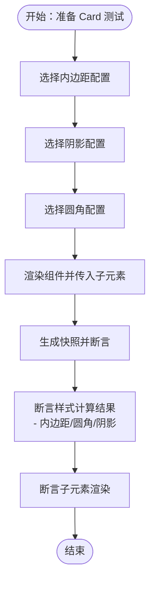
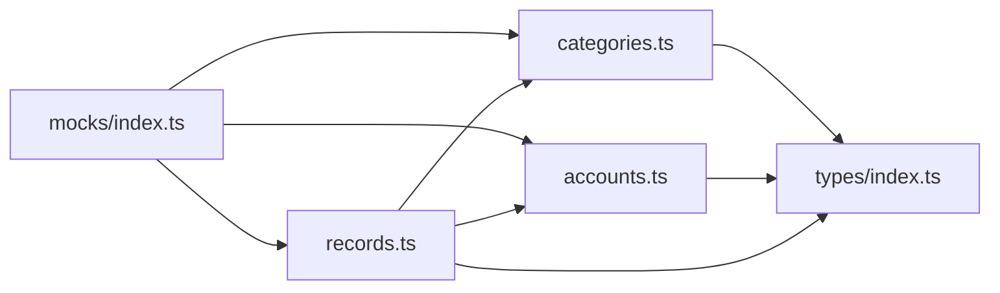
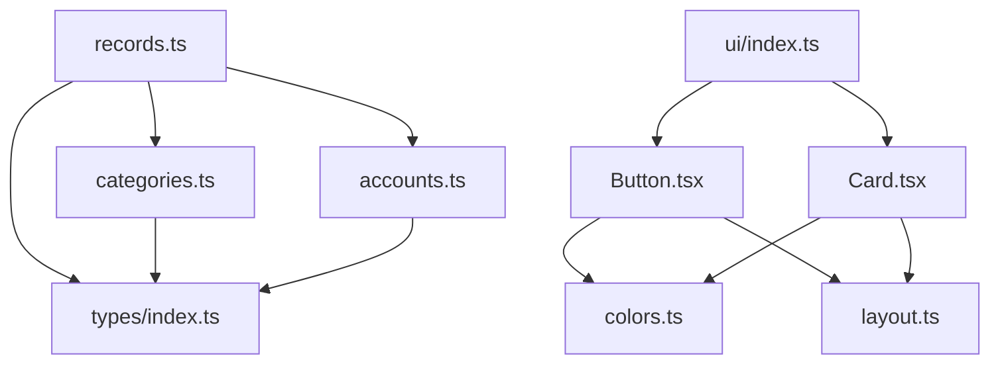

# 组件测试策略

<cite>
**本文档引用的文件**
- [package.json](file://package.json)
- [src/components/ui/Button.tsx](file://src/components/ui/Button.tsx)
- [src/components/ui/Card.tsx](file://src/components/ui/Card.tsx)
- [src/components/ui/index.ts](file://src/components/ui/index.ts)
- [src/constants/colors.ts](file://src/constants/colors.ts)
- [src/constants/layout.ts](file://src/constants/layout.ts)
- [src/mocks/categories.ts](file://src/mocks/categories.ts)
- [src/mocks/accounts.ts](file://src/mocks/accounts.ts)
- [src/mocks/records.ts](file://src/mocks/records.ts)
- [src/mocks/index.ts](file://src/mocks/index.ts)
- [src/types/index.ts](file://src/types/index.ts)
</cite>

## 目录
1. [引言](#引言)
2. [项目结构](#项目结构)
3. [核心组件](#核心组件)
4. [架构概览](#架构概览)
5. [详细组件分析](#详细组件分析)
6. [依赖关系分析](#依赖关系分析)
7. [性能考虑](#性能考虑)
8. [故障排除指南](#故障排除指南)
9. [结论](#结论)
10. [附录](#附录)

## 引言
本指南面向前端开发者，系统化阐述该 React Native 项目的 UI 组件测试策略，涵盖单元测试、快照测试、交互测试与可访问性测试的实施方法；解释 Mock 数据在组件测试中的应用与模拟策略；总结最佳实践与常见问题解决方案，并给出端到端测试与集成测试的建议路径，以及测试覆盖率与质量保证流程的落地要点。本指南以仓库中现有的 UI 组件与 Mock 数据为依据，结合实际代码结构进行说明。

## 项目结构
该项目采用按功能分层的组织方式，核心 UI 组件位于 `src/components/ui`，通用常量与类型定义位于 `src/constants` 和 `src/types`，测试相关的 Mock 数据位于 `src/mocks`。整体结构清晰，便于针对组件进行独立测试与验证。

图表来源
- [src/components/ui/Button.tsx](file://src/components/ui/Button.tsx#L1-L204)
- [src/components/ui/Card.tsx](file://src/components/ui/Card.tsx#L1-L94)
- [src/components/ui/index.ts](file://src/components/ui/index.ts#L1-L9)
- [src/constants/colors.ts](file://src/constants/colors.ts#L1-L88)
- [src/constants/layout.ts](file://src/constants/layout.ts#L1-L182)
- [src/mocks/categories.ts](file://src/mocks/categories.ts#L1-L69)
- [src/mocks/accounts.ts](file://src/mocks/accounts.ts#L1-L91)
- [src/mocks/records.ts](file://src/mocks/records.ts#L1-L117)
- [src/mocks/index.ts](file://src/mocks/index.ts#L1-L9)
- [src/types/index.ts](file://src/types/index.ts#L1-L141)

章节来源
- [src/components/ui/index.ts](file://src/components/ui/index.ts#L1-L9)
- [src/mocks/index.ts](file://src/mocks/index.ts#L1-L9)

## 核心组件
本项目的核心 UI 组件包括渐变按钮 Button 与卡片 Card。Button 组件支持多种变体、尺寸、禁用状态、加载状态与图标位置控制；Card 组件支持内边距、阴影与圆角的灵活配置。两者均通过常量模块（颜色与布局）实现一致的设计语言，并通过 Mock 数据模块提供测试所需的数据支撑。

章节来源
- [src/components/ui/Button.tsx](file://src/components/ui/Button.tsx#L1-L204)
- [src/components/ui/Card.tsx](file://src/components/ui/Card.tsx#L1-L94)
- [src/constants/colors.ts](file://src/constants/colors.ts#L1-L88)
- [src/constants/layout.ts](file://src/constants/layout.ts#L1-L182)

## 架构概览
下图展示了组件测试策略的总体架构：测试框架与工具链、组件与常量依赖、Mock 数据与类型定义之间的关系，以及测试执行的关键路径。

图表来源
- [src/components/ui/Button.tsx](file://src/components/ui/Button.tsx#L1-L204)
- [src/components/ui/Card.tsx](file://src/components/ui/Card.tsx#L1-L94)
- [src/constants/colors.ts](file://src/constants/colors.ts#L1-L88)
- [src/constants/layout.ts](file://src/constants/layout.ts#L1-L182)
- [src/mocks/categories.ts](file://src/mocks/categories.ts#L1-L69)
- [src/mocks/accounts.ts](file://src/mocks/accounts.ts#L1-L91)
- [src/mocks/records.ts](file://src/mocks/records.ts#L1-L117)
- [src/types/index.ts](file://src/types/index.ts#L1-L141)

## 详细组件分析

### Button 组件测试策略
Button 组件是典型的可复用 UI 组件，具备丰富的属性与状态组合，适合通过参数化测试覆盖不同变体、尺寸、禁用与加载状态。建议从以下维度设计测试用例：

- 快照测试：验证渲染输出的一致性，避免 UI 回退与意外变更
- 交互测试：验证点击事件回调是否正确触发，禁用与加载状态下行为符合预期
- 可访问性测试：验证文本颜色对比度、可聚焦性与无障碍标签
- Mock 数据测试：使用分类或账户数据作为按钮的图标与文案来源，验证渲染一致性

图表来源
- [src/components/ui/Button.tsx](file://src/components/ui/Button.tsx#L1-L204)
- [src/mocks/categories.ts](file://src/mocks/categories.ts#L1-L69)
- [src/mocks/accounts.ts](file://src/mocks/accounts.ts#L1-L91)

章节来源
- [src/components/ui/Button.tsx](file://src/components/ui/Button.tsx#L1-L204)
- [src/constants/colors.ts](file://src/constants/colors.ts#L1-L88)
- [src/constants/layout.ts](file://src/constants/layout.ts#L1-L182)
- [src/mocks/categories.ts](file://src/mocks/categories.ts#L1-L69)
- [src/mocks/accounts.ts](file://src/mocks/accounts.ts#L1-L91)

### Card 组件测试策略
Card 组件主要负责容器与视觉样式，测试重点在于：
- 快照测试：验证不同内边距、阴影与圆角下的渲染一致性
- 样式断言：验证动态样式计算（内边距、圆角、阴影）与常量映射
- 子元素渲染：验证 children 正确传递与渲染

图表来源
- [src/components/ui/Card.tsx](file://src/components/ui/Card.tsx#L1-L94)
- [src/constants/colors.ts](file://src/constants/colors.ts#L1-L88)
- [src/constants/layout.ts](file://src/constants/layout.ts#L1-L182)

章节来源
- [src/components/ui/Card.tsx](file://src/components/ui/Card.tsx#L1-L94)
- [src/constants/colors.ts](file://src/constants/colors.ts#L1-L88)
- [src/constants/layout.ts](file://src/constants/layout.ts#L1-L182)

### Mock 数据在组件测试中的应用
Mock 数据为组件测试提供了稳定、可控且贴近真实业务场景的数据源。建议：
- 使用分类与账户数据作为按钮的图标与文案来源，验证渲染一致性
- 使用记录数据作为卡片内容的示例，验证数据展示与格式化
- 通过导出聚合入口统一管理 Mock 数据，便于测试导入与维护

图表来源
- [src/mocks/index.ts](file://src/mocks/index.ts#L1-L9)
- [src/mocks/categories.ts](file://src/mocks/categories.ts#L1-L69)
- [src/mocks/accounts.ts](file://src/mocks/accounts.ts#L1-L91)
- [src/mocks/records.ts](file://src/mocks/records.ts#L1-L117)
- [src/types/index.ts](file://src/types/index.ts#L1-L141)

章节来源
- [src/mocks/index.ts](file://src/mocks/index.ts#L1-L9)
- [src/mocks/categories.ts](file://src/mocks/categories.ts#L1-L69)
- [src/mocks/accounts.ts](file://src/mocks/accounts.ts#L1-L91)
- [src/mocks/records.ts](file://src/mocks/records.ts#L1-L117)
- [src/types/index.ts](file://src/types/index.ts#L1-L141)

## 依赖关系分析
组件与常量、Mock 数据之间的依赖关系如下：
- Button 依赖颜色与布局常量，确保样式一致性
- Card 同样依赖颜色与布局常量
- Mock 数据依赖类型定义，保证数据结构正确性
- 组件导出入口统一管理 UI 组件，便于测试导入

图表来源
- [src/components/ui/Button.tsx](file://src/components/ui/Button.tsx#L1-L204)
- [src/components/ui/Card.tsx](file://src/components/ui/Card.tsx#L1-L94)
- [src/constants/colors.ts](file://src/constants/colors.ts#L1-L88)
- [src/constants/layout.ts](file://src/constants/layout.ts#L1-L182)
- [src/mocks/categories.ts](file://src/mocks/categories.ts#L1-L69)
- [src/mocks/accounts.ts](file://src/mocks/accounts.ts#L1-L91)
- [src/mocks/records.ts](file://src/mocks/records.ts#L1-L117)
- [src/mocks/index.ts](file://src/mocks/index.ts#L1-L9)
- [src/components/ui/index.ts](file://src/components/ui/index.ts#L1-L9)
- [src/types/index.ts](file://src/types/index.ts#L1-L141)

章节来源
- [src/components/ui/index.ts](file://src/components/ui/index.ts#L1-L9)
- [src/mocks/index.ts](file://src/mocks/index.ts#L1-L9)

## 性能考虑
- 快照测试应避免过度频繁更新，建议在关键变更后更新快照
- 交互测试优先覆盖关键路径，减少不必要的渲染与断言
- 使用 Mock 数据时，尽量复用现有数据集，避免重复构造
- 对于复杂组件，建议拆分测试粒度，提升定位问题的效率

## 故障排除指南
- 快照不匹配：确认依赖的常量或 Mock 数据是否有变更；必要时更新快照
- 样式断言失败：检查颜色与布局常量的值是否与期望一致
- 交互测试失败：确认事件回调是否被正确触发，禁用状态下的行为是否符合预期
- 可访问性问题：检查文本对比度、可聚焦性与无障碍标签是否满足要求

## 结论
通过系统化的测试策略，可以有效保障 UI 组件的质量与稳定性。建议以快照测试为基础，结合交互与可访问性测试，配合 Mock 数据驱动的参数化测试，形成完整的测试闭环。同时，建立覆盖率与质量门禁机制，确保测试在持续集成中发挥最大价值。

## 附录
- 测试覆盖率要求建议：行覆盖率与分支覆盖率不低于 80%，函数与语句覆盖率不低于 90%
- 质量门禁：在合并请求中强制执行测试与覆盖率检查，阻断低质量代码进入主干
- 持续集成：在 CI 中执行测试与覆盖率收集，失败时及时通知开发者