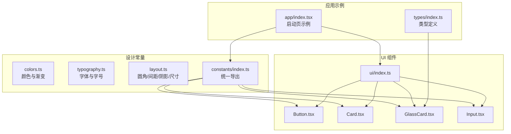
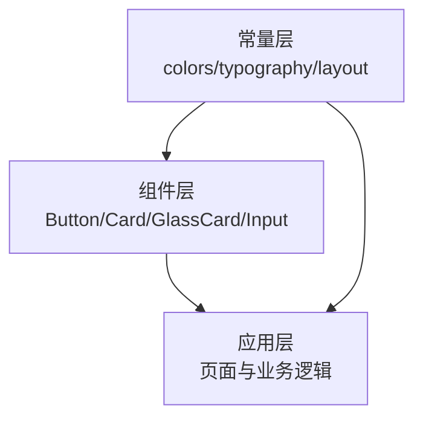
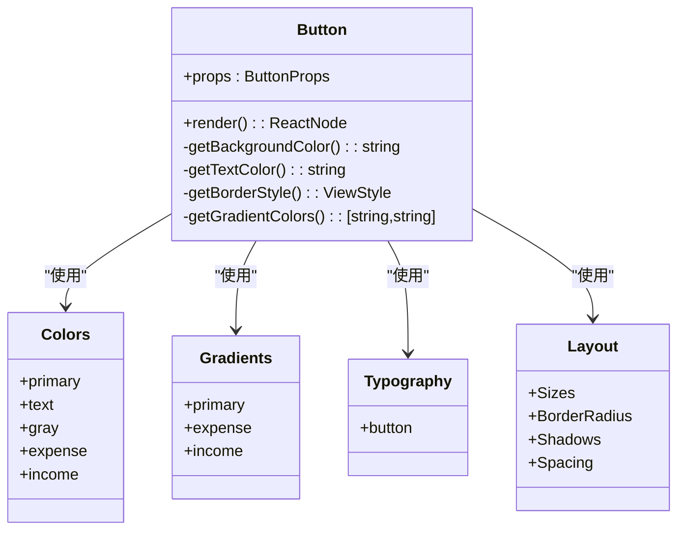
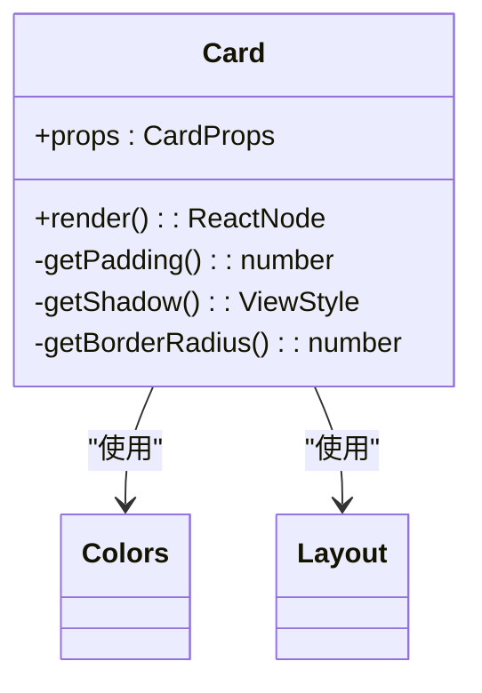
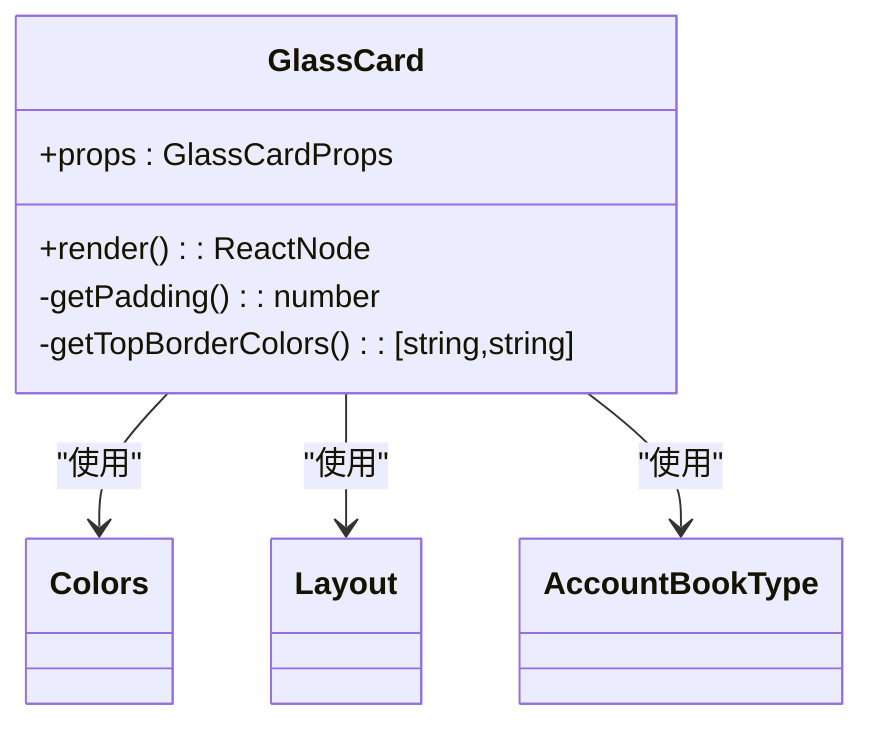
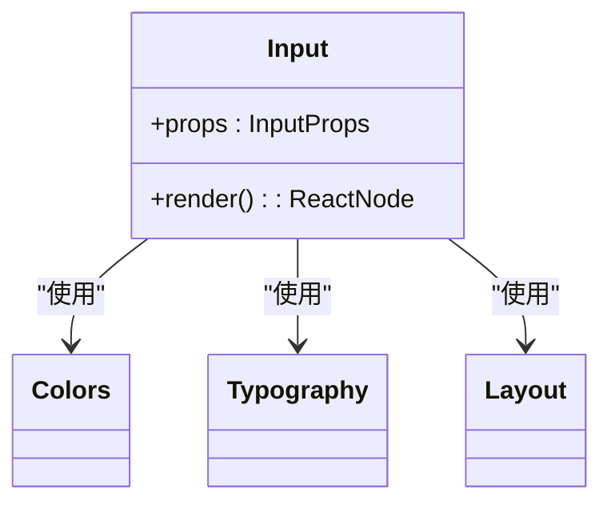
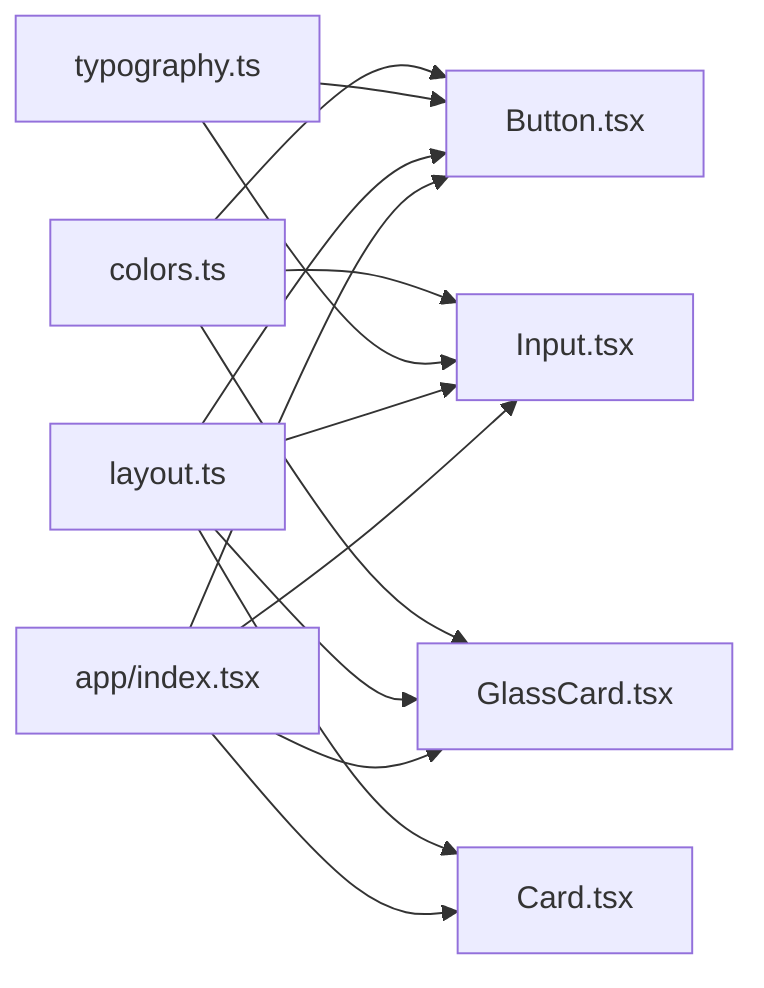

# 设计系统集成

<cite>
**本文引用的文件**
- [src/constants/colors.ts](file://src/constants/colors.ts)
- [src/constants/typography.ts](file://src/constants/typography.ts)
- [src/constants/layout.ts](file://src/constants/layout.ts)
- [src/constants/index.ts](file://src/constants/index.ts)
- [src/components/ui/Button.tsx](file://src/components/ui/Button.tsx)
- [src/components/ui/Card.tsx](file://src/components/ui/Card.tsx)
- [src/components/ui/GlassCard.tsx](file://src/components/ui/GlassCard.tsx)
- [src/components/ui/Input.tsx](file://src/components/ui/Input.tsx)
- [src/components/ui/index.ts](file://src/components/ui/index.ts)
- [src/app/index.tsx](file://src/app/index.tsx)
- [src/types/index.ts](file://src/types/index.ts)
- [package.json](file://package.json)
</cite>

## 目录
1. [引言](#引言)
2. [项目结构](#项目结构)
3. [核心组件](#核心组件)
4. [架构总览](#架构总览)
5. [详细组件分析](#详细组件分析)
6. [依赖关系分析](#依赖关系分析)
7. [性能考量](#性能考量)
8. [故障排查指南](#故障排查指南)
9. [结论](#结论)
10. [附录](#附录)

## 引言
本指南面向前端与移动端开发者，系统性讲解如何在现有代码库中集成与落地设计系统，包括颜色系统、字体系统、布局系统与UI组件的协同方式；解释设计令牌的使用方法与命名规范；阐述主题切换与动态样式适配的可行方案；给出在组件中应用设计系统的设计一致性与多主题支持策略，并提供可扩展与定制化的开发流程以及与组件库的解耦策略。

## 项目结构
设计系统相关的核心资产集中在 constants 目录，UI 组件位于 components/ui，应用入口与示例页面展示了设计系统在业务场景中的使用方式。整体采用“常量集中 + 组件复用”的组织方式，便于统一风格与快速迭代。

图表来源
- [src/constants/colors.ts](file://src/constants/colors.ts#L1-L88)
- [src/constants/typography.ts](file://src/constants/typography.ts#L1-L149)
- [src/constants/layout.ts](file://src/constants/layout.ts#L1-L182)
- [src/constants/index.ts](file://src/constants/index.ts#L1-L12)
- [src/components/ui/Button.tsx](file://src/components/ui/Button.tsx#L1-L204)
- [src/components/ui/Card.tsx](file://src/components/ui/Card.tsx#L1-L94)
- [src/components/ui/GlassCard.tsx](file://src/components/ui/GlassCard.tsx#L1-L126)
- [src/components/ui/Input.tsx](file://src/components/ui/Input.tsx#L1-L194)
- [src/components/ui/index.ts](file://src/components/ui/index.ts#L1-L9)
- [src/app/index.tsx](file://src/app/index.tsx#L1-L249)
- [src/types/index.ts](file://src/types/index.ts#L1-L141)

章节来源
- [src/constants/colors.ts](file://src/constants/colors.ts#L1-L88)
- [src/constants/typography.ts](file://src/constants/typography.ts#L1-L149)
- [src/constants/layout.ts](file://src/constants/layout.ts#L1-L182)
- [src/constants/index.ts](file://src/constants/index.ts#L1-L12)
- [src/components/ui/index.ts](file://src/components/ui/index.ts#L1-L9)
- [src/app/index.tsx](file://src/app/index.tsx#L1-L249)

## 核心组件
- 颜色系统：提供主色、账本标识色、收支色、背景、卡片、文字、边框、状态色与灰度体系，并定义主渐变集合，支撑按钮、输入框底部线、卡片边框等视觉元素。
- 字体系统：定义字体族、字号、行高、字重与常用预设样式（标题、正文、标签、按钮、说明、金额等），确保排版一致性。
- 布局系统：定义圆角、间距、阴影、尺寸（图标/头像/按钮/输入）、动画时长、Z-Index，形成统一的视觉层级与交互反馈。

章节来源
- [src/constants/colors.ts](file://src/constants/colors.ts#L1-L88)
- [src/constants/typography.ts](file://src/constants/typography.ts#L1-L149)
- [src/constants/layout.ts](file://src/constants/layout.ts#L1-L182)

## 架构总览
设计系统通过“常量层 + 组件层 + 应用层”的三层协作实现：
- 常量层：集中管理设计令牌，提供稳定、可复用的视觉变量。
- 组件层：UI 组件直接消费常量层，保证风格一致；同时暴露受控属性以支持定制化。
- 应用层：在页面与业务场景中组合组件，形成完整的交互与视觉体验。

图表来源
- [src/constants/colors.ts](file://src/constants/colors.ts#L1-L88)
- [src/constants/typography.ts](file://src/constants/typography.ts#L1-L149)
- [src/constants/layout.ts](file://src/constants/layout.ts#L1-L182)
- [src/components/ui/Button.tsx](file://src/components/ui/Button.tsx#L1-L204)
- [src/components/ui/Card.tsx](file://src/components/ui/Card.tsx#L1-L94)
- [src/components/ui/GlassCard.tsx](file://src/components/ui/GlassCard.tsx#L1-L126)
- [src/components/ui/Input.tsx](file://src/components/ui/Input.tsx#L1-L194)
- [src/app/index.tsx](file://src/app/index.tsx#L1-L249)

## 详细组件分析

### 颜色系统与渐变
- 设计令牌命名：采用语义化命名（如 primary、personal/business、expense/income、text、gray 等），便于跨组件共享与维护。
- 渐变配置：集中于 Gradients，供按钮、输入框聚焦线等使用，避免硬编码。
- 使用建议：优先从常量层取值，避免在组件内部重复声明颜色；新增颜色应先在常量层定义，再在组件中引用。

章节来源
- [src/constants/colors.ts](file://src/constants/colors.ts#L1-L88)

### 字体系统
- 字体族：按平台选择系统字体，保证一致性与性能。
- 字号与行高：提供紧凑、正常、宽松三档行高，满足不同信息密度需求。
- 预设样式：标题、正文、标签、按钮、说明、金额等，统一字号、字重与行高，减少样式分散。

章节来源
- [src/constants/typography.ts](file://src/constants/typography.ts#L1-L149)

### 布局系统
- 圆角与间距：以步进式数值构建网格，确保视觉平衡与对齐。
- 阴影：区分卡片、悬浮、弹出层等场景，iOS 与 Android 采用平台差异处理。
- 尺寸：图标、头像、按钮、输入框等尺寸标准化，提升组件复用性。
- 动画时长与层级：为过渡与覆盖元素提供统一节奏与层级控制。

章节来源
- [src/constants/layout.ts](file://src/constants/layout.ts#L1-L182)

### Button 组件
- 设计令牌使用：高度、圆角、阴影、间距来自 layout；文本样式来自 typography；颜色与渐变来自 colors 与 gradients。
- 变体与尺寸：通过 variant 与 size 控制外观与体量，支持禁用与加载态。
- 渐变渲染：仅在特定变体启用线性渐变，其余使用纯色背景，兼顾性能与美观。
- 图标与文案：支持左右图标与自定义内边距，保持对齐与可读性。

图表来源
- [src/components/ui/Button.tsx](file://src/components/ui/Button.tsx#L1-L204)
- [src/constants/colors.ts](file://src/constants/colors.ts#L1-L88)
- [src/constants/typography.ts](file://src/constants/typography.ts#L1-L149)
- [src/constants/layout.ts](file://src/constants/layout.ts#L1-L182)

章节来源
- [src/components/ui/Button.tsx](file://src/components/ui/Button.tsx#L1-L204)

### Card 组件
- 设计令牌使用：背景色、圆角、阴影、内边距均来自 layout 与 colors。
- 可选参数：padding、shadow、borderRadius 支持灵活组合，满足不同卡片场景。

图表来源
- [src/components/ui/Card.tsx](file://src/components/ui/Card.tsx#L1-L94)
- [src/constants/colors.ts](file://src/constants/colors.ts#L1-L88)
- [src/constants/layout.ts](file://src/constants/layout.ts#L1-L182)

章节来源
- [src/components/ui/Card.tsx](file://src/components/ui/Card.tsx#L1-L94)

### GlassCard 组件
- 设计令牌使用：卡片背景、圆角、阴影来自 layout 与 colors；Android 平台使用半透明背景模拟毛玻璃效果。
- 账本类型支持：根据账本类型动态生成顶部边框渐变，增强品牌识别。
- 兼容性处理：针对 iOS 的 BlurView 与 Android 的替代方案分别实现，保证跨平台一致性。

图表来源
- [src/components/ui/GlassCard.tsx](file://src/components/ui/GlassCard.tsx#L1-L126)
- [src/constants/colors.ts](file://src/constants/colors.ts#L1-L88)
- [src/constants/layout.ts](file://src/constants/layout.ts#L1-L182)
- [src/types/index.ts](file://src/types/index.ts#L1-L141)

章节来源
- [src/components/ui/GlassCard.tsx](file://src/components/ui/GlassCard.tsx#L1-L126)
- [src/types/index.ts](file://src/types/index.ts#L1-L141)

### Input 组件
- 设计令牌使用：标签、输入框、错误提示、底部线等均使用常量层样式；聚焦态使用渐变线强调状态。
- 交互反馈：聚焦/失焦状态动态切换底部线样式；错误态使用状态色。
- 可扩展性：支持左右图标、多行、安全输入、键盘类型、自动大小写等，满足多样表单场景。

图表来源
- [src/components/ui/Input.tsx](file://src/components/ui/Input.tsx#L1-L194)
- [src/constants/colors.ts](file://src/constants/colors.ts#L1-L88)
- [src/constants/typography.ts](file://src/constants/typography.ts#L1-L149)
- [src/constants/layout.ts](file://src/constants/layout.ts#L1-L182)

章节来源
- [src/components/ui/Input.tsx](file://src/components/ui/Input.tsx#L1-L194)

### 应用示例中的设计系统使用
- 启动页：使用渐变背景、动画进度条与微光效果，展示颜色与布局的综合运用；文本样式遵循字体系统预设。
- 组件导出：通过 ui/index.ts 统一导出，便于在应用层按需引入。

章节来源
- [src/app/index.tsx](file://src/app/index.tsx#L1-L249)
- [src/components/ui/index.ts](file://src/components/ui/index.ts#L1-L9)

## 依赖关系分析
- 组件对常量层的依赖：所有 UI 组件均从 constants 导入颜色、字体与布局常量，形成强约束的一致性。
- 应用层对组件层的依赖：页面通过组件层组合业务功能，常量层为组件层提供统一的视觉基础。
- 第三方库：项目使用了线性渐变与模糊视图等能力，用于实现渐变按钮、输入框聚焦线与毛玻璃卡片效果。

图表来源
- [src/constants/colors.ts](file://src/constants/colors.ts#L1-L88)
- [src/constants/typography.ts](file://src/constants/typography.ts#L1-L149)
- [src/constants/layout.ts](file://src/constants/layout.ts#L1-L182)
- [src/components/ui/Button.tsx](file://src/components/ui/Button.tsx#L1-L204)
- [src/components/ui/Card.tsx](file://src/components/ui/Card.tsx#L1-L94)
- [src/components/ui/GlassCard.tsx](file://src/components/ui/GlassCard.tsx#L1-L126)
- [src/components/ui/Input.tsx](file://src/components/ui/Input.tsx#L1-L194)
- [src/app/index.tsx](file://src/app/index.tsx#L1-L249)

章节来源
- [package.json](file://package.json#L1-L43)

## 性能考量
- 渐变与模糊：渐变与模糊效果在低端设备上可能带来性能压力，建议在复杂列表或频繁动画场景中谨慎使用，必要时提供降级方案。
- 样式合并：组件内部通过 StyleSheet.create 与对象合并的方式组合样式，建议避免在渲染函数中创建新的样式对象，减少重绘。
- 动画：启动页动画使用原生驱动与非原生驱动混合，注意在滚动或复杂布局中降低动画复杂度。

## 故障排查指南
- 颜色不一致：检查组件是否直接硬编码颜色，应统一从 colors 常量导入；确认灰度、状态色使用是否正确。
- 字体显示异常：确认平台字体映射是否正确，避免在组件内重复定义字体族。
- 阴影不生效：检查平台差异（iOS/Android）的阴影与 elevation 设置，确保在目标平台上启用对应配置。
- 毛玻璃效果缺失：Android 平台会回退到半透明背景，确认样式与容器层级是否正确。

## 结论
本设计系统通过“常量层 + 组件层 + 应用层”的分层协作，实现了颜色、字体、布局与组件的高内聚低耦合。在实际开发中，应坚持从常量层取值、统一命名与语义化、按需扩展与严格测试，从而保障设计一致性与可维护性。对于主题切换与多主题场景，可在常量层增加主题分支或通过运行时替换常量值的方式实现动态适配。

## 附录

### 设计令牌命名规范
- 颜色：语义化命名（如 primary、personal/business、expense/income、text、gray 等），避免使用“红/绿/蓝”等与语义无关的描述。
- 字体：字号与行高采用步进式命名（xs/sm/base/md/lg/xl/2xl/3xl/4xl/5xl），行高采用 tight/normal/relaxed。
- 布局：圆角、间距、尺寸、阴影、动画时长、层级采用语义化键名，避免魔法数字。

### 主题切换与动态样式适配
- 常量层扩展：新增主题分支或主题映射表，组件在渲染前读取当前主题对应的常量值。
- 运行时替换：通过上下文或状态管理在运行时切换主题常量，组件重新渲染以应用新样式。
- 渐变与平台差异：主题切换时同步更新渐变数组与平台差异样式（阴影/elevation）。

### 在组件中应用设计系统最佳实践
- 统一从 constants 导入颜色、字体与布局常量，避免硬编码。
- 组件属性尽量使用语义化变体（如 variant/size/padding/shadow），减少重复样式。
- 对于平台差异（如 BlurView/elevation），在组件内部做兼容处理，对外暴露一致的 API。

### 扩展与定制化开发流程
- 新增设计令牌：先在常量层定义，再在组件中引用，最后在应用层验证。
- 组件定制：通过 props 透传样式与尺寸，保留默认值以保证一致性。
- 主题扩展：在常量层增加主题映射，组件按主题分支选择样式，确保向后兼容。

### 与组件库的解耦策略
- 本地组件优先：在项目内沉淀通用组件，减少对外部组件库的依赖。
- 明确边界：组件只负责样式与行为，不依赖具体业务数据；业务数据由页面或服务层提供。
- 可替换性：通过接口抽象与依赖注入，使组件在不同主题或环境下可替换。