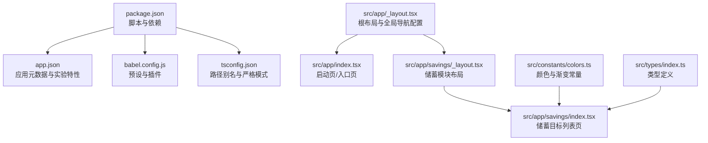
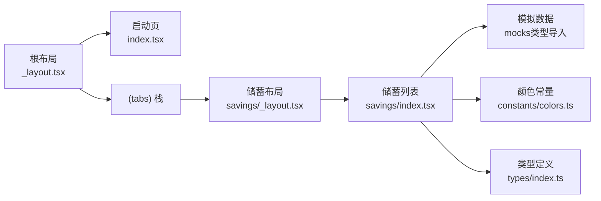
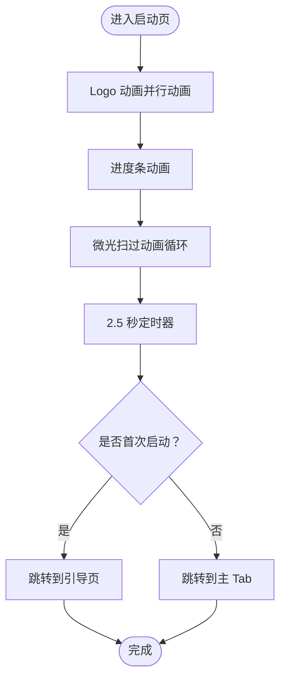
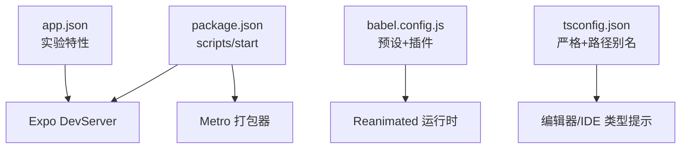

# 调试工具

<cite>
**本文引用的文件**
- [package.json](file://package.json)
- [app.json](file://app.json)
- [babel.config.js](file://babel.config.js)
- [tsconfig.json](file://tsconfig.json)
- [src/app/_layout.tsx](file://src/app/_layout.tsx)
- [src/app/index.tsx](file://src/app/index.tsx)
- [src/app/savings/_layout.tsx](file://src/app/savings/_layout.tsx)
- [src/app/savings/index.tsx](file://src/app/savings/index.tsx)
- [src/constants/colors.ts](file://src/constants/colors.ts)
- [src/types/index.ts](file://src/types/index.ts)
</cite>

## 目录
1. [简介](#简介)
2. [项目结构](#项目结构)
3. [核心组件](#核心组件)
4. [架构总览](#架构总览)
5. [详细组件分析](#详细组件分析)
6. [依赖分析](#依赖分析)
7. [性能考虑](#性能考虑)
8. [故障排查指南](#故障排查指南)
9. [结论](#结论)
10. [附录](#附录)

## 简介
本章节面向“攒钱记账”项目的开发与维护者，系统性介绍调试工具与技巧，覆盖以下主题：
- Expo DevTools 的使用方法与调试功能
- React Native Debugger 的配置与适用场景
- 浏览器开发者工具在移动端调试中的应用
- 日志记录策略与错误监控方案
- 性能分析工具与内存泄漏检测方法
- 常见问题的调试流程与解决方案
- 热重载与实时调试的配置方法

本项目基于 Expo、React Navigation（通过 expo-router）、React Native 与 TypeScript 构建，采用 Metro 打包器与原生驱动动画能力，适合在桌面端与移动端进行统一调试。

## 项目结构
项目采用按功能域划分的目录组织方式，核心入口为根布局与页面路由，样式与类型集中管理，便于定位调试点与复现问题。

图表来源
- [package.json](file://package.json#L1-L43)
- [app.json](file://app.json#L1-L29)
- [babel.config.js](file://babel.config.js#L1-L8)
- [tsconfig.json](file://tsconfig.json#L1-L14)
- [src/app/_layout.tsx](file://src/app/_layout.tsx#L1-L55)
- [src/app/index.tsx](file://src/app/index.tsx#L1-L249)
- [src/app/savings/_layout.tsx](file://src/app/savings/_layout.tsx#L1-L20)
- [src/app/savings/index.tsx](file://src/app/savings/index.tsx#L1-L341)
- [src/constants/colors.ts](file://src/constants/colors.ts#L1-L88)
- [src/types/index.ts](file://src/types/index.ts#L1-L141)

章节来源
- [package.json](file://package.json#L1-L43)
- [app.json](file://app.json#L1-L29)
- [babel.config.js](file://babel.config.js#L1-L8)
- [tsconfig.json](file://tsconfig.json#L1-L14)

## 核心组件
- 根布局与全局导航：负责启动屏控制、字体加载、手势容器与全局栈式导航配置，是调试页面切换、动画与状态栏表现的关键入口。
- 启动页：包含多段动画与定时跳转逻辑，适合验证动画性能、帧率与路由跳转链路。
- 储蓄模块：包含自定义环形进度组件与目标卡片，适合验证复杂渲染、滚动性能与交互反馈。
- 颜色与类型：集中管理主题色值与渐变，便于在调试时快速切换视觉风格与定位样式问题。

章节来源
- [src/app/_layout.tsx](file://src/app/_layout.tsx#L1-L55)
- [src/app/index.tsx](file://src/app/index.tsx#L1-L249)
- [src/app/savings/_layout.tsx](file://src/app/savings/_layout.tsx#L1-L20)
- [src/app/savings/index.tsx](file://src/app/savings/index.tsx#L1-L341)
- [src/constants/colors.ts](file://src/constants/colors.ts#L1-L88)
- [src/types/index.ts](file://src/types/index.ts#L1-L141)

## 架构总览
下图展示从启动页到储蓄模块的导航与数据流关系，有助于定位路由、状态与渲染问题。

图表来源
- [src/app/_layout.tsx](file://src/app/_layout.tsx#L30-L47)
- [src/app/index.tsx](file://src/app/index.tsx#L53-L61)
- [src/app/savings/_layout.tsx](file://src/app/savings/_layout.tsx#L8-L18)
- [src/app/savings/index.tsx](file://src/app/savings/index.tsx#L121-L197)
- [src/constants/colors.ts](file://src/constants/colors.ts#L6-L87)
- [src/types/index.ts](file://src/types/index.ts#L63-L76)

## 详细组件分析

### 启动页动画与路由跳转调试
- 关键点：启动页包含多个 Animated 动画与定时器跳转逻辑，适合验证动画性能、useNativeDriver 使用与路由替换行为。
- 调试建议：
  - 在启动页启用动画性能面板，观察帧率与掉帧。
  - 切换 useNativeDriver 与非原生驱动，对比性能差异。
  - 使用 Expo DevTools 的“网络”与“性能”标签页，检查资源加载与 JS 执行耗时。
  - 在路由跳转前后打印日志，确认条件分支与跳转目标。

图表来源
- [src/app/index.tsx](file://src/app/index.tsx#L21-L64)

章节来源
- [src/app/index.tsx](file://src/app/index.tsx#L1-L249)

### 储蓄目标列表渲染与交互调试
- 关键点：列表渲染、环形进度组件、筛选器与触摸反馈，适合验证滚动性能、自绘组件绘制开销与交互延迟。
- 调试建议：
  - 使用浏览器开发者工具的“性能”面板录制滚动过程，识别卡顿帧。
  - 对环形进度组件进行独立测量，评估三角函数与样式重排成本。
  - 在触摸回调中加入时间戳日志，评估事件响应延迟。
  - 使用颜色常量与渐变配置快速切换主题，辅助视觉回归测试。

图表来源
- [src/app/savings/index.tsx](file://src/app/savings/index.tsx#L121-L197)
- [src/constants/colors.ts](file://src/constants/colors.ts#L78-L85)

章节来源
- [src/app/savings/index.tsx](file://src/app/savings/index.tsx#L1-L341)
- [src/constants/colors.ts](file://src/constants/colors.ts#L1-L88)

### 根布局与全局导航调试
- 关键点：启动屏防隐藏、字体加载、手势容器与全局栈式导航配置，适合验证启动流程与全局样式一致性。
- 调试建议：
  - 在字体加载完成前与完成后分别截图或打点，确保启动屏正确隐藏。
  - 检查手势容器层级，避免手势冲突导致的交互异常。
  - 在全局导航配置中开启调试选项，观察页面切换动画与状态栏样式变化。

章节来源
- [src/app/_layout.tsx](file://src/app/_layout.tsx#L14-L47)

## 依赖分析
- 脚本与启动：通过 npm scripts 启动 Expo DevServer，并支持多平台调试。
- 实验特性：启用新架构与类型化路由，有助于提升性能与类型安全。
- 打包与编译：Metro 作为打包器，Babel 预设与 Reanimated 插件用于运行时优化。
- 严格类型：TypeScript 严格模式与路径别名，便于在大型项目中快速定位类型问题。

图表来源
- [package.json](file://package.json#L5-L10)
- [babel.config.js](file://babel.config.js#L1-L8)
- [tsconfig.json](file://tsconfig.json#L3-L12)
- [app.json](file://app.json#L9-L26)

章节来源
- [package.json](file://package.json#L1-L43)
- [app.json](file://app.json#L1-L29)
- [babel.config.js](file://babel.config.js#L1-L8)
- [tsconfig.json](file://tsconfig.json#L1-L14)

## 性能考虑
- 动画与原生驱动：在启动页中对部分动画使用原生驱动，有助于降低 JS 线程压力；建议对复杂动画逐步迁移至原生驱动，并结合性能面板观察帧率。
- 渲染与滚动：储蓄列表使用自绘环形进度，建议拆分绘制单元、减少每帧计算量；滚动区域可启用虚拟化以降低节点数量。
- 资源与网络：利用 Expo DevTools 的网络面板监控静态资源与接口请求，识别慢请求与重复加载。
- 内存与泄漏：使用浏览器开发者工具的内存快照对比，关注组件卸载后的闭包引用与定时器清理；对动画与订阅对象及时清理。

## 故障排查指南
- 启动屏不消失或闪烁
  - 检查启动屏防隐藏与字体加载完成时机，确保在字体加载成功后再隐藏启动屏。
  - 参考路径：[src/app/_layout.tsx](file://src/app/_layout.tsx#L14-L24)
- 页面跳转异常或路由栈混乱
  - 在路由跳转前后打印日志，核对目标页面与参数传递。
  - 参考路径：[src/app/index.tsx](file://src/app/index.tsx#L53-L61)
- 动画卡顿或掉帧
  - 使用性能面板录制动画过程，优先将可使用原生驱动的动画迁移至原生驱动。
  - 参考路径：[src/app/index.tsx](file://src/app/index.tsx#L23-L50)
- 滚动卡顿
  - 录制滚动性能，检查是否存在每帧大量计算或重排；必要时启用虚拟化或简化子项渲染。
  - 参考路径：[src/app/savings/index.tsx](file://src/app/savings/index.tsx#L171-L195)
- 颜色与主题不一致
  - 统一使用颜色常量与渐变配置，避免硬编码颜色导致的视觉偏差。
  - 参考路径：[src/constants/colors.ts](file://src/constants/colors.ts#L6-L87)
- 类型错误与导入路径问题
  - 检查路径别名与严格类型配置，确保类型推导与导入路径正确。
  - 参考路径：[tsconfig.json](file://tsconfig.json#L7-L12)

章节来源
- [src/app/_layout.tsx](file://src/app/_layout.tsx#L14-L24)
- [src/app/index.tsx](file://src/app/index.tsx#L53-L61)
- [src/app/savings/index.tsx](file://src/app/savings/index.tsx#L171-L195)
- [src/constants/colors.ts](file://src/constants/colors.ts#L6-L87)
- [tsconfig.json](file://tsconfig.json#L7-L12)

## 结论
本项目具备良好的调试基础：严格的类型系统、可追踪的路由与动画逻辑、统一的颜色与类型管理。通过合理运用 Expo DevTools、浏览器开发者工具与性能分析手段，可以高效定位并解决启动、渲染、路由与内存等方面的问题。建议在日常开发中持续关注性能指标与内存占用，建立标准化的日志与监控方案，以保障用户体验与稳定性。

## 附录
- Expo DevTools 快速入口
  - 启动项目后，在终端或浏览器中访问 DevTools，使用“网络”“性能”“状态”“控制台”等标签进行调试。
  - 参考路径：[package.json](file://package.json#L6-L9)
- React Native Debugger
  - 安装后连接 Metro，可在“Elements”“Console”“Sources”中查看组件树、日志与断点调试。
  - 适用于需要更细粒度 JS 调试与断点场景。
- 浏览器开发者工具
  - 在 Web 平台调试时，使用“性能”“内存”“网络”“元素”面板；在移动端可通过 USB 调试或远程调试协议接入。
- 日志与错误监控
  - 在关键流程（启动、路由、渲染）打印结构化日志；对异常进行捕获与上报，结合时间戳与设备信息便于复现。
- 热重载与实时调试
  - 使用 Metro 的热重载与快速刷新；在 app.json 中启用实验特性以获得更好的开发体验。
  - 参考路径：[app.json](file://app.json#L9-L26)