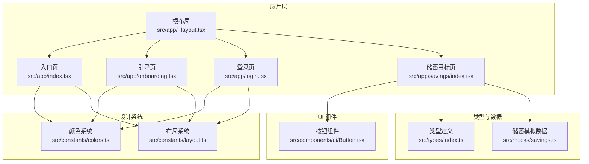
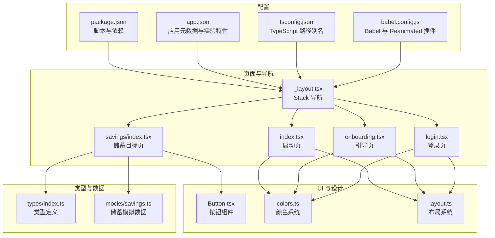
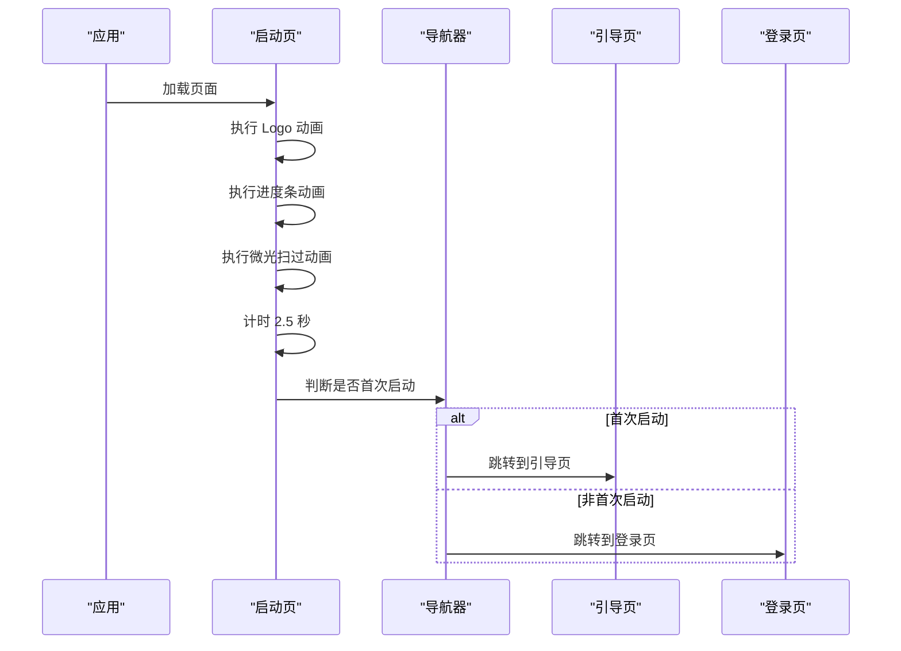
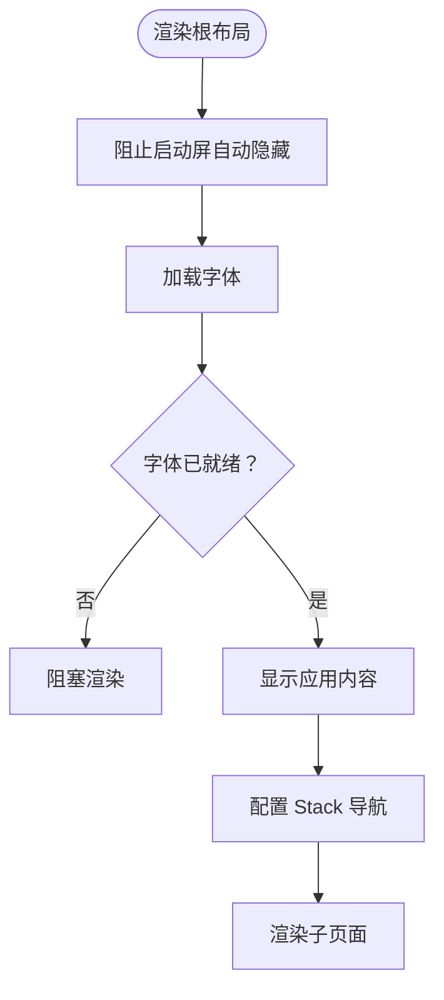
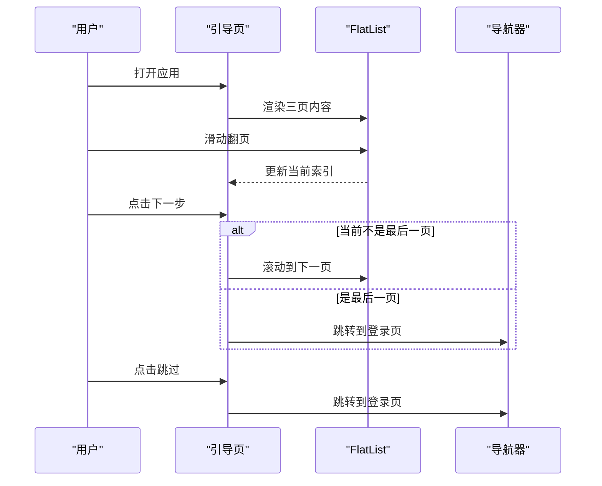
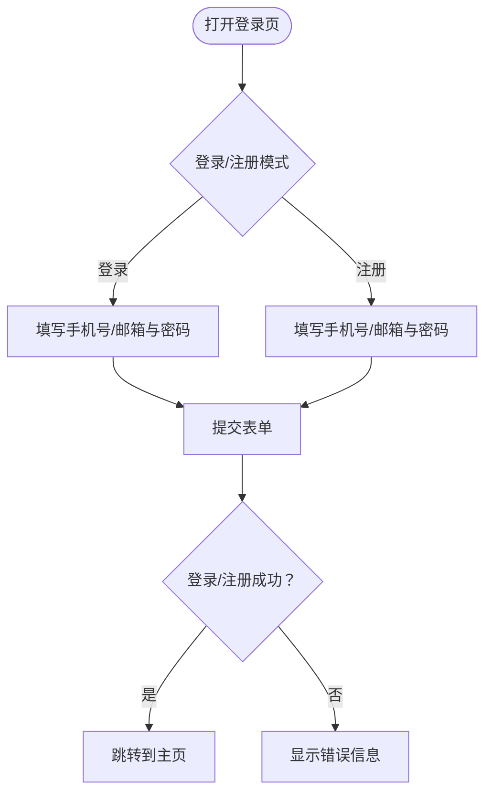
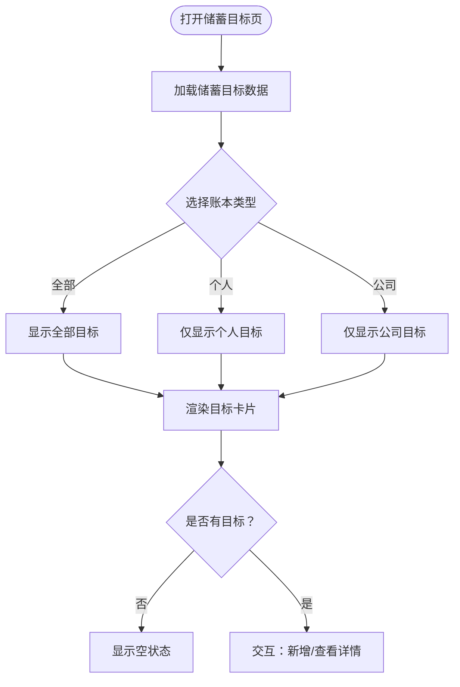
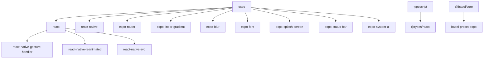

# 快速开始

<cite>
**本文引用的文件**
- [package.json](file://package.json)
- [app.json](file://app.json)
- [tsconfig.json](file://tsconfig.json)
- [babel.config.js](file://babel.config.js)
- [src/app/index.tsx](file://src/app/index.tsx)
- [src/app/_layout.tsx](file://src/app/_layout.tsx)
- [src/app/onboarding.tsx](file://src/app/onboarding.tsx)
- [src/app/login.tsx](file://src/app/login.tsx)
- [src/app/savings/index.tsx](file://src/app/savings/index.tsx)
- [src/components/ui/Button.tsx](file://src/components/ui/Button.tsx)
- [src/constants/colors.ts](file://src/constants/colors.ts)
- [src/constants/layout.ts](file://src/constants/layout.ts)
- [src/types/index.ts](file://src/types/index.ts)
- [src/mocks/savings.ts](file://src/mocks/savings.ts)
</cite>

## 目录
1. [简介](#简介)
2. [项目结构](#项目结构)
3. [核心组件](#核心组件)
4. [架构概览](#架构概览)
5. [详细组件分析](#详细组件分析)
6. [依赖分析](#依赖分析)
7. [性能考虑](#性能考虑)
8. [故障排除指南](#故障排除指南)
9. [结论](#结论)
10. [附录](#附录)

## 简介
本指南面向新开发者，提供从零到运行的完整步骤，帮助你在 Windows、macOS、Linux 上快速搭建并运行「攒钱记账」项目。你将学会：
- 安装 Node.js、Expo CLI 和开发工具
- 克隆项目、安装依赖、首次运行
- 在不同操作系统上的具体命令与注意事项
- 常见环境问题排查与解决方案
- 启动后的验证步骤与基本功能测试

## 项目结构
该项目基于 Expo + React Native + TypeScript 构建，采用 Expo Router 进行页面路由管理。核心目录与职责如下：
- src/app：页面与布局组件，包含启动页、引导页、登录页、主页面等
- src/components/ui：可复用 UI 组件（如按钮）
- src/constants：设计系统（颜色、排版、布局）
- src/types：TypeScript 类型定义
- src/mocks：模拟数据（用于演示功能）
- 根目录配置：package.json、app.json、tsconfig.json、babel.config.js

**图表来源**
- [src/app/index.tsx](file://src/app/index.tsx#L1-L249)
- [src/app/_layout.tsx](file://src/app/_layout.tsx#L1-L61)
- [src/app/onboarding.tsx](file://src/app/onboarding.tsx#L1-L375)
- [src/app/login.tsx](file://src/app/login.tsx#L1-L293)
- [src/app/savings/index.tsx](file://src/app/savings/index.tsx#L1-L341)
- [src/components/ui/Button.tsx](file://src/components/ui/Button.tsx#L1-L204)
- [src/constants/colors.ts](file://src/constants/colors.ts#L1-L88)
- [src/constants/layout.ts](file://src/constants/layout.ts#L1-L182)
- [src/types/index.ts](file://src/types/index.ts#L1-L141)
- [src/mocks/savings.ts](file://src/mocks/savings.ts#L1-L111)

**章节来源**
- [package.json](file://package.json#L1-L43)
- [app.json](file://app.json#L1-L29)
- [tsconfig.json](file://tsconfig.json#L1-L14)
- [babel.config.js](file://babel.config.js#L1-L8)

## 核心组件
- 启动页：负责应用启动动画与首次启动判断，随后跳转至引导页或主页
- 根布局：统一栈式导航、状态栏、手势处理与字体加载
- 引导页：展示产品能力，支持滑动切换与下一步/跳过逻辑
- 登录页：表单输入与第三方登录示例，登录后进入主页
- 储蓄目标页：展示目标列表、筛选与进度可视化

**章节来源**
- [src/app/index.tsx](file://src/app/index.tsx#L1-L249)
- [src/app/_layout.tsx](file://src/app/_layout.tsx#L1-L61)
- [src/app/onboarding.tsx](file://src/app/onboarding.tsx#L1-L375)
- [src/app/login.tsx](file://src/app/login.tsx#L1-L293)
- [src/app/savings/index.tsx](file://src/app/savings/index.tsx#L1-L341)

## 架构概览
应用采用「页面 + 组件 + 设计系统 + 类型与数据」的分层架构，配合 Expo Router 实现页面导航。

**图表来源**
- [package.json](file://package.json#L1-L43)
- [app.json](file://app.json#L1-L29)
- [tsconfig.json](file://tsconfig.json#L1-L14)
- [babel.config.js](file://babel.config.js#L1-L8)
- [src/app/_layout.tsx](file://src/app/_layout.tsx#L1-L61)
- [src/app/index.tsx](file://src/app/index.tsx#L1-L249)
- [src/app/onboarding.tsx](file://src/app/onboarding.tsx#L1-L375)
- [src/app/login.tsx](file://src/app/login.tsx#L1-L293)
- [src/app/savings/index.tsx](file://src/app/savings/index.tsx#L1-L341)
- [src/components/ui/Button.tsx](file://src/components/ui/Button.tsx#L1-L204)
- [src/constants/colors.ts](file://src/constants/colors.ts#L1-L88)
- [src/constants/layout.ts](file://src/constants/layout.ts#L1-L182)
- [src/types/index.ts](file://src/types/index.ts#L1-L141)
- [src/mocks/savings.ts](file://src/mocks/savings.ts#L1-L111)

## 详细组件分析

### 启动页（Splash Page）
启动页负责：
- Logo 与渐变背景动画
- 进度条与微光扫过动画
- 首次启动判断与页面跳转

**图表来源**
- [src/app/index.tsx](file://src/app/index.tsx#L21-L64)
- [src/app/_layout.tsx](file://src/app/_layout.tsx#L33-L51)

**章节来源**
- [src/app/index.tsx](file://src/app/index.tsx#L1-L249)

### 根布局（Root Layout）
根布局负责：
- 防止启动屏自动隐藏
- 字体加载与隐藏启动屏
- Stack 导航配置与全局样式

**图表来源**
- [src/app/_layout.tsx](file://src/app/_layout.tsx#L14-L28)
- [src/app/_layout.tsx](file://src/app/_layout.tsx#L33-L51)

**章节来源**
- [src/app/_layout.tsx](file://src/app/_layout.tsx#L1-L61)

### 引导页（Onboarding）
引导页负责：
- 水平滑动展示产品能力
- 分页指示器动画
- 下一步/跳过逻辑与最终跳转

**图表来源**
- [src/app/onboarding.tsx](file://src/app/onboarding.tsx#L109-L125)
- [src/app/onboarding.tsx](file://src/app/onboarding.tsx#L183-L200)

**章节来源**
- [src/app/onboarding.tsx](file://src/app/onboarding.tsx#L1-L375)

### 登录页（Login）
登录页负责：
- 表单输入（手机号/邮箱、密码）
- 登录/注册模式切换
- 第三方登录示例
- 登录成功后跳转主页

**图表来源**
- [src/app/login.tsx](file://src/app/login.tsx#L46-L60)
- [src/app/login.tsx](file://src/app/login.tsx#L127-L131)

**章节来源**
- [src/app/login.tsx](file://src/app/login.tsx#L1-L293)

### 储蓄目标页（Savings）
储蓄目标页负责：
- 目标列表展示与筛选
- 进度环形图绘制
- 新增目标与查看详情的占位逻辑

**图表来源**
- [src/app/savings/index.tsx](file://src/app/savings/index.tsx#L121-L136)
- [src/app/savings/index.tsx](file://src/app/savings/index.tsx#L177-L191)

**章节来源**
- [src/app/savings/index.tsx](file://src/app/savings/index.tsx#L1-L341)

## 依赖分析
项目使用 Expo 生态与 React Native，关键依赖包括：
- 运行时与框架：expo、react、react-native、expo-router
- UI 与动画：expo-linear-gradient、react-native-gesture-handler、react-native-reanimated、react-native-svg
- 开发工具：typescript、@types/react、@babel/core

**图表来源**
- [package.json](file://package.json#L11-L34)
- [babel.config.js](file://babel.config.js#L1-L8)

**章节来源**
- [package.json](file://package.json#L1-L43)
- [babel.config.js](file://babel.config.js#L1-L8)

## 性能考虑
- 使用原生驱动动画：在启动页与引导页中，部分动画使用原生驱动以提升性能
- 图表与 SVG：使用 react-native-svg 与 react-native-chart-kit，建议在大数据量时进行虚拟化与懒加载
- 字体与启动屏：通过字体加载完成后再隐藏启动屏，避免白屏闪烁
- 导航与手势：在根布局中统一包裹手势处理器，确保复杂交互的流畅性

**章节来源**
- [src/app/index.tsx](file://src/app/index.tsx#L23-L50)
- [src/app/_layout.tsx](file://src/app/_layout.tsx#L14-L24)

## 故障排除指南
常见问题与解决方法：
- 启动后黑屏或白屏
  - 检查字体是否正确加载，确认根布局中字体加载完成再隐藏启动屏
  - 确认启动屏未被提前隐藏
- 动画不流畅
  - 确保使用原生驱动的动画参数正确
  - 减少不必要的重渲染，合理拆分组件
- 导航异常
  - 检查 Stack 导航配置与页面路径
  - 确认页面命名与路由约定一致
- 字体与图标显示异常
  - 确认字体资源与路径配置
  - 检查平台差异（iOS/Android）下的字体支持
- Web 平台兼容性
  - 确认 app.json 中 web 配置正确
  - 检查 Metro bundler 与浏览器缓存

**章节来源**
- [src/app/_layout.tsx](file://src/app/_layout.tsx#L14-L28)
- [src/app/index.tsx](file://src/app/index.tsx#L23-L50)
- [app.json](file://app.json#L17-L20)

## 结论
通过本指南，你可以在本地快速搭建「攒钱记账」项目，并完成首次运行与基础功能验证。建议在开发过程中：
- 保持依赖版本与 Expo 版本同步
- 注重动画与交互的性能优化
- 使用类型系统与设计系统提升一致性
- 在多平台（iOS、Android、Web）上进行充分测试

## 附录

### 环境搭建步骤（Windows/macOS/Linux）
- 安装 Node.js
  - 推荐使用 LTS 版本
  - Windows/macOS：从官网下载安装包
  - Linux：使用包管理器安装或 nvm
- 安装 Expo CLI
  - 使用 npm 全局安装：npm install -g @expo/cli
- 安装开发工具
  - Android：安装 Android Studio 与模拟器或连接真机
  - iOS：安装 Xcode（仅 macOS）
  - Web：无需额外工具，直接运行
- 克隆项目
  - git clone <仓库地址>
  - 进入项目目录
- 安装依赖
  - 使用 npm 安装：npm install
- 首次运行
  - 启动开发服务器：npm run start
  - 选择运行目标：扫描二维码到移动端或在模拟器/浏览器中打开

### 验证步骤与基本功能测试
- 启动页验证：观察启动动画与跳转逻辑
- 引导页验证：滑动翻页、分页指示器、下一步/跳过
- 登录页验证：表单输入、登录/注册切换、第三方登录按钮
- 储蓄目标页验证：目标列表、筛选、空状态、交互占位