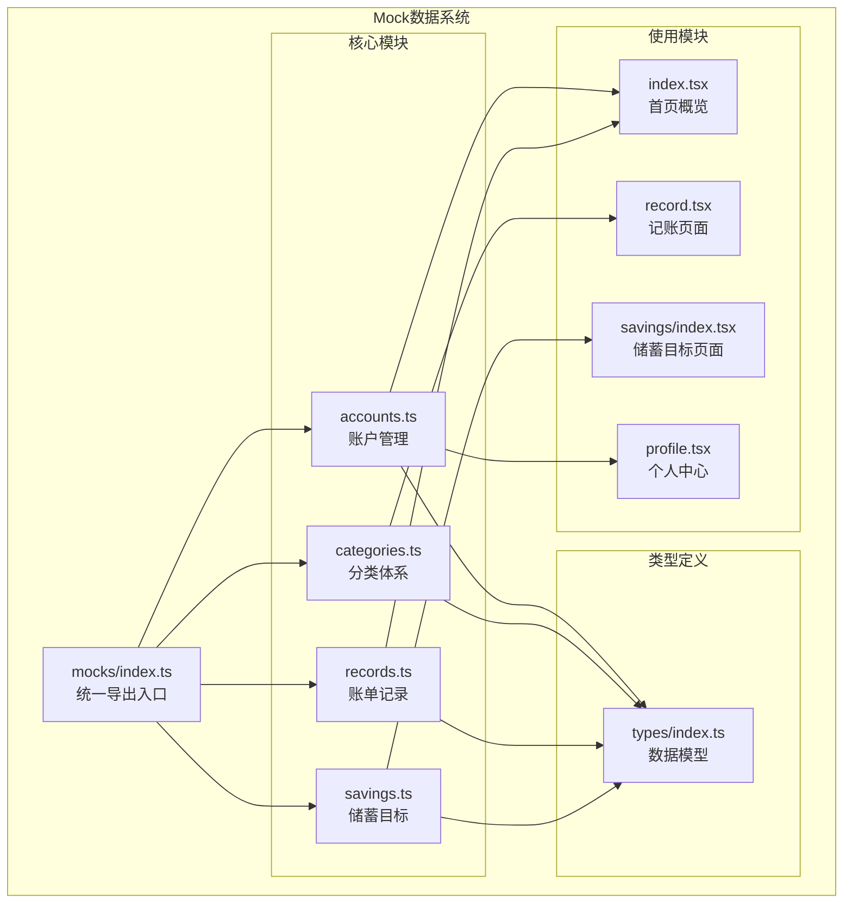
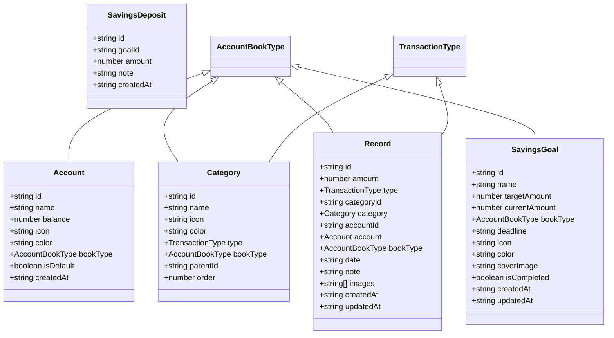
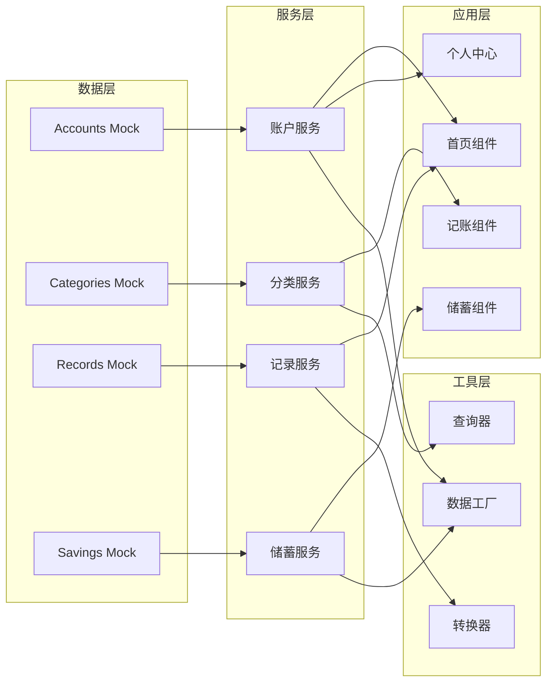
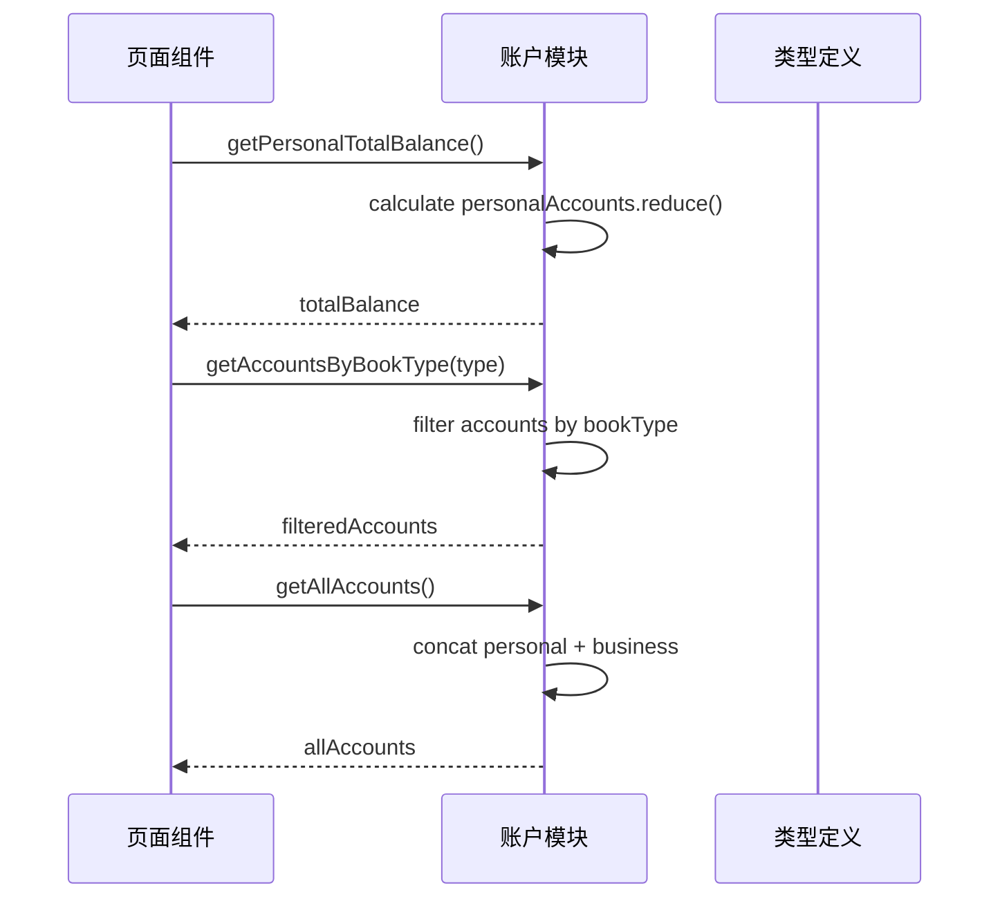
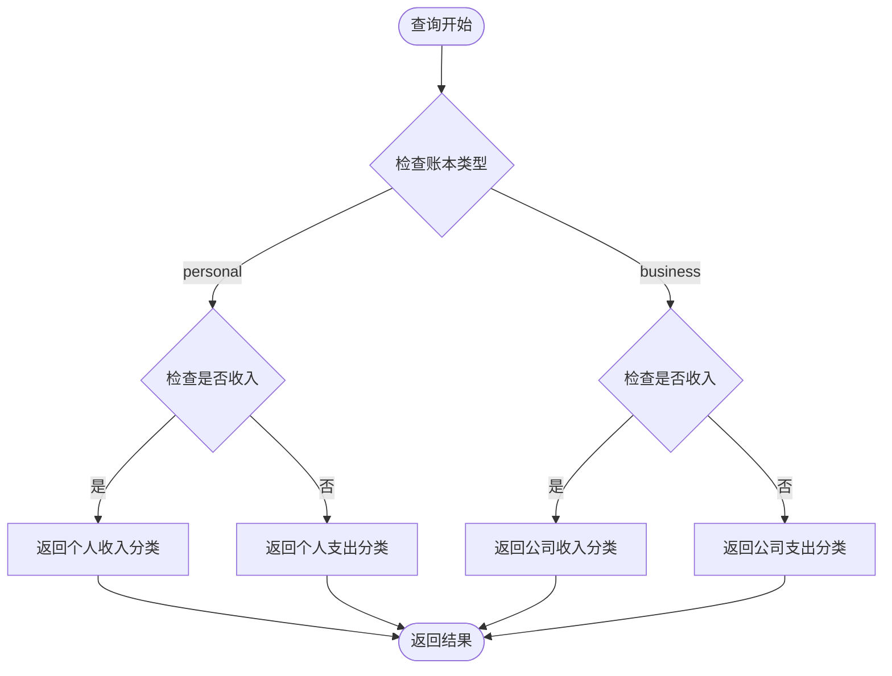
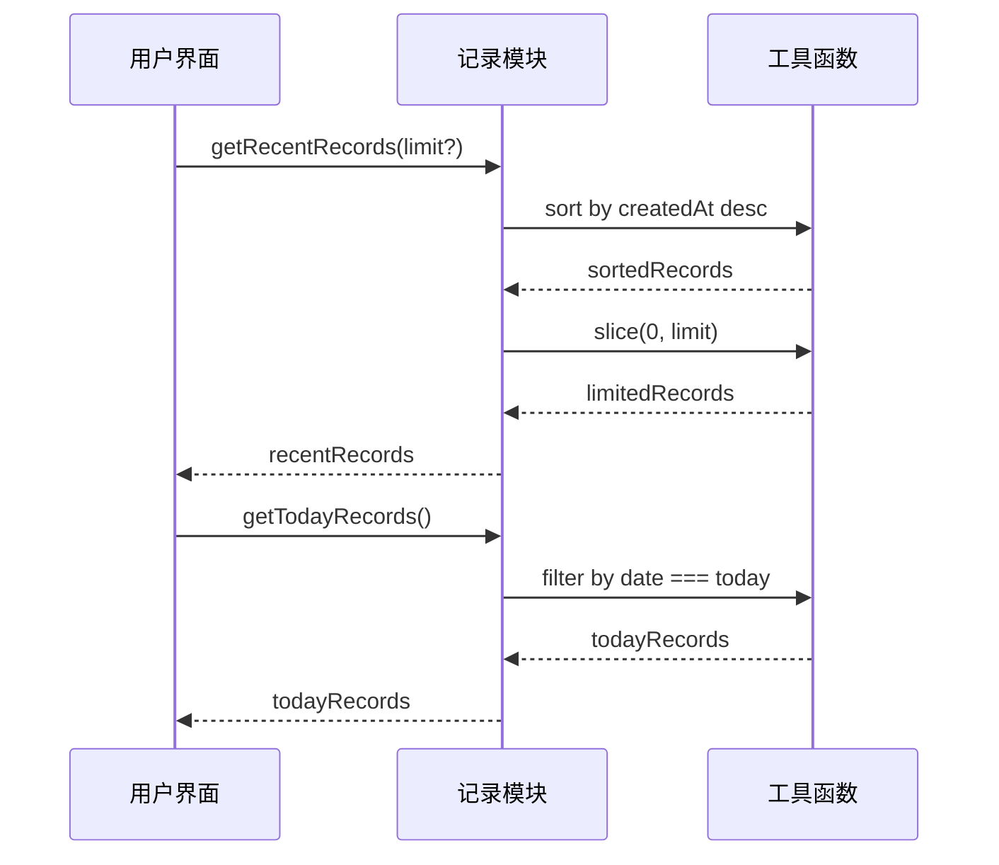
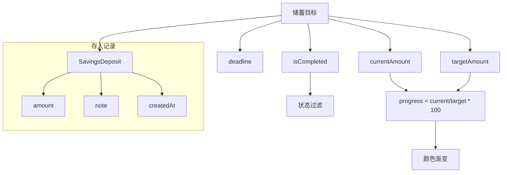
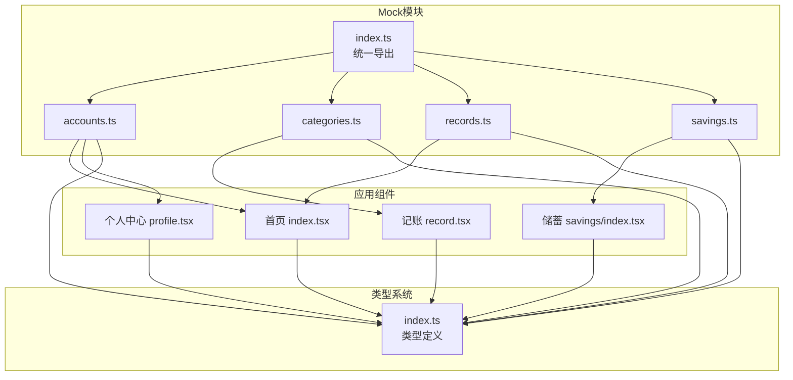

# Mock数据系统

<cite>
**本文档引用的文件**
- [src/mocks/index.ts](file://src/mocks/index.ts)
- [src/mocks/accounts.ts](file://src/mocks/accounts.ts)
- [src/mocks/categories.ts](file://src/mocks/categories.ts)
- [src/mocks/records.ts](file://src/mocks/records.ts)
- [src/mocks/savings.ts](file://src/mocks/savings.ts)
- [src/types/index.ts](file://src/types/index.ts)
- [src/app/(tabs)/index.tsx](file://src/app/(tabs)/index.tsx)
- [src/app/(tabs)/profile.tsx](file://src/app/(tabs)/profile.tsx)
- [src/app/(tabs)/record.tsx](file://src/app/(tabs)/record.tsx)
- [src/app/savings/index.tsx](file://src/app/savings/index.tsx)
- [package.json](file://package.json)
</cite>

## 目录
1. [简介](#简介)
2. [项目结构](#项目结构)
3. [核心组件](#核心组件)
4. [架构概览](#架构概览)
5. [详细组件分析](#详细组件分析)
6. [依赖关系分析](#依赖关系分析)
7. [性能考虑](#性能考虑)
8. [故障排除指南](#故障排除指南)
9. [结论](#结论)
10. [附录](#附录)

## 简介

Mock数据系统是"攒钱记账"应用的核心基础设施，为开发测试环境提供完整的数据模拟支持。该系统通过精心设计的Mock数据结构和业务逻辑，实现了从账户管理、分类体系、账单记录到储蓄目标的完整财务管理系统模拟。

系统采用模块化的Mock架构，每个功能模块都有独立的数据源和业务逻辑处理函数，确保了代码的可维护性和可扩展性。Mock数据不仅用于界面展示，还承担着数据初始化、CRUD操作演示和状态管理验证的重要角色。

## 项目结构

Mock数据系统位于`src/mocks`目录下，采用按功能模块划分的组织方式：

**图表来源**
- [src/mocks/index.ts](file://src/mocks/index.ts#L1-L9)
- [src/mocks/accounts.ts](file://src/mocks/accounts.ts#L1-L91)
- [src/mocks/categories.ts](file://src/mocks/categories.ts#L1-L69)
- [src/mocks/records.ts](file://src/mocks/records.ts#L1-L117)
- [src/mocks/savings.ts](file://src/mocks/savings.ts#L1-L111)

**章节来源**
- [src/mocks/index.ts](file://src/mocks/index.ts#L1-L9)
- [src/mocks/accounts.ts](file://src/mocks/accounts.ts#L1-L91)
- [src/mocks/categories.ts](file://src/mocks/categories.ts#L1-L69)
- [src/mocks/records.ts](file://src/mocks/records.ts#L1-L117)
- [src/mocks/savings.ts](file://src/mocks/savings.ts#L1-L111)

## 核心组件

### 数据类型系统

系统基于清晰的类型定义构建，确保Mock数据的一致性和完整性：

**图表来源**
- [src/types/index.ts](file://src/types/index.ts#L21-L85)

### Mock数据模块

每个Mock模块都提供了完整的数据结构和业务逻辑函数：

**账户模块**：管理个人和公司账户，提供余额计算和分类查询功能
**分类模块**：维护收支分类体系，支持按账本类型和交易类型过滤
**记录模块**：模拟账单记录，提供时间范围查询和分类关联
**储蓄模块**：管理储蓄目标和存入记录，支持进度跟踪和状态管理

**章节来源**
- [src/types/index.ts](file://src/types/index.ts#L1-L141)

## 架构概览

Mock数据系统采用"模块化+统一导出"的设计模式，实现了高内聚低耦合的架构：

**图表来源**
- [src/mocks/accounts.ts](file://src/mocks/accounts.ts#L71-L91)
- [src/mocks/categories.ts](file://src/mocks/categories.ts#L51-L69)
- [src/mocks/records.ts](file://src/mocks/records.ts#L100-L117)
- [src/mocks/savings.ts](file://src/mocks/savings.ts#L94-L111)

## 详细组件分析

### 账户管理模块 (Accounts)

账户管理模块提供了完整的账户生命周期管理：

#### 数据结构设计
- **个人账户**：现金、银行卡、支付宝、微信等常用支付方式
- **公司账户**：备用金、公司卡等企业资金管理
- **默认账户**：每个类型都有默认账户标识
- **余额管理**：实时余额计算和更新

#### 核心功能实现

**图表来源**
- [src/mocks/accounts.ts](file://src/mocks/accounts.ts#L71-L91)

#### 业务逻辑特点
- 支持个人和公司两种账本类型
- 提供资产总额计算功能
- 实现账户分类查询机制
- 包含默认账户标识管理

**章节来源**
- [src/mocks/accounts.ts](file://src/mocks/accounts.ts#L1-L91)

### 分类体系模块 (Categories)

分类体系模块建立了完整的收支分类标准：

#### 分类层次结构
- **个人账本**：餐饮、交通、购物、娱乐、医疗等20+分类
- **公司账本**：办公用品、差旅、招待餐饮、交通费用等7+分类
- **收支类型**：明确区分收入和支出两类
- **视觉标识**：每个分类都有对应的图标和颜色

#### 查询优化策略

**图表来源**
- [src/mocks/categories.ts](file://src/mocks/categories.ts#L59-L69)

**章节来源**
- [src/mocks/categories.ts](file://src/mocks/categories.ts#L1-L69)

### 账单记录模块 (Records)

账单记录模块模拟真实的财务交易场景：

#### 数据关系设计
- **一对一关联**：每条记录关联一个分类和账户
- **时间维度**：支持按日期和创建时间查询
- **账本分离**：个人和公司账本完全隔离
- **状态管理**：记录创建和更新时间戳

#### 查询功能实现

**图表来源**
- [src/mocks/records.ts](file://src/mocks/records.ts#L100-L117)

**章节来源**
- [src/mocks/records.ts](file://src/mocks/records.ts#L1-L117)

### 储蓄目标模块 (Savings)

储蓄目标模块提供完整的储蓄规划功能：

#### 目标管理机制
- **进度跟踪**：实时计算完成百分比
- **时间管理**：支持截止日期设置
- **状态控制**：完成状态标记和管理
- **存入记录**：详细的资金存入历史

#### 数据完整性保证

**图表来源**
- [src/mocks/savings.ts](file://src/mocks/savings.ts#L8-L111)

**章节来源**
- [src/mocks/savings.ts](file://src/mocks/savings.ts#L1-L111)

## 依赖关系分析

Mock数据系统与应用组件的集成关系：

**图表来源**
- [src/mocks/index.ts](file://src/mocks/index.ts#L1-L9)
- [src/types/index.ts](file://src/types/index.ts#L1-L141)

### 使用模式分析

各组件对Mock数据的使用遵循统一的模式：

**首页组件**：使用账户余额计算和最近记录查询
**个人中心**：展示总资产概览
**记账组件**：动态加载分类数据
**储蓄组件**：管理储蓄目标和进度

**章节来源**
- [src/app/(tabs)/index.tsx](file://src/app/(tabs)/index.tsx#L22-L27)
- [src/app/(tabs)/profile.tsx](file://src/app/(tabs)/profile.tsx#L19-L19)
- [src/app/(tabs)/record.tsx](file://src/app/(tabs)/record.tsx#L23-L23)
- [src/app/savings/index.tsx](file://src/app/savings/index.tsx#L21-L21)

## 性能考虑

### 数据访问优化

Mock数据系统在性能方面采用了多项优化策略：

1. **延迟加载**：分类和账户数据通过函数调用时才进行计算
2. **缓存机制**：重复使用的数据通过变量缓存避免重复计算
3. **过滤优化**：使用高效的数组过滤和映射操作
4. **内存管理**：合理的数据结构设计减少内存占用

### 查询性能分析

| 查询类型 | 时间复杂度 | 优化策略 |
|---------|-----------|----------|
| 账户余额计算 | O(n) | 单次reduce操作 |
| 分类查询 | O(n) | 条件过滤 |
| 记录查询 | O(n) | 数组遍历 |
| 储蓄目标查询 | O(n) | 状态过滤 |

### 扩展性考虑

系统设计充分考虑了未来的扩展需求：
- 支持新的账本类型
- 易于添加新的分类
- 可扩展的查询接口
- 灵活的数据结构

## 故障排除指南

### 常见问题及解决方案

#### 数据不一致问题
**症状**：分类和账户数据不匹配
**原因**：外键关联数据不一致
**解决**：检查categoryId和accountId的对应关系

#### 查询性能问题
**症状**：大量数据查询响应缓慢
**原因**：全量数据扫描
**解决**：实现索引机制或分页查询

#### 类型不匹配问题
**症状**：编译错误或运行时类型错误
**原因**：Mock数据与类型定义不匹配
**解决**：同步更新类型定义和Mock数据

### 调试技巧

1. **数据验证**：定期检查数据完整性
2. **边界测试**：测试极端数据情况
3. **性能监控**：监控查询性能指标
4. **日志记录**：记录关键操作过程

**章节来源**
- [src/mocks/accounts.ts](file://src/mocks/accounts.ts#L1-L91)
- [src/mocks/categories.ts](file://src/mocks/categories.ts#L1-L69)
- [src/mocks/records.ts](file://src/mocks/records.ts#L1-L117)
- [src/mocks/savings.ts](file://src/mocks/savings.ts#L1-L111)

## 结论

Mock数据系统为"攒钱记账"应用提供了完整的开发测试基础设施。通过精心设计的数据结构和业务逻辑，系统成功模拟了真实的财务管理系统，为开发者提供了可靠的测试环境。

系统的主要优势包括：
- **模块化设计**：清晰的功能分离便于维护
- **类型安全**：严格的类型定义确保数据一致性
- **易于扩展**：灵活的架构支持功能扩展
- **性能优化**：合理的查询策略保证运行效率

未来可以进一步完善的方向包括：实现更复杂的业务逻辑、添加数据持久化支持、增强测试覆盖率等。

## 附录

### 版本管理策略

建议采用以下版本管理策略：
- **语义化版本**：遵循MAJOR.MINOR.PATCH规则
- **变更日志**：详细记录每次修改的内容
- **兼容性保证**：确保向后兼容性
- **发布流程**：标准化的发布和回滚流程

### 迁移策略

从Mock数据迁移到真实数据库的策略：
- **数据映射**：建立Mock数据到真实数据的映射关系
- **渐进式迁移**：分阶段替换Mock数据
- **数据校验**：确保数据迁移的准确性
- **回滚准备**：制定数据迁移失败的回滚方案

### 最佳实践

1. **单元测试**：为每个Mock函数编写单元测试
2. **集成测试**：测试Mock数据与组件的集成
3. **性能测试**：评估Mock数据的性能表现
4. **文档维护**：保持Mock数据文档的及时更新