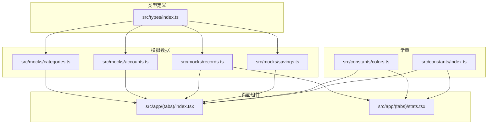
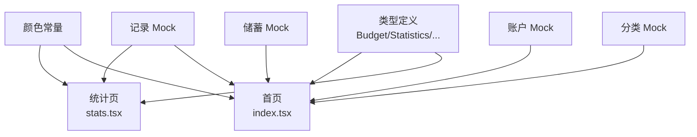
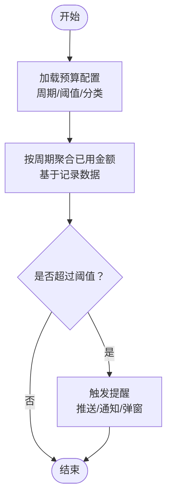
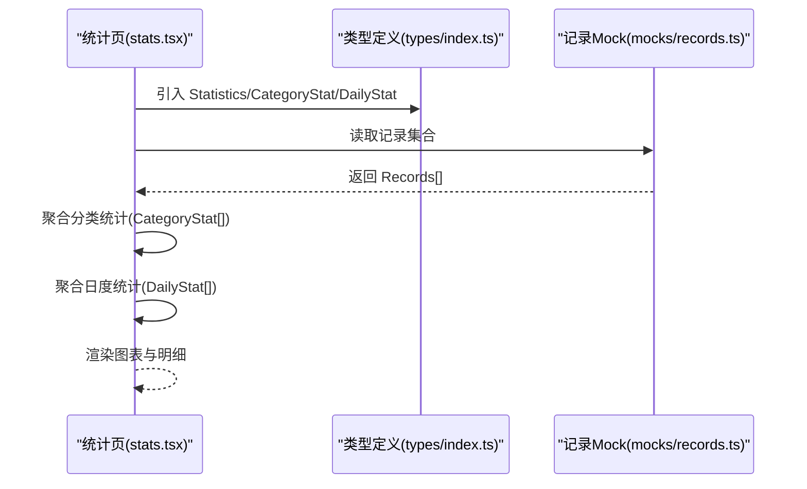
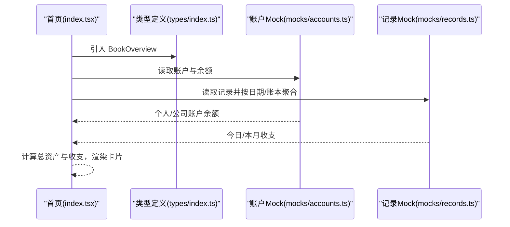
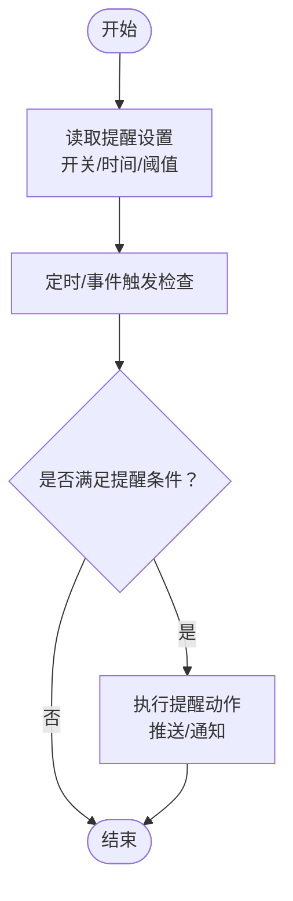
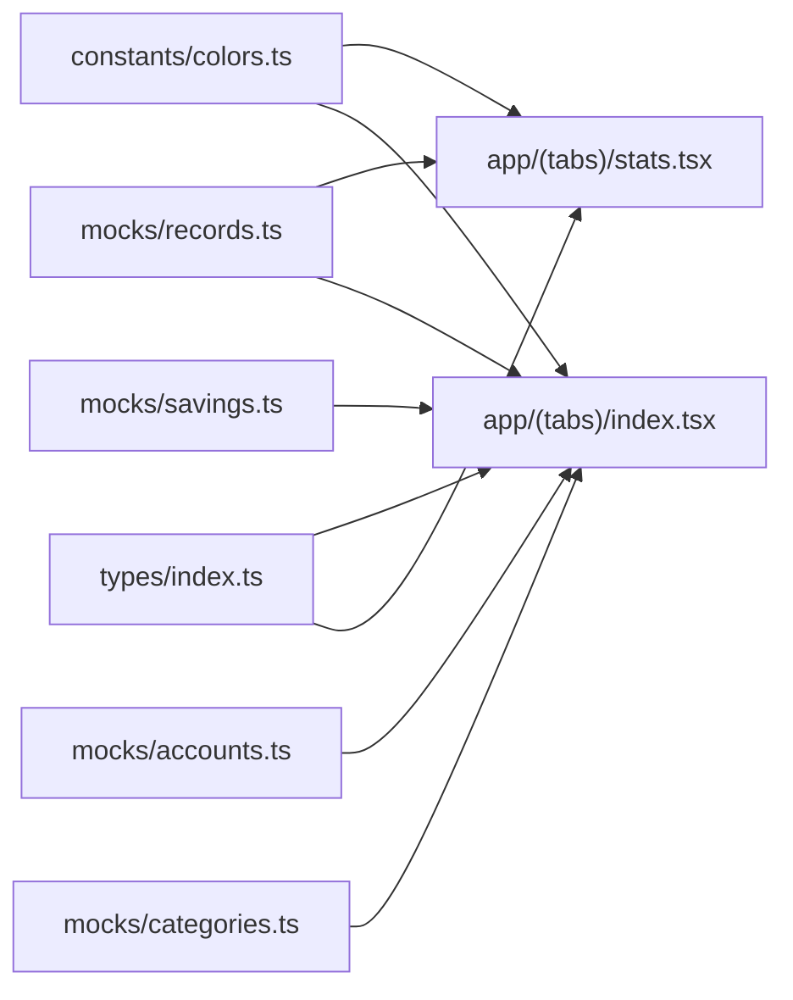

# 支撑实体模型

<cite>
**本文引用的文件**
- [src/types/index.ts](file://src/types/index.ts)
- [src/mocks/categories.ts](file://src/mocks/categories.ts)
- [src/mocks/accounts.ts](file://src/mocks/accounts.ts)
- [src/mocks/records.ts](file://src/mocks/records.ts)
- [src/mocks/savings.ts](file://src/mocks/savings.ts)
- [src/app/(tabs)/stats.tsx](file://src/app/(tabs)/stats.tsx)
- [src/app/(tabs)/index.tsx](file://src/app/(tabs)/index.tsx)
- [src/constants/colors.ts](file://src/constants/colors.ts)
- [src/constants/index.ts](file://src/constants/index.ts)
</cite>

## 目录
1. [简介](#简介)
2. [项目结构](#项目结构)
3. [核心组件](#核心组件)
4. [架构总览](#架构总览)
5. [详细组件分析](#详细组件分析)
6. [依赖分析](#依赖分析)
7. [性能考虑](#性能考虑)
8. [故障排查指南](#故障排查指南)
9. [结论](#结论)
10. [附录](#附录)

## 简介
本文件聚焦于支撑实体模型，系统性梳理并说明以下数据实体的设计与用途：
- 预算（Budget）：支持周期性预算与阈值提醒，用于控制与预警支出。
- 统计数据（Statistics、CategoryStat、DailyStat）：为财务分析与报表生成提供基础数据。
- 账本总览（BookOverview）：为仪表板展示提供关键指标聚合。
- 提醒设置（ReminderSettings）：配置账单、储蓄与预算提醒的时间与阈值。

同时，结合项目中的图表组件与首页/统计页的实际使用场景，说明这些实体在业务逻辑中的应用方式与数据流转。

## 项目结构
该仓库采用按功能模块组织的前端结构，类型定义集中在统一的类型文件中，Mock 数据用于演示与测试，页面组件负责消费这些数据并渲染可视化内容。

**图表来源**
- [src/types/index.ts](file://src/types/index.ts#L87-L140)
- [src/mocks/categories.ts](file://src/mocks/categories.ts#L1-L69)
- [src/mocks/accounts.ts](file://src/mocks/accounts.ts#L1-L91)
- [src/mocks/records.ts](file://src/mocks/records.ts#L1-L117)
- [src/mocks/savings.ts](file://src/mocks/savings.ts#L1-L111)
- [src/app/(tabs)/index.tsx](file://src/app/(tabs)/index.tsx#L1-L564)
- [src/app/(tabs)/stats.tsx](file://src/app/(tabs)/stats.tsx#L1-L535)
- [src/constants/colors.ts](file://src/constants/colors.ts#L1-L88)
- [src/constants/index.ts](file://src/constants/index.ts#L1-L12)

**章节来源**
- [src/types/index.ts](file://src/types/index.ts#L87-L140)
- [src/mocks/categories.ts](file://src/mocks/categories.ts#L1-L69)
- [src/mocks/accounts.ts](file://src/mocks/accounts.ts#L1-L91)
- [src/mocks/records.ts](file://src/mocks/records.ts#L1-L117)
- [src/mocks/savings.ts](file://src/mocks/savings.ts#L1-L111)
- [src/app/(tabs)/index.tsx](file://src/app/(tabs)/index.tsx#L1-L564)
- [src/app/(tabs)/stats.tsx](file://src/app/(tabs)/stats.tsx#L1-L535)
- [src/constants/colors.ts](file://src/constants/colors.ts#L1-L88)
- [src/constants/index.ts](file://src/constants/index.ts#L1-L12)

## 核心组件
本节对 Budget、Statistics、CategoryStat、DailyStat、BookOverview、ReminderSettings 的字段含义、取值范围与典型用途进行说明，并给出在业务中的常见使用场景。

- 预算（Budget）
  - 字段要点：预算 ID、关联分类（可选）、预算总额、已用金额、周期（月/周/年）、账本类型、阈值提醒比例（可选）、是否启用提醒。
  - 用途：限定某分类或全账本在特定周期内的支出上限；当已用金额达到阈值时触发提醒。
  - 场景：月度餐饮预算、每周交通预算、年度大额支出预算等。

- 统计数据（Statistics）
  - 字段要点：总收入、总支出、余额、分类统计数组、日度收支数组。
  - 用途：驱动财务报表与仪表板的关键指标与图表数据源。

- 分类统计（CategoryStat）
  - 字段要点：分类 ID、分类信息（可选）、该分类总金额、占总支出的比例、记录笔数。
  - 用途：生成分类占比饼图、分类明细列表与排行榜。

- 日度统计（DailyStat）
  - 字段要点：日期、当日收入、当日支出。
  - 用途：生成每日收支对比柱状图与趋势分析。

- 账本总览（BookOverview）
  - 字段要点：账本类型、总资产、今日收入、今日支出、本月收入、本月支出。
  - 用途：首页仪表板快速概览，支持个人与公司账本双视图切换。

- 提醒设置（ReminderSettings）
  - 字段要点：账单提醒开关与时间、储蓄提醒开关与时间、预算提醒开关与阈值。
  - 用途：配置用户偏好，决定何时以何种方式提醒。

**章节来源**
- [src/types/index.ts](file://src/types/index.ts#L87-L140)

## 架构总览
下图展示了从类型定义到页面消费的整体关系，以及 Mock 数据与页面组件之间的耦合点。

**图表来源**
- [src/types/index.ts](file://src/types/index.ts#L87-L140)
- [src/mocks/categories.ts](file://src/mocks/categories.ts#L1-L69)
- [src/mocks/accounts.ts](file://src/mocks/accounts.ts#L1-L91)
- [src/mocks/records.ts](file://src/mocks/records.ts#L1-L117)
- [src/mocks/savings.ts](file://src/mocks/savings.ts#L1-L111)
- [src/app/(tabs)/index.tsx](file://src/app/(tabs)/index.tsx#L1-L564)
- [src/app/(tabs)/stats.tsx](file://src/app/(tabs)/stats.tsx#L1-L535)
- [src/constants/colors.ts](file://src/constants/colors.ts#L1-L88)

## 详细组件分析

### 预算实体（Budget）
- 设计要点
  - 周期性：支持 monthly、weekly、yearly，便于按不同粒度控制预算。
  - 阈值提醒：通过阈值比例与开关组合，实现接近预算上限时的预警。
  - 关联维度：可按分类或全账本生效，满足精细化管理需求。
- 使用场景
  - 月度预算：在月初设定总额，按日跟踪已用金额，临近阈值推送提醒。
  - 分类预算：针对餐饮、交通等高波动分类单独设限，避免超支。
- 触发机制（概念流程）
  - 计算已用金额与阈值比较，若超过阈值则触发提醒（如弹窗、通知）。
  - 可结合账单记录的日期与分类维度进行聚合统计。

**章节来源**
- [src/types/index.ts](file://src/types/index.ts#L87-L97)

### 统计数据实体（Statistics、CategoryStat、DailyStat）
- 设计要点
  - Statistics 作为聚合入口，包含总收支、余额与两类明细统计。
  - CategoryStat 提供分类维度的金额、占比与频次，支撑饼图与明细列表。
  - DailyStat 提供日维度的收支，支撑折线/柱状图与趋势分析。
- 页面应用
  - 统计页（stats.tsx）通过 Mock 数据渲染分类占比饼图、每日收支对比柱状图与分类明细。
  - 首页（index.tsx）使用 Mock 数据展示资产卡片与最近记录，间接体现统计口径。

**图表来源**
- [src/app/(tabs)/stats.tsx](file://src/app/(tabs)/stats.tsx#L1-L535)
- [src/types/index.ts](file://src/types/index.ts#L99-L120)
- [src/mocks/records.ts](file://src/mocks/records.ts#L1-L117)

**章节来源**
- [src/types/index.ts](file://src/types/index.ts#L99-L120)
- [src/app/(tabs)/stats.tsx](file://src/app/(tabs)/stats.tsx#L1-L535)
- [src/mocks/records.ts](file://src/mocks/records.ts#L1-L117)

### 账本总览实体（BookOverview）
- 设计要点
  - 聚合资产与收支：总资产、今日/本月收入与支出，支持个人与公司账本双视图。
  - 首页仪表板：用于快速概览当前财务状况，辅助决策与记账行为。
- 页面应用
  - 首页（index.tsx）通过 Mock 数据计算总资产并展示，结合颜色常量与卡片组件美化呈现。

**图表来源**
- [src/app/(tabs)/index.tsx](file://src/app/(tabs)/index.tsx#L1-L564)
- [src/types/index.ts](file://src/types/index.ts#L122-L130)
- [src/mocks/accounts.ts](file://src/mocks/accounts.ts#L1-L91)
- [src/mocks/records.ts](file://src/mocks/records.ts#L1-L117)

**章节来源**
- [src/types/index.ts](file://src/types/index.ts#L122-L130)
- [src/app/(tabs)/index.tsx](file://src/app/(tabs)/index.tsx#L1-L564)
- [src/mocks/accounts.ts](file://src/mocks/accounts.ts#L1-L91)
- [src/mocks/records.ts](file://src/mocks/records.ts#L1-L117)

### 提醒设置实体（ReminderSettings）
- 设计要点
  - 开关与时间：账单提醒、储蓄提醒、预算提醒分别可独立开启并设置提醒时间。
  - 阈值：预算提醒可配置阈值，配合 Budget 实体使用。
- 使用场景
  - 固定时间推送：如每日固定时间推送“今日账单”提醒。
  - 预算接近阈值提醒：根据 Budget 的阈值与实际使用情况触发。
- 触发机制（概念流程）
  - 定时任务或应用生命周期事件触发检查；
  - 对比当前状态与阈值，若满足条件则执行提醒动作。

**章节来源**
- [src/types/index.ts](file://src/types/index.ts#L132-L140)

## 依赖分析
- 类型与 Mock 的耦合
  - 类型定义集中于 types/index.ts，被各 Mock 文件与页面组件引用，形成稳定的契约层。
  - 页面组件（stats.tsx、index.tsx）通过导入 Mock 数据与类型，实现数据驱动的可视化。
- 常量与样式
  - colors.ts 提供主题色与渐变，被页面组件用于卡片、图表与状态指示的颜色映射。
- 依赖关系可视化

**图表来源**
- [src/types/index.ts](file://src/types/index.ts#L1-L141)
- [src/mocks/categories.ts](file://src/mocks/categories.ts#L1-L69)
- [src/mocks/accounts.ts](file://src/mocks/accounts.ts#L1-L91)
- [src/mocks/records.ts](file://src/mocks/records.ts#L1-L117)
- [src/mocks/savings.ts](file://src/mocks/savings.ts#L1-L111)
- [src/app/(tabs)/stats.tsx](file://src/app/(tabs)/stats.tsx#L1-L535)
- [src/app/(tabs)/index.tsx](file://src/app/(tabs)/index.tsx#L1-L564)
- [src/constants/colors.ts](file://src/constants/colors.ts#L1-L88)

**章节来源**
- [src/types/index.ts](file://src/types/index.ts#L1-L141)
- [src/mocks/categories.ts](file://src/mocks/categories.ts#L1-L69)
- [src/mocks/accounts.ts](file://src/mocks/accounts.ts#L1-L91)
- [src/mocks/records.ts](file://src/mocks/records.ts#L1-L117)
- [src/mocks/savings.ts](file://src/mocks/savings.ts#L1-L111)
- [src/app/(tabs)/stats.tsx](file://src/app/(tabs)/stats.tsx#L1-L535)
- [src/app/(tabs)/index.tsx](file://src/app/(tabs)/index.tsx#L1-L564)
- [src/constants/colors.ts](file://src/constants/colors.ts#L1-L88)

## 性能考虑
- 数据聚合复杂度
  - 分类统计与日度统计建议在客户端按需聚合，避免重复计算；对于大量记录，可考虑分页或缓存策略。
- 图表渲染优化
  - 饼图与柱状图组件应避免不必要的重渲染，可通过浅比较与 memo 化减少开销。
- 颜色与主题
  - 使用统一的颜色常量可减少样式计算与切换成本，提升渲染一致性。

## 故障排查指南
- 预算提醒不生效
  - 检查 Budget 的阈值与开关是否正确配置；确认已用金额聚合逻辑覆盖了当前周期与分类。
- 统计数据异常
  - 核对 Records 的日期与账本类型过滤是否正确；确保聚合函数对空值与边界值进行了处理。
- 仪表板显示错误
  - 检查 Accounts 的余额汇总与 Records 的收支计算是否一致；确认首页筛选器（个人/公司）与聚合口径匹配。
- 提醒设置未触发
  - 确认 ReminderSettings 的时间与阈值配置；检查触发检查逻辑是否在预期时机执行。

## 结论
本文围绕 Budget、Statistics、CategoryStat、DailyStat、BookOverview、ReminderSettings 六类实体，从结构设计、业务用途、页面应用与依赖关系等方面进行了系统化说明。通过 Mock 数据与页面组件的配合，这些实体共同支撑起预算控制、财务分析与仪表板展示的核心能力。后续可在真实数据接入、提醒触发机制与性能优化方面进一步完善。

## 附录
- 术语说明
  - 账本类型：personal（个人）、business（公司），用于区分数据域与权限。
  - 周期：monthly（月）、weekly（周）、yearly（年），用于预算与统计的时间粒度。
- 参考路径
  - 类型定义：[src/types/index.ts](file://src/types/index.ts#L87-L140)
  - 统计页：[src/app/(tabs)/stats.tsx](file://src/app/(tabs)/stats.tsx#L1-L535)
  - 首页：[src/app/(tabs)/index.tsx](file://src/app/(tabs)/index.tsx#L1-L564)
  - 颜色常量：[src/constants/colors.ts](file://src/constants/colors.ts#L1-L88)