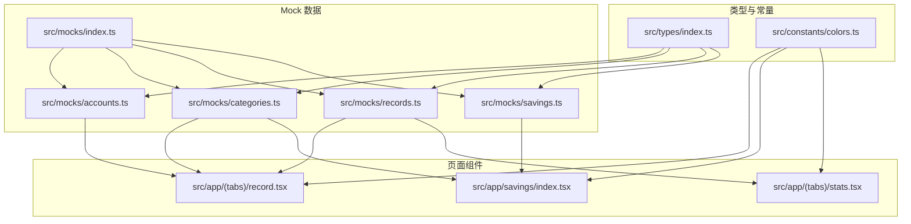
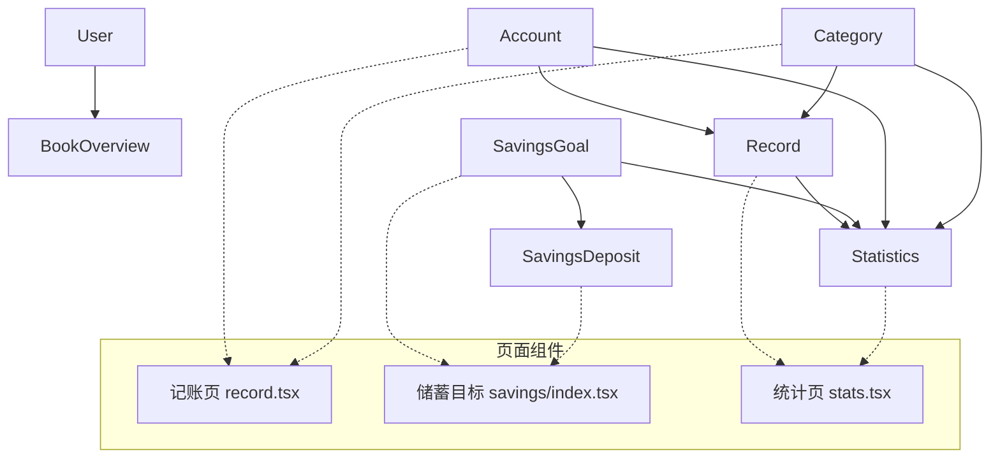
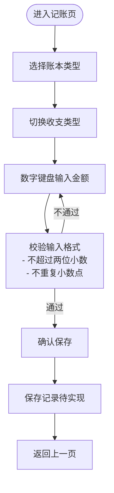
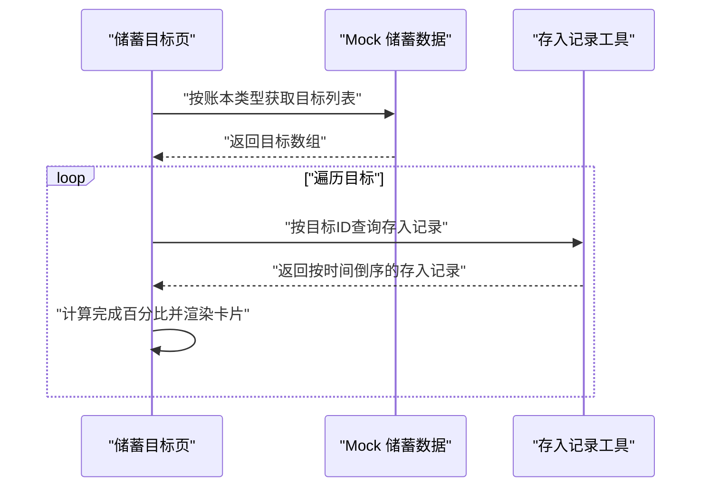
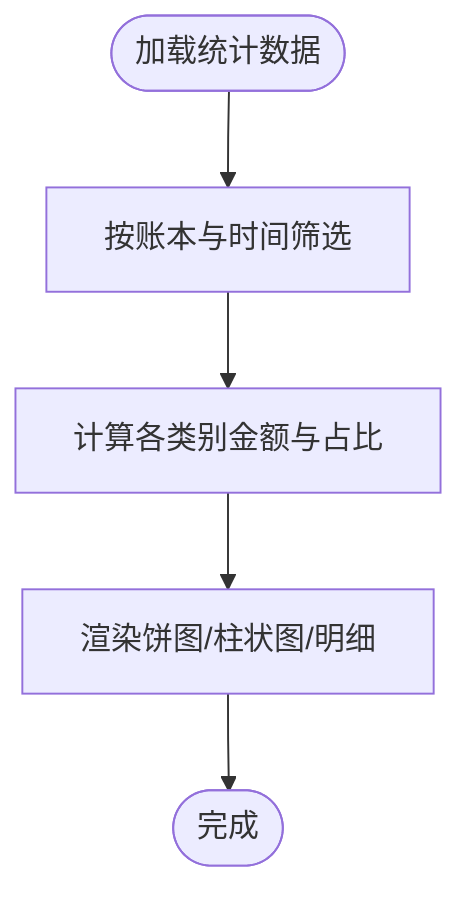
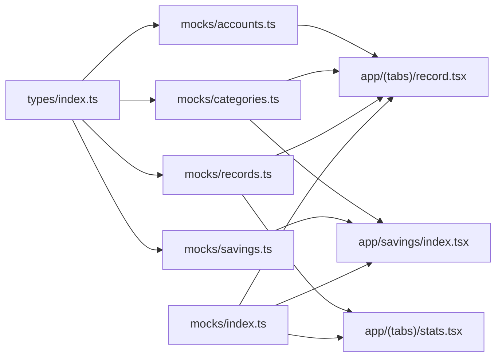

# 数据模型

<cite>
**本文引用的文件**
- [src/types/index.ts](file://src/types/index.ts)
- [src/mocks/index.ts](file://src/mocks/index.ts)
- [src/mocks/accounts.ts](file://src/mocks/accounts.ts)
- [src/mocks/categories.ts](file://src/mocks/categories.ts)
- [src/mocks/records.ts](file://src/mocks/records.ts)
- [src/mocks/savings.ts](file://src/mocks/savings.ts)
- [src/app/(tabs)/record.tsx](file://src/app/(tabs)/record.tsx)
- [src/app/savings/index.tsx](file://src/app/savings/index.tsx)
- [src/app/(tabs)/stats.tsx](file://src/app/(tabs)/stats.tsx)
- [src/constants/colors.ts](file://src/constants/colors.ts)
</cite>

## 目录
1. [简介](#简介)
2. [项目结构](#项目结构)
3. [核心数据实体](#核心数据实体)
4. [架构概览](#架构概览)
5. [详细组件分析](#详细组件分析)
6. [依赖关系分析](#依赖关系分析)
7. [性能考量](#性能考量)
8. [故障排查指南](#故障排查指南)
9. [结论](#结论)
10. [附录](#附录)

## 简介
本文件面向后端开发者与数据分析师，系统化梳理“攒钱记账”应用的数据模型设计。内容覆盖用户、账户、记账记录、分类、储蓄目标、预算、统计等核心实体，明确字段定义、数据类型、实体关系与约束，并结合 Mock 数据系统说明模拟业务逻辑与数据流。同时提供数据验证规则、业务约束与数据完整性建议，以及扩展与版本演进策略，帮助团队在保持一致性的同时进行迭代优化。

## 项目结构
应用采用前端驱动的类型与 Mock 数据组织方式：
- 类型定义集中于 src/types/index.ts，统一声明所有核心数据结构与枚举。
- Mock 数据位于 src/mocks 下，按领域拆分并提供聚合导出入口。
- 页面组件通过导入 Mock 数据与类型，构建视图层交互与展示逻辑。
- 常量系统（颜色、排版、布局）为 UI 层提供一致的视觉语义，间接影响数据呈现。

图表来源
- [src/types/index.ts](file://src/types/index.ts#L1-L141)
- [src/mocks/index.ts](file://src/mocks/index.ts#L1-L9)
- [src/mocks/accounts.ts](file://src/mocks/accounts.ts#L1-L91)
- [src/mocks/categories.ts](file://src/mocks/categories.ts#L1-L69)
- [src/mocks/records.ts](file://src/mocks/records.ts#L1-L117)
- [src/mocks/savings.ts](file://src/mocks/savings.ts#L1-L111)
- [src/app/(tabs)/record.tsx](file://src/app/(tabs)/record.tsx#L1-L522)
- [src/app/savings/index.tsx](file://src/app/savings/index.tsx#L1-L341)
- [src/app/(tabs)/stats.tsx](file://src/app/(tabs)/stats.tsx#L1-L535)
- [src/constants/colors.ts](file://src/constants/colors.ts#L1-L88)

章节来源
- [src/types/index.ts](file://src/types/index.ts#L1-L141)
- [src/mocks/index.ts](file://src/mocks/index.ts#L1-L9)

## 核心数据实体
本节对每个核心实体进行字段定义、数据类型与业务含义说明，并标注 Mock 数据中的使用情况与约束。

- 用户 User
  - 字段与类型
    - id: 字符串，唯一标识
    - nickname: 字符串，昵称
    - avatar?: 字符串，头像链接
    - phone?: 字符串，手机号
    - email?: 字符串，邮箱
    - createdAt: 字符串（ISO 8601），创建时间
  - 用途与约束
    - 作为账本归属主体，当前 Mock 未直接使用该实体；后续可扩展为登录态与权限控制的基础。
  - 章节来源
    - [src/types/index.ts](file://src/types/index.ts#L12-L19)

- 账户 Account
  - 字段与类型
    - id: 字符串
    - name: 字符串
    - balance: 数值（分或元，需统一）
    - icon: 字符串，图标名
    - color: 字符串，主题色
    - bookType: 枚举 'personal' | 'business'
    - isDefault?: 布尔，是否默认账户
    - createdAt: 字符串（ISO 8601）
  - 用途与约束
    - 代表资金载体（现金、银行卡、第三方支付等），支持个人与公司两类账本。
    - 默认账户用于简化记账时的账户选择。
  - 章节来源
    - [src/types/index.ts](file://src/types/index.ts#L22-L31)
    - [src/mocks/accounts.ts](file://src/mocks/accounts.ts#L8-L46)
    - [src/mocks/accounts.ts](file://src/mocks/accounts.ts#L49-L69)

- 分类 Category
  - 字段与类型
    - id: 字符串
    - name: 字符串
    - icon: 字符串
    - color: 字符串
    - type: 枚举 'expense' | 'income'
    - bookType: 枚举 'personal' | 'business'
    - parentId?: 字符串，父分类ID（支持层级）
    - order?: 数值，排序权重
  - 用途与约束
    - 支持个人/公司两类账本，分别维护收支分类树。
    - 通过 parentId 实现父子关系，order 控制展示顺序。
  - 章节来源
    - [src/types/index.ts](file://src/types/index.ts#L34-L43)
    - [src/mocks/categories.ts](file://src/mocks/categories.ts#L8-L21)
    - [src/mocks/categories.ts](file://src/mocks/categories.ts#L24-L31)
    - [src/mocks/categories.ts](file://src/mocks/categories.ts#L34-L42)
    - [src/mocks/categories.ts](file://src/mocks/categories.ts#L45-L49)

- 记账记录 Record
  - 字段与类型
    - id: 字符串
    - amount: 数值（金额）
    - type: 枚举 'expense' | 'income'
    - categoryId: 字符串
    - category?: 对应分类对象（Mock 注入）
    - accountId: 字符串
    - account?: 对应账户对象（Mock 注入）
    - bookType: 枚举 'personal' | 'business'
    - date: 字符串（YYYY-MM-DD）
    - note?: 字符串，备注
    - images?: 字符串数组，凭证图片
    - createdAt: 字符串（ISO 8601）
    - updatedAt: 字符串（ISO 8601）
  - 用途与约束
    - 关联账户与分类，记录收支明细；支持图片凭证与备注。
    - 日期与时间分离，便于统计与筛选。
  - 章节来源
    - [src/types/index.ts](file://src/types/index.ts#L46-L60)
    - [src/mocks/records.ts](file://src/mocks/records.ts#L13-L98)

- 储蓄目标 SavingsGoal
  - 字段与类型
    - id: 字符串
    - name: 字符串
    - targetAmount: 数值（目标金额）
    - currentAmount: 数值（当前累计）
    - bookType: 枚举 'personal' | 'business'
    - deadline?: 字符串（YYYY-MM-DD）
    - icon?: 字符串
    - color?: 字符串
    - coverImage?: 字符串
    - isCompleted: 布尔
    - createdAt: 字符串（ISO 8601）
    - updatedAt: 字符串（ISO 8601）
  - 用途与约束
    - 支持个人/公司两类目标，进度由 currentAmount/targetAmount 计算。
    - 完成条件：达到目标金额或设定 deadline 到期。
  - 章节来源
    - [src/types/index.ts](file://src/types/index.ts#L63-L76)
    - [src/mocks/savings.ts](file://src/mocks/savings.ts#L8-L60)

- 储蓄存入记录 SavingsDeposit
  - 字段与类型
    - id: 字符串
    - goalId: 字符串
    - amount: 数值（存入金额）
    - note?: 字符串
    - createdAt: 字符串（ISO 8601）
  - 用途与约束
    - 记录每次存入动作，按时间倒序展示最近存入。
  - 章节来源
    - [src/types/index.ts](file://src/types/index.ts#L79-L85)
    - [src/mocks/savings.ts](file://src/mocks/savings.ts#L63-L92)

- 预算 Budget
  - 字段与类型
    - id: 字符串
    - categoryId?: 字符串（可选，按分类或整体预算）
    - amount: 数值（预算总额）
    - usedAmount: 数值（已用金额）
    - period: 枚举 'monthly' | 'weekly' | 'yearly'
    - bookType: 枚举 'personal' | 'business'
    - alertThreshold?: 数值（告警阈值百分比）
    - isAlertEnabled: 布尔
  - 用途与约束
    - 支持按分类或整体预算，提供告警阈值与开关。
  - 章节来源
    - [src/types/index.ts](file://src/types/index.ts#L88-L97)

- 统计数据 Statistics 与子结构
  - Statistics
    - totalIncome: 数值
    - totalExpense: 数值
    - balance: 数值
    - categoryStats: CategoryStat[]
    - dailyStats: DailyStat[]
  - CategoryStat
    - categoryId: 字符串
    - category?: Category（Mock 注入）
    - amount: 数值
    - percentage: 数值（百分比）
    - count: 数值
  - DailyStat
    - date: 字符串（YYYY-MM-DD）
    - income: 数值
    - expense: 数值
  - 章节来源
    - [src/types/index.ts](file://src/types/index.ts#L100-L120)
    - [src/app/(tabs)/stats.tsx](file://src/app/(tabs)/stats.tsx#L28-L34)

- 账本总览 BookOverview
  - 字段与类型
    - bookType: 枚举 'personal' | 'business'
    - totalBalance: 数值
    - todayIncome: 数值
    - todayExpense: 数值
    - monthIncome: 数值
    - monthExpense: 数值
  - 章节来源
    - [src/types/index.ts](file://src/types/index.ts#L123-L130)

- 提醒设置 ReminderSettings
  - 字段与类型
    - billReminder: 布尔
    - billReminderTime?: 字符串（HH:mm）
    - savingsReminder: 布尔
    - savingsReminderTime?: 字符串（HH:mm）
    - budgetAlert: 布尔
    - budgetAlertThreshold?: 数值（百分比）
  - 章节来源
    - [src/types/index.ts](file://src/types/index.ts#L133-L140)

## 架构概览
下图展示数据模型在页面组件中的使用关系与数据流向，体现 Mock 数据如何被注入到视图层，以及各实体之间的关联。

图表来源
- [src/types/index.ts](file://src/types/index.ts#L12-L140)
- [src/mocks/accounts.ts](file://src/mocks/accounts.ts#L1-L91)
- [src/mocks/categories.ts](file://src/mocks/categories.ts#L1-L69)
- [src/mocks/records.ts](file://src/mocks/records.ts#L1-L117)
- [src/mocks/savings.ts](file://src/mocks/savings.ts#L1-L111)
- [src/app/(tabs)/record.tsx](file://src/app/(tabs)/record.tsx#L1-L522)
- [src/app/savings/index.tsx](file://src/app/savings/index.tsx#L1-L341)
- [src/app/(tabs)/stats.tsx](file://src/app/(tabs)/stats.tsx#L1-L535)

## 详细组件分析

### 记账页（RecordPage）
- 功能要点
  - 账本类型（个人/公司）与收支类型切换。
  - 自定义数字键盘输入金额，限制小数位数与输入格式。
  - 分类选择（根据账本与收支类型动态加载）。
  - 备注与日期、账户信息展示。
- 数据流
  - 从 Mock 分类中按 bookType 与 type 过滤可用分类。
  - 输入完成后触发保存逻辑（当前为日志输出，后续接入持久化）。
- 关键流程图（输入校验与确认）

图表来源
- [src/app/(tabs)/record.tsx](file://src/app/(tabs)/record.tsx#L94-L132)
- [src/mocks/categories.ts](file://src/mocks/categories.ts#L59-L68)

章节来源
- [src/app/(tabs)/record.tsx](file://src/app/(tabs)/record.tsx#L1-L522)
- [src/mocks/categories.ts](file://src/mocks/categories.ts#L1-L69)

### 储蓄目标页（SavingsListPage）
- 功能要点
  - 支持按账本类型筛选目标（全部/个人/公司）。
  - 圆环进度条展示完成百分比。
  - 展示最近一次存入金额与目标详情。
- 数据流
  - 从 Mock 目标中按账本过滤；按目标 ID 查询存入记录并取最新一条。
- 关键序列图（目标列表渲染）

图表来源
- [src/app/savings/index.tsx](file://src/app/savings/index.tsx#L121-L197)
- [src/mocks/savings.ts](file://src/mocks/savings.ts#L95-L110)

章节来源
- [src/app/savings/index.tsx](file://src/app/savings/index.tsx#L1-L341)
- [src/mocks/savings.ts](file://src/mocks/savings.ts#L1-L111)

### 统计页（StatsPage）
- 功能要点
  - 账本与时间维度筛选（周/月/年）。
  - 支出分类占比饼图、每日收支对比柱状图、分类明细。
- 数据流
  - 使用 Mock 统计数据进行可视化展示（饼图、柱状图、明细列表）。
- 关键流程图（分类占比计算）

图表来源
- [src/app/(tabs)/stats.tsx](file://src/app/(tabs)/stats.tsx#L138-L259)
- [src/app/(tabs)/stats.tsx](file://src/app/(tabs)/stats.tsx#L28-L34)

章节来源
- [src/app/(tabs)/stats.tsx](file://src/app/(tabs)/stats.tsx#L1-L535)

## 依赖关系分析
- 类型依赖
  - 所有 Mock 文件均依赖 src/types/index.ts 中的接口定义，确保字段与类型一致。
- 组件依赖
  - 记账页依赖分类 Mock 的过滤函数；储蓄页依赖目标与存入记录的查询函数；统计页依赖 Mock 统计数据。
- 导出聚合
  - src/mocks/index.ts 将各领域 Mock 聚合导出，便于页面组件统一引入。

图表来源
- [src/types/index.ts](file://src/types/index.ts#L1-L141)
- [src/mocks/index.ts](file://src/mocks/index.ts#L1-L9)
- [src/mocks/accounts.ts](file://src/mocks/accounts.ts#L1-L91)
- [src/mocks/categories.ts](file://src/mocks/categories.ts#L1-L69)
- [src/mocks/records.ts](file://src/mocks/records.ts#L1-L117)
- [src/mocks/savings.ts](file://src/mocks/savings.ts#L1-L111)
- [src/app/(tabs)/record.tsx](file://src/app/(tabs)/record.tsx#L1-L522)
- [src/app/savings/index.tsx](file://src/app/savings/index.tsx#L1-L341)
- [src/app/(tabs)/stats.tsx](file://src/app/(tabs)/stats.tsx#L1-L535)

章节来源
- [src/mocks/index.ts](file://src/mocks/index.ts#L1-L9)

## 性能考量
- Mock 数据规模
  - 当前 Mock 数据量较小，适合开发与演示；若扩展至生产环境，建议分页加载与懒加载。
- 计算复杂度
  - 分类过滤、目标筛选、存入记录排序均为 O(n)，在小规模数据下开销可控。
- 建议
  - 对高频统计（如每日收支）采用缓存与增量更新策略。
  - 图表渲染使用虚拟滚动与懒渲染，减少重绘。

## 故障排查指南
- 常见问题与定位
  - 分类为空：检查账本类型与收支类型参数是否正确传入过滤函数。
  - 金额输入异常：核对小数点与位数限制逻辑。
  - 目标进度不更新：确认存入记录按时间倒序且 currentAmount 正确累加。
- 日志与断点
  - 记账页保存按钮处已有日志输出，便于调试。
- 章节来源
  - [src/app/(tabs)/record.tsx](file://src/app/(tabs)/record.tsx#L104-L132)
  - [src/mocks/categories.ts](file://src/mocks/categories.ts#L59-L68)
  - [src/mocks/savings.ts](file://src/mocks/savings.ts#L100-L110)

## 结论
本数据模型以清晰的类型定义与 Mock 数据体系为基础，覆盖了个人与公司两类账本下的核心业务场景。通过模块化的实体设计与组件化的数据流，既满足快速迭代需求，也为后续接入真实后端与数据库提供了良好的扩展基础。建议在后续阶段完善数据校验、事务一致性与审计日志，确保数据完整性与可追溯性。

## 附录

### 数据验证规则与业务约束
- 金额与余额
  - 金额字段应为非负数值；账户余额与储蓄目标 currentAmount 应与历史存入/消费记录一致。
- 日期与时序
  - date 与 createdAt/updatedAt 应遵循 ISO 8601 格式；createdAt 早于 updatedAt。
- 关系完整性
  - Record 的 accountId 必须存在于 Account；categoryId 必须存在于 Category。
  - SavingsDeposit 的 goalId 必须存在于 SavingsGoal。
- 账本隔离
  - personal 与 business 账本数据相互独立，避免跨账本误用。
- 章节来源
  - [src/types/index.ts](file://src/types/index.ts#L22-L60)
  - [src/types/index.ts](file://src/types/index.ts#L63-L85)

### Mock 数据系统实现与模拟业务逻辑
- Mock 聚合导出
  - 通过 src/mocks/index.ts 聚合导出，页面组件统一引入，降低耦合。
- 动态筛选与计算
  - 账户与分类提供按账本类型与收支类型的过滤函数；储蓄目标提供按账本与完成状态的筛选。
- 章节来源
  - [src/mocks/index.ts](file://src/mocks/index.ts#L1-L9)
  - [src/mocks/accounts.ts](file://src/mocks/accounts.ts#L71-L90)
  - [src/mocks/categories.ts](file://src/mocks/categories.ts#L51-L68)
  - [src/mocks/savings.ts](file://src/mocks/savings.ts#L94-L110)

### 扩展指南与版本演进策略
- 新增实体
  - 在 src/types/index.ts 中定义接口与枚举；在 src/mocks 下新增对应 Mock 文件与聚合导出。
- 字段演进
  - 采用向后兼容策略：新增字段设为可选，旧数据默认值安全；迁移脚本处理存量数据。
- 数据一致性
  - 引入校验中间件与单元测试，确保 Mock 与真实后端行为一致。
- 章节来源
  - [src/types/index.ts](file://src/types/index.ts#L1-L141)
  - [src/mocks/index.ts](file://src/mocks/index.ts#L1-L9)