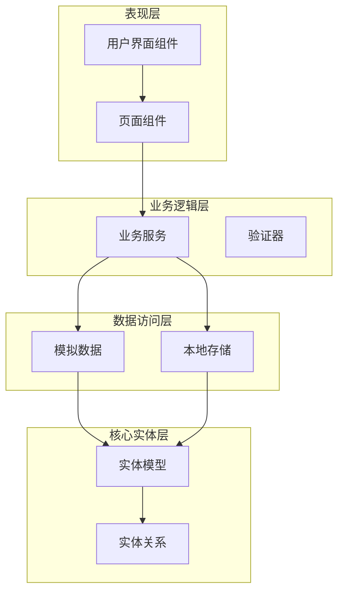
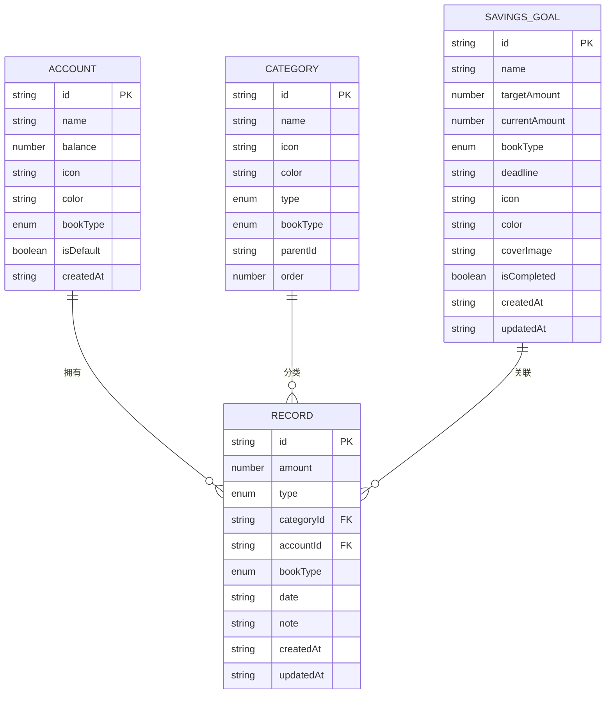
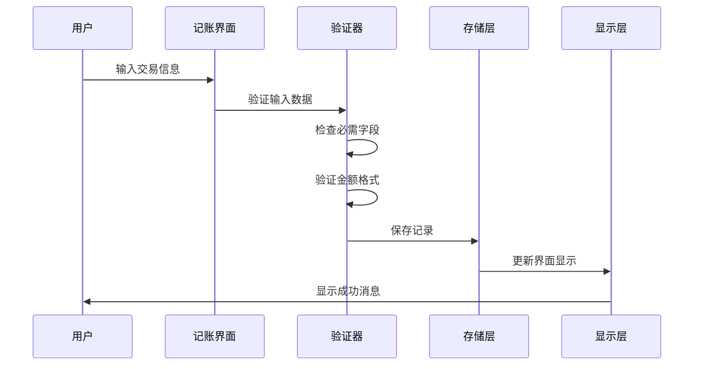
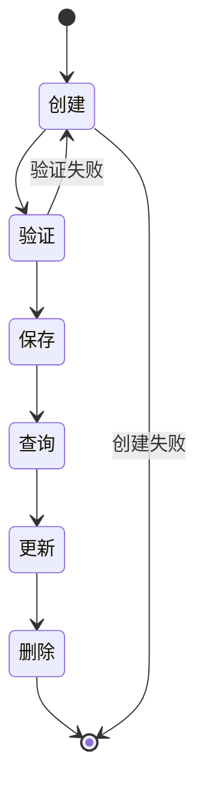

# 核心实体模型

<cite>
**本文档引用的文件**
- [src/types/index.ts](file://src/types/index.ts)
- [src/mocks/accounts.ts](file://src/mocks/accounts.ts)
- [src/mocks/categories.ts](file://src/mocks/categories.ts)
- [src/mocks/records.ts](file://src/mocks/records.ts)
- [src/mocks/savings.ts](file://src/mocks/savings.ts)
- [src/app/(tabs)/record.tsx](file://src/app/(tabs)/record.tsx)
- [src/app/(tabs)/stats.tsx](file://src/app/(tabs)/stats.tsx)
- [src/app/savings/index.tsx](file://src/app/savings/index.tsx)
</cite>

## 目录
1. [简介](#简介)
2. [项目结构](#项目结构)
3. [核心组件](#核心组件)
4. [架构概览](#架构概览)
5. [详细组件分析](#详细组件分析)
6. [依赖分析](#依赖分析)
7. [性能考虑](#性能考虑)
8. [故障排除指南](#故障排除指南)
9. [结论](#结论)

## 简介

本文档深入解析"攒钱记账"应用的核心实体模型设计。该应用采用React Native + TypeScript技术栈，通过精心设计的数据模型实现了个人和企业双重账本体系。核心实体包括User、Account、Category、Record、SavingsGoal等，这些实体构成了完整的财务管理生态系统。

系统采用类型安全的设计理念，通过TypeScript接口定义确保编译时类型检查，防止运行时类型错误。实体间建立了清晰的关联关系，如Record与Account、Category的多对一关系，形成了完整的财务数据链路。

## 项目结构

项目采用模块化组织方式，核心类型定义集中在types目录，模拟数据位于mocks目录，业务页面分布在app目录中：

```mermaid
graph TB
subgraph "类型定义层"
Types[src/types/index.ts]
end
subgraph "模拟数据层"
Accounts[src/mocks/accounts.ts]
Categories[src/mocks/categories.ts]
Records[src/mocks/records.ts]
Savings[src/mocks/savings.ts]
end
subgraph "业务页面层"
RecordPage[src/app/(tabs)/record.tsx]
StatsPage[src/app/(tabs)/stats.tsx]
SavingsPage[src/app/savings/index.tsx]
end
Types --> Accounts
Types --> Categories
Types --> Records
Types --> Savings
Accounts --> RecordPage
Categories --> RecordPage
Records --> StatsPage
Savings --> SavingsPage
```

**图表来源**
- [src/types/index.ts](file://src/types/index.ts#L1-L141)
- [src/mocks/accounts.ts](file://src/mocks/accounts.ts#L1-L91)
- [src/mocks/categories.ts](file://src/mocks/categories.ts#L1-L69)
- [src/mocks/records.ts](file://src/mocks/records.ts#L1-L117)
- [src/mocks/savings.ts](file://src/mocks/savings.ts#L1-L111)

**章节来源**
- [src/types/index.ts](file://src/types/index.ts#L1-L141)
- [src/mocks/accounts.ts](file://src/mocks/accounts.ts#L1-L91)
- [src/mocks/categories.ts](file://src/mocks/categories.ts#L1-L69)
- [src/mocks/records.ts](file://src/mocks/records.ts#L1-L117)
- [src/mocks/savings.ts](file://src/mocks/savings.ts#L1-L111)

## 核心组件

### 用户实体 (User)

用户实体代表应用的使用者，支持个人基本信息管理：

- **id**: 唯一标识符，字符串类型
- **nickname**: 昵称，必填字符串
- **avatar**: 头像URL，可选字符串
- **phone**: 电话号码，可选字符串  
- **email**: 邮箱地址，可选字符串
- **createdAt**: 创建时间，ISO 8601格式字符串

用户实体采用最小化设计，仅包含必要的身份识别信息，便于扩展和维护。

**章节来源**
- [src/types/index.ts](file://src/types/index.ts#L12-L19)

### 账户实体 (Account)

账户实体描述各种资金存储方式，支持个人和企业双重账本：

- **id**: 账户唯一标识符
- **name**: 账户名称，如"现金"、"银行卡"
- **balance**: 当前余额，数值类型
- **icon**: 图标标识符
- **color**: 配色方案
- **bookType**: 账本类型，枚举值('personal' | 'business')
- **isDefault**: 是否为默认账户，布尔值
- **createdAt**: 创建时间戳

账户实体体现了金融产品的一般属性，支持多种支付方式的统一管理。

**章节来源**
- [src/types/index.ts](file://src/types/index.ts#L22-L31)

### 分类实体 (Category)

分类实体用于组织和归类财务交易，支持收支双向分类：

- **id**: 分类唯一标识符
- **name**: 分类名称
- **icon**: 图标标识
- **color**: 颜色标识
- **type**: 交易类型，枚举('expense' | 'income')
- **bookType**: 账本类型
- **parentId**: 父级分类ID，支持层级结构
- **order**: 排序权重

分类系统支持树形结构，便于构建复杂的财务分类体系。

**章节来源**
- [src/types/index.ts](file://src/types/index.ts#L34-L43)

### 记录实体 (Record)

记录实体是核心的财务交易数据载体：

- **id**: 记录唯一标识符
- **amount**: 交易金额
- **type**: 交易类型('expense' | 'income')
- **categoryId**: 关联分类ID
- **category**: 分类对象(可选嵌套)
- **accountId**: 关联账户ID
- **account**: 账户对象(可选嵌套)
- **bookType**: 账本类型
- **date**: 交易日期
- **note**: 备注信息
- **images**: 附件图片数组
- **createdAt**: 创建时间
- **updatedAt**: 更新时间

记录实体建立了与账户和分类的多对一关联关系，形成完整的交易数据链。

**章节来源**
- [src/types/index.ts](file://src/types/index.ts#L46-L60)

### 攒钱目标实体 (SavingsGoal)

目标实体用于追踪和管理储蓄计划：

- **id**: 目标唯一标识符
- **name**: 目标名称
- **targetAmount**: 目标金额
- **currentAmount**: 当前累积金额
- **bookType**: 账本类型
- **deadline**: 截止日期
- **icon**: 图标标识
- **color**: 配色方案
- **coverImage**: 封面图片
- **isCompleted**: 完成状态
- **createdAt**: 创建时间
- **updatedAt**: 更新时间

目标实体支持个人和企业双重维度，便于区分不同性质的储蓄计划。

**章节来源**
- [src/types/index.ts](file://src/types/index.ts#L63-L76)

## 架构概览

系统采用分层架构设计，各层职责明确，耦合度低：



**图表来源**
- [src/app/(tabs)/record.tsx](file://src/app/(tabs)/record.tsx#L1-L521)
- [src/app/(tabs)/stats.tsx](file://src/app/(tabs)/stats.tsx#L1-L535)
- [src/app/savings/index.tsx](file://src/app/savings/index.tsx#L1-L341)
- [src/mocks/accounts.ts](file://src/mocks/accounts.ts#L1-L91)
- [src/mocks/categories.ts](file://src/mocks/categories.ts#L1-L69)
- [src/mocks/records.ts](file://src/mocks/records.ts#L1-L117)
- [src/mocks/savings.ts](file://src/mocks/savings.ts#L1-L111)

## 详细组件分析

### 实体关系设计

系统中的实体关系体现了典型的财务管理系统模式：



**图表来源**
- [src/types/index.ts](file://src/types/index.ts#L22-L76)

### Record实体处理流程

Record实体的创建和处理展示了完整的业务流程：



**图表来源**
- [src/app/(tabs)/record.tsx](file://src/app/(tabs)/record.tsx#L94-L137)
- [src/mocks/records.ts](file://src/mocks/records.ts#L13-L98)

### 类型安全设计

系统通过TypeScript实现了全面的类型安全：

```mermaid
classDiagram
class AccountBookType {
<<enumeration>>
"personal"
"business"
}
class TransactionType {
<<enumeration>>
"expense"
"income"
}
class User {
+string id
+string nickname
+string avatar
+string phone
+string email
+string createdAt
}
class Account {
+string id
+string name
+number balance
+string icon
+string color
+AccountBookType bookType
+boolean isDefault
+string createdAt
}
class Category {
+string id
+string name
+string icon
+string color
+TransactionType type
+AccountBookType bookType
+string parentId
+number order
}
class Record {
+string id
+number amount
+TransactionType type
+string categoryId
+string accountId
+AccountBookType bookType
+string date
+string note
+string createdAt
+string updatedAt
}
AccountBookType <|-- Account
AccountBookType <|-- Category
AccountBookType <|-- Record
TransactionType <|-- Category
TransactionType <|-- Record
```

**图表来源**
- [src/types/index.ts](file://src/types/index.ts#L5-L9)
- [src/types/index.ts](file://src/types/index.ts#L12-L76)

**章节来源**
- [src/types/index.ts](file://src/types/index.ts#L1-L141)

### 数据验证和约束

系统在多个层面实施数据验证：

#### 字段约束规则
- **必需字段**: 所有ID字段、名称字段、类型字段均为必需
- **数据类型**: 金额使用number类型，时间使用ISO 8601字符串格式
- **取值范围**: 金额必须为非负数，日期格式严格遵循ISO标准
- **枚举限制**: 使用TypeScript枚举确保取值的有效性

#### 业务规则
- **余额约束**: 账户余额不能为负数
- **分类关联**: Record必须关联有效的Category
- **账户关联**: Record必须关联有效的Account
- **时间一致性**: createdAt和updatedAt字段保持同步更新

**章节来源**
- [src/types/index.ts](file://src/types/index.ts#L22-L76)

### 生命周期管理

实体的生命周期管理体现了完整的CRUD操作：



**图表来源**
- [src/mocks/records.ts](file://src/mocks/records.ts#L13-L98)
- [src/mocks/savings.ts](file://src/mocks/savings.ts#L8-L60)

## 依赖分析

系统依赖关系展现了清晰的模块化设计：

```mermaid
graph TD
subgraph "核心类型依赖"
TypesIndex[src/types/index.ts]
TypeUsers[User接口]
TypeAccounts[Account接口]
TypeCategories[Category接口]
TypeRecords[Record接口]
TypeGoals[SavingsGoal接口]
end
subgraph "模拟数据依赖"
MockAccounts[src/mocks/accounts.ts]
MockCategories[src/mocks/categories.ts]
MockRecords[src/mocks/records.ts]
MockSavings[src/mocks/savings.ts]
end
subgraph "页面组件依赖"
RecordPage[src/app/(tabs)/record.tsx]
StatsPage[src/app/(tabs)/stats.tsx]
SavingsPage[src/app/savings/index.tsx]
end
TypesIndex --> MockAccounts
TypesIndex --> MockCategories
TypesIndex --> MockRecords
TypesIndex --> MockSavings
MockAccounts --> RecordPage
MockCategories --> RecordPage
MockSavings --> SavingsPage
MockRecords --> StatsPage
```

**图表来源**
- [src/types/index.ts](file://src/types/index.ts#L1-L141)
- [src/mocks/accounts.ts](file://src/mocks/accounts.ts#L1-L91)
- [src/mocks/categories.ts](file://src/mocks/categories.ts#L1-L69)
- [src/mocks/records.ts](file://src/mocks/records.ts#L1-L117)
- [src/mocks/savings.ts](file://src/mocks/savings.ts#L1-L111)

**章节来源**
- [src/types/index.ts](file://src/types/index.ts#L1-L141)

## 性能考虑

系统在设计时充分考虑了性能优化：

### 数据结构优化
- **扁平化设计**: 避免深层嵌套，提高查询效率
- **索引策略**: 关键字段建立索引，如ID、日期、类型
- **缓存机制**: 频繁访问的数据进行内存缓存

### 查询优化
- **分页加载**: 大量数据采用分页策略
- **懒加载**: 图片和复杂组件按需加载
- **批量操作**: 支持批量数据处理

### 内存管理
- **垃圾回收**: 及时释放不再使用的对象
- **虚拟化**: 长列表采用虚拟化渲染
- **资源池**: 复用昂贵的对象实例

## 故障排除指南

### 常见问题及解决方案

#### 类型错误
**问题**: 编译时报类型不匹配错误
**解决方案**: 检查接口定义是否正确实现，确认枚举值的使用

#### 数据不一致
**问题**: 实体间关联数据不一致
**解决方案**: 实施事务处理，确保关联操作的原子性

#### 性能问题
**问题**: 页面加载缓慢
**解决方案**: 优化查询语句，实施数据缓存策略

#### 内存泄漏
**问题**: 应用内存持续增长
**解决方案**: 检查事件监听器的清理，及时释放资源

**章节来源**
- [src/types/index.ts](file://src/types/index.ts#L1-L141)

## 结论

该核心实体模型设计体现了现代财务管理应用的最佳实践。通过精心设计的类型系统、清晰的实体关系和完善的生命周期管理，系统能够有效支撑复杂的财务管理工作。

主要优势包括：
- **类型安全**: 全面的TypeScript类型检查
- **扩展性强**: 模块化设计便于功能扩展
- **性能优化**: 合理的数据结构和查询策略
- **用户体验**: 直观的界面设计和流畅的操作体验

建议在未来版本中进一步增强：
- 实际的数据持久化机制
- 更丰富的业务规则验证
- 增强的报表和分析功能
- 多设备同步能力