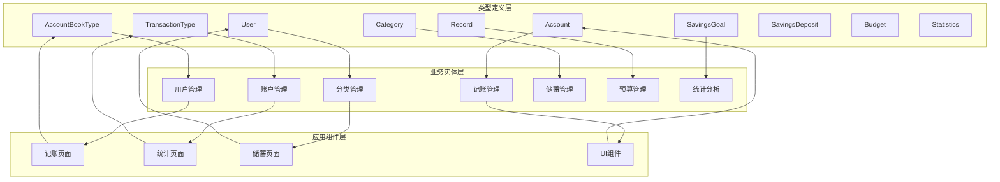
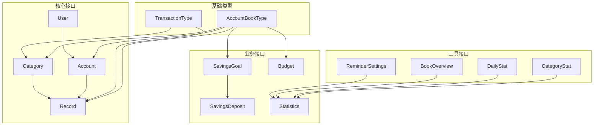

# 类型定义规范

<cite>
**本文档引用的文件**
- [src/types/index.ts](file://src/types/index.ts)
- [src/mocks/accounts.ts](file://src/mocks/accounts.ts)
- [src/mocks/categories.ts](file://src/mocks/categories.ts)
- [src/mocks/records.ts](file://src/mocks/records.ts)
- [src/mocks/savings.ts](file://src/mocks/savings.ts)
- [src/app/(tabs)/record.tsx](file://src/app/(tabs)/record.tsx)
- [src/app/(tabs)/stats.tsx](file://src/app/(tabs)/stats.tsx)
- [src/components/ui/GlassCard.tsx](file://src/components/ui/GlassCard.tsx)
- [src/constants/index.ts](file://src/constants/index.ts)
- [src/mocks/index.ts](file://src/mocks/index.ts)
- [tsconfig.json](file://tsconfig.json)
- [package.json](file://package.json)
</cite>

## 目录
1. [简介](#简介)
2. [项目结构](#项目结构)
3. [核心组件](#核心组件)
4. [架构概览](#架构概览)
5. [详细组件分析](#详细组件分析)
6. [依赖关系分析](#依赖关系分析)
7. [性能考虑](#性能考虑)
8. [故障排除指南](#故障排除指南)
9. [结论](#结论)
10. [附录](#附录)

## 简介

本文件是"攒钱记账"项目类型定义规范的完整技术文档。该项目采用TypeScript构建，实现了严格的类型安全体系，涵盖基础类型、联合类型、枚举类型和接口定义。文档重点阐述了AccountBookType（账本类型）和TransactionType（交易类型）等核心类型的业务含义与使用场景，提供了类型别名的命名规范和语义化设计原则，详细说明了泛型类型的使用模式和约束条件，并总结了类型推断、类型守卫和类型断言的最佳实践。

项目通过严格的类型系统确保了前端开发的可维护性和可靠性，为开发者提供了完整的TypeScript类型参考手册。

## 项目结构

项目采用模块化的文件组织方式，类型定义集中管理，便于维护和扩展：

```mermaid
graph TB
subgraph "类型定义层"
Types[src/types/index.ts]
end
subgraph "模拟数据层"
Accounts[src/mocks/accounts.ts]
Categories[src/mocks/categories.ts]
Records[src/mocks/records.ts]
Savings[src/mocks/savings.ts]
end
subgraph "应用层"
RecordPage[src/app/(tabs)/record.tsx]
StatsPage[src/app/(tabs)/stats.tsx]
GlassCard[src/components/ui/GlassCard.tsx]
end
subgraph "配置层"
TSConfig[tsconfig.json]
Package[package.json]
end
Types --> Accounts
Types --> Categories
Types --> Records
Types --> Savings
Types --> RecordPage
Types --> StatsPage
Types --> GlassCard
TSConfig --> Types
Package --> TSConfig
```

**图表来源**
- [src/types/index.ts](file://src/types/index.ts#L1-L141)
- [src/mocks/accounts.ts](file://src/mocks/accounts.ts#L1-L91)
- [src/app/(tabs)/record.tsx](file://src/app/(tabs)/record.tsx#L1-L200)

**章节来源**
- [src/types/index.ts](file://src/types/index.ts#L1-L141)
- [src/mocks/index.ts](file://src/mocks/index.ts#L1-L9)

## 核心组件

### 基础类型系统

项目建立了完整的类型定义体系，包括基础类型、联合类型和复合类型：

#### 账本类型（AccountBookType）
```typescript
export type AccountBookType = 'personal' | 'business';
```
- **业务含义**：区分个人账本和公司账本
- **使用场景**：用于标识财务数据所属的账本类型
- **约束条件**：仅允许'personal'或'business'两个字面量值

#### 交易类型（TransactionType）
```typescript
export type TransactionType = 'expense' | 'income';
```
- **业务含义**：区分支出和收入两种交易类型
- **使用场景**：用于标识交易的方向和性质
- **约束条件**：仅允许'expense'或'income'两个字面量值

**章节来源**
- [src/types/index.ts](file://src/types/index.ts#L5-L19)

### 接口定义体系

项目采用接口定义核心业务实体，确保数据结构的完整性和一致性：

#### 用户接口（User）
```typescript
export interface User {
  id: string;
  nickname: string;
  avatar?: string;
  phone?: string;
  email?: string;
  createdAt: string;
}
```

#### 账户接口（Account）
```typescript
export interface Account {
  id: string;
  name: string;
  balance: number;
  icon: string;
  color: string;
  bookType: AccountBookType;
  isDefault?: boolean;
  createdAt: string;
}
```

#### 分类接口（Category）
```typescript
export interface Category {
  id: string;
  name: string;
  icon: string;
  color: string;
  type: TransactionType;
  bookType: AccountBookType;
  parentId?: string;
  order?: number;
}
```

#### 记账记录接口（Record）
```typescript
export interface Record {
  id: string;
  amount: number;
  type: TransactionType;
  categoryId: string;
  category?: Category;
  accountId: string;
  account?: Account;
  bookType: AccountBookType;
  date: string;
  note?: string;
  images?: string[];
  createdAt: string;
  updatedAt: string;
}
```

**章节来源**
- [src/types/index.ts](file://src/types/index.ts#L11-L60)

## 架构概览

项目类型系统采用分层架构设计，确保类型定义的可复用性和一致性：



**图表来源**
- [src/types/index.ts](file://src/types/index.ts#L1-L141)
- [src/app/(tabs)/record.tsx](file://src/app/(tabs)/record.tsx#L20-L25)
- [src/app/(tabs)/stats.tsx](file://src/app/(tabs)/stats.tsx#L20-L25)

## 详细组件分析

### 核心类型详解

#### AccountBookType 类型分析

AccountBookType是项目中最基础的联合类型，用于区分不同的财务账本：

```mermaid
classDiagram
class AccountBookType {
<<union type>>
"personal"
"business"
}
class Account {
+string id
+string name
+number balance
+string icon
+string color
+AccountBookType bookType
+boolean isDefault?
+string createdAt
}
class Category {
+string id
+string name
+string icon
+string color
+TransactionType type
+AccountBookType bookType
+string parentId?
+number order?
}
AccountBookType --> Account : "使用"
AccountBookType --> Category : "使用"
```

**图表来源**
- [src/types/index.ts](file://src/types/index.ts#L5-L43)

**使用场景**：
- 账户分类管理：区分个人账户和公司账户
- 分类体系管理：建立独立的收支分类体系
- 数据隔离：确保不同类型账本的数据互不干扰

#### TransactionType 类型分析

TransactionType用于标识交易的性质和方向：

```mermaid
classDiagram
class TransactionType {
<<union type>>
"expense"
"income"
}
class Record {
+string id
+number amount
+TransactionType type
+string categoryId
+Category category?
+string accountId
+Account account?
+AccountBookType bookType
+string date
+string note?
+string[] images?
+string createdAt
+string updatedAt
}
class Category {
+string id
+string name
+string icon
+string color
+TransactionType type
+AccountBookType bookType
+string parentId?
+number order?
}
TransactionType --> Record : "使用"
TransactionType --> Category : "使用"
```

**图表来源**
- [src/types/index.ts](file://src/types/index.ts#L8-L60)

**使用场景**：
- 记账记录分类：区分收入和支出记录
- 统计计算：根据交易类型进行相应的统计处理
- 报表生成：生成不同类型的财务报表

### 类型别名命名规范

项目遵循统一的命名规范，确保类型定义的语义化和可读性：

#### 命名规则
1. **类型名称**：使用名词短语，如AccountBookType、TransactionType
2. **接口名称**：使用名词，如User、Account、Category
3. **常量类型**：使用全大写加下划线，如INCOME、EXPENSE
4. **组合类型**：使用描述性短语，如CategoryStat、DailyStat

#### 语义化设计原则
- **明确性**：类型名称直接反映其业务含义
- **一致性**：同类功能使用相似的命名模式
- **可扩展性**：为未来功能扩展预留空间
- **可维护性**：避免过于复杂的类型嵌套

**章节来源**
- [src/types/index.ts](file://src/types/index.ts#L1-L141)

### 泛型类型使用模式

项目中的泛型类型主要用于提高代码的复用性和类型安全性：

#### 泛型接口模式
```typescript
// 泛型接口定义示例
interface GenericResponse<T> {
  data: T;
  status: number;
  message: string;
}

// 使用示例
const userResponse: GenericResponse<User> = {
  data: userData,
  status: 200,
  message: "success"
};
```

#### 泛型函数模式
```typescript
// 泛型函数定义
function createEntity<T extends BaseEntity>(entity: Omit<T, 'id'>): T {
  return {
    ...entity,
    id: generateId()
  };
}

// 使用示例
const newUser = createEntity<User>({ name: "张三", email: "zhang@example.com" });
```

### 类型推断最佳实践

项目充分利用TypeScript的类型推断能力，减少显式类型标注：

#### 对象字面量推断
```typescript
// 利用字面量推断类型
const user = {
  id: "user_001",
  name: "张三",
  age: 25
}; // 类型自动推断为 { id: string; name: string; age: number }

// 数组元素推断
const accounts = [
  { id: "acc_001", name: "现金", balance: 1000 },
  { id: "acc_002", name: "银行", balance: 5000 }
]; // 类型推断为 Account[]
```

#### 函数返回类型推断
```typescript
// 返回类型自动推断
function getUser(id: string) {
  return users.find(user => user.id === id);
} // 返回类型为 User | undefined

// 复杂表达式推断
const processedData = data
  .filter(item => item.active)
  .map(item => ({
    id: item.id,
    name: item.name.toUpperCase()
  }));
```

### 类型守卫实现策略

项目采用多种类型守卫确保运行时类型安全：

#### 字面量类型守卫
```typescript
// 使用字面量守卫
function processBookType(bookType: AccountBookType) {
  if (bookType === 'personal') {
    // 编译器推断为 'personal'
    return processPersonalBook();
  } else {
    // 编译器推断为 'business'
    return processBusinessBook();
  }
}
```

#### 接口守卫
```typescript
// 使用 in 操作符守卫
function hasCategory(record: Record | SavingsDeposit): record is Record {
  return 'categoryId' in record;
}

// 使用 instanceof 守卫
function isValidDate(date: string | Date): date is Date {
  return date instanceof Date;
}
```

#### 自定义类型守卫
```typescript
// 自定义类型守卫函数
function isAccountBookType(value: unknown): value is AccountBookType {
  return value === 'personal' || value === 'business';
}

function isTransactionType(value: unknown): value is TransactionType {
  return value === 'expense' || value === 'income';
}
```

### 类型断言使用指南

项目中谨慎使用类型断言，确保类型转换的安全性：

#### 非-null 断言
```typescript
// 当确定值不为 null/undefined 时使用
const user = getUserById(userId)!; // 断言非空
const displayName = user?.displayName ?? "匿名用户"; // 可选链回退
```

#### 类型参数断言
```typescript
// 泛型类型参数断言
const data = JSON.parse(response) as unknown as Record[];

// 字面量类型断言
const bookType = input.value as 'personal' | 'business';
```

#### 最小权限断言
```typescript
// 仅在必要时使用断言
interface MutableUser extends User {
  updateAt: string;
}

function updateUser(user: User): MutableUser {
  // 在这里进行必要的类型转换
  return {
    ...user,
    updateAt: new Date().toISOString()
  } as MutableUser;
}
```

**章节来源**
- [src/app/(tabs)/record.tsx](file://src/app/(tabs)/record.tsx#L94-L96)
- [src/app/(tabs)/stats.tsx](file://src/app/(tabs)/stats.tsx#L24-L25)

## 依赖关系分析

项目类型系统具有清晰的依赖层次结构，确保类型定义的一致性和可维护性：



**图表来源**
- [src/types/index.ts](file://src/types/index.ts#L1-L141)

### 类型依赖关系

项目中的类型依赖呈现树状结构，基础类型位于顶层，具体业务类型依附于基础类型：

1. **AccountBookType** 是所有财务相关类型的基类
2. **TransactionType** 是交易相关类型的基类  
3. **User** 和 **Account** 是核心实体类型
4. **Category** 和 **Record** 是业务核心类型
5. **SavingsGoal**、**SavingsDeposit**、**Budget** 是专项业务类型
6. **Statistics**、**CategoryStat**、**DailyStat** 是统计分析类型

### 循环依赖检测

项目通过合理的模块划分避免了循环依赖：
- 类型定义文件相互独立
- 组件文件通过类型导入使用
- 模拟数据文件通过类型导入使用
- 配置文件独立管理

**章节来源**
- [src/types/index.ts](file://src/types/index.ts#L1-L141)

## 性能考虑

### 类型检查性能优化

项目通过以下方式优化TypeScript编译性能：

#### 模块拆分策略
- 将类型定义集中在单一文件中，减少模块解析开销
- 使用 barrel exports 统一导出入口
- 避免深层嵌套的类型导入

#### 编译配置优化
- 启用严格模式确保类型安全
- 使用路径映射减少模块解析时间
- 配置包含文件列表避免不必要的文件扫描

#### 运行时性能
- 类型断言仅在必要时使用
- 避免过度复杂的类型嵌套
- 使用字面量类型减少运行时检查

## 故障排除指南

### 常见类型错误及解决方案

#### 类型不匹配错误
**问题**：传入参数类型与期望类型不匹配
**解决方案**：
```typescript
// 错误示例
const result = calculateTotal("100"); // 参数应为 number

// 正确示例
const result = calculateTotal(100); // 使用正确的数字类型
```

#### 可选属性访问错误
**问题**：访问可能不存在的可选属性
**解决方案**：
```typescript
// 使用可选链操作符
const categoryName = category?.name ?? "未知分类";

// 使用类型守卫
if (hasCategoryName(category)) {
  console.log(category.name);
}
```

#### 联合类型处理错误
**问题**：未正确处理联合类型的分支
**解决方案**：
```typescript
// 使用类型守卫
function processType(value: AccountBookType | TransactionType) {
  if (isAccountBookType(value)) {
    // 处理账本类型
  } else {
    // 处理交易类型
  }
}
```

### 类型定义调试技巧

#### 类型信息查看
```typescript
// 使用类型提示查看变量类型
const user: User = { /* 属性 */ }; // 将鼠标悬停查看类型信息
```

#### 类型兼容性测试
```typescript
// 测试类型兼容性
const testData: Record = {
  id: "test",
  amount: 100,
  type: "expense",
  categoryId: "cat_001",
  accountId: "acc_001",
  bookType: "personal",
  date: "2025-01-01",
  createdAt: "2025-01-01T00:00:00",
  updatedAt: "2025-01-01T00:00:00"
};
```

**章节来源**
- [src/types/index.ts](file://src/types/index.ts#L1-L141)

## 结论

本项目建立了完善的TypeScript类型定义体系，通过严格的类型安全设计确保了代码质量和可维护性。核心特点包括：

1. **清晰的类型层次**：从基础类型到复杂接口的有序组织
2. **语义化的命名规范**：直观反映业务含义的类型命名
3. **严格的类型约束**：通过联合类型和字面量类型确保数据完整性
4. **实用的类型工具**：类型推断、类型守卫和类型断言的合理使用
5. **良好的扩展性**：为未来功能扩展预留了充足的空间

该类型系统为前端开发者提供了完整的类型参考手册，有助于提高开发效率和代码质量。

## 附录

### TypeScript配置要点

项目采用严格的TypeScript配置确保类型安全：

#### 关键配置项
- **strict**: 启用所有严格类型检查选项
- **jsx**: 设置为 react-jsx 支持React JSX语法
- **esModuleInterop**: 改善CommonJS和ES模块的互操作性
- **baseUrl** 和 **paths**: 配置路径映射简化模块导入

#### 开发环境配置
- 使用最新版本的TypeScript确保最佳的类型检查能力
- 配置适当的编译选项平衡性能和安全性
- 启用增量编译提高开发效率

**章节来源**
- [tsconfig.json](file://tsconfig.json#L1-L14)
- [package.json](file://package.json#L36-L40)