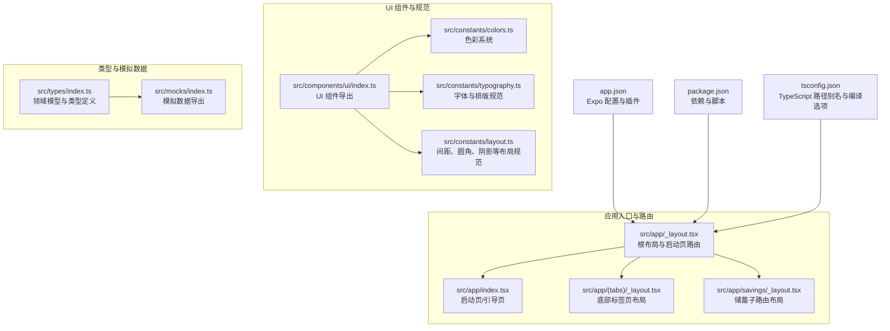
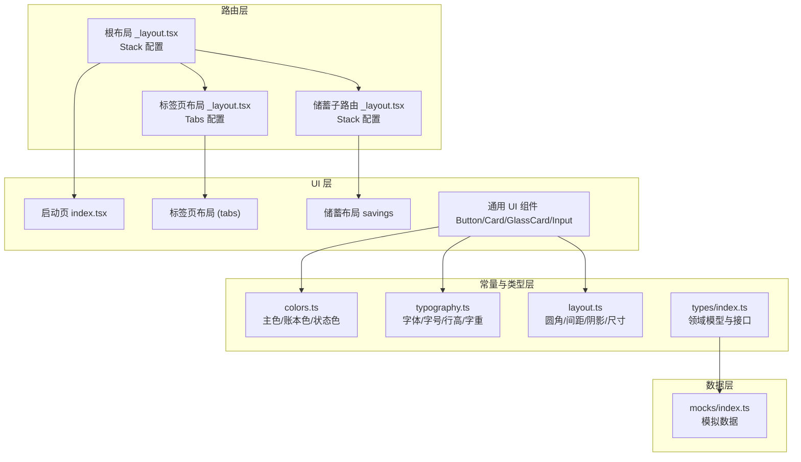
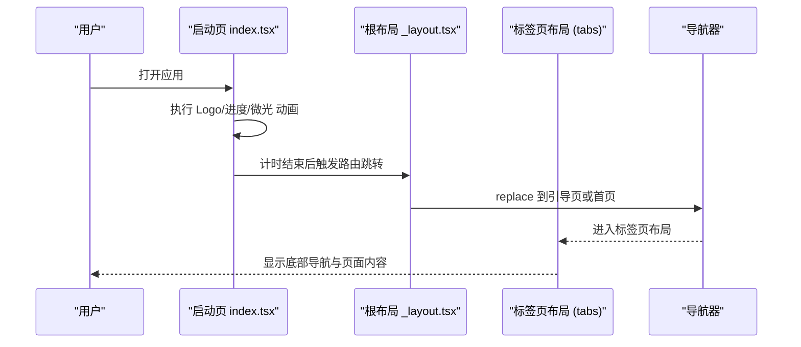
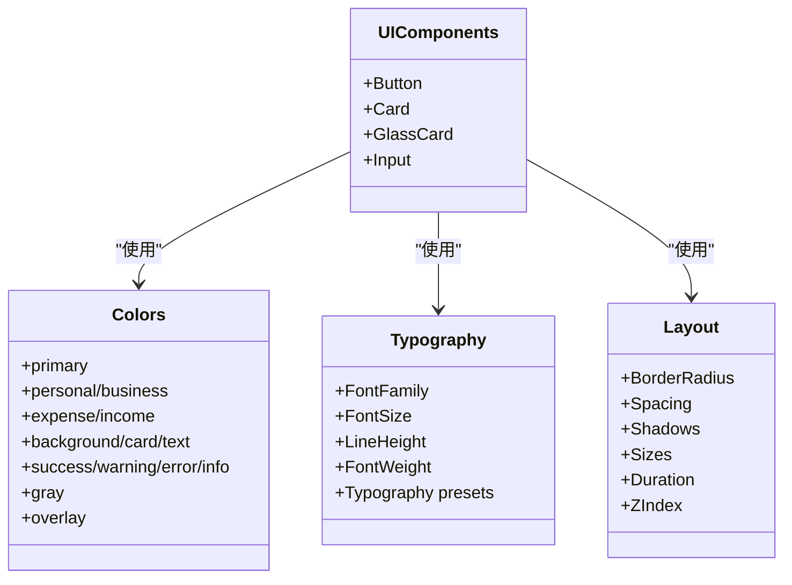
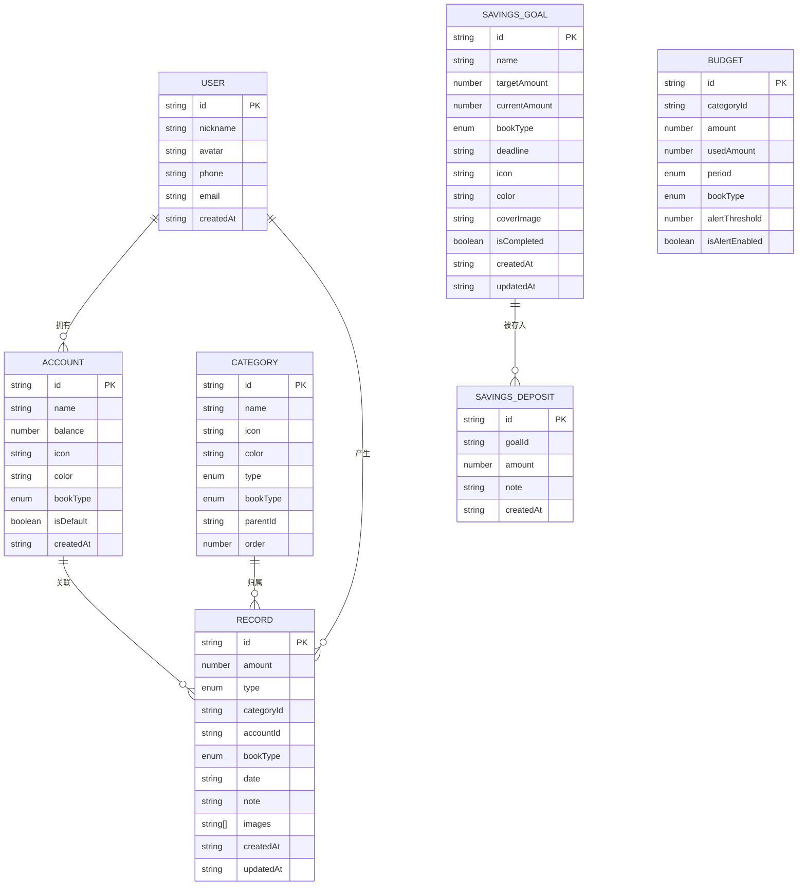
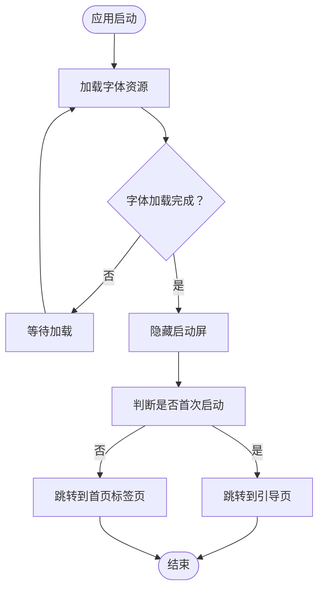
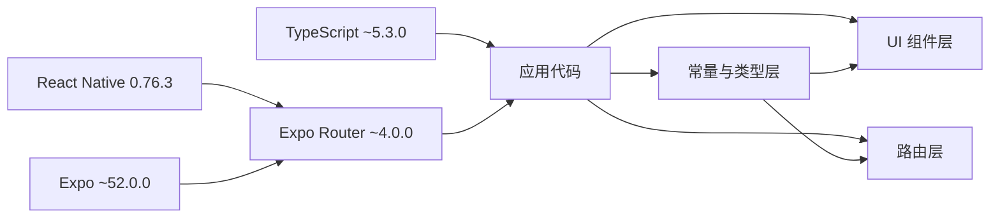

# 整体架构

<cite>
**本文引用的文件**
- [package.json](file://package.json)
- [app.json](file://app.json)
- [tsconfig.json](file://tsconfig.json)
- [src/app/_layout.tsx](file://src/app/_layout.tsx)
- [src/app/index.tsx](file://src/app/index.tsx)
- [src/app/(tabs)/_layout.tsx](file://src/app/(tabs)/_layout.tsx)
- [src/app/savings/_layout.tsx](file://src/app/savings/_layout.tsx)
- [src/components/ui/index.ts](file://src/components/ui/index.ts)
- [src/components/index.ts](file://src/components/index.ts)
- [src/constants/index.ts](file://src/constants/index.ts)
- [src/constants/colors.ts](file://src/constants/colors.ts)
- [src/constants/typography.ts](file://src/constants/typography.ts)
- [src/constants/layout.ts](file://src/constants/layout.ts)
- [src/types/index.ts](file://src/types/index.ts)
- [src/mocks/index.ts](file://src/mocks/index.ts)
</cite>

## 目录
1. [引言](#引言)
2. [项目结构](#项目结构)
3. [核心组件](#核心组件)
4. [架构总览](#架构总览)
5. [详细组件分析](#详细组件分析)
6. [依赖关系分析](#依赖关系分析)
7. [性能考量](#性能考量)
8. [故障排查指南](#故障排查指南)
9. [结论](#结论)
10. [附录](#附录)

## 引言
本架构文档面向“攒钱记账”移动应用，系统性阐述基于 React Native 与 Expo 的移动端架构设计，重点覆盖以下方面：
- 组件化设计与可复用 UI 规范
- 声明式路由体系（Expo Router）
- 状态管理策略与数据模型
- 分层架构（UI 层、路由层、常量与类型层、数据层）职责划分
- 技术栈选型与集成方式（React Native、Expo、TypeScript）
- 可扩展性与可维护性设计要点
- 架构决策的技术背景与权衡分析

## 项目结构
项目采用以功能域为中心的目录组织方式，结合 Expo 的约定式路由与 TypeScript 的强类型约束，形成清晰的分层与模块边界。

图表来源
- [src/app/_layout.tsx](file://src/app/_layout.tsx#L1-L55)
- [src/app/index.tsx](file://src/app/index.tsx#L1-L249)
- [src/app/(tabs)/_layout.tsx](file://src/app/(tabs)/_layout.tsx#L1-L121)
- [src/app/savings/_layout.tsx](file://src/app/savings/_layout.tsx#L1-L20)
- [src/components/ui/index.ts](file://src/components/ui/index.ts#L1-L9)
- [src/constants/colors.ts](file://src/constants/colors.ts#L1-L88)
- [src/constants/typography.ts](file://src/constants/typography.ts#L1-L149)
- [src/constants/layout.ts](file://src/constants/layout.ts#L1-L182)
- [src/types/index.ts](file://src/types/index.ts#L1-L141)
- [src/mocks/index.ts](file://src/mocks/index.ts#L1-L9)
- [app.json](file://app.json#L1-L29)
- [package.json](file://package.json#L1-L43)
- [tsconfig.json](file://tsconfig.json#L1-L14)

章节来源
- [package.json](file://package.json#L1-L43)
- [app.json](file://app.json#L1-L29)
- [tsconfig.json](file://tsconfig.json#L1-L14)

## 核心组件
- 路由与导航
  - 根布局负责启动屏控制、字体加载与全局栈配置；通过声明式路由组织页面与嵌套布局。
  - 底部标签页布局统一管理 Tab 样式与图标；储蓄模块采用独立的堆栈布局。
- UI 组件与设计系统
  - UI 组件集中导出，配合色彩、字体、布局三大常量模块，形成一致的设计语言与复用能力。
- 类型与数据模型
  - 定义账户、分类、账单、储蓄目标、预算、统计等核心领域模型，支撑业务逻辑与界面渲染。
- 模拟数据
  - 提供分类、账户、账单、储蓄等模拟数据，便于开发与测试阶段的数据填充。

章节来源
- [src/app/_layout.tsx](file://src/app/_layout.tsx#L1-L55)
- [src/app/(tabs)/_layout.tsx](file://src/app/(tabs)/_layout.tsx#L1-L121)
- [src/app/savings/_layout.tsx](file://src/app/savings/_layout.tsx#L1-L20)
- [src/components/ui/index.ts](file://src/components/ui/index.ts#L1-L9)
- [src/constants/colors.ts](file://src/constants/colors.ts#L1-L88)
- [src/constants/typography.ts](file://src/constants/typography.ts#L1-L149)
- [src/constants/layout.ts](file://src/constants/layout.ts#L1-L182)
- [src/types/index.ts](file://src/types/index.ts#L1-L141)
- [src/mocks/index.ts](file://src/mocks/index.ts#L1-L9)

## 架构总览
应用采用“声明式路由 + 组件化 UI + 类型驱动”的分层架构：
- UI 层：页面与组件，遵循统一的设计系统与交互规范
- 路由层：Expo Router 管理页面与嵌套路由，支持手势容器与动画配置
- 常量与类型层：色彩、字体、布局规范与领域模型定义
- 数据层：模拟数据与未来可替换的真实数据源（当前仓库未包含网络层实现）

图表来源
- [src/app/_layout.tsx](file://src/app/_layout.tsx#L1-L55)
- [src/app/index.tsx](file://src/app/index.tsx#L1-L249)
- [src/app/(tabs)/_layout.tsx](file://src/app/(tabs)/_layout.tsx#L1-L121)
- [src/app/savings/_layout.tsx](file://src/app/savings/_layout.tsx#L1-L20)
- [src/components/ui/index.ts](file://src/components/ui/index.ts#L1-L9)
- [src/constants/colors.ts](file://src/constants/colors.ts#L1-L88)
- [src/constants/typography.ts](file://src/constants/typography.ts#L1-L149)
- [src/constants/layout.ts](file://src/constants/layout.ts#L1-L182)
- [src/types/index.ts](file://src/types/index.ts#L1-L141)
- [src/mocks/index.ts](file://src/mocks/index.ts#L1-L9)

## 详细组件分析

### 路由与导航组件
- 根布局（Stack）
  - 负责启动屏防隐藏与字体加载完成后的隐藏；统一配置内容背景色与页面切换动画；注册入口页、引导页、登录页、标签页与储蓄页。
- 标签页布局（Tabs）
  - 自定义 Tab 图标与聚焦态样式；统一底部栏外观与阴影；按需显示标签文字或仅图标。
- 储蓄子路由布局（Stack）
  - 为储蓄模块提供独立的页面栈，保持与其他模块的路由隔离。

图表来源
- [src/app/index.tsx](file://src/app/index.tsx#L1-L249)
- [src/app/_layout.tsx](file://src/app/_layout.tsx#L1-L55)
- [src/app/(tabs)/_layout.tsx](file://src/app/(tabs)/_layout.tsx#L1-L121)

章节来源
- [src/app/_layout.tsx](file://src/app/_layout.tsx#L1-L55)
- [src/app/index.tsx](file://src/app/index.tsx#L1-L249)
- [src/app/(tabs)/_layout.tsx](file://src/app/(tabs)/_layout.tsx#L1-L121)
- [src/app/savings/_layout.tsx](file://src/app/savings/_layout.tsx#L1-L20)

### UI 组件与设计系统
- 组件导出
  - UI 组件通过集中导出提升复用性与一致性，避免跨模块重复导入。
- 设计系统
  - 色彩系统：主色、账本色（个人/企业）、收支色、背景与文字色、状态色与灰阶。
  - 字体系统：平台适配的字体族、字号、行高、字重与常用文本样式预设。
  - 布局系统：圆角、间距、阴影、尺寸（图标/头像/按钮/输入框）、动画时长与层级。

图表来源
- [src/components/ui/index.ts](file://src/components/ui/index.ts#L1-L9)
- [src/constants/colors.ts](file://src/constants/colors.ts#L1-L88)
- [src/constants/typography.ts](file://src/constants/typography.ts#L1-L149)
- [src/constants/layout.ts](file://src/constants/layout.ts#L1-L182)

章节来源
- [src/components/ui/index.ts](file://src/components/ui/index.ts#L1-L9)
- [src/constants/colors.ts](file://src/constants/colors.ts#L1-L88)
- [src/constants/typography.ts](file://src/constants/typography.ts#L1-L149)
- [src/constants/layout.ts](file://src/constants/layout.ts#L1-L182)

### 领域模型与数据流
- 领域模型
  - 用户、账户、分类、账单、储蓄目标、储蓄记录、预算、统计数据、账本总览、提醒设置等。
- 数据流
  - 页面通过类型定义的模型进行渲染；模拟数据用于开发与演示；未来可接入真实数据源与持久化方案。

图表来源
- [src/types/index.ts](file://src/types/index.ts#L1-L141)
- [src/mocks/index.ts](file://src/mocks/index.ts#L1-L9)

章节来源
- [src/types/index.ts](file://src/types/index.ts#L1-L141)
- [src/mocks/index.ts](file://src/mocks/index.ts#L1-L9)

### 路由流程与页面跳转
- 启动页动画完成后根据是否首次启动决定跳转至引导页或首页标签页。
- 根布局统一处理字体加载与启动屏隐藏，确保首屏体验稳定。

图表来源
- [src/app/_layout.tsx](file://src/app/_layout.tsx#L1-L55)
- [src/app/index.tsx](file://src/app/index.tsx#L1-L249)

章节来源
- [src/app/_layout.tsx](file://src/app/_layout.tsx#L1-L55)
- [src/app/index.tsx](file://src/app/index.tsx#L1-L249)

## 依赖关系分析
- 技术栈与版本
  - React 与 React Native：跨平台 UI 基础
  - Expo 生态：提供运行时、路由、字体、启动屏、状态栏等能力
  - Expo Router：声明式路由与嵌套路由
  - TypeScript：强类型保障与路径别名
  - Zustand：轻量状态管理（仓库未直接使用，但已作为依赖存在）
- 配置与约定
  - app.json 启用 typedRoutes 实验特性，结合 Expo Router 插件
  - tsconfig.json 使用路径别名 @/* 指向 src，提升导入可读性

图表来源
- [package.json](file://package.json#L1-L43)
- [app.json](file://app.json#L1-L29)
- [tsconfig.json](file://tsconfig.json#L1-L14)

章节来源
- [package.json](file://package.json#L1-L43)
- [app.json](file://app.json#L1-L29)
- [tsconfig.json](file://tsconfig.json#L1-L14)

## 性能考量
- 启动屏与字体加载
  - 防止启动屏自动隐藏，确保字体加载完成后再展示页面，避免闪屏与布局抖动。
- 动画与手势
  - 使用原生驱动动画与手势容器，减少 JS 线程压力，提升首屏与交互流畅度。
- 资源与样式
  - 统一使用设计系统常量，减少重复计算与样式对象创建，提高渲染效率。
- 路由与页面栈
  - 嵌套路由与页面栈分离，降低不必要的重渲染与内存占用。

章节来源
- [src/app/_layout.tsx](file://src/app/_layout.tsx#L1-L55)
- [src/app/index.tsx](file://src/app/index.tsx#L1-L249)

## 故障排查指南
- 启动屏不消失
  - 检查字体加载回调与启动屏隐藏逻辑，确认在字体加载完成后调用隐藏方法。
- 路由跳转异常
  - 确认页面已在根布局中注册；检查命名约定与嵌套路由路径。
- 字体显示异常
  - 平台字体差异导致的显示问题，可通过字体系统中的平台选择进行适配。
- 样式不生效
  - 检查设计系统常量的使用与样式合并顺序，避免覆盖或冲突。

章节来源
- [src/app/_layout.tsx](file://src/app/_layout.tsx#L1-L55)
- [src/constants/typography.ts](file://src/constants/typography.ts#L1-L149)

## 结论
本架构以 Expo Router 为核心路由引擎，结合统一的设计系统与强类型模型，构建了清晰的分层与模块边界。通过组件化与常量化的规范，提升了可维护性与一致性；通过声明式路由与动画配置，优化了用户体验。未来可在数据层引入网络请求与本地存储，并在状态管理层面评估引入更完善的全局状态方案，以进一步增强可扩展性与可维护性。

## 附录
- 技术选型与集成要点
  - React Native 与 Expo：提供跨平台运行时与生态能力，简化构建与发布流程
  - Expo Router：声明式路由与嵌套路由，契合本项目的页面与模块化需求
  - TypeScript：路径别名与严格模式，提升开发体验与代码质量
  - 设计系统：色彩、字体、布局三要素统一，保证视觉一致性与组件复用性
- 架构决策的权衡
  - 路由与页面栈分离：提升模块内聚与路由可控性，但需注意跨模块通信
  - 设计系统集中化：降低样式分散风险，但需持续维护与演进
  - 模拟数据先行：加速开发与联调，但需预留真实数据接入点