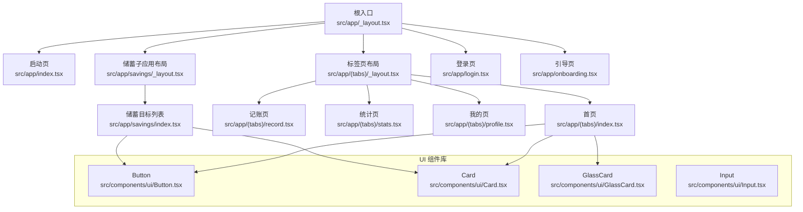
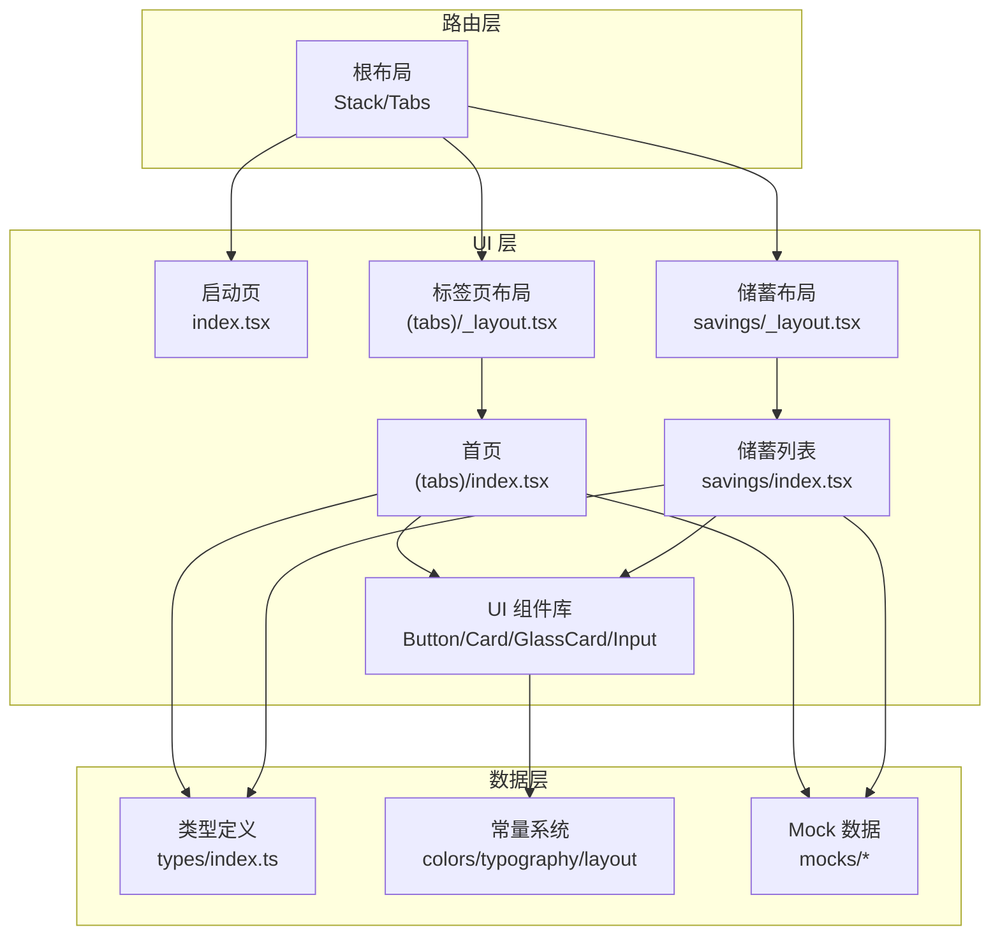
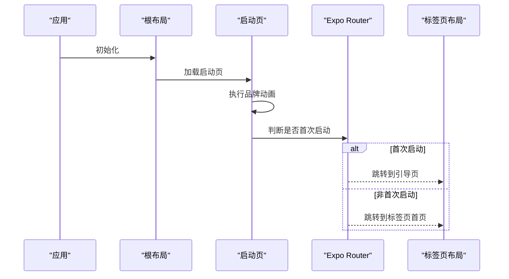
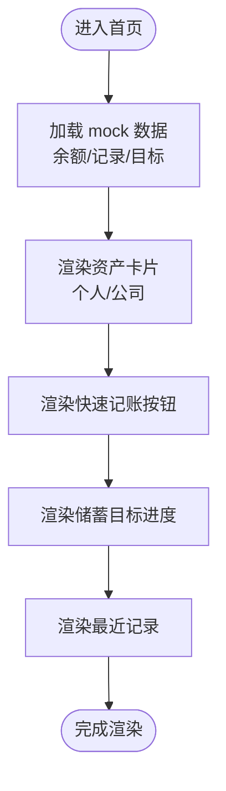
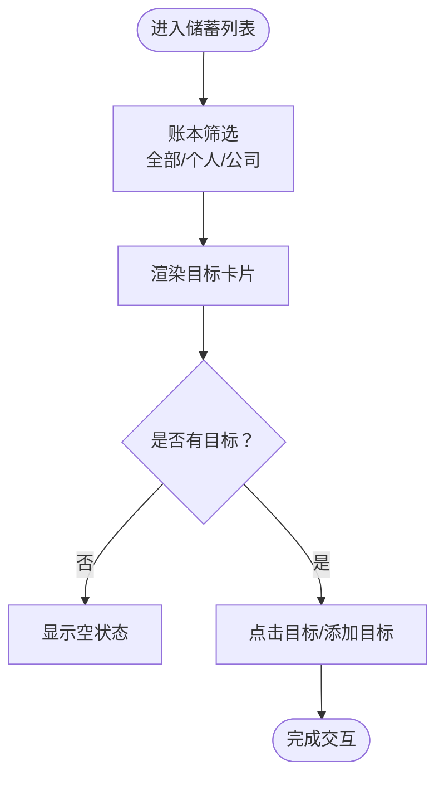
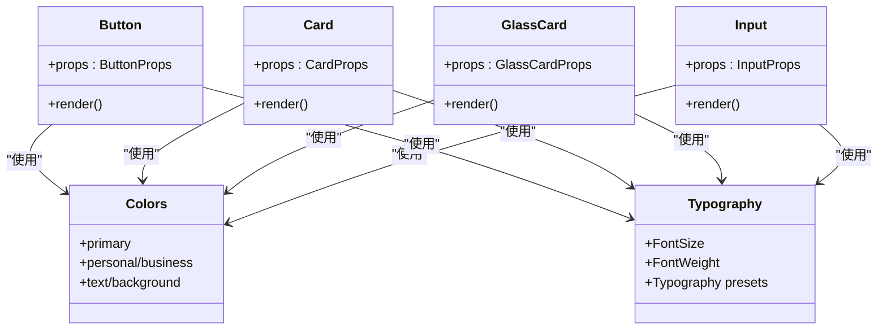
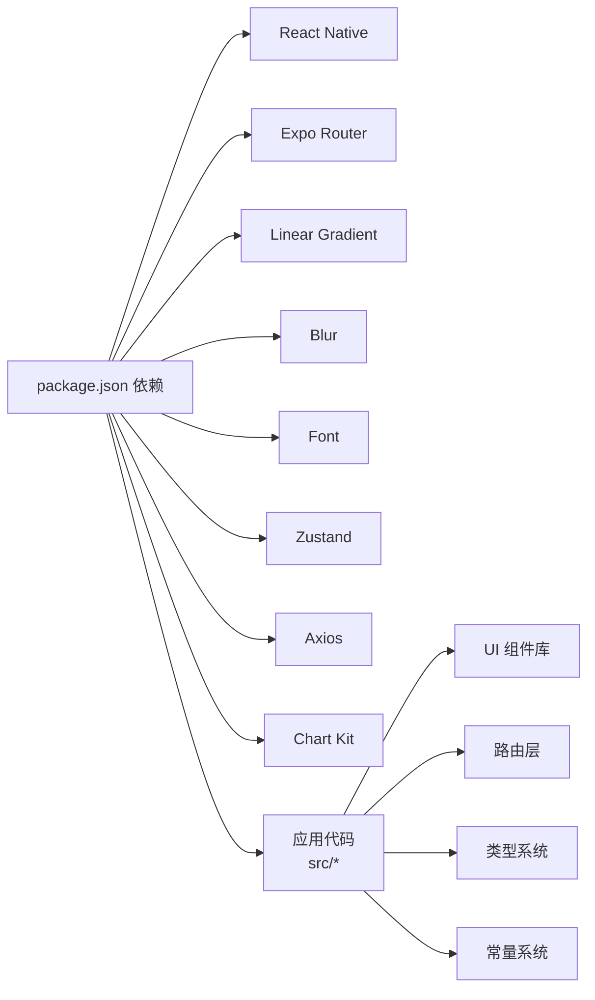

# 架构设计

<cite>
**本文引用的文件**
- [package.json](file://package.json)
- [app.json](file://app.json)
- [src/app/_layout.tsx](file://src/app/_layout.tsx)
- [src/app/index.tsx](file://src/app/index.tsx)
- [src/app/(tabs)/_layout.tsx](file://src/app/(tabs)/_layout.tsx)
- [src/app/(tabs)/index.tsx](file://src/app/(tabs)/index.tsx)
- [src/app/savings/_layout.tsx](file://src/app/savings/_layout.tsx)
- [src/app/savings/index.tsx](file://src/app/savings/index.tsx)
- [src/types/index.ts](file://src/types/index.ts)
- [src/constants/colors.ts](file://src/constants/colors.ts)
- [src/constants/typography.ts](file://src/constants/typography.ts)
- [src/components/index.ts](file://src/components/index.ts)
- [src/components/ui/Button.tsx](file://src/components/ui/Button.tsx)
- [src/components/ui/Card.tsx](file://src/components/ui/Card.tsx)
- [src/components/ui/GlassCard.tsx](file://src/components/ui/GlassCard.tsx)
- [src/components/ui/Input.tsx](file://src/components/ui/Input.tsx)
- [src/constants/index.ts](file://src/constants/index.ts)
- [src/mocks/index.ts](file://src/mocks/index.ts)
</cite>

## 目录
1. [简介](#简介)
2. [项目结构](#项目结构)
3. [核心组件](#核心组件)
4. [架构总览](#架构总览)
5. [详细组件分析](#详细组件分析)
6. [依赖分析](#依赖分析)
7. [性能考量](#性能考量)
8. [故障排查指南](#故障排查指南)
9. [结论](#结论)
10. [附录](#附录)

## 简介
本文件为“攒钱记账”应用的架构设计文档，面向架构师与高级开发者，系统性阐述基于 React Native 与 Expo 的移动端应用架构。重点覆盖以下方面：
- 组件化设计与可复用 UI 组件体系
- 声明式路由系统（expo-router）与页面组织
- 状态管理模式与数据流设计（当前以本地状态为主，后续可扩展至 Zustand）
- 整体架构层次（UI 层、业务层、数据层）与模块职责划分
- 技术选型与权衡考虑
- 架构图与组件关系图，帮助快速理解模块间依赖

## 项目结构
应用采用按功能域与路由约定的目录组织方式，结合 Expo Router 的文件系统路由能力，形成清晰的页面与布局层级。

图表来源
- [src/app/_layout.tsx](file://src/app/_layout.tsx#L1-L61)
- [src/app/index.tsx](file://src/app/index.tsx#L1-L249)
- [src/app/(tabs)/_layout.tsx](file://src/app/(tabs)/_layout.tsx#L1-L121)
- [src/app/(tabs)/index.tsx](file://src/app/(tabs)/index.tsx#L1-L563)
- [src/app/savings/_layout.tsx](file://src/app/savings/_layout.tsx#L1-L20)
- [src/app/savings/index.tsx](file://src/app/savings/index.tsx#L1-L341)
- [src/components/ui/Button.tsx](file://src/components/ui/Button.tsx#L1-L204)
- [src/components/ui/Card.tsx](file://src/components/ui/Card.tsx#L1-L94)
- [src/components/ui/GlassCard.tsx](file://src/components/ui/GlassCard.tsx#L1-L126)
- [src/components/ui/Input.tsx](file://src/components/ui/Input.tsx#L1-L194)

章节来源
- [src/app/_layout.tsx](file://src/app/_layout.tsx#L1-L61)
- [src/app/(tabs)/_layout.tsx](file://src/app/(tabs)/_layout.tsx#L1-L121)
- [src/app/(tabs)/index.tsx](file://src/app/(tabs)/index.tsx#L1-L563)
- [src/app/savings/_layout.tsx](file://src/app/savings/_layout.tsx#L1-L20)
- [src/app/savings/index.tsx](file://src/app/savings/index.tsx#L1-L341)

## 核心组件
- UI 组件库：通过统一导出入口集中管理，便于跨页面复用与主题一致性控制。
  - Button：支持多种变体、尺寸、加载态与图标位置，内置渐变渲染逻辑。
  - Card：基础卡片容器，支持内边距、圆角与阴影配置。
  - GlassCard：毛玻璃效果卡片，iOS 使用 BlurView，Android 使用半透明背景替代；支持顶部渐变边框。
  - Input：带标签、左右图标、错误态与焦点渐变线的输入框组件。
- 常量系统：颜色、字体、排版与布局常量集中管理，确保设计一致性与主题扩展性。
- 类型系统：涵盖用户、账户、分类、账单、储蓄目标、预算、统计数据等核心领域模型，为后续状态与数据层提供类型保障。

章节来源
- [src/components/index.ts](file://src/components/index.ts#L1-L6)
- [src/components/ui/Button.tsx](file://src/components/ui/Button.tsx#L1-L204)
- [src/components/ui/Card.tsx](file://src/components/ui/Card.tsx#L1-L94)
- [src/components/ui/GlassCard.tsx](file://src/components/ui/GlassCard.tsx#L1-L126)
- [src/components/ui/Input.tsx](file://src/components/ui/Input.tsx#L1-L194)
- [src/constants/colors.ts](file://src/constants/colors.ts#L1-L88)
- [src/constants/typography.ts](file://src/constants/typography.ts#L1-L149)
- [src/types/index.ts](file://src/types/index.ts#L1-L141)

## 架构总览
应用采用“声明式路由 + 组件化 UI + 常量与类型驱动”的分层架构：
- UI 层：由可复用 UI 组件与页面组成，负责交互与视觉呈现。
- 路由层：基于 Expo Router 的文件系统路由，根布局统一配置栈与标签页导航。
- 数据层：当前页面通过本地 mock 数据进行演示；建议后续引入 Zustand 实现轻量全局状态管理，并以类型安全的方式与 UI 解耦。
- 主题与设计：通过颜色、字体与布局常量统一风格，保证跨页面一致性。

图表来源
- [src/app/_layout.tsx](file://src/app/_layout.tsx#L1-L61)
- [src/app/index.tsx](file://src/app/index.tsx#L1-L249)
- [src/app/(tabs)/_layout.tsx](file://src/app/(tabs)/_layout.tsx#L1-L121)
- [src/app/(tabs)/index.tsx](file://src/app/(tabs)/index.tsx#L1-L563)
- [src/app/savings/_layout.tsx](file://src/app/savings/_layout.tsx#L1-L20)
- [src/app/savings/index.tsx](file://src/app/savings/index.tsx#L1-L341)
- [src/components/ui/Button.tsx](file://src/components/ui/Button.tsx#L1-L204)
- [src/components/ui/Card.tsx](file://src/components/ui/Card.tsx#L1-L94)
- [src/components/ui/GlassCard.tsx](file://src/components/ui/GlassCard.tsx#L1-L126)
- [src/components/ui/Input.tsx](file://src/components/ui/Input.tsx#L1-L194)
- [src/types/index.ts](file://src/types/index.ts#L1-L141)
- [src/constants/colors.ts](file://src/constants/colors.ts#L1-L88)
- [src/constants/typography.ts](file://src/constants/typography.ts#L1-L149)
- [src/mocks/index.ts](file://src/mocks/index.ts#L1-L9)

## 详细组件分析

### 路由与页面组织
- 根布局：统一配置 Stack 导航、手势根容器、启动屏与字体加载策略，设置全局动画与背景色。
- 启动页：实现品牌动画与跳转逻辑，根据首次启动状态决定进入引导或主标签页。
- 标签页布局：自定义 Tab 图标与样式，集中管理底部导航。
- 储蓄子应用：独立的 Stack 布局，承载储蓄目标相关页面。

图表来源
- [src/app/_layout.tsx](file://src/app/_layout.tsx#L1-L61)
- [src/app/index.tsx](file://src/app/index.tsx#L1-L249)

章节来源
- [src/app/_layout.tsx](file://src/app/_layout.tsx#L1-L61)
- [src/app/index.tsx](file://src/app/index.tsx#L1-L249)
- [src/app/(tabs)/_layout.tsx](file://src/app/(tabs)/_layout.tsx#L1-L121)

### 首页（今日概览）
- 职责：展示资产概览、快速记账入口、储蓄目标进度与最近记录。
- 关键点：使用 GlassCard 与 Card 组合实现卡片化信息展示；通过 mock 数据模拟余额、记录与目标；支持个人/公司账本切换。

图表来源
- [src/app/(tabs)/index.tsx](file://src/app/(tabs)/index.tsx#L1-L563)
- [src/app/(tabs)/_layout.tsx](file://src/app/(tabs)/_layout.tsx#L1-L121)

章节来源
- [src/app/(tabs)/index.tsx](file://src/app/(tabs)/index.tsx#L1-L563)

### 储蓄目标列表页
- 职责：展示储蓄目标列表，支持账本筛选与添加目标入口。
- 关键点：环形进度组件用于直观展示完成度；目标卡片组合了图标、名称、截止日期、金额与最近存入信息。

图表来源
- [src/app/savings/index.tsx](file://src/app/savings/index.tsx#L1-L341)
- [src/app/savings/_layout.tsx](file://src/app/savings/_layout.tsx#L1-L20)

章节来源
- [src/app/savings/index.tsx](file://src/app/savings/index.tsx#L1-L341)

### UI 组件体系
- Button：支持多变体（主按钮、描边、幽灵、支出/收入强调）、尺寸与加载态，内部根据变体选择背景色或渐变渲染。
- Card：统一卡片容器，支持内边距、圆角与阴影配置。
- GlassCard：在 iOS 使用 BlurView，在 Android 使用半透明背景，支持顶部渐变边框以区分账本类型。
- Input：支持标签、左右图标、错误态与焦点渐变线，适配多行与键盘类型。

图表来源
- [src/components/ui/Button.tsx](file://src/components/ui/Button.tsx#L1-L204)
- [src/components/ui/Card.tsx](file://src/components/ui/Card.tsx#L1-L94)
- [src/components/ui/GlassCard.tsx](file://src/components/ui/GlassCard.tsx#L1-L126)
- [src/components/ui/Input.tsx](file://src/components/ui/Input.tsx#L1-L194)
- [src/constants/colors.ts](file://src/constants/colors.ts#L1-L88)
- [src/constants/typography.ts](file://src/constants/typography.ts#L1-L149)

章节来源
- [src/components/ui/Button.tsx](file://src/components/ui/Button.tsx#L1-L204)
- [src/components/ui/Card.tsx](file://src/components/ui/Card.tsx#L1-L94)
- [src/components/ui/GlassCard.tsx](file://src/components/ui/GlassCard.tsx#L1-L126)
- [src/components/ui/Input.tsx](file://src/components/ui/Input.tsx#L1-L194)

### 类型与常量系统
- 类型系统：涵盖用户、账户、分类、账单、储蓄目标、预算、统计数据等，为状态与数据层提供强类型支撑。
- 常量系统：颜色、字体与布局常量集中管理，便于主题扩展与跨页面一致。

章节来源
- [src/types/index.ts](file://src/types/index.ts#L1-L141)
- [src/constants/colors.ts](file://src/constants/colors.ts#L1-L88)
- [src/constants/typography.ts](file://src/constants/typography.ts#L1-L149)

## 依赖分析
- 运行时依赖：React、React Native、Expo 生态（router、linear-gradient、blur、font、screens、gesture-handler、reanimated、safe-area-context 等），以及 axios、react-native-chart-kit、zustand。
- 路由与构建：Expo Router 插件启用，Metro 打包器，Web 平台兼容。
- 设计与主题：颜色、字体与布局常量作为 UI 组件的直接依赖，确保风格统一。

图表来源
- [package.json](file://package.json#L1-L43)
- [app.json](file://app.json#L1-L29)

章节来源
- [package.json](file://package.json#L1-L43)
- [app.json](file://app.json#L1-L29)

## 性能考量
- 动画与渲染：启动页使用原生驱动动画与循环动画，建议在复杂场景下避免过度使用 loop，确保帧率稳定。
- 图形与模糊：GlassCard 在 iOS 使用 BlurView，Android 使用半透明背景替代，减少平台差异带来的性能波动。
- 路由与导航：Stack 与 Tabs 的统一配置减少重复渲染，建议避免在路由切换时进行重型计算。
- 状态管理：当前页面以本地状态为主，建议后续引入 Zustand 以降低跨组件状态同步成本，同时保持 UI 与状态解耦。

## 故障排查指南
- 启动屏不消失：确认根布局中字体加载与启动屏隐藏逻辑正确执行。
- 路由跳转异常：检查路由路径与参数传递，确保页面存在且命名正确。
- 平台差异问题：GlassCard 在 Android 使用半透明背景替代 BlurView，若出现视觉偏差，检查背景色与透明度配置。
- UI 样式不生效：检查颜色、字体与布局常量是否正确导入与使用。

章节来源
- [src/app/_layout.tsx](file://src/app/_layout.tsx#L1-L61)
- [src/components/ui/GlassCard.tsx](file://src/components/ui/GlassCard.tsx#L1-L126)

## 结论
本架构以“声明式路由 + 组件化 UI + 常量与类型驱动”为核心，实现了清晰的页面组织与一致的视觉风格。当前阶段以本地状态与 mock 数据为主，后续可平滑引入 Zustand 实现轻量全局状态管理，进一步提升可维护性与扩展性。通过统一的颜色、字体与布局常量，UI 组件具备良好的复用性与主题扩展能力，适合长期演进。

## 附录
- 技术选型与权衡
  - React Native + Expo：跨平台开发效率高，生态成熟，适合快速迭代。
  - Expo Router：文件系统路由，约定优于配置，降低路由心智负担。
  - Zustand：轻量全局状态管理，API 简洁，适合中小型应用的状态需求。
  - Expo 生态组件：如 Linear Gradient、Blur、Font、Screens 等，提升视觉与交互体验。
- 推荐实践
  - 将 UI 组件与业务逻辑分离，利用类型系统约束数据结构。
  - 在路由层集中处理导航与页面生命周期，避免在页面内重复实现。
  - 使用常量系统统一管理设计变量，便于主题扩展与多端一致性。