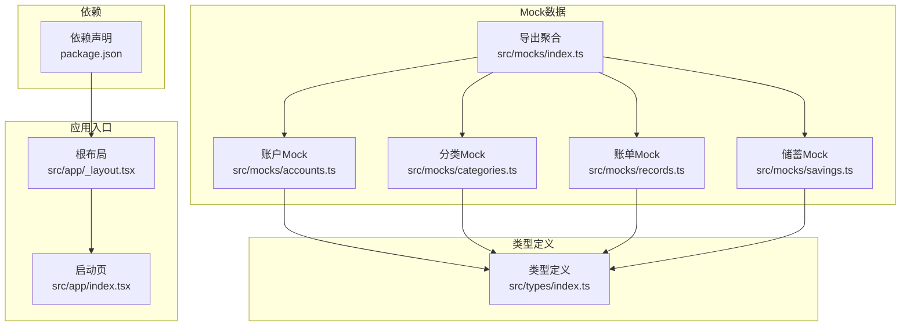
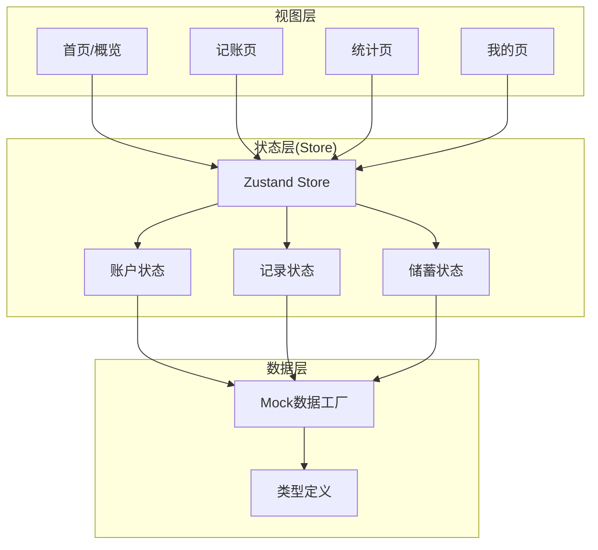
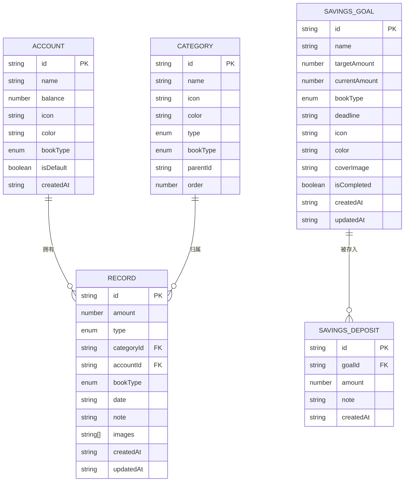
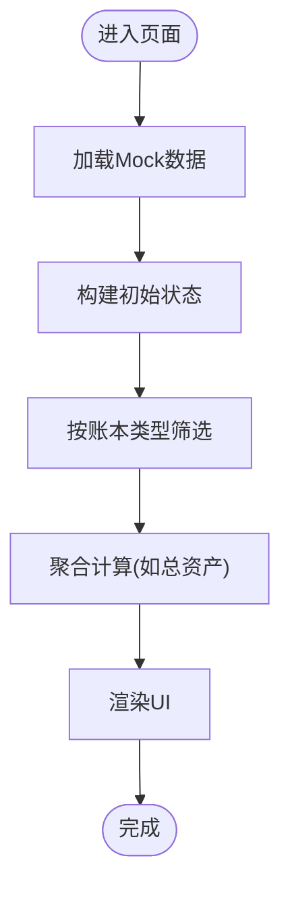
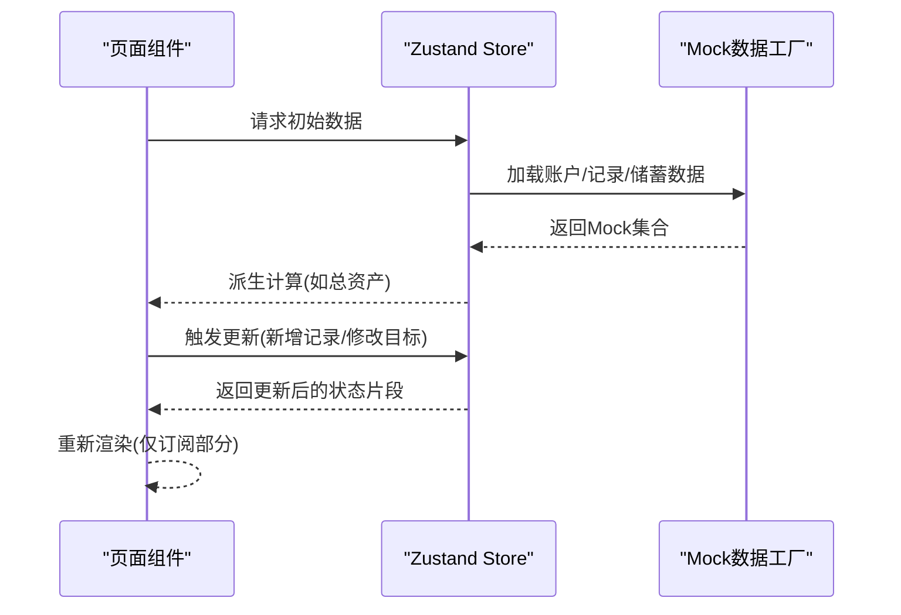
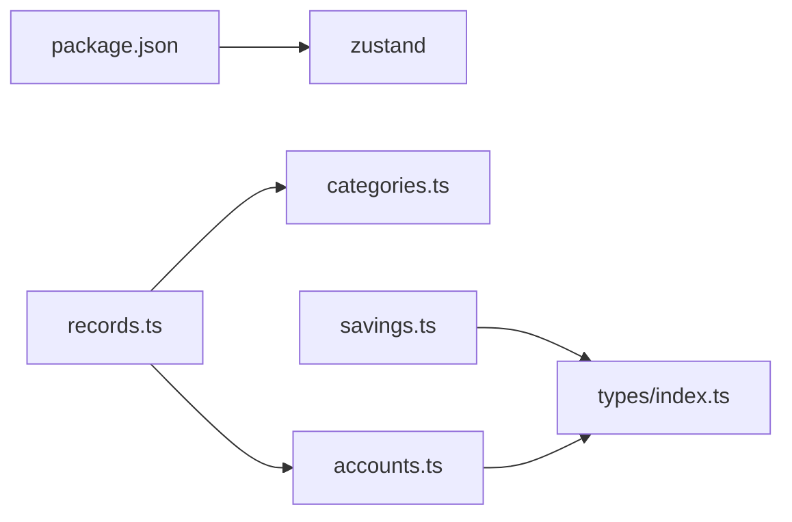

# 状态管理

<cite>
**本文引用的文件**
- [package.json](file://package.json)
- [src/app/_layout.tsx](file://src/app/_layout.tsx)
- [src/app/index.tsx](file://src/app/index.tsx)
- [src/types/index.ts](file://src/types/index.ts)
- [src/mocks/index.ts](file://src/mocks/index.ts)
- [src/mocks/accounts.ts](file://src/mocks/accounts.ts)
- [src/mocks/categories.ts](file://src/mocks/categories.ts)
- [src/mocks/records.ts](file://src/mocks/records.ts)
- [src/mocks/savings.ts](file://src/mocks/savings.ts)
</cite>

## 目录
1. [引言](#引言)
2. [项目结构](#项目结构)
3. [核心组件](#核心组件)
4. [架构总览](#架构总览)
5. [详细组件分析](#详细组件分析)
6. [依赖分析](#依赖分析)
7. [性能考量](#性能考量)
8. [故障排查指南](#故障排查指南)
9. [结论](#结论)
10. [附录](#附录)

## 引言
本文件面向“攒钱记账”应用的状态管理文档，聚焦于当前仓库中已实现的Mock数据系统与潜在的Zustand状态管理集成路径。根据现有代码，项目已引入Zustand依赖，但尚未在源码中发现Zustand Store 的具体实现；同时，项目提供了完善的类型定义与Mock数据模块，覆盖账户、分类、账单记录、储蓄目标等核心领域模型。本文将基于这些基础，系统性地阐述Mock数据系统如何支撑前端状态设计与数据流管理，并给出Zustand集成的落地建议、订阅模式、性能优化策略以及最佳实践与常见问题解决方案。

## 项目结构
从状态管理视角，项目采用按功能域划分的组织方式：
- 类型定义集中于 src/types，统一描述账户、分类、账单记录、储蓄目标等核心实体与统计结构。
- Mock数据集中于 src/mocks，提供账户、分类、账单记录、储蓄目标及其关联关系的数据工厂方法。
- 应用入口与路由位于 src/app，负责页面级导航与生命周期控制。
- 依赖层面，package.json 明确声明了 Zustand 的版本，为后续状态管理方案提供技术基础。

**图表来源**
- [src/app/_layout.tsx](file://src/app/_layout.tsx#L1-L55)
- [src/app/index.tsx](file://src/app/index.tsx#L1-L249)
- [src/mocks/index.ts](file://src/mocks/index.ts#L1-L9)
- [src/mocks/accounts.ts](file://src/mocks/accounts.ts#L1-L91)
- [src/mocks/categories.ts](file://src/mocks/categories.ts)
- [src/mocks/records.ts](file://src/mocks/records.ts#L1-L117)
- [src/mocks/savings.ts](file://src/mocks/savings.ts#L1-L111)
- [package.json](file://package.json#L1-L43)

**章节来源**
- [src/app/_layout.tsx](file://src/app/_layout.tsx#L1-L55)
- [src/app/index.tsx](file://src/app/index.tsx#L1-L249)
- [src/mocks/index.ts](file://src/mocks/index.ts#L1-L9)
- [package.json](file://package.json#L1-L43)

## 核心组件
- 类型系统：通过统一的接口与枚举定义，确保账户、分类、账单记录、储蓄目标等实体的一致性与可扩展性。
- Mock数据工厂：提供按账本类型筛选、聚合计算、时间维度查询等能力，便于在无后端时快速构建前端状态。
- 应用入口：负责页面切换、字体加载与启动屏控制，为状态初始化与数据加载提供时机。

**章节来源**
- [src/types/index.ts](file://src/types/index.ts#L1-L141)
- [src/mocks/accounts.ts](file://src/mocks/accounts.ts#L1-L91)
- [src/mocks/records.ts](file://src/mocks/records.ts#L1-L117)
- [src/mocks/savings.ts](file://src/mocks/savings.ts#L1-L111)
- [src/app/_layout.tsx](file://src/app/_layout.tsx#L1-L55)

## 架构总览
当前状态管理以“类型 + Mock数据 + 页面组件”为主，Zustand作为可选的状态容器尚未在源码中落地。下图展示了概念上的状态管理架构，其中Store层为Zustand Store的预期位置，用于集中管理账户、记录、储蓄目标等全局状态，并通过订阅机制驱动UI更新。

[此图为概念示意，不直接映射到具体源码文件，故不提供图表来源]

## 详细组件分析

### 类型系统与数据模型
- 账户(Account)：包含名称、余额、图标、颜色、账本类型、默认标识等字段，支持个人与企业两类账本。
- 分类(Category)：涵盖名称、图标、颜色、收支类型、账本类型、层级关系等，支撑记账分类体系。
- 账单记录(Record)：包含金额、类型、分类、账户、账本类型、日期、备注、图片、时间戳等，是状态管理的核心数据载体。
- 储蓄目标(SavingsGoal)：包含目标名称、目标金额、当前金额、截止日期、图标、颜色、完成状态、时间戳等。
- 储蓄存入(SavingsDeposit)：记录向目标存入的金额与备注，支持按目标ID查询历史存入明细。
- 预算(Budget)、统计数据(Statistics)、账本总览(BookOverview)、提醒设置(ReminderSettings)等类型为扩展功能提供数据契约。

**图表来源**
- [src/types/index.ts](file://src/types/index.ts#L21-L85)

**章节来源**
- [src/types/index.ts](file://src/types/index.ts#L1-L141)

### Mock数据系统与状态策略
- 账户Mock：提供个人与企业两类账户集合，支持按账本类型筛选、计算总资产等聚合方法，适合在Store中作为初始状态或回退数据。
- 分类Mock：为收支分类提供基础数据，配合Record中的categoryId形成强关联。
- 账单记录Mock：提供多条记录样本，支持按日期、账本类型、时间排序等查询，适合作为Store的初始数据与测试数据源。
- 储蓄目标Mock：提供多个目标样本及对应存入记录，支持按账本类型过滤与按目标ID查询明细，适合在Store中维护目标列表与明细缓存。

**图表来源**
- [src/mocks/accounts.ts](file://src/mocks/accounts.ts#L71-L91)
- [src/mocks/records.ts](file://src/mocks/records.ts#L100-L117)
- [src/mocks/savings.ts](file://src/mocks/savings.ts#L94-L111)

**章节来源**
- [src/mocks/accounts.ts](file://src/mocks/accounts.ts#L1-L91)
- [src/mocks/records.ts](file://src/mocks/records.ts#L1-L117)
- [src/mocks/savings.ts](file://src/mocks/savings.ts#L1-L111)

### Zustand集成与使用模式（建议）
以下为Zustand在本项目中的推荐集成路径与使用模式，帮助实现全局状态设计与数据流管理：

- Store设计原则
  - 单一职责：将账户、记录、储蓄目标分别建模为独立的子状态，避免状态过度耦合。
  - 不可变更新：通过原子操作与派生计算，减少不必要的重渲染。
  - 订阅最小化：仅对需要响应的状态片段进行订阅，降低渲染成本。

- 全局状态拆分示例
  - 账户状态：包含账户列表、默认账户、账本类型过滤器、总资产计算等。
  - 记录状态：包含记录列表、筛选条件（日期范围、分类、账本类型）、最近记录、新增/编辑/删除操作。
  - 储蓄状态：包含目标列表、目标详情、存入记录、完成状态切换、到期提醒等。

- 数据流管理
  - 初始化：在应用启动时加载Mock数据，填充Store初始状态。
  - 查询：通过选择器函数按需查询，避免全量状态遍历。
  - 更新：提供动作函数（actions）封装状态变更逻辑，保证一致性。
  - 派生：利用计算属性（如总资产、收支统计）减少重复计算。

- 订阅模式
  - 组件订阅：使用订阅钩子仅订阅所需状态片段，避免全局重渲染。
  - 选择器优化：通过浅比较选择器减少不必要渲染。

- 性能优化
  - 状态切片：按页面或功能域切分状态，避免跨域频繁更新。
  - 缓存策略：对高频查询结果进行缓存，如按账本类型分组后的记录列表。
  - 批处理更新：合并多次状态变更，减少渲染次数。

[此图为概念示意，不直接映射到具体源码文件，故不提供图表来源]

**章节来源**
- [src/mocks/index.ts](file://src/mocks/index.ts#L1-L9)
- [src/mocks/accounts.ts](file://src/mocks/accounts.ts#L1-L91)
- [src/mocks/records.ts](file://src/mocks/records.ts#L1-L117)
- [src/mocks/savings.ts](file://src/mocks/savings.ts#L1-L111)

### 状态更新机制与订阅模式（建议）
- 状态更新机制
  - 动作函数：封装业务逻辑，如新增记录、更新账户余额、标记储蓄目标完成等。
  - 派生计算：基于原始数据计算派生值，如收支合计、占比、趋势等。
  - 事务式更新：对相关联的状态进行批量更新，保持一致性。

- 订阅模式
  - 组件订阅：仅订阅与当前组件相关的状态片段，避免无关更新导致的重渲染。
  - 选择器：使用选择器函数返回稳定引用，提升订阅性能。
  - 事件驱动：通过动作触发状态变更，再由订阅者响应更新。

**章节来源**
- [src/types/index.ts](file://src/types/index.ts#L1-L141)

### Mock数据系统的状态管理策略
- 账户、记录、储蓄目标等核心数据通过Mock工厂方法提供，适合在Store初始化阶段作为默认数据源。
- 对账本类型的过滤与聚合计算（如总资产）可在Store中实现，减少组件内重复逻辑。
- 时间维度查询（如今日记录、最近记录）可作为Store的选择器，提高查询效率。

**章节来源**
- [src/mocks/accounts.ts](file://src/mocks/accounts.ts#L71-L91)
- [src/mocks/records.ts](file://src/mocks/records.ts#L100-L117)
- [src/mocks/savings.ts](file://src/mocks/savings.ts#L94-L111)

### 状态持久化与数据同步（建议）
- 持久化策略
  - 本地存储：将关键状态（如用户偏好、默认账户、最近记录）持久化至本地存储，应用重启后恢复。
  - 渐进式迁移：当类型或字段发生变更时，提供安全的迁移策略，避免数据损坏。
- 数据同步
  - 冲突解决：当本地与远端存在差异时，采用时间戳或版本号进行冲突检测与解决。
  - 离线优先：在离线场景下允许本地修改，联网后进行增量同步。

**章节来源**
- [src/app/_layout.tsx](file://src/app/_layout.tsx#L1-L55)

## 依赖分析
- 外部依赖：Zustand 已在依赖清单中声明，版本满足现代React Native生态需求。
- 内部依赖：Mock数据模块相互协作，records依赖categories与accounts，savings依赖types中的目标与存入记录定义。

**图表来源**
- [package.json](file://package.json#L34-L34)
- [src/mocks/records.ts](file://src/mocks/records.ts#L5-L10)
- [src/mocks/savings.ts](file://src/mocks/savings.ts#L1-L5)
- [src/mocks/accounts.ts](file://src/mocks/accounts.ts#L5-L5)
- [src/types/index.ts](file://src/types/index.ts#L1-L141)

**章节来源**
- [package.json](file://package.json#L1-L43)
- [src/mocks/records.ts](file://src/mocks/records.ts#L1-L117)
- [src/mocks/savings.ts](file://src/mocks/savings.ts#L1-L111)
- [src/mocks/accounts.ts](file://src/mocks/accounts.ts#L1-L91)
- [src/types/index.ts](file://src/types/index.ts#L1-L141)

## 性能考量
- 渲染优化
  - 使用浅比较选择器，减少订阅者的重渲染。
  - 将昂贵的计算放入Memo或选择器中，避免每次渲染都重新计算。
- 状态规模控制
  - 限制记录列表的缓存长度，定期清理过期数据。
  - 对大对象进行分片存储，避免单一状态过大。
- 并发与批处理
  - 合并多次状态变更，减少渲染次数。
  - 在UI空闲时执行非关键的派生计算。

[本节为通用指导，无需列出章节来源]

## 故障排查指南
- 常见问题
  - 状态未更新：确认动作函数是否正确调用，订阅是否绑定到正确的状态片段。
  - 记录缺失：检查账本类型过滤条件与Mock数据的匹配关系。
  - 计算异常：核对派生计算的输入数据是否完整，是否存在空值或类型不一致。
- 排查步骤
  - 打印关键状态片段，验证数据来源与结构。
  - 使用最小化复现：仅保留必要状态与组件，逐步排除干扰因素。
  - 检查Mock数据工厂的返回值，确保与类型定义一致。

**章节来源**
- [src/mocks/records.ts](file://src/mocks/records.ts#L1-L117)
- [src/mocks/savings.ts](file://src/mocks/savings.ts#L1-L111)
- [src/mocks/accounts.ts](file://src/mocks/accounts.ts#L1-L91)

## 结论
当前项目已具备完善的数据契约与Mock数据体系，为Zustand状态管理的落地提供了坚实基础。建议按照“类型 → Mock → Store”的路径推进：先以Mock数据填充Store初始状态，再逐步引入动作函数与选择器，最终结合持久化与同步策略实现完整的状态管理闭环。通过合理的状态切片、订阅优化与派生计算，可显著提升应用的性能与可维护性。

[本节为总结性内容，无需列出章节来源]

## 附录
- 快速参考
  - 类型定义：账户、分类、记录、储蓄目标、预算、统计等。
  - Mock数据：账户、分类、记录、储蓄目标与其工厂方法。
  - 应用入口：根布局与启动页，负责页面切换与启动流程。

**章节来源**
- [src/types/index.ts](file://src/types/index.ts#L1-L141)
- [src/mocks/index.ts](file://src/mocks/index.ts#L1-L9)
- [src/app/_layout.tsx](file://src/app/_layout.tsx#L1-L55)
- [src/app/index.tsx](file://src/app/index.tsx#L1-L249)