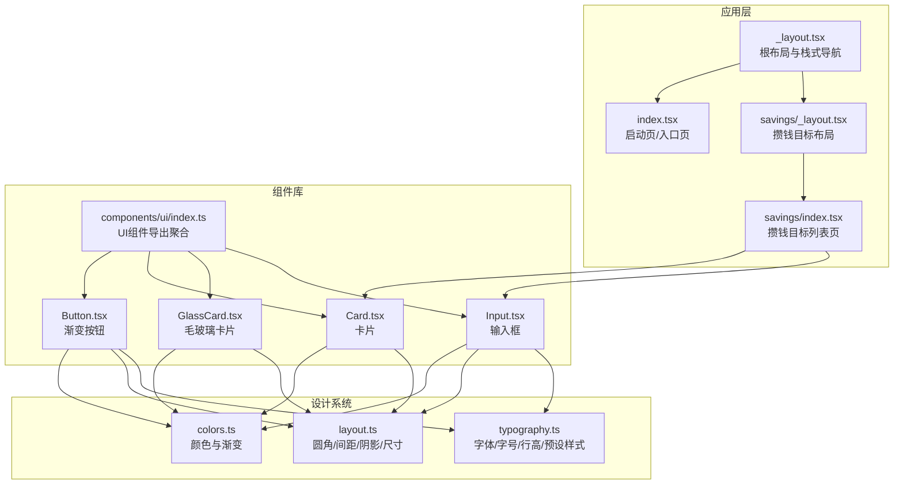
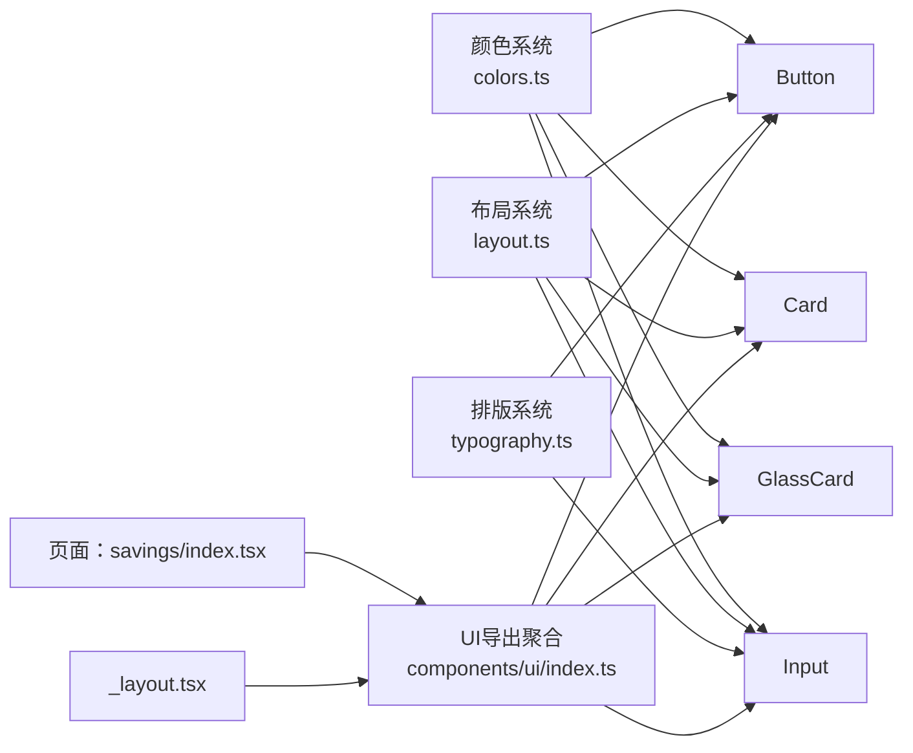
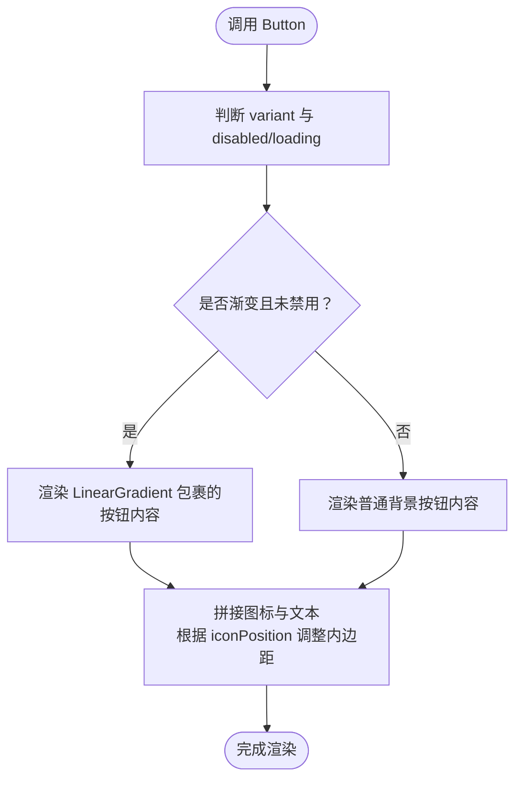
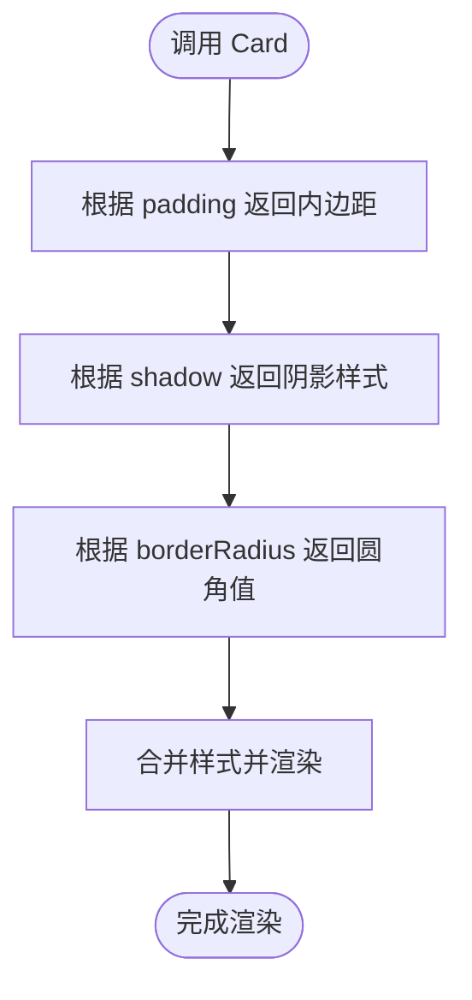
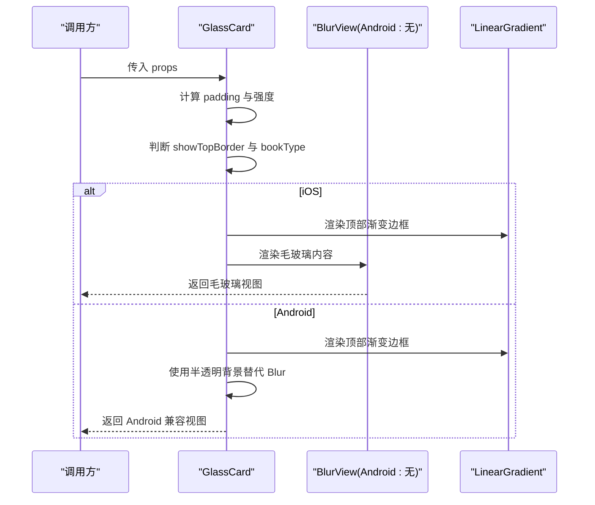
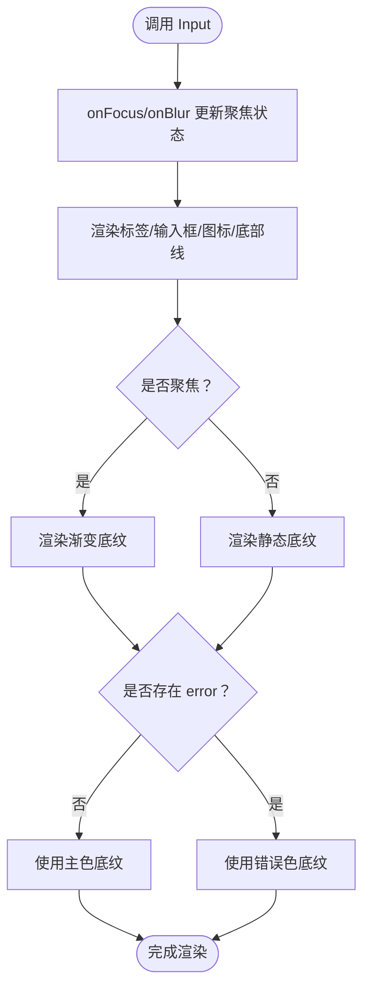
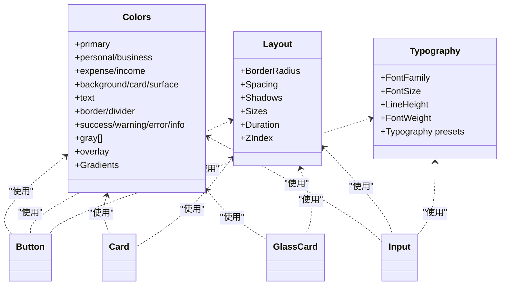
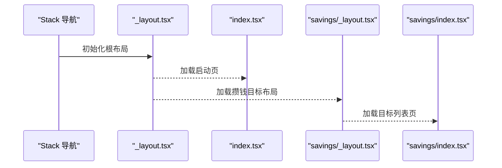
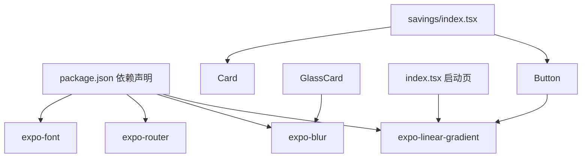

# 组件架构

<cite>
**本文引用的文件**
- [src/components/ui/index.ts](file://src/components/ui/index.ts)
- [src/components/index.ts](file://src/components/index.ts)
- [src/components/ui/Button.tsx](file://src/components/ui/Button.tsx)
- [src/components/ui/Card.tsx](file://src/components/ui/Card.tsx)
- [src/components/ui/GlassCard.tsx](file://src/components/ui/GlassCard.tsx)
- [src/components/ui/Input.tsx](file://src/components/ui/Input.tsx)
- [src/constants/colors.ts](file://src/constants/colors.ts)
- [src/constants/layout.ts](file://src/constants/layout.ts)
- [src/constants/typography.ts](file://src/constants/typography.ts)
- [src/app/_layout.tsx](file://src/app/_layout.tsx)
- [src/app/savings/_layout.tsx](file://src/app/savings/_layout.tsx)
- [src/app/index.tsx](file://src/app/index.tsx)
- [src/app/savings/index.tsx](file://src/app/savings/index.tsx)
- [src/types/index.ts](file://src/types/index.ts)
- [package.json](file://package.json)
</cite>

## 目录
1. [引言](#引言)
2. [项目结构](#项目结构)
3. [核心组件](#核心组件)
4. [架构总览](#架构总览)
5. [组件详解](#组件详解)
6. [依赖关系分析](#依赖关系分析)
7. [性能考量](#性能考量)
8. [故障排查指南](#故障排查指南)
9. [结论](#结论)
10. [附录](#附录)

## 引言
本文件面向“攒钱记账”应用的组件化设计，系统性阐述UI组件库的组织结构、设计系统（颜色、排版、布局）的集成方式，以及渐变与玻璃态UI组件的实现原理与使用方法。文档同时覆盖组件职责分离、props设计与事件处理模式、复用策略、样式系统与主题定制机制，并提供开发规范、最佳实践、性能优化与调试技巧。

## 项目结构
应用采用按功能域与层级结合的组织方式：
- src/app：页面与路由入口，负责应用骨架、栈式导航与页面布局
- src/components：组件库，按UI子模块拆分并统一导出
- src/constants：设计系统常量（颜色、排版、布局）
- src/types：类型定义（账本、收支、统计等）

图表来源
- [src/app/_layout.tsx](file://src/app/_layout.tsx#L30-L47)
- [src/app/index.tsx](file://src/app/index.tsx#L15-L146)
- [src/app/savings/_layout.tsx](file://src/app/savings/_layout.tsx#L8-L18)
- [src/app/savings/index.tsx](file://src/app/savings/index.tsx#L121-L197)
- [src/components/ui/index.ts](file://src/components/ui/index.ts#L5-L9)
- [src/components/ui/Button.tsx](file://src/components/ui/Button.tsx#L36-L189)
- [src/components/ui/Card.tsx](file://src/components/ui/Card.tsx#L18-L84)
- [src/components/ui/GlassCard.tsx](file://src/components/ui/GlassCard.tsx#L22-L106)
- [src/components/ui/Input.tsx](file://src/components/ui/Input.tsx#L41-L137)
- [src/constants/colors.ts](file://src/constants/colors.ts#L6-L87)
- [src/constants/layout.ts](file://src/constants/layout.ts#L8-L181)
- [src/constants/typography.ts](file://src/constants/typography.ts#L8-L148)

章节来源
- [src/app/_layout.tsx](file://src/app/_layout.tsx#L17-L47)
- [src/app/savings/_layout.tsx](file://src/app/savings/_layout.tsx#L8-L18)
- [src/components/ui/index.ts](file://src/components/ui/index.ts#L5-L9)
- [src/components/index.ts](file://src/components/index.ts#L5-L6)

## 核心组件
- Button：渐变与多态按钮，支持多种变体、尺寸、禁用与加载态、图标位置与全宽
- Card：通用卡片容器，支持内边距、圆角、阴影等级与自定义样式
- GlassCard：毛玻璃卡片，支持强度、内边距、顶部渐变边框、账本类型标识与平台差异适配
- Input：带标签、错误提示、左右图标、聚焦渐变底纹的输入框，支持多行与可编辑控制

章节来源
- [src/components/ui/Button.tsx](file://src/components/ui/Button.tsx#L22-L34)
- [src/components/ui/Card.tsx](file://src/components/ui/Card.tsx#L10-L16)
- [src/components/ui/GlassCard.tsx](file://src/components/ui/GlassCard.tsx#L13-L20)
- [src/components/ui/Input.tsx](file://src/components/ui/Input.tsx#L20-L39)

## 架构总览
组件架构遵循“设计系统驱动 + 组件库解耦”的原则：
- 设计系统集中于 constants，提供颜色、排版、布局三要素
- 组件通过导入设计系统常量实现一致的视觉与交互体验
- 页面通过组件库组合业务视图，保持职责分离

图表来源
- [src/constants/colors.ts](file://src/constants/colors.ts#L6-L87)
- [src/constants/layout.ts](file://src/constants/layout.ts#L8-L181)
- [src/constants/typography.ts](file://src/constants/typography.ts#L8-L148)
- [src/components/ui/index.ts](file://src/components/ui/index.ts#L5-L9)
- [src/app/savings/index.tsx](file://src/app/savings/index.tsx#L18-L21)
- [src/app/_layout.tsx](file://src/app/_layout.tsx#L33-L38)

## 组件详解

### Button 渐变按钮
- 职责分离：渲染逻辑与样式计算分离；渐变与非渐变分支明确
- Props设计：title、onPress、variant、size、disabled、loading、icon、iconPosition、fullWidth、style、textStyle
- 事件处理：封装TouchableOpacity，内部根据禁用/加载态调整activeOpacity与disabled
- 渐变实现：LinearGradient包裹内容区域，根据variant选择不同渐变色组
- 样式系统：高度来自Sizes.button，圆角来自BorderRadius，阴影来自Shadows.sm，文字样式来自Typography.button

图表来源
- [src/components/ui/Button.tsx](file://src/components/ui/Button.tsx#L36-L189)

章节来源
- [src/components/ui/Button.tsx](file://src/components/ui/Button.tsx#L22-L34)
- [src/components/ui/Button.tsx](file://src/components/ui/Button.tsx#L53-L110)
- [src/components/ui/Button.tsx](file://src/components/ui/Button.tsx#L159-L188)

### Card 卡片
- 职责分离：容器仅负责布局与外观，内容由children传入
- Props设计：children、style、padding、shadow、borderRadius
- 样式系统：padding、borderRadius、阴影均来自layout常量；背景色来自colors常量

图表来源
- [src/components/ui/Card.tsx](file://src/components/ui/Card.tsx#L18-L84)

章节来源
- [src/components/ui/Card.tsx](file://src/components/ui/Card.tsx#L10-L16)
- [src/components/ui/Card.tsx](file://src/components/ui/Card.tsx#L25-L68)

### GlassCard 毛玻璃卡片
- 职责分离：在iOS使用BlurView实现毛玻璃，在Android使用半透明背景替代
- Props设计：children、style、intensity、padding、showTopBorder、bookType
- 渐变顶部边框：根据bookType或显式参数生成渐变色数组
- 平台差异：Android不支持BlurView时回退至半透明背景，保证一致性

图表来源
- [src/components/ui/GlassCard.tsx](file://src/components/ui/GlassCard.tsx#L22-L106)

章节来源
- [src/components/ui/GlassCard.tsx](file://src/components/ui/GlassCard.tsx#L13-L20)
- [src/components/ui/GlassCard.tsx](file://src/components/ui/GlassCard.tsx#L45-L58)
- [src/components/ui/GlassCard.tsx](file://src/components/ui/GlassCard.tsx#L71-L88)

### Input 输入框
- 职责分离：输入逻辑与UI样式分离；聚焦态与错误态通过底部渐变线强调
- Props设计：value、onChangeText、placeholder、label、error、左右图标、安全输入、键盘类型、自动大写、多行、可编辑、回调等
- 事件处理：内部维护聚焦状态，对外暴露onFocus/onBlur
- 渐变底纹：聚焦时显示从左到右的渐变线，错误时显示纯色线

图表来源
- [src/components/ui/Input.tsx](file://src/components/ui/Input.tsx#L41-L137)

章节来源
- [src/components/ui/Input.tsx](file://src/components/ui/Input.tsx#L20-L39)
- [src/components/ui/Input.tsx](file://src/components/ui/Input.tsx#L61-L71)
- [src/components/ui/Input.tsx](file://src/components/ui/Input.tsx#L114-L131)

### 设计系统集成
- 颜色系统：提供主色、账本标识色、收支色、背景、卡片、文字、边框、状态色与灰度；并提供主渐变与账本渐变集合
- 布局系统：统一圆角、间距、阴影、尺寸（图标/头像/按钮/输入）、动画时长、Z-index层级
- 排版系统：跨平台字体族、字号、行高、字重与常用预设样式（标题/正文/按钮/金额等）

图表来源
- [src/constants/colors.ts](file://src/constants/colors.ts#L6-L87)
- [src/constants/layout.ts](file://src/constants/layout.ts#L8-L181)
- [src/constants/typography.ts](file://src/constants/typography.ts#L8-L148)
- [src/components/ui/Button.tsx](file://src/components/ui/Button.tsx#L15-L17)
- [src/components/ui/Card.tsx](file://src/components/ui/Card.tsx#L7-L8)
- [src/components/ui/GlassCard.tsx](file://src/components/ui/GlassCard.tsx#L9-L10)
- [src/components/ui/Input.tsx](file://src/components/ui/Input.tsx#L16-L18)

章节来源
- [src/constants/colors.ts](file://src/constants/colors.ts#L6-L87)
- [src/constants/layout.ts](file://src/constants/layout.ts#L8-L181)
- [src/constants/typography.ts](file://src/constants/typography.ts#L8-L148)

### 页面中的组件使用
- 根布局：设置全局背景色、动画与手势根容器
- 启动页：使用渐变背景与动画元素，展示品牌视觉
- 攒钱目标列表页：使用Card作为目标项容器，配合自绘环形进度条与渐变标识

图表来源
- [src/app/_layout.tsx](file://src/app/_layout.tsx#L33-L45)
- [src/app/index.tsx](file://src/app/index.tsx#L15-L146)
- [src/app/savings/_layout.tsx](file://src/app/savings/_layout.tsx#L10-L17)
- [src/app/savings/index.tsx](file://src/app/savings/index.tsx#L121-L197)

章节来源
- [src/app/_layout.tsx](file://src/app/_layout.tsx#L17-L47)
- [src/app/index.tsx](file://src/app/index.tsx#L15-L146)
- [src/app/savings/_layout.tsx](file://src/app/savings/_layout.tsx#L8-L18)
- [src/app/savings/index.tsx](file://src/app/savings/index.tsx#L121-L197)

## 依赖关系分析
- 组件对设计系统的依赖：Button、Card、GlassCard、Input均直接依赖colors、layout、typography
- 页面对组件库的依赖：通过components/ui/index.ts统一导出，减少页面导入复杂度
- 外部依赖：expo-linear-gradient、expo-blur、expo-font、expo-router等

图表来源
- [package.json](file://package.json#L11-L34)
- [src/components/ui/Button.tsx](file://src/components/ui/Button.tsx#L14-L17)
- [src/components/ui/GlassCard.tsx](file://src/components/ui/GlassCard.tsx#L7-L10)
- [src/app/index.tsx](file://src/app/index.tsx#L7-L8)
- [src/app/savings/index.tsx](file://src/app/savings/index.tsx#L18-L21)

章节来源
- [package.json](file://package.json#L11-L34)

## 性能考量
- 渐变渲染：Button与Input的渐变线在聚焦态动态计算，建议避免频繁重算；可通过memo化props或缓存计算结果
- 毛玻璃：GlassCard在iOS使用BlurView，Android回退半透明背景；注意BlurView在部分设备上的性能开销，必要时降低intensity或在低端机禁用
- 动画：启动页动画使用原生驱动，建议保持简单；复杂动画尽量使用原生动画库
- 样式合并：组件内部样式合并较多，建议在高频渲染场景下减少不必要的对象创建，优先使用常量样式
- 图标与多行输入：Input的左右图标与多行输入会增加布局复杂度，建议在列表中谨慎使用

## 故障排查指南
- 渐变不生效
  - 检查LinearGradient是否正确引入与安装
  - 确认颜色数组格式与设计系统常量一致
- 毛玻璃失效
  - Android平台不支持BlurView，确认已走半透明背景回退路径
  - 检查intensity与tint配置
- 输入框焦点态异常
  - 确认onFocus/onBlur回调链路完整
  - 检查底部渐变线的条件渲染逻辑
- 颜色/排版不一致
  - 统一从design system常量取值，避免硬编码颜色与字号
- 页面背景色不正确
  - 检查根布局Stack screenOptions中的contentStyle

章节来源
- [src/components/ui/Button.tsx](file://src/components/ui/Button.tsx#L167-L174)
- [src/components/ui/GlassCard.tsx](file://src/components/ui/GlassCard.tsx#L71-L88)
- [src/components/ui/Input.tsx](file://src/components/ui/Input.tsx#L114-L131)
- [src/app/_layout.tsx](file://src/app/_layout.tsx#L34-L38)

## 结论
本组件架构以设计系统为核心，通过统一的颜色、排版与布局常量，确保组件在视觉与交互上的一致性。Button、Card、GlassCard、Input等组件职责清晰、可复用性强，满足渐变与玻璃态等现代UI需求。建议在后续迭代中进一步完善类型约束、测试覆盖与性能监控，持续提升组件库的稳定性与可维护性。

## 附录

### 组件开发规范与最佳实践
- Props设计
  - 明确必填与可选属性，提供合理默认值
  - 对于变体与尺寸，使用枚举类型限制取值范围
- 样式系统
  - 优先使用design system常量，避免硬编码
  - 在组件内部进行样式计算，对外暴露style与textStyle扩展点
- 事件处理
  - 将用户交互事件透传给父组件，组件内部仅做状态管理
  - 对于复杂交互，拆分为受控与非受控两种模式
- 渐变与玻璃态
  - 渐变组件需考虑禁用/加载态的颜色映射
  - 玻璃态组件需兼容Android平台差异
- 复用策略
  - 通过components/ui/index.ts统一导出，页面仅依赖聚合导出
  - 对于页面专用组件，建议在页面目录内局部封装，避免污染全局组件库

### 主题定制机制
- 颜色体系：通过Colors与Gradients集中管理，支持按账本类型切换
- 字体与字号：通过Typography与FontSize统一管理，支持跨平台字体族
- 布局规范：通过BorderRadius、Spacing、Shadows、Sizes统一管理视觉层级

章节来源
- [src/constants/colors.ts](file://src/constants/colors.ts#L6-L87)
- [src/constants/typography.ts](file://src/constants/typography.ts#L8-L148)
- [src/constants/layout.ts](file://src/constants/layout.ts#L8-L181)