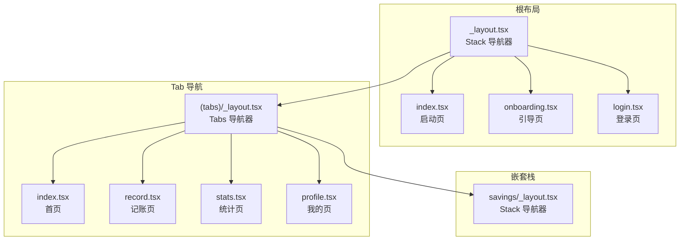
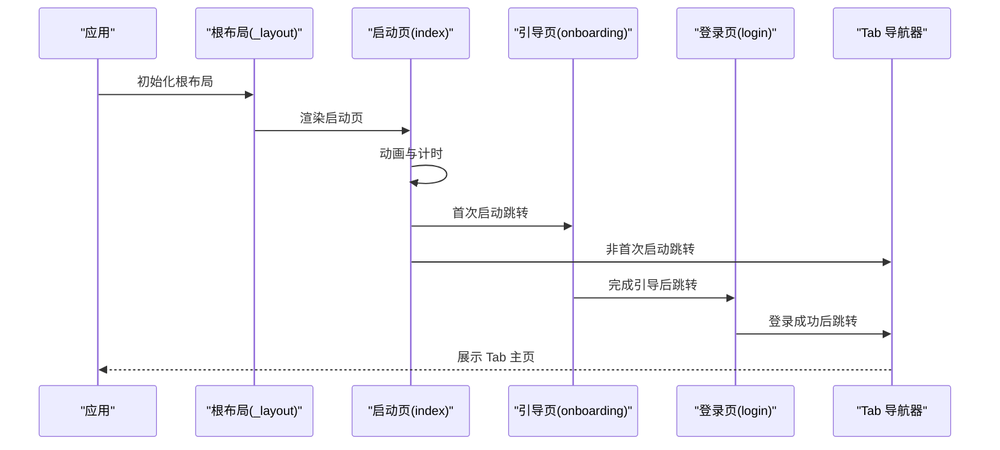
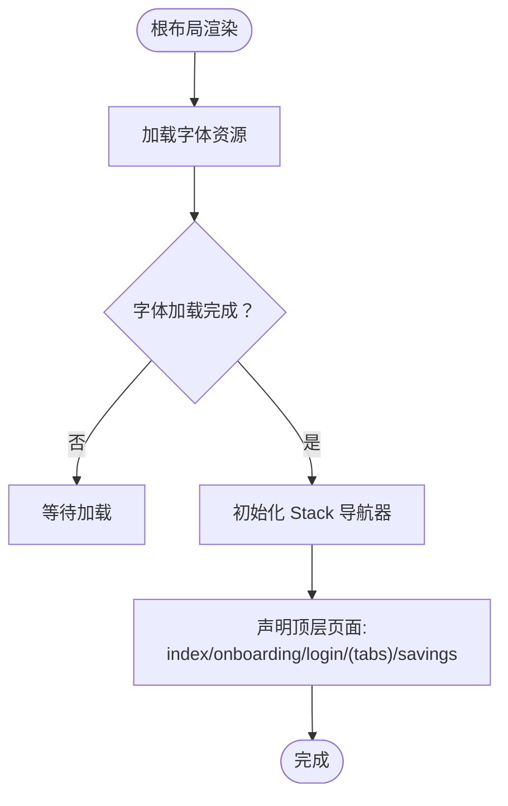
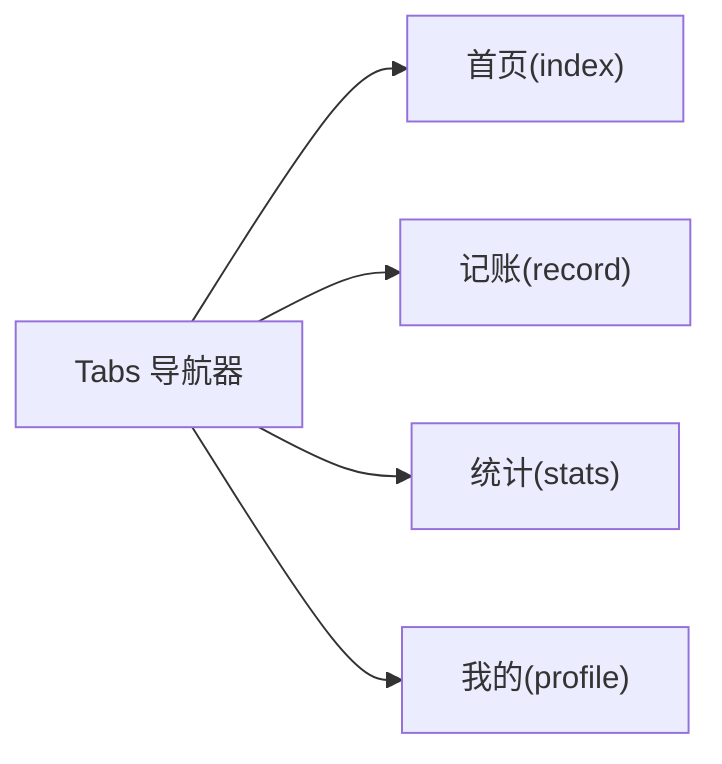
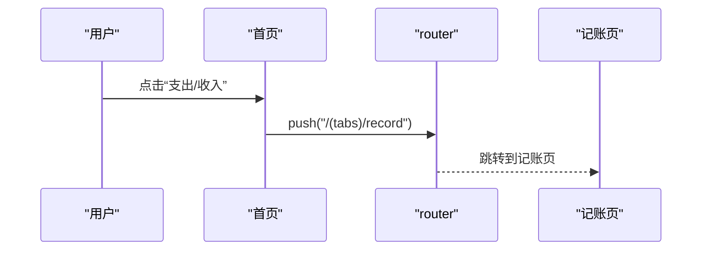
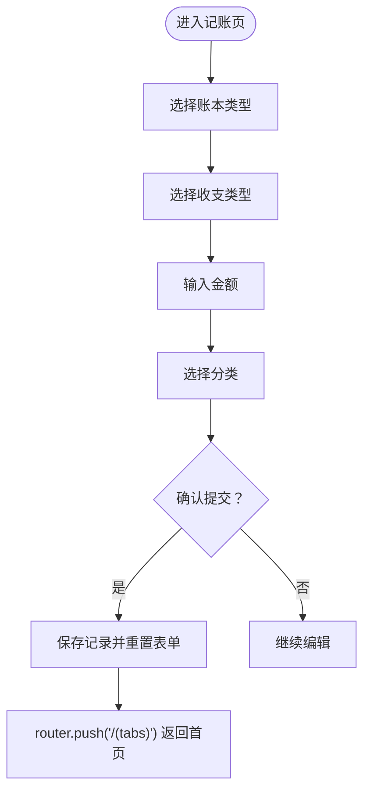
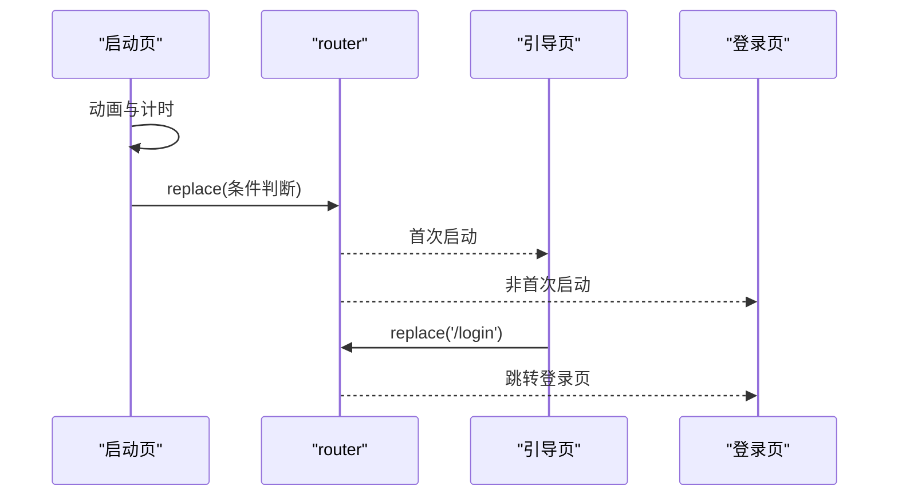
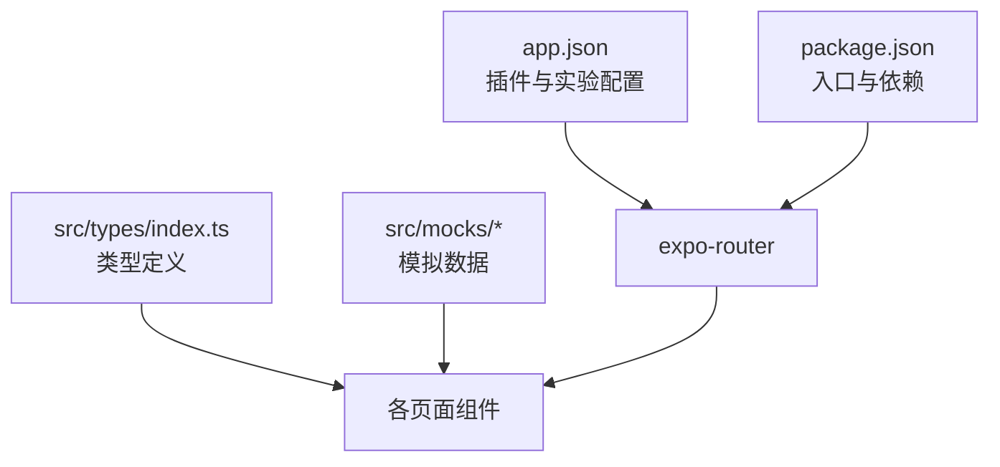

# 路由系统

<cite>
**本文档引用的文件**
- [src/app/_layout.tsx](file://src/app/_layout.tsx)
- [src/app/(tabs)/_layout.tsx](file://src/app/(tabs)/_layout.tsx)
- [src/app/(tabs)/index.tsx](file://src/app/(tabs)/index.tsx)
- [src/app/(tabs)/record.tsx](file://src/app/(tabs)/record.tsx)
- [src/app/(tabs)/stats.tsx](file://src/app/(tabs)/stats.tsx)
- [src/app/(tabs)/profile.tsx](file://src/app/(tabs)/profile.tsx)
- [src/app/savings/_layout.tsx](file://src/app/savings/_layout.tsx)
- [src/app/index.tsx](file://src/app/index.tsx)
- [src/app/onboarding.tsx](file://src/app/onboarding.tsx)
- [src/app/login.tsx](file://src/app/login.tsx)
- [app.json](file://app.json)
- [package.json](file://package.json)
- [src/types/index.ts](file://src/types/index.ts)
- [src/mocks/savings.ts](file://src/mocks/savings.ts)
- [src/mocks/records.ts](file://src/mocks/records.ts)
</cite>

## 目录
1. [简介](#简介)
2. [项目结构](#项目结构)
3. [核心组件](#核心组件)
4. [架构总览](#架构总览)
5. [详细组件分析](#详细组件分析)
6. [依赖关系分析](#依赖关系分析)
7. [性能考虑](#性能考虑)
8. [故障排除指南](#故障排除指南)
9. [结论](#结论)

## 简介
本文件系统性地文档化“攒钱记账”应用的路由体系，基于 Expo Router 的声明式路由架构。文档涵盖：
- 根布局与 Stack Navigator 的配置与页面导航模式
- 路由层级结构：从根布局到 Tab 导航再到具体页面的组织方式
- 路由参数传递、页面间跳转与模态页面的实现思路
- 路由配置的最佳实践与性能优化建议
- 路由调试与故障排除指南

## 项目结构
应用采用 Expo Router 的约定式路由，以文件夹结构表达路由层级。关键目录与文件如下：
- 根布局与顶层页面：src/app/_layout.tsx、src/app/index.tsx、src/app/onboarding.tsx、src/app/login.tsx
- Tab 导航：src/app/(tabs)/_layout.tsx 及其子页面 src/app/(tabs)/index.tsx、record.tsx、stats.tsx、profile.tsx
- 嵌套栈布局：src/app/savings/_layout.tsx
- 应用配置：app.json、package.json
- 类型与模拟数据：src/types/index.ts、src/mocks/*.ts

图表来源
- [src/app/_layout.tsx](file://src/app/_layout.tsx#L30-L45)
- [src/app/(tabs)/_layout.tsx](file://src/app/(tabs)/_layout.tsx#L40-L86)
- [src/app/savings/_layout.tsx](file://src/app/savings/_layout.tsx#L8-L18)

章节来源
- [src/app/_layout.tsx](file://src/app/_layout.tsx#L17-L48)
- [src/app/(tabs)/_layout.tsx](file://src/app/(tabs)/_layout.tsx#L39-L87)
- [src/app/savings/_layout.tsx](file://src/app/savings/_layout.tsx#L8-L18)

## 核心组件
- 根布局 Stack 导航器：在根布局中声明顶层页面与 Tab 容器，统一设置全局样式与动画。
- Tab 导航器：在 Tab 布局中声明四个标签页，自定义图标与样式。
- 嵌套栈布局：在特定功能域（如“攒钱目标”）内使用独立的 Stack 导航器，隔离页面样式与行为。
- 页面跳转：通过 router.push/router.replace 实现页面间跳转与替换。

章节来源
- [src/app/_layout.tsx](file://src/app/_layout.tsx#L30-L45)
- [src/app/(tabs)/_layout.tsx](file://src/app/(tabs)/_layout.tsx#L40-L86)
- [src/app/savings/_layout.tsx](file://src/app/savings/_layout.tsx#L8-L18)
- [src/app/(tabs)/index.tsx](file://src/app/(tabs)/index.tsx#L55-L58)
- [src/app/(tabs)/record.tsx](file://src/app/(tabs)/record.tsx#L128-L137)

## 架构总览
下图展示从启动到进入 Tab 主页的整体流程，以及登录后的跳转路径。

图表来源
- [src/app/_layout.tsx](file://src/app/_layout.tsx#L30-L45)
- [src/app/index.tsx](file://src/app/index.tsx#L52-L61)
- [src/app/onboarding.tsx](file://src/app/onboarding.tsx#L72-L82)
- [src/app/login.tsx](file://src/app/login.tsx#L51-L60)

## 详细组件分析

### 根布局与 Stack 导航器
- 根布局负责声明顶层页面序列：启动页、引导页、登录页、Tab 容器、以及特定功能域的嵌套栈。
- 设置全局样式：隐藏头部、背景色、滑动动画等。
- 使用手势容器包裹，确保手势交互兼容性。

图表来源
- [src/app/_layout.tsx](file://src/app/_layout.tsx#L17-L48)

章节来源
- [src/app/_layout.tsx](file://src/app/_layout.tsx#L30-L45)

### Tab 导航器与页面组织
- Tab 导航器声明四个标签页：首页、记账、统计、我的。
- 自定义 Tab 图标与选中状态样式，统一底部栏风格。
- 每个 Tab 页面独立维护自身状态与交互。

图表来源
- [src/app/(tabs)/_layout.tsx](file://src/app/(tabs)/_layout.tsx#L40-L86)

章节来源
- [src/app/(tabs)/_layout.tsx](file://src/app/(tabs)/_layout.tsx#L39-L87)

### 首页（今日概览）
- 首页展示资产概览、快速记账入口、攒钱目标进度与最近记录。
- 提供账本切换与通知入口。
- 快速记账按钮通过 router.push 跳转至记账页。

图表来源
- [src/app/(tabs)/index.tsx](file://src/app/(tabs)/index.tsx#L55-L58)

章节来源
- [src/app/(tabs)/index.tsx](file://src/app/(tabs)/index.tsx#L47-L260)

### 记账页
- 支持个人/公司账本切换、收支类型切换、金额输入与分类选择。
- 提供自定义数字键盘与完成按钮，完成后通过 router.push 返回首页。

图表来源
- [src/app/(tabs)/record.tsx](file://src/app/(tabs)/record.tsx#L94-L137)

章节来源
- [src/app/(tabs)/record.tsx](file://src/app/(tabs)/record.tsx#L94-L286)

### 统计页
- 提供账本筛选、时间范围筛选与多种可视化图表。
- 作为 Tab 页面之一，保持与首页一致的导航体验。

章节来源
- [src/app/(tabs)/stats.tsx](file://src/app/(tabs)/stats.tsx#L138-L258)

### 我的页
- 展示用户信息、资产概览与功能菜单。
- 提供退出登录按钮，点击后通过 router.replace 跳转至登录页。

章节来源
- [src/app/(tabs)/profile.tsx](file://src/app/(tabs)/profile.tsx#L56-L144)

### 嵌套栈布局（攒钱目标）
- 在 savings 目录下声明独立的 Stack 导航器，仅包含 index 页面。
- 用于隔离该功能域的页面样式与交互，避免与主 Tab 导航冲突。

章节来源
- [src/app/savings/_layout.tsx](file://src/app/savings/_layout.tsx#L8-L18)

### 启动页与引导页
- 启动页负责首屏动画与自动跳转逻辑，根据是否首次启动决定跳转路径。
- 引导页提供多步骤介绍，完成后跳转至登录页。

图表来源
- [src/app/index.tsx](file://src/app/index.tsx#L52-L61)
- [src/app/onboarding.tsx](file://src/app/onboarding.tsx#L72-L82)

章节来源
- [src/app/index.tsx](file://src/app/index.tsx#L15-L146)
- [src/app/onboarding.tsx](file://src/app/onboarding.tsx#L69-L128)

### 登录页
- 提供表单登录与第三方登录入口，登录成功后跳转至 Tab 主页。
- 使用 router.replace 替换当前路由栈，避免返回到登录页。

章节来源
- [src/app/login.tsx](file://src/app/login.tsx#L46-L176)

## 依赖关系分析
- 应用配置：app.json 中启用 expo-router 插件与 typedRoutes 实验特性；package.json 指定入口脚本与依赖版本。
- 类型系统：src/types/index.ts 定义账本类型、交易类型、记录与目标等核心类型，为路由与页面逻辑提供类型约束。
- 模拟数据：src/mocks/* 提供首页与统计页所需的 mock 数据，支撑页面渲染与交互演示。

图表来源
- [app.json](file://app.json#L21-L26)
- [package.json](file://package.json#L4-L34)
- [src/types/index.ts](file://src/types/index.ts#L5-L140)
- [src/mocks/savings.ts](file://src/mocks/savings.ts#L94-L110)
- [src/mocks/records.ts](file://src/mocks/records.ts#L100-L116)

章节来源
- [app.json](file://app.json#L1-L28)
- [package.json](file://package.json#L1-L42)
- [src/types/index.ts](file://src/types/index.ts#L1-L141)
- [src/mocks/savings.ts](file://src/mocks/savings.ts#L1-L111)
- [src/mocks/records.ts](file://src/mocks/records.ts#L1-L117)

## 性能考虑
- 路由懒加载：Expo Router 默认按需加载页面，减少初始包体与启动时间。
- 动画与资源：根布局中使用字体加载与启动屏控制，避免白屏与闪烁。
- 导航器分层：将 Tab 与嵌套栈分离，降低不必要的页面重建与状态同步成本。
- 路由栈管理：使用 router.replace 替换栈顶，避免深层路由回退链导致的内存占用。

## 故障排除指南
- 路由无法跳转
  - 检查目标路由名称是否与文件夹/文件名一致（例如 “(tabs)/record”）。
  - 确认页面导入的 router 是否来自 “expo-router”。

- Tab 图标不显示或样式异常
  - 检查 Tab 图标组件与样式映射，确保 focused 状态正确传递。
  - 确认底部栏样式与阴影配置未被覆盖。

- 首次启动未进入引导页
  - 检查启动页中的跳转逻辑与条件判断。
  - 确认字体加载完成后再执行跳转。

- 登录后仍停留在登录页
  - 检查登录页的跳转逻辑，确保使用 router.replace 并指向正确的 Tab 路径。

- 嵌套栈页面样式错乱
  - 确认嵌套栈布局的 screenOptions 未与根布局冲突。
  - 检查页面内容样式是否考虑了安全区域与 Tab 栏高度。

章节来源
- [src/app/_layout.tsx](file://src/app/_layout.tsx#L30-L45)
- [src/app/(tabs)/_layout.tsx](file://src/app/(tabs)/_layout.tsx#L40-L86)
- [src/app/index.tsx](file://src/app/index.tsx#L52-L61)
- [src/app/login.tsx](file://src/app/login.tsx#L51-L60)
- [src/app/savings/_layout.tsx](file://src/app/savings/_layout.tsx#L8-L18)

## 结论
本路由系统以 Expo Router 的声明式路由为核心，通过根布局 Stack 与 Tab 导航器清晰划分应用层级，结合嵌套栈实现功能域隔离。配合类型系统与模拟数据，既保证开发效率，又便于扩展与维护。遵循本文档的最佳实践与性能建议，可进一步提升用户体验与应用稳定性。