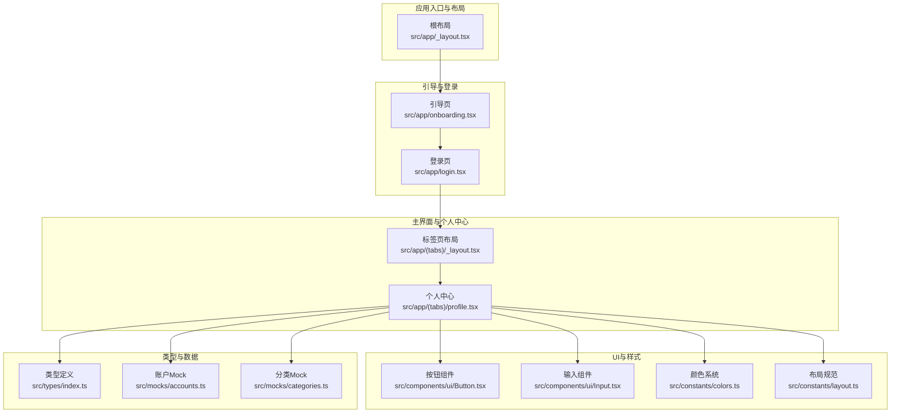
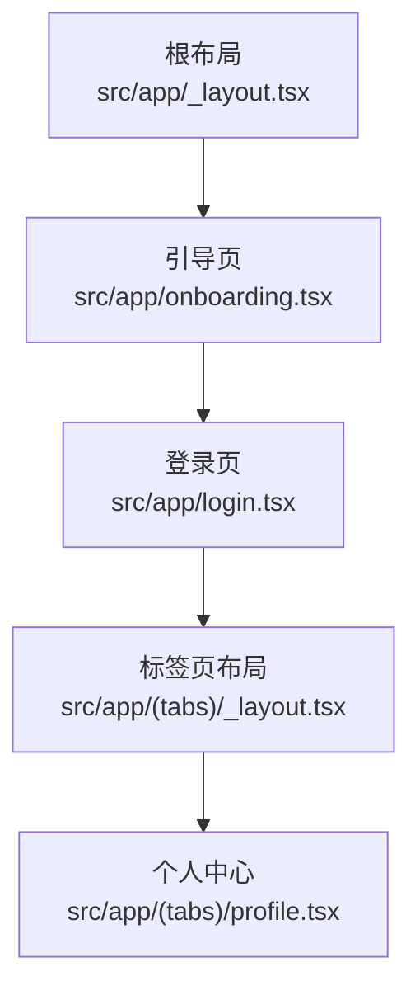
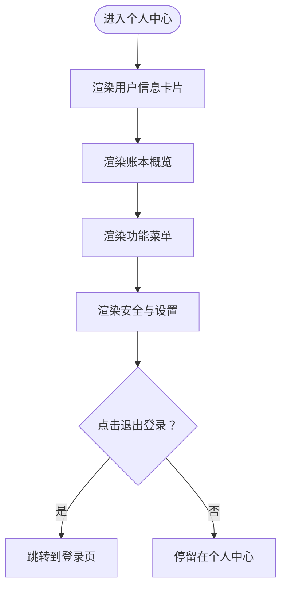
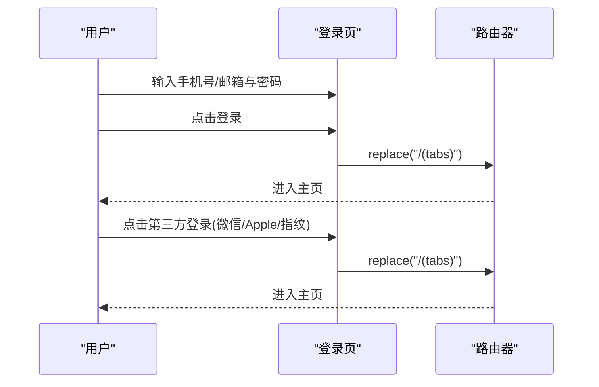
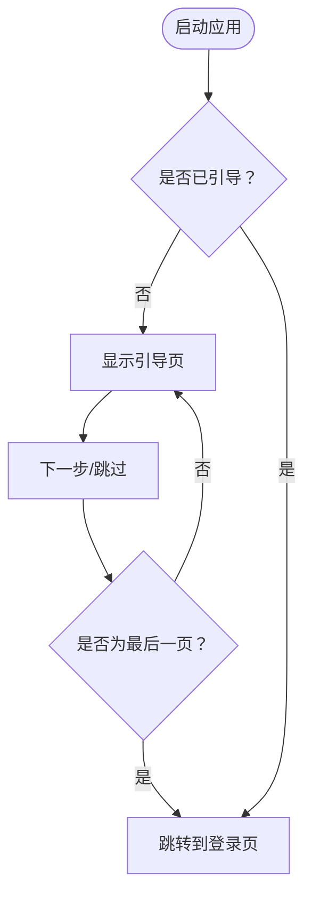
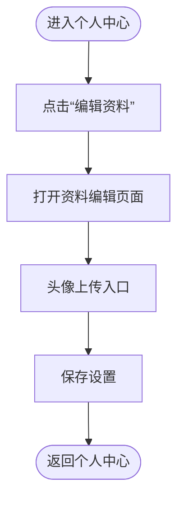
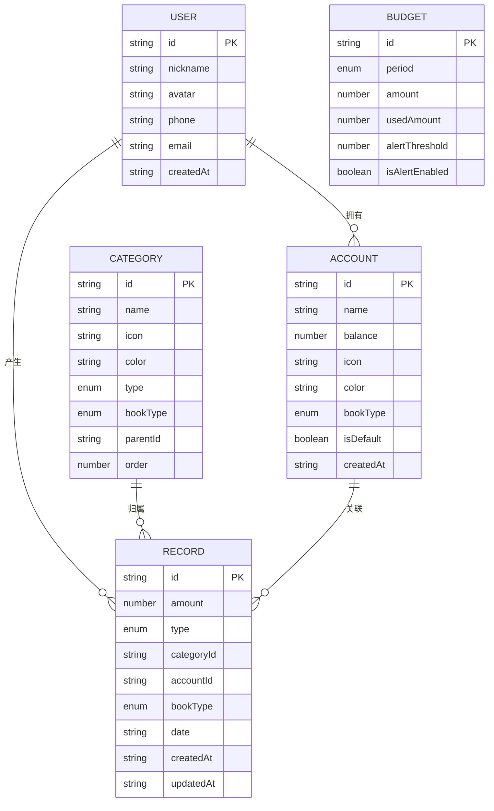
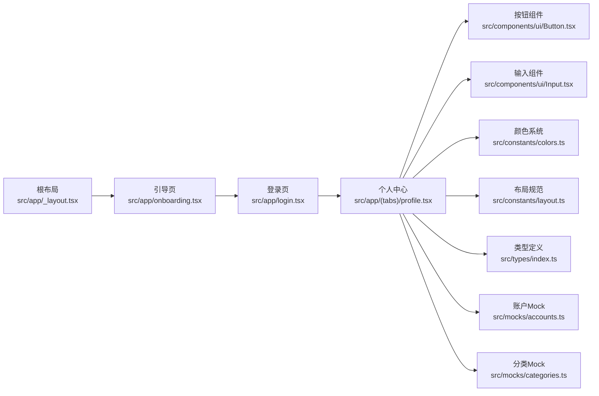

# 个人中心

<cite>
**本文引用的文件**
- [src/app/_layout.tsx](file://src/app/_layout.tsx)
- [src/app/onboarding.tsx](file://src/app/onboarding.tsx)
- [src/app/login.tsx](file://src/app/login.tsx)
- [src/app/(tabs)/profile.tsx](file://src/app/(tabs)/profile.tsx)
- [src/types/index.ts](file://src/types/index.ts)
- [src/constants/colors.ts](file://src/constants/colors.ts)
- [src/constants/layout.ts](file://src/constants/layout.ts)
- [src/components/ui/Button.tsx](file://src/components/ui/Button.tsx)
- [src/components/ui/Input.tsx](file://src/components/ui/Input.tsx)
- [src/mocks/accounts.ts](file://src/mocks/accounts.ts)
- [src/mocks/categories.ts](file://src/mocks/categories.ts)
- [package.json](file://package.json)
</cite>

## 目录
1. [简介](#简介)
2. [项目结构](#项目结构)
3. [核心组件](#核心组件)
4. [架构总览](#架构总览)
5. [详细组件分析](#详细组件分析)
6. [依赖关系分析](#依赖关系分析)
7. [性能考虑](#性能考虑)
8. [故障排查指南](#故障排查指南)
9. [结论](#结论)
10. [附录](#附录)

## 简介
本文件围绕“个人中心”功能进行系统化文档整理，覆盖以下方面：
- 用户信息管理：个人信息编辑入口、头像占位与上传扩展点、偏好设置入口
- 登录认证流程：账号密码登录、第三方登录（微信、Apple、指纹）与会话跳转
- 引导流程：首次使用向导、功能介绍与教程系统
- 设置选项清单：主题切换、通知配置、数据备份与安全设置
- 隐私保护与数据：本地存储与云端同步机制建议
- 扩展性：如何新增用户功能与个性化选项

## 项目结构
该应用采用基于路由的页面组织方式，个人中心位于标签页路由下，配合引导页与登录页形成完整的用户旅程；UI组件通过统一的常量与样式规范实现一致的视觉与交互体验。

**图表来源**
- [src/app/_layout.tsx](file://src/app/_layout.tsx#L30-L47)
- [src/app/onboarding.tsx](file://src/app/onboarding.tsx#L69-L129)
- [src/app/login.tsx](file://src/app/login.tsx#L46-L177)
- [src/app/(tabs)/profile.tsx](file://src/app/(tabs)/profile.tsx#L56-L146)
- [src/components/ui/Button.tsx](file://src/components/ui/Button.tsx#L36-L189)
- [src/components/ui/Input.tsx](file://src/components/ui/Input.tsx#L41-L138)
- [src/constants/colors.ts](file://src/constants/colors.ts#L6-L75)
- [src/constants/layout.ts](file://src/constants/layout.ts#L8-L154)
- [src/types/index.ts](file://src/types/index.ts#L11-L19)
- [src/mocks/accounts.ts](file://src/mocks/accounts.ts#L82-L90)
- [src/mocks/categories.ts](file://src/mocks/categories.ts#L51-L68)

**章节来源**
- [src/app/_layout.tsx](file://src/app/_layout.tsx#L17-L47)
- [src/app/onboarding.tsx](file://src/app/onboarding.tsx#L69-L129)
- [src/app/login.tsx](file://src/app/login.tsx#L46-L177)
- [src/app/(tabs)/profile.tsx](file://src/app/(tabs)/profile.tsx#L56-L146)

## 核心组件
- 个人中心页面：展示用户信息卡片、账本概览、功能菜单与安全设置入口，并提供退出登录跳转
- 登录页：支持账号密码登录与第三方登录（微信、Apple、指纹），并提供协议提示
- 引导页：首次启动的功能介绍与引导流程
- UI组件：统一的按钮与输入框组件，提供渐变、状态与尺寸规范
- 类型系统：用户、账户、分类、预算等核心数据模型
- Mock 数据：账户与分类的示例数据，用于演示与开发

**章节来源**
- [src/app/(tabs)/profile.tsx](file://src/app/(tabs)/profile.tsx#L56-L146)
- [src/app/login.tsx](file://src/app/login.tsx#L46-L177)
- [src/app/onboarding.tsx](file://src/app/onboarding.tsx#L69-L129)
- [src/components/ui/Button.tsx](file://src/components/ui/Button.tsx#L36-L189)
- [src/components/ui/Input.tsx](file://src/components/ui/Input.tsx#L41-L138)
- [src/types/index.ts](file://src/types/index.ts#L11-L19)
- [src/mocks/accounts.ts](file://src/mocks/accounts.ts#L82-L90)

## 架构总览
个人中心功能在整体架构中的位置如下：
- 根布局负责全局状态与动画配置
- 引导页与登录页完成用户旅程前置步骤
- 标签页布局承载主功能区，个人中心作为其中一屏
- UI组件与样式常量保证一致的视觉与交互体验
- 类型与Mock数据支撑前端展示与交互

**图表来源**
- [src/app/_layout.tsx](file://src/app/_layout.tsx#L30-L47)
- [src/app/onboarding.tsx](file://src/app/onboarding.tsx#L69-L129)
- [src/app/login.tsx](file://src/app/login.tsx#L46-L177)
- [src/app/(tabs)/profile.tsx](file://src/app/(tabs)/profile.tsx#L56-L146)

## 详细组件分析

### 个人中心页面
- 用户信息卡片：展示头像占位、用户名与ID，提供“编辑资料”入口
- 账本概览：显示个人与公司资产合计，便于快速查看
- 功能菜单：按模块划分，包含账本管理、数据工具、安全与设置
- 安全与设置：提供安全锁、消息通知、关于我们、帮助与反馈等入口
- 退出登录：跳转至登录页

**图表来源**
- [src/app/(tabs)/profile.tsx](file://src/app/(tabs)/profile.tsx#L56-L146)

**章节来源**
- [src/app/(tabs)/profile.tsx](file://src/app/(tabs)/profile.tsx#L56-L146)

### 登录认证流程
- 账号密码登录：表单收集手机号/邮箱与密码，提交后跳转主页
- 第三方登录：支持微信、Apple、指纹三种方式，均模拟登录成功后跳转主页
- 协议提示：登录即表示同意用户协议与隐私政策

**图表来源**
- [src/app/login.tsx](file://src/app/login.tsx#L46-L177)

**章节来源**
- [src/app/login.tsx](file://src/app/login.tsx#L46-L177)

### 引导流程
- 首次启动：三页引导内容，分别介绍双账本管理、攒钱目标与智能统计
- 导航：支持分页指示器跳转与“下一步/立即体验”按钮
- 结束：到达最后一项后跳转到登录页

**图表来源**
- [src/app/onboarding.tsx](file://src/app/onboarding.tsx#L69-L129)

**章节来源**
- [src/app/onboarding.tsx](file://src/app/onboarding.tsx#L69-L129)

### 设置选项清单
基于当前代码中出现的菜单项，可归纳如下设置入口（具体实现以后续迭代为准）：
- 账本管理
  - 账户管理：管理各类账户
  - 预算设置：控制消费支出
  - 账单提醒：定时提醒记账
- 数据工具
  - 数据导出：导出Excel/PDF
  - 账单打印
- 安全与设置
  - 安全锁：手势/指纹解锁
  - 消息通知
  - 关于我们
  - 帮助与反馈

**章节来源**
- [src/app/(tabs)/profile.tsx](file://src/app/(tabs)/profile.tsx#L108-L130)

### 用户信息管理
- 个人信息编辑：提供“编辑资料”入口，用于跳转到资料编辑页面
- 头像上传：当前为文字头像占位，预留上传入口以便扩展
- 偏好设置：通过“消息通知”等入口进入偏好配置

**图表来源**
- [src/app/(tabs)/profile.tsx](file://src/app/(tabs)/profile.tsx#L84-L86)

**章节来源**
- [src/app/(tabs)/profile.tsx](file://src/app/(tabs)/profile.tsx#L76-L91)

### 数据模型与类型
- 用户模型：包含id、昵称、头像、手机、邮箱、创建时间等字段
- 账户模型：名称、余额、图标、颜色、账本类型、默认账户标记等
- 分类模型：名称、图标、颜色、收支类型、账本类型、父级分类等
- 预算模型：周期、金额、已用金额、提醒阈值与开关等
- 统计模型：收支总计、分类统计、日度统计等

**图表来源**
- [src/types/index.ts](file://src/types/index.ts#L11-L19)
- [src/types/index.ts](file://src/types/index.ts#L21-L31)
- [src/types/index.ts](file://src/types/index.ts#L33-L43)
- [src/types/index.ts](file://src/types/index.ts#L87-L97)
- [src/types/index.ts](file://src/types/index.ts#L45-L60)

**章节来源**
- [src/types/index.ts](file://src/types/index.ts#L11-L19)
- [src/types/index.ts](file://src/types/index.ts#L21-L31)
- [src/types/index.ts](file://src/types/index.ts#L33-L43)
- [src/types/index.ts](file://src/types/index.ts#L87-L97)
- [src/types/index.ts](file://src/types/index.ts#L45-L60)

### UI组件与样式规范
- 按钮组件：支持多种变体（主色、次级、描边、幽灵、收支色）、尺寸与加载状态
- 输入组件：支持左侧/右侧图标、错误状态、聚焦渐变线、多行文本等
- 颜色系统：主色调、账本标识色、收支颜色、背景与文字色、状态色、灰度与透明遮罩
- 布局规范：圆角、间距、阴影、尺寸（按钮、输入框、头像、TabBar）、动画时长与层级

**章节来源**
- [src/components/ui/Button.tsx](file://src/components/ui/Button.tsx#L36-L189)
- [src/components/ui/Input.tsx](file://src/components/ui/Input.tsx#L41-L138)
- [src/constants/colors.ts](file://src/constants/colors.ts#L6-L75)
- [src/constants/layout.ts](file://src/constants/layout.ts#L8-L154)

## 依赖关系分析
- 路由与导航：根布局配置Stack路由，引导页、登录页与标签页布局串联用户旅程
- UI组件：个人中心页面依赖按钮与输入组件，统一风格与交互
- 样式与主题：颜色与布局常量被广泛使用，确保一致性
- 类型与数据：类型定义与Mock数据为页面渲染提供基础

**图表来源**
- [src/app/_layout.tsx](file://src/app/_layout.tsx#L30-L47)
- [src/app/onboarding.tsx](file://src/app/onboarding.tsx#L69-L129)
- [src/app/login.tsx](file://src/app/login.tsx#L46-L177)
- [src/app/(tabs)/profile.tsx](file://src/app/(tabs)/profile.tsx#L56-L146)
- [src/components/ui/Button.tsx](file://src/components/ui/Button.tsx#L36-L189)
- [src/components/ui/Input.tsx](file://src/components/ui/Input.tsx#L41-L138)
- [src/constants/colors.ts](file://src/constants/colors.ts#L6-L75)
- [src/constants/layout.ts](file://src/constants/layout.ts#L8-L154)
- [src/types/index.ts](file://src/types/index.ts#L11-L19)
- [src/mocks/accounts.ts](file://src/mocks/accounts.ts#L82-L90)
- [src/mocks/categories.ts](file://src/mocks/categories.ts#L51-L68)

**章节来源**
- [src/app/_layout.tsx](file://src/app/_layout.tsx#L30-L47)
- [src/app/onboarding.tsx](file://src/app/onboarding.tsx#L69-L129)
- [src/app/login.tsx](file://src/app/login.tsx#L46-L177)
- [src/app/(tabs)/profile.tsx](file://src/app/(tabs)/profile.tsx#L56-L146)
- [src/components/ui/Button.tsx](file://src/components/ui/Button.tsx#L36-L189)
- [src/components/ui/Input.tsx](file://src/components/ui/Input.tsx#L41-L138)
- [src/constants/colors.ts](file://src/constants/colors.ts#L6-L75)
- [src/constants/layout.ts](file://src/constants/layout.ts#L8-L154)
- [src/types/index.ts](file://src/types/index.ts#L11-L19)
- [src/mocks/accounts.ts](file://src/mocks/accounts.ts#L82-L90)
- [src/mocks/categories.ts](file://src/mocks/categories.ts#L51-L68)

## 性能考虑
- 页面滚动优化：个人中心使用滚动视图容器，避免过度嵌套导致的重绘
- 组件复用：按钮与输入组件统一样式与交互，减少重复逻辑
- 渐变与阴影：颜色与阴影常量集中管理，降低样式计算开销
- Mock 数据：在开发阶段使用本地Mock，避免网络请求带来的延迟

[本节为通用指导，不直接分析具体文件]

## 故障排查指南
- 登录页无法跳转：检查路由替换调用与页面导入路径
- 引导页分页异常：确认当前索引与跳转逻辑，确保最后一页正确跳转
- 个人中心菜单点击无效：检查菜单项的onPress绑定与路由跳转
- 样式不生效：核对颜色与布局常量的使用，确保主题变量正确

**章节来源**
- [src/app/login.tsx](file://src/app/login.tsx#L46-L177)
- [src/app/onboarding.tsx](file://src/app/onboarding.tsx#L69-L129)
- [src/app/(tabs)/profile.tsx](file://src/app/(tabs)/profile.tsx#L132-L139)
- [src/constants/colors.ts](file://src/constants/colors.ts#L6-L75)
- [src/constants/layout.ts](file://src/constants/layout.ts#L8-L154)

## 结论
个人中心功能以清晰的页面结构与统一的UI规范为基础，结合引导与登录流程，构建了完整的用户旅程。当前版本提供了信息展示、功能入口与安全设置的框架，后续可在以下方向扩展：
- 实现用户资料编辑与头像上传
- 完善通知与偏好设置的具体功能
- 引入本地存储与云端同步机制
- 新增主题切换与个性化选项

[本节为总结性内容，不直接分析具体文件]

## 附录

### 依赖与运行环境
- 使用 Expo Router 进行页面路由与导航
- 使用 Expo 生态组件（线性渐变、状态栏、启动屏等）
- 使用 Zustand 进行状态管理（在项目依赖中可见）

**章节来源**
- [package.json](file://package.json#L11-L34)