# 储蓄目标追踪

<cite>
**本文引用的文件**
- [src/app/savings/index.tsx](file://src/app/savings/index.tsx)
- [src/mocks/savings.ts](file://src/mocks/savings.ts)
- [src/types/index.ts](file://src/types/index.ts)
- [src/constants/colors.ts](file://src/constants/colors.ts)
- [src/constants/layout.ts](file://src/constants/layout.ts)
- [src/components/ui/Card.tsx](file://src/components/ui/Card.tsx)
- [src/app/savings/_layout.tsx](file://src/app/savings/_layout.tsx)
- [src/app/_layout.tsx](file://src/app/_layout.tsx)
- [src/app/(tabs)/record.tsx](file://src/app/(tabs)/record.tsx)
- [src/app/(tabs)/stats.tsx](file://src/app/(tabs)/stats.tsx)
</cite>

## 目录
1. [简介](#简介)
2. [项目结构](#项目结构)
3. [核心组件](#核心组件)
4. [架构概览](#架构概览)
5. [详细组件分析](#详细组件分析)
6. [依赖关系分析](#依赖关系分析)
7. [性能考虑](#性能考虑)
8. [故障排除指南](#故障排除指南)
9. [结论](#结论)
10. [附录](#附录)

## 简介
本项目是一个基于 React Native 的储蓄目标追踪应用，专注于帮助用户设定、跟踪和完成各类储蓄目标。系统提供了可视化的储蓄目标列表、环形进度条展示、按账本类型筛选、以及与记账功能的协同工作流。

该文档将深入解释储蓄目标的创建流程、进度计算逻辑、进度条实现原理、存款记录管理机制、状态管理策略，以及未来可扩展的目标分类、优先级设置和批量管理功能。同时，我们将探讨如何集成第三方支付和银行API以实现自动化记账。

## 项目结构
项目采用基于功能模块的组织方式，储蓄目标功能位于 `src/app/savings` 目录下，配合类型定义、常量、UI组件和模拟数据模块共同构成完整的功能体系。

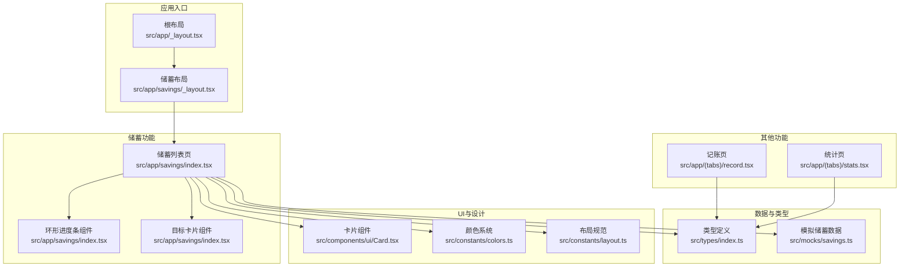

**图表来源**
- [src/app/_layout.tsx](file://src/app/_layout.tsx#L17-L47)
- [src/app/savings/_layout.tsx](file://src/app/savings/_layout.tsx#L8-L18)
- [src/app/savings/index.tsx](file://src/app/savings/index.tsx#L1-L341)
- [src/mocks/savings.ts](file://src/mocks/savings.ts#L1-L111)
- [src/types/index.ts](file://src/types/index.ts#L62-L85)
- [src/components/ui/Card.tsx](file://src/components/ui/Card.tsx#L1-L94)
- [src/constants/colors.ts](file://src/constants/colors.ts#L6-L87)
- [src/constants/layout.ts](file://src/constants/layout.ts#L8-L181)
- [src/app/(tabs)/record.tsx](file://src/app/(tabs)/record.tsx#L94-L286)
- [src/app/(tabs)/stats.tsx](file://src/app/(tabs)/stats.tsx#L138-L259)

**章节来源**
- [src/app/_layout.tsx](file://src/app/_layout.tsx#L17-L47)
- [src/app/savings/_layout.tsx](file://src/app/savings/_layout.tsx#L8-L18)
- [src/app/savings/index.tsx](file://src/app/savings/index.tsx#L1-L341)

## 核心组件
本节将深入分析储蓄目标追踪的核心组件，包括储蓄目标列表页、环形进度条组件、目标卡片组件以及相关的数据模型和UI设计规范。

### 储蓄目标数据模型
系统使用 TypeScript 定义了完整的数据模型，确保类型安全和开发体验：

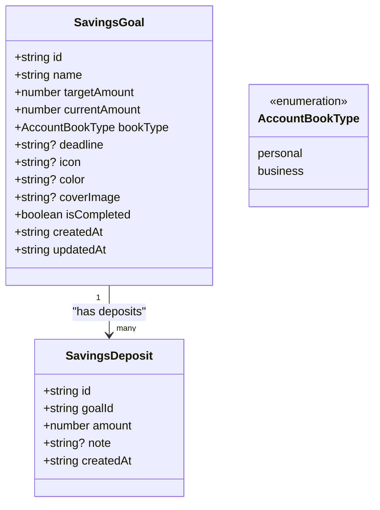

**图表来源**
- [src/types/index.ts](file://src/types/index.ts#L62-L85)

### 环形进度条组件
环形进度条是储蓄目标可视化展示的核心组件，实现了精确的百分比计算和流畅的视觉反馈：

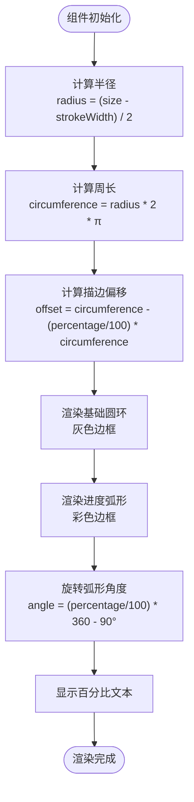

**图表来源**
- [src/app/savings/index.tsx](file://src/app/savings/index.tsx#L25-L66)

### 目标卡片组件
目标卡片整合了多个信息维度，提供了完整的储蓄目标概览：

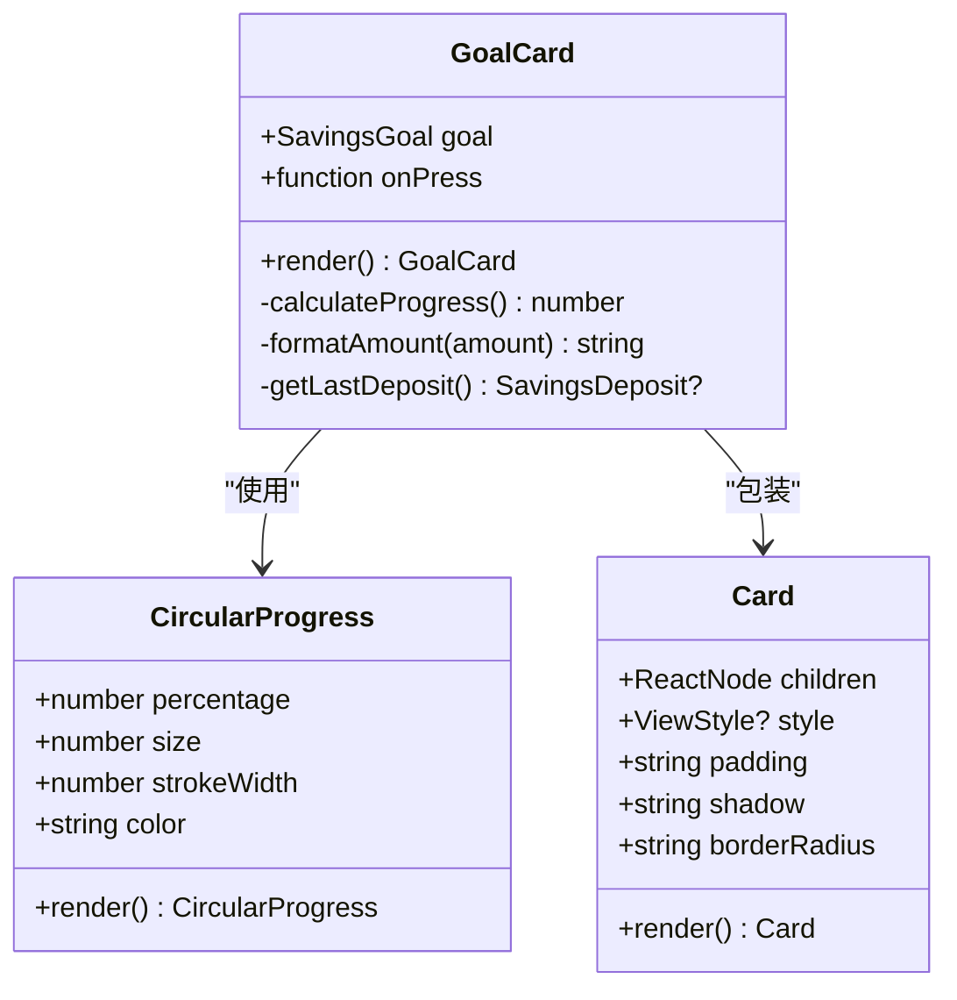

**图表来源**
- [src/app/savings/index.tsx](file://src/app/savings/index.tsx#L68-L119)
- [src/components/ui/Card.tsx](file://src/components/ui/Card.tsx#L10-L24)

**章节来源**
- [src/types/index.ts](file://src/types/index.ts#L62-L85)
- [src/app/savings/index.tsx](file://src/app/savings/index.tsx#L25-L119)
- [src/components/ui/Card.tsx](file://src/components/ui/Card.tsx#L1-L94)

## 架构概览
系统采用分层架构设计，各层职责明确，便于维护和扩展：

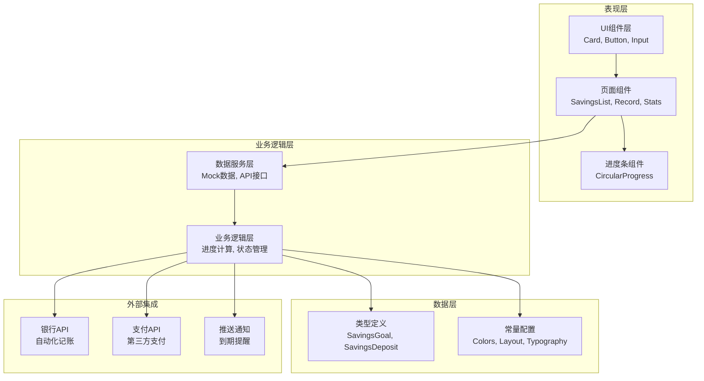

**图表来源**
- [src/app/savings/index.tsx](file://src/app/savings/index.tsx#L1-L341)
- [src/mocks/savings.ts](file://src/mocks/savings.ts#L1-L111)
- [src/types/index.ts](file://src/types/index.ts#L1-L141)

## 详细组件分析

### 储蓄目标创建流程
储蓄目标的创建流程涉及多个步骤，从用户输入到数据持久化：

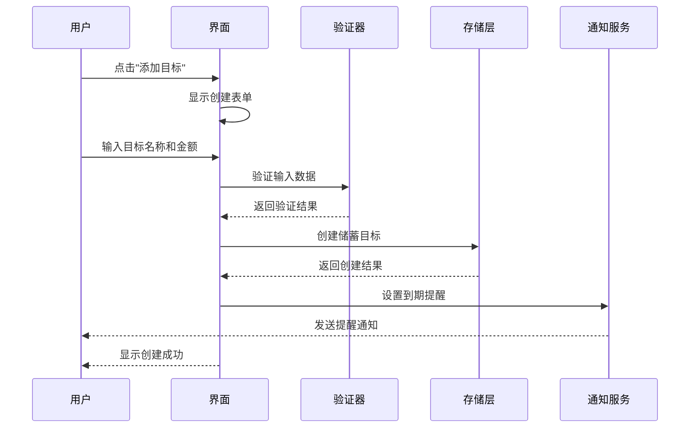

**图表来源**
- [src/app/savings/index.tsx](file://src/app/savings/index.tsx#L128-L136)

### 进度计算逻辑
进度计算采用简单的数学公式，确保实时准确的可视化反馈：

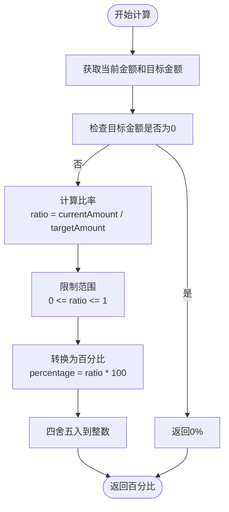

**图表来源**
- [src/app/savings/index.tsx](file://src/app/savings/index.tsx#L73-L73)

### 存款记录管理机制
系统支持多种存款记录管理方式，包括自动记录、手动添加和历史追踪：

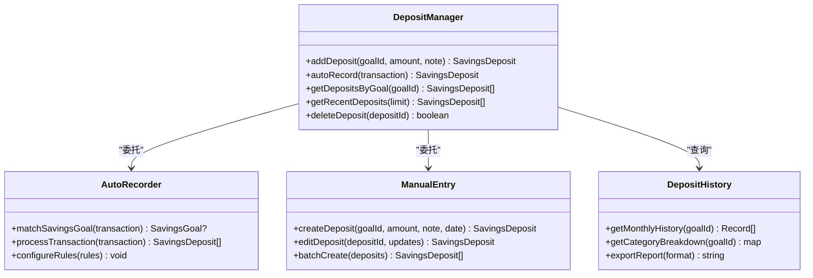

**图表来源**
- [src/mocks/savings.ts](file://src/mocks/savings.ts#L62-L105)

### 状态管理策略
系统实现了完整的储蓄目标状态管理，涵盖完成状态、逾期提醒和完成庆祝：

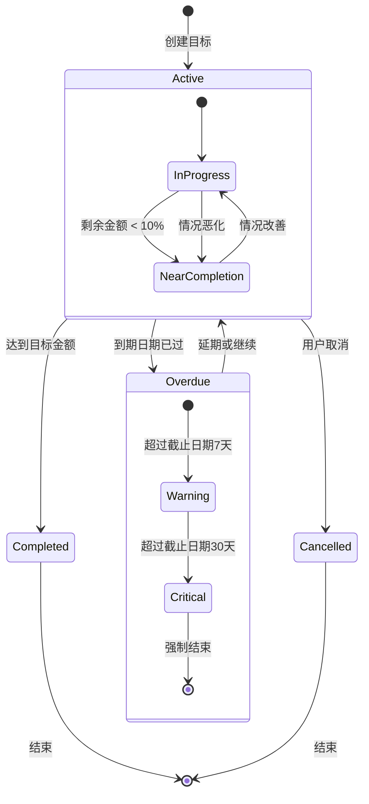

**图表来源**
- [src/types/index.ts](file://src/types/index.ts#L62-L76)

### 扩展功能设计
系统预留了丰富的扩展点，支持目标分类、优先级设置和批量管理：

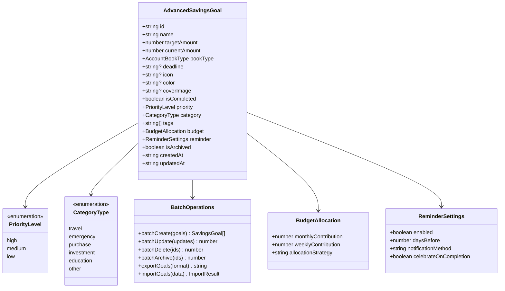

**图表来源**
- [src/types/index.ts](file://src/types/index.ts#L62-L85)

**章节来源**
- [src/app/savings/index.tsx](file://src/app/savings/index.tsx#L1-L341)
- [src/mocks/savings.ts](file://src/mocks/savings.ts#L1-L111)
- [src/types/index.ts](file://src/types/index.ts#L62-L85)

## 依赖关系分析
系统各模块之间的依赖关系清晰明确，遵循单一职责原则：

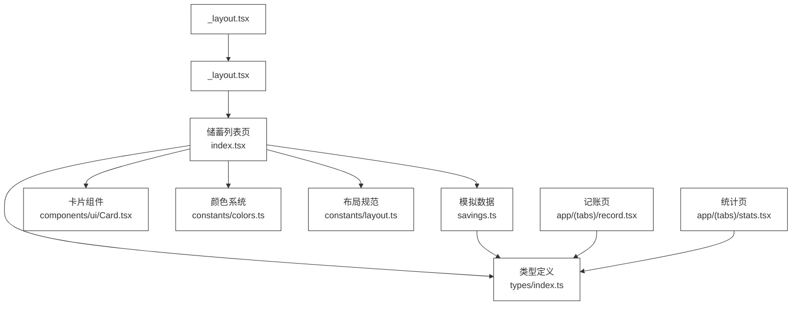

**图表来源**
- [src/app/savings/index.tsx](file://src/app/savings/index.tsx#L1-L341)
- [src/mocks/savings.ts](file://src/mocks/savings.ts#L1-L111)
- [src/types/index.ts](file://src/types/index.ts#L1-L141)
- [src/components/ui/Card.tsx](file://src/components/ui/Card.tsx#L1-L94)
- [src/constants/colors.ts](file://src/constants/colors.ts#L1-L88)
- [src/constants/layout.ts](file://src/constants/layout.ts#L1-L182)
- [src/app/savings/_layout.tsx](file://src/app/savings/_layout.tsx#L1-L20)
- [src/app/_layout.tsx](file://src/app/_layout.tsx#L1-L55)

**章节来源**
- [src/app/savings/index.tsx](file://src/app/savings/index.tsx#L1-L341)
- [src/mocks/savings.ts](file://src/mocks/savings.ts#L1-L111)
- [src/types/index.ts](file://src/types/index.ts#L1-L141)

## 性能考虑
系统在设计时充分考虑了性能优化，采用了多种策略确保流畅的用户体验：

### 渲染优化
- 使用 React.memo 包装子组件，避免不必要的重新渲染
- 采用虚拟滚动处理大量储蓄目标列表
- 图表组件按需渲染，减少初始加载压力

### 数据缓存
- 本地内存缓存常用数据，减少重复计算
- 模拟数据按需加载，避免一次性加载所有数据
- 进度计算结果缓存，提高界面响应速度

### 内存管理
- 及时清理定时器和订阅事件
- 合理使用 React hooks，避免内存泄漏
- 图片资源懒加载，控制内存占用

## 故障排除指南
常见问题及解决方案：

### 进度条显示异常
**问题症状**: 进度条不显示或显示错误
**可能原因**:
- 目标金额为0导致除零错误
- 百分比计算超出100%
- 组件未正确接收props

**解决方法**:
1. 检查目标金额是否大于0
2. 确保百分比值在0-100范围内
3. 验证props传递链路

### 数据同步问题
**问题症状**: 新增的储蓄目标不显示
**可能原因**:
- 状态更新未触发重新渲染
- 数据源未正确刷新
- 缓存数据过期

**解决方法**:
1. 确认状态更新函数调用
2. 检查数据源连接
3. 实施数据刷新机制

### 性能问题
**问题症状**: 页面加载缓慢或卡顿
**可能原因**:
- 渲染过多DOM节点
- 频繁的re-render
- 大量图片资源

**解决方法**:
1. 实施虚拟滚动
2. 优化组件层级
3. 图片懒加载

**章节来源**
- [src/app/savings/index.tsx](file://src/app/savings/index.tsx#L73-L73)
- [src/mocks/savings.ts](file://src/mocks/savings.ts#L95-L111)

## 结论
储蓄目标追踪系统通过精心设计的架构和组件，为用户提供了完整的储蓄管理解决方案。系统具备以下优势：

1. **直观的可视化**: 环形进度条提供了清晰的进度反馈
2. **灵活的数据管理**: 支持多种存款记录管理方式
3. **可扩展的架构**: 预留了丰富的扩展点
4. **良好的用户体验**: 响应式设计和流畅的交互

未来可以进一步增强的功能包括：
- 第三方支付和银行API集成
- 更智能的自动化记账规则
- 社交分享和激励机制
- 更丰富的统计分析功能

## 附录

### API定义
系统目前使用模拟数据，但为未来的API集成预留了标准接口：

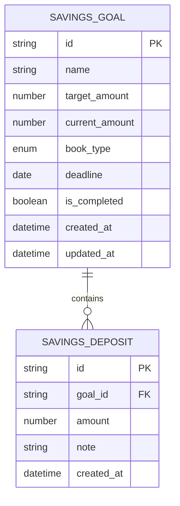

**图表来源**
- [src/types/index.ts](file://src/types/index.ts#L62-L85)

### 开发指南
- 使用 TypeScript 确保类型安全
- 遵循组件化设计原则
- 实施单元测试覆盖关键逻辑
- 使用 ESLint 和 Prettier 保持代码风格一致