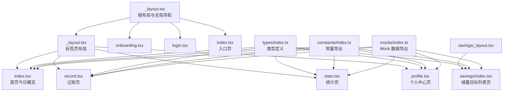
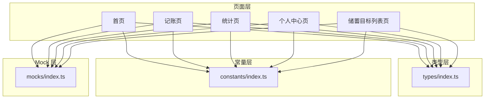
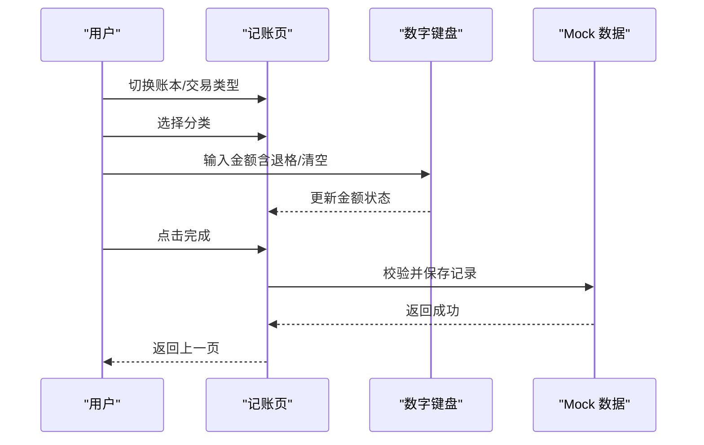
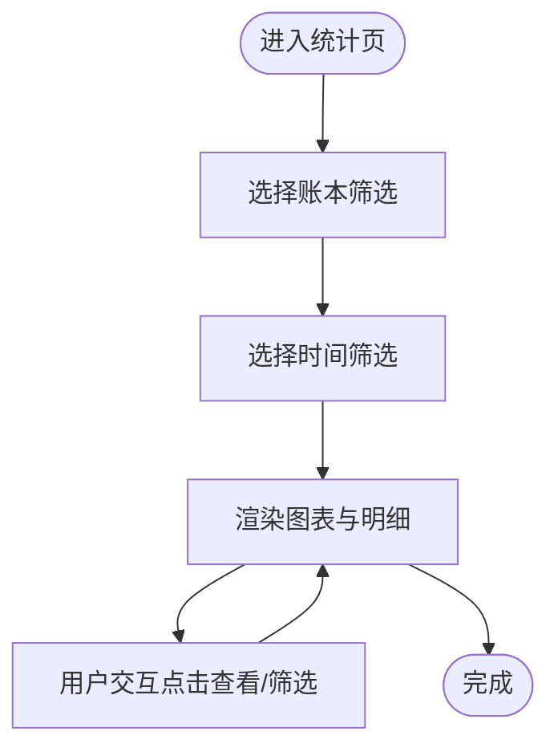
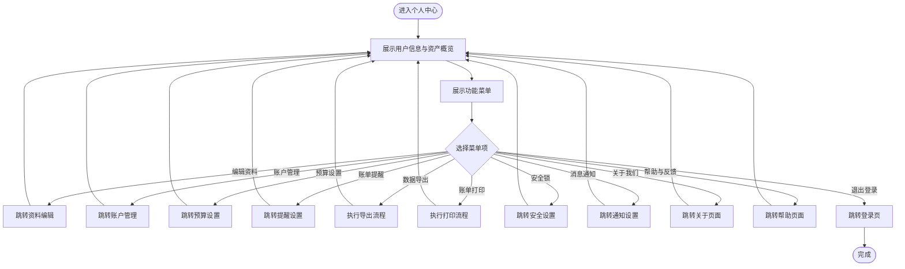
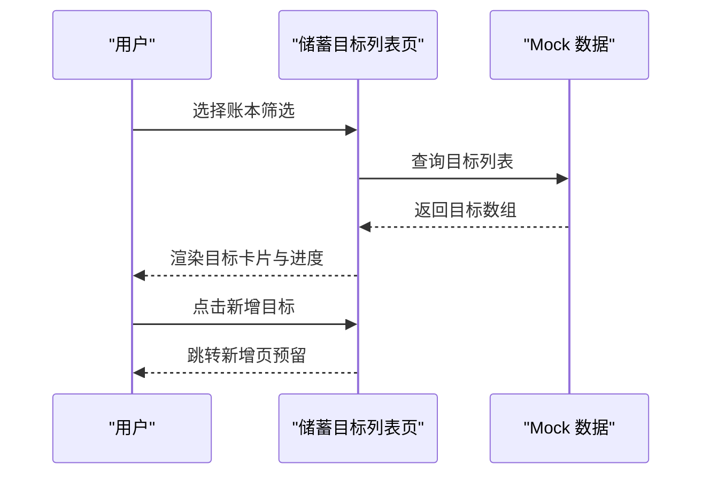
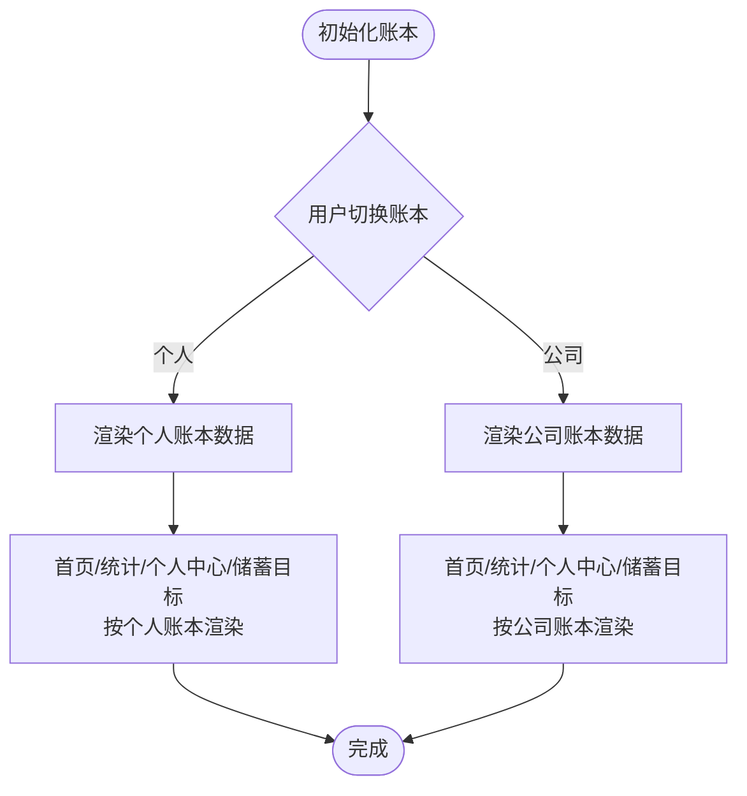
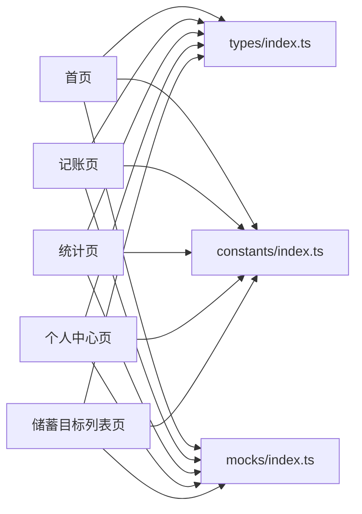

# 核心功能模块

<cite>
**本文引用的文件**
- [根布局文件](file://src/app/_layout.tsx)
- [入口页](file://src/app/index.tsx)
- [标签页布局](file://src/app/(tabs)/_layout.tsx)
- [首页（今日概览）](file://src/app/(tabs)/index.tsx)
- [记账页](file://src/app/(tabs)/record.tsx)
- [统计页](file://src/app/(tabs)/stats.tsx)
- [个人中心页](file://src/app/(tabs)/profile.tsx)
- [类型定义](file://src/types/index.ts)
- [常量导出](file://src/constants/index.ts)
- [Mock 数据导出](file://src/mocks/index.ts)
- [攒钱目标布局](file://src/app/savings/_layout.tsx)
- [攒钱目标列表页](file://src/app/savings/index.tsx)
</cite>

## 目录
1. [简介](#简介)
2. [项目结构](#项目结构)
3. [核心组件](#核心组件)
4. [架构总览](#架构总览)
5. [详细组件分析](#详细组件分析)
6. [依赖分析](#依赖分析)
7. [性能考虑](#性能考虑)
8. [故障排查指南](#故障排查指南)
9. [结论](#结论)
10. [附录](#附录)

## 简介
本文件面向产品经理与开发者，系统性梳理“攒钱记账”应用的核心功能模块，包括记账功能、统计分析、个人中心与储蓄目标追踪，并深入解析双账本（个人/企业）管理的设计理念与使用场景。文档从代码结构、数据流、用户交互与模块协作角度出发，辅以可视化图示，帮助快速理解与高效扩展。

## 项目结构
应用采用基于 Expo Router 的多页面路由组织方式，主入口通过根布局统一配置导航栈与全局样式；标签页布局负责底部 Tab 导航；各业务页面按功能域划分在 `(tabs)` 与 `savings` 目录下，类型定义与常量集中管理，Mock 数据用于演示与测试。

图表来源
- [根布局文件](file://src/app/_layout.tsx#L1-L61)
- [标签页布局](file://src/app/(tabs)/_layout.tsx#L1-L121)
- [首页（今日概览）](file://src/app/(tabs)/index.tsx#L1-L563)
- [记账页](file://src/app/(tabs)/record.tsx#L1-L522)
- [统计页](file://src/app/(tabs)/stats.tsx#L1-L535)
- [个人中心页](file://src/app/(tabs)/profile.tsx#L1-L295)
- [类型定义](file://src/types/index.ts#L1-L141)
- [常量导出](file://src/constants/index.ts#L1-L12)
- [Mock 数据导出](file://src/mocks/index.ts#L1-L9)
- [攒钱目标布局](file://src/app/savings/_layout.tsx#L1-L20)
- [攒钱目标列表页](file://src/app/savings/index.tsx#L1-L341)

章节来源
- [根布局文件](file://src/app/_layout.tsx#L1-L61)
- [标签页布局](file://src/app/(tabs)/_layout.tsx#L1-L121)
- [类型定义](file://src/types/index.ts#L1-L141)
- [常量导出](file://src/constants/index.ts#L1-L12)
- [Mock 数据导出](file://src/mocks/index.ts#L1-L9)

## 核心组件
- 记账功能：支持双账本切换、收支类型切换、分类选择、金额输入与备注，内置自定义数字键盘与确认提交流程。
- 统计分析：提供账本筛选、时间范围筛选、总览卡片、分类饼图、日度收支柱状图与分类明细。
- 个人中心：用户信息展示、资产概览、功能菜单与退出登录。
- 储蓄目标追踪：目标列表、账本筛选、环形进度展示与最近存入提示。
- 双账本管理：在首页与记账页提供“个人/公司”账本切换，贯穿资产概览、记录与目标展示。

章节来源
- [首页（今日概览）](file://src/app/(tabs)/index.tsx#L1-L563)
- [记账页](file://src/app/(tabs)/record.tsx#L1-L522)
- [统计页](file://src/app/(tabs)/stats.tsx#L1-L535)
- [个人中心页](file://src/app/(tabs)/profile.tsx#L1-L295)
- [攒钱目标列表页](file://src/app/savings/index.tsx#L1-L341)

## 架构总览
应用采用“页面级组件 + 类型/常量/Mock 层”的分层设计：
- 页面层：负责用户交互与视图渲染（首页、记账、统计、个人中心、储蓄目标）。
- 类型层：统一定义账本、交易、记录、目标、预算等核心数据模型。
- 常量层：颜色、排版、间距、阴影等 UI 规范，保证视觉一致性。
- Mock 层：提供示例数据与查询函数，支撑前端演示与测试。

图表来源
- [首页（今日概览）](file://src/app/(tabs)/index.tsx#L1-L563)
- [记账页](file://src/app/(tabs)/record.tsx#L1-L522)
- [统计页](file://src/app/(tabs)/stats.tsx#L1-L535)
- [个人中心页](file://src/app/(tabs)/profile.tsx#L1-L295)
- [攒钱目标列表页](file://src/app/savings/index.tsx#L1-L341)
- [类型定义](file://src/types/index.ts#L1-L141)
- [常量导出](file://src/constants/index.ts#L1-L12)
- [Mock 数据导出](file://src/mocks/index.ts#L1-L9)

## 详细组件分析

### 记账功能（record.tsx）
- 业务逻辑
  - 账本选择：支持“个人/公司”切换，影响分类与账户默认值。
  - 交易类型：收支切换，金额颜色随类型变化。
  - 分类选择：按账本与交易类型动态加载分类网格。
  - 金额输入：自定义数字键盘，支持小数点与退格，长按清空。
  - 提交：校验必填项后保存并返回。
- 数据流
  - 输入状态（账本、类型、金额、分类、备注）在本地维护。
  - 通过 Mock 查询分类数据，提交时输出记录对象。
- 用户交互
  - 顶部返回按钮、完成按钮与渐变确认区域增强操作反馈。
  - 分类卡片高亮表示选中状态，提升可发现性。

图表来源
- [记账页](file://src/app/(tabs)/record.tsx#L1-L522)
- [类型定义](file://src/types/index.ts#L1-L141)
- [Mock 数据导出](file://src/mocks/index.ts#L1-L9)

章节来源
- [记账页](file://src/app/(tabs)/record.tsx#L1-L522)

### 统计分析（stats.tsx）
- 业务逻辑
  - 账本筛选：全部/个人/公司三档。
  - 时间筛选：周/月/年三档。
  - 图表组件：简单饼图（分类占比）、柱状图（日收支对比）、分类明细（金额与百分比进度）。
- 数据流
  - 使用 Mock 数据生成图表与明细，不涉及真实持久化。
- 用户交互
  - 顶部日历按钮便于时间选择，筛选项高亮突出当前状态。

图表来源
- [统计页](file://src/app/(tabs)/stats.tsx#L1-L535)

章节来源
- [统计页](file://src/app/(tabs)/stats.tsx#L1-L535)

### 个人中心（profile.tsx）
- 业务逻辑
  - 用户信息展示与资料编辑入口。
  - 账本资产概览：个人与公司总资产展示。
  - 功能菜单：账户管理、预算设置、账单提醒、数据导出、打印、安全锁、消息通知、关于我们、帮助与反馈。
  - 退出登录：跳转至登录页。
- 数据流
  - 通过 Mock 获取资产总额，渲染概览卡片与菜单项。
- 用户交互
  - 菜单项带图标与副标题，危险操作（退出登录）以警示色标注。

图表来源
- [个人中心页](file://src/app/(tabs)/profile.tsx#L1-L295)
- [Mock 数据导出](file://src/mocks/index.ts#L1-L9)

章节来源
- [个人中心页](file://src/app/(tabs)/profile.tsx#L1-L295)

### 储蓄目标追踪（savings/index.tsx）
- 业务逻辑
  - 账本筛选：全部/个人/公司。
  - 目标列表：每项目标包含名称、目标金额、当前金额、截止日期、最近存入与环形进度。
  - 新增目标：预留跳转入口。
- 数据流
  - 通过 Mock 获取目标列表与存入记录，计算进度百分比并渲染环形进度。
- 用户交互
  - 目标卡片点击进入详情（预留），+ 按钮触发新增目标。

图表来源
- [攒钱目标列表页](file://src/app/savings/index.tsx#L1-L341)
- [Mock 数据导出](file://src/mocks/index.ts#L1-L9)

章节来源
- [攒钱目标列表页](file://src/app/savings/index.tsx#L1-L341)

### 双账本管理系统（个人/企业）
- 设计理念
  - 在首页与记账页提供“个人/公司”账本切换，确保资产、记录与目标在不同维度独立管理。
  - 类型层明确 AccountBookType，页面层通过状态驱动渲染差异。
- 使用场景
  - 个人日常收支与公司业务收支分离，避免混淆。
  - 统计与目标分别按账本聚合，满足多身份管理需求。
- 实现要点
  - 颜色与标识区分账本类型，分类与账户默认值随账本联动。
  - 首页资产卡片同时展示两个账本余额与今日变动。

图表来源
- [首页（今日概览）](file://src/app/(tabs)/index.tsx#L1-L563)
- [记账页](file://src/app/(tabs)/record.tsx#L1-L522)
- [统计页](file://src/app/(tabs)/stats.tsx#L1-L535)
- [个人中心页](file://src/app/(tabs)/profile.tsx#L1-L295)
- [攒钱目标列表页](file://src/app/savings/index.tsx#L1-L341)
- [类型定义](file://src/types/index.ts#L1-L141)

章节来源
- [首页（今日概览）](file://src/app/(tabs)/index.tsx#L1-L563)
- [记账页](file://src/app/(tabs)/record.tsx#L1-L522)
- [类型定义](file://src/types/index.ts#L1-L141)

## 依赖分析
- 页面对类型的依赖：所有页面均引入 AccountBookType、TransactionType、Record、SavingsGoal 等类型，确保数据结构一致。
- 页面对常量的依赖：颜色、字体、间距、阴影等统一来自常量模块，保障视觉规范。
- 页面对 Mock 的依赖：首页、记账、统计、个人中心与储蓄目标均通过 Mock 获取示例数据，便于演示与联调。
- 路由与布局：根布局统一管理栈与模态路由，标签页布局集中定义 Tab 图标与样式。

图表来源
- [首页（今日概览）](file://src/app/(tabs)/index.tsx#L1-L563)
- [记账页](file://src/app/(tabs)/record.tsx#L1-L522)
- [统计页](file://src/app/(tabs)/stats.tsx#L1-L535)
- [个人中心页](file://src/app/(tabs)/profile.tsx#L1-L295)
- [攒钱目标列表页](file://src/app/savings/index.tsx#L1-L341)
- [类型定义](file://src/types/index.ts#L1-L141)
- [常量导出](file://src/constants/index.ts#L1-L12)
- [Mock 数据导出](file://src/mocks/index.ts#L1-L9)

章节来源
- [类型定义](file://src/types/index.ts#L1-L141)
- [常量导出](file://src/constants/index.ts#L1-L12)
- [Mock 数据导出](file://src/mocks/index.ts#L1-L9)

## 性能考虑
- 渲染优化
  - 使用水平滚动容器展示分类与储蓄目标，避免垂直滚动压力。
  - 图表组件采用简单实现，减少复杂计算与重绘。
- 交互体验
  - 数字键盘与渐变按钮增强触控反馈，降低误操作概率。
  - Tab 标签图标与聚焦态提升导航清晰度。
- 数据加载
  - 当前使用 Mock 数据，建议在接入真实数据源时增加缓存与懒加载策略，减少首屏等待。

## 故障排查指南
- 记账页金额异常
  - 检查数字键盘输入逻辑，确保小数点仅出现一次且保留两位小数。
  - 确认退格与清空逻辑不会导致状态回退异常。
- 分类选择无效
  - 确认账本与交易类型切换后，分类列表已重新加载。
  - 检查选中态样式是否正确映射到当前账本颜色。
- 统计页无数据
  - 确认筛选条件（账本/时间）组合是否合理。
  - 检查 Mock 数据是否完整，图表渲染是否依赖缺失字段。
- 个人中心菜单点击无响应
  - 检查路由跳转逻辑与目标页面是否存在。
  - 确认危险操作（退出登录）的确认流程。
- 储蓄目标列表为空
  - 检查账本筛选是否限制了目标可见范围。
  - 确认 Mock 目标数据是否按账本正确过滤。

章节来源
- [记账页](file://src/app/(tabs)/record.tsx#L1-L522)
- [统计页](file://src/app/(tabs)/stats.tsx#L1-L535)
- [个人中心页](file://src/app/(tabs)/profile.tsx#L1-L295)
- [攒钱目标列表页](file://src/app/savings/index.tsx#L1-L341)

## 结论
“攒钱记账”应用围绕双账本管理构建核心业务闭环：记账页负责高频录入，首页提供资产概览与目标进度，统计页进行多维分析，个人中心承载设置与导出能力，储蓄目标页强化目标导向。页面层通过类型、常量与 Mock 的清晰分层，既保证了开发效率，也为后续接入真实数据与服务提供了良好扩展基础。

## 附录
- 开发建议
  - 将 Mock 替换为真实数据源时，建议引入状态管理库（如 Zustand 或 Context）集中管理账本、记录与目标状态。
  - 对图表组件进行封装，支持主题切换与数据驱动更新。
  - 为关键页面（记账、统计、储蓄目标）增加错误边界与加载状态，提升健壮性。
- 定制化方向
  - 支持多币种与汇率转换。
  - 增加预算模块与超支预警。
  - 扩展数据导入/导出格式（CSV/Excel/PDF）。
  - 引入手势/指纹等安全解锁选项。