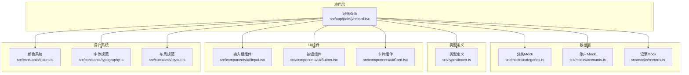
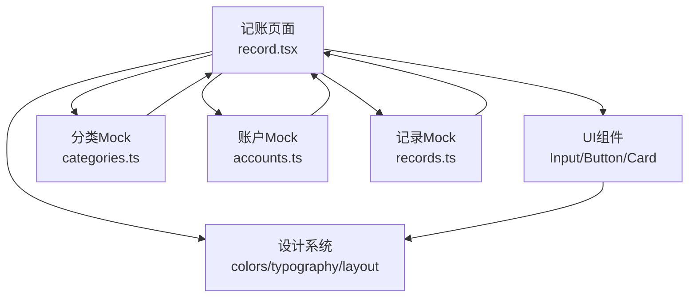
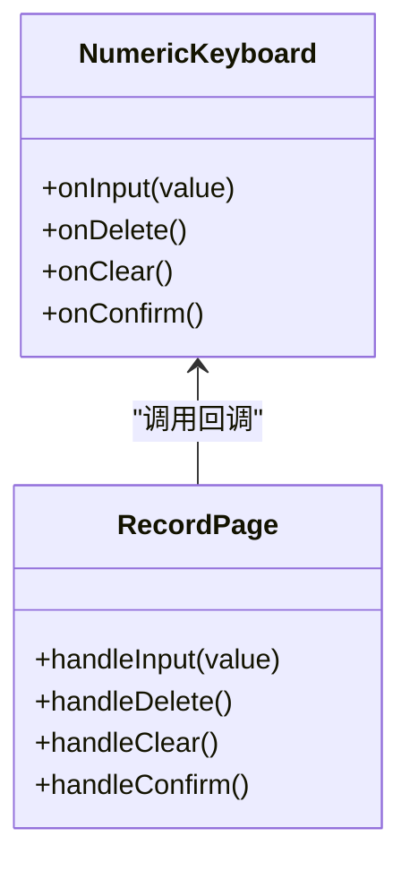
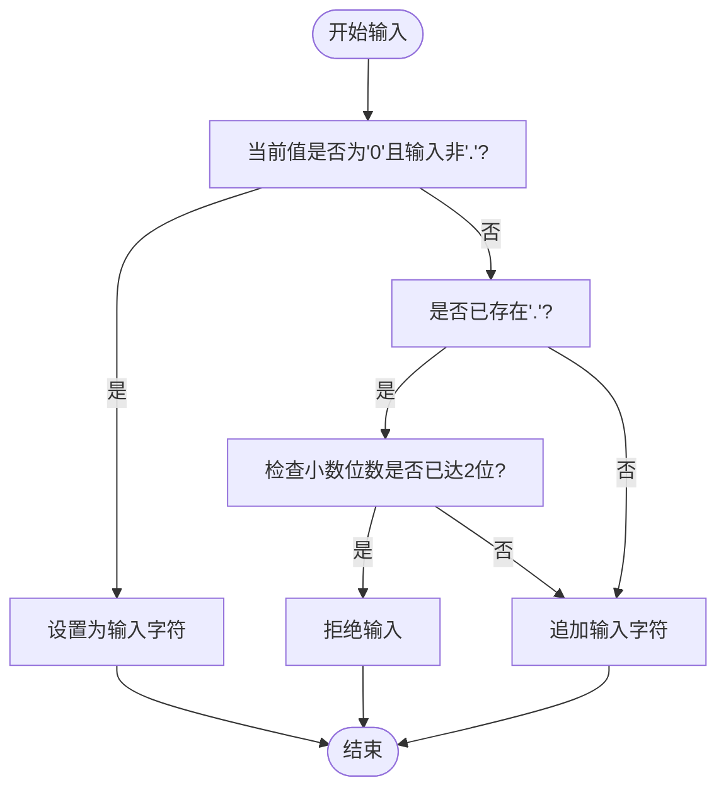
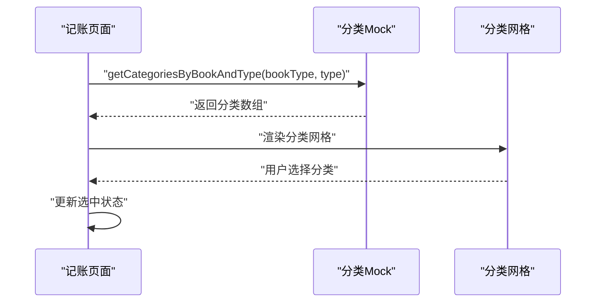
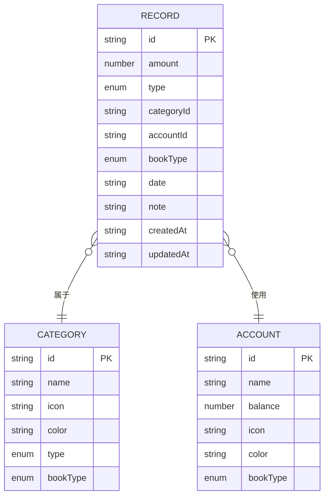
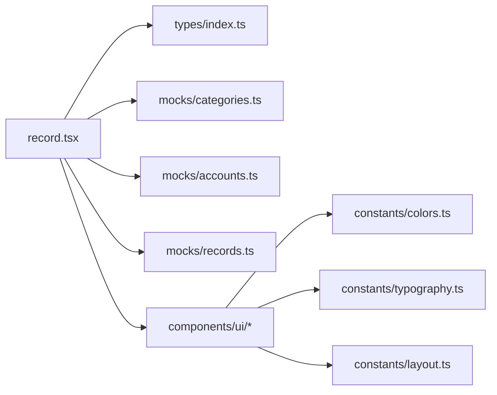

# 记账功能

<cite>
**本文引用的文件**
- [src/app/(tabs)/record.tsx](file://src/app/(tabs)/record.tsx)
- [src/mocks/categories.ts](file://src/mocks/categories.ts)
- [src/mocks/accounts.ts](file://src/mocks/accounts.ts)
- [src/mocks/records.ts](file://src/mocks/records.ts)
- [src/types/index.ts](file://src/types/index.ts)
- [src/components/ui/Input.tsx](file://src/components/ui/Input.tsx)
- [src/components/ui/Button.tsx](file://src/components/ui/Button.tsx)
- [src/components/ui/Card.tsx](file://src/components/ui/Card.tsx)
- [src/constants/colors.ts](file://src/constants/colors.ts)
- [src/constants/typography.ts](file://src/constants/typography.ts)
- [src/constants/layout.ts](file://src/constants/layout.ts)
- [package.json](file://package.json)
</cite>

## 目录
1. [简介](#简介)
2. [项目结构](#项目结构)
3. [核心组件](#核心组件)
4. [架构概览](#架构概览)
5. [详细组件分析](#详细组件分析)
6. [依赖关系分析](#依赖关系分析)
7. [性能考量](#性能考量)
8. [故障排查指南](#故障排查指南)
9. [结论](#结论)
10. [附录](#附录)

## 简介
本技术文档围绕“记账功能”展开，系统性阐述收支记录的完整流程，包括金额输入、分类选择、备注添加与数据验证；深入解析自定义数字键盘的实现原理，涵盖输入限制、格式化处理与确认机制；详解分类系统的动态加载与选择逻辑，包括颜色标识、图标显示与状态管理；给出完整的记账数据模型定义，明确字段约束、业务规则与数据完整性保障；最后提供错误处理、用户体验优化与性能考虑的最佳实践。

## 项目结构
该项目采用基于功能模块的组织方式，记账页面位于应用路由的标签页中，配套有类型定义、UI 组件与 Mock 数据，便于在无后端情况下进行前端开发与演示。

图表来源
- [src/app/(tabs)/record.tsx](file://src/app/(tabs)/record.tsx#L1-L521)
- [src/mocks/categories.ts](file://src/mocks/categories.ts#L1-L69)
- [src/mocks/accounts.ts](file://src/mocks/accounts.ts#L1-L91)
- [src/mocks/records.ts](file://src/mocks/records.ts#L1-L117)
- [src/types/index.ts](file://src/types/index.ts#L1-L141)
- [src/components/ui/Input.tsx](file://src/components/ui/Input.tsx#L1-L194)
- [src/components/ui/Button.tsx](file://src/components/ui/Button.tsx#L1-L204)
- [src/components/ui/Card.tsx](file://src/components/ui/Card.tsx#L1-L94)
- [src/constants/colors.ts](file://src/constants/colors.ts#L1-L88)
- [src/constants/typography.ts](file://src/constants/typography.ts#L1-L149)
- [src/constants/layout.ts](file://src/constants/layout.ts#L1-L182)

章节来源
- [src/app/(tabs)/record.tsx](file://src/app/(tabs)/record.tsx#L1-L521)
- [src/mocks/categories.ts](file://src/mocks/categories.ts#L1-L69)
- [src/mocks/accounts.ts](file://src/mocks/accounts.ts#L1-L91)
- [src/mocks/records.ts](file://src/mocks/records.ts#L1-L117)
- [src/types/index.ts](file://src/types/index.ts#L1-L141)
- [src/components/ui/Input.tsx](file://src/components/ui/Input.tsx#L1-L194)
- [src/components/ui/Button.tsx](file://src/components/ui/Button.tsx#L1-L204)
- [src/components/ui/Card.tsx](file://src/components/ui/Card.tsx#L1-L94)
- [src/constants/colors.ts](file://src/constants/colors.ts#L1-L88)
- [src/constants/typography.ts](file://src/constants/typography.ts#L1-L149)
- [src/constants/layout.ts](file://src/constants/layout.ts#L1-L182)

## 核心组件
- 记账页面：负责账本类型切换、收支类型切换、金额输入、分类选择、备注输入与提交确认。
- 自定义数字键盘：提供数字与删除输入、清空、确认等交互。
- 分类系统：根据账本类型与收支类型动态加载分类列表。
- 账户系统：提供个人与公司账户的 Mock 数据。
- UI 组件：输入框、按钮、卡片等基础组件，统一风格与交互。
- 设计系统：颜色、字体、布局规范，确保一致的视觉与交互体验。

章节来源
- [src/app/(tabs)/record.tsx](file://src/app/(tabs)/record.tsx#L94-L287)
- [src/mocks/categories.ts](file://src/mocks/categories.ts#L52-L69)
- [src/mocks/accounts.ts](file://src/mocks/accounts.ts#L71-L91)
- [src/components/ui/Input.tsx](file://src/components/ui/Input.tsx#L1-L194)
- [src/components/ui/Button.tsx](file://src/components/ui/Button.tsx#L1-L204)
- [src/components/ui/Card.tsx](file://src/components/ui/Card.tsx#L1-L94)
- [src/constants/colors.ts](file://src/constants/colors.ts#L1-L88)
- [src/constants/typography.ts](file://src/constants/typography.ts#L1-L149)
- [src/constants/layout.ts](file://src/constants/layout.ts#L1-L182)

## 架构概览
记账功能采用“页面 + 组件 + 设计系统 + Mock 数据”的分层架构：
- 页面层：记账页面集中处理用户交互与状态管理。
- 组件层：复用 UI 组件，保证一致性与可维护性。
- 设计系统层：颜色、字体、布局统一规范，提升用户体验。
- 数据层：使用 Mock 数据模拟分类、账户与记录，便于快速迭代。

图表来源
- [src/app/(tabs)/record.tsx](file://src/app/(tabs)/record.tsx#L1-L521)
- [src/mocks/categories.ts](file://src/mocks/categories.ts#L1-L69)
- [src/mocks/accounts.ts](file://src/mocks/accounts.ts#L1-L91)
- [src/mocks/records.ts](file://src/mocks/records.ts#L1-L117)
- [src/components/ui/Input.tsx](file://src/components/ui/Input.tsx#L1-L194)
- [src/components/ui/Button.tsx](file://src/components/ui/Button.tsx#L1-L204)
- [src/components/ui/Card.tsx](file://src/components/ui/Card.tsx#L1-L94)
- [src/constants/colors.ts](file://src/constants/colors.ts#L1-L88)
- [src/constants/typography.ts](file://src/constants/typography.ts#L1-L149)
- [src/constants/layout.ts](file://src/constants/layout.ts#L1-L182)

## 详细组件分析

### 自定义数字键盘实现
自定义数字键盘通过一个独立组件实现，支持数字输入、删除、清空与确认操作，并提供长按删除清空的能力，确保输入体验流畅。

图表来源
- [src/app/(tabs)/record.tsx](file://src/app/(tabs)/record.tsx#L27-L92)
- [src/app/(tabs)/record.tsx](file://src/app/(tabs)/record.tsx#L104-L137)

实现要点
- 键盘布局：3×3 数字键 + 删除键，右侧提供清空与确认按钮。
- 输入限制：禁止重复小数点、限制小数位数为两位；初始值为“0”，避免前导零。
- 删除与清空：删除键逐位删除，长按清空键一键清空。
- 确认机制：触发保存逻辑，重置表单并跳转首页。

章节来源
- [src/app/(tabs)/record.tsx](file://src/app/(tabs)/record.tsx#L27-L92)
- [src/app/(tabs)/record.tsx](file://src/app/(tabs)/record.tsx#L104-L137)

#### 输入限制与格式化流程

图表来源
- [src/app/(tabs)/record.tsx](file://src/app/(tabs)/record.tsx#L104-L114)

章节来源
- [src/app/(tabs)/record.tsx](file://src/app/(tabs)/record.tsx#L104-L114)

### 分类系统与动态加载
分类系统根据账本类型（个人/公司）与交易类型（支出/收入）动态加载对应分类列表，支持颜色标识与图标显示。

图表来源
- [src/app/(tabs)/record.tsx](file://src/app/(tabs)/record.tsx#L101)
- [src/mocks/categories.ts](file://src/mocks/categories.ts#L59-L69)

实现要点
- 动态加载：根据账本类型与交易类型筛选分类集合。
- 颜色标识：每个分类绑定颜色，用于视觉区分与选中态高亮。
- 图标显示：使用首字母作为图标内容，简洁直观。
- 状态管理：选中分类以背景色高亮，未选中保持默认样式。

章节来源
- [src/app/(tabs)/record.tsx](file://src/app/(tabs)/record.tsx#L101)
- [src/mocks/categories.ts](file://src/mocks/categories.ts#L59-L69)

### 记账数据模型与业务规则
记账数据模型定义了完整的字段约束与业务规则，确保数据完整性与一致性。

图表来源
- [src/types/index.ts](file://src/types/index.ts#L46-L60)
- [src/types/index.ts](file://src/types/index.ts#L33-L43)
- [src/types/index.ts](file://src/types/index.ts#L21-L31)

字段约束与业务规则
- 金额：数值类型，建议保留两位小数，确保精度。
- 交易类型：仅允许“支出/收入”，用于决定金额正负与统计口径。
- 账本类型：仅允许“个人/公司”，用于隔离不同账本的数据。
- 分类与账户：外键关联，确保记录指向有效分类与账户。
- 时间戳：createdAt/updatedAt 记录创建与更新时间，便于审计与排序。
- 备注：可选字符串，支持多行输入，便于补充说明。

章节来源
- [src/types/index.ts](file://src/types/index.ts#L46-L60)
- [src/types/index.ts](file://src/types/index.ts#L33-L43)
- [src/types/index.ts](file://src/types/index.ts#L21-L31)

### UI 组件与设计系统
- 输入框组件：支持左侧/右侧图标、多行文本、最大长度、聚焦状态与错误提示。
- 按钮组件：支持多种变体（主色、次级、描边、幽灵、收支色）、尺寸与加载状态。
- 卡片组件：统一圆角、阴影与内边距，适配不同场景的容器需求。
- 设计系统：颜色体系（主色、账本色、收支色、状态色、灰度）、字体规范（字号、字重、行高）与布局规范（圆角、间距、阴影、尺寸）。

章节来源
- [src/components/ui/Input.tsx](file://src/components/ui/Input.tsx#L1-L194)
- [src/components/ui/Button.tsx](file://src/components/ui/Button.tsx#L1-L204)
- [src/components/ui/Card.tsx](file://src/components/ui/Card.tsx#L1-L94)
- [src/constants/colors.ts](file://src/constants/colors.ts#L1-L88)
- [src/constants/typography.ts](file://src/constants/typography.ts#L1-L149)
- [src/constants/layout.ts](file://src/constants/layout.ts#L1-L182)

## 依赖关系分析
记账页面依赖于分类与账户的 Mock 数据，以及 UI 组件与设计系统；类型定义贯穿于数据层与页面层，确保强类型约束。

图表来源
- [src/app/(tabs)/record.tsx](file://src/app/(tabs)/record.tsx#L1-L521)
- [src/types/index.ts](file://src/types/index.ts#L1-L141)
- [src/mocks/categories.ts](file://src/mocks/categories.ts#L1-L69)
- [src/mocks/accounts.ts](file://src/mocks/accounts.ts#L1-L91)
- [src/mocks/records.ts](file://src/mocks/records.ts#L1-L117)
- [src/components/ui/Input.tsx](file://src/components/ui/Input.tsx#L1-L194)
- [src/components/ui/Button.tsx](file://src/components/ui/Button.tsx#L1-L204)
- [src/components/ui/Card.tsx](file://src/components/ui/Card.tsx#L1-L94)
- [src/constants/colors.ts](file://src/constants/colors.ts#L1-L88)
- [src/constants/typography.ts](file://src/constants/typography.ts#L1-L149)
- [src/constants/layout.ts](file://src/constants/layout.ts#L1-L182)

章节来源
- [src/app/(tabs)/record.tsx](file://src/app/(tabs)/record.tsx#L1-L521)
- [src/types/index.ts](file://src/types/index.ts#L1-L141)
- [src/mocks/categories.ts](file://src/mocks/categories.ts#L1-L69)
- [src/mocks/accounts.ts](file://src/mocks/accounts.ts#L1-L91)
- [src/mocks/records.ts](file://src/mocks/records.ts#L1-L117)
- [src/components/ui/Input.tsx](file://src/components/ui/Input.tsx#L1-L194)
- [src/components/ui/Button.tsx](file://src/components/ui/Button.tsx#L1-L204)
- [src/components/ui/Card.tsx](file://src/components/ui/Card.tsx#L1-L94)
- [src/constants/colors.ts](file://src/constants/colors.ts#L1-L88)
- [src/constants/typography.ts](file://src/constants/typography.ts#L1-L149)
- [src/constants/layout.ts](file://src/constants/layout.ts#L1-L182)

## 性能考量
- 渲染优化：分类网格使用水平滚动视图，避免一次性渲染过多节点；金额显示采用纯文本渲染，减少复杂布局计算。
- 事件处理：键盘按键使用轻量级点击事件，避免频繁重渲染；长按清空使用一次性的长按处理。
- 数据访问：分类与账户数据来自本地 Mock，读取开销低；记录查询使用过滤与排序，建议在实际业务中引入分页或索引。
- 组件复用：UI 组件统一设计规范，减少样式计算与重排；渐变背景使用预设颜色，避免运行时计算。
- 内存管理：页面卸载时自动释放状态与事件监听，避免内存泄漏。

## 故障排查指南
常见问题与解决方案
- 金额输入异常
  - 症状：重复小数点、小数位超过两位、前导零显示。
  - 排查：检查输入处理逻辑，确认小数点判断与小数位限制。
  - 参考路径：[金额输入处理](file://src/app/(tabs)/record.tsx#L104-L114)
- 分类不显示或显示错误
  - 症状：切换账本或收支类型后分类未更新。
  - 排查：确认分类加载函数参数与返回值；检查账本类型与交易类型的匹配。
  - 参考路径：[分类加载函数](file://src/mocks/categories.ts#L59-L69)
- 选中状态不生效
  - 症状：分类选中后无高亮。
  - 排查：检查选中状态更新逻辑与样式条件渲染。
  - 参考路径：[分类选中逻辑](file://src/app/(tabs)/record.tsx#L233-L251)
- 提交失败或无响应
  - 症状：点击完成无反应或控制台报错。
  - 排查：确认保存逻辑与路由跳转；检查网络请求或本地存储实现。
  - 参考路径：[确认处理](file://src/app/(tabs)/record.tsx#L128-L137)

章节来源
- [src/app/(tabs)/record.tsx](file://src/app/(tabs)/record.tsx#L104-L137)
- [src/mocks/categories.ts](file://src/mocks/categories.ts#L59-L69)

## 结论
记账功能通过清晰的页面结构、统一的设计系统与完善的 Mock 数据，实现了从金额输入到分类选择、备注添加与确认提交的完整流程。自定义数字键盘提供了良好的输入体验，分类系统支持动态加载与状态管理，数据模型明确了字段约束与业务规则。结合本文提供的最佳实践与故障排查指南，可在后续接入真实数据源与后端服务时，进一步提升系统的稳定性与可维护性。

## 附录
- 技术栈与依赖
  - React Native、Expo Router、Linear Gradient、Zustand 等。
  - 参考路径：[依赖清单](file://package.json#L11-L34)

章节来源
- [package.json](file://package.json#L11-L34)