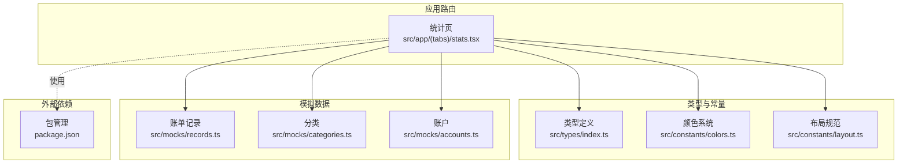
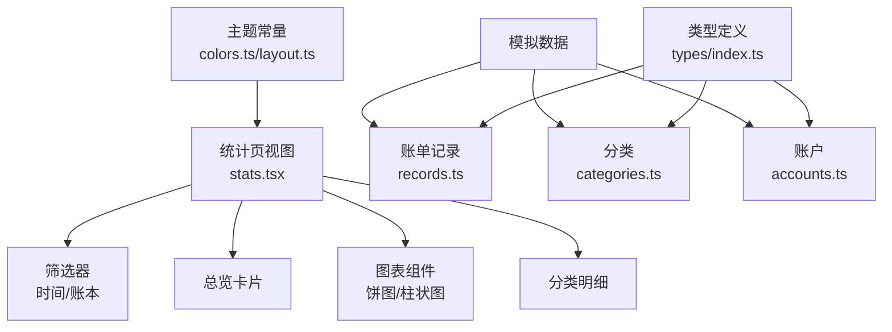
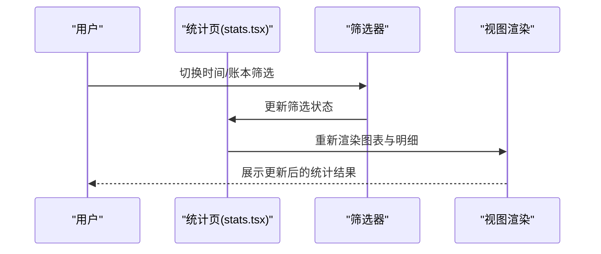
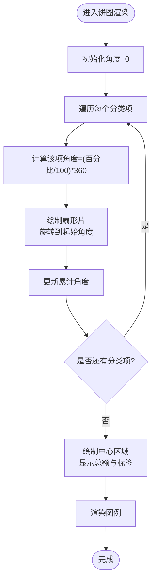
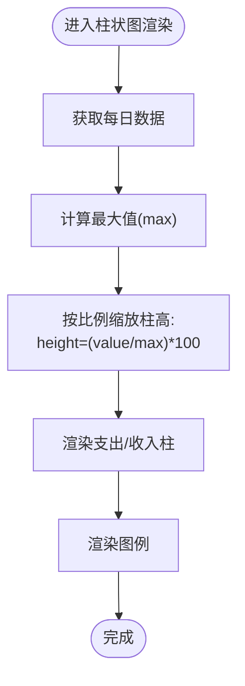
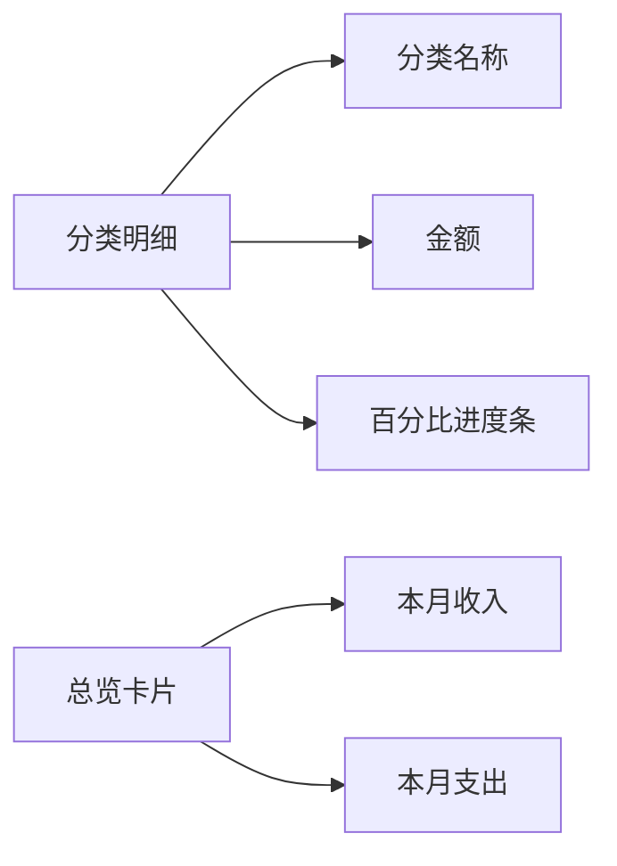
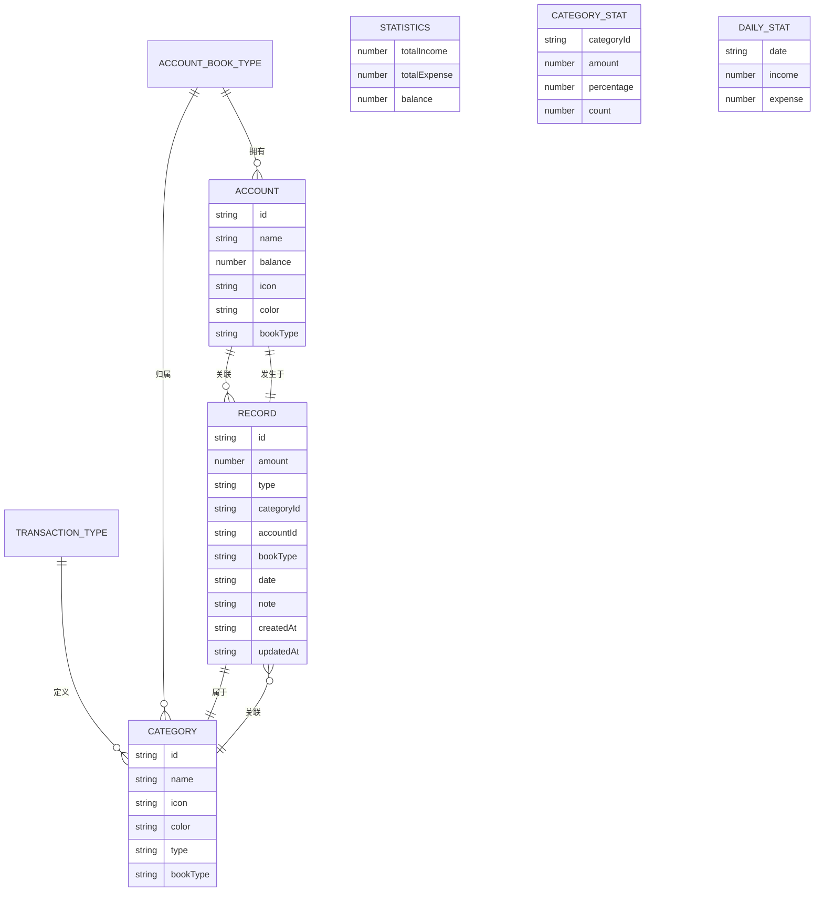
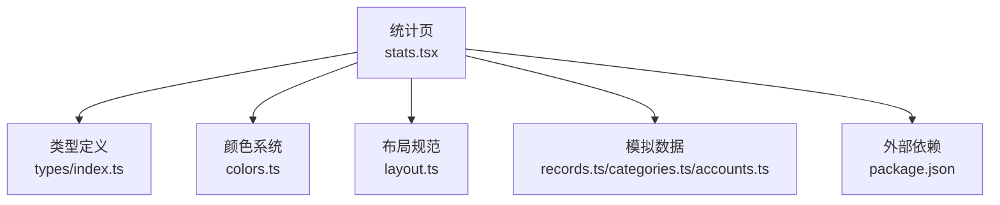
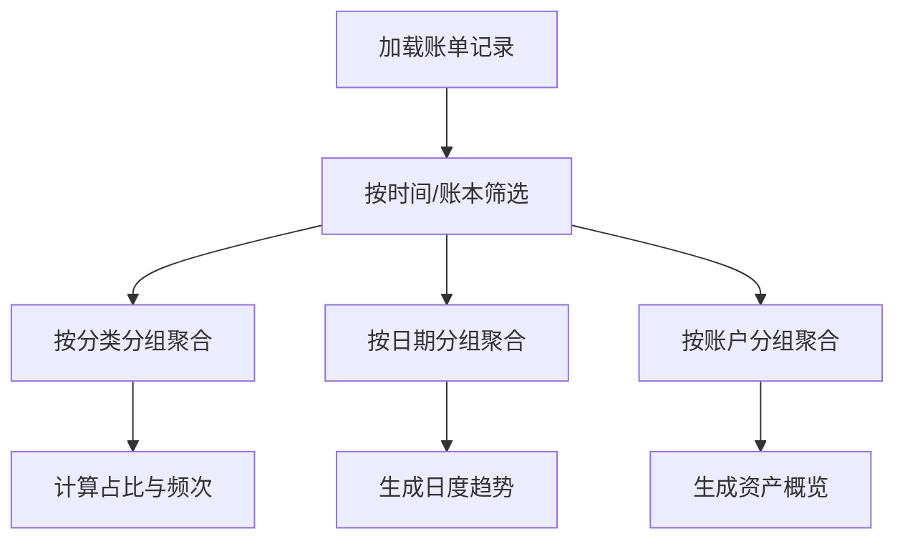

# 财务统计分析

<cite>
**本文引用的文件**
- [src/app/(tabs)/stats.tsx](file://src/app/(tabs)/stats.tsx)
- [src/mocks/records.ts](file://src/mocks/records.ts)
- [src/mocks/categories.ts](file://src/mocks/categories.ts)
- [src/mocks/accounts.ts](file://src/mocks/accounts.ts)
- [src/types/index.ts](file://src/types/index.ts)
- [src/constants/colors.ts](file://src/constants/colors.ts)
- [src/constants/layout.ts](file://src/constants/layout.ts)
- [package.json](file://package.json)
</cite>

## 目录
1. [简介](#简介)
2. [项目结构](#项目结构)
3. [核心组件](#核心组件)
4. [架构概览](#架构概览)
5. [详细组件分析](#详细组件分析)
6. [依赖分析](#依赖分析)
7. [性能考虑](#性能考虑)
8. [故障排查指南](#故障排查指南)
9. [结论](#结论)
10. [附录](#附录)

## 简介
本技术文档聚焦于财务统计分析模块，围绕收支统计的计算逻辑、图表组件集成与配置、统计数据聚合与缓存策略、性能优化、统计维度设计（按类别、时间、账户等多维分析）、数据精度与异常值处理以及报表生成与扩展实践进行系统化阐述。当前仓库中的统计页面采用本地模拟数据与自绘图表组件实现，便于演示与快速迭代；后续可无缝对接真实数据源与第三方可视化库。

## 项目结构
财务统计分析模块位于应用的标签页路由中，配合类型定义、常量与模拟数据共同构成完整的前端统计视图与数据模型支撑。

**图表来源**
- [src/app/(tabs)/stats.tsx](file://src/app/(tabs)/stats.tsx#L1-L535)
- [src/types/index.ts](file://src/types/index.ts#L1-L141)
- [src/constants/colors.ts](file://src/constants/colors.ts#L1-L88)
- [src/constants/layout.ts](file://src/constants/layout.ts#L1-L182)
- [src/mocks/records.ts](file://src/mocks/records.ts#L1-L117)
- [src/mocks/categories.ts](file://src/mocks/categories.ts#L1-L69)
- [src/mocks/accounts.ts](file://src/mocks/accounts.ts#L1-L91)
- [package.json](file://package.json#L1-L43)

**章节来源**
- [src/app/(tabs)/stats.tsx](file://src/app/(tabs)/stats.tsx#L1-L535)
- [src/types/index.ts](file://src/types/index.ts#L1-L141)
- [src/constants/colors.ts](file://src/constants/colors.ts#L1-L88)
- [src/constants/layout.ts](file://src/constants/layout.ts#L1-L182)
- [src/mocks/records.ts](file://src/mocks/records.ts#L1-L117)
- [src/mocks/categories.ts](file://src/mocks/categories.ts#L1-L69)
- [src/mocks/accounts.ts](file://src/mocks/accounts.ts#L1-L91)
- [package.json](file://package.json#L1-L43)

## 核心组件
- 统计页容器与筛选器
  - 时间范围筛选：周/月/年
  - 账本类型筛选：全部/个人/公司
- 图表组件
  - 自绘饼图：支出分类占比
  - 自绘柱状图：每日收支对比
- 明细与卡片
  - 总览卡片：本月收入/支出
  - 分类明细：分类名称、金额、百分比进度条

这些组件通过状态管理驱动渲染，使用统一的颜色与布局常量保证视觉一致性。

**章节来源**
- [src/app/(tabs)/stats.tsx](file://src/app/(tabs)/stats.tsx#L138-L260)
- [src/constants/colors.ts](file://src/constants/colors.ts#L1-L88)
- [src/constants/layout.ts](file://src/constants/layout.ts#L1-L182)

## 架构概览
统计模块采用“视图组件 + 模拟数据 + 类型约束”的轻量架构。视图负责交互与展示，类型定义确保数据结构一致，模拟数据提供初始数据源，颜色与布局常量统一风格。

**图表来源**
- [src/app/(tabs)/stats.tsx](file://src/app/(tabs)/stats.tsx#L138-L260)
- [src/mocks/records.ts](file://src/mocks/records.ts#L1-L117)
- [src/mocks/categories.ts](file://src/mocks/categories.ts#L1-L69)
- [src/mocks/accounts.ts](file://src/mocks/accounts.ts#L1-L91)
- [src/types/index.ts](file://src/types/index.ts#L1-L141)
- [src/constants/colors.ts](file://src/constants/colors.ts#L1-L88)
- [src/constants/layout.ts](file://src/constants/layout.ts#L1-L182)

## 详细组件分析

### 统计页与筛选器
- 状态管理
  - 时间筛选状态：周/月/年
  - 账本筛选状态：全部/个人/公司
- 视图结构
  - 顶部标题与日历按钮
  - 账本与时间筛选区域
  - 收入/支出总览卡片
  - 图表与分类明细区域

**图表来源**
- [src/app/(tabs)/stats.tsx](file://src/app/(tabs)/stats.tsx#L138-L201)

**章节来源**
- [src/app/(tabs)/stats.tsx](file://src/app/(tabs)/stats.tsx#L138-L201)

### 自绘饼图组件（支出分类占比）
- 数据输入：分类名称、金额、百分比、颜色
- 渲染机制：基于百分比计算扇形角度，累加起始角度绘制扇形，中心显示总额与标签
- 图例：颜色点+分类名+百分比

**图表来源**
- [src/app/(tabs)/stats.tsx](file://src/app/(tabs)/stats.tsx#L36-L79)

**章节来源**
- [src/app/(tabs)/stats.tsx](file://src/app/(tabs)/stats.tsx#L36-L79)

### 自绘柱状图组件（每日收支对比）
- 数据输入：星期、支出、收入
- 渲染机制：计算最大值，按比例缩放柱高，分组显示支出与收入双柱
- 图例：支出/收入颜色点与标签

**图表来源**
- [src/app/(tabs)/stats.tsx](file://src/app/(tabs)/stats.tsx#L81-L136)

**章节来源**
- [src/app/(tabs)/stats.tsx](file://src/app/(tabs)/stats.tsx#L81-L136)

### 分类明细与总览卡片
- 分类明细：分类名称、金额、百分比进度条
- 总览卡片：本月收入/支出数值展示

**图表来源**
- [src/app/(tabs)/stats.tsx](file://src/app/(tabs)/stats.tsx#L204-L253)

**章节来源**
- [src/app/(tabs)/stats.tsx](file://src/app/(tabs)/stats.tsx#L204-L253)

### 数据模型与统计结构
- 账单记录 Record：金额、类型、分类、账户、账本类型、日期、备注等
- 分类 Category：名称、图标、颜色、类型、账本类型等
- 账户 Account：名称、余额、图标、颜色、账本类型等
- 统计数据 Statistics：总收入、总支出、余额、分类统计、日度统计

**图表来源**
- [src/types/index.ts](file://src/types/index.ts#L21-L141)

**章节来源**
- [src/types/index.ts](file://src/types/index.ts#L21-L141)

## 依赖分析
- 外部依赖
  - 可视化与图表：react-native-chart-kit、react-native-svg
  - 图表渲染：expo-linear-gradient（用于渐变背景）
  - 状态管理：zustand（用于全局状态）
  - 网络请求：axios（用于后端接口）
- 内部依赖
  - 统计页依赖类型定义、颜色与布局常量
  - 模拟数据提供 Record/Category/Account 的初始数据

**图表来源**
- [src/app/(tabs)/stats.tsx](file://src/app/(tabs)/stats.tsx#L1-L535)
- [src/types/index.ts](file://src/types/index.ts#L1-L141)
- [src/constants/colors.ts](file://src/constants/colors.ts#L1-L88)
- [src/constants/layout.ts](file://src/constants/layout.ts#L1-L182)
- [src/mocks/records.ts](file://src/mocks/records.ts#L1-L117)
- [src/mocks/categories.ts](file://src/mocks/categories.ts#L1-L69)
- [src/mocks/accounts.ts](file://src/mocks/accounts.ts#L1-L91)
- [package.json](file://package.json#L1-L43)

**章节来源**
- [package.json](file://package.json#L11-L34)

## 性能考虑
- 渲染优化
  - 使用 React.memo 或浅比较减少不必要的重渲染（建议在图表组件中引入）
  - 合理拆分大列表渲染，避免一次性渲染过多节点
- 数据处理
  - 对日度统计与分类汇总采用一次遍历聚合，避免重复计算
  - 在筛选器切换时仅对必要数据进行二次处理
- 图表渲染
  - 自绘图表适合小规模数据；大规模数据建议迁移到 react-native-chart-kit 或 react-native-svg，以获得更高效的渲染与交互
- 缓存策略
  - 对筛选后的统计结果进行内存缓存，避免重复计算
  - 结合时间范围与账本类型作为缓存键，支持失效与更新
- 响应式布局
  - 使用 Dimensions 动态适配宽度，图表容器与图例布局根据屏幕宽度自适应

[本节为通用性能指导，不直接分析具体文件]

## 故障排查指南
- 图表显示异常
  - 检查数据百分比之和是否为 100%，确保饼图角度计算正确
  - 检查柱状图最大值计算，避免除零或 NaN 导致高度异常
- 颜色与主题不一致
  - 确认使用的颜色来自统一的 Colors 常量，避免硬编码颜色
- 布局错位
  - 检查容器高度与内边距设置，确保内容不会被安全区遮挡
- 数据不更新
  - 确保筛选器状态变更触发重新渲染
  - 若接入真实数据，检查网络请求与错误处理

**章节来源**
- [src/app/(tabs)/stats.tsx](file://src/app/(tabs)/stats.tsx#L36-L136)
- [src/constants/colors.ts](file://src/constants/colors.ts#L1-L88)
- [src/constants/layout.ts](file://src/constants/layout.ts#L1-L182)

## 结论
当前统计模块以本地模拟数据与自绘图表为核心，实现了基础的收支统计、分类占比与趋势对比功能。通过类型约束与主题常量，保证了数据结构与视觉风格的一致性。建议后续在以下方面演进：
- 迁移至第三方图表库以提升渲染性能与交互体验
- 引入缓存与增量更新策略，优化大数据量场景下的性能
- 扩展统计维度（按账户、预算、趋势等）与图表类型（折线图、仪表盘等）
- 完善数据精度与异常值处理，增强报表生成能力

[本节为总结性内容，不直接分析具体文件]

## 附录

### 统计计算逻辑（按类别/时间/账户）
- 时间范围筛选
  - 基于日期字段过滤记录集合，支持周/月/年的聚合粒度
- 分类汇总
  - 按分类 ID 聚合金额，计算占比与频次
- 账户维度
  - 按账户 ID 聚合收支，结合账户余额生成资产概览
- 日度趋势
  - 按日期聚合收入与支出，形成时间序列

[本图为概念流程图，不直接映射具体源码文件]

### 图表组件集成与配置
- 自绘图表
  - 饼图：基于角度累加绘制扇形，中心显示总额
  - 柱状图：按比例缩放柱高，支持双柱对比
- 第三方图表库集成（建议）
  - 使用 react-native-chart-kit 与 react-native-svg 实现高性能图表
  - 配置主题颜色与字体，保持与现有设计一致

**章节来源**
- [src/app/(tabs)/stats.tsx](file://src/app/(tabs)/stats.tsx#L36-L136)
- [package.json](file://package.json#L27-L32)

### 统计维度设计思路
- 维度一：按类别（支出/收入、子分类）
- 维度二：按时间（日/周/月/年）
- 维度三：按账户（个人/公司账户）
- 维度四：按预算与实际对比
- 维度五：同比/环比趋势

[本节为概念性内容，不直接分析具体文件]

### 数据精度处理与异常值过滤
- 精度处理
  - 金额统一保留两位小数，避免浮点误差累积
- 异常值过滤
  - 设置金额阈值与异常区间，剔除明显错误数据
- 报表生成
  - 输出 PDF/Excel 报表，包含汇总表与明细表

[本节为通用实现指导，不直接分析具体文件]

### 扩展新的统计维度与图表类型
- 新增统计维度
  - 在类型定义中扩展统计结构，新增聚合函数与渲染组件
- 新增图表类型
  - 引入第三方图表库，复用现有数据格式与主题常量

[本节为通用实现指导，不直接分析具体文件]