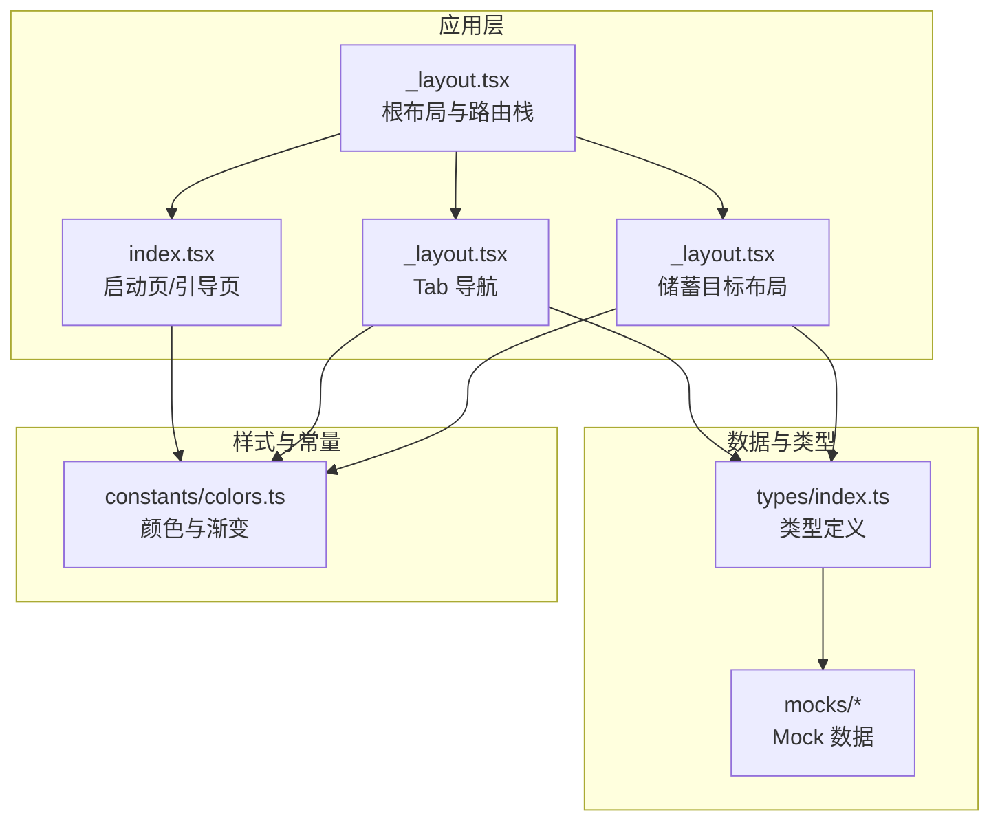
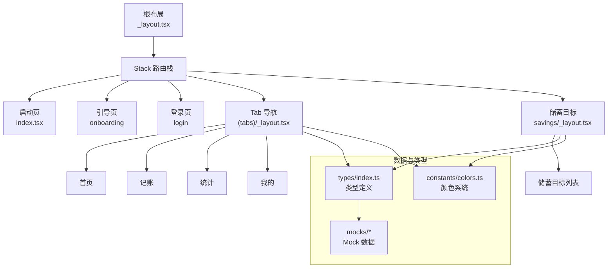
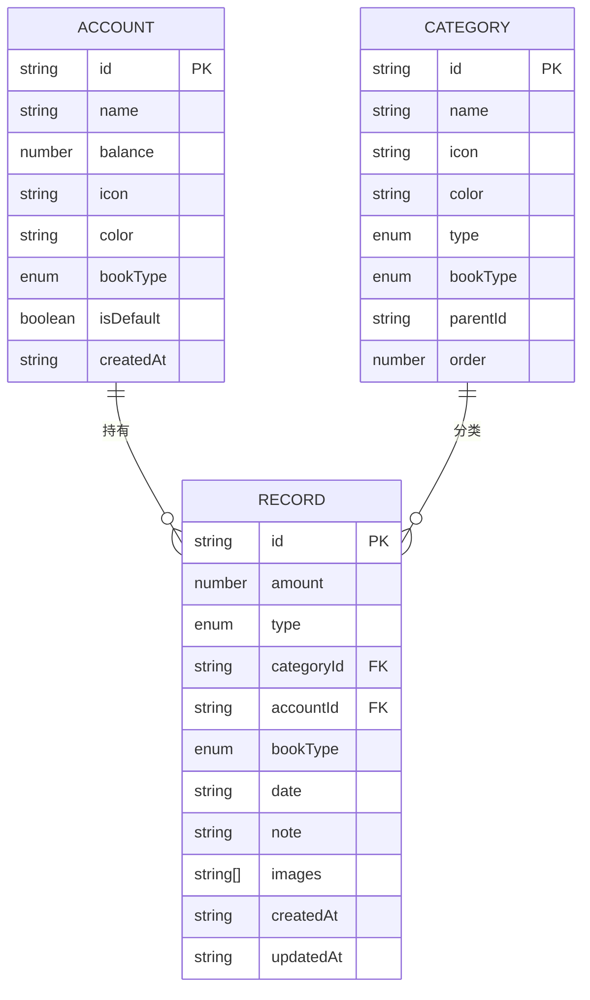
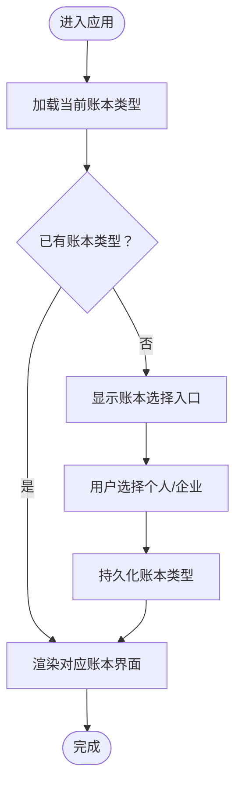
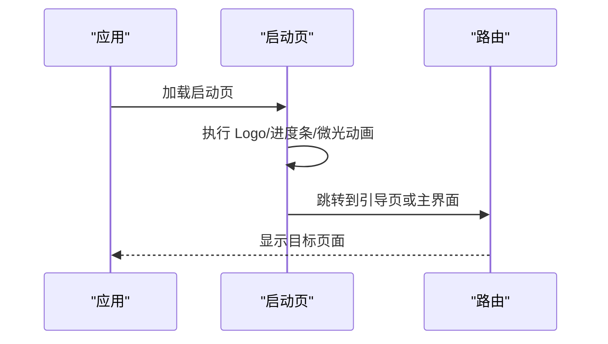
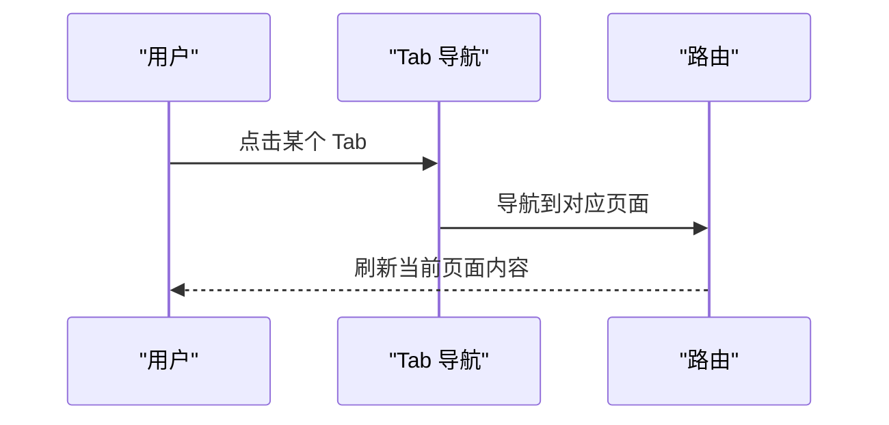
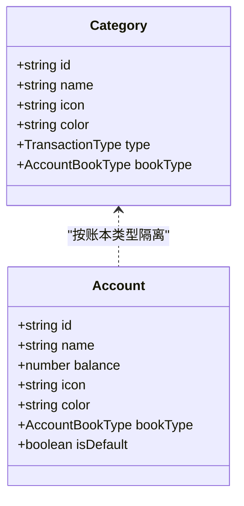
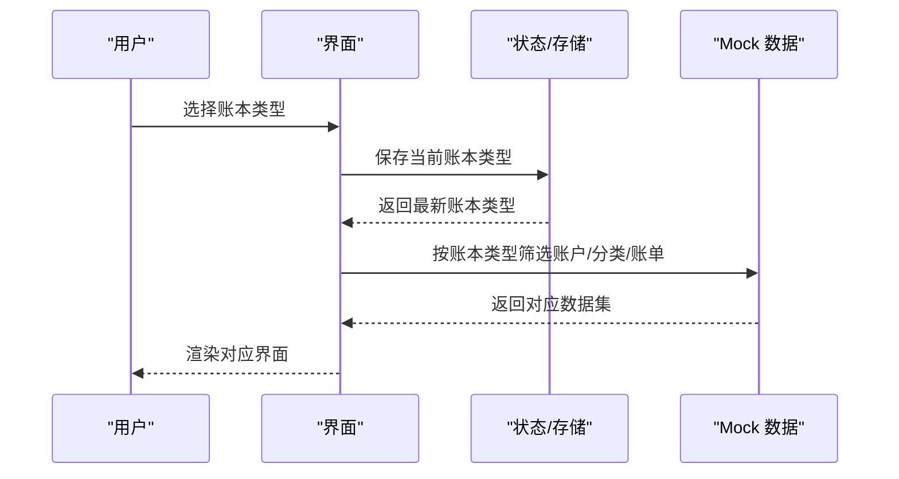
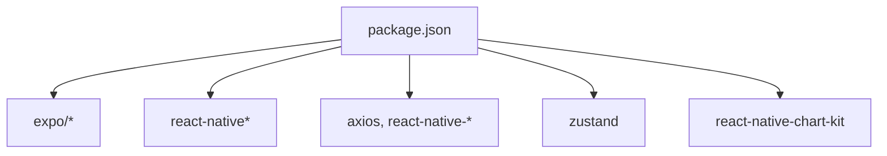

# 账本管理系统

<cite>
**本文引用的文件**
- [src/app/_layout.tsx](file://src/app/_layout.tsx)
- [src/app/index.tsx](file://src/app/index.tsx)
- [src/app/(tabs)/_layout.tsx](file://src/app/(tabs)/_layout.tsx)
- [src/app/savings/_layout.tsx](file://src/app/savings/_layout.tsx)
- [src/types/index.ts](file://src/types/index.ts)
- [src/constants/colors.ts](file://src/constants/colors.ts)
- [src/mocks/accounts.ts](file://src/mocks/accounts.ts)
- [src/mocks/categories.ts](file://src/mocks/categories.ts)
- [src/mocks/records.ts](file://src/mocks/records.ts)
- [src/mocks/index.ts](file://src/mocks/index.ts)
- [package.json](file://package.json)
</cite>

## 目录
1. [简介](#简介)
2. [项目结构](#项目结构)
3. [核心组件](#核心组件)
4. [架构总览](#架构总览)
5. [详细组件分析](#详细组件分析)
6. [依赖关系分析](#依赖关系分析)
7. [性能考虑](#性能考虑)
8. [故障排查指南](#故障排查指南)
9. [结论](#结论)
10. [附录](#附录)

## 简介
本项目是一个基于 React Native 与 Expo 的账本管理系统，采用“双账本”架构：个人账本与企业账本并存，通过统一的数据模型与分类体系实现数据隔离与业务逻辑分离。系统提供账本选择入口、Tab 导航、记账、统计与储蓄目标等功能模块，并以 Mock 数据驱动演示。

## 项目结构
项目采用按功能域划分的目录组织方式，核心目录与职责如下：
- src/app：应用页面与路由布局，包含根布局、启动页、Tab 布局、储蓄目标布局等
- src/components/ui：通用 UI 组件（按钮、卡片、输入框等）
- src/constants：主题色值、排版、布局常量
- src/mocks：Mock 数据（账户、分类、账单、储蓄目标等），用于演示与测试
- src/types：类型定义（用户、账户、分类、账单、预算、统计等）

图表来源
- [src/app/_layout.tsx](file://src/app/_layout.tsx#L30-L47)
- [src/app/index.tsx](file://src/app/index.tsx#L15-L64)
- [src/app/(tabs)/_layout.tsx](file://src/app/(tabs)/_layout.tsx#L39-L87)
- [src/app/savings/_layout.tsx](file://src/app/savings/_layout.tsx#L8-L18)
- [src/types/index.ts](file://src/types/index.ts#L5-L60)
- [src/constants/colors.ts](file://src/constants/colors.ts#L6-L85)
- [src/mocks/index.ts](file://src/mocks/index.ts#L5-L8)

章节来源
- [src/app/_layout.tsx](file://src/app/_layout.tsx#L1-L55)
- [src/app/index.tsx](file://src/app/index.tsx#L1-L249)
- [src/app/(tabs)/_layout.tsx](file://src/app/(tabs)/_layout.tsx#L1-L121)
- [src/app/savings/_layout.tsx](file://src/app/savings/_layout.tsx#L1-L20)
- [src/types/index.ts](file://src/types/index.ts#L1-L141)
- [src/constants/colors.ts](file://src/constants/colors.ts#L1-L88)
- [src/mocks/index.ts](file://src/mocks/index.ts#L1-L9)

## 核心组件
- 根布局与路由栈：负责全局样式、状态栏、启动屏控制与页面栈管理
- 启动页：处理首屏动画与引导逻辑，决定进入引导或主界面
- Tab 导航：提供首页、记账、统计、我的四个入口，支持图标与标签聚焦态
- 储蓄目标布局：独立的路由栈，承载储蓄相关页面
- 类型系统：统一定义账本类型、交易类型、账户、分类、账单、预算、统计等核心实体
- 颜色系统：为个人与企业账本提供专属配色与渐变方案
- Mock 数据：提供账户、分类、账单等数据，支撑演示与开发

章节来源
- [src/app/_layout.tsx](file://src/app/_layout.tsx#L17-L47)
- [src/app/index.tsx](file://src/app/index.tsx#L15-L64)
- [src/app/(tabs)/_layout.tsx](file://src/app/(tabs)/_layout.tsx#L13-L87)
- [src/app/savings/_layout.tsx](file://src/app/savings/_layout.tsx#L8-L18)
- [src/types/index.ts](file://src/types/index.ts#L5-L60)
- [src/constants/colors.ts](file://src/constants/colors.ts#L14-L85)
- [src/mocks/accounts.ts](file://src/mocks/accounts.ts#L7-L90)
- [src/mocks/categories.ts](file://src/mocks/categories.ts#L7-L68)
- [src/mocks/records.ts](file://src/mocks/records.ts#L13-L98)

## 架构总览
系统采用“双账本 + 统一类型 + 分离数据”的架构设计：
- 账本类型：个人账本与企业账本，分别拥有独立的账户、分类与账单集合
- 数据隔离：通过 bookType 字段在实体层面进行隔离；Mock 层提供按账本类型筛选的数据接口
- 业务逻辑：个人与企业账本共享同一套 UI 与交互模式，但分类与默认账户存在差异
- 视图层：根布局统一管理路由栈；Tab 布局提供入口；储蓄布局提供独立导航

图表来源
- [src/app/_layout.tsx](file://src/app/_layout.tsx#L33-L45)
- [src/app/index.tsx](file://src/app/index.tsx#L56-L61)
- [src/app/(tabs)/_layout.tsx](file://src/app/(tabs)/_layout.tsx#L40-L87)
- [src/app/savings/_layout.tsx](file://src/app/savings/_layout.tsx#L8-L18)
- [src/types/index.ts](file://src/types/index.ts#L5-L60)
- [src/constants/colors.ts](file://src/constants/colors.ts#L14-L85)
- [src/mocks/index.ts](file://src/mocks/index.ts#L5-L8)

## 详细组件分析

### 账本类型与数据模型
- 账本类型：使用联合类型区分个人与企业
- 实体字段：账户、分类、账单、预算、统计等均包含 bookType 字段，确保跨模块一致性
- 关系映射：Record 通过 accountId 与 Account 关联，通过 categoryId 与 Category 关联；Account 与 Category 均受 bookType 约束

图表来源
- [src/types/index.ts](file://src/types/index.ts#L22-L60)

章节来源
- [src/types/index.ts](file://src/types/index.ts#L5-L60)

### 账本选择界面与切换机制
当前仓库未提供显式的“账本选择界面”页面源码。但从颜色系统与 Mock 数据可推断：
- 颜色系统为个人与企业账本分别提供标识色与浅色背景，便于在界面中直观区分
- Mock 数据按账本类型拆分账户与分类，查询时通过 bookType 过滤
- 切换机制建议：在应用状态中维护当前账本类型，所有数据读取与写入均基于该类型；UI 使用对应配色与文案

图表来源
- [src/constants/colors.ts](file://src/constants/colors.ts#L14-L21)
- [src/mocks/accounts.ts](file://src/mocks/accounts.ts#L77-L80)
- [src/mocks/categories.ts](file://src/mocks/categories.ts#L59-L68)

章节来源
- [src/constants/colors.ts](file://src/constants/colors.ts#L14-L21)
- [src/mocks/accounts.ts](file://src/mocks/accounts.ts#L77-L80)
- [src/mocks/categories.ts](file://src/mocks/categories.ts#L59-L68)

### 启动页与引导流程
- 启动页负责首屏动画与进度条，2.5 秒后根据是否首次启动决定跳转至引导页或主界面
- 颜色与渐变来源于颜色系统，Logo 采用个人与企业账本的配色拼接

图表来源
- [src/app/index.tsx](file://src/app/index.tsx#L21-L64)
- [src/constants/colors.ts](file://src/constants/colors.ts#L78-L85)

章节来源
- [src/app/index.tsx](file://src/app/index.tsx#L15-L64)
- [src/constants/colors.ts](file://src/constants/colors.ts#L78-L85)

### Tab 导航与状态管理
- Tab 导航提供四个入口，图标与标签在聚焦时呈现高亮态
- 通过屏幕选项统一设置头部隐藏、样式与阴影

图表来源
- [src/app/(tabs)/_layout.tsx](file://src/app/(tabs)/_layout.tsx#L40-L87)

章节来源
- [src/app/(tabs)/_layout.tsx](file://src/app/(tabs)/_layout.tsx#L13-L87)

### 储蓄目标布局
- 储蓄目标布局采用独立的 Stack 路由栈，背景色与全局一致
- 适合承载储蓄目标列表与详情等页面

图表来源
- [src/app/savings/_layout.tsx](file://src/app/savings/_layout.tsx#L8-L18)

章节来源
- [src/app/savings/_layout.tsx](file://src/app/savings/_layout.tsx#L1-L20)

### 分类体系与账户设置
- 分类体系：个人与企业分别拥有支出与收入两类分类，且按账本类型隔离
- 账户设置：个人与企业分别拥有默认账户与多种支付账户，余额与图标颜色可配置

图表来源
- [src/types/index.ts](file://src/types/index.ts#L22-L43)
- [src/mocks/categories.ts](file://src/mocks/categories.ts#L7-L49)
- [src/mocks/accounts.ts](file://src/mocks/accounts.ts#L7-L69)

章节来源
- [src/mocks/categories.ts](file://src/mocks/categories.ts#L7-L68)
- [src/mocks/accounts.ts](file://src/mocks/accounts.ts#L7-L90)
- [src/types/index.ts](file://src/types/index.ts#L22-L43)

### 权限控制与数据隔离
- 数据隔离：所有实体均包含 bookType 字段，查询与过滤时以此为依据
- 权限建议：可在用户上下文中增加账本访问范围与角色字段，结合 bookType 控制可见性与编辑权限

章节来源
- [src/types/index.ts](file://src/types/index.ts#L5-L60)

### 账本切换完整流程（基于现有代码的最佳实践）
以下流程基于现有颜色系统与 Mock 数据，展示如何在应用中实现账本切换：
- 初始化：从持久化存储读取当前账本类型，若无则进入账本选择入口
- 选择账本：在引导页或设置页提供个人/企业选项，保存至状态与存储
- 渲染：根据当前账本类型渲染对应的颜色主题、分类与账户列表
- 写入：新增账单时，强制携带 bookType 并关联对应账户与分类
- 统计：聚合时仅统计当前账本类型的数据

图表来源
- [src/constants/colors.ts](file://src/constants/colors.ts#L14-L21)
- [src/mocks/accounts.ts](file://src/mocks/accounts.ts#L77-L80)
- [src/mocks/categories.ts](file://src/mocks/categories.ts#L59-L68)
- [src/mocks/records.ts](file://src/mocks/records.ts#L113-L116)

章节来源
- [src/constants/colors.ts](file://src/constants/colors.ts#L14-L21)
- [src/mocks/accounts.ts](file://src/mocks/accounts.ts#L77-L80)
- [src/mocks/categories.ts](file://src/mocks/categories.ts#L59-L68)
- [src/mocks/records.ts](file://src/mocks/records.ts#L113-L116)

## 依赖关系分析
- 运行时依赖：Expo、React Navigation（通过 expo-router）、动画与手势处理库、图表库、状态管理库等
- 开发依赖：TypeScript、类型声明

图表来源
- [package.json](file://package.json#L11-L34)

章节来源
- [package.json](file://package.json#L1-L43)

## 性能考虑
- 启动屏与字体加载：通过启动屏防自动隐藏与字体加载完成后再隐藏启动屏，避免白屏与闪烁
- 动画与渲染：启动页动画使用原生驱动与循环动画，注意控制动画复杂度与帧率
- 数据筛选：Mock 层提供按账本类型筛选的函数，避免全量遍历；生产环境建议引入索引与缓存
- 路由栈：根布局集中管理路由栈，减少重复渲染与层级嵌套

章节来源
- [src/app/_layout.tsx](file://src/app/_layout.tsx#L15-L24)
- [src/app/index.tsx](file://src/app/index.tsx#L21-L50)
- [src/mocks/accounts.ts](file://src/mocks/accounts.ts#L77-L80)
- [src/mocks/categories.ts](file://src/mocks/categories.ts#L59-L68)

## 故障排查指南
- 启动页不显示：检查字体加载回调与启动屏隐藏逻辑
- 颜色不生效：确认颜色系统导入路径与主题变量使用位置
- 数据不匹配：核对账本类型字段与筛选函数，确保新增数据携带正确 bookType
- 路由异常：检查根布局中的 Stack Screen 名称与页面路径

章节来源
- [src/app/_layout.tsx](file://src/app/_layout.tsx#L15-L24)
- [src/constants/colors.ts](file://src/constants/colors.ts#L6-L85)
- [src/mocks/records.ts](file://src/mocks/records.ts#L113-L116)

## 结论
本项目以“双账本”为核心，通过统一类型与 Mock 数据实现了清晰的数据隔离与业务分离。根布局、启动页、Tab 导航与储蓄布局构成完整的视图层；颜色系统与类型定义为 UI 与数据提供了强约束。建议在后续版本中补充账本选择界面与持久化逻辑，并完善权限控制与真实数据接入。

## 附录
- Mock 数据导出：统一导出分类、账户、账单与储蓄目标数据，便于在各模块中按需引入
- 类型扩展：新增实体时应同步添加 bookType 字段与相关筛选函数，保持一致性

章节来源
- [src/mocks/index.ts](file://src/mocks/index.ts#L5-L8)
- [src/types/index.ts](file://src/types/index.ts#L5-L60)