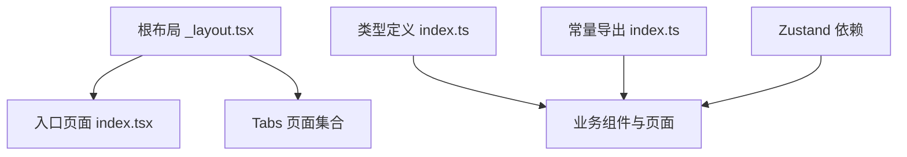
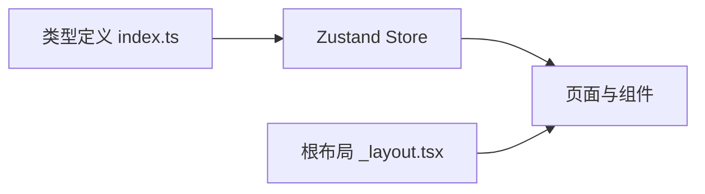
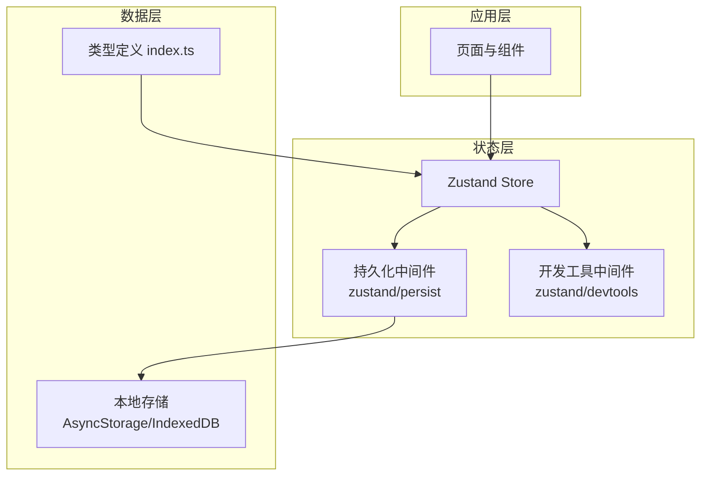
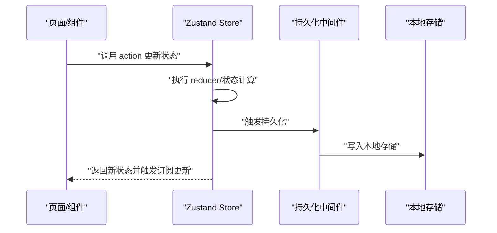
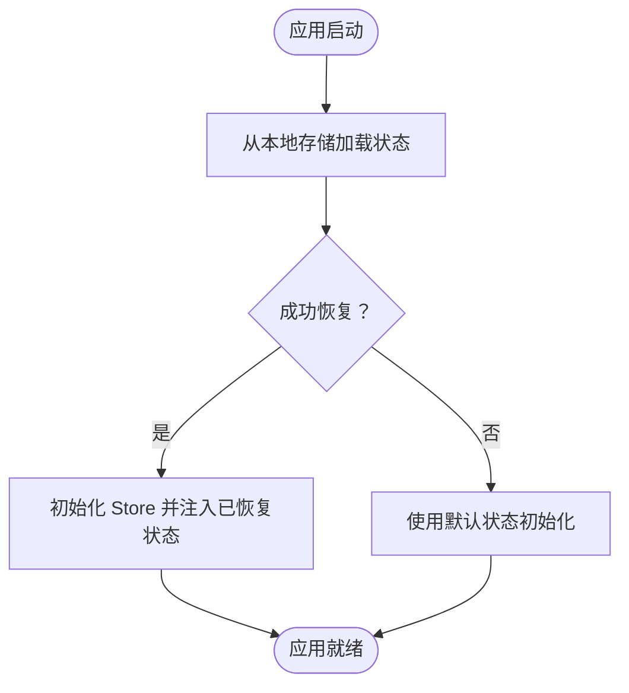
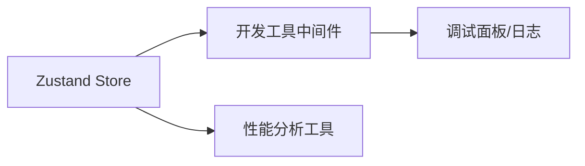
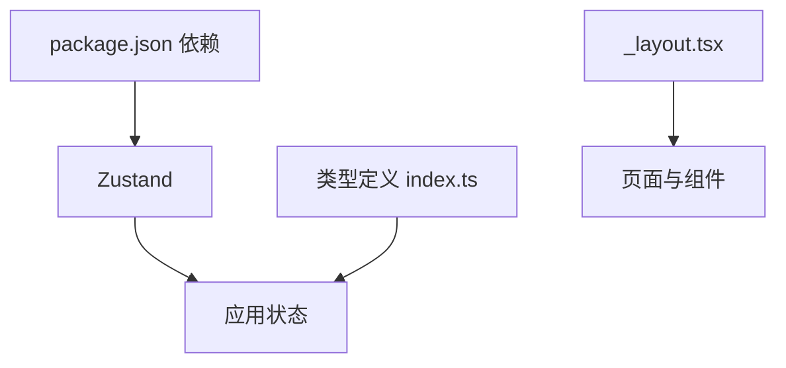

# 状态管理

<cite>
**本文引用的文件**
- [package.json](file://package.json)
- [根布局文件 _layout.tsx](file://src/app/_layout.tsx)
- [入口页面 index.tsx](file://src/app/index.tsx)
- [类型定义 index.ts](file://src/types/index.ts)
- [常量导出 index.ts](file://src/constants/index.ts)
- [Zustand 中间件类型定义 persist.d.ts](file://node_modules/zustand/esm/middleware/persist.d.ts)
- [Zustand 中间件类型定义 devtools.d.ts](file://node_modules/zustand/esm/middleware/devtools.d.ts)
</cite>

## 目录
1. [简介](#简介)
2. [项目结构](#项目结构)
3. [核心组件](#核心组件)
4. [架构总览](#架构总览)
5. [详细组件分析](#详细组件分析)
6. [依赖分析](#依赖分析)
7. [性能考虑](#性能考虑)
8. [故障排除指南](#故障排除指南)
9. [结论](#结论)
10. [附录](#附录)

## 简介
本文件面向“攒钱记账”应用的状态管理文档，聚焦于基于 Zustand 的状态架构与实现细节。当前仓库已引入 Zustand 作为状态库，但项目中尚未发现显式的 Zustand store 定义与使用示例。本文将以现有依赖与类型体系为基础，系统阐述全局状态设计模式、状态更新机制、订阅管理、持久化与同步策略、并发控制、最佳实践、性能优化、调试与监控方法，并提供可落地的使用指南与故障排除建议。

## 项目结构
- 项目采用 Expo + React Native 架构，路由由 expo-router 管理，根布局负责全局样式与导航容器配置。
- 类型体系位于 src/types，涵盖用户、账户、分类、账单、储蓄目标、预算、统计等核心领域模型。
- 状态库依赖来自 package.json，明确声明了 Zustand 的版本与功能范围。

**图表来源**
- [根布局文件 _layout.tsx](file://src/app/_layout.tsx#L1-L55)
- [入口页面 index.tsx](file://src/app/index.tsx#L1-L249)
- [类型定义 index.ts](file://src/types/index.ts#L1-L141)
- [常量导出 index.ts](file://src/constants/index.ts#L1-L12)
- [package.json](file://package.json#L1-L43)

**章节来源**
- [package.json](file://package.json#L1-L43)
- [根布局文件 _layout.tsx](file://src/app/_layout.tsx#L1-L55)
- [入口页面 index.tsx](file://src/app/index.tsx#L1-L249)
- [类型定义 index.ts](file://src/types/index.ts#L1-L141)
- [常量导出 index.ts](file://src/constants/index.ts#L1-L12)

## 核心组件
- Zustand 依赖：项目已安装 Zustand，可用于构建轻量级、可组合的全局状态。
- 类型体系：src/types 提供完整的领域模型，包括用户、账户、分类、账单、储蓄目标、预算、统计数据等，为状态建模提供基础。
- 路由与布局：根布局负责全局容器与导航配置，页面通过 expo-router 管理，便于在各页面中按需订阅状态。

为后续实现提供参考的模块关系如下：

**图表来源**
- [package.json](file://package.json#L34-L34)
- [类型定义 index.ts](file://src/types/index.ts#L1-L141)
- [根布局文件 _layout.tsx](file://src/app/_layout.tsx#L1-L55)

**章节来源**
- [package.json](file://package.json#L34-L34)
- [类型定义 index.ts](file://src/types/index.ts#L1-L141)
- [根布局文件 _layout.tsx](file://src/app/_layout.tsx#L1-L55)

## 架构总览
下图展示“攒钱记账”应用中状态管理的整体架构：Zustand 作为状态中心，页面与组件通过订阅获取状态；类型体系为状态结构提供约束；持久化中间件用于跨会话保存关键状态；开发工具中间件用于调试与可观测性。

**图表来源**
- [Zustand 中间件类型定义 persist.d.ts](file://node_modules/zustand/esm/middleware/persist.d.ts#L107-L110)
- [Zustand 中间件类型定义 devtools.d.ts](file://node_modules/zustand/esm/middleware/devtools.d.ts#L8-L43)
- [类型定义 index.ts](file://src/types/index.ts#L1-L141)

## 详细组件分析

### 全局状态设计模式
- 单一事实来源：以 Zustand Store 作为单一事实来源，避免多处状态分散导致的不一致。
- 模块化拆分：根据业务域拆分多个 store（如用户、账户、账单、储蓄、预算），每个 store 聚焦自身职责，降低耦合。
- 类型驱动：所有状态结构与变更函数均以类型定义为约束，确保编译期安全与 IDE 自动补全。

```mermaid
classDiagram
class User {
+string id
+string nickname
+string? avatar
+string? phone
+string? email
+string createdAt
}
class Account {
+string id
+string name
+number balance
+string icon
+string color
+AccountBookType bookType
+boolean? isDefault
+string createdAt
}
class Category {
+string id
+string name
+string icon
+string color
+TransactionType type
+AccountBookType bookType
+string? parentId
+number? order
}
class Record {
+string id
+number amount
+TransactionType type
+string categoryId
+Category? category
+string accountId
+Account? account
+AccountBookType bookType
+string date
+string? note
+string[]? images
+string createdAt
+string updatedAt
}
class SavingsGoal {
+string id
+string name
+number targetAmount
+number currentAmount
+AccountBookType bookType
+string? deadline
+string? icon
+string? color
+string? coverImage
+boolean isCompleted
+string createdAt
+string updatedAt
}
class SavingsDeposit {
+string id
+string goalId
+number amount
+string? note
+string createdAt
}
class Budget {
+string id
+string? categoryId
+number amount
+number usedAmount
+Period period
+AccountBookType bookType
+number? alertThreshold
+boolean isAlertEnabled
}
class Statistics {
+number totalIncome
+number totalExpense
+number balance
+CategoryStat[] categoryStats
+DailyStat[] dailyStats
}
class CategoryStat {
+string categoryId
+Category? category
+number amount
+number percentage
+number count
}
class DailyStat {
+string date
+number income
+number expense
}
class BookOverview {
+AccountBookType bookType
+number totalBalance
+number todayIncome
+number todayExpense
+number monthIncome
+number monthExpense
}
class ReminderSettings {
+boolean billReminder
+string? billReminderTime
+boolean savingsReminder
+string? savingsReminderTime
+boolean budgetAlert
+number? budgetAlertThreshold
}
```

**图表来源**
- [类型定义 index.ts](file://src/types/index.ts#L11-L141)

**章节来源**
- [类型定义 index.ts](file://src/types/index.ts#L11-L141)

### 状态更新机制与订阅管理
- 订阅方式：页面或组件通过 useStore 订阅所需字段，仅在订阅字段变化时触发重渲染，减少不必要的渲染。
- 更新策略：通过 action 函数集中更新状态，避免直接修改共享对象，保证状态更新的可追踪性。
- 并发控制：在异步操作中使用原子性的 action，避免竞态条件；必要时结合队列或锁机制处理连续写入。

**图表来源**
- [Zustand 中间件类型定义 persist.d.ts](file://node_modules/zustand/esm/middleware/persist.d.ts#L107-L110)

**章节来源**
- [Zustand 中间件类型定义 persist.d.ts](file://node_modules/zustand/esm/middleware/persist.d.ts#L107-L110)

### 状态持久化与同步策略
- 持久化中间件：使用 zustand/persist 将关键状态序列化到本地存储，支持选择性键、版本迁移与恢复策略。
- 同步策略：在应用启动时从本地存储恢复状态；对于需要云端同步的数据，可在 action 中增加网络请求与冲突解决逻辑。
- 版本兼容：通过中间件提供的版本字段与迁移函数，平滑处理状态结构变更。

**图表来源**
- [Zustand 中间件类型定义 persist.d.ts](file://node_modules/zustand/esm/middleware/persist.d.ts#L107-L110)

**章节来源**
- [Zustand 中间件类型定义 persist.d.ts](file://node_modules/zustand/esm/middleware/persist.d.ts#L107-L110)

### 并发控制策略
- 原子性更新：将一次业务操作封装为单一 action，避免部分更新导致的中间态。
- 队列化写入：对高频写入场景，可引入队列与批处理，合并多次更新为一次提交。
- 冲突检测：在云端同步时，使用时间戳或版本号进行冲突检测与合并。

[本节为通用策略说明，无需特定文件引用]

### 最佳实践
- 保持状态扁平化：避免深层嵌套，提升更新效率与可维护性。
- 使用 selector 优化订阅：仅订阅所需字段，减少无关重渲染。
- 明确 action 命名：以动词短语命名 action，清晰表达意图。
- 错误边界与回滚：在异步 action 中捕获错误并提供回滚策略。
- 类型优先：所有状态与 action 参数均使用类型定义，确保一致性。

[本节为通用指导，无需特定文件引用]

### 性能优化技巧
- 选择器优化：使用浅比较或自定义比较函数，避免深层比较带来的开销。
- 批量更新：将多次小更新合并为一次大更新，减少渲染次数。
- 懒加载与分割：将大型 store 拆分为多个小 store，按需加载。
- 缓存策略：对昂贵计算结果进行缓存，避免重复计算。

[本节为通用指导，无需特定文件引用]

### 调试与监控
- 开发工具中间件：使用 zustand/devtools 在浏览器或移动端调试面板中查看状态变更历史、action 列表与快照。
- 日志与埋点：在关键 action 中添加日志与埋点，便于定位问题与分析用户行为。
- 性能分析：利用 React DevTools Profiler 与 Metro 性能分析工具，识别渲染瓶颈。

**图表来源**
- [Zustand 中间件类型定义 devtools.d.ts](file://node_modules/zustand/esm/middleware/devtools.d.ts#L8-L43)

**章节来源**
- [Zustand 中间件类型定义 devtools.d.ts](file://node_modules/zustand/esm/middleware/devtools.d.ts#L8-L43)

## 依赖分析
- Zustand：作为状态库，提供轻量、灵活的状态管理能力。
- 类型定义：为状态结构与 API 提供强类型保障，降低运行时错误风险。
- 路由与布局：根布局与页面组织为状态订阅与更新提供上下文环境。

**图表来源**
- [package.json](file://package.json#L11-L34)
- [类型定义 index.ts](file://src/types/index.ts#L1-L141)
- [根布局文件 _layout.tsx](file://src/app/_layout.tsx#L1-L55)

**章节来源**
- [package.json](file://package.json#L11-L34)
- [类型定义 index.ts](file://src/types/index.ts#L1-L141)
- [根布局文件 _layout.tsx](file://src/app/_layout.tsx#L1-L55)

## 性能考虑
- 渲染优化：通过选择器与浅比较减少无效重渲染。
- 状态拆分：按业务域拆分 store，避免全局状态过大。
- 异步优化：在 action 中合并异步请求，减少网络往返。
- 存储优化：合理选择持久化键，避免存储冗余数据。

[本节为通用指导，无需特定文件引用]

## 故障排除指南
- 状态未更新：检查订阅字段是否正确、action 是否被调用、selector 是否返回新引用。
- 持久化失败：确认持久化中间件配置、存储权限与版本迁移逻辑。
- 冲突与回滚：在云端同步失败时，回滚到上一个稳定状态并提示用户重试。
- 性能问题：使用调试工具定位热点区域，优化渲染与计算逻辑。

[本节为通用指导，无需特定文件引用]

## 结论
本文件基于现有依赖与类型体系，系统梳理了“攒钱记账”应用的状态管理蓝图。尽管当前仓库尚未包含具体的 Zustand 实现代码，但通过类型驱动的设计、中间件能力与最佳实践，可快速搭建高性能、可维护的状态层。建议尽快补充 store 定义与页面订阅示例，完善端到端状态流与调试链路。

[本节为总结性内容，无需特定文件引用]

## 附录
- 快速开始建议
  - 创建用户、账户、账单、储蓄、预算等领域的 store。
  - 在页面中使用 useStore 订阅所需字段。
  - 对关键状态启用持久化中间件，并配置版本迁移。
  - 使用开发工具中间件进行调试与监控。

[本节为通用指导，无需特定文件引用]