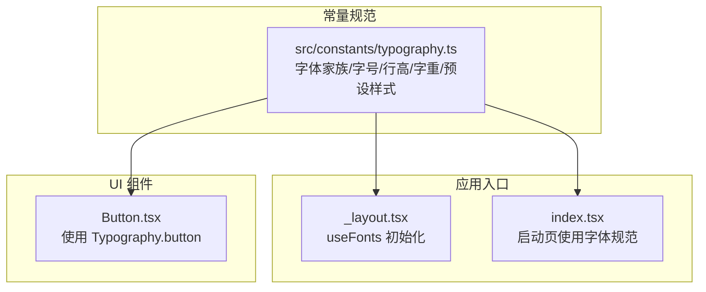
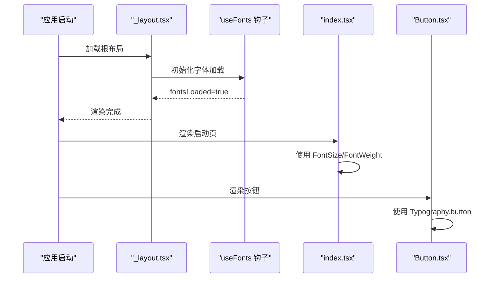
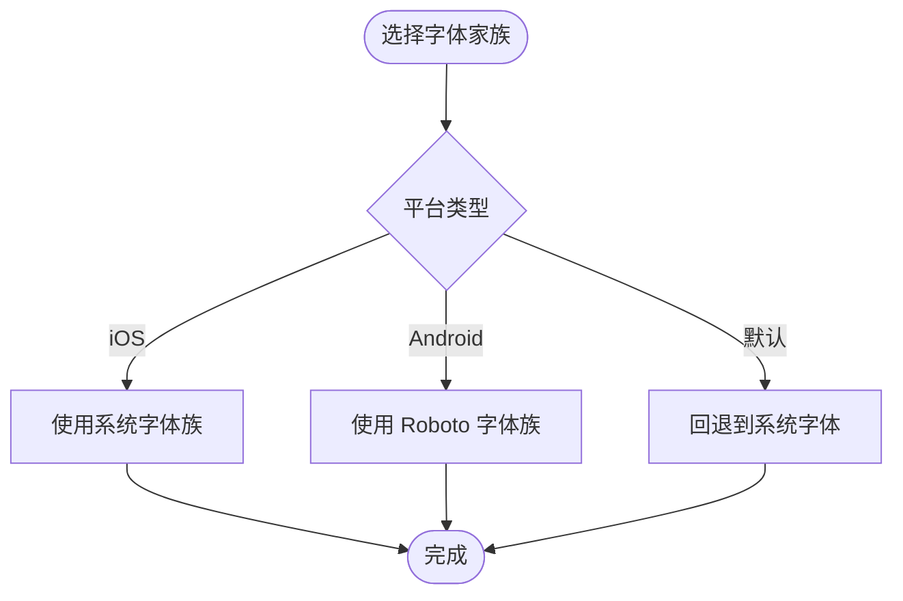
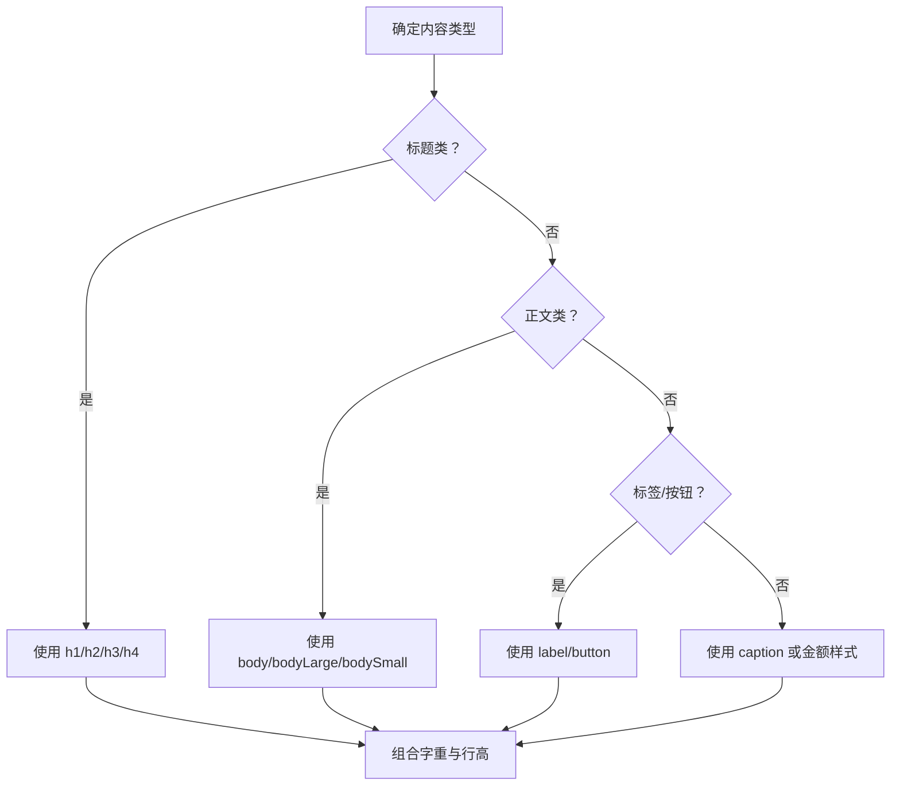
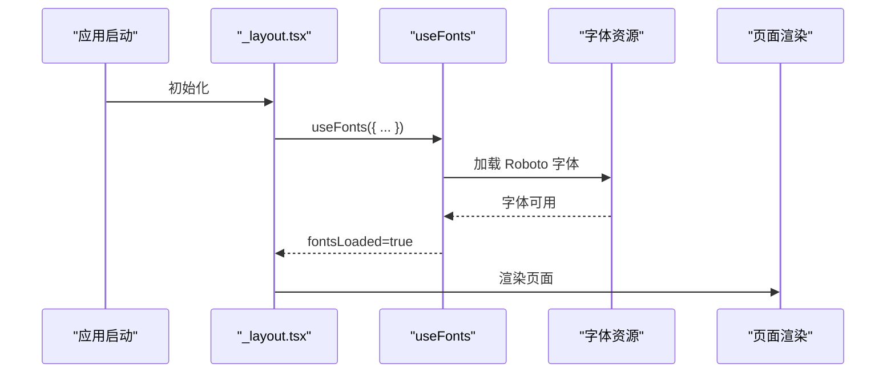
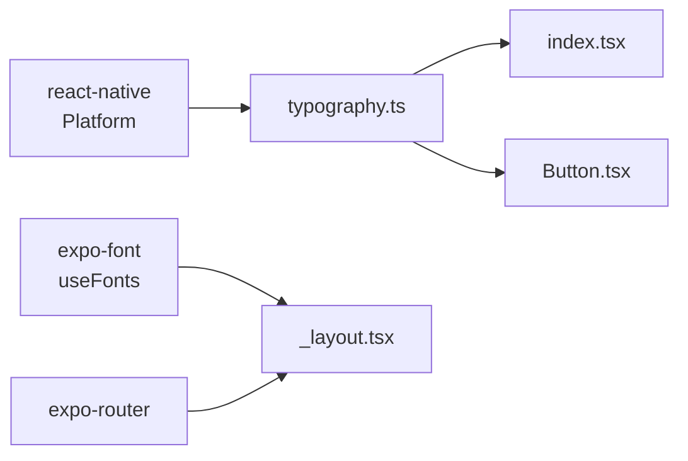

# 字体系统

<cite>
**本文引用的文件**
- [src/constants/typography.ts](file://src/constants/typography.ts)
- [src/app/_layout.tsx](file://src/app/_layout.tsx)
- [src/app/index.tsx](file://src/app/index.tsx)
- [src/components/ui/Button.tsx](file://src/components/ui/Button.tsx)
- [package.json](file://package.json)
- [app.json](file://app.json)
</cite>

## 目录
1. [简介](#简介)
2. [项目结构](#项目结构)
3. [核心组件](#核心组件)
4. [架构总览](#架构总览)
5. [详细组件分析](#详细组件分析)
6. [依赖分析](#依赖分析)
7. [性能考虑](#性能考虑)
8. [故障排查指南](#故障排查指南)
9. [结论](#结论)
10. [附录](#附录)

## 简介
本文件为“攒钱记账”应用的字体系统完整文档，围绕以下目标展开：
- 字体家族选择的设计考量与跨平台兼容性
- 字体大小层级（标题、副标题、正文、说明文字）的层级关系与视觉层次
- 字重（normal、bold）与行高的设计原则与可读性优化
- 响应式字体大小的实现策略与断点设置
- 中英文混排的字体适配方案与字符集支持
- 字体加载性能优化与预加载策略
- 可访问性字体设置指南与用户自定义字体支持
- 实际代码中的字体使用示例与最佳实践

## 项目结构
本项目的字体系统主要由常量规范与全局布局控制两部分组成：
- 字体规范集中于常量模块，统一管理字体家族、字号、行高、字重与预设样式
- 全局布局在根布局中通过字体加载钩子进行初始化，确保页面渲染前字体可用

图表来源
- [src/constants/typography.ts](file://src/constants/typography.ts#L1-L149)
- [src/app/_layout.tsx](file://src/app/_layout.tsx#L17-L28)
- [src/app/index.tsx](file://src/app/index.tsx#L109-L213)
- [src/components/ui/Button.tsx](file://src/components/ui/Button.tsx#L140-L147)

章节来源
- [src/constants/typography.ts](file://src/constants/typography.ts#L1-L149)
- [src/app/_layout.tsx](file://src/app/_layout.tsx#L17-L28)
- [src/app/index.tsx](file://src/app/index.tsx#L109-L213)
- [src/components/ui/Button.tsx](file://src/components/ui/Button.tsx#L140-L147)

## 核心组件
- 字体家族（FontFamily）
  - iOS 使用系统字体族，Android 使用 Roboto 系列，保证跨平台一致的阅读体验与原生感
  - 字重映射：regular → 400，medium → 500，semibold → 600，bold → 700
- 字体大小（FontSize）
  - 提供从 xs 到 5xl 的完整层级，覆盖标题、正文、标签、说明与金额等场景
- 行高（LineHeight）
  - tight（1.2）、normal（1.5）、relaxed（1.75），按内容密度与可读性需求选择
- 预设样式（Typography）
  - 包含 h1/h2/h3/h4、body/bodyLarge/bodySmall、label、button、caption、amount、amountSmall 等
  - 每个预设均显式声明 fontSize、fontWeight、lineHeight，确保一致性与可维护性

章节来源
- [src/constants/typography.ts](file://src/constants/typography.ts#L9-L30)
- [src/constants/typography.ts](file://src/constants/typography.ts#L33-L44)
- [src/constants/typography.ts](file://src/constants/typography.ts#L47-L51)
- [src/constants/typography.ts](file://src/constants/typography.ts#L62-L146)

## 架构总览
字体系统在应用中的调用链路如下：
- 根布局通过字体加载钩子确保字体资源就绪
- 页面与组件通过导入字体常量，组合字号、字重与行高形成统一的排版体系
- 启动页与按钮等关键组件直接使用预设样式，保证品牌与一致性

图表来源
- [src/app/_layout.tsx](file://src/app/_layout.tsx#L17-L28)
- [src/app/index.tsx](file://src/app/index.tsx#L109-L213)
- [src/components/ui/Button.tsx](file://src/components/ui/Button.tsx#L140-L147)

## 详细组件分析

### 字体家族与跨平台兼容性
- iOS 平台采用系统字体族，确保与系统 UI 一致，减少额外资源开销
- Android 平台采用 Roboto 系列，保证开源字体的广泛可用性与字符集覆盖
- 默认回退到系统字体，避免平台差异导致的异常

图表来源
- [src/constants/typography.ts](file://src/constants/typography.ts#L10-L29)

章节来源
- [src/constants/typography.ts](file://src/constants/typography.ts#L9-L30)

### 字号层级与视觉层次
- 层级划分：h1（4xl）> h2（3xl）> h3（2xl）> h4（xl）> bodyLarge（lg）> body（base）> bodySmall（sm）> label（base）> button（md）> caption（xs）
- 视觉层次：通过字号与字重的组合形成清晰的信息架构；标题强调、正文稳定、说明弱化
- 金额场景：amount 与 amountSmall 采用加粗与紧凑行高，突出数值信息

图表来源
- [src/constants/typography.ts](file://src/constants/typography.ts#L62-L146)

章节来源
- [src/constants/typography.ts](file://src/constants/typography.ts#L33-L51)
- [src/constants/typography.ts](file://src/constants/typography.ts#L62-L146)

### 字重与行高的设计原则
- 字重：regular（400）用于正文，medium（500）用于强调标签，semibold（600）用于标题，bold（700）用于重要提示与金额
- 行高：tight（1.2）用于标题以增强紧凑感；normal（1.5）用于正文以提升可读性；relaxed（1.75）用于段落或长文本
- 可读性优化：字号与行高的乘积作为行高绝对值，避免相对行高在不同字号下产生不一致的视觉密度

章节来源
- [src/constants/typography.ts](file://src/constants/typography.ts#L54-L59)
- [src/constants/typography.ts](file://src/constants/typography.ts#L47-L51)
- [src/constants/typography.ts](file://src/constants/typography.ts#L62-L146)

### 响应式字体大小与断点策略
- 当前实现：字号为固定像素值，未引入基于屏幕宽度的动态计算
- 推荐策略：
  - 定义断点：小屏（<360）、中屏（360–414）、大屏（>414）
  - 在运行时根据 Dimensions 获取窗口宽度，映射到字号层级（如从 base→lg 或 lg→xl）
  - 对于金额等关键信息，保持最小字号阈值，确保可读性
- 注意：当前代码未体现响应式逻辑，建议在 Typography 或布局层新增计算函数

章节来源
- [src/app/index.tsx](file://src/app/index.tsx#L13-L13)

### 中英文混排与字符集支持
- 字体家族：iOS 使用系统字体，Android 使用 Roboto，两者对中英文字符均有良好支持
- 字符集覆盖：Roboto 与系统字体均包含常用中英文字符集，满足应用需求
- 建议：若未来需要更精细的中文字体渲染，可在 Android 平台引入本地字体文件并通过 useFonts 注册

章节来源
- [src/constants/typography.ts](file://src/constants/typography.ts#L10-L29)

### 字体加载与预加载策略
- 当前状态：根布局已引入字体加载钩子，但未注册任何字体文件
- 建议策略：
  - 在根布局中通过 useFonts 注册 Roboto 字体文件（如 Roboto-Regular.ttf、Roboto-Medium.ttf、Roboto-Bold.ttf）
  - 将字体文件置于 assets/fonts 下，并在 app.json 中声明字体资源（Metro 默认支持本地字体）
  - 首屏阻塞：在 fontsLoaded 为 false 期间显示启动页或骨架屏，避免白屏
  - 缓存与复用：字体加载成功后缓存至内存，避免重复请求

图表来源
- [src/app/_layout.tsx](file://src/app/_layout.tsx#L17-L28)
- [package.json](file://package.json#L17-L17)

章节来源
- [src/app/_layout.tsx](file://src/app/_layout.tsx#L17-L28)
- [package.json](file://package.json#L17-L17)

### 可访问性与用户自定义字体支持
- 可访问性建议：
  - 提供“增大字体”模式：在设置中允许用户切换到更大字号层级（如将 base 提升为 lg）
  - 降低动态范围：在暗色主题下提高对比度，避免高亮行高导致的阅读疲劳
  - 语音朗读：为关键文本（如金额、标题）提供无障碍属性
- 用户自定义字体：
  - 若启用用户自定义字体，需在 Android 平台引入本地字体文件并通过 useFonts 注册
  - 为避免回退带来的视觉跳跃，建议在切换字体时保留字号与行高映射关系

章节来源
- [src/constants/typography.ts](file://src/constants/typography.ts#L33-L51)

### 实际代码中的字体使用示例与最佳实践
- 启动页使用字号与字重
  - 示例路径：[启动页样式定义](file://src/app/index.tsx#L208-L213)
  - 使用方式：直接引用字号与字重常量，确保品牌一致性
- 按钮文字使用预设样式
  - 示例路径：[按钮文本样式组合](file://src/components/ui/Button.tsx#L140-L147)
  - 使用方式：将 Typography.button 与颜色、间距等样式合并，避免分散定义
- 根布局字体初始化
  - 示例路径：[字体加载钩子](file://src/app/_layout.tsx#L18-L18)
  - 使用方式：在应用启动阶段注册字体，确保渲染前字体可用

章节来源
- [src/app/index.tsx](file://src/app/index.tsx#L208-L213)
- [src/components/ui/Button.tsx](file://src/components/ui/Button.tsx#L140-L147)
- [src/app/_layout.tsx](file://src/app/_layout.tsx#L17-L28)

## 依赖分析
- 字体系统依赖
  - react-native：Platform 选择字体家族
  - expo-font：useFonts 钩子用于字体加载
  - expo-router：页面路由与根布局组织
- 关键耦合点
  - Typography 与各页面/组件通过导入常量进行解耦
  - 根布局负责字体资源的统一加载与可见性控制

图表来源
- [src/constants/typography.ts](file://src/constants/typography.ts#L6-L6)
- [src/app/_layout.tsx](file://src/app/_layout.tsx#L8-L8)
- [package.json](file://package.json#L17-L17)

章节来源
- [package.json](file://package.json#L11-L34)
- [app.json](file://app.json#L1-L29)

## 性能考虑
- 字体体积控制
  - 仅引入必要字重（regular、medium、bold），避免全量字体包
  - 在 Android 平台优先使用系统字体族，减少网络与磁盘占用
- 加载时机优化
  - 将字体加载置于应用启动早期，避免首屏闪烁
  - 使用骨架屏或占位文本，改善感知性能
- 渲染性能
  - 避免在滚动列表中频繁切换字体族
  - 合理使用行高与字号，减少复杂文本测量

## 故障排查指南
- 字体未生效
  - 检查根布局是否正确注册字体文件并等待 fontsLoaded
  - 确认字体文件路径与命名与 useFonts 注册一致
- 字体回退到默认
  - 检查平台选择逻辑与字体族名称是否匹配
  - 确保 Android 平台 Roboto 字体可用
- 行高不一致
  - 检查是否使用了字号与行高的乘积作为绝对行高
  - 确保不同层级的行高映射符合设计规范

章节来源
- [src/app/_layout.tsx](file://src/app/_layout.tsx#L17-L28)
- [src/constants/typography.ts](file://src/constants/typography.ts#L47-L51)

## 结论
“攒钱记账”的字体系统以统一的字号、字重与行高规范为基础，结合跨平台字体家族选择，实现了良好的可读性与一致性。建议在现有基础上完善字体资源注册与响应式策略，进一步提升性能与用户体验。

## 附录
- 字体家族与字重映射参考
  - iOS：系统字体族（regular/medium/semibold/bold）
  - Android：Roboto 字体族（Roboto-Regular、Roboto-Medium、Roboto-Bold）
- 预设样式清单（示例路径）
  - [标题层级](file://src/constants/typography.ts#L62-L89)
  - [正文层级](file://src/constants/typography.ts#L91-L110)
  - [标签与按钮](file://src/constants/typography.ts#L112-L124)
  - [说明与金额](file://src/constants/typography.ts#L126-L145)
- 实际使用示例（示例路径）
  - [启动页应用字号与字重](file://src/app/index.tsx#L208-L213)
  - [按钮文本样式组合](file://src/components/ui/Button.tsx#L140-L147)
  - [根布局字体初始化](file://src/app/_layout.tsx#L17-L28)