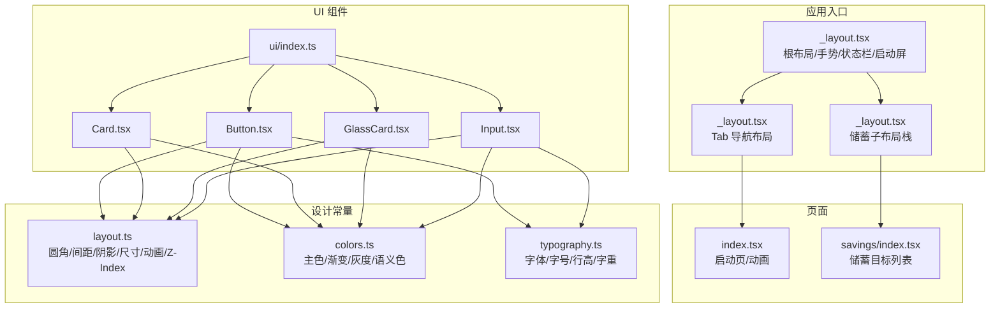
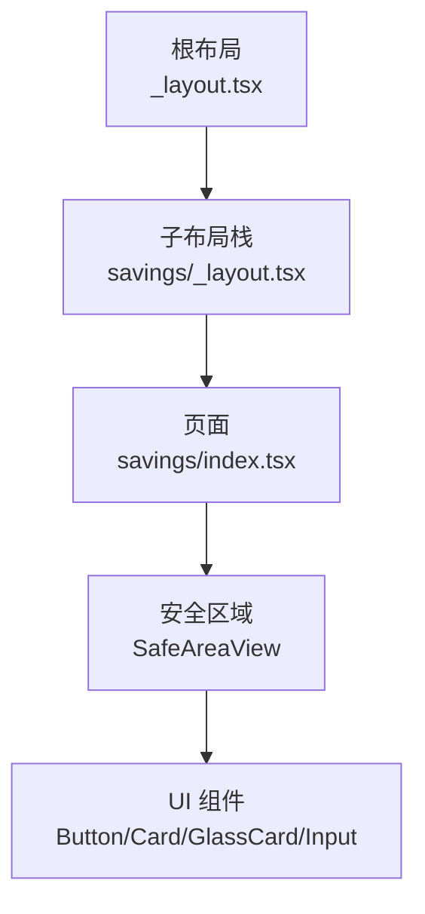
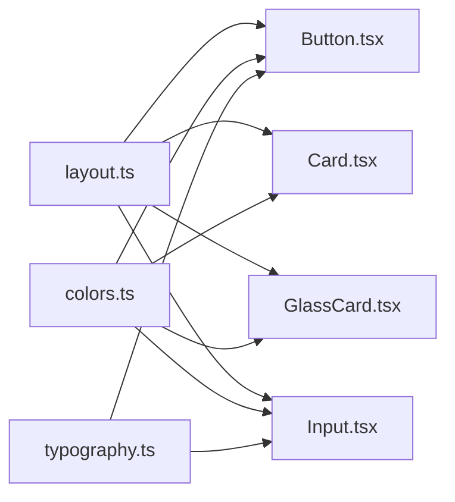

# 布局系统

<cite>
**本文引用的文件**
- [src/constants/layout.ts](file://src/constants/layout.ts)
- [src/constants/colors.ts](file://src/constants/colors.ts)
- [src/constants/typography.ts](file://src/constants/typography.ts)
- [src/app/_layout.tsx](file://src/app/_layout.tsx)
- [src/app/savings/_layout.tsx](file://src/app/savings/_layout.tsx)
- [src/app/(tabs)/_layout.tsx](file://src/app/(tabs)/_layout.tsx)
- [src/components/ui/index.ts](file://src/components/ui/index.ts)
- [src/components/ui/Card.tsx](file://src/components/ui/Card.tsx)
- [src/components/ui/GlassCard.tsx](file://src/components/ui/GlassCard.tsx)
- [src/components/ui/Button.tsx](file://src/components/ui/Button.tsx)
- [src/components/ui/Input.tsx](file://src/components/ui/Input.tsx)
- [src/app/index.tsx](file://src/app/index.tsx)
- [src/app/savings/index.tsx](file://src/app/savings/index.tsx)
- [src/types/index.ts](file://src/types/index.ts)
</cite>

## 目录
1. [简介](#简介)
2. [项目结构](#项目结构)
3. [核心组件](#核心组件)
4. [架构总览](#架构总览)
5. [详细组件分析](#详细组件分析)
6. [依赖关系分析](#依赖关系分析)
7. [性能考量](#性能考量)
8. [故障排查指南](#故障排查指南)
9. [结论](#结论)
10. [附录](#附录)

## 简介
本文件系统化梳理“攒钱记账”应用的布局体系，覆盖响应式策略、断点与容器宽度、间距系统、网格与弹性布局、安全区域与刘海屏适配、卡片/列表/表单布局模式、动画与交互布局考虑，并给出调试与性能优化建议。文档以仓库现有代码为依据，避免臆测，所有技术细节均来自源码。

## 项目结构
应用采用基于路由的布局组织方式，根布局统一注入手势、状态栏与启动屏控制；各功能域（如储蓄目标）通过子布局栈管理页面栈与内容背景色；UI 组件通过集中导出统一消费设计常量（圆角、间距、阴影、尺寸、动画时长、Z-Index）。

图示来源
- [src/app/_layout.tsx](file://src/app/_layout.tsx#L17-L48)
- [src/app/(tabs)/_layout.tsx](file://src/app/(tabs)/_layout.tsx#L39-L87)
- [src/app/savings/_layout.tsx](file://src/app/savings/_layout.tsx#L8-L19)
- [src/app/index.tsx](file://src/app/index.tsx#L15-L147)
- [src/app/savings/index.tsx](file://src/app/savings/index.tsx#L121-L197)
- [src/components/ui/index.ts](file://src/components/ui/index.ts#L5-L9)
- [src/components/ui/Button.tsx](file://src/components/ui/Button.tsx#L36-L189)
- [src/components/ui/Card.tsx](file://src/components/ui/Card.tsx#L18-L84)
- [src/components/ui/GlassCard.tsx](file://src/components/ui/GlassCard.tsx#L22-L107)
- [src/components/ui/Input.tsx](file://src/components/ui/Input.tsx#L41-L137)
- [src/constants/layout.ts](file://src/constants/layout.ts#L8-L182)
- [src/constants/colors.ts](file://src/constants/colors.ts#L6-L88)
- [src/constants/typography.ts](file://src/constants/typography.ts#L9-L149)

章节来源
- [src/app/_layout.tsx](file://src/app/_layout.tsx#L17-L48)
- [src/app/(tabs)/_layout.tsx](file://src/app/(tabs)/_layout.tsx#L39-L87)
- [src/app/savings/_layout.tsx](file://src/app/savings/_layout.tsx#L8-L19)
- [src/components/ui/index.ts](file://src/components/ui/index.ts#L5-L9)

## 核心组件
- 布局常量：统一提供圆角、间距、阴影、尺寸、动画时长、Z-Index 等规范，确保组件与页面一致的视觉节奏。
- 颜色系统：主色、账本标识色、收支色、背景与表面色、边框与分割线、状态色、灰度与遮罩等，支撑卡片、输入、按钮等组件的视觉表达。
- 字体系统：跨平台字体族选择、字号、行高、字重与常用文本预设，保证文字层级与可读性。
- UI 组件：Button、Card、GlassCard、Input，均以设计常量为唯一数据源，形成一致的布局与风格。

章节来源
- [src/constants/layout.ts](file://src/constants/layout.ts#L8-L182)
- [src/constants/colors.ts](file://src/constants/colors.ts#L6-L88)
- [src/constants/typography.ts](file://src/constants/typography.ts#L9-L149)
- [src/components/ui/Button.tsx](file://src/components/ui/Button.tsx#L36-L189)
- [src/components/ui/Card.tsx](file://src/components/ui/Card.tsx#L18-L84)
- [src/components/ui/GlassCard.tsx](file://src/components/ui/GlassCard.tsx#L22-L107)
- [src/components/ui/Input.tsx](file://src/components/ui/Input.tsx#L41-L137)

## 架构总览
应用采用“根布局 + 子布局栈 + 页面 + 组件库”的分层架构。根布局负责全局容器、手势、状态栏与启动屏；子布局栈（如储蓄）负责该域的页面栈与内容区背景色；页面通过 SafeAreaView 保障安全区域；UI 组件通过设计常量实现一致的布局与风格。

图示来源
- [src/app/_layout.tsx](file://src/app/_layout.tsx#L17-L48)
- [src/app/savings/_layout.tsx](file://src/app/savings/_layout.tsx#L8-L19)
- [src/app/savings/index.tsx](file://src/app/savings/index.tsx#L139-L196)
- [src/components/ui/Button.tsx](file://src/components/ui/Button.tsx#L36-L189)
- [src/components/ui/Card.tsx](file://src/components/ui/Card.tsx#L18-L84)
- [src/components/ui/GlassCard.tsx](file://src/components/ui/GlassCard.tsx#L22-L107)
- [src/components/ui/Input.tsx](file://src/components/ui/Input.tsx#L41-L137)

## 详细组件分析

### 响应式布局与断点策略
- 容器宽度与自适应
  - 页面普遍采用 flex: 1 的根容器，配合方向性布局（如 row、column）与相对尺寸（百分比或 flex），在不同设备上保持内容比例与对齐一致性。
  - 示例路径：[src/app/savings/index.tsx](file://src/app/savings/index.tsx#L201-L204)、[src/app/index.tsx](file://src/app/index.tsx#L149-L154)
- 安全区域与刘海屏适配
  - 使用 SafeAreaView 包裹页面内容，确保内容不被刘海、状态栏或底部胶囊键遮挡；仅开启 top 边缘，避免重复留白。
  - 示例路径：[src/app/savings/index.tsx](file://src/app/savings/index.tsx#L139-L146)
- 导航栏高度与平台差异
  - TabBar 在 iOS 上增加额外内边距与高度补偿，以适配安全区域与系统样式差异。
  - 示例路径：[src/app/(tabs)/_layout.tsx](file://src/app/(tabs)/_layout.tsx#L90-L121)

章节来源
- [src/app/savings/index.tsx](file://src/app/savings/index.tsx#L139-L146)
- [src/app/(tabs)/_layout.tsx](file://src/app/(tabs)/_layout.tsx#L90-L121)

### 容器宽度限制、间距系统与网格布局
- 间距系统
  - 提供 xs 到 5xl 的离散间距刻度，组件内部通过 Spacing.* 计算内边距与外边距，保证视觉层级一致。
  - 示例路径：[src/constants/layout.ts](file://src/constants/layout.ts#L22-L34)
- 容器与内边距
  - 页面内容区通过横向内边距与纵向间距组织信息区块，卡片与输入框等组件内部也遵循相同间距原则。
  - 示例路径：[src/app/savings/index.tsx](file://src/app/savings/index.tsx#L258-L260)、[src/components/ui/Card.tsx](file://src/components/ui/Card.tsx#L25-L38)
- 网格与弹性布局
  - 使用 flexDirection: row/column 与 flex/alignItems/justifyContent 实现网格与对齐；例如目标卡片采用左右信息 + 中间 flex: 1 的布局。
  - 示例路径：[src/app/savings/index.tsx](file://src/app/savings/index.tsx#L276-L280)

章节来源
- [src/constants/layout.ts](file://src/constants/layout.ts#L22-L34)
- [src/app/savings/index.tsx](file://src/app/savings/index.tsx#L258-L260)
- [src/components/ui/Card.tsx](file://src/components/ui/Card.tsx#L25-L38)

### 安全区域（Safe Area）与刘海屏处理
- SafeAreaView 使用
  - 在储蓄目标列表页使用 SafeAreaView 并限定 edges=['top']，避免内容被底部安全区域重复留白。
  - 示例路径：[src/app/savings/index.tsx](file://src/app/savings/index.tsx#L139-L146)
- 导航栏安全区域
  - TabBar 样式中根据平台动态调整高度与内边距，确保在 iPhone 等设备上正确显示。
  - 示例路径：[src/app/(tabs)/_layout.tsx](file://src/app/(tabs)/_layout.tsx#L90-L121)

章节来源
- [src/app/savings/index.tsx](file://src/app/savings/index.tsx#L139-L146)
- [src/app/(tabs)/_layout.tsx](file://src/app/(tabs)/_layout.tsx#L90-L121)

### 卡片布局（Card）
- 规范与能力
  - 支持内边距（none/sm/md/lg）、圆角（sm/md/lg/xl）与阴影（none/sm/md/lg）的组合，统一使用设计常量。
  - 示例路径：[src/components/ui/Card.tsx](file://src/components/ui/Card.tsx#L18-L84)、[src/constants/layout.ts](file://src/constants/layout.ts#L8-L182)
- 布局模式
  - 作为列表项容器，常与 SafeAreaView、flex 布局配合，实现信息区块的独立与对齐。
  - 示例路径：[src/app/savings/index.tsx](file://src/app/savings/index.tsx#L84-L118)

章节来源
- [src/components/ui/Card.tsx](file://src/components/ui/Card.tsx#L18-L84)
- [src/app/savings/index.tsx](file://src/app/savings/index.tsx#L84-L118)

### 毛玻璃卡片（GlassCard）
- 规范与能力
  - 支持强度可控的毛玻璃效果，iOS 使用 BlurView，Android 使用半透明背景与线性渐变模拟；可选顶部边框与内边距。
  - 示例路径：[src/components/ui/GlassCard.tsx](file://src/components/ui/GlassCard.tsx#L22-L107)
- 布局模式
  - 作为重要信息展示容器，结合圆角、阴影与渐变边框，营造层次感与品牌识别。
  - 示例路径：[src/app/savings/index.tsx](file://src/app/savings/index.tsx#L84-L118)

章节来源
- [src/components/ui/GlassCard.tsx](file://src/components/ui/GlassCard.tsx#L22-L107)
- [src/app/savings/index.tsx](file://src/app/savings/index.tsx#L84-L118)

### 列表布局（SavingsList）
- 结构与交互
  - 顶部标题与添加按钮采用 row 布局；筛选器采用行内 flex 与 gap；列表主体使用 ScrollView + contentContainerStyle 控制内边距。
  - 示例路径：[src/app/savings/index.tsx](file://src/app/savings/index.tsx#L140-L196)
- 卡片与信息密度
  - 每个目标卡片包含账本标识、图标、名称/截止日期/金额、最近存入与环形进度，信息密度由左中右三段式布局控制。
  - 示例路径：[src/app/savings/index.tsx](file://src/app/savings/index.tsx#L84-L118)

章节来源
- [src/app/savings/index.tsx](file://src/app/savings/index.tsx#L140-L196)
- [src/app/savings/index.tsx](file://src/app/savings/index.tsx#L84-L118)

### 表单布局（Input）
- 规范与能力
  - 支持标签、左右图标、多行、错误状态与渐变底部线；聚焦态使用渐变强调，失焦态使用静态线或错误态线。
  - 示例路径：[src/components/ui/Input.tsx](file://src/components/ui/Input.tsx#L41-L137)、[src/constants/layout.ts](file://src/constants/layout.ts#L142-L147)
- 布局模式
  - 标签在上，输入区居中对齐，左右图标通过 flex 与内边距控制；多行输入通过最小高度与顶部对齐实现。
  - 示例路径：[src/components/ui/Input.tsx](file://src/components/ui/Input.tsx#L140-L191)

章节来源
- [src/components/ui/Input.tsx](file://src/components/ui/Input.tsx#L41-L137)
- [src/components/ui/Input.tsx](file://src/components/ui/Input.tsx#L140-L191)

### 弹性布局（Flexbox）与绝对定位最佳实践
- 弹性布局
  - 使用 flexDirection、alignItems、justifyContent 组织行/列布局与对齐；在卡片与列表中广泛使用，提升可维护性与一致性。
  - 示例路径：[src/app/savings/index.tsx](file://src/app/savings/index.tsx#L276-L280)
- 绝对定位
  - 仅用于必要装饰或微交互（如存钱罐的分隔线、投币口、进度条的微光效果），避免破坏流式布局。
  - 示例路径：[src/app/index.tsx](file://src/app/index.tsx#L188-L206)、[src/app/index.tsx](file://src/app/index.tsx#L233-L241)

章节来源
- [src/app/savings/index.tsx](file://src/app/savings/index.tsx#L276-L280)
- [src/app/index.tsx](file://src/app/index.tsx#L188-L206)
- [src/app/index.tsx](file://src/app/index.tsx#L233-L241)

### 移动端与桌面端差异
- 当前实现
  - 项目为移动端应用，未见桌面端特化逻辑；布局以移动端触摸交互与系统导航为主。
- 建议
  - 若扩展至桌面端，可引入窗口尺寸检测与断点映射，将部分固定尺寸替换为按比例缩放的尺寸，同时保留 flex 与相对单位优先。

（本节为通用建议，不直接分析具体文件）

### 动画过渡与交互动画的布局考虑
- 启动页动画
  - 使用 Animated 对 logo 透明度与缩放进行 spring/timing 动画，进度条与微光扫过使用 timing/loop，布局上通过 Animated.View 与 interpolate 控制宽高与位移。
  - 示例路径：[src/app/index.tsx](file://src/app/index.tsx#L15-L147)
- Tab 导航焦点态
  - 图标与标签在聚焦时改变颜色与字重，布局上通过条件样式与缩放实现视觉反馈。
  - 示例路径：[src/app/(tabs)/_layout.tsx](file://src/app/(tabs)/_layout.tsx#L13-L37)、[src/app/(tabs)/_layout.tsx](file://src/app/(tabs)/_layout.tsx#L109-L119)

章节来源
- [src/app/index.tsx](file://src/app/index.tsx#L15-L147)
- [src/app/(tabs)/_layout.tsx](file://src/app/(tabs)/_layout.tsx#L13-L37)
- [src/app/(tabs)/_layout.tsx](file://src/app/(tabs)/_layout.tsx#L109-L119)

### 实际布局组件使用示例与代码实现
- 按钮（Button）
  - 支持多种变体与尺寸，渐变背景与阴影组合，支持图标位置与全宽。
  - 示例路径：[src/components/ui/Button.tsx](file://src/components/ui/Button.tsx#L36-L189)
- 卡片（Card）
  - 支持内边距、圆角与阴影组合，作为列表项容器。
  - 示例路径：[src/components/ui/Card.tsx](file://src/components/ui/Card.tsx#L18-L84)
- 毛玻璃卡片（GlassCard）
  - iOS 毛玻璃与 Android 替代方案，支持顶部边框与强度调节。
  - 示例路径：[src/components/ui/GlassCard.tsx](file://src/components/ui/GlassCard.tsx#L22-L107)
- 输入框（Input）
  - 支持标签、左右图标、多行、错误状态与渐变底部线。
  - 示例路径：[src/components/ui/Input.tsx](file://src/components/ui/Input.tsx#L41-L137)

章节来源
- [src/components/ui/Button.tsx](file://src/components/ui/Button.tsx#L36-L189)
- [src/components/ui/Card.tsx](file://src/components/ui/Card.tsx#L18-L84)
- [src/components/ui/GlassCard.tsx](file://src/components/ui/GlassCard.tsx#L22-L107)
- [src/components/ui/Input.tsx](file://src/components/ui/Input.tsx#L41-L137)

## 依赖关系分析
UI 组件与设计常量之间存在强耦合：Button、Card、GlassCard、Input 均从 layout.ts、colors.ts、typography.ts 导入常量，形成“组件消费常量”的单向依赖，降低耦合并提升一致性。

图示来源
- [src/components/ui/Button.tsx](file://src/components/ui/Button.tsx#L16-L17)
- [src/components/ui/Card.tsx](file://src/components/ui/Card.tsx#L7-L8)
- [src/components/ui/GlassCard.tsx](file://src/components/ui/GlassCard.tsx#L9-L10)
- [src/components/ui/Input.tsx](file://src/components/ui/Input.tsx#L15-L18)
- [src/constants/layout.ts](file://src/constants/layout.ts#L8-L182)
- [src/constants/colors.ts](file://src/constants/colors.ts#L6-L88)
- [src/constants/typography.ts](file://src/constants/typography.ts#L9-L149)

章节来源
- [src/components/ui/Button.tsx](file://src/components/ui/Button.tsx#L16-L17)
- [src/components/ui/Card.tsx](file://src/components/ui/Card.tsx#L7-L8)
- [src/components/ui/GlassCard.tsx](file://src/components/ui/GlassCard.tsx#L9-L10)
- [src/components/ui/Input.tsx](file://src/components/ui/Input.tsx#L15-L18)

## 性能考量
- 动画驱动选择
  - 启动页中大量使用 useNativeDriver 的动画（如 spring、timing），有助于主线程释放，减少掉帧风险。
  - 示例路径：[src/app/index.tsx](file://src/app/index.tsx#L23-L50)
- 滚动性能
  - 列表页使用 ScrollView 并关闭垂直滚动指示器，减少不必要的绘制；内容容器通过 contentContainerStyle 控制内边距，避免深层嵌套。
  - 示例路径：[src/app/savings/index.tsx](file://src/app/savings/index.tsx#L171-L175)
- 组件渲染
  - UI 组件通过 props 控制样式（如 padding/shadow/borderRadius），避免在渲染过程中频繁计算，提升复用性与性能。
  - 示例路径：[src/components/ui/Card.tsx](file://src/components/ui/Card.tsx#L25-L68)

章节来源
- [src/app/index.tsx](file://src/app/index.tsx#L23-L50)
- [src/app/savings/index.tsx](file://src/app/savings/index.tsx#L171-L175)
- [src/components/ui/Card.tsx](file://src/components/ui/Card.tsx#L25-L68)

## 故障排查指南
- 启动屏无法隐藏
  - 确认根布局已调用 preventAutoHideAsync 并在字体加载完成后 hideAsync。
  - 示例路径：[src/app/_layout.tsx](file://src/app/_layout.tsx#L15-L24)
- 安全区域遮挡内容
  - 检查页面是否包裹 SafeAreaView，且 edges 设置合理；避免重复添加上下内边距。
  - 示例路径：[src/app/savings/index.tsx](file://src/app/savings/index.tsx#L139-L146)
- TabBar 遮挡内容或留白过多
  - 根据平台调整高度与内边距，确保 iOS 的底部安全区补偿正确。
  - 示例路径：[src/app/(tabs)/_layout.tsx](file://src/app/(tabs)/_layout.tsx#L90-L121)
- 毛玻璃效果在 Android 显示异常
  - 确认 Android 分支使用半透明背景与线性渐变替代 BlurView。
  - 示例路径：[src/components/ui/GlassCard.tsx](file://src/components/ui/GlassCard.tsx#L72-L88)

章节来源
- [src/app/_layout.tsx](file://src/app/_layout.tsx#L15-L24)
- [src/app/savings/index.tsx](file://src/app/savings/index.tsx#L139-L146)
- [src/app/(tabs)/_layout.tsx](file://src/app/(tabs)/_layout.tsx#L90-L121)
- [src/components/ui/GlassCard.tsx](file://src/components/ui/GlassCard.tsx#L72-L88)

## 结论
“攒钱记账”应用的布局系统以设计常量为核心，通过统一的圆角、间距、阴影、尺寸与动画规范，确保组件与页面的一致性与可维护性。在移动端场景下，通过 SafeAreaView 与平台差异处理，有效适配刘海屏与系统导航；在列表、卡片与表单等常见布局模式中，采用 Flexbox 与相对尺寸，兼顾可读性与扩展性。未来若扩展至桌面端，可在现有基础上引入断点与比例缩放机制，进一步提升跨端一致性。

## 附录
- 设计常量速览
  - 圆角：none/xs/sm/md/lg/xl/2xl/3xl/full
  - 间距：none/xs/sm/md/base/lg/xl/2xl/3xl/4xl/5xl
  - 阴影：none/sm/md/lg/xl/card
  - 尺寸：icon/avatar/button/input/tabBar/header
  - 动画时长：fast/normal/slow
  - Z-Index：base/dropdown/sticky/fixed/modal/popover/tooltip
- 颜色与渐变
  - 主色与渐变、账本标识色、收支色、背景与表面、边框与分割线、状态色、灰度与遮罩
- 字体与排版
  - 字体族、字号、行高、字重与常用文本预设

章节来源
- [src/constants/layout.ts](file://src/constants/layout.ts#L8-L182)
- [src/constants/colors.ts](file://src/constants/colors.ts#L6-L88)
- [src/constants/typography.ts](file://src/constants/typography.ts#L9-L149)