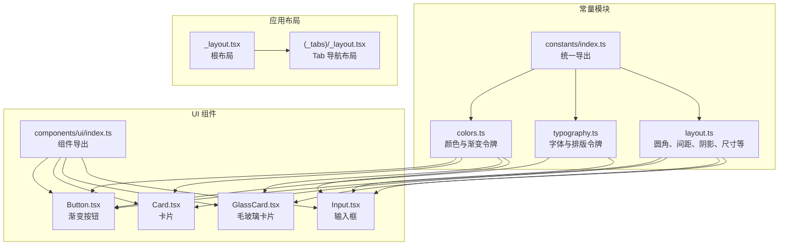
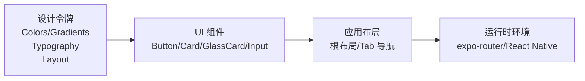
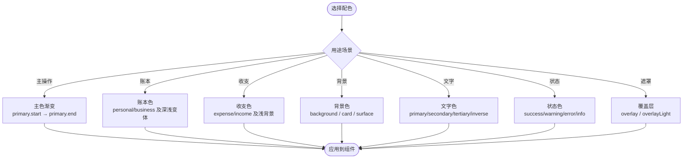
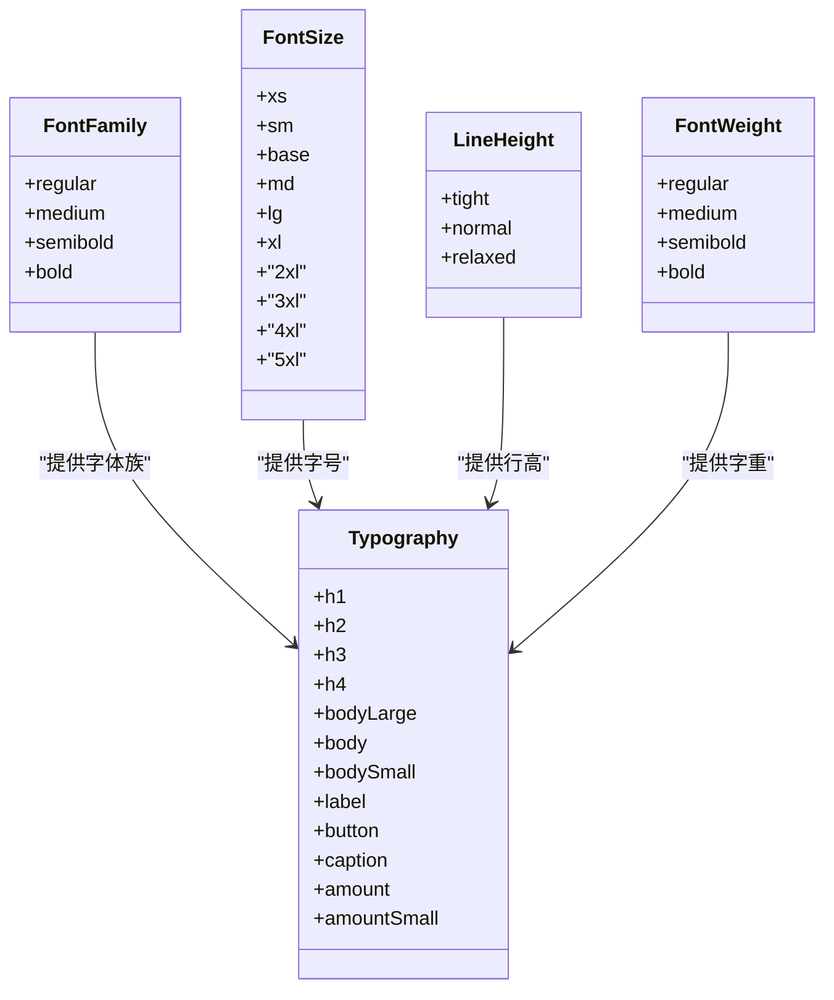
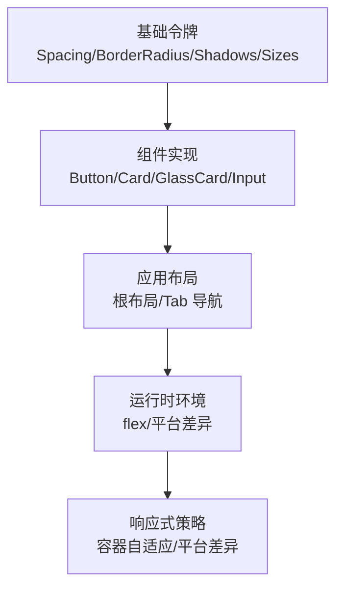
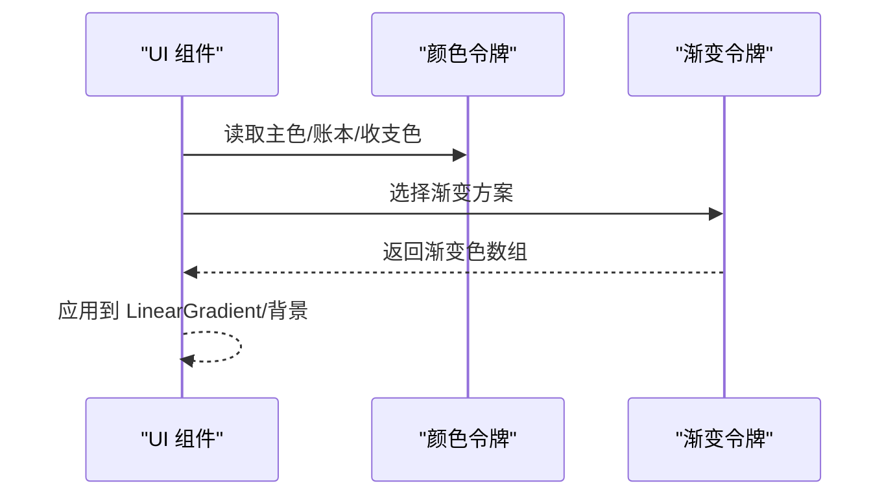
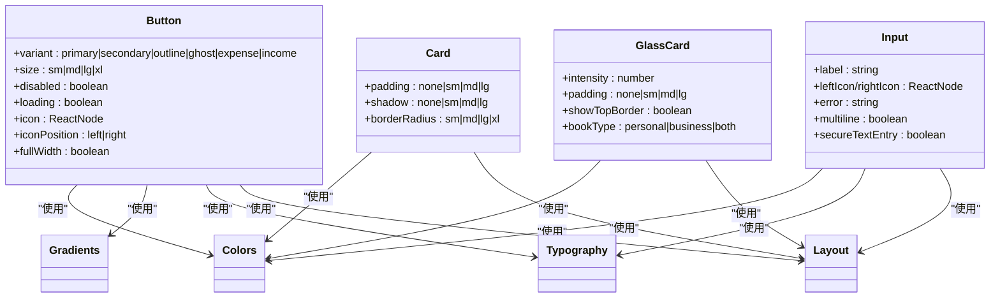
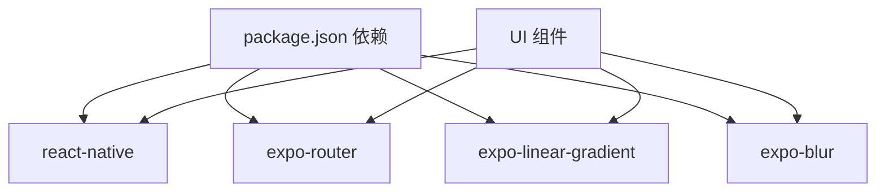

# 设计系统

<cite>
**本文引用的文件**
- [src/constants/colors.ts](file://src/constants/colors.ts)
- [src/constants/typography.ts](file://src/constants/typography.ts)
- [src/constants/layout.ts](file://src/constants/layout.ts)
- [src/constants/index.ts](file://src/constants/index.ts)
- [src/components/ui/Button.tsx](file://src/components/ui/Button.tsx)
- [src/components/ui/Card.tsx](file://src/components/ui/Card.tsx)
- [src/components/ui/GlassCard.tsx](file://src/components/ui/GlassCard.tsx)
- [src/components/ui/Input.tsx](file://src/components/ui/Input.tsx)
- [src/components/ui/index.ts](file://src/components/ui/index.ts)
- [src/app/_layout.tsx](file://src/app/_layout.tsx)
- [src/app/(tabs)/_layout.tsx](file://src/app/(tabs)/_layout.tsx)
- [src/types/index.ts](file://src/types/index.ts)
- [package.json](file://package.json)
</cite>

## 目录
1. [引言](#引言)
2. [项目结构](#项目结构)
3. [核心组件](#核心组件)
4. [架构总览](#架构总览)
5. [详细组件分析](#详细组件分析)
6. [依赖关系分析](#依赖关系分析)
7. [性能考量](#性能考量)
8. [故障排查指南](#故障排查指南)
9. [结论](#结论)
10. [附录](#附录)

## 引言
本设计系统文档面向 UI/UX 设计师与前端开发者，统一“攒钱记账”应用的颜色、字体与布局规范，明确渐变色彩的应用场景与视觉效果，阐述字号、字重与行高的设计原则，并给出响应式布局策略与断点建议。同时提供设计令牌的定义与使用方法，以及设计系统的扩展与维护规范，确保跨平台的一致性与可维护性。

## 项目结构
设计系统以常量模块为核心，通过统一导出入口集中管理颜色、字体与布局令牌；UI 组件基于这些令牌进行实现，保证风格一致与复用高效。

图表来源
- [src/constants/colors.ts](file://src/constants/colors.ts#L1-L88)
- [src/constants/typography.ts](file://src/constants/typography.ts#L1-L149)
- [src/constants/layout.ts](file://src/constants/layout.ts#L1-L182)
- [src/constants/index.ts](file://src/constants/index.ts#L1-L12)
- [src/components/ui/Button.tsx](file://src/components/ui/Button.tsx#L1-L204)
- [src/components/ui/Card.tsx](file://src/components/ui/Card.tsx#L1-L94)
- [src/components/ui/GlassCard.tsx](file://src/components/ui/GlassCard.tsx#L1-L126)
- [src/components/ui/Input.tsx](file://src/components/ui/Input.tsx#L1-L194)
- [src/components/ui/index.ts](file://src/components/ui/index.ts#L1-L9)
- [src/app/_layout.tsx](file://src/app/_layout.tsx#L1-L61)
- [src/app/(tabs)/_layout.tsx](file://src/app/(tabs)/_layout.tsx#L1-L121)

章节来源
- [src/constants/index.ts](file://src/constants/index.ts#L1-L12)
- [src/components/ui/index.ts](file://src/components/ui/index.ts#L1-L9)

## 核心组件
- 颜色系统：主色、账本标识色、收支色、背景与表面、文字色、边框与分隔线、状态色、灰度与覆盖层；并提供主主题渐变与账本/收支专用渐变。
- 字体系统：字体族（iOS/Android 差异）、字号、行高、字重与预设文本样式（标题、正文、标签、按钮、说明、金额等）。
- 布局系统：圆角、间距、阴影、图标/头像/按钮/输入高度、尺寸、动画时长、Z-index 层级。

章节来源
- [src/constants/colors.ts](file://src/constants/colors.ts#L1-L88)
- [src/constants/typography.ts](file://src/constants/typography.ts#L1-L149)
- [src/constants/layout.ts](file://src/constants/layout.ts#L1-L182)

## 架构总览
设计令牌通过常量模块集中管理，UI 组件在实现中直接引用这些令牌，避免硬编码，提升一致性与可维护性。应用布局文件使用背景色与动画配置，体现整体风格。

图表来源
- [src/constants/colors.ts](file://src/constants/colors.ts#L78-L85)
- [src/constants/typography.ts](file://src/constants/typography.ts#L62-L146)
- [src/constants/layout.ts](file://src/constants/layout.ts#L9-L181)
- [src/components/ui/Button.tsx](file://src/components/ui/Button.tsx#L14-L17)
- [src/components/ui/Card.tsx](file://src/components/ui/Card.tsx#L6-L8)
- [src/components/ui/GlassCard.tsx](file://src/components/ui/GlassCard.tsx#L7-L11)
- [src/components/ui/Input.tsx](file://src/components/ui/Input.tsx#L15-L18)
- [src/app/_layout.tsx](file://src/app/_layout.tsx#L34-L38)
- [src/app/(tabs)/_layout.tsx](file://src/app/(tabs)/_layout.tsx#L41-L48)

## 详细组件分析

### 颜色系统与渐变方案
- 主色与渐变：主色采用从青绿到浅绿的渐变，适用于主要操作与强调元素；提供启动页渐变与账本/收支专用渐变，增强语义表达。
- 账本标识色：个人账本与公司账本分别有主色、浅背景与深色，便于区分与品牌化。
- 收支颜色：支出与收入使用柔和对比色，配合浅背景提升可读性。
- 背景与表面：背景与卡片表面采用白色，结合玻璃态卡片实现通透感。
- 文字与边框：提供主/次/三级文字色与分隔线、边框色，满足不同层级信息展示。
- 状态色：成功、警告、错误、信息色用于反馈与提示。
- 灰度与覆盖层：多级灰度与半透明覆盖层用于弱化背景与遮罩。

图表来源
- [src/constants/colors.ts](file://src/constants/colors.ts#L6-L75)
- [src/constants/colors.ts](file://src/constants/colors.ts#L78-L85)

章节来源
- [src/constants/colors.ts](file://src/constants/colors.ts#L1-L88)

### 字体系统与排版规范
- 字体家族：iOS 使用系统字体，Android 使用 Roboto 系列，保证平台一致性。
- 字号体系：xs 到 5xl 的连续字号，适配标题、正文、标签、按钮与说明等场景。
- 行高与字重：tight/normal/relaxed 的行高与 regular/medium/semibold/bold 的字重组合，形成稳定的阅读节奏。
- 预设样式：h1-h4、body/bodyLarge/bodySmall、label、button、caption、amount/amountSmall 等，覆盖常见 UI 文案需求。

图表来源
- [src/constants/typography.ts](file://src/constants/typography.ts#L9-L30)
- [src/constants/typography.ts](file://src/constants/typography.ts#L32-L51)
- [src/constants/typography.ts](file://src/constants/typography.ts#L54-L59)
- [src/constants/typography.ts](file://src/constants/typography.ts#L62-L146)

章节来源
- [src/constants/typography.ts](file://src/constants/typography.ts#L1-L149)

### 布局系统与响应式策略
- 圆角与间距：从 xs 到 5xl 的连续间距与多级圆角，支撑组件内边距、外边距与形状一致性。
- 阴影与层级：提供 sm/md/lg/xl 等阴影等级与 Z-index 层级，用于浮层、卡片与模态场景。
- 尺寸规范：图标、头像、按钮、输入框高度与导航栏尺寸，统一视觉密度。
- 动画时长：fast/normal/slow 的时长设定，保证交互节奏稳定。
- 响应式策略：当前项目未显式定义断点，但通过平台差异（iOS/Android）与容器自适应（flex）实现基础响应式；建议在新增复杂布局时引入断点策略（如小屏/中屏/大屏），并在组件中使用尺寸令牌与间距令牌进行缩放。

图表来源
- [src/constants/layout.ts](file://src/constants/layout.ts#L9-L34)
- [src/constants/layout.ts](file://src/constants/layout.ts#L36-L110)
- [src/constants/layout.ts](file://src/constants/layout.ts#L112-L154)
- [src/constants/layout.ts](file://src/constants/layout.ts#L156-L172)
- [src/app/_layout.tsx](file://src/app/_layout.tsx#L34-L38)
- [src/app/(tabs)/_layout.tsx](file://src/app/(tabs)/_layout.tsx#L91-L99)

章节来源
- [src/constants/layout.ts](file://src/constants/layout.ts#L1-L182)
- [src/app/_layout.tsx](file://src/app/_layout.tsx#L1-L61)
- [src/app/(tabs)/_layout.tsx](file://src/app/(tabs)/_layout.tsx#L1-L121)

### 渐变色彩的应用场景与视觉效果
- 主渐变：用于主要按钮与强调元素，传达积极、成长与清晰的视觉感受。
- 启动页渐变：背景渐变营造柔和过渡与活力氛围。
- 账本渐变：个人与公司账本使用专属渐变，强化身份识别与品牌化。
- 收支渐变：支出与收入使用对应渐变，直观表达财务流向。
- 视觉效果：渐变增强层次感与现代感，结合阴影与圆角提升卡片与按钮的立体表现。

图表来源
- [src/components/ui/Button.tsx](file://src/components/ui/Button.tsx#L100-L110)
- [src/components/ui/Input.tsx](file://src/components/ui/Input.tsx#L117-L122)
- [src/constants/colors.ts](file://src/constants/colors.ts#L78-L85)

章节来源
- [src/constants/colors.ts](file://src/constants/colors.ts#L78-L85)
- [src/components/ui/Button.tsx](file://src/components/ui/Button.tsx#L100-L110)
- [src/components/ui/Input.tsx](file://src/components/ui/Input.tsx#L117-L122)

### 字体大小、字重与行高的设计原则
- 标题层级：h1-h4 采用递减字号与紧密行高，确保层级清晰。
- 正文与标签：body/bodyLarge/bodySmall 与 label 在字号与行高上保持一致的阅读节奏。
- 按钮与说明：button 与 caption 采用适中的字号与紧凑行高，兼顾可读性与空间利用。
- 金额展示：amount/amountSmall 强调数字权重与可读性，适合财务场景。
- 平台差异：通过 FontFamily 的 Platform.select 适配 iOS/Android 字体，保证一致性体验。

章节来源
- [src/constants/typography.ts](file://src/constants/typography.ts#L62-L146)

### 响应式布局的设计策略与断点设置
- 当前策略：通过 flex 容器与平台差异（iOS/Android）实现基础响应式；Tab 导航栏高度在 iOS 上增加内边距以适配安全区。
- 断点建议：建议按以下维度划分断点（示例）
  - 小屏（<= 320dp）：紧凑间距与较小字号
  - 中屏（321dp - 480dp）：标准间距与字号
  - 大屏（481dp - 768dp）：适度扩大间距与字号
  - 超大屏（> 768dp）：最大化内容密度与信息层级
- 实施方式：在组件中优先使用间距与尺寸令牌，结合容器宽度判断进行条件渲染或样式调整。

章节来源
- [src/app/(tabs)/_layout.tsx](file://src/app/(tabs)/_layout.tsx#L91-L99)

### 设计令牌的定义与使用方法
- 定义位置：colors.ts、typography.ts、layout.ts 分别定义颜色、字体与布局令牌，并通过 constants/index.ts 统一导出。
- 使用方式：UI 组件通过导入常量模块中的具体令牌（如 Colors、Typography、Layout）进行样式计算与赋值，避免硬编码。
- 扩展建议：新增令牌时遵循现有命名与结构，确保与现有组件兼容。

章节来源
- [src/constants/index.ts](file://src/constants/index.ts#L1-L12)
- [src/components/ui/Button.tsx](file://src/components/ui/Button.tsx#L14-L17)
- [src/components/ui/Card.tsx](file://src/components/ui/Card.tsx#L6-L8)
- [src/components/ui/GlassCard.tsx](file://src/components/ui/GlassCard.tsx#L7-L11)
- [src/components/ui/Input.tsx](file://src/components/ui/Input.tsx#L15-L18)

### 组件实现与设计规范映射
- Button：支持多种变体（primary/secondary/outline/ghost/expense/income）与尺寸，根据变体选择背景色、文字色与边框；主色按钮使用渐变；禁用/加载状态统一处理。
- Card：支持内边距、阴影与圆角等级选择，统一卡片表面与背景。
- GlassCard：在 iOS 使用 BlurView，在 Android 使用半透明背景替代；支持顶部渐变边框与不同强度的玻璃效果。
- Input：支持标签、左右图标、多行、聚焦状态下的渐变底部线与错误状态提示，统一字体与尺寸。

图表来源
- [src/components/ui/Button.tsx](file://src/components/ui/Button.tsx#L19-L34)
- [src/components/ui/Card.tsx](file://src/components/ui/Card.tsx#L10-L16)
- [src/components/ui/GlassCard.tsx](file://src/components/ui/GlassCard.tsx#L13-L20)
- [src/components/ui/Input.tsx](file://src/components/ui/Input.tsx#L20-L39)
- [src/constants/colors.ts](file://src/constants/colors.ts#L78-L85)
- [src/constants/typography.ts](file://src/constants/typography.ts#L62-L146)
- [src/constants/layout.ts](file://src/constants/layout.ts#L9-L181)

章节来源
- [src/components/ui/Button.tsx](file://src/components/ui/Button.tsx#L1-L204)
- [src/components/ui/Card.tsx](file://src/components/ui/Card.tsx#L1-L94)
- [src/components/ui/GlassCard.tsx](file://src/components/ui/GlassCard.tsx#L1-L126)
- [src/components/ui/Input.tsx](file://src/components/ui/Input.tsx#L1-L194)

## 依赖关系分析
- 组件对常量模块的依赖：Button、Card、GlassCard、Input 明确导入 Colors、Typography、Layout 与 Gradients。
- 应用布局对常量模块的依赖：根布局与 Tab 导航使用背景色与动画配置，体现整体风格。
- 运行时依赖：项目使用 expo-router、react-native、expo-linear-gradient、expo-blur 等，为渐变与毛玻璃效果提供原生能力。

图表来源
- [package.json](file://package.json#L11-L34)
- [src/components/ui/Button.tsx](file://src/components/ui/Button.tsx#L14)
- [src/components/ui/GlassCard.tsx](file://src/components/ui/GlassCard.tsx#L7)
- [src/components/ui/Input.tsx](file://src/components/ui/Input.tsx#L15)

章节来源
- [package.json](file://package.json#L1-L43)

## 性能考量
- 渐变与模糊：渐变与 BlurView 在低端设备上可能影响帧率，建议在列表滚动区域减少过度使用，或在 Android 使用半透明背景替代。
- 字体加载：确保字体资源正确加载后再显示界面，避免闪烁与布局抖动。
- 阴影与圆角：大量圆角与阴影会增加绘制成本，建议在非关键区域使用较小阴影与圆角。
- 动画时长：合理使用 fast/normal/slow 时长，避免过长动画导致感知迟滞。

## 故障排查指南
- 渐变不生效：检查 Gradients 与 Colors 的引用是否正确，确认 LinearGradient 的颜色数组顺序与令牌一致。
- 毛玻璃效果异常：在 Android 平台使用半透明背景替代，确认背景色与透明度设置。
- 字体显示异常：确认 FontFamily 的 Platform.select 是否返回预期字体族，必要时在应用启动阶段预加载字体。
- Tab 导航栏高度问题：iOS 平台增加内边距以适配安全区，确认 Sizes.tabBar 与平台差异逻辑。

章节来源
- [src/components/ui/Button.tsx](file://src/components/ui/Button.tsx#L100-L110)
- [src/components/ui/GlassCard.tsx](file://src/components/ui/GlassCard.tsx#L72-L88)
- [src/constants/typography.ts](file://src/constants/typography.ts#L9-L30)
- [src/app/(tabs)/_layout.tsx](file://src/app/(tabs)/_layout.tsx#L91-L99)

## 结论
本设计系统通过集中化的颜色、字体与布局令牌，结合渐变与毛玻璃等现代视觉技术，为“攒钱记账”应用提供了统一且可扩展的设计语言。UI 组件严格遵循令牌规范，确保跨平台一致性与良好的用户体验。建议在后续迭代中完善响应式断点策略与更多组件的令牌化实现，持续优化性能与可维护性。

## 附录
- 数据模型参考：AccountBookType、TransactionType、User、Account、Category、Record、SavingsGoal、Budget、Statistics 等类型，为设计与交互提供数据语义支撑。
- 组件导出：components/ui/index.ts 提供统一导出，便于在业务页面中按需引入。

章节来源
- [src/types/index.ts](file://src/types/index.ts#L5-L140)
- [src/components/ui/index.ts](file://src/components/ui/index.ts#L1-L9)