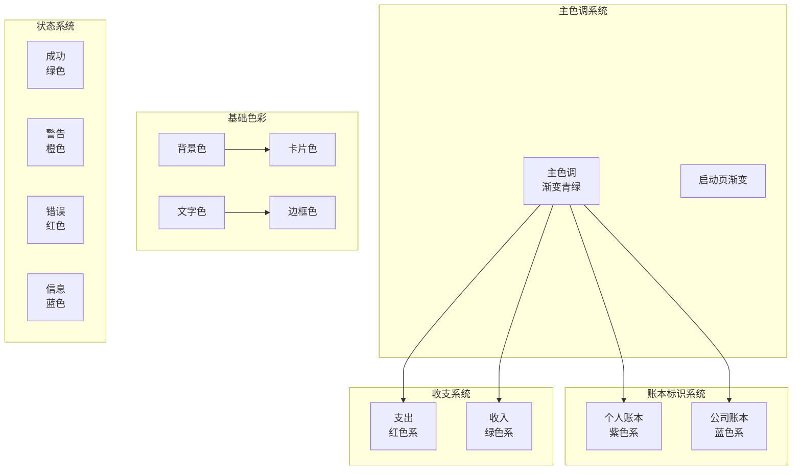
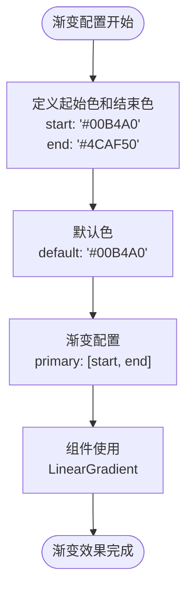
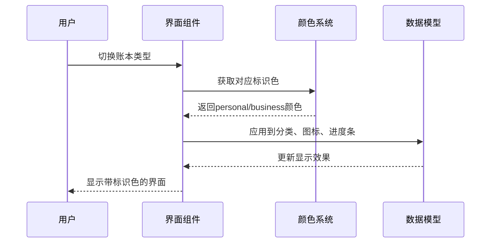
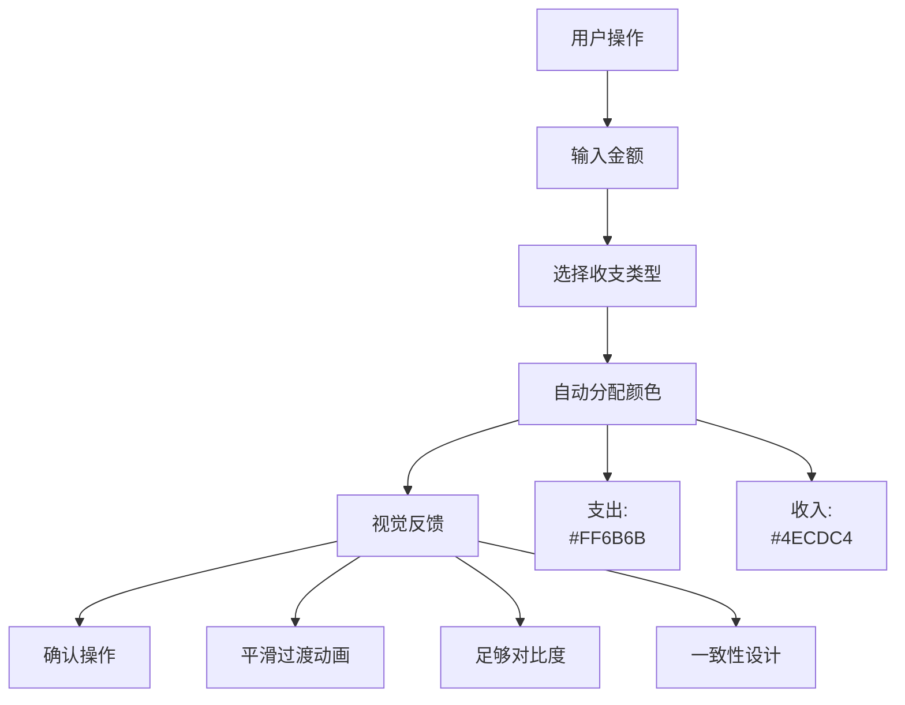
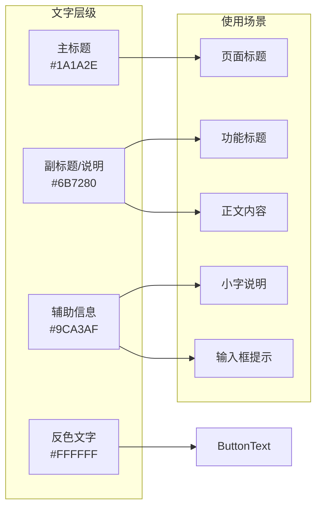
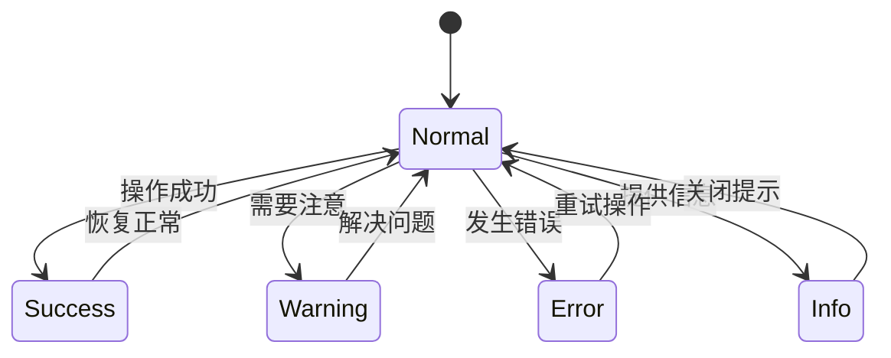
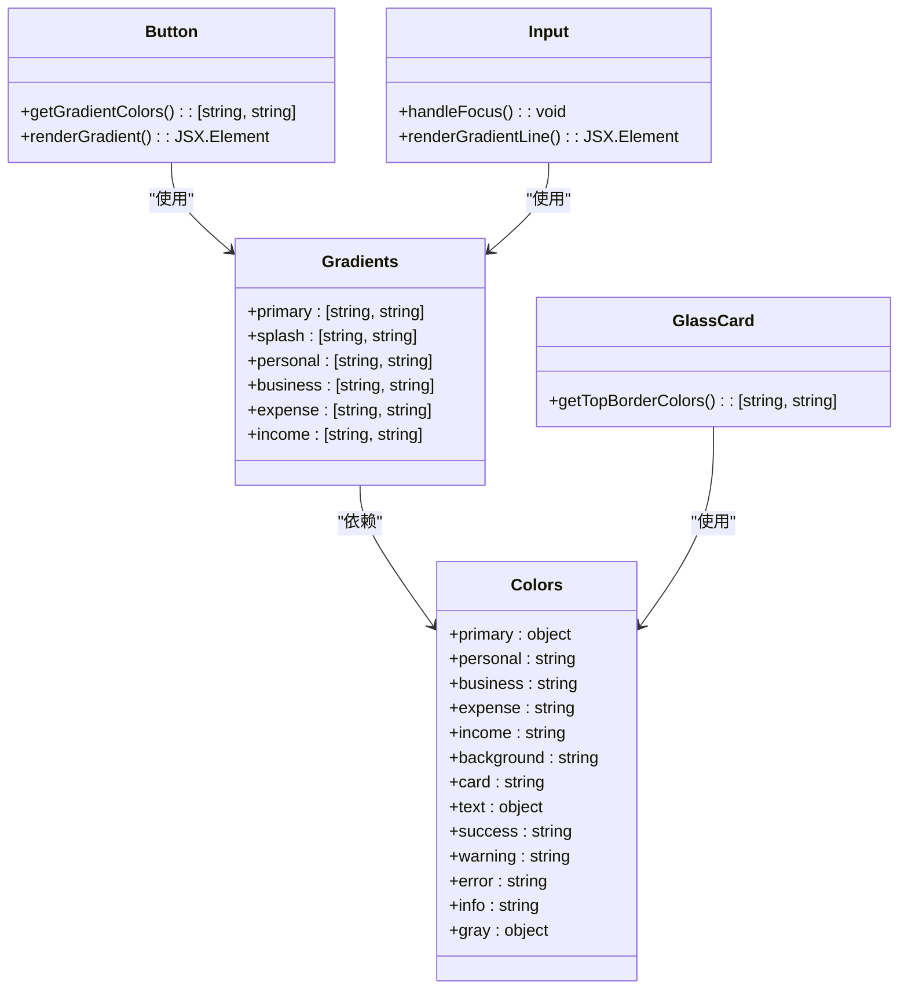
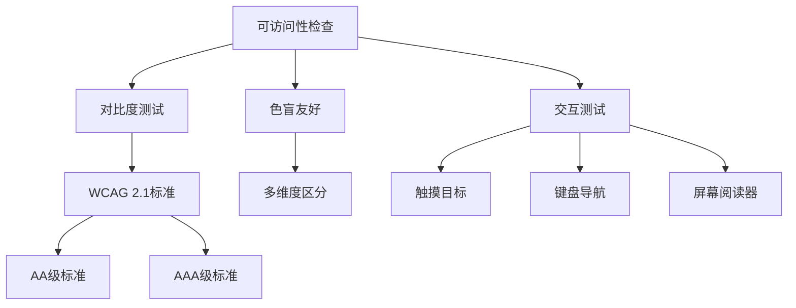

# 颜色系统

<cite>
**本文档引用的文件**
- [colors.ts](file://src/constants/colors.ts)
- [Button.tsx](file://src/components/ui/Button.tsx)
- [Card.tsx](file://src/components/ui/Card.tsx)
- [GlassCard.tsx](file://src/components/ui/GlassCard.tsx)
- [Input.tsx](file://src/components/ui/Input.tsx)
- [index.tsx](file://src/app/index.tsx)
- [index.tsx](file://src/app/savings/index.tsx)
- [categories.ts](file://src/mocks/categories.ts)
- [index.ts](file://src/types/index.ts)
</cite>

## 目录
1. [简介](#简介)
2. [设计理念](#设计理念)
3. [核心色彩体系](#核心色彩体系)
4. [主色调 - 渐变青绿](#主色调---渐变青绿)
5. [账本标识色](#账本标识色)
6. [收支颜色](#收支颜色)
7. [背景与表面色彩](#背景与表面色彩)
8. [文字色彩层级](#文字色彩层级)
9. [状态色彩系统](#状态色彩系统)
10. [渐变配置详解](#渐变配置详解)
11. [灰度系统](#灰度系统)
12. [色彩应用规范](#色彩应用规范)
13. [可访问性指南](#可访问性指南)
14. [总结](#总结)

## 简介

"攒钱记账"应用采用现代化、优雅、轻量的设计风格，融合玻璃态和微质感设计。颜色系统围绕主色调渐变青绿构建，通过科学的色彩搭配和严格的对比度设计，为用户提供直观、舒适的财务管理体验。

## 设计理念

应用的颜色设计遵循以下核心原则：
- **现代优雅**：采用简洁的色彩组合，避免过度装饰
- **轻量设计**：注重色彩的透明度和层次感
- **玻璃态设计**：通过半透明效果营造空间深度
- **微质感**：利用阴影和边框增强视觉层次
- **情感化表达**：通过色彩传达积极的财务管理和成长寓意

## 核心色彩体系

颜色系统采用模块化设计，主要分为以下几个维度：



**图表来源**
- [colors.ts](file://src/constants/colors.ts#L6-L85)

## 主色调 - 渐变青绿

### 设计理念

主色调采用渐变青绿设计，象征着成长、希望和清晰的财务状况。青绿色在心理学上具有平衡、和谐的效果，能够给用户带来稳定和信任感。

### 技术实现



**图表来源**
- [colors.ts](file://src/constants/colors.ts#L8-L12)
- [colors.ts](file://src/constants/colors.ts#L78-L80)

### 应用场景

- **启动页背景**：使用渐变背景营造专业感
- **按钮主色**：作为主要交互元素的视觉焦点
- **进度条**：表示财务目标的完成进度
- **图标强调**：用于重要的操作按钮

**章节来源**
- [colors.ts](file://src/constants/colors.ts#L8-L12)
- [index.tsx](file://src/app/index.tsx#L77-L82)
- [Button.tsx](file://src/components/ui/Button.tsx#L100-L110)

## 账本标识色

### 个人账本 - 温馨紫色

个人账本采用温馨的紫色系，代表私密性、温暖和个性化管理。

#### 色彩配置

| 配置项 | 颜色值 | 用途 |
|--------|--------|------|
| personal | `#9C6ADE` | 主标识色 |
| personalLight | `#F3EAFF` | 浅色背景 |
| personalDark | `#7C4DBC` | 深色强调 |

#### 视觉含义

- **紫色**：象征创意、个性和温暖
- **浅紫色**：营造柔和、舒适的个人空间感
- **深紫色**：提供足够的对比度用于强调

### 公司账本 - 专业蓝色

公司账本采用专业的蓝色系，体现严谨、可靠的企业财务管理。

#### 色彩配置

| 配置项 | 颜色值 | 用途 |
|--------|--------|------|
| business | `#2E7EB5` | 主标识色 |
| businessLight | `#E3F2FD` | 浅色背景 |
| businessDark | `#1D5A8A` | 深色强调 |

#### 视觉含义

- **蓝色**：代表专业、信任和稳定性
- **浅蓝色**：营造正式但不严肃的工作氛围
- **深蓝色**：提供专业感和权威性

### 应用规范



**图表来源**
- [GlassCard.tsx](file://src/components/ui/GlassCard.tsx#L45-L58)
- [savings/index.tsx](file://src/app/savings/index.tsx#L74-L75)

**章节来源**
- [colors.ts](file://src/constants/colors.ts#L14-L21)
- [GlassCard.tsx](file://src/components/ui/GlassCard.tsx#L45-L58)
- [savings/index.tsx](file://src/app/savings/index.tsx#L74-L75)

## 收支颜色

### 支出 - 柔和红色

支出使用柔和的红色系，通过心理学原理提醒用户注意资金流出。

#### 色彩配置

| 配置项 | 颜色值 | 用途 |
|--------|--------|------|
| expense | `#FF6B6B` | 支出主色 |
| expenseLight | `#FFEBEE` | 支出浅色背景 |

#### 心理学原理

- **红色**：在视觉上具有前进感和警示作用
- **柔和红色**：避免过于刺激，保持友好性
- **浅色背景**：用于区分不同类型的收支项目

### 收入 - 清新绿色

收入使用清新的绿色系，传达积极、增长的财务状态。

#### 色彩配置

| 配置项 | 颜色值 | 用途 |
|--------|--------|------|
| income | `#4ECDC4` | 收入主色 |
| incomeLight | `#E0F7F5` | 收入浅色背景 |

#### 心理学原理

- **绿色**：象征成长、健康和财富积累
- **青绿色**：平衡了活力和稳重感
- **浅色背景**：营造轻松、积极的财务氛围

### 用户体验考虑



**图表来源**
- [Input.tsx](file://src/components/ui/Input.tsx#L117-L123)
- [categories.ts](file://src/mocks/categories.ts#L9-L31)

**章节来源**
- [colors.ts](file://src/constants/colors.ts#L23-L27)
- [Input.tsx](file://src/components/ui/Input.tsx#L117-L123)
- [categories.ts](file://src/mocks/categories.ts#L9-L31)

## 背景与表面色彩

### 背景色层级

应用采用分层的背景色彩设计，确保界面的层次感和可读性。

#### 背景配置

| 配置项 | 颜色值 | 用途 |
|--------|--------|------|
| background | `#F8FAFC` | 主背景色 |
| backgroundGradientStart | `#E0F2E9` | 渐变起始色 |
| backgroundGradientEnd | `#FFFFFF` | 渐变结束色 |

#### 表面色彩

| 配置项 | 颜色值 | 用途 |
|--------|--------|------|
| card | `#FFFFFF` | 卡片背景 |
| cardGlass | `rgba(255, 255, 255, 0.8)` | 玻璃卡片背景 |

### 设计考量

- **高对比度**：确保文字内容的可读性
- **柔和过渡**：背景渐变提供视觉舒适度
- **透明度控制**：玻璃卡片效果需要精确的透明度设置

**章节来源**
- [colors.ts](file://src/constants/colors.ts#L29-L37)
- [index.tsx](file://src/app/index.tsx#L77-L82)

## 文字色彩层级

### 层级结构

应用采用三级文字色彩系统，满足不同信息的重要性和可读性需求。

#### 文字色彩配置

| 配置项 | 颜色值 | 用途 | 对比度要求 |
|--------|--------|------|------------|
| text.primary | `#1A1A2E` | 主要标题和正文 | ≥4.5:1 |
| text.secondary | `#6B7280` | 次要信息和说明 | ≥3:1 |
| text.tertiary | `#9CA3AF` | 辅助信息和占位符 | ≥3:1 |
| text.inverse | `#FFFFFF` | 反色文字（深色背景） | ≥4.5:1 |

### 应用场景



**图表来源**
- [colors.ts](file://src/constants/colors.ts#L40-L45)

**章节来源**
- [colors.ts](file://src/constants/colors.ts#L40-L45)

## 状态色彩系统

### 成功状态 - 绿色

成功状态使用明快的绿色，传达积极、完成的含义。

#### 配置
- **success**: `#10B981` - 主要成功状态色

### 警告状态 - 橙色

警告状态使用醒目的橙色，提醒用户需要注意的情况。

#### 配置
- **warning**: `#F59E0B` - 主要警告状态色

### 错误状态 - 红色

错误状态使用强烈的红色，明确指示操作失败或问题存在。

#### 配置
- **error**: `#EF4444` - 主要错误状态色

### 信息状态 - 蓝色

信息状态使用专业的蓝色，提供中性的信息提示。

#### 配置
- **info**: `#3B82F6` - 主要信息状态色

### 应用规范



**图表来源**
- [Input.tsx](file://src/components/ui/Input.tsx#L183-L186)

**章节来源**
- [colors.ts](file://src/constants/colors.ts#L52-L56)
- [Input.tsx](file://src/components/ui/Input.tsx#L183-L186)

## 渐变配置详解

### 渐变系统架构

应用采用统一的渐变配置系统，确保视觉效果的一致性和可维护性。

#### 渐变配置表

| 渐变名称 | 颜色组合 | 使用场景 |
|----------|----------|----------|
| primary | [start: `#00B4A0`, end: `#4CAF50`] | 主要按钮、进度条、图标 |
| splash | [start: `#E0F2E9`, end: `#FFFFFF`] | 启动页背景、页面过渡 |
| personal | [start: `#9C6ADE`, end: `#7C4DBC`] | 个人账本相关元素 |
| business | [start: `#2E7EB5`, end: `#1D5A8A`] | 公司账本相关元素 |
| expense | [start: `#FF6B6B`, end: `#FF8787`] | 支出相关元素 |
| income | [start: `#4ECDC4`, end: `#6EE7DE`] | 收入相关元素 |

### 技术实现



**图表来源**
- [colors.ts](file://src/constants/colors.ts#L78-L85)
- [Button.tsx](file://src/components/ui/Button.tsx#L100-L110)
- [Input.tsx](file://src/components/ui/Input.tsx#L117-L123)
- [GlassCard.tsx](file://src/components/ui/GlassCard.tsx#L45-L58)

### 渐变效果实现

渐变效果通过LinearGradient组件实现，支持iOS和Android平台的原生渲染。

**章节来源**
- [colors.ts](file://src/constants/colors.ts#L78-L85)
- [Button.tsx](file://src/components/ui/Button.tsx#L100-L110)
- [Input.tsx](file://src/components/ui/Input.tsx#L117-L123)

## 灰度系统

### 完整色阶定义

应用采用完整的灰度系统，共9个等级，满足从高亮到深色的完整需求。

#### 灰度配置表

| 等级 | 颜色值 | 用途 |
|------|--------|------|
| 50 | `#F9FAFB` | 极浅背景 |
| 100 | `#F3F4F6` | 浅背景 |
| 200 | `#E5E7EB` | 边框和分割线 |
| 300 | `#D1D5DB` | 次要边框 |
| 400 | `#9CA3AF` | 次要文字 |
| 500 | `#6B7280` | 次要文字 |
| 600 | `#4B5563` | 基础文字 |
| 700 | `#374151` | 主要文字 |
| 800 | `#1F2937` | 深色文字 |
| 900 | `#111827` | 极深文字 |

### 应用场景

```mermaid
graph TB
subgraph "灰度应用矩阵"
Background[背景层<br/>50-100]
Surface[表面层<br/>100-200]
Divider[分割线<br/>200-300]
Secondary[次要文字<br/>400-500]
Primary[主要文字<br/>600-800]
Dark[深色文字<br/>900]
end
subgraph "具体应用"
BG1[F8FAFC<br/>主背景]
BG2[E0F2E9<br/>渐变背景]
SUR1[FFFFFF<br/>卡片背景]
SUR2[rgba(255,255,255,0.8)<br/>玻璃卡片]
DIV1[E5E7EB<br/>边框]
DIV2[D1D5DB<br/>分割线]
SEC1[9CA3AF<br/>辅助文字]
PRI1[6B7280<br/>次要文字]
PRI2[1A1A2E<br/>主要文字]
end
Background --> BG1
Background --> BG2
Surface --> SUR1
Surface --> SUR2
Divider --> DIV1
Divider --> DIV2
Secondary --> SEC1
Primary --> PRI1
Primary --> PRI2
```

**图表来源**
- [colors.ts](file://src/constants/colors.ts#L59-L70)

**章节来源**
- [colors.ts](file://src/constants/colors.ts#L59-L70)

## 色彩应用规范

### 组件使用规范

#### 按钮组件色彩应用

| 按钮变体 | 背景色 | 文字色 | 边框色 | 渐变色 |
|----------|--------|--------|--------|--------|
| primary | primary.default | text.inverse | 无 | Gradients.primary |
| secondary | gray.100 | text.primary | 无 | 无 |
| outline | transparent | primary | 1.5px solid | 无 |
| ghost | transparent | text.secondary | 无 | 无 |
| expense | expenseLight | expense | 无 | Gradients.expense |
| income | incomeLight | income | 无 | Gradients.income |

#### 输入框色彩应用

| 状态 | 底部线条 | 占位符 | 错误状态 |
|------|----------|--------|----------|
| 正常 | gray.300 | text.tertiary | 无 |
| 聚焦 | Gradients.primary | text.primary | 无 |
| 错误 | error | error | error |

### 数据可视化色彩应用

#### 分类颜色映射

| 分类类型 | 颜色方案 | 说明 |
|----------|----------|------|
| 个人支出 | 多样化颜色 | 丰富视觉层次 |
| 个人收入 | 绿色系为主 | 积极向上的财务状态 |
| 公司支出 | 蓝色系为主 | 专业严谨的财务管理 |
| 公司收入 | 绿色系为主 | 企业财务健康状态 |

**章节来源**
- [Button.tsx](file://src/components/ui/Button.tsx#L53-L88)
- [Input.tsx](file://src/components/ui/Input.tsx#L115-L135)
- [categories.ts](file://src/mocks/categories.ts#L9-L49)

## 可访问性指南

### 对比度标准

应用严格遵守WCAG 2.1可访问性标准：

- **文本与背景**：至少4.5:1（AA标准）
- **大文本与背景**：至少3:1（AA标准）
- **图标与背景**：至少3:1（AA标准）

### 色盲友好设计

- **避免仅用颜色区分信息**：结合形状、纹理等其他视觉元素
- **颜色组合验证**：确保在色盲模式下仍能区分重要信息
- **高对比度选项**：为有视觉障碍的用户提供更大字体和更高对比度

### 交互可访问性



### 对比度测试方法

1. **工具测试**：使用浏览器开发者工具或专门的对比度检测工具
2. **手动测试**：在不同光照条件下观察界面效果
3. **用户测试**：邀请有视觉障碍的用户进行实际使用测试
4. **自动化测试**：集成到CI/CD流程中进行持续监控

### 建议的改进措施

- **增加颜色对比度调节选项**
- **提供高对比度模式**
- **增强触觉反馈**
- **优化语音导航**

## 总结

"攒钱记账"应用的颜色系统通过精心设计的色彩组合和严格的对比度控制，为用户提供了直观、舒适且具有情感共鸣的财务管理体验。系统化的色彩架构不仅确保了视觉一致性，还为未来的功能扩展和主题定制奠定了坚实基础。

通过主色调渐变青绿、个人紫色和公司蓝色的差异化设计，以及收支颜色的心理学应用，系统成功地将财务管理的专业性与用户的个人情感需求相结合。完善的灰度系统和渐变配置确保了在各种设备和环境下都能提供优秀的视觉效果。

该颜色系统的设计充分体现了现代移动应用的美学标准，同时兼顾了可访问性和用户体验的各个方面，为"攒钱记账"应用建立了独特的视觉识别系统。