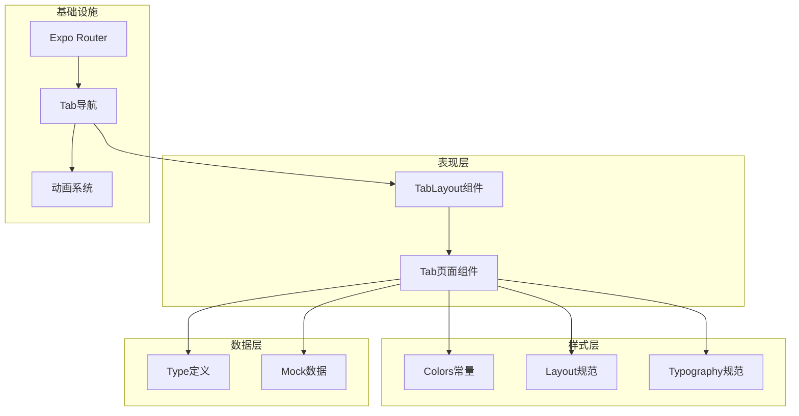
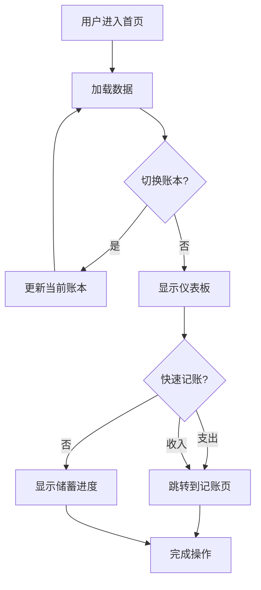
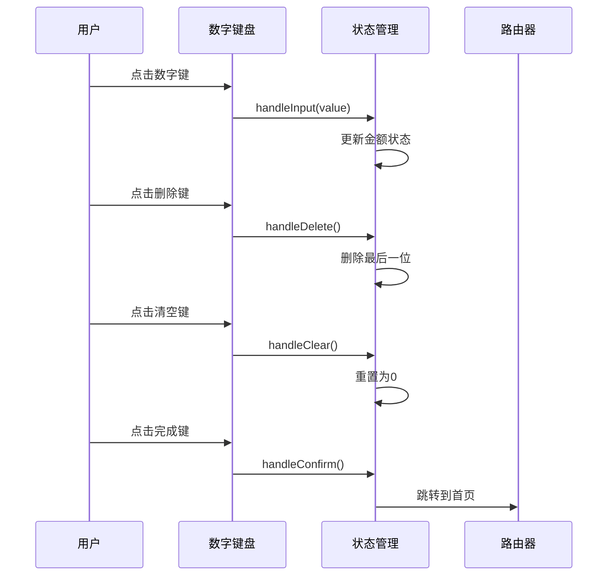
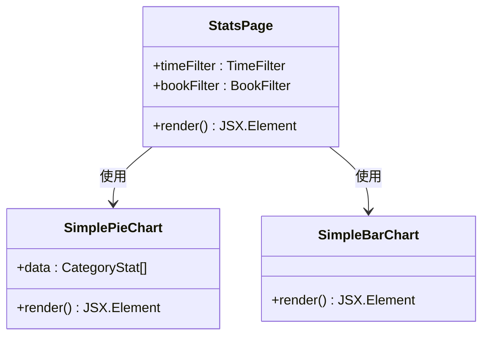
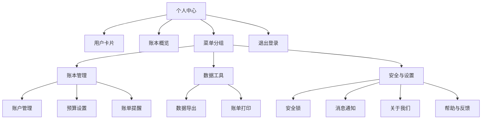
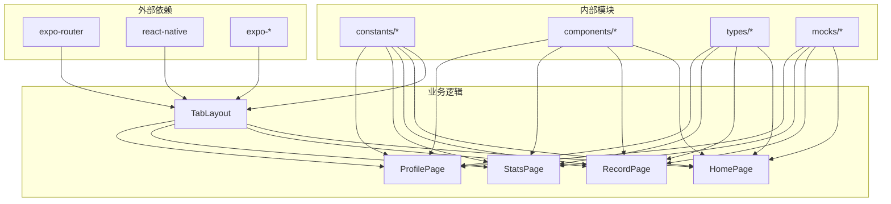

# Tab导航系统

<cite>
**本文档引用的文件**
- [src/app/_layout.tsx](file://src/app/_layout.tsx)
- [src/app/(tabs)/_layout.tsx](file://src/app/(tabs)/_layout.tsx)
- [src/app/(tabs)/index.tsx](file://src/app/(tabs)/index.tsx)
- [src/app/(tabs)/record.tsx](file://src/app/(tabs)/record.tsx)
- [src/app/(tabs)/stats.tsx](file://src/app/(tabs)/stats.tsx)
- [src/app/(tabs)/profile.tsx](file://src/app/(tabs)/profile.tsx)
- [src/constants/colors.ts](file://src/constants/colors.ts)
- [src/constants/layout.ts](file://src/constants/layout.ts)
- [src/constants/typography.ts](file://src/constants/typography.ts)
- [src/mocks/categories.ts](file://src/mocks/categories.ts)
- [src/mocks/records.ts](file://src/mocks/records.ts)
- [src/types/index.ts](file://src/types/index.ts)
- [package.json](file://package.json)
</cite>

## 目录
1. [简介](#简介)
2. [项目结构](#项目结构)
3. [核心组件](#核心组件)
4. [架构概览](#架构概览)
5. [详细组件分析](#详细组件分析)
6. [依赖关系分析](#依赖关系分析)
7. [性能考虑](#性能考虑)
8. [故障排除指南](#故障排除指南)
9. [结论](#结论)

## 简介

这是一个基于React Native和Expo Router构建的记账应用的Tab导航系统。该系统采用现代化的设计理念，提供了完整的财务管理功能，包括个人和公司两个账本类型、记账功能、统计分析和用户个人中心。

系统的核心特色包括：
- 响应式设计，支持iOS和Android平台
- 现代化的UI设计，采用玻璃态效果和微质感设计
- 多账本管理（个人/公司）
- 完整的财务统计和分析功能
- 优雅的动画过渡效果

## 项目结构

项目采用基于功能的模块化组织方式，Tab导航系统位于`src/app/(tabs)`目录下，每个Tab页面都是独立的功能模块。

```mermaid
graph TB
subgraph "应用根布局"
Root[_layout.tsx]
Stack[Stack导航]
end
subgraph "Tab导航系统"
TabsLayout[(tabs)/_layout.tsx]
Home[首页]
Record[记账]
Stats[统计]
Profile[个人中心]
end
subgraph "样式系统"
Colors[颜色系统]
Layout[布局规范]
Typography[字体规范]
end
subgraph "数据层"
Types[类型定义]
Mocks[Mock数据]
end
Root --> Stack
Stack --> TabsLayout
TabsLayout --> Home
TabsLayout --> Record
TabsLayout --> Stats
TabsLayout --> Profile
Home --> Colors
Home --> Layout
Home --> Typography
Record --> Colors
Record --> Layout
Record --> Typography
Stats --> Colors
Stats --> Layout
Stats --> Typography
Profile --> Colors
Profile --> Layout
Profile --> Typography
Home --> Types
Home --> Mocks
Record --> Types
Record --> Mocks
Stats --> Types
Stats --> Mocks
Profile --> Types
Profile --> Mocks
```

**图表来源**
- [src/app/_layout.tsx](file://src/app/_layout.tsx#L30-L47)
- [src/app/(tabs)/_layout.tsx](file://src/app/(tabs)/_layout.tsx#L39-L87)

**章节来源**
- [src/app/_layout.tsx](file://src/app/_layout.tsx#L1-L55)
- [src/app/(tabs)/_layout.tsx](file://src/app/(tabs)/_layout.tsx#L1-L121)

## 核心组件

### Tab导航布局组件

Tab导航系统的核心是`src/app/(tabs)/_layout.tsx`文件，它定义了整个Tab导航的外观和行为。

#### 关键特性

1. **自定义Tab图标组件**：实现了动态图标切换功能，根据选中状态显示不同的emoji图标
2. **响应式设计**：针对iOS和Android平台进行专门的适配
3. **主题化样式**：使用统一的颜色系统和布局规范
4. **动画效果**：集成手势处理和动画支持

#### Tab页面配置

系统包含四个主要Tab页面：

| Tab名称 | 文件路径 | 功能描述 | 图标 |
|---------|----------|----------|------|
| 首页 | `(tabs)/index.tsx` | 今日概览、快速记账、资产统计 | 🏠/🏡 |
| 记账 | `(tabs)/record.tsx` | 手动记账、分类选择、金额输入 | ✏️/📝 |
| 统计 | `(tabs)/stats.tsx` | 支出统计、图表分析、分类明细 | 📊/📈 |
| 我的 | `(tabs)/profile.tsx` | 用户信息、设置管理、功能菜单 | 👤 |

**章节来源**
- [src/app/(tabs)/_layout.tsx](file://src/app/(tabs)/_layout.tsx#L13-L87)

### 样式系统

系统采用统一的样式规范，确保视觉一致性：

#### 颜色系统
- **主色调**：青绿色渐变，象征成长与清晰
- **账本标识色**：个人账本紫色，公司账本蓝色
- **收支颜色**：支出红色，收入绿色
- **状态颜色**：成功、警告、错误、信息等

#### 布局规范
- **圆角规范**：从xs到full的完整圆角体系
- **间距规范**：从xs到5xl的标准化间距
- **阴影系统**：针对不同平台的阴影效果
- **尺寸规范**：图标、按钮、输入框等的标准尺寸

**章节来源**
- [src/constants/colors.ts](file://src/constants/colors.ts#L6-L87)
- [src/constants/layout.ts](file://src/constants/layout.ts#L9-L154)

## 架构概览

Tab导航系统采用分层架构设计，确保各组件职责明确且可维护性良好。



**图表来源**
- [src/app/(tabs)/_layout.tsx](file://src/app/(tabs)/_layout.tsx#L39-L87)
- [src/app/_layout.tsx](file://src/app/_layout.tsx#L33-L45)

### 路由约定

系统采用Expo Router的约定式路由，`src/app/(tabs)`目录下的文件自动成为Tab页面。

#### 路由规则

1. **目录命名约定**：使用括号包围的命名`(tabs)`表示这是一个Tab容器
2. **文件映射**：每个`.tsx`文件对应一个Tab页面
3. **布局嵌套**：Tab页面可以有独立的布局文件
4. **参数传递**：支持通过URL参数传递数据

#### 页面路由映射

| 文件名 | 路由路径 | 页面标题 |
|--------|----------|----------|
| index.tsx | `/(tabs)/` | 首页 |
| record.tsx | `/(tabs)/record` | 记账 |
| stats.tsx | `/(tabs)/stats` | 统计 |
| profile.tsx | `/(tabs)/profile` | 我的 |

**章节来源**
- [src/app/(tabs)/_layout.tsx](file://src/app/(tabs)/_layout.tsx#L49-L86)
- [src/app/_layout.tsx](file://src/app/_layout.tsx#L40-L44)

## 详细组件分析

### 首页仪表板组件

首页是用户的主要入口，提供今日概览和快速操作功能。

#### 核心功能

1. **账本切换**：支持个人和公司账本之间的快速切换
2. **资产概览**：显示两个账本的总资产和今日变动
3. **快速记账**：提供支出和收入的快捷入口
4. **攒钱进度**：展示用户的储蓄目标完成情况
5. **最近记录**：显示最新的账单记录

#### 设计特点



**图表来源**
- [src/app/(tabs)/index.tsx](file://src/app/(tabs)/index.tsx#L47-L58)

**章节来源**
- [src/app/(tabs)/index.tsx](file://src/app/(tabs)/index.tsx#L47-L260)

### 记账页面组件

记账页面提供完整的手动记账功能，支持复杂的财务记录管理。

#### 核心功能

1. **账本选择**：区分个人和公司账本
2. **收支类型**：灵活的支出和收入分类
3. **金额输入**：自定义数字键盘，支持小数点输入
4. **分类管理**：丰富的分类选项和颜色标识
5. **备注功能**：详细的账单说明

#### 数字键盘实现



**图表来源**
- [src/app/(tabs)/record.tsx](file://src/app/(tabs)/record.tsx#L104-L137)

**章节来源**
- [src/app/(tabs)/record.tsx](file://src/app/(tabs)/record.tsx#L94-L286)

### 统计分析组件

统计页面提供全面的财务数据分析和可视化展示。

#### 核心功能

1. **时间筛选**：支持周、月、年的数据范围
2. **账本筛选**：按个人或公司账本进行统计
3. **图表展示**：饼图、柱状图等多种可视化方式
4. **分类明细**：详细的支出分类统计

#### 图表组件



**图表来源**
- [src/app/(tabs)/stats.tsx](file://src/app/(tabs)/stats.tsx#L37-L136)

**章节来源**
- [src/app/(tabs)/stats.tsx](file://src/app/(tabs)/stats.tsx#L138-L259)

### 个人中心组件

个人中心提供用户管理和应用设置功能。

#### 核心功能

1. **用户信息**：显示用户基本信息和资产概览
2. **功能菜单**：组织化的功能入口
3. **设置管理**：各种应用设置选项
4. **安全控制**：退出登录等安全功能

#### 菜单系统



**图表来源**
- [src/app/(tabs)/profile.tsx](file://src/app/(tabs)/profile.tsx#L108-L139)

**章节来源**
- [src/app/(tabs)/profile.tsx](file://src/app/(tabs)/profile.tsx#L56-L145)

## 依赖关系分析

系统采用模块化设计，各组件之间保持松耦合的关系。



**图表来源**
- [package.json](file://package.json#L11-L34)
- [src/app/(tabs)/_layout.tsx](file://src/app/(tabs)/_layout.tsx#L5-L10)

### 核心依赖

#### 外部依赖

| 依赖包 | 版本 | 用途 |
|--------|------|------|
| expo | ~52.0.0 | 移动端开发框架 |
| expo-router | ~4.0.0 | 路由和导航 |
| react-native | 0.76.3 | 核心框架 |
| react-native-gesture-handler | ~2.20.0 | 手势处理 |
| expo-linear-gradient | ~14.0.0 | 渐变效果 |

#### 内部依赖

| 模块 | 用途 | 依赖关系 |
|------|------|----------|
| constants/colors | 颜色系统 | 全局样式 |
| constants/layout | 布局规范 | 样式系统 |
| constants/typography | 字体规范 | 样式系统 |
| types/index | 类型定义 | 数据模型 |
| mocks/* | Mock数据 | 测试数据 |

**章节来源**
- [package.json](file://package.json#L11-L34)
- [src/app/(tabs)/_layout.tsx](file://src/app/(tabs)/_layout.tsx#L5-L10)

## 性能考虑

### 渲染优化

1. **虚拟化列表**：使用`ScrollView`的虚拟化特性减少内存占用
2. **条件渲染**：根据用户交互动态渲染内容
3. **懒加载**：图表组件按需加载，避免不必要的计算

### 内存管理

1. **状态最小化**：只在必要时更新组件状态
2. **事件处理优化**：使用防抖和节流技术
3. **资源释放**：及时清理定时器和订阅

### 网络优化

1. **Mock数据**：使用本地Mock数据减少网络请求
2. **缓存策略**：合理使用缓存避免重复计算
3. **异步加载**：大数据量时采用分页加载

## 故障排除指南

### 常见问题

#### Tab图标不显示

**症状**：Tab图标显示为默认符号而非预期的emoji

**解决方案**：
1. 检查字体是否正确加载
2. 验证图标映射表中的键值对
3. 确认平台兼容性

#### 样式异常

**症状**：Tab样式不符合预期或在不同平台上显示不一致

**解决方案**：
1. 检查颜色系统配置
2. 验证布局规范的平台特定设置
3. 确认Shadow样式在不同平台的实现

#### 数据加载失败

**症状**：页面空白或显示错误信息

**解决方案**：
1. 检查Mock数据的导入
2. 验证类型定义的正确性
3. 确认数据获取函数的实现

**章节来源**
- [src/app/(tabs)/_layout.tsx](file://src/app/(tabs)/_layout.tsx#L18-L37)
- [src/app/(tabs)/index.tsx](file://src/app/(tabs)/index.tsx#L22-L27)

## 结论

这个Tab导航系统展现了现代移动应用开发的最佳实践：

### 设计优势

1. **模块化架构**：清晰的组件分离和职责划分
2. **统一设计语言**：一致的颜色、布局和字体规范
3. **响应式设计**：针对不同平台的优化适配
4. **用户体验**：流畅的动画过渡和直观的操作流程

### 技术亮点

1. **类型安全**：完整的TypeScript类型定义
2. **可维护性**：清晰的代码结构和注释
3. **扩展性**：易于添加新的Tab页面和功能
4. **性能优化**：合理的渲染策略和资源管理

### 改进建议

1. **状态管理**：考虑引入状态管理库处理复杂的状态逻辑
2. **测试覆盖**：增加单元测试和集成测试
3. **国际化**：支持多语言环境
4. **无障碍访问**：增强无障碍功能支持

这个Tab导航系统为记账应用提供了坚实的基础，通过合理的架构设计和现代化的技术栈，为用户提供了优秀的财务管理体验。