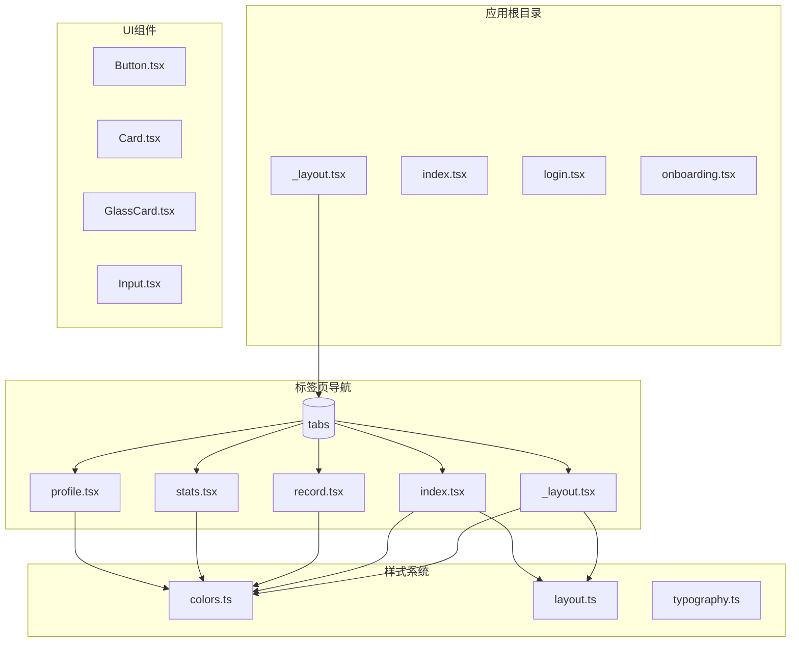
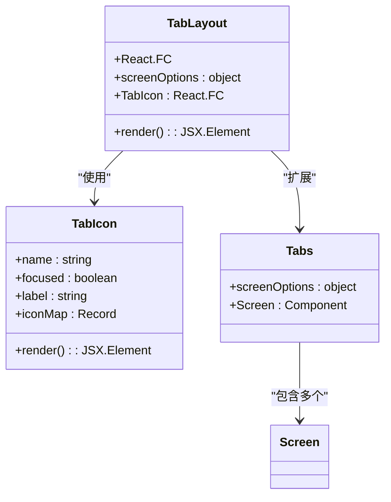
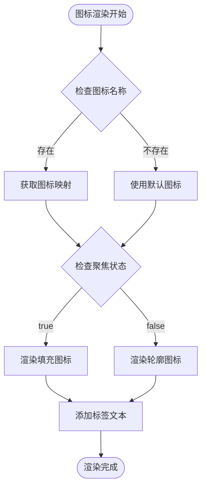
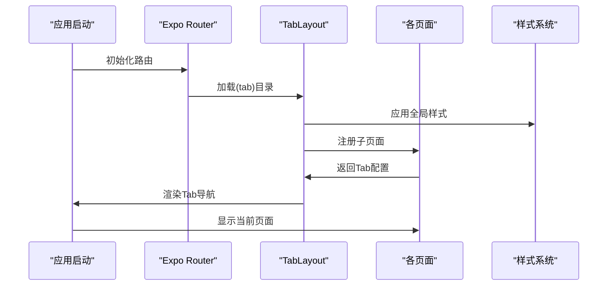
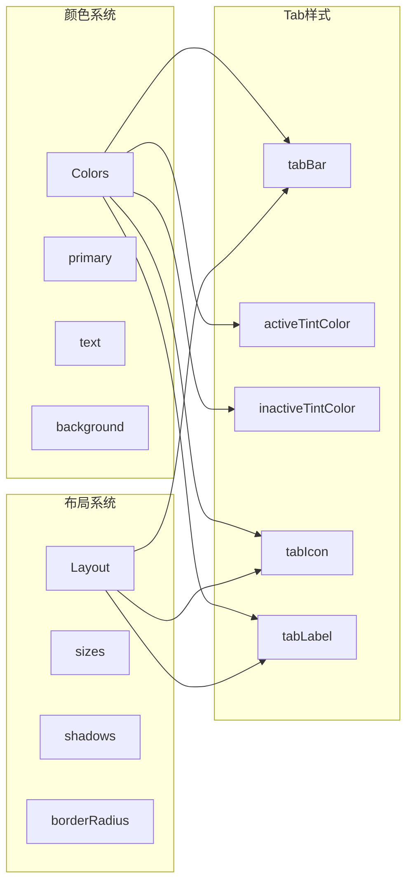
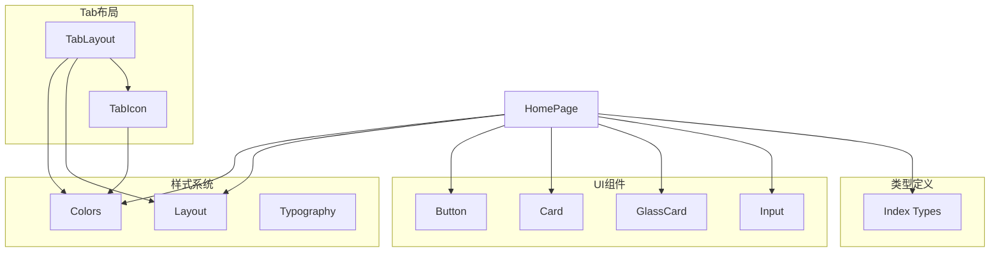

# Tab布局配置

<cite>
**本文档引用的文件**
- [src/app/(tabs)/_layout.tsx](file://src/app/(tabs)/_layout.tsx)
- [src/app/(tabs)/index.tsx](file://src/app/(tabs)/index.tsx)
- [src/app/(tabs)/profile.tsx](file://src/app/(tabs)/profile.tsx)
- [src/app/(tabs)/record.tsx](file://src/app/(tabs)/record.tsx)
- [src/app/(tabs)/stats.tsx](file://src/app/(tabs)/stats.tsx)
- [src/app/_layout.tsx](file://src/app/_layout.tsx)
- [src/constants/colors.ts](file://src/constants/colors.ts)
- [src/constants/layout.ts](file://src/constants/layout.ts)
- [src/components/ui/Button.tsx](file://src/components/ui/Button.tsx)
- [src/components/ui/Card.tsx](file://src/components/ui/Card.tsx)
- [src/components/ui/GlassCard.tsx](file://src/components/ui/GlassCard.tsx)
- [src/components/ui/Input.tsx](file://src/components/ui/Input.tsx)
- [src/types/index.ts](file://src/types/index.ts)
- [package.json](file://package.json)
</cite>

## 目录
1. [简介](#简介)
2. [项目结构](#项目结构)
3. [核心组件](#核心组件)
4. [架构概览](#架构概览)
5. [详细组件分析](#详细组件分析)
6. [依赖关系分析](#依赖关系分析)
7. [性能考虑](#性能考虑)
8. [故障排除指南](#故障排除指南)
9. [结论](#结论)

## 简介

本文档深入解析Money应用中的Tab布局配置系统。该应用采用Expo Router的路由约定，通过特殊的`(tabs)`目录结构实现底部导航功能。本文将详细说明Tab布局的工作原理、配置选项、样式定制以及图标组件的实现细节。

## 项目结构

Money应用采用基于功能的文件组织方式，Tab布局位于`src/app/(tabs)`目录下：



**图表来源**
- [src/app/_layout.tsx](file://src/app/_layout.tsx#L30-L47)
- [src/app/(tabs)/_layout.tsx](file://src/app/(tabs)/_layout.tsx#L39-L88)

**章节来源**
- [src/app/_layout.tsx](file://src/app/_layout.tsx#L1-L55)
- [src/app/(tabs)/_layout.tsx](file://src/app/(tabs)/_layout.tsx#L1-L121)

## 核心组件

### TabLayout组件

TabLayout是整个Tab导航系统的入口点，基于Expo Router的Tabs组件构建：



**图表来源**
- [src/app/(tabs)/_layout.tsx](file://src/app/(tabs)/_layout.tsx#L13-L37)
- [src/app/(tabs)/_layout.tsx](file://src/app/(tabs)/_layout.tsx#L39-L88)

TabLayout的核心特性包括：

1. **路由约定**: 使用`(tabs)`目录名实现特殊路由解析
2. **屏幕选项**: 配置全局Tab样式和行为
3. **图标系统**: 自定义Tab图标组件
4. **样式定制**: 完整的视觉设计系统集成

**章节来源**
- [src/app/(tabs)/_layout.tsx](file://src/app/(tabs)/_layout.tsx#L39-L88)

### Tab图标组件

Tab图标组件实现了动态状态切换功能：



**图表来源**
- [src/app/(tabs)/_layout.tsx](file://src/app/(tabs)/_layout.tsx#L13-L37)

**章节来源**
- [src/app/(tabs)/_layout.tsx](file://src/app/(tabs)/_layout.tsx#L13-L37)

## 架构概览

Expo Router通过特殊的目录命名约定实现Tab导航：



**图表来源**
- [src/app/_layout.tsx](file://src/app/_layout.tsx#L33-L45)
- [src/app/(tabs)/_layout.tsx](file://src/app/(tabs)/_layout.tsx#L39-L88)

## 详细组件分析

### TabLayout实现原理

TabLayout组件通过以下机制实现Tab导航：

#### 屏幕选项配置
- `headerShown: false` - 隐藏默认头部
- `tabBarStyle` - 应用自定义样式
- `tabBarShowLabel: false` - 隐藏标签文字
- `tabBarActiveTintColor` - 激活状态颜色
- `tabBarInactiveTintColor` - 非激活状态颜色

#### Tab图标配置
每个Tabs.Screen都配置了自定义图标：
- `tabBarIcon: ({ focused }) => <TabIcon ... />`
- 动态图标切换基于focused状态
- 支持多种图标类型（home, record, stats, profile）

**章节来源**
- [src/app/(tabs)/_layout.tsx](file://src/app/(tabs)/_layout.tsx#L42-L85)

### 样式系统集成

Tab布局深度集成了应用的样式系统：



**图表来源**
- [src/app/(tabs)/_layout.tsx](file://src/app/(tabs)/_layout.tsx#L90-L120)
- [src/constants/colors.ts](file://src/constants/colors.ts#L6-L75)
- [src/constants/layout.ts](file://src/constants/layout.ts#L112-L154)

**章节来源**
- [src/app/(tabs)/_layout.tsx](file://src/app/(tabs)/_layout.tsx#L90-L120)
- [src/constants/colors.ts](file://src/constants/colors.ts#L6-L75)
- [src/constants/layout.ts](file://src/constants/layout.ts#L112-L154)

### 页面实现细节

#### 首页（今日概览）
首页实现了完整的财务概览功能，包括：
- 账本切换器（个人/公司）
- 资产卡片展示
- 快速记账功能
- 攒钱目标进度
- 最近交易记录

#### 记账页
记账页提供了完整的记账功能：
- 账本类型选择
- 收支类型切换
- 金额输入键盘
- 分类选择
- 备注功能

#### 统计页
统计页展示了数据分析功能：
- 支出分类饼图
- 日常收支对比柱状图
- 分类明细表格

#### 个人中心
个人中心包含：
- 用户信息展示
- 账本概览
- 功能菜单
- 设置选项

**章节来源**
- [src/app/(tabs)/index.tsx](file://src/app/(tabs)/index.tsx#L47-L260)
- [src/app/(tabs)/record.tsx](file://src/app/(tabs)/record.tsx#L94-L286)
- [src/app/(tabs)/stats.tsx](file://src/app/(tabs)/stats.tsx#L138-L259)
- [src/app/(tabs)/profile.tsx](file://src/app/(tabs)/profile.tsx#L56-L145)

## 依赖关系分析

### 核心依赖

```mermaid
graph TB
subgraph "运行时依赖"
Expo[expo@~52.0.0]
Router[expo-router@~4.0.0]
React[react@18.3.1]
RN[react-native@0.76.3]
end
subgraph "UI相关"
Blur[expo-blur@~14.0.0]
Gradient[expo-linear-gradient@~14.0.0]
Gesture[react-native-gesture-handler@~2.20.0]
end
subgraph "开发工具"
Metro[@expo/metro-runtime@~4.0.1]
Typescript[typescript@~5.3.0]
end
Router --> Expo
Router --> React
Blur --> Expo
Gradient --> Expo
Gesture --> RN
```

**图表来源**
- [package.json](file://package.json#L11-L34)

### 内部模块依赖



**图表来源**
- [src/app/(tabs)/_layout.tsx](file://src/app/(tabs)/_layout.tsx#L5-L10)
- [src/app/(tabs)/index.tsx](file://src/app/(tabs)/index.tsx#L16-L27)

**章节来源**
- [package.json](file://package.json#L11-L34)

## 性能考虑

### 渲染优化

1. **图标缓存**: TabIcon组件使用纯函数式设计，避免不必要的重新渲染
2. **样式复用**: 所有页面共享相同的样式配置，减少样式计算开销
3. **懒加载**: 页面按需加载，减少初始内存占用

### 内存管理

1. **组件卸载**: Tab切换时正确处理组件生命周期
2. **资源释放**: 图表和动画组件在页面离开时正确清理
3. **字体预加载**: 应用启动时预加载字体资源

## 故障排除指南

### 常见问题

#### Tab图标不显示
- 检查图标名称是否在iconMap中定义
- 确认focused状态传递正确
- 验证字体支持Unicode字符

#### 样式不生效
- 确认Colors和Layout常量导入正确
- 检查平台特定样式（iOS/Android差异）
- 验证StyleSheet.create调用

#### 导航问题
- 确认路由文件命名符合Expo Router约定
- 检查_stack目录结构
- 验证screenOptions配置

**章节来源**
- [src/app/(tabs)/_layout.tsx](file://src/app/(tabs)/_layout.tsx#L18-L31)
- [src/app/(tabs)/index.tsx](file://src/app/(tabs)/index.tsx#L55-L58)

## 结论

Money应用的Tab布局配置展现了现代React Native应用的最佳实践：

1. **清晰的架构**: 基于Expo Router的路由约定实现模块化设计
2. **统一的样式系统**: 通过Colors和Layout常量确保视觉一致性
3. **可扩展的组件设计**: TabIcon组件支持灵活的自定义选项
4. **性能优化**: 采用多种技术确保流畅的用户体验

该实现为类似的应用提供了完整的参考模板，涵盖了从基础配置到高级定制的所有方面。