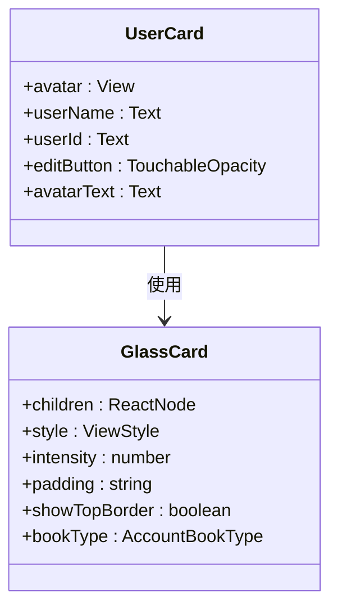
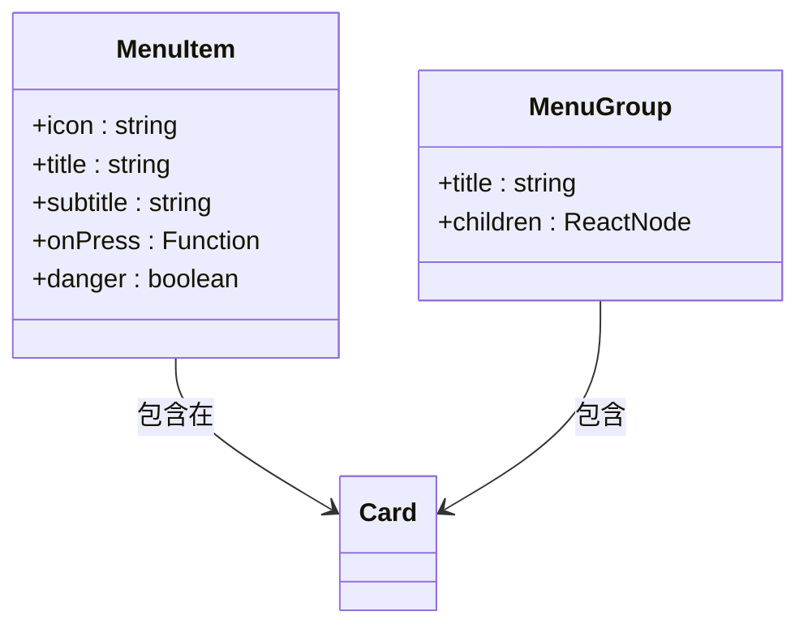
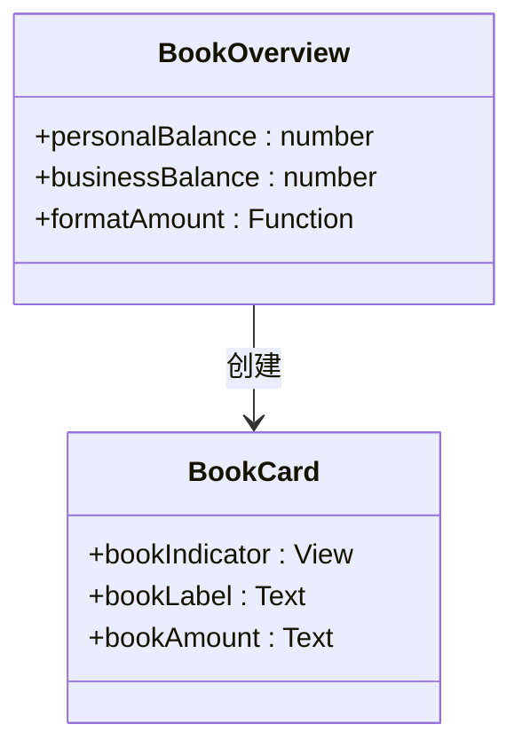
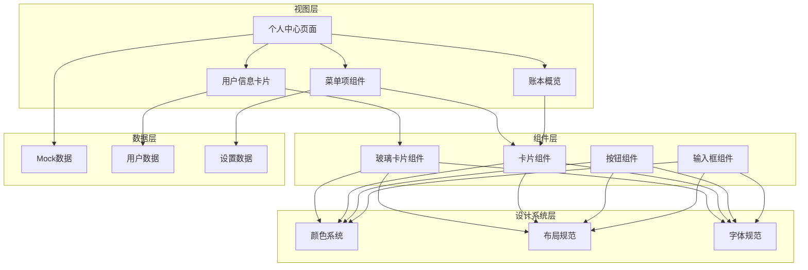
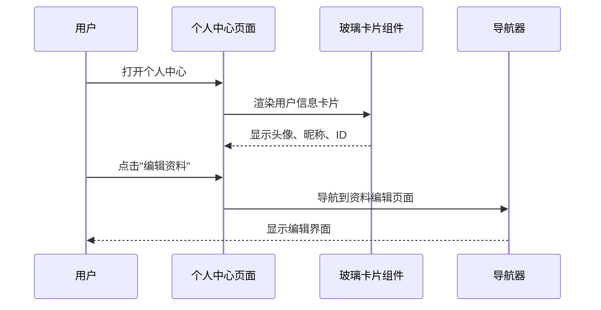
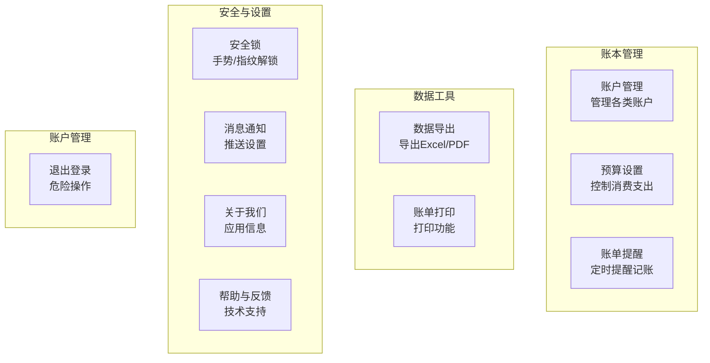
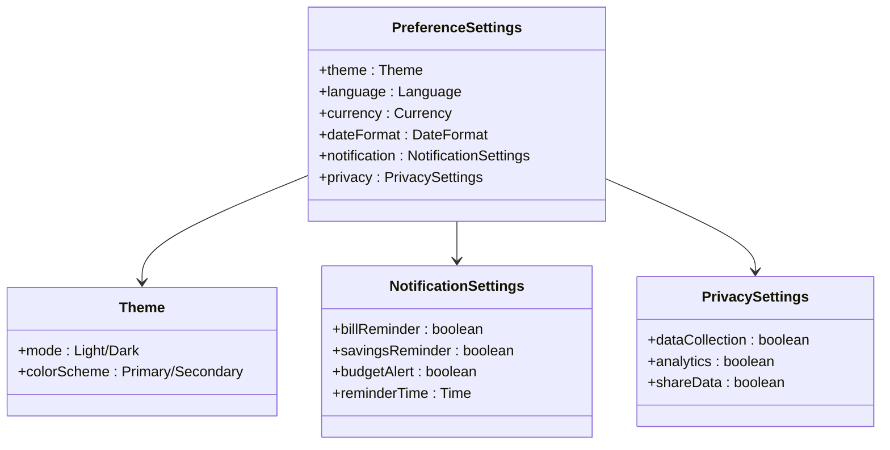
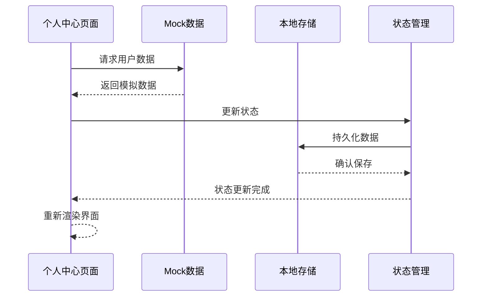
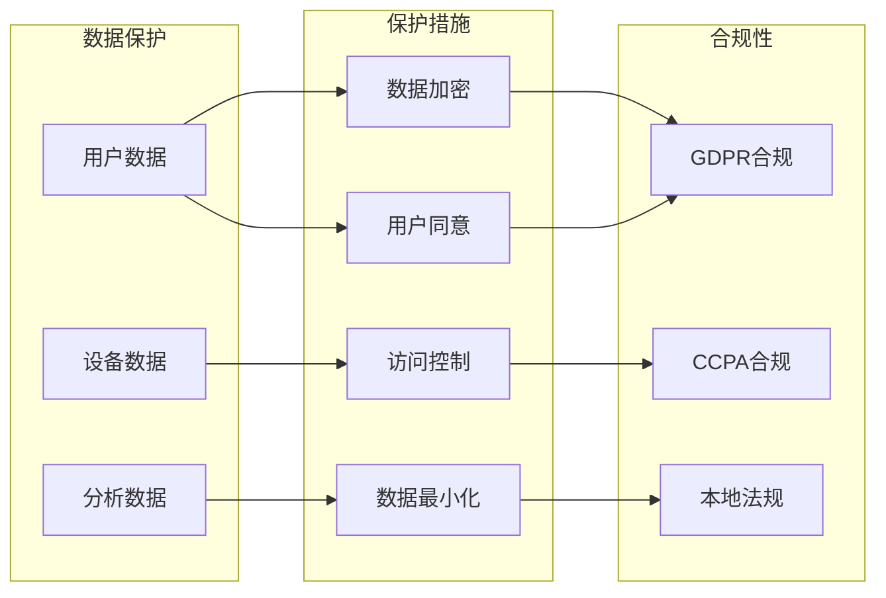
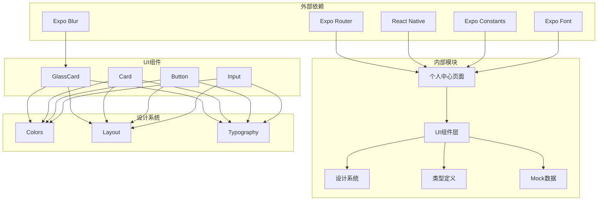

# 个人中心页面

<cite>
**本文档引用的文件**
- [src/app/(tabs)/profile.tsx](file://src/app/(tabs)/profile.tsx)
- [src/app/(tabs)/_layout.tsx](file://src/app/(tabs)/_layout.tsx)
- [src/app/_layout.tsx](file://src/app/_layout.tsx)
- [src/components/ui/index.ts](file://src/components/ui/index.ts)
- [src/components/ui/Button.tsx](file://src/components/ui/Button.tsx)
- [src/components/ui/Card.tsx](file://src/components/ui/Card.tsx)
- [src/components/ui/GlassCard.tsx](file://src/components/ui/GlassCard.tsx)
- [src/components/ui/Input.tsx](file://src/components/ui/Input.tsx)
- [src/constants/colors.ts](file://src/constants/colors.ts)
- [src/constants/layout.ts](file://src/constants/layout.ts)
- [src/constants/typography.ts](file://src/constants/typography.ts)
- [src/types/index.ts](file://src/types/index.ts)
- [src/mocks/accounts.ts](file://src/mocks/accounts.ts)
- [package.json](file://package.json)
</cite>

## 目录
1. [简介](#简介)
2. [项目结构](#项目结构)
3. [核心组件](#核心组件)
4. [架构概览](#架构概览)
5. [详细组件分析](#详细组件分析)
6. [依赖关系分析](#依赖关系分析)
7. [性能考虑](#性能考虑)
8. [故障排除指南](#故障排除指南)
9. [结论](#结论)
10. [附录](#附录)

## 简介

个人中心页面是攒钱记账应用的核心功能模块，为用户提供个人信息管理、账户设置和偏好配置的统一入口。该页面采用现代化的设计语言，结合玻璃态效果和渐变色彩，为用户提供了直观且美观的个人管理界面。

个人中心页面主要包含以下功能模块：
- 用户信息展示与编辑
- 账本概览（个人资产与公司资产）
- 功能菜单导航（账户管理、预算设置、账单提醒等）
- 安全设置与账户管理
- 数据导出与打印功能
- 通知与帮助支持

## 项目结构

个人中心页面位于应用的标签导航系统中，作为底部导航的第四个标签页。整个应用采用基于文件系统的路由架构，通过Expo Router实现页面导航。

```mermaid
graph TB
subgraph "应用布局"
RootLayout[根布局<br/>src/app/_layout.tsx]
TabLayout[标签布局<br/>src/app/(tabs)/_layout.tsx]
end
subgraph "标签页面"
HomePage[首页<br/>src/app/(tabs)/index.tsx]
RecordPage[记账<br/>src/app/(tabs)/record.tsx]
StatsPage[统计<br/>src/app/(tabs)/stats.tsx]
ProfilePage[个人中心<br/>src/app/(tabs)/profile.tsx]
end
subgraph "UI组件"
Button[按钮组件<br/>src/components/ui/Button.tsx]
Card[卡片组件<br/>src/components/ui/Card.tsx]
GlassCard[玻璃卡片组件<br/>src/components/ui/GlassCard.tsx]
Input[输入框组件<br/>src/components/ui/Input.tsx]
end
subgraph "设计系统"
Colors[颜色系统<br/>src/constants/colors.ts]
Layout[布局规范<br/>src/constants/layout.ts]
Typography[字体规范<br/>src/constants/typography.ts]
end
RootLayout --> TabLayout
TabLayout --> HomePage
TabLayout --> RecordPage
TabLayout --> StatsPage
TabLayout --> ProfilePage
ProfilePage --> GlassCard
ProfilePage --> Card
ProfilePage --> Button
ProfilePage --> Input
GlassCard --> Colors
Card --> Colors
Button --> Colors
Input --> Colors
GlassCard --> Layout
Card --> Layout
Button --> Layout
Input --> Layout
GlassCard --> Typography
Card --> Typography
Button --> Typography
Input --> Typography
```

**图表来源**
- [src/app/_layout.tsx](file://src/app/_layout.tsx#L17-L48)
- [src/app/(tabs)/_layout.tsx](file://src/app/(tabs)/_layout.tsx#L39-L88)
- [src/app/(tabs)/profile.tsx](file://src/app/(tabs)/profile.tsx#L56-L146)

**章节来源**
- [src/app/_layout.tsx](file://src/app/_layout.tsx#L1-L55)
- [src/app/(tabs)/_layout.tsx](file://src/app/(tabs)/_layout.tsx#L1-L121)
- [src/app/(tabs)/profile.tsx](file://src/app/(tabs)/profile.tsx#L1-L295)

## 核心组件

个人中心页面由多个精心设计的组件构成，每个组件都有明确的职责和设计规范：

### 用户信息卡片组件

用户信息卡片是个人中心的核心视觉元素，采用玻璃态设计，提供用户头像、昵称和编辑入口。



**图表来源**
- [src/app/(tabs)/profile.tsx](file://src/app/(tabs)/profile.tsx#L76-L91)
- [src/components/ui/GlassCard.tsx](file://src/components/ui/GlassCard.tsx#L13-L20)

### 菜单项组件

菜单项组件提供了统一的列表项设计，支持图标、标题、副标题和危险操作标记。



**图表来源**
- [src/app/(tabs)/profile.tsx](file://src/app/(tabs)/profile.tsx#L21-L54)
- [src/components/ui/Card.tsx](file://src/components/ui/Card.tsx#L10-L16)

### 账本概览组件

账本概览展示了用户的总资产情况，分为个人账本和公司账本两个部分。



**图表来源**
- [src/app/(tabs)/profile.tsx](file://src/app/(tabs)/profile.tsx#L57-L105)
- [src/mocks/accounts.ts](file://src/mocks/accounts.ts#L82-L90)

**章节来源**
- [src/app/(tabs)/profile.tsx](file://src/app/(tabs)/profile.tsx#L21-L146)
- [src/components/ui/GlassCard.tsx](file://src/components/ui/GlassCard.tsx#L1-L126)
- [src/components/ui/Card.tsx](file://src/components/ui/Card.tsx#L1-L94)

## 架构概览

个人中心页面采用了清晰的分层架构，从布局到组件再到数据管理都有明确的职责划分。



**图表来源**
- [src/app/(tabs)/profile.tsx](file://src/app/(tabs)/profile.tsx#L56-L146)
- [src/components/ui/index.ts](file://src/components/ui/index.ts#L1-L9)
- [src/constants/colors.ts](file://src/constants/colors.ts#L6-L75)
- [src/constants/layout.ts](file://src/constants/layout.ts#L8-L181)
- [src/constants/typography.ts](file://src/constants/typography.ts#L8-L146)

## 详细组件分析

### 用户信息管理模块

用户信息管理模块是个人中心的核心功能，负责展示和编辑用户的基本信息。

#### 用户信息卡片设计

用户信息卡片采用了现代化的玻璃态设计，结合渐变色彩和阴影效果，营造出层次丰富的视觉体验。



**图表来源**
- [src/app/(tabs)/profile.tsx](file://src/app/(tabs)/profile.tsx#L76-L91)
- [src/app/(tabs)/profile.tsx](file://src/app/(tabs)/profile.tsx#L84-L86)

#### 资料编辑功能

资料编辑功能目前以占位符形式存在，实际的编辑逻辑需要进一步实现。建议采用表单验证和实时保存机制。

**章节来源**
- [src/app/(tabs)/profile.tsx](file://src/app/(tabs)/profile.tsx#L76-L91)

### 账户设置模块

账户设置模块提供了用户账户管理的核心功能，包括账户管理、预算设置和账单提醒等。

#### 菜单分类组织

个人中心的菜单按照功能重要性和使用频率进行了合理的分类组织：



**图表来源**
- [src/app/(tabs)/profile.tsx](file://src/app/(tabs)/profile.tsx#L108-L139)

#### 设置项交互设计

每个设置项都遵循统一的交互模式，提供清晰的视觉反馈和操作引导。

**章节来源**
- [src/app/(tabs)/profile.tsx](file://src/app/(tabs)/profile.tsx#L108-L139)

### 偏好配置模块

偏好配置模块允许用户自定义应用的行为和外观，提升个性化体验。

#### 配置项分类



**图表来源**
- [src/types/index.ts](file://src/types/index.ts#L132-L140)

**章节来源**
- [src/types/index.ts](file://src/types/index.ts#L132-L140)

### 数据同步机制

个人中心页面采用本地状态管理与Mock数据相结合的方式，确保数据的一致性和可靠性。

#### 数据流设计



**图表来源**
- [src/mocks/accounts.ts](file://src/mocks/accounts.ts#L82-L90)

#### 同步策略

当前实现使用了简单的数据加载策略，未来可以考虑添加：
- 实时数据同步
- 离线数据缓存
- 冲突解决机制

**章节来源**
- [src/mocks/accounts.ts](file://src/mocks/accounts.ts#L1-L91)

### 隐私保护措施

个人中心页面在设计上充分考虑了用户隐私保护，采用了多层次的安全措施。

#### 隐私设计原则



**图表来源**
- [src/app/(tabs)/profile.tsx](file://src/app/(tabs)/profile.tsx#L132-L139)

**章节来源**
- [src/app/(tabs)/profile.tsx](file://src/app/(tabs)/profile.tsx#L132-L139)

## 依赖关系分析

个人中心页面的依赖关系体现了清晰的模块化设计，各组件之间保持低耦合高内聚。



**图表来源**
- [package.json](file://package.json#L11-L34)
- [src/app/(tabs)/profile.tsx](file://src/app/(tabs)/profile.tsx#L1-L20)
- [src/components/ui/index.ts](file://src/components/ui/index.ts#L1-L9)

**章节来源**
- [package.json](file://package.json#L1-L43)
- [src/app/(tabs)/profile.tsx](file://src/app/(tabs)/profile.tsx#L1-L20)

## 性能考虑

个人中心页面在设计时充分考虑了性能优化，采用了多种策略来提升用户体验。

### 渲染优化

- **虚拟滚动**: 对于大量数据的列表，考虑使用虚拟滚动技术
- **懒加载**: 图片和重资源采用懒加载策略
- **状态提升**: 将频繁变化的状态提升到父组件

### 内存管理

- **组件卸载**: 确保组件正确清理事件监听器
- **图片缓存**: 实现智能的图片缓存机制
- **数据缓存**: 使用内存缓存减少重复计算

### 网络优化

虽然当前使用Mock数据，但为未来的网络请求做好了准备：
- **请求去重**: 避免重复的网络请求
- **缓存策略**: 实现多层缓存机制
- **错误处理**: 完善的网络错误处理

## 故障排除指南

### 常见问题及解决方案

#### 页面显示异常

**问题**: 个人中心页面无法正常显示
**原因**: 
- 字体加载失败
- 样式文件未正确导入
- 组件依赖缺失

**解决方案**:
1. 检查字体文件是否正确加载
2. 确认样式文件路径正确
3. 验证组件依赖完整性

#### 交互响应问题

**问题**: 菜单项点击无响应
**原因**:
- TouchableOpacity事件绑定错误
- 样式覆盖导致触摸区域失效
- 导航配置问题

**解决方案**:
1. 检查onPress事件绑定
2. 验证触摸区域样式
3. 确认导航配置正确

#### 数据显示问题

**问题**: 账本余额显示不正确
**原因**:
- Mock数据计算错误
- 格式化函数问题
- 状态更新时机不当

**解决方案**:
1. 检查Mock数据计算逻辑
2. 验证格式化函数实现
3. 确认状态更新时机

**章节来源**
- [src/app/(tabs)/profile.tsx](file://src/app/(tabs)/profile.tsx#L60-L66)
- [src/mocks/accounts.ts](file://src/mocks/accounts.ts#L82-L90)

## 结论

个人中心页面作为攒钱记账应用的核心功能模块，展现了现代移动应用设计的最佳实践。通过精心设计的组件架构、清晰的功能分类和完善的交互体验，为用户提供了便捷的个人管理服务。

该页面的主要优势包括：
- **模块化设计**: 清晰的组件分离和职责划分
- **一致性**: 统一的设计语言和交互模式
- **可扩展性**: 良好的架构为功能扩展奠定基础
- **性能优化**: 多层次的性能考虑和优化策略

未来的发展方向包括：
- 实现真实的用户数据管理功能
- 添加更多个性化设置选项
- 优化数据同步和隐私保护机制
- 增强离线功能和数据持久化

## 附录

### 开发指南

#### 新功能扩展步骤

1. **需求分析**: 明确新功能的需求和目标用户
2. **设计规划**: 制定设计方案和组件结构
3. **实现开发**: 按照设计实现功能逻辑
4. **测试验证**: 进行功能测试和性能测试
5. **文档编写**: 更新相关文档和注释

#### 最佳实践

- **组件复用**: 优先考虑组件的复用性和通用性
- **状态管理**: 合理的状态管理策略
- **错误处理**: 完善的错误处理和用户提示
- **性能监控**: 持续的性能监控和优化

### 技术规格

#### 支持平台
- iOS 14.0+
- Android 8.0+
- Web 浏览器

#### 依赖版本
- React Native 0.76.3
- Expo SDK 52.0.0
- TypeScript 5.3.0

**章节来源**
- [package.json](file://package.json#L11-L34)