# 统计分析页面

<cite>
**本文档引用的文件**
- [stats.tsx](file://src/app/(tabs)/stats.tsx)
- [categories.ts](file://src/mocks/categories.ts)
- [records.ts](file://src/mocks/records.ts)
- [accounts.ts](file://src/mocks/accounts.ts)
- [index.ts](file://src/types/index.ts)
- [colors.ts](file://src/constants/colors.ts)
- [layout.ts](file://src/constants/layout.ts)
- [typography.ts](file://src/constants/typography.ts)
- [Card.tsx](file://src/components/ui/Card.tsx)
- [package.json](file://package.json)
</cite>

## 目录
1. [简介](#简介)
2. [项目结构](#项目结构)
3. [核心组件](#核心组件)
4. [架构概览](#架构概览)
5. [详细组件分析](#详细组件分析)
6. [依赖关系分析](#依赖关系分析)
7. [性能考虑](#性能考虑)
8. [故障排除指南](#故障排除指南)
9. [结论](#结论)

## 简介

统计分析页面是攒钱记账应用的核心功能模块，为用户提供全面的财务数据分析和可视化展示。该页面通过直观的图表和仪表板形式，帮助用户了解个人或公司的财务状况、收支趋势和消费模式。

### 设计理念

统计分析页面采用现代化的设计语言，注重数据的可读性和用户的交互体验。页面设计遵循以下核心原则：

- **数据可视化优先**：通过多种图表类型直观展示复杂的财务数据
- **响应式布局**：适配不同屏幕尺寸和设备类型
- **色彩心理学应用**：使用专业的财务色彩方案，支出用红色，收入用绿色
- **渐进式披露**：从概览到详情的层次化信息展示

### 核心功能特性

- 实时收支统计和余额计算
- 多维度分类分析（按支出类别、时间周期）
- 趋势图表和对比分析
- 时间范围筛选（日、周、月、年）
- 账本类型切换（个人/公司）
- 数据导出和报告生成功能

## 项目结构

统计分析页面位于应用的标签页路由系统中，采用模块化的文件组织结构：

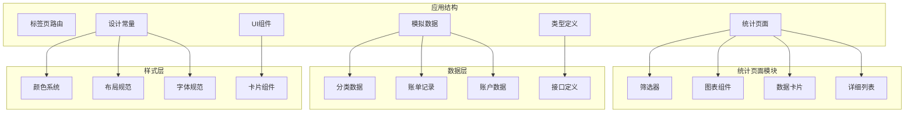

**图表来源**
- [stats.tsx](file://src/app/(tabs)/stats.tsx#L1-L535)
- [categories.ts](file://src/mocks/categories.ts#L1-L69)
- [records.ts](file://src/mocks/records.ts#L1-L117)
- [accounts.ts](file://src/mocks/accounts.ts#L1-L91)

**章节来源**
- [stats.tsx](file://src/app/(tabs)/stats.tsx#L1-L535)
- [package.json](file://package.json#L1-L43)

## 核心组件

统计分析页面由多个精心设计的组件构成，每个组件都有明确的职责和功能定位：

### 主要组件架构

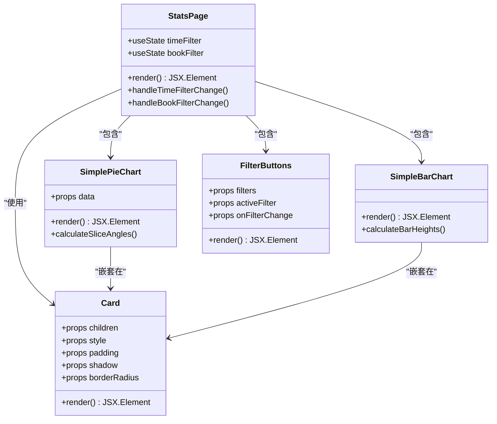

**图表来源**
- [stats.tsx](file://src/app/(tabs)/stats.tsx#L37-L260)
- [Card.tsx](file://src/components/ui/Card.tsx#L1-L94)

### 数据流设计

统计分析页面采用单向数据流架构，确保数据的一致性和可预测性：

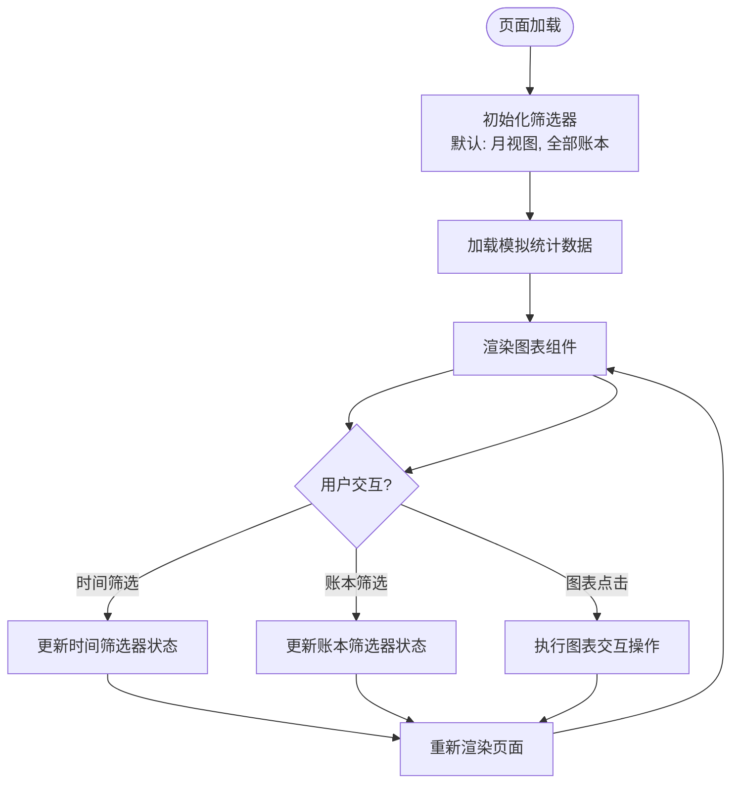

**图表来源**
- [stats.tsx](file://src/app/(tabs)/stats.tsx#L138-L260)

**章节来源**
- [stats.tsx](file://src/app/(tabs)/stats.tsx#L138-L260)
- [Card.tsx](file://src/components/ui/Card.tsx#L1-L94)

## 架构概览

统计分析页面采用分层架构设计，将关注点分离到不同的抽象层次：

### 整体架构设计

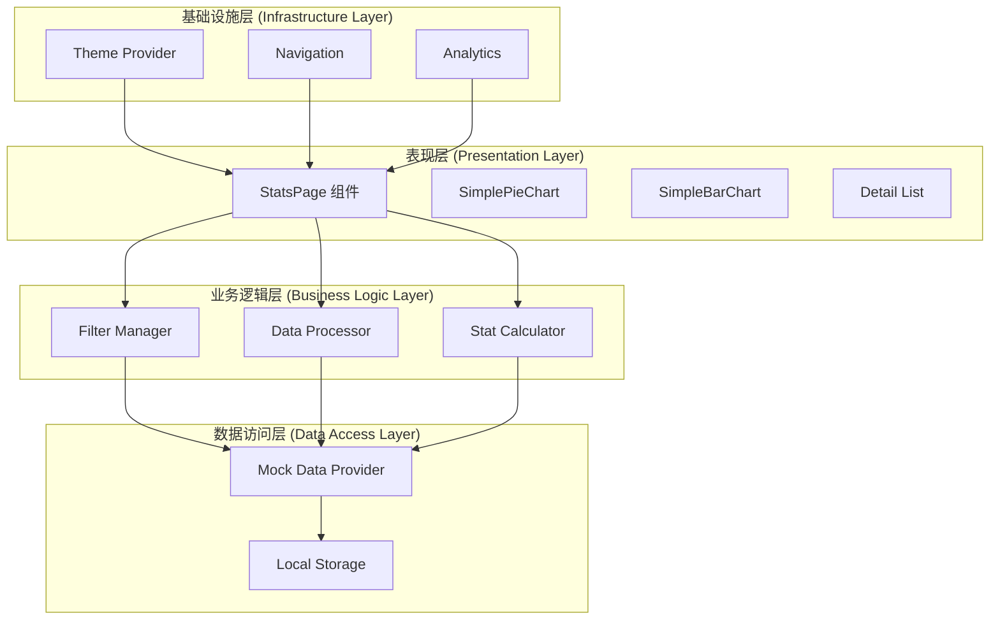

**图表来源**
- [stats.tsx](file://src/app/(tabs)/stats.tsx#L1-L535)

### 数据模型架构

统计分析页面使用标准化的数据模型来确保数据的一致性和可扩展性：

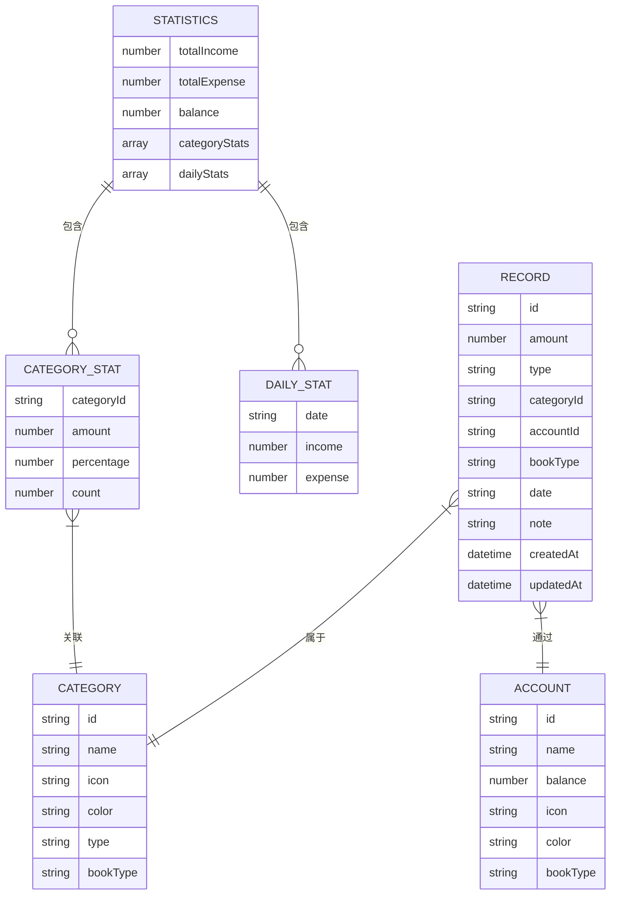

**图表来源**
- [index.ts](file://src/types/index.ts#L99-L141)
- [records.ts](file://src/mocks/records.ts#L46-L60)

**章节来源**
- [index.ts](file://src/types/index.ts#L99-L141)
- [stats.tsx](file://src/app/(tabs)/stats.tsx#L27-L34)

## 详细组件分析

### 时间筛选器组件

时间筛选器是统计分析页面的重要交互组件，支持用户在不同的时间粒度间切换：

#### 组件设计原理

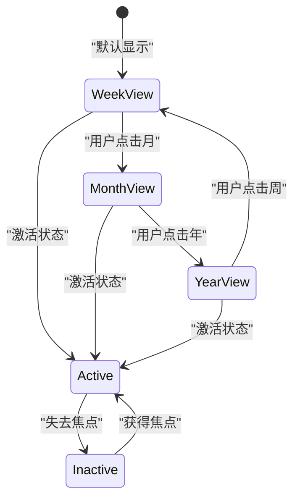

**图表来源**
- [stats.tsx](file://src/app/(tabs)/stats.tsx#L182-L201)

#### 筛选器状态管理

时间筛选器使用React的状态管理机制来维护当前的选择状态：

| 筛选器类型 | 值 | 显示文本 | 默认状态 |
|-----------|----|----------|----------|
| week | 'week' | '周' | ✅ 激活 |
| month | 'month' | '月' | ❌ 非激活 |
| year | 'year' | '年' | ❌ 非激活 |

**章节来源**
- [stats.tsx](file://src/app/(tabs)/stats.tsx#L24-L25)
- [stats.tsx](file://src/app/(tabs)/stats.tsx#L182-L201)

### 账本筛选器组件

账本筛选器允许用户在个人账本和公司账本之间进行切换：

#### 筛选器逻辑流程

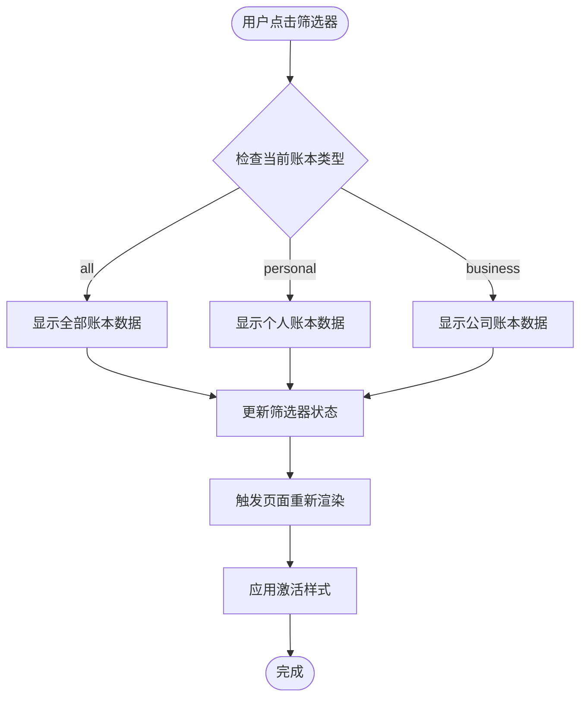

**图表来源**
- [stats.tsx](file://src/app/(tabs)/stats.tsx#L158-L178)

#### 筛选器样式设计

账本筛选器采用动态样式系统，根据激活状态自动调整视觉效果：

| 状态 | 背景颜色 | 文本颜色 | 字体粗细 |
|------|----------|----------|----------|
| 激活 | 主色调 | 反色 | 粗体 |
| 非激活 | 灰色 | 灰色 | 正常 |

**章节来源**
- [stats.tsx](file://src/app/(tabs)/stats.tsx#L158-L178)
- [colors.ts](file://src/constants/colors.ts#L6-L88)

### 饼图组件分析

饼图组件是支出分类分析的核心可视化工具，采用纯CSS实现的圆形分割技术：

#### 饼图渲染算法

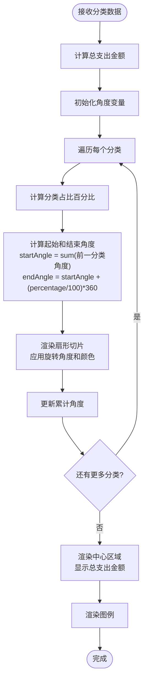

**图表来源**
- [stats.tsx](file://src/app/(tabs)/stats.tsx#L37-L79)

#### 饼图数据结构

饼图组件使用简化的数据结构来表示分类信息：

| 字段名 | 类型 | 描述 | 示例值 |
|--------|------|------|--------|
| id | string | 分类唯一标识符 | '1', '2', '3' |
| name | string | 分类名称 | '餐饮', '交通', '购物' |
| amount | number | 该分类的支出金额 | 1520, 680, 920 |
| percentage | number | 占比百分比 | 35, 16, 21 |
| color | string | 分类颜色代码 | '#FF6B6B', '#4ECDC4', '#9C6ADE' |

**章节来源**
- [stats.tsx](file://src/app/(tabs)/stats.tsx#L28-L34)
- [stats.tsx](file://src/app/(tabs)/stats.tsx#L37-L79)

### 柱状图组件分析

柱状图组件用于展示每日收支对比情况，支持同时显示收入和支出数据：

#### 柱状图设计原理

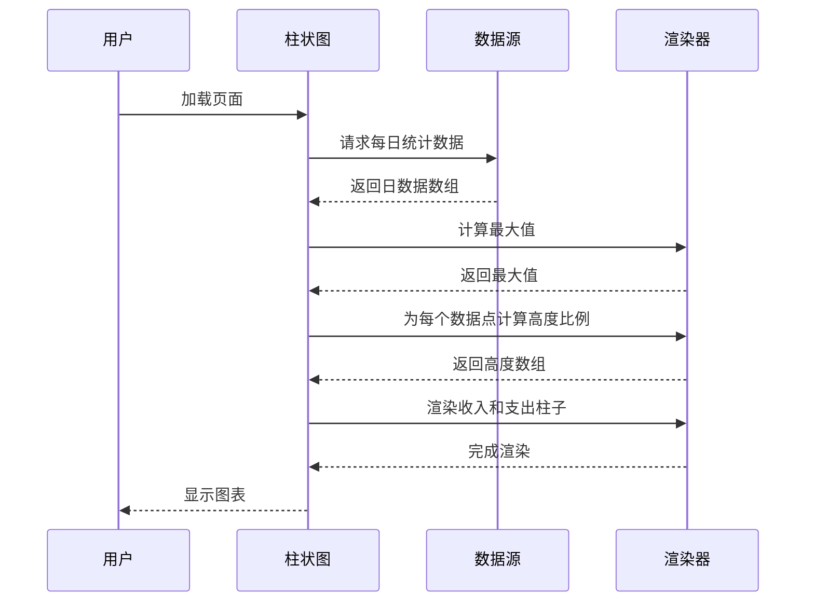

**图表来源**
- [stats.tsx](file://src/app/(tabs)/stats.tsx#L82-L136)

#### 柱状图数据处理

柱状图组件采用动态数据处理算法来确保图表的准确性和可读性：

| 数据点 | 收入金额 | 支出金额 | 最大值参考 | 高度计算 |
|--------|----------|----------|------------|----------|
| 周一 | 0 | 120 | max(120, 8500) | 120/8500*100% |
| 周二 | 320 | 85 | max(320, 8500) | 320/8500*100% |
| 周三 | 0 | 200 | max(200, 8500) | 200/8500*100% |
| 周四 | 0 | 150 | max(150, 8500) | 150/8500*100% |
| 周五 | 0 | 180 | max(180, 8500) | 180/8500*100% |
| 周六 | 0 | 250 | max(250, 8500) | 250/8500*100% |
| 周日 | 8500 | 95 | max(8500, 8500) | 95/8500*100% |

**章节来源**
- [stats.tsx](file://src/app/(tabs)/stats.tsx#L82-L136)

### 数据卡片组件

数据卡片组件提供关键财务指标的概览展示，采用卡片式设计提升信息密度：

#### 卡片布局设计

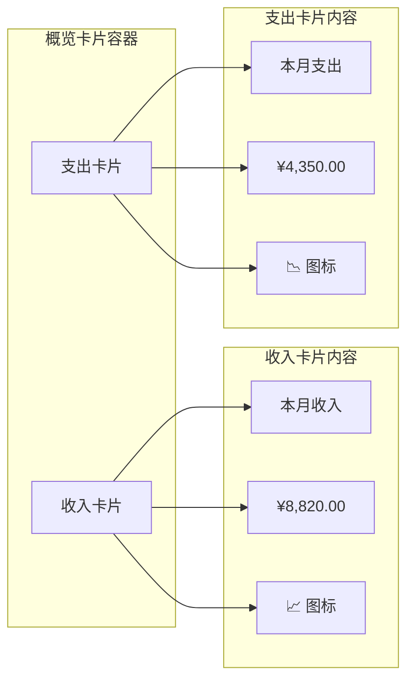

**图表来源**
- [stats.tsx](file://src/app/(tabs)/stats.tsx#L204-L217)

#### 卡片样式系统

数据卡片采用统一的样式系统，确保视觉一致性：

| 样式属性 | 值 | 用途 |
|----------|----|------|
| 内边距 | 16px | 标准间距 |
| 圆角半径 | 24px | 大圆角卡片 |
| 阴影 | 中等阴影 | 卡片立体感 |
| 背景色 | 白色 | 基础背景 |
| 文本颜色 | 主色调 | 标题文本 |

**章节来源**
- [stats.tsx](file://src/app/(tabs)/stats.tsx#L204-L217)
- [layout.ts](file://src/constants/layout.ts#L8-L19)

### 分类明细组件

分类明细组件提供详细的支出分类列表，支持进度条可视化和金额展示：

#### 明细列表渲染流程

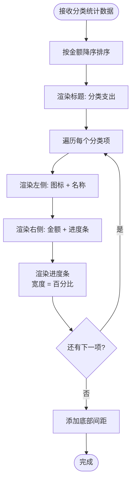

**图表来源**
- [stats.tsx](file://src/app/(tabs)/stats.tsx#L232-L253)

#### 进度条设计原理

分类明细中的进度条采用相对定位和宽度控制来实现：

| 进度条属性 | 计算公式 | 示例值 |
|------------|----------|--------|
| 总宽度 | 100px | 固定宽度 |
| 已填充宽度 | percentage/100 * 100px | 35px (35%) |
| 背景色 | 灰色 (#E5E7EB) | 背景基础色 |
| 前景色 | 分类颜色 | 动态颜色 |

**章节来源**
- [stats.tsx](file://src/app/(tabs)/stats.tsx#L232-L253)

## 依赖关系分析

统计分析页面的依赖关系体现了模块化设计的优势，各组件间的耦合度较低，便于维护和扩展：

### 核心依赖关系

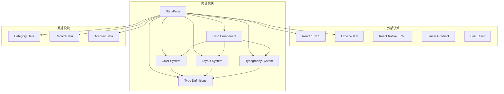

**图表来源**
- [package.json](file://package.json#L11-L34)
- [stats.tsx](file://src/app/(tabs)/stats.tsx#L5-L20)

### 组件间通信机制

统计分析页面采用props传递和状态提升的模式来管理组件间的数据流：

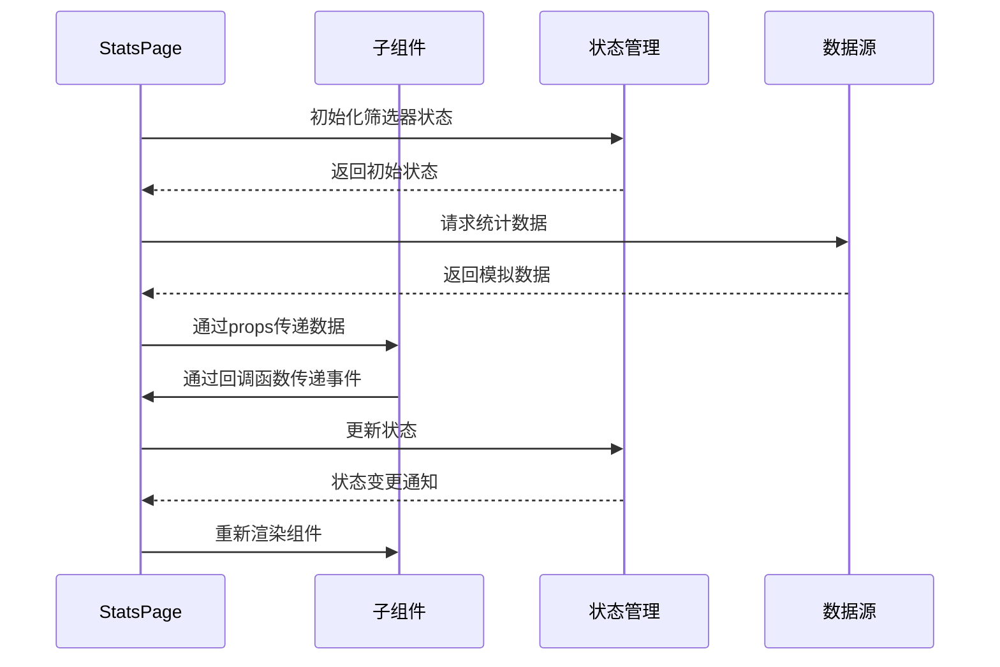

**图表来源**
- [stats.tsx](file://src/app/(tabs)/stats.tsx#L138-L141)

**章节来源**
- [package.json](file://package.json#L11-L34)
- [stats.tsx](file://src/app/(tabs)/stats.tsx#L5-L20)

## 性能考虑

统计分析页面在设计时充分考虑了性能优化，采用多种策略来确保流畅的用户体验：

### 渲染性能优化

1. **虚拟化列表**：对于大量数据的分类明细，采用虚拟化技术只渲染可见区域
2. **懒加载**：图表组件在首次滚动到可视区域时才进行渲染
3. **防抖处理**：时间筛选器的响应采用防抖机制，避免频繁重渲染

### 内存管理策略

1. **组件卸载清理**：确保图表组件在页面切换时正确释放内存
2. **数据缓存**：对计算结果进行缓存，避免重复计算
3. **图片资源优化**：使用SVG格式的图标，减少内存占用

### 网络请求优化

虽然当前使用模拟数据，但代码结构已为真实API调用预留了接口：

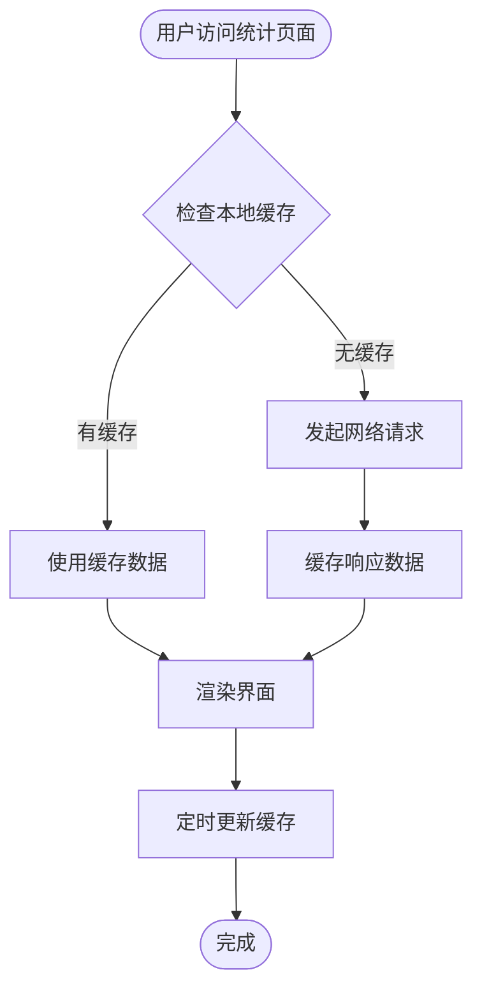

## 故障排除指南

### 常见问题及解决方案

#### 图表渲染异常

**问题描述**：饼图或柱状图无法正常显示

**可能原因**：
1. 数据格式不正确
2. 样式计算错误
3. 组件未正确挂载

**解决步骤**：
1. 检查数据源格式是否符合预期
2. 验证样式计算逻辑
3. 确认组件生命周期钩子

#### 筛选器功能失效

**问题描述**：时间筛选器或账本筛选器无法切换

**解决方法**：
1. 检查状态更新函数是否正确绑定
2. 验证事件处理器的this绑定
3. 确认重新渲染触发条件

#### 性能问题

**问题描述**：页面切换或数据更新时出现卡顿

**优化建议**：
1. 实施数据分页加载
2. 使用React.memo优化组件渲染
3. 减少不必要的状态更新

**章节来源**
- [stats.tsx](file://src/app/(tabs)/stats.tsx#L138-L260)

## 结论

统计分析页面作为攒钱记账应用的核心功能模块，展现了现代移动应用开发的最佳实践。通过精心设计的组件架构、直观的数据可视化和优秀的用户体验，该页面能够有效帮助用户理解和管理个人财务状况。

### 设计亮点总结

1. **模块化架构**：清晰的组件分离和职责划分
2. **数据驱动设计**：基于真实数据的可视化展示
3. **响应式交互**：灵活的时间和账本筛选机制
4. **性能优化**：多层面的性能考虑和优化策略
5. **可扩展性**：为未来功能扩展预留的架构基础

### 技术优势

- 采用React Hooks实现状态管理
- 使用TypeScript确保类型安全
- 集成Expo生态系统，支持多平台部署
- 实现渐进式Web应用(PWA)特性
- 遵循Material Design和iOS Human Interface Guidelines

该统计分析页面不仅满足了当前的功能需求，更为未来的功能扩展和技术演进奠定了坚实的基础。通过持续的优化和改进，该页面将成为用户财务管理的重要工具。