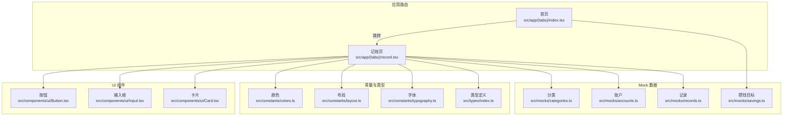
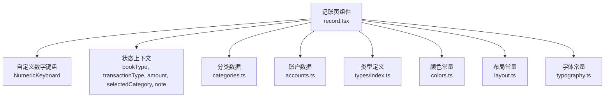
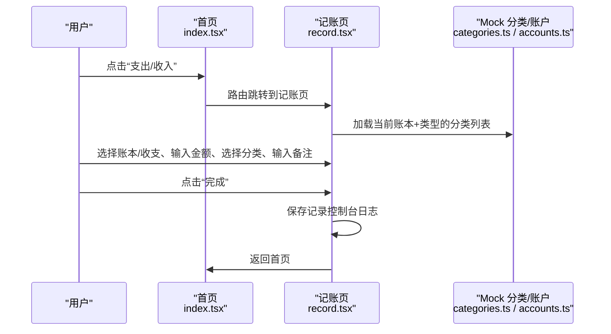
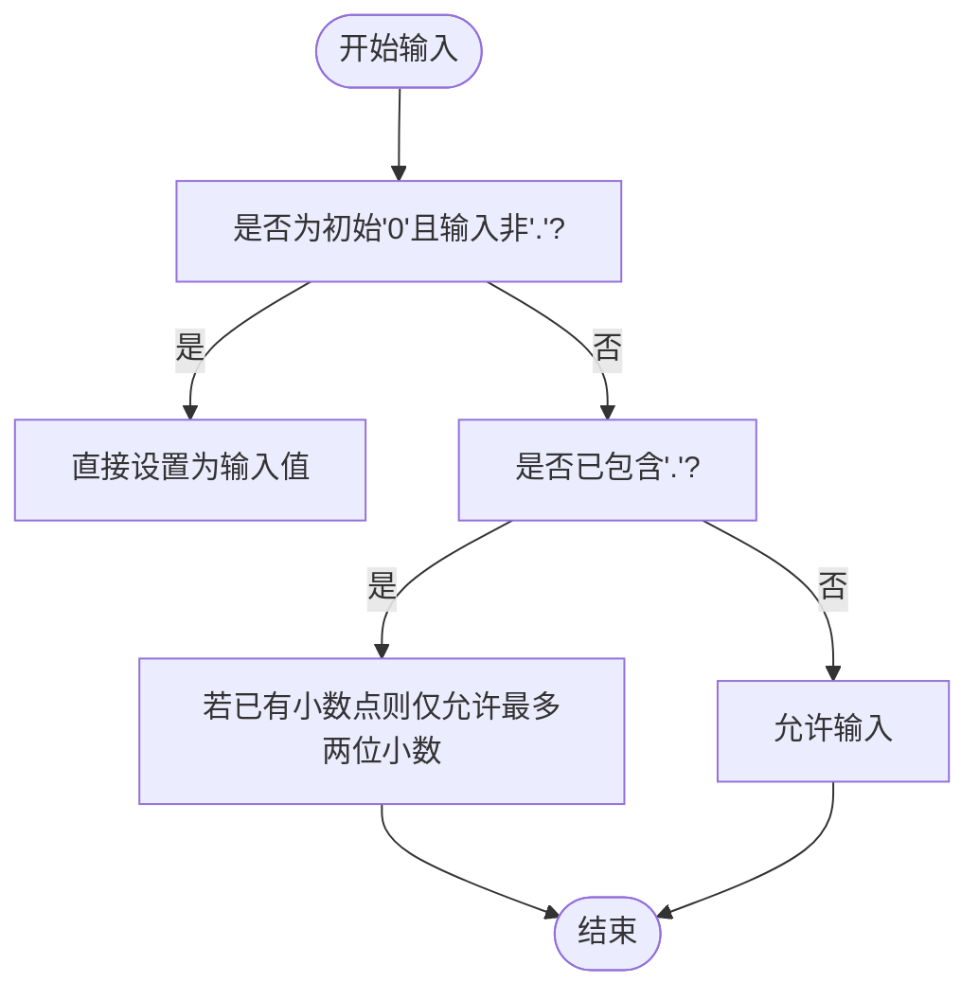
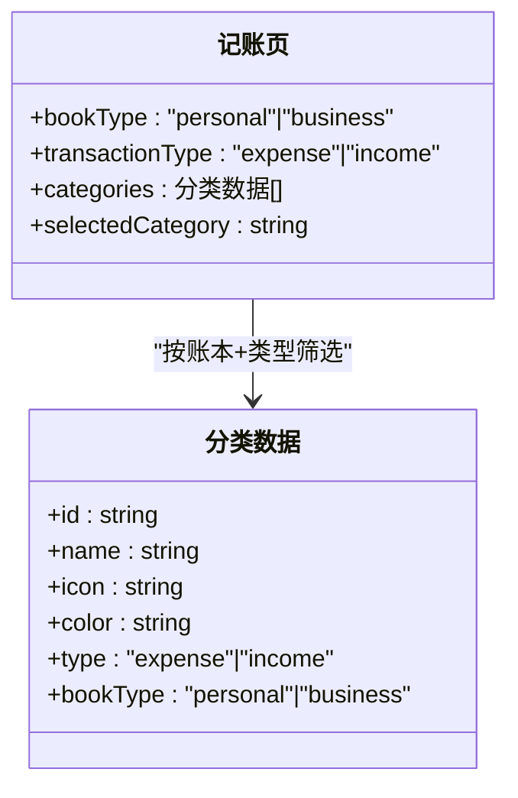
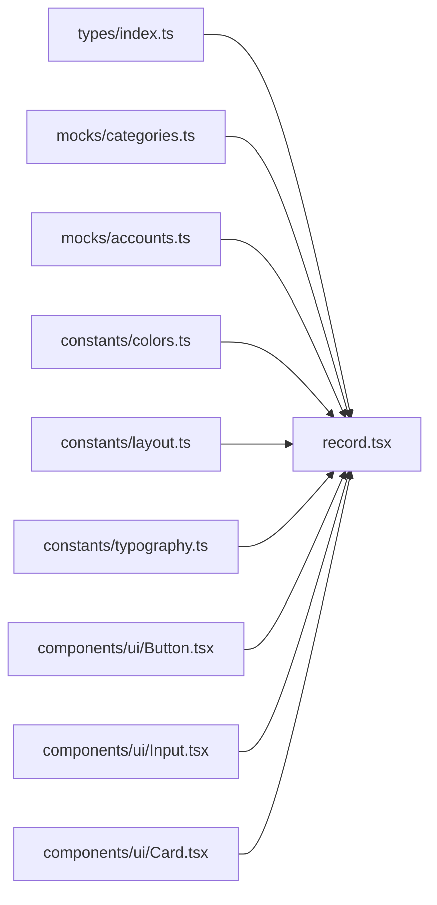

# 记账页面

<cite>
**本文引用的文件**
- [src/app/(tabs)/record.tsx](file://src/app/(tabs)/record.tsx)
- [src/app/(tabs)/index.tsx](file://src/app/(tabs)/index.tsx)
- [src/components/ui/Input.tsx](file://src/components/ui/Input.tsx)
- [src/components/ui/Button.tsx](file://src/components/ui/Button.tsx)
- [src/components/ui/Card.tsx](file://src/components/ui/Card.tsx)
- [src/constants/colors.ts](file://src/constants/colors.ts)
- [src/constants/layout.ts](file://src/constants/layout.ts)
- [src/constants/typography.ts](file://src/constants/typography.ts)
- [src/types/index.ts](file://src/types/index.ts)
- [src/mocks/categories.ts](file://src/mocks/categories.ts)
- [src/mocks/accounts.ts](file://src/mocks/accounts.ts)
- [src/mocks/records.ts](file://src/mocks/records.ts)
- [src/mocks/savings.ts](file://src/mocks/savings.ts)
</cite>

## 目录
1. [简介](#简介)
2. [项目结构](#项目结构)
3. [核心组件](#核心组件)
4. [架构总览](#架构总览)
5. [详细组件分析](#详细组件分析)
6. [依赖关系分析](#依赖关系分析)
7. [性能考量](#性能考量)
8. [故障排查指南](#故障排查指南)
9. [结论](#结论)
10. [附录](#附录)

## 简介
本文件面向“记账页面”的功能与实现，覆盖界面设计、交互流程（快速记账与详细记账）、表单字段配置、数据验证与错误处理、历史记录展示与筛选、以及可扩展性与自定义选项。记账页面支持两种账本类型（个人/公司）与收支类型（支出/收入），内置数字键盘与分类选择，提供备注输入与日期/账户信息展示，并在首页提供快速记账入口。

## 项目结构
记账页面位于应用的标签页路由中，配合首页的快速记账入口与统一的设计常量体系（颜色、排版、布局）共同构成完整的记账体验。

图表来源
- [src/app/(tabs)/index.tsx](file://src/app/(tabs)/index.tsx#L55-L58)
- [src/app/(tabs)/record.tsx](file://src/app/(tabs)/record.tsx#L1-L552)
- [src/components/ui/Button.tsx](file://src/components/ui/Button.tsx#L1-L204)
- [src/components/ui/Input.tsx](file://src/components/ui/Input.tsx#L1-L194)
- [src/components/ui/Card.tsx](file://src/components/ui/Card.tsx#L1-L94)
- [src/constants/colors.ts](file://src/constants/colors.ts#L1-L88)
- [src/constants/layout.ts](file://src/constants/layout.ts#L1-L182)
- [src/constants/typography.ts](file://src/constants/typography.ts#L1-L149)
- [src/types/index.ts](file://src/types/index.ts#L1-L141)
- [src/mocks/categories.ts](file://src/mocks/categories.ts#L1-L69)
- [src/mocks/accounts.ts](file://src/mocks/accounts.ts#L1-L91)
- [src/mocks/records.ts](file://src/mocks/records.ts#L1-L117)
- [src/mocks/savings.ts](file://src/mocks/savings.ts#L1-L111)

章节来源
- [src/app/(tabs)/record.tsx](file://src/app/(tabs)/record.tsx#L1-L552)
- [src/app/(tabs)/index.tsx](file://src/app/(tabs)/index.tsx#L1-L564)

## 核心组件
- 记账页容器与状态管理：负责账本类型、收支类型、金额、分类、备注等状态的维护与提交。
- 自定义数字键盘：提供金额输入、删除、清空与确认提交。
- 分类选择区：基于账本类型与收支类型动态渲染分类网格。
- 备注输入：支持多行输入与完成收起。
- 日期与账户信息：展示日期与默认账户信息。
- 快速记账入口：首页提供“支出/收入”快捷按钮，跳转至记账页。

章节来源
- [src/app/(tabs)/record.tsx](file://src/app/(tabs)/record.tsx#L96-L304)
- [src/app/(tabs)/index.tsx](file://src/app/(tabs)/index.tsx#L145-L166)

## 架构总览
记账页面采用“页面组件 + 自定义键盘 + 分类/账户/Mock 数据 + 设计常量”的分层架构。页面组件通过状态驱动 UI 更新；数字键盘封装输入逻辑；分类与账户数据来自 Mock；颜色、字号、间距等统一由常量模块提供。

图表来源
- [src/app/(tabs)/record.tsx](file://src/app/(tabs)/record.tsx#L96-L304)
- [src/mocks/categories.ts](file://src/mocks/categories.ts#L52-L68)
- [src/mocks/accounts.ts](file://src/mocks/accounts.ts#L71-L80)
- [src/types/index.ts](file://src/types/index.ts#L5-L60)
- [src/constants/colors.ts](file://src/constants/colors.ts#L6-L75)
- [src/constants/layout.ts](file://src/constants/layout.ts#L9-L154)
- [src/constants/typography.ts](file://src/constants/typography.ts#L33-L146)

## 详细组件分析

### 页面与交互流程
- 快速记账：首页点击“支出/收入”，通过路由跳转到记账页，保持页面即开即用。
- 详细记账：在记账页内完成账本类型、收支类型、金额、分类、备注等完整填写后提交。
- 提交后重置表单并返回首页。

图表来源
- [src/app/(tabs)/index.tsx](file://src/app/(tabs)/index.tsx#L55-L58)
- [src/app/(tabs)/record.tsx](file://src/app/(tabs)/record.tsx#L131-L140)
- [src/mocks/categories.ts](file://src/mocks/categories.ts#L59-L68)
- [src/mocks/accounts.ts](file://src/mocks/accounts.ts#L77-L80)

章节来源
- [src/app/(tabs)/index.tsx](file://src/app/(tabs)/index.tsx#L55-L58)
- [src/app/(tabs)/record.tsx](file://src/app/(tabs)/record.tsx#L96-L304)

### 数字键盘与金额输入
- 支持连续输入数字与小数点，限制最多两位小数。
- 支持删除与一键清空。
- 支持长按“删除”键清空。

图表来源
- [src/app/(tabs)/record.tsx](file://src/app/(tabs)/record.tsx#L107-L117)

章节来源
- [src/app/(tabs)/record.tsx](file://src/app/(tabs)/record.tsx#L29-L94)

### 分类选择与账本/收支联动
- 根据当前账本类型与收支类型动态过滤可用分类。
- 分类网格以颜色块与首字母图标呈现，选中项高亮。

图表来源
- [src/mocks/categories.ts](file://src/mocks/categories.ts#L59-L68)
- [src/app/(tabs)/record.tsx](file://src/app/(tabs)/record.tsx#L104-L104)

章节来源
- [src/mocks/categories.ts](file://src/mocks/categories.ts#L1-L69)
- [src/app/(tabs)/record.tsx](file://src/app/(tabs)/record.tsx#L237-L259)

### 备注输入与键盘交互
- 备注输入框支持多行与聚焦态样式。
- 聚焦时显示“完成”按钮，点击收起键盘并取消聚焦。
- 备注输入时隐藏数字键盘，避免遮挡。

章节来源
- [src/app/(tabs)/record.tsx](file://src/app/(tabs)/record.tsx#L261-L291)

### 日期与账户信息
- 日期显示为“今天”，账户根据账本类型显示默认账户名称。
- 可扩展为日期选择器与账户下拉选择。

章节来源
- [src/app/(tabs)/record.tsx](file://src/app/(tabs)/record.tsx#L280-L290)
- [src/mocks/accounts.ts](file://src/mocks/accounts.ts#L77-L80)

### 表单字段与验证规则
- 字段清单
  - 账本类型：个人/公司
  - 收支类型：支出/收入
  - 金额：数值，最多两位小数
  - 分类：必选
  - 备注：可选
  - 日期：当前日期
  - 账户：默认账户
- 当前实现中的验证与错误处理
  - 金额输入逻辑限制小数位数与初始值更新。
  - 分类选择为空时提交将触发空校验（建议在提交函数中补充）。
  - 备注输入框未设置最大长度与错误提示（建议增强）。
  - 日期与账户字段为占位展示，未做交互校验。

章节来源
- [src/app/(tabs)/record.tsx](file://src/app/(tabs)/record.tsx#L107-L117)
- [src/types/index.ts](file://src/types/index.ts#L46-L60)

### 历史记录展示与筛选
- 首页“最近记录”卡片展示多条记录，包含账本标识、分类图标、分类名、备注、金额与时间。
- 记账页暂未集成历史记录展示，可在后续扩展中接入 Mock 数据或真实接口。

章节来源
- [src/app/(tabs)/index.tsx](file://src/app/(tabs)/index.tsx#L215-L254)
- [src/mocks/records.ts](file://src/mocks/records.ts#L100-L117)

### 扩展点与自定义选项
- 可扩展字段
  - 日期选择器：替换“今天”为可选日期。
  - 账户下拉：从账户列表中选择。
  - 图片附件：支持凭证图片上传。
  - 分类层级：支持父子分类树。
- 可定制主题
  - 颜色：通过颜色常量调整主色、账本色、状态色。
  - 字体：通过字体常量调整字号与字重。
  - 布局：通过布局常量调整圆角、间距、阴影。
- 可复用组件
  - 使用输入框与按钮组件提升一致性与可维护性。

章节来源
- [src/constants/colors.ts](file://src/constants/colors.ts#L6-L75)
- [src/constants/typography.ts](file://src/constants/typography.ts#L33-L146)
- [src/constants/layout.ts](file://src/constants/layout.ts#L9-L154)
- [src/components/ui/Input.tsx](file://src/components/ui/Input.tsx#L20-L39)
- [src/components/ui/Button.tsx](file://src/components/ui/Button.tsx#L19-L34)

## 依赖关系分析
- 记账页依赖
  - 类型定义：Record、AccountBookType、TransactionType
  - Mock 数据：分类、账户、记录
  - 设计常量：颜色、布局、字体
  - UI 组件：按钮、输入框、卡片
- 依赖耦合
  - 页面与 Mock 的耦合度适中，便于替换为真实接口。
  - 设计常量集中管理，降低样式分散风险。

图表来源
- [src/types/index.ts](file://src/types/index.ts#L5-L60)
- [src/mocks/categories.ts](file://src/mocks/categories.ts#L52-L68)
- [src/mocks/accounts.ts](file://src/mocks/accounts.ts#L71-L80)
- [src/constants/colors.ts](file://src/constants/colors.ts#L6-L75)
- [src/constants/layout.ts](file://src/constants/layout.ts#L9-L154)
- [src/constants/typography.ts](file://src/constants/typography.ts#L33-L146)
- [src/components/ui/Button.tsx](file://src/components/ui/Button.tsx#L19-L34)
- [src/components/ui/Input.tsx](file://src/components/ui/Input.tsx#L20-L39)
- [src/components/ui/Card.tsx](file://src/components/ui/Card.tsx#L10-L24)

章节来源
- [src/app/(tabs)/record.tsx](file://src/app/(tabs)/record.tsx#L24-L25)
- [src/types/index.ts](file://src/types/index.ts#L5-L60)

## 性能考量
- 列表渲染
  - 分类网格使用水平滚动与 wrap 布局，建议对分类数量较多时进行虚拟化或分页加载。
- 键盘交互
  - 备注输入时隐藏数字键盘，减少重复渲染与布局抖动。
- 样式计算
  - 使用集中常量减少样式对象创建次数，提升渲染性能。

## 故障排查指南
- 金额输入异常
  - 症状：无法输入小数点或超过两位小数。
  - 排查：检查输入逻辑与小数位限制条件。
- 分类未选择导致提交失败
  - 建议：在提交时增加分类必填校验与错误提示。
- 备注输入框无法收起键盘
  - 排查：确认聚焦/失焦回调绑定与触摸区域。
- 路由跳转无效
  - 排查：确认路由路径与页面导出。

章节来源
- [src/app/(tabs)/record.tsx](file://src/app/(tabs)/record.tsx#L107-L117)
- [src/app/(tabs)/record.tsx](file://src/app/(tabs)/record.tsx#L131-L140)
- [src/app/(tabs)/index.tsx](file://src/app/(tabs)/index.tsx#L55-L58)

## 结论
记账页面以简洁直观的方式实现了快速记账与详细记账的核心流程，结合统一的设计常量与可复用 UI 组件，具备良好的可维护性与扩展性。建议后续完善金额与分类的校验、备注的最大长度与错误提示、以及历史记录的展示与筛选能力。

## 附录
- 快速记账入口位置：首页“支出/收入”按钮，点击后跳转至记账页。
- 详细记账入口：从首页任意位置进入记账页，完成字段填写后提交。
- 分类与账户来源：Mock 数据模块提供分类与账户列表，支持按账本类型与收支类型筛选。

章节来源
- [src/app/(tabs)/index.tsx](file://src/app/(tabs)/index.tsx#L145-L166)
- [src/app/(tabs)/record.tsx](file://src/app/(tabs)/record.tsx#L96-L304)
- [src/mocks/categories.ts](file://src/mocks/categories.ts#L59-L68)
- [src/mocks/accounts.ts](file://src/mocks/accounts.ts#L77-L80)