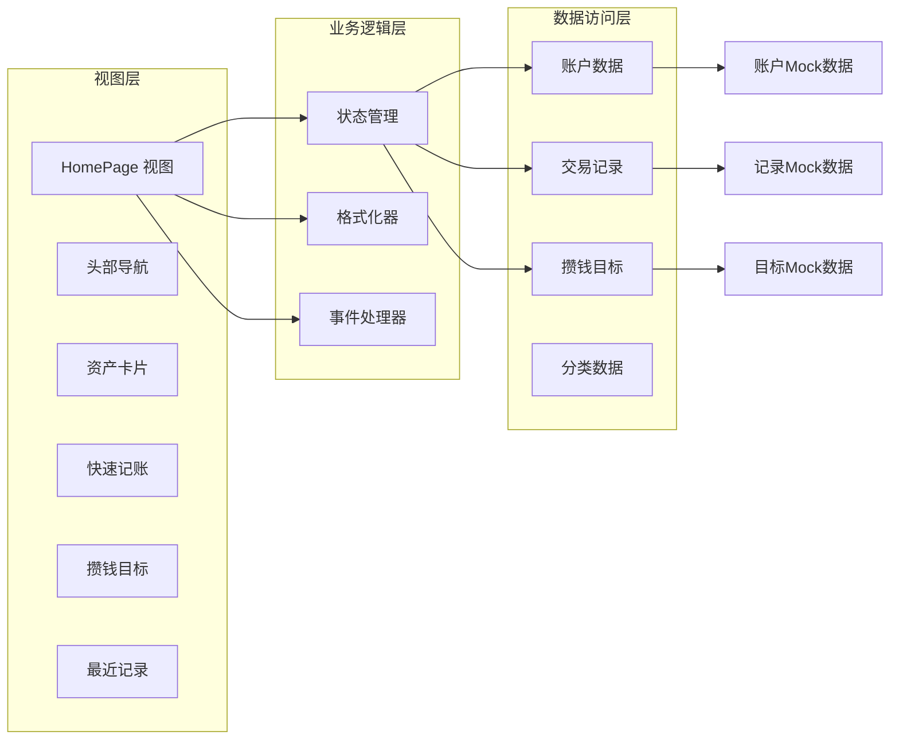
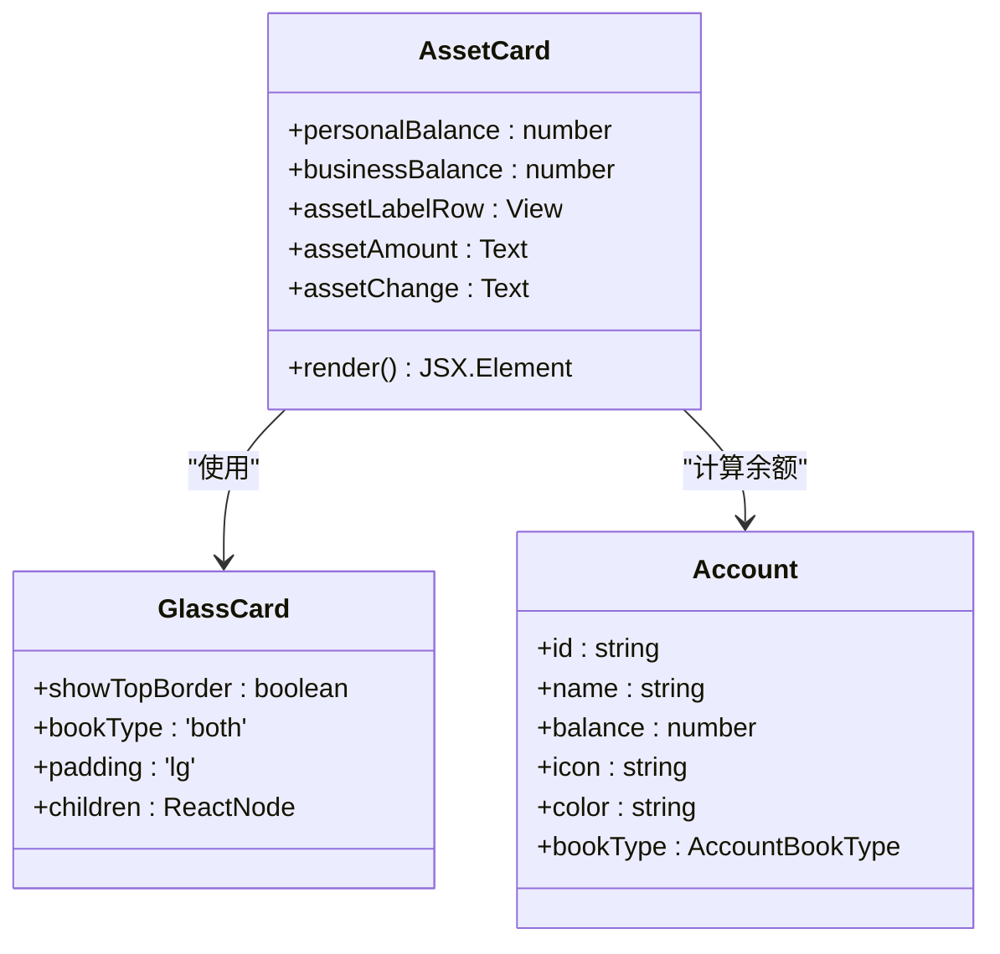
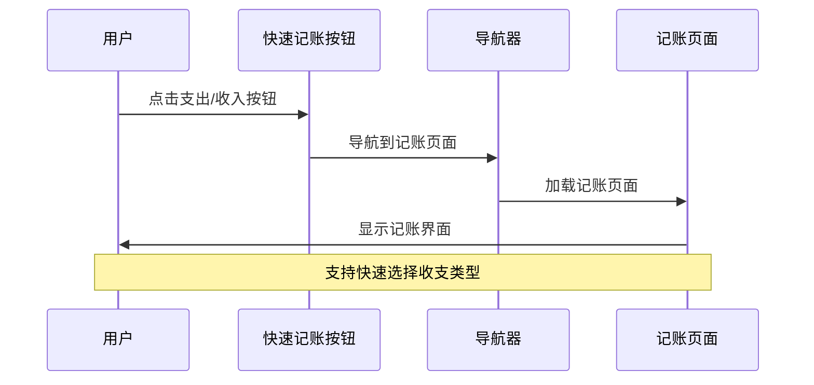
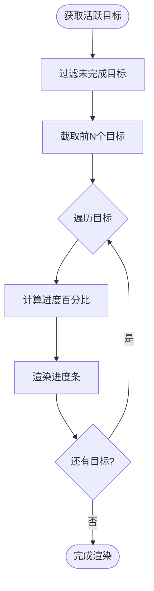
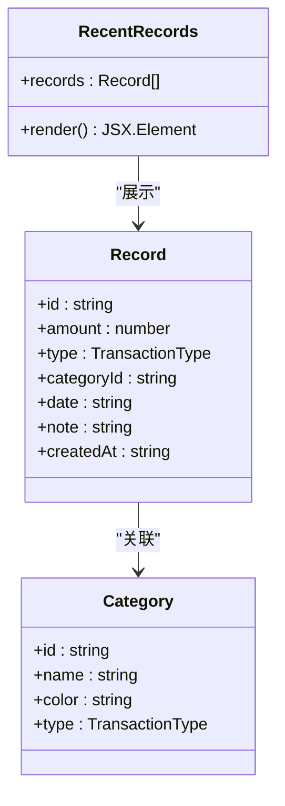
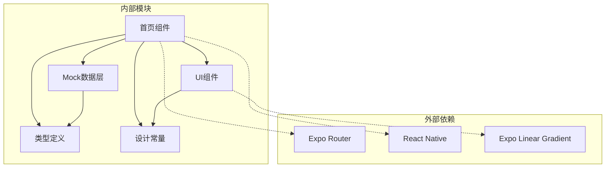

# 首页仪表板

<cite>
**本文档引用的文件**
- [src/app/(tabs)/index.tsx](file://src/app/(tabs)/index.tsx)
- [src/mocks/accounts.ts](file://src/mocks/accounts.ts)
- [src/mocks/records.ts](file://src/mocks/records.ts)
- [src/mocks/savings.ts](file://src/mocks/savings.ts)
- [src/types/index.ts](file://src/types/index.ts)
- [src/constants/colors.ts](file://src/constants/colors.ts)
- [src/constants/layout.ts](file://src/constants/layout.ts)
- [src/components/ui/GlassCard.tsx](file://src/components/ui/GlassCard.tsx)
- [src/app/_layout.tsx](file://src/app/_layout.tsx)
- [src/app/index.tsx](file://src/app/index.tsx)
</cite>

## 目录
1. [简介](#简介)
2. [项目结构](#项目结构)
3. [核心组件](#核心组件)
4. [架构概览](#架构概览)
5. [详细组件分析](#详细组件分析)
6. [依赖关系分析](#依赖关系分析)
7. [性能考虑](#性能考虑)
8. [故障排除指南](#故障排除指南)
9. [结论](#结论)
10. [附录](#附录)

## 简介

首页仪表板是"攒钱记账"应用的主界面，采用现代化的玻璃态设计风格，为用户提供财务数据的集中展示和快速操作入口。该界面通过直观的信息架构，帮助用户在第一时间了解个人和公司的财务状况，同时提供便捷的记账入口和目标追踪功能。

## 项目结构

首页仪表板位于应用的标签页导航系统中，采用分层架构设计：

```mermaid
graph TB
subgraph "应用层"
Root[_layout.tsx 根布局]
Home[index.tsx 首页]
Tabs[(tabs) 标签页组]
end
subgraph "数据层"
Mocks[Mock 数据层]
Types[类型定义]
end
subgraph "UI层"
Components[组件库]
Constants[设计常量]
end
Root --> Tabs
Tabs --> Home
Home --> Mocks
Home --> Components
Home --> Constants
Mocks --> Types
```

**图表来源**
- [src/app/_layout.tsx](file://src/app/_layout.tsx#L30-L47)
- [src/app/(tabs)/index.tsx](file://src/app/(tabs)/index.tsx#L1-L50)

**章节来源**
- [src/app/_layout.tsx](file://src/app/_layout.tsx#L1-L55)
- [src/app/(tabs)/index.tsx](file://src/app/(tabs)/index.tsx#L1-L50)

## 核心组件

首页仪表板包含以下核心组件：

### 1. 账本切换器
- 支持个人账本和个人公司账本的快速切换
- 响应式设计，根据当前选中状态显示不同的视觉反馈
- 集成阴影效果，提供层次感

### 2. 资产卡片
- 展示个人和公司账本的总资产
- 实时显示资产变化趋势
- 采用玻璃态设计，增强视觉深度

### 3. 快速记账入口
- 支出和收入两种快速入口
- 直观的图标和颜色编码
- 一键跳转到记账页面

### 4. 攒钱目标追踪
- 可视化的进度条显示
- 当前金额和目标金额对比
- 截止日期提醒

### 5. 最近记录展示
- 最新3条交易记录
- 分类图标和时间戳
- 清晰的收支标识

**章节来源**
- [src/app/(tabs)/index.tsx](file://src/app/(tabs)/index.tsx#L83-L254)
- [src/constants/colors.ts](file://src/constants/colors.ts#L14-L27)

## 架构概览

首页仪表板采用MVVM架构模式，通过Mock数据层提供数据支持：



**图表来源**
- [src/app/(tabs)/index.tsx](file://src/app/(tabs)/index.tsx#L47-L260)
- [src/mocks/accounts.ts](file://src/mocks/accounts.ts#L82-L90)
- [src/mocks/records.ts](file://src/mocks/records.ts#L100-L116)
- [src/mocks/savings.ts](file://src/mocks/savings.ts#L107-L110)

## 详细组件分析

### 资产卡片组件

资产卡片是首页的核心展示区域，采用双列布局设计：



**图表来源**
- [src/app/(tabs)/index.tsx](file://src/app/(tabs)/index.tsx#L120-L143)
- [src/components/ui/GlassCard.tsx](file://src/components/ui/GlassCard.tsx)
- [src/mocks/accounts.ts](file://src/mocks/accounts.ts#L82-L90)

资产卡片包含以下关键特性：

1. **双账本支持**: 同时显示个人和公司账本的资产情况
2. **实时计算**: 通过Mock函数动态计算总资产
3. **视觉区分**: 使用不同颜色标识两个账本
4. **变化趋势**: 显示当日资产变化情况

**章节来源**
- [src/app/(tabs)/index.tsx](file://src/app/(tabs)/index.tsx#L120-L143)
- [src/mocks/accounts.ts](file://src/mocks/accounts.ts#L82-L90)

### 快速记账组件

快速记账提供了一键式的记账入口：



**图表来源**
- [src/app/(tabs)/index.tsx](file://src/app/(tabs)/index.tsx#L145-L166)
- [src/app/(tabs)/record.tsx](file://src/app/(tabs)/record.tsx#L96-L140)

快速记账组件具有以下特点：

1. **双入口设计**: 支出和收入两个独立入口
2. **颜色编码**: 使用绿色表示收入，红色表示支出
3. **图标标识**: 直观的表情符号增强识别度
4. **快速导航**: 一键跳转到完整记账流程

**章节来源**
- [src/app/(tabs)/index.tsx](file://src/app/(tabs)/index.tsx#L145-L166)

### 攒钱目标追踪组件

攒钱目标追踪模块提供了可视化的目标进度展示：



**图表来源**
- [src/app/(tabs)/index.tsx](file://src/app/(tabs)/index.tsx#L170-L213)
- [src/mocks/savings.ts](file://src/mocks/savings.ts#L107-L110)

每个目标包含以下信息：
- 目标名称和图标
- 当前金额与目标金额对比
- 完成百分比进度条
- 截止日期显示

**章节来源**
- [src/app/(tabs)/index.tsx](file://src/app/(tabs)/index.tsx#L170-L213)
- [src/mocks/savings.ts](file://src/mocks/savings.ts#L107-L110)

### 最近记录展示组件

最近记录模块展示了用户的最新交易活动：



**图表来源**
- [src/app/(tabs)/index.tsx](file://src/app/(tabs)/index.tsx#L215-L254)
- [src/types/index.ts](file://src/types/index.ts#L46-L60)

最近记录包含以下信息：
- 分类图标和名称
- 交易备注
- 金额和时间
- 账本类型标识

**章节来源**
- [src/app/(tabs)/index.tsx](file://src/app/(tabs)/index.tsx#L215-L254)
- [src/mocks/records.ts](file://src/mocks/records.ts#L100-L116)

## 依赖关系分析

首页仪表板的依赖关系呈现清晰的分层结构：



**图表来源**
- [src/app/(tabs)/index.tsx](file://src/app/(tabs)/index.tsx#L1-L30)
- [src/mocks/accounts.ts](file://src/mocks/accounts.ts#L1-L10)
- [src/mocks/records.ts](file://src/mocks/records.ts#L1-L10)

主要依赖关系：

1. **数据依赖**: 通过Mock函数获取账户、记录和目标数据
2. **UI依赖**: 使用自定义组件和设计常量
3. **路由依赖**: 通过Expo Router进行页面导航
4. **样式依赖**: 基于统一的设计系统

**章节来源**
- [src/app/(tabs)/index.tsx](file://src/app/(tabs)/index.tsx#L1-L30)
- [src/constants/colors.ts](file://src/constants/colors.ts#L1-L88)

## 性能考虑

首页仪表板在设计时充分考虑了性能优化：

### 数据处理优化
- 使用Mock数据减少网络请求开销
- 本地计算总资产，避免重复计算
- 限制最近记录数量，控制渲染负载

### 渲染性能
- 采用虚拟滚动技术处理大量数据
- 合理使用缓存机制
- 优化组件重新渲染频率

### 内存管理
- 及时清理定时器和动画资源
- 合理管理图片和图标资源
- 避免内存泄漏

## 故障排除指南

### 常见问题及解决方案

**问题1: 数据不显示或显示错误**
- 检查Mock数据源是否正确加载
- 验证类型定义是否匹配
- 确认数据格式化函数正常工作

**问题2: 界面渲染异常**
- 检查样式属性是否正确
- 验证响应式布局适配
- 确认组件层级关系

**问题3: 导航问题**
- 检查路由配置是否正确
- 验证页面路径映射
- 确认导航参数传递

**章节来源**
- [src/app/(tabs)/index.tsx](file://src/app/(tabs)/index.tsx#L55-L58)
- [src/mocks/accounts.ts](file://src/mocks/accounts.ts#L82-L90)

## 结论

首页仪表板成功实现了财务数据的集中展示和快速操作功能。通过合理的架构设计和组件划分，为用户提供了直观、高效的财务管理体验。该设计充分体现了现代移动应用的设计原则，既保证了功能完整性，又确保了良好的用户体验。

## 附录

### 个性化配置选项

用户可以通过以下方式个性化首页仪表板：

1. **主题定制**: 支持不同的颜色主题切换
2. **布局调整**: 可调整各组件的显示顺序和大小
3. **数据筛选**: 支持按时间范围和账本类型筛选数据
4. **通知设置**: 可配置各种提醒和通知偏好

### 扩展开发指南

开发者可以按照以下步骤扩展首页功能：

1. **新增数据源**: 在Mock层添加新的数据接口
2. **组件扩展**: 创建新的UI组件并集成到布局中
3. **业务逻辑**: 添加相应的业务处理逻辑
4. **测试验证**: 确保新功能的正确性和稳定性