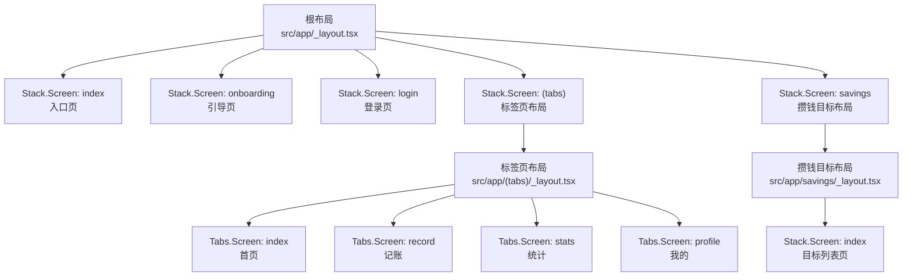
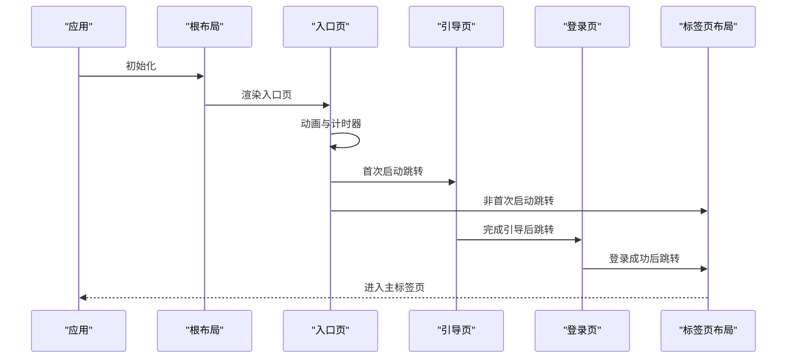
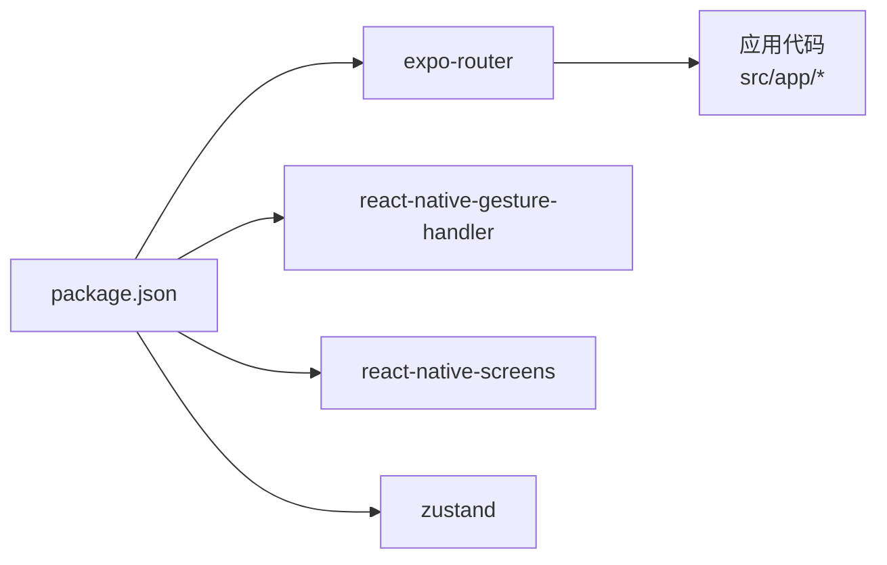

# 导航状态管理

<cite>
**本文引用的文件**
- [根布局 _layout.tsx](file://src/app/_layout.tsx)
- [标签页布局 _layout.tsx](file://src/app/(tabs)/_layout.tsx)
- [入口页 index.tsx](file://src/app/index.tsx)
- [引导页 onboarding.tsx](file://src/app/onboarding.tsx)
- [登录页 login.tsx](file://src/app/login.tsx)
- [攒钱目标布局 _layout.tsx](file://src/app/savings/_layout.tsx)
- [攒钱目标列表页 index.tsx](file://src/app/savings/index.tsx)
- [应用配置 app.json](file://app.json)
- [包依赖 package.json](file://package.json)
- [类型定义 index.ts](file://src/types/index.ts)
</cite>

## 目录
1. [简介](#简介)
2. [项目结构](#项目结构)
3. [核心组件](#核心组件)
4. [架构总览](#架构总览)
5. [详细组件分析](#详细组件分析)
6. [依赖关系分析](#依赖关系分析)
7. [性能考虑](#性能考虑)
8. [故障排除指南](#故障排除指南)
9. [结论](#结论)
10. [附录](#附录)

## 简介
本文件系统性梳理本项目基于 Expo Router 的导航状态管理机制，重点覆盖以下方面：
- 导航历史与路由状态：如何通过根布局与嵌套布局组织页面栈与标签页。
- 屏幕状态维护：页面进入/离开时的状态保持与切换策略。
- 导航栈管理策略：Stack.Screen 的配置项与页面生命周期行为。
- 导航事件监听与状态变更处理：在页面跳转中的状态同步与副作用控制。
- 性能优化：懒加载、预加载与内存管理建议。
- 调试工具与故障排除：常见问题定位与修复思路。
- 复杂导航场景的最佳实践：多层嵌套、条件跳转与状态恢复。

## 项目结构
本项目采用 Expo Router 的约定式路由，以文件夹结构表达导航层级与嵌套关系：
- 根布局负责顶层 Stack 定义与全局样式/动画配置。
- 标签页布局作为子 Stack，承载 Tab 导航。
- 入口页、引导页、登录页构成初始流程，最终进入标签页主界面。
- 攒钱目标模块以独立子路由存在，使用独立布局包裹。

图表来源
- [根布局 _layout.tsx](file://src/app/_layout.tsx#L33-L45)
- [标签页布局 _layout.tsx](file://src/app/(tabs)/_layout.tsx#L41-L86)
- [攒钱目标布局 _layout.tsx](file://src/app/savings/_layout.tsx#L8-L18)

章节来源
- [根布局 _layout.tsx](file://src/app/_layout.tsx#L17-L48)
- [标签页布局 _layout.tsx](file://src/app/(tabs)/_layout.tsx#L39-L88)
- [应用配置 app.json](file://app.json#L1-L29)

## 核心组件
- 根布局 Stack：集中声明顶层页面，统一设置动画与背景色，控制初始流程跳转。
- 标签页 Tabs：在标签页布局内声明各 Tab 页面，统一配置 Tab 样式与图标。
- 页面级路由控制：通过 router.replace 在不同阶段进行无历史栈跳转，确保流程顺畅。
- 嵌套路由：(tabs) 与 savings 作为子路由，分别承载 Tab 主页与目标模块。

章节来源
- [根布局 _layout.tsx](file://src/app/_layout.tsx#L33-L45)
- [标签页布局 _layout.tsx](file://src/app/(tabs)/_layout.tsx#L41-L86)
- [入口页 index.tsx](file://src/app/index.tsx#L53-L61)
- [引导页 onboarding.tsx](file://src/app/onboarding.tsx#L75-L82)
- [登录页 login.tsx](file://src/app/login.tsx#L53-L60)
- [攒钱目标布局 _layout.tsx](file://src/app/savings/_layout.tsx#L8-L18)

## 架构总览
下图展示从启动到进入主标签页的整体导航流程与状态变化：

图表来源
- [入口页 index.tsx](file://src/app/index.tsx#L53-L61)
- [引导页 onboarding.tsx](file://src/app/onboarding.tsx#L75-L82)
- [登录页 login.tsx](file://src/app/login.tsx#L53-L60)
- [根布局 _layout.tsx](file://src/app/_layout.tsx#L33-L45)

## 详细组件分析

### 根布局与全局导航策略
- 全局样式与动画：通过 screenOptions 设置 header 隐藏、内容背景色与滑动进入动画，统一视觉风格。
- 初始流程控制：在入口页完成首屏动画与计时后，根据“是否首次启动”决定跳转至引导页或直接进入标签页。
- 页面声明：在根布局中显式声明 index、onboarding、login、(tabs)、savings 等页面，确保路由表生成与导航可用。

章节来源
- [根布局 _layout.tsx](file://src/app/_layout.tsx#L33-L45)
- [入口页 index.tsx](file://src/app/index.tsx#L53-L61)

### 标签页布局与 Tab 状态
- 样式与图标：通过 screenOptions 统一 Tab 样式；每个 Tab 使用自定义图标组件，聚焦态与非聚焦态区分明显。
- 页面组织：四个 Tab 对应首页、记账、统计、我的，形成主功能区的导航骨架。
- 状态保持：Tab 切换时，Tab 页面通常保持挂载以提升交互流畅度；若需按需卸载，可在 screenOptions 中调整。

章节来源
- [标签页布局 _layout.tsx](file://src/app/(tabs)/_layout.tsx#L41-L86)

### 引导页与登录页的导航事件
- 引导页：支持分步引导与跳过，最后一步完成后替换路由至登录页。
- 登录页：模拟登录成功后替换路由至标签页布局，保证历史栈简洁。
- 路由替换策略：使用 replace 避免返回键回到中间流程，提升用户体验。

章节来源
- [引导页 onboarding.tsx](file://src/app/onboarding.tsx#L75-L82)
- [登录页 login.tsx](file://src/app/login.tsx#L53-L60)

### 攒钱目标模块的嵌套路由
- 独立布局：savings 使用独立布局包裹，便于统一样式与导航策略。
- 列表页：目标列表页提供筛选与空状态，点击目标可触发后续详情导航（当前示例中为日志输出）。

章节来源
- [攒钱目标布局 _layout.tsx](file://src/app/savings/_layout.tsx#L8-L18)
- [攒钱目标列表页 index.tsx](file://src/app/savings/index.tsx#L128-L136)

### 页面生命周期与状态维护
- 进入与退出：页面进入时初始化动画与状态；退出时清理定时器与动画，避免内存泄漏。
- 状态保持：Tab 页面通常保持挂载；其他页面在切换时可按需卸载以节省资源。
- 数据一致性：在跳转前确保本地状态已持久化或已提交，避免状态丢失。

章节来源
- [入口页 index.tsx](file://src/app/index.tsx#L21-L64)
- [标签页布局 _layout.tsx](file://src/app/(tabs)/_layout.tsx#L39-L88)

### 导航事件监听与状态变更处理
- 路由替换：在关键节点使用 replace 替换历史栈，避免用户返回到中间流程。
- 条件跳转：根据业务状态（如首次启动、登录状态）动态选择目标页面。
- 状态同步：在跳转前后同步全局状态（如用户信息、主题），确保页面渲染一致。

章节来源
- [入口页 index.tsx](file://src/app/index.tsx#L53-L61)
- [引导页 onboarding.tsx](file://src/app/onboarding.tsx#L75-L82)
- [登录页 login.tsx](file://src/app/login.tsx#L53-L60)

## 依赖关系分析
- 路由框架：expo-router 提供约定式路由与导航能力。
- 平台扩展：react-native-gesture-handler、react-native-screens 等增强手势与性能。
- 工具库：zustand 用于全局状态管理（可选）。

图表来源
- [包依赖 package.json](file://package.json#L11-L34)

章节来源
- [包依赖 package.json](file://package.json#L11-L34)
- [应用配置 app.json](file://app.json#L21-L26)

## 性能考虑
- 懒加载
  - 将不常用页面延迟加载，减少初始包体积与启动时间。
  - 对于 Tab 页面，保持挂载以提升切换性能；对于深层嵌套路由，可按需加载。
- 预加载
  - 在用户可能访问的页面前进行预加载，降低感知延迟。
  - 对于列表页的详情页，可在进入列表时预取必要数据。
- 内存管理
  - 在页面退出时清理定时器、动画与订阅，避免内存泄漏。
  - 使用稳定 key 控制页面实例复用，避免重复渲染。
- 动画与渲染
  - 使用原生驱动动画减少主线程压力。
  - 合理使用阴影、渐变等高开销样式，避免在滚动路径中频繁重绘。

## 故障排除指南
- 启动画面无法隐藏
  - 检查字体加载与启动画面隐藏逻辑是否正确执行。
  - 确保在字体加载完成后再隐藏启动画面。
- 路由跳转异常
  - 确认路由名称与文件夹命名一致，避免大小写与特殊字符问题。
  - 使用 replace 替代 push，避免历史栈过深导致返回卡顿。
- Tab 切换卡顿
  - 检查是否有重型计算或网络请求阻塞 UI 线程。
  - 减少不必要的重渲染，使用稳定 key 或 memo 化。
- 样式错乱
  - 确认全局样式与页面局部样式的优先级关系。
  - 检查平台差异（iOS/Android）导致的样式表现差异。

章节来源
- [根布局 _layout.tsx](file://src/app/_layout.tsx#L17-L28)
- [入口页 index.tsx](file://src/app/index.tsx#L21-L64)

## 结论
本项目通过约定式路由与清晰的布局分层，实现了从启动到主功能区的平滑导航流程。根布局统一管理全局导航策略，标签页布局承载主功能区，页面级路由控制确保流程可控。结合懒加载、预加载与内存管理策略，可进一步提升性能与稳定性。建议在复杂场景中引入全局状态管理与导航事件监听，以实现更精细的状态同步与用户体验优化。

## 附录
- 类型定义参考：账户、分类、账单、目标、预算、统计等核心类型，为导航与页面数据流提供类型保障。
  
章节来源
- [类型定义 index.ts](file://src/types/index.ts#L5-L76)