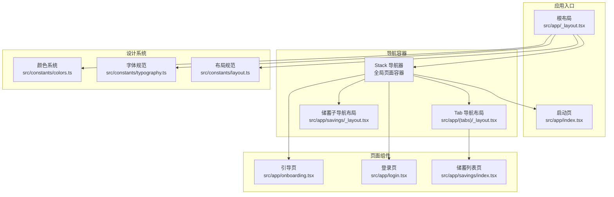
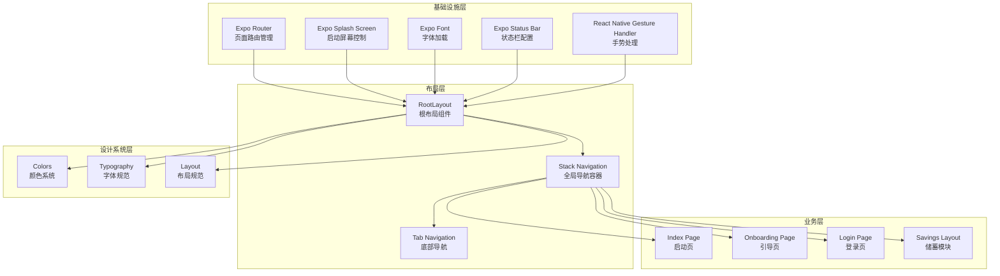
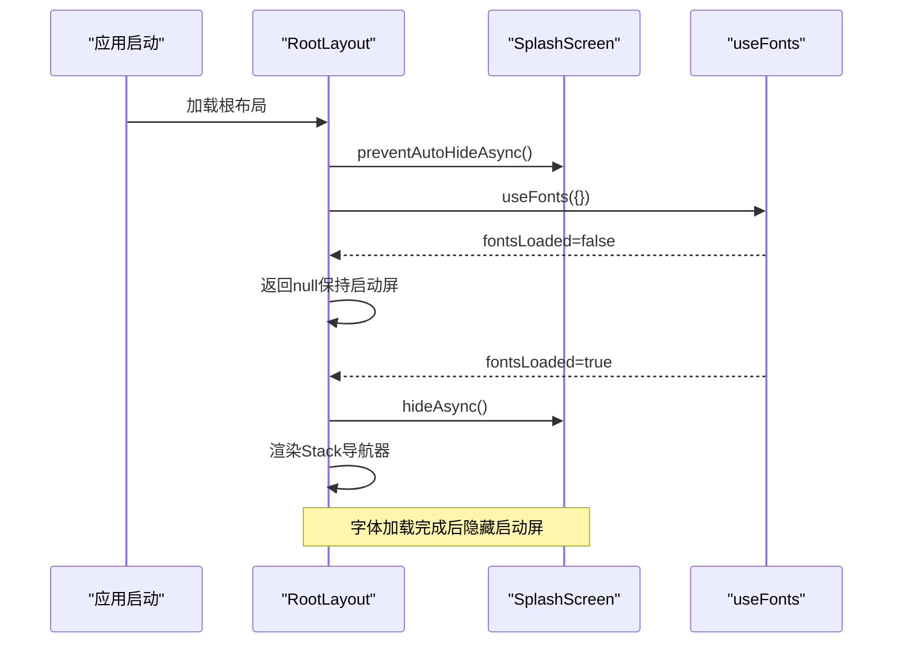
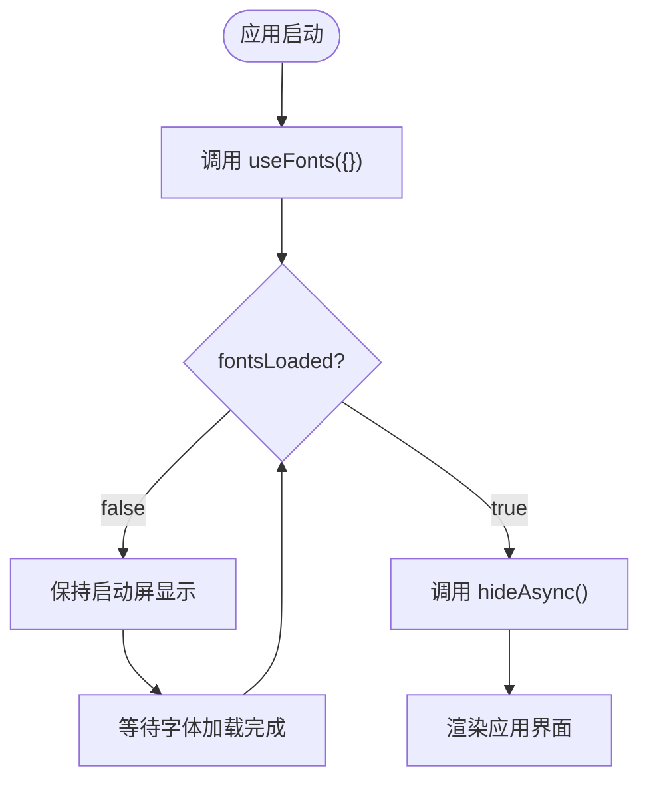
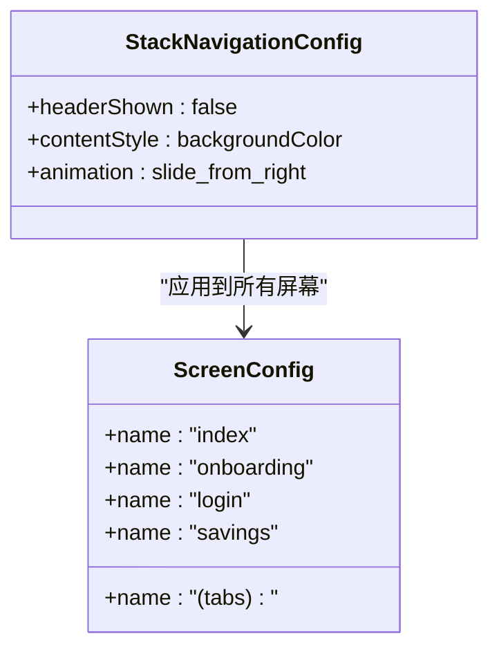
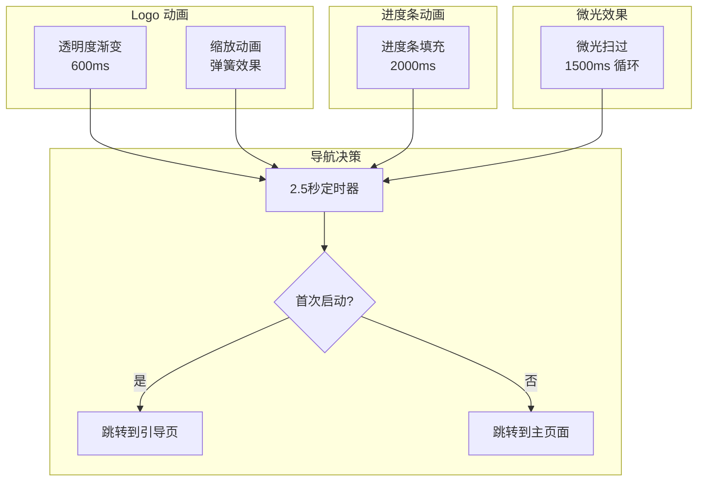
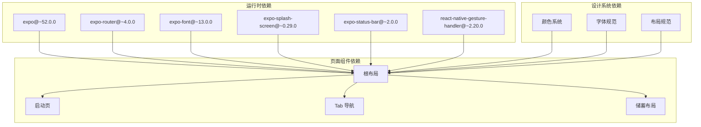

# 根布局配置

<cite>
**本文档引用的文件**
- [src/app/_layout.tsx](file://src/app/_layout.tsx)
- [src/app/index.tsx](file://src/app/index.tsx)
- [src/app/(tabs)/_layout.tsx](file://src/app/(tabs)/_layout.tsx)
- [src/app/savings/_layout.tsx](file://src/app/savings/_layout.tsx)
- [src/app/onboarding.tsx](file://src/app/onboarding.tsx)
- [src/app/login.tsx](file://src/app/login.tsx)
- [src/app/savings/index.tsx](file://src/app/savings/index.tsx)
- [src/constants/colors.ts](file://src/constants/colors.ts)
- [src/constants/typography.ts](file://src/constants/typography.ts)
- [src/constants/layout.ts](file://src/constants/layout.ts)
- [app.json](file://app.json)
- [package.json](file://package.json)
</cite>

## 目录
1. [简介](#简介)
2. [项目结构](#项目结构)
3. [核心组件](#核心组件)
4. [架构概览](#架构概览)
5. [详细组件分析](#详细组件分析)
6. [依赖关系分析](#依赖关系分析)
7. [性能考虑](#性能考虑)
8. [故障排除指南](#故障排除指南)
9. [结论](#结论)

## 简介

本文档深入解析了基于 Expo Router 的根布局配置实现，重点涵盖以下方面：
- RootLayout 组件的启动屏幕管理机制
- 字体加载与预加载策略
- 状态栏配置与手势处理根视图设置
- Stack 导航器的基础配置（屏幕选项、动画、背景色）
- 启动动画的实现逻辑（preventAutoHideAsync 与 hideAsync 的使用时机）
- 字体预加载策略与用户体验优化
- 根布局的最佳实践与常见问题解决方案

该应用采用 Expo Router 进行页面路由管理，结合 Expo 生态系统的启动屏幕、字体加载、状态栏和手势处理能力，构建了流畅且一致的用户体验。

## 项目结构

该项目采用基于功能的目录组织方式，根布局位于 `src/app/_layout.tsx`，负责全局导航容器和启动流程控制。主要模块包括：

**图表来源**
- [src/app/_layout.tsx](file://src/app/_layout.tsx#L1-L55)
- [src/app/index.tsx](file://src/app/index.tsx#L1-L249)
- [src/app/(tabs)/_layout.tsx](file://src/app/(tabs)/_layout.tsx#L1-L121)
- [src/app/savings/_layout.tsx](file://src/app/savings/_layout.tsx#L1-L20)

**章节来源**
- [src/app/_layout.tsx](file://src/app/_layout.tsx#L1-L55)
- [src/app/index.tsx](file://src/app/index.tsx#L1-L249)
- [src/app/(tabs)/_layout.tsx](file://src/app/(tabs)/_layout.tsx#L1-L121)
- [src/app/savings/_layout.tsx](file://src/app/savings/_layout.tsx#L1-L20)

## 核心组件

### RootLayout 根布局组件

RootLayout 是应用的根组件，承担以下职责：
- 启动屏幕管理（preventAutoHideAsync 与 hideAsync）
- 字体加载与预加载
- 状态栏配置
- 手势处理根视图设置
- Stack 导航器的基础配置

关键实现要点：
- 使用 `SplashScreen.preventAutoHideAsync()` 防止启动屏幕自动隐藏
- 通过 `useFonts` 钩子监控字体加载状态
- 在字体加载完成后调用 `SplashScreen.hideAsync()` 隐藏启动屏幕
- 设置 `headerShown: false` 隐藏默认导航栏
- 配置内容样式背景色为 `Colors.background`
- 使用 `slide_from_right` 动画效果

**章节来源**
- [src/app/_layout.tsx](file://src/app/_layout.tsx#L14-L48)
- [src/constants/colors.ts](file://src/constants/colors.ts#L29-L32)

### 启动页 SplashPage

启动页负责应用初始化过程中的视觉呈现：
- Logo 动画（透明度渐变 + 缩放弹簧效果）
- 进度条动画（2秒完成）
- 微光扫过动画（循环播放）
- 2.5秒后根据首次启动状态跳转到引导页或主页面

**章节来源**
- [src/app/index.tsx](file://src/app/index.tsx#L15-L64)

### 导航容器

#### Stack 导航器配置

全局 Stack 导航器配置：
- `headerShown: false` - 隐藏默认头部
- `contentStyle: { backgroundColor: Colors.background }` - 统一背景色
- `animation: 'slide_from_right'` - 页面切换动画

包含的屏幕：
- `index`: 启动页
- `onboarding`: 引导页
- `login`: 登录页
- `(tabs)`: Tab 导航布局
- `savings`: 储蓄子导航布局

#### Tab 导航布局

Tab 导航器配置：
- `headerShown: false` - 隐藏头部
- 自定义标签栏样式（圆角、阴影、颜色）
- 动态图标（聚焦状态与非聚焦状态）

**章节来源**
- [src/app/_layout.tsx](file://src/app/_layout.tsx#L33-L45)
- [src/app/(tabs)/_layout.tsx](file://src/app/(tabs)/_layout.tsx#L41-L48)

## 架构概览

应用采用分层架构，从底层到顶层的关系如下：

**图表来源**
- [src/app/_layout.tsx](file://src/app/_layout.tsx#L5-L12)
- [src/app/index.tsx](file://src/app/index.tsx#L5-L11)
- [src/app/(tabs)/_layout.tsx](file://src/app/(tabs)/_layout.tsx#L5-L10)

## 详细组件分析

### 启动屏幕管理流程

启动屏幕管理是根布局的核心功能之一，确保应用在字体加载完成前保持启动画面：

**图表来源**
- [src/app/_layout.tsx](file://src/app/_layout.tsx#L14-L28)

关键实现细节：
- `preventAutoHideAsync()` 必须在应用启动时调用，防止启动屏幕被意外隐藏
- `useFonts` 钩子返回的 `fontsLoaded` 状态作为渲染条件
- 隐藏启动屏的时机必须与字体加载完成严格同步

**章节来源**
- [src/app/_layout.tsx](file://src/app/_layout.tsx#L14-L28)

### 字体加载机制

字体加载采用 Expo Font 提供的 `useFonts` 钩子：

**图表来源**
- [src/app/_layout.tsx](file://src/app/_layout.tsx#L18-L24)

字体系统设计：
- 支持 iOS 和 Android 平台的系统字体
- 定义了完整的字体家族映射（regular、medium、semibold、bold）
- 提供多种字体大小和字重的预设样式

**章节来源**
- [src/app/_layout.tsx](file://src/app/_layout.tsx#L8-L8)
- [src/constants/typography.ts](file://src/constants/typography.ts#L9-L30)

### 状态栏配置

状态栏配置简洁明确：
- `style="dark"` - 设置状态栏图标为深色主题
- 与整体浅色背景形成良好对比度

**章节来源**
- [src/app/_layout.tsx](file://src/app/_layout.tsx#L32-L32)

### 手势处理根视图设置

应用使用 `GestureHandlerRootView` 作为根视图容器：
- 提供手势处理器的根视图环境
- 支持复杂的触摸和手势交互
- 确保手势事件正确传递到子组件

**章节来源**
- [src/app/_layout.tsx](file://src/app/_layout.tsx#L31-L31)

### Stack 导航器基础配置

Stack 导航器的全局配置体现了设计一致性：

**图表来源**
- [src/app/_layout.tsx](file://src/app/_layout.tsx#L34-L45)

配置特点：
- 统一的背景色设置，确保页面切换时视觉连续性
- 简洁的动画效果，避免过度动画影响性能
- 隐藏默认头部，完全自定义导航外观

**章节来源**
- [src/app/_layout.tsx](file://src/app/_layout.tsx#L33-L45)

### 启动动画实现逻辑

启动页的动画系统包含多个层次：

**图表来源**
- [src/app/index.tsx](file://src/app/index.tsx#L21-L64)

动画参数优化：
- Logo 动画：600ms 渐变 + 弹簧效果，营造自然的出现感
- 进度条：2000ms 填充时间，提供适当的等待感
- 微光：1500ms 循环，增加视觉趣味性
- 导航延迟：2.5秒，给用户充分的视觉体验时间

**章节来源**
- [src/app/index.tsx](file://src/app/index.tsx#L21-L64)

### 字体预加载策略

当前实现采用最小化的字体加载策略：
- `useFonts({})` 传入空对象，仅触发字体加载但不指定具体字体
- 依赖平台默认字体（iOS: System, Android: Roboto）
- 通过 `preventAutoHideAsync` 和 `hideAsync` 实现启动屏控制

这种策略的优势：
- 减少启动时间，避免不必要的字体文件加载
- 利用系统字体保证兼容性和性能
- 简化配置，降低维护成本

**章节来源**
- [src/app/_layout.tsx](file://src/app/_layout.tsx#L18-L18)
- [src/constants/typography.ts](file://src/constants/typography.ts#L10-L29)

## 依赖关系分析

应用的依赖关系体现了清晰的分层架构：

**图表来源**
- [package.json](file://package.json#L11-L34)
- [src/app/_layout.tsx](file://src/app/_layout.tsx#L5-L12)

**章节来源**
- [package.json](file://package.json#L11-L34)

## 性能考虑

基于当前实现的性能优化建议：

### 启动性能优化
- **字体加载优化**：考虑将常用字体预加载到 `assets/fonts` 目录，使用 `useFonts` 指定具体字体文件
- **启动屏优化**：确保启动屏图片与应用主题一致，减少视觉跳变
- **动画性能**：使用 `useNativeDriver: true` 优化动画性能，避免阻塞主线程

### 导航性能优化
- **懒加载**：对大型页面组件实施懒加载，减少初始包体积
- **缓存策略**：合理使用 React Navigation 的缓存机制
- **动画优化**：避免复杂的页面切换动画，保持简洁流畅

### 用户体验优化
- **加载指示器**：在字体加载期间提供进度指示器
- **错误处理**：添加字体加载失败的降级方案
- **响应式设计**：确保不同设备上的布局一致性

## 故障排除指南

### 启动屏幕无法隐藏问题
**症状**：应用启动后一直显示启动屏
**可能原因**：
- 忘记调用 `preventAutoHideAsync()`
- `fontsLoaded` 状态始终为 `false`
- `hideAsync()` 调用时机错误

**解决方案**：
1. 确认在根布局中调用了 `preventAutoHideAsync()`
2. 检查 `useFonts` 钩子的返回值
3. 确保在 `fontsLoaded` 为 `true` 时调用 `hideAsync()`

### 字体加载异常
**症状**：应用启动时字体显示异常或闪烁
**可能原因**：
- 字体文件路径错误
- 字体格式不支持
- 字体加载超时

**解决方案**：
1. 验证字体文件存在于 `assets/fonts` 目录
2. 确认字体格式为 `.ttf` 或 `.otf`
3. 考虑使用系统字体替代自定义字体

### 导航动画问题
**症状**：页面切换动画异常或卡顿
**可能原因**：
- 动画配置不当
- 复杂的页面结构导致渲染性能问题
- 手势冲突

**解决方案**：
1. 简化页面组件结构
2. 优化动画参数
3. 检查手势处理器配置

### 状态栏显示问题
**症状**：状态栏颜色与主题不匹配
**解决方案**：
1. 调整 `StatusBar` 组件的 `style` 属性
2. 确保状态栏颜色与背景色形成良好对比度

**章节来源**
- [src/app/_layout.tsx](file://src/app/_layout.tsx#L14-L28)
- [src/app/index.tsx](file://src/app/index.tsx#L21-L64)

## 结论

该根布局配置实现了以下关键特性：

### 成功实现的功能
- **完善的启动屏幕管理**：通过 `preventAutoHideAsync` 和 `hideAsync` 精确控制启动屏显示
- **简洁的字体加载机制**：利用 `useFonts` 钩子实现字体加载状态监控
- **统一的导航体验**：Stack 导航器提供一致的页面切换效果
- **良好的状态栏集成**：深色状态栏图标与整体设计风格协调

### 最佳实践总结
1. **启动流程控制**：始终在应用启动时调用 `preventAutoHideAsync()`，并在字体加载完成后调用 `hideAsync()`
2. **导航一致性**：使用全局配置确保所有页面具有统一的视觉和交互体验
3. **性能优先**：采用系统字体和简洁动画，平衡视觉效果与性能表现
4. **可维护性**：清晰的组件分离和依赖关系，便于后续扩展和维护

### 改进建议
1. **字体预加载**：考虑将常用字体文件预加载到本地，提升字体加载可靠性
2. **启动屏优化**：添加启动屏的进度指示器，改善用户体验
3. **错误处理**：增强字体加载失败的降级处理机制
4. **性能监控**：添加启动时间和内存使用的监控指标

该根布局配置为应用提供了稳定、一致且高性能的用户体验基础，为后续功能扩展奠定了坚实的技术基础。